# 10.6.1 Meshed beam cross-sections


**Products: **Abaqus/Standard  Abaqus/Explicit  

##### **References**

- [*BEAM GENERAL SECTION](../key/key-link.md#usb-kws-mbeamgensect)
- [*BEAM SECTION GENERATE](../key/key-link.md#usb-kws-hbeamsectiongen)
- [*SECTION ORIGIN](../key/key-link.md#usb-kws-hsectionorigin)
- [*SECTION POINTS](../key/key-link.md#usb-kws-msectionpoints)

### Overview

Meshed cross-sections:
- allow for the description of a beam cross-section including multiple materials and complex geometry;
- are meshed in Abaqus/Standard with two-dimensional warping elements, which have an out-of-plane warping displacement as the only degree of freedom;
- generate beam cross-section properties that can be used in a subsequent beam element analysis in either Abaqus/Standard or Abaqus/Explicit;
- allow only isotropic linear elastic material behavior (["Defining isotropic elasticity" in "Linear elastic behavior," Section 22.2.1](pt05ch22s02abm02.md#usb-mat-clinearelastic-isotropic)) or orthotropic linear elastic material behavior for warping elements (["Defining orthotropic elasticity for warping elements" in "Linear elastic behavior," Section 22.2.1](pt05ch22s02abm02.md#usb-mat-clinearelastic-orthowarp)); and
- allow stress and strain postprocessing on the beam element model or the two-dimensional warping element model.

### Introduction

The response of some structures is beam-like, yet the beam cross-section geometry or multi-material makeup of the cross-section do not permit the use of a predefined library beam cross-section. In these cases a meshed cross-section can be used to model the beam cross-section and to generate beam cross-section properties appropriate for subsequent use in a Timoshenko beam analysis. The beam properties are generated assuming a thick-walled (solid) cross-section with unconstrained out-of-plane warping, so open-section beam elements cannot use the beam cross-section properties generated from the meshed section (see ["Beam modeling: overview," Section 29.3.1](pt06ch29s03abo26.md)). The generated beam cross-section properties include axial, bending, torsional, and transverse shear stiffnesses; mass, rotary inertia, and damping properties; and the centroid and shear center of the cross-section. In addition, the equivalent beam cross-section properties include information on stress recovery, such as the warping function and its derivatives.

A typical example of a structure that requires a meshed cross-section is the hull of a ship for whipping analysis, where the ship's hull has a multi-cell and multi-material construction. Other examples include an airfoil-shaped rotor blade or wing, a layered composite I-beam (with fibers running along the length of the beam axis or perpendicular to it), etc.

### Modeling approach

As shown in [Figure 10.6.1--1](pt04ch10s06at35.md#ebeamlib-meshed), a meshed cross-section allows for a complex description of a beam cross-section: one which may include an arbitrary shape, multiple materials, multiple cells, and non-structural mass. The basic idea is to create a two-dimensional finite element model of the beam cross-section. The meshed cross-section is used in Abaqus/Standard to numerically calculate the properties required to characterize the structural response of the cross-section in a subsequent beam element analysis. The two-dimensional Abaqus/Standard analysis writes the cross-sectional properties to an input-file-ready text file (`jobname.bsp`). In the subsequent Abaqus/Standard or Abaqus/Explicit beam element analysis the beam elements requiring the meshed cross-section properties include the text file `jobname.bsp` as the general beam section data. Once the beam element analysis is complete, the Visualization module of Abaqus/CAE is used to visualize results at preselected points along the beam length or to examine detailed stress and strain results displayed directly on the two-dimensional meshed cross-section.

**Figure 10.6.1–1** An example of a meshed section profile.

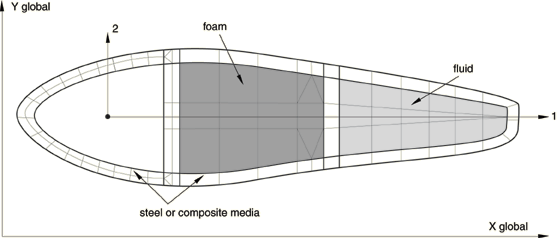

In summary, the procedure for analyzing and postprocessing a beam analysis using a meshed cross-section is as follows:

1. Mesh and analyze a two-dimensional Abaqus/Standard model of the beam cross-section.
2. Use the generated cross-sectional properties in an Abaqus/Standard or Abaqus/Explicit beam analysis.
3. Using the beam analysis results, postprocess from the beam model or the two-dimensional cross-section model.

#### Meshing and analyzing a two-dimensional model of the beam cross-section

The cross-section is meshed using special-purpose two-dimensional elements: WARP2D3 (3-node triangular) and WARP2D4 (4-node quadrilateral). These elements have one degree of freedom per node representing the value of the out-of-plane warping function (see ["Warping element library," Section 28.4.2](pt06ch28s04ael09.md)) and use a solid section definition; no section data are required. Adjacent elements in the cross-sectional mesh must share common nodes; mesh refinement using multi-point constraints is not allowed.

Each element in the cross-sectional mesh can refer to a different elastic material, using either isotropic linear elastic material behavior (see ["Defining isotropic elasticity" in "Linear elastic behavior," Section 22.2.1](pt05ch22s02abm02.md#usb-mat-clinearelastic-isotropic)) or orthotropic linear elastic material behavior for warping elements (see ["Defining orthotropic elasticity for warping elements" in "Linear elastic behavior," Section 22.2.1](pt05ch22s02abm02.md#usb-mat-clinearelastic-orthowarp)). Alternatively, density (["Density," Section 21.2.1](pt05ch21s02abm01.md)) can be the only material property specified, which is useful for modeling non-structural masses such as fuel in a tank.

The model is then analyzed by using the beam section property generation procedure within the step definition. This cross-section analysis will numerically calculate geometric, stiffness, and inertial properties of the section, including the warping function and shear center (see ["Meshed beam cross-sections," Section 3.5.6 of the Abaqus Theory Guide](../stm/stm-link.md#stm-elm-meshedsections)) and will write the calculated properties to the `jobname.bsp` text file. The contents of this text file, which can be used in a subsequent Abaqus/Standard or Abaqus/Explicit beam analysis, are described in detail below.

| **Input File Usage: ** | Use the following option to generate beam section properties for a meshed cross-section: |
| --- | --- |
|  | ``` [*BEAM SECTION GENERATE](../key/key-link.md#usb-kws-hbeamsectiongen) ``` |

##### Defining the origin of the cross-section

By default, the origin of the cross-section is the origin of the coordinate system used to define the mesh. You can override this default and input the coordinates of the origin directly or specify that the origin coincides with the shear center or centroid of the cross-section. A nondefault origin is particularly useful when the beam node to be used in the actual analysis does not coincide with the origin of the two-dimensional coordinate system.

| **Input File Usage: ** | Use both of the following options to input the coordinates of the origin directly: |
| --- | --- |
|  | ``` [*BEAM SECTION GENERATE](../key/key-link.md#usb-kws-hbeamsectiongen) [*SECTION ORIGIN](../key/key-link.md#usb-kws-hsectionorigin) ``` Use both of the following options to locate the origin at either the centroid or shear center: ``` [*BEAM SECTION GENERATE](../key/key-link.md#usb-kws-hbeamsectiongen) [*SECTION ORIGIN](../key/key-link.md#usb-kws-hsectionorigin), ORIGIN=CENTROID or SHEAR CENTER ``` |

##### Requesting output at particular integration points

Output to the output database can be recovered during the actual analysis at particular integration points on the cross-section. Requesting output at a large number of cross-sectional points may degrade performance.

| **Input File Usage: ** | Use both of the following options to request output at particular integration points: |
| --- | --- |
|  | ``` [*BEAM SECTION GENERATE](../key/key-link.md#usb-kws-hbeamsectiongen) [*SECTION POINTS](../key/key-link.md#usb-kws-msectionpoints) ``` |

##### Contents of the `*jobname*.bsp` text file

After the analysis to generate the cross-sectional properties completes, the `*jobname*.bsp` text file contains the following lines of data: 

```
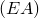, 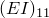, , 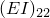, 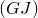 
, , , , ,  
[*TRANSVERSE SHEAR STIFFNESS](../key/key-link.md#usb-kws-mtransshearstiff) 
, 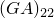,  
[*CENTROID](../key/key-link.md#usb-kws-mcentroid) 
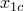,  
[*SHEAR CENTER](../key/key-link.md#usb-kws-mshearcenter) 
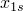,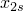 
[*DAMPING](../key/key-link.md#usb-kws-mdamping), ALPHA=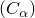, BETA=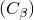, COMPOSITE= 
```
The first two lines of data in the `*jobname*.bsp` text file correspond to the section property data for an arbitrarily shaped solid general beam cross-section meshed with warping elements (see ["Defining linear section behavior for meshed cross-sections" in "Using a general beam section to define the section behavior," Section 29.3.7](pt06ch29s03alm12.md#usb-elm-eusingbeamgensect-meshed)).

If you requested output at particular integration points in the two-dimensional cross-section model generation, the `*jobname*.bsp` text file contains the following additional lines:

```
[*SECTION POINTS](../key/key-link.md#usb-kws-msectionpoints)
*section point label*, *2D element number*, *integration point number* 
*E*, , , , 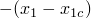, 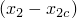, , 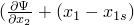 
...
```
where the set of two data lines is repeated for as many section points as requested.

The cross-sectional property information written to the `*jobname*.bsp` text file will be read into the general beam section definition in the subsequent beam analysis as described below.

#### Using the generated cross-section properties in a beam analysis

As discussed above, the section properties calculated and stored in the `jobname.bsp` text file can be used in an actual beam analysis to define cross-sections for beam elements. The data stored in `jobname.bsp` correspond to the section property data for an arbitrarily shaped solid general beam cross-section meshed with warping elements (see ["Defining linear section behavior for meshed cross-sections" in "Using a general beam section to define the section behavior," Section 29.3.7](pt06ch29s03alm12.md#usb-elm-eusingbeamgensect-meshed)). Consequently, a simple method of inserting these data is to include the `jobname.bsp` text file in the beam analysis.

| **Input File Usage: ** | Use the following options to generate section properties in a beam analysis: |
| --- | --- |
|  | ``` [*BEAM GENERAL SECTION](../key/key-link.md#usb-kws-mbeamgensect), SECTION=MESHED , ,  (direction cosines for ) [*INCLUDE](../key/key-link.md#usb-kws-minclude), INPUT=`*jobname*.bsp` ``` |

#### Postprocessing from the beam model or the two-dimensional cross-section model

A tickmark contour plot can be used to visualize stress and strain output along the length of the beam model. All stress and strain components requested for the two-dimensional cross-section model generation will be available. Contour plots of stress and strain on the two-dimensional cross-section are also available. The section geometry is read from the output database generated by the two-dimensional cross-section analysis, while the generalized section results are read from the output database generated by the beam analysis.

### Initial conditions

Initial conditions are not meaningful when generating beam section properties and are ignored.

### Boundary conditions

Boundary conditions are not meaningful when generating beam section properties and are ignored.

### Loads

Loads are not meaningful when generating beam section properties and are ignored.

### Predefined fields

Temperature and field variables are not allowed for meshed sections.

### Material options

Only the following material behaviors are allowed for meshed sections:
- isotropic linear elasticity (["Defining isotropic elasticity" in "Linear elastic behavior," Section 22.2.1](pt05ch22s02abm02.md#usb-mat-clinearelastic-isotropic))
- orthotropic linear elasticity for warping elements (["Defining orthotropic elasticity for warping elements" in "Linear elastic behavior," Section 22.2.1](pt05ch22s02abm02.md#usb-mat-clinearelastic-orthowarp))
- density (["Density," Section 21.2.1](pt05ch21s02abm01.md))

### Elements

Warping elements must be used to mesh the two-dimensional cross-section. See ["Warping elements," Section 28.4.1](pt06ch28s04alm04.md), for details.

### Output

Element output is calculated during the actual beam analysis at the integration points on the meshed cross-section that are selected in the property generation analysis as described above. Output from the property generation analysis is available only on the output database. The Visualization module of Abaqus/CAE can be used to generate contour plots of element output on the cross-section, which requires the output databases from both the section property generation analysis (the cross-section model) and the actual beam analysis. For more information, see the example Python script in ["Viewing the analysis of a meshed beam cross-section," Section 9.10.10 of the Abaqus Scripting User's Guide](../cmd/cmd-link.md#cmd-odb-intro-exa-beamanalysis-pyc).

### Input file template

#### Generating the cross-section properties in an Abaqus/Standard analysis

```
[*HEADING](../key/key-link.md#usb-kws-mheading)
Meshed cross section
...
[*NODE](../key/key-link.md#usb-kws-mnode), NSET=ALL
...
[*ELEMENT](../key/key-link.md#usb-kws-melement), TYPE=WARP2D3, ELSET=TRI
...
[*ELEMENT](../key/key-link.md#usb-kws-melement), TYPE=WARP2D4, ELSET=QUAD
...
[*SOLID SECTION](../key/key-link.md#usb-kws-msolidsection), MATERIAL=COMPOSITE, ELSET=TRI
[*MATERIAL](../key/key-link.md#usb-kws-mmaterial),NAME=COMPOSITE
[*ELASTIC](../key/key-link.md#usb-kws-melastic), TYPE=TRACTION
E, G1, G2
[*DENSITY](../key/key-link.md#usb-kws-mdensity)
...
[*SOLID SECTION](../key/key-link.md#usb-kws-msolidsection), MATERIAL=MASS_ONLY, ELSET=QUAD
[*MATERIAL](../key/key-link.md#usb-kws-mmaterial), NAME=MASS_ONLY
[*DENSITY](../key/key-link.md#usb-kws-mdensity)
...
[*STEP](../key/key-link.md#usb-kws-hstep)
[*BEAM SECTION GENERATE](../key/key-link.md#usb-kws-hbeamsectiongen)
[*SECTION ORIGIN](../key/key-link.md#usb-kws-hsectionorigin)
X, Y
[*SECTION POINTS](../key/key-link.md#usb-kws-msectionpoints)
*section point label*, *element number*, *integration point number*
[*END STEP](../key/key-link.md#usb-kws-hendstep)
```

#### Using the generated cross-section properties in a subsequent Abaqus/Standard or Abaqus/Explicit beam analysis

```
[*HEADING](../key/key-link.md#usb-kws-mheading)
	Beam analysis
...
[*NODE](../key/key-link.md#usb-kws-mnode), NSET=NALL
...
[*ELEMENT](../key/key-link.md#usb-kws-melement), TYPE=B31, ELSET=BEAM1
... 
[*BEAM GENERAL SECTION](../key/key-link.md#usb-kws-mbeamgensect), SECTION=MESHED  
, ,  *(direction cosines for )*  
[*INCLUDE](../key/key-link.md#usb-kws-minclude), INPUT=*jobname*.bsp 
... 
[*STEP](../key/key-link.md#usb-kws-hstep) 
[*DYNAMIC](../key/key-link.md#usb-kws-hdynamic) 
... 
[*BOUNDARY](../key/key-link.md#usb-kws-hboundary) 
... 
[*CLOAD](../key/key-link.md#usb-kws-hcload) 
... 
[*OUTPUT](../key/key-link.md#usb-kws-houtput) 
[*ELEMENT OUTPUT](../key/key-link.md#usb-kws-helementoutput) 
... 
[*END STEP](../key/key-link.md#usb-kws-hendstep)
```


