# 11.1.1 Inertia relief


**Products: **Abaqus/Standard  Abaqus/CAE  

##### **References**

- ["Distributed loads," Section 34.4.3](pt07ch34s04aus122.md)
- ["Defining an analysis," Section 6.1.2](pt03ch06s01abo05.md)
- [*INERTIA RELIEF](../key/key-link.md#usb-kws-hinertiareliefload)
- ["Defining an inertia relief load," Section 16.9.16 of the Abaqus/CAE User's Guide](../usi/usi-link.md#usi-lbi-loadeditors-inertia)

### Overview

Inertia relief:
- involves balancing externally applied forces on a free or partially constrained body with loads derived from constant rigid body accelerations;
- requires material density or mass and/or rotary inertia values to be specified for computing inertia relief loads;
- can be performed for static, dynamic, and buckling analyses in Abaqus/Standard;
- varies the inertia relief loading with the applied loading in static analysis;
- applies inertia relief load corresponding to the static preload in dynamic analysis;
- can be used to balance applied perturbation loads when used with buckling analysis;
- uses rigid body accelerations consistent with the specified boundary conditions to compute the inertia relief loads;
- can be geometrically linear or nonlinear;
- may require the use of the unsymmetric solver if there are large inertia relief moments in a geometrically nonlinear analysis;
- is an inexpensive alternative to doing a full dynamic free body analysis when applied loads vary slowly compared to the eigenfrequencies of the body; and
- can be used with multiple load cases.

### Typical applications

Inertia relief loading can be applied in static (["Static stress analysis," Section 6.2.2](pt03ch06s02at01.md)), dynamic (["Implicit dynamic analysis using direct integration," Section 6.3.2](pt03ch06s03at07.md)), and eigenvalue buckling prediction steps (["Eigenvalue buckling prediction," Section 6.2.3](pt03ch06s02at02.md)). 

In a static step the inertia relief loading varies with the applied external loading. An example of using an inertia relief load is modeling a rocket undergoing constant or slowly varying acceleration during lift-off (i.e., a free body subjected to a constant or slowly varying external force) with a static analysis procedure. The inertia forces experienced by the body are included in the static solution through inertia relief loading that balances the external loading.

In a dynamic step the inertia relief loading is calculated based on the static preload and is held constant during the step. The following is an example of using an inertia relief load in a dynamic analysis procedure: Consider a free body submerged in water and subjected to shock wave loading due to an explosion. A dynamic analysis is needed to compute the transient solution. If it is known that initially the body is stationary under gravity and hydrostatic pressure from the fluid, the gravity load should exactly balance the buoyancy force. However, if the finite element model does not include all the mass existing in the body (for example, ballast), without additional loading, the body would accelerate due to out-of-balance external forces. Applying inertia relief loading exactly balances these unbalanced external loads, placing the body in static equilibrium. The dynamic analysis then provides the transient response of the body to the shock wave loading as deformation of the body relative to its static equilibrium position.

In a buckling analysis the inertia relief load can be applied in the static preload step, in the eigenvalue buckling prediction step, or in both steps. In the eigenvalue buckling prediction step the inertia relief load is calculated based on the perturbation loads. Consider the static analysis rocket example. If we use inertia relief in a buckling analysis of the rocket with the rocket thrust as the perturbation load, we can predict the critical thrust that causes the rocket to buckle.

### Basic formulation

In inertia relief the total response, , of the body is written as a combination of a rigid body response due to rigid body motion of a reference point, 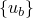, and a relative response, : 


with corresponding expressions for velocities and accelerations. The reference point is the center of mass except when you must specify the reference point. Then, the finite element approximation to the dynamic equilibrium equation becomes


where  is the mass matrix, 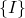 is the internal force vector, and  is the external force vector. The response of interest in a static analysis involving inertia relief is the rigid body response corresponding to the dynamic motion of the reference point and the static response relative to the rigid body motion. Hence, the relative acceleration term  drops from the equilibrium equation.

The rigid body response can be expressed in terms of the acceleration of the reference point, 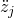, and rigid body mode vectors, ,  (in three dimensions):


By definition,  represents the acceleration vector corresponding to a unit imposed acceleration (displacement or rotation) in the *j*-direction at the reference point. For example, at a node with the usual three displacements and three rotations  is 

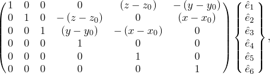

where  is unity; all other  are zero; *x*, *y*, and *z* are the coordinates of the node; and , , and  represent the coordinates of the reference point that is the center of rotation. If the system undergoes finite changes in geometry,  and  will both be functions of time.

Projecting the dynamic equilibrium equation onto the rigid body modes, we have


where  is the “rigid body inertia” and  is the rigid body acceleration associated with the rigid body mode *j*. The actual number of rigid body modes will be less than 6 in the presence of symmetry planes as well as for two-dimensional and axisymmetric analyses. Thus, the rigid body response can be evaluated directly from the external loads. 

The relative response of the body can be obtained by solving the equilibrium equation with the known inertial term  moved to the right hand side; that is, applied as a body force. The static equilibrium equation then becomes

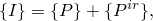

 where 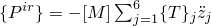.

In a dynamic analysis involving inertia relief the rigid body mode vectors 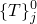 are calculated in the configuration at the start of the dynamic analysis, and the reference point accelerations  are calculated to balance the static preloads in this configuration. The relative acceleration term is not dropped, so the dynamic equilibrium equation becomes

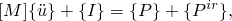

where 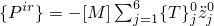. In a geometrically nonlinear analysis the rigid body mode vectors are recomputed during the analysis using the current configuration but the reference point accelerations are kept constant. This keeps the total magnitude of inertia relief loads constant during the analysis but allows the loads to be proportional to the spatial mass distribution, which changes with geometry.

| **Input File Usage: ** | ``` [*INERTIA RELIEF](../key/key-link.md#usb-kws-hinertiareliefload) ``` |
| --- | --- |

| **Abaqus/CAE Usage: ** | Load module: **Create Load**: choose **Mechanical** for the **Category** and **Inertia relief** for the **Types for Selected Step** |
| --- | --- |

### Inertia relief loading directions

By default, all rigid body motion directions in a model can be loaded by inertia relief loading (in this discussion we use the word “direction” to mean any rigid body translation or rotation). In models with symmetry planes or models that are allowed to move freely in only specific directions, the free directions for which inertia relief loading is applied can be specified. For example, in a three-dimensional analysis with one symmetry plane only three free directions exist—two translations and one rotation. Add an additional symmetry plane and only one free translation remains. A cylinder-piston arrangement is an example where the only free direction considered is motion along the cylinder's axis. In these situations you specify the free directions that are loaded by inertia relief loading by indicating the degrees of freedom.

The case of two free rotation directions is not permitted. For cyclic symmetric models with inertia relief only translation in the *Z*-direction and rotation about the *Z*-direction are considered for computing inertia relief loading.

| **Input File Usage: ** | ``` [*INERTIA RELIEF](../key/key-link.md#usb-kws-hinertiareliefload) *integer list of global degrees of freedom identifying the free directions* ``` |
| --- | --- |
|  | For example, the list 1, 3, 5 implies that translations in the *X*- and *Z*-directions and rotation about the *Y*-axis are free directions. |

| **Abaqus/CAE Usage: ** | Load module: **Create Load**: choose **Mechanical** for the **Category** and **Inertia relief** for the **Types for Selected Step**: toggle on the degrees of freedom to define the **Free Directions** (the degrees of freedom displayed are dependent on the modeling space) |
| --- | --- |

#### Defining the free directions in a local coordinate system

If the free directions are not global directions, an orientation can be used to define the local coordinate system to which the integer list of degree of freedom identifiers refers.

| **Input File Usage: ** | ``` [*INERTIA RELIEF](../key/key-link.md#usb-kws-hinertiareliefload), ORIENTATION=*orientation_name* *integer list of local degrees of freedom identifying the free directions* ``` |
| --- | --- |

| **Abaqus/CAE Usage: ** | Load module: **Create Load**: choose **Mechanical** for the **Category** and **Inertia relief** for the **Types for Selected Step**: click **Edit**, and choose a local **CSYS** |
| --- | --- |

#### Defining free direction combinations that require a user-specified reference point

Not all user-chosen combinations of free directions admit unconstrained rigid body motion; that is, there are certain combinations of free directions for which an additional point is required to define the rigid body motion vectors. For example, in three dimensions the choice 4, 5, 6 corresponds to free rotations about a fixed point. The fixed point must be given to define the rigid body motion vectors. In other examples the free directions include rotation about a fixed axis. Consider a turbine blade rotating about its axis, as shown in [Figure 11.1.1--1](pt04ch11s01at37.md#ainertiarelief-turbineblade). 

**Figure 11.1.1–1** Inertia relief for a turbine blade with rotation about the axis as the only free direction.

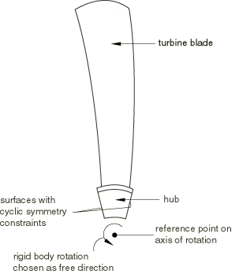

To find the angular acceleration of the blade as it rotates under an applied force couple or moment, you should specify the coordinates of the point on the shaft about which the blade is rotating. The free direction combinations for which you must specify a reference point are given in [Table 11.1.1--1](pt04ch11s01at37.md#ainertiarelief-reftable).

| **Input File Usage: ** | ``` [*INERTIA RELIEF](../key/key-link.md#usb-kws-hinertiareliefload), ORIENTATION=*orientation_name* *integer list of local degrees of freedom identifying the free directions* *X, Y, Z coordinates of the reference point for defining the rigid body vectors* ``` |
| --- | --- |

| **Abaqus/CAE Usage: ** | Load module: **Create Load**: choose **Mechanical** for the **Category** and **Inertia relief** for the **Types for Selected Step**: toggle on **Global position of reference point**, and enter the **X**, **Y**, and (if available) **Z** coordinates |
| --- | --- |

**Table 11.1.1–1** Free direction combinations requiring a reference point.
| Degree of freedom identifiers defining free directions | Reference point definition |
| --- | --- |
| Fixedrotation point | Point on rotation axis | Point on symmetry line |
| 4, 5, 6 |  |  |  |
| 1, 4, 5, 6 |  |  |  |
| 2, 4, 5, 6 |  |  |  |
| 3, 4, 5, 6 |  |  |  |
| 1, 2, 4, 5, 6 |  |  |  |
| 1, 3, 4, 5, 6 |  |  |  |
| 2, 3, 4, 5, 6 |  |  |  |
| 4 |  |  |  |
| 5 |  |  |  |
| 6 |  |  |  |
| 2, 4 |  |  |  |
| 3, 4 |  |  |  |
| 1, 5 |  |  |  |
| 3, 5 |  |  |  |
| 1, 6 |  |  |  |
| 2, 6 |  |  |  |
| 1, 2, 4 |  |  |  |
| 1, 2, 5 |  |  |  |
| 1, 3, 4 |  |  |  |
| 1, 3, 6 |  |  |  |
| 2, 3, 5 |  |  |  |
| 2, 3, 6 |  |  |  |
| 1, 4 |  |  |  |
| 2, 5 |  |  |  |
| 3, 6 |  |  |  |

### Initial conditions

Initial conditions can be specified in the same way as in static and dynamic analyses without inertia relief loads. If inertia relief is used in the first step in the analysis, these initial conditions form the base state of the body. See ["Initial conditions in Abaqus/Standard and Abaqus/Explicit," Section 34.2.1](pt07ch34s02aus116.md).

### Boundary conditions

Boundary conditions are specified in the same way as in analyses without inertia relief loads (see ["Boundary conditions in Abaqus/Standard and Abaqus/Explicit," Section 34.3.1](pt07ch34s03aus118.md)). In theory, a statically determinate set of restraints is needed when inertia relief is used in a static step. By “statically determinate” we mean a set of restraints that restrain all rigid body modes but no deformation modes. Such a set provides a unique displacement solution and ensures that the inertia relief loading exactly balances the user-specified external loading: zero reaction forces with no rigid body motion of the center of mass. [Table 11.1.1--2](pt04ch11s01at37.md#ainertiarelief-bctable) summarizes the restraint requirements for various cases.

**Table 11.1.1–2** Necessary and sufficient statically determinate restraints.
| Problem dimensionality | Free directions | Number of required restraints |
| --- | --- | --- |
| 2D | 2 Translations and 1 Rotation | 3 |
| Axisymmetric | 1 Translation | 1 |
| Axisymmetric with twist | 1 Translation and 1 Rotation | 2 |
| 3D | 3 Translations and 3 Rotations | 6 |

However, it is not necessary for the user to explicitly specify boundary conditions (["Boundary conditions in Abaqus/Standard and Abaqus/Explicit," Section 34.3.1](pt07ch34s03aus118.md)) with inertia relief except in the case of buckling analysis. If no boundary conditions or insufficient boundary conditions are specified, a warning message will be issued and boundary conditions necessary to restrain the rigid body modes will be imposed internally at the point in the model that corresponds to the original location of the reference point. On the other hand, if too many boundary conditions are specified in certain directions, a warning message will be issued to indicate that the reaction forces may be nonzero at the nodes with overspecified boundary conditions. If there are insufficient boundary conditions in certain directions and too many boundary conditions in other directions, the problem will be treated as a combination of these cases.

If a model has no boundary conditions or insufficient boundary conditions, a particular number of numerical singularity warnings can be issued during each equilibrium iteration in the analysis. The displacement solution is postprocessed to remove unconstrained rigid body motion. However, the number of numerical singularities should not exceed the number of unconstrained rigid body modes; any extra numerical singularity messages may indicate other problems.  

Similarly, a model with no boundary conditions or insufficient boundary conditions may produce negative eigenvalue messages. If the number of negative  eigenvalues at each equilibrium iteration in the analysis does not exceed the maximum  reasonable number of numerical singularities associated with the boundary conditions for inertia relief, the results can be trusted, but extra negative eigenvalues may indicate other problems.

If a model contains symmetry planes or is constrained to move freely in specific directions, inertia relief loading should be applied only in those free directions. No boundary conditions should be specified in the free directions; however, sufficient boundary conditions must be specified in the other directions. Any boundary conditions that violate the above requirements will be flagged as an error. An error will also be issued if the combination of free directions includes only two free rotations or if a reference point is required but not specified.

In a buckling analysis, proper boundary conditions are important for getting the correct mode shape. Sufficient boundary conditions must be specified when inertia relief loading is applied in such an analysis. See ["Eigenvalue buckling prediction," Section 6.2.3](pt03ch06s02at02.md), for details on how to apply boundary conditions in a buckling analysis.

### Loads

An analysis that uses inertia relief can include concentrated nodal forces at displacement degrees of freedom (1–6), distributed pressure forces or body forces, and user-defined loading.

Inertia relief loads are used to balance the external loads. They are computed and applied when inertia relief is included in the step definition. The rules for propagating load definitions between steps hold for inertia relief loads. See ["Applying loads: overview," Section 34.4.1](pt07ch34s04aus120.md). The inertia relief loads will not be propagated to steps where inertia relief is not valid for the specified procedure.

If there are large inertia relief moments in a geometrically nonlinear analysis, their contribution to the stiffness matrix may be unsymmetric. In such cases unsymmetric equation solution may improve the computational efficiency (see ["Defining an analysis," Section 6.1.2](pt03ch06s01abo05.md)).

#### Computing inertia relief loads

The nodal force vector corresponding to the inertia relief loads is calculated as follows. The applied loads are projected onto the rigid body modes, . These force and moment components (six components in three dimensions) are used with the “rigid body inertia” to solve for the rigid body accelerations, . Only the rigid body acceleration components corresponding to the inertia relief loading directions are nonzero. The nodal force vector is calculated using the assembled mass matrix  as

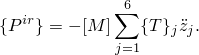

##### Fixed inertia relief loads

You can specify that the inertia relief loads should be held fixed in magnitude and direction at the values calculated at the end of the previous step.

| **Input File Usage: ** | ``` [*INERTIA RELIEF](../key/key-link.md#usb-kws-hinertiareliefload), FIXED ``` |
| --- | --- |

| **Abaqus/CAE Usage: ** | Load module: **Create Load**: choose **Mechanical** for the **Category** and **Inertia relief** for the **Types for Selected Step**: **Method: Fix at current loading** |
| --- | --- |

##### Removing inertia relief loads

You can specify that the inertia relief loads that were applied in the previous general analysis step should be removed in the current step.

| **Input File Usage: ** | ``` [*INERTIA RELIEF](../key/key-link.md#usb-kws-hinertiareliefload), REMOVE ``` |
| --- | --- |

| **Abaqus/CAE Usage: ** | Load module: **Load Manager**: **Deactivate** |
| --- | --- |

### Predefined fields

User-defined field variables can be specified in the same way as in static and dynamic analyses without inertia relief loads. See ["Predefined fields," Section 34.6.1](pt07ch34s06aus128.md).

### Material options

Any of the mechanical constitutive models that are available in Abaqus/Standard for use in static, dynamic, or buckling analyses can be used with inertia relief (see [Part V, "Materials](pt05.md),” for details on the material models available in Abaqus/Standard). Since inertia relief loading is calculated using the inertia properties of the model, the density must be specified (see ["Density," Section 21.2.1](pt05ch21s02abm01.md)) to define the model's inertia properties.

### Elements

Most of the stress/displacement elements that are available in Abaqus/Standard for use in static, dynamic, and buckling analyses (including mass and rotary inertia elements and user elements) can be used. A warning will be issued when the model contains elements that do not have associated mass or inertia (for example, hydrostatic fluid elements and pore pressure elements). An error will be issued if the model contains elements that do not allow finite boundaries (for example, infinite elements and elastic element foundations). Although five degree of freedom shell elements can be used in a step with inertia relief loads, they may cause convergence difficulties if the model has no boundary conditions or insufficient boundary conditions. To improve convergence, these elements should be replaced with other conventional shell elements.

In the case of a substructure you must generate a reduced mass matrix for the substructure (see ["Generating a reduced structural damping matrix for a substructure" in "Defining substructures," Section 10.1.2](pt04ch10s01aus59.md#usb-anl-asuperelementdef-genreducedmassmatrix)). The reduced mass matrix is included in the global mass matrix of the entire model to compute rigid body accelerations and inertia relief loads. Inertia relief can be used only with substructures in a geometrically linear analysis. An error message is issued if inertia relief is used with substructures in a geometrically nonlinear analysis.

### Output

In addition to the usual output variables available in Abaqus/Standard (see ["Abaqus/Standard output variable identifiers," Section 4.2.1](pt02ch04s02abv01.md)), the following variables are provided specifically for inertia relief:

Variables for the entire model:

| IRX | Current coordinates of the reference point. |
| --- | --- |

| IRX*n* | Coordinate *n* of the reference point (). |
| --- | --- |

| IRA | Equivalent rigid body acceleration components. |
| --- | --- |

| IRA*n* | Component *n* of the equivalent rigid body acceleration (). |
| --- | --- |

| IRAR*n* | Component *n* of the equivalent rigid body angular acceleration with respect to the reference point (). |
| --- | --- |

| IRF | Inertia relief load corresponding to the equivalent rigid body acceleration. |
| --- | --- |

| IRF*n* | Component *n* of the inertia relief load corresponding to the equivalent rigid body acceleration (). |
| --- | --- |

| IRM*n* | Component *n* of the inertia relief moment corresponding to the equivalent rigid body angular acceleration with respect to the reference point (). |
| --- | --- |

| IRRI | Rotary inertia about the reference point. |
| --- | --- |

| IRRI*ij* | -component of the rotary inertia about the reference point (). |
| --- | --- |

| IRMASS | Whole model mass. |
| --- | --- |

For most cases inertia relief loads correspond to the product of “rigid body inertia” and the equivalent rigid body acceleration vector. However, when only a few rigid body directions are chosen as free directions for inertia relief, inertia relief loads are computed in all rigid body directions for output purposes, but equivalent rigid body accelerations are computed in only the free directions with the equivalent rigid body angular accelerations computed from the diagonal entries of the “rigid body inertia.” 

### Limitations

 You need to be aware of limitations that may be encountered in analyses with inertia relief loads.

#### Internal boundary conditions and convergence in geometrically linear and nonlinear analysis

In a model containing internal boundary conditions that generate unbalanced internal forces or moments, such as is possible from certain elements (for example, SPRING1, DASHPOT1, SPRING2, DASHPOT2, or GAPUNI elements) or kinematic constraints (for example, coupling constraints, linear constraint equations, multi-point constraints, or surface-based tie constraints), inertia relief loads will not balance these internal forces or moments. If the model contains sufficient boundary conditions, these internal forces or moments will appear as nonzero reaction forces or moments. If the model does not contain sufficient boundary conditions, these internal forces or moments will appear as unconverged residual fluxes in the message file for geometrically linear as well as nonlinear analyses. The model should be treated as having internal boundary conditions, with the unconverged residuals representing the reaction forces or moments needed to impose the internal boundary conditions. Ideally, the internal boundary conditions should be removed or sufficient boundary conditions should be added to the model.

#### Unconnected regions and analyses with contact

Inertia relief is not supported for models consisting of multiple unconnected regions, even if contact is defined between them. An exception is when tied contact is defined between the regions. In this case it is the user's responsibility to ensure that different parts are tied in such a way that no rigid body motion is possible between them.

In addition, models involving contact with  inertia relief loads may show poor convergence or fail to converge in cases when the surfaces are not in contact or when contact stabilization is used.

#### Mass and stiffness defined using matrices

Mass and stiffness cannot be defined using matrices in analyses with inertia relief loads.

### Input file template

```
[*HEADING](../key/key-link.md#usb-kws-mheading)
…
[*DENSITY](../key/key-link.md#usb-kws-mdensity)
*Data line to specify material density*
[*BOUNDARY](../key/key-link.md#usb-kws-hboundary)
*Data lines to specify zero-valued boundary conditions*
**
[*STEP](../key/key-link.md#usb-kws-hstep) (, NLGEOM) (, PERTURBATION)
*Use the NLGEOM parameter to include nonlinear geometric effects;
it will remain active in all subsequent steps.*
[*STATIC](../key/key-link.md#usb-kws-hstatic) (*or* [*DYNAMIC](../key/key-link.md#usb-kws-hdynamic))
…
[*CLOAD](../key/key-link.md#usb-kws-hcload) and/or [*DLOAD](../key/key-link.md#usb-kws-hdload)
*Data lines to specify loads*
[*INERTIA RELIEF](../key/key-link.md#usb-kws-hinertiareliefload), ORIENTATION=*orientation_name*
*Data lines to specify global (or local, if the ORIENTATION parameter is used) degrees 
of freedom that define free directions and to provide coordinates of a reference point *
[*END STEP](../key/key-link.md#usb-kws-hendstep)
**
[*STEP](../key/key-link.md#usb-kws-hstep)
[*STATIC](../key/key-link.md#usb-kws-hstatic)(*or* [*DYNAMIC](../key/key-link.md#usb-kws-hdynamic))
…
[*INERTIA RELIEF](../key/key-link.md#usb-kws-hinertiareliefload), FIXED or REMOVE 
*Include the FIXED parameter to keep inertia relief loads fixed at their current 
values from the beginning of the step; include the REMOVE parameter to 
remove inertia relief loads from the beginning of the step. *
[*END STEP](../key/key-link.md#usb-kws-hendstep)
```


