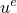
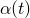

# 11.2.1 Element and contact pair removal and reactivation


**Products: **Abaqus/Standard  Abaqus/CAE  

##### **References**

- ["Removing and reactivating contact pairs" in "Defining contact pairs in Abaqus/Standard," Section 36.3.1](pt09ch36s03aus145.md#usb-cni-acontactmodelchange)
- [*MODEL CHANGE](../key/key-link.md#usb-kws-hmodelchange)
- ["Defining a model change interaction," Section 15.13.13 of the Abaqus/CAE User's Guide](../usi/usi-link.md#usi-itn-help-model-change)

### Overview

Element and contact pair removal/reactivation:
- can be used to simulate removal of part of the model, either temporarily or for the remainder of the analysis;
- allows reactivation of elements strain-free or with strain;
- can be used to save computational time when a contact pair is not needed;
- can be used only in general analysis steps; and
- can be used in a restart analysis only if it was used or activated in the original analysis.

### Removing elements

You can remove specified elements from the model in a general analysis step. Just prior to the removal step, Abaqus/Standard stores the forces/fluxes that the region to be removed is exerting on the remaining part of the model at the nodes on the boundary between them. These forces are ramped down to zero during the removal step; therefore, the effect of the removed region on the rest of the model is completely absent only at the end of the removal step. The forces are ramped down gradually to ensure that element removal has a smooth effect on the model.

No further element calculations are performed for elements being removed, starting from the beginning of the step in which they are removed. The removed elements remain inactive in subsequent steps unless you reactivate them as described below.

| **Input File Usage: ** | Use the following option to remove elements from the model: |
| --- | --- |
|  | ``` [*MODEL CHANGE](../key/key-link.md#usb-kws-hmodelchange), TYPE=ELEMENT, REMOVE ``` |

| **Abaqus/CAE Usage: ** | Interaction module: **Create Interaction**: **Model Change**: **Definition**: **Region**, **Activation state of region elements**: **Deactivated in this step** |
| --- | --- |

#### Removing elements in transient procedures

Care must be taken in removing elements in transient procedures. The nodal flux that the removed elements apply at the boundary with the rest of the model is ramped down over the step. In transient heat transfer, fully coupled temperature-displacement, or fully coupled thermal-electrical-structural analysis if the fluxes are high and the step is long, this ramping down may have the effect of cooling down or heating up the rest of the body. In dynamic analysis if the forces are high and the step is long, kinetic energy can be imparted to the remaining portion of the model. This problem can be avoided by removing the elements in a very short transient step prior to the rest of the analysis. This step can be done in a single increment.

### Reactivating stress/displacement elements

Two distinct types of reactivation are provided for stress/displacement elements (including substructures): strain-free reactivation and reactivation with strain. Strain-free reactivation resets the initial configuration; reactivation with strain does not.

Although elements cannot be created within an analysis, a similar effect can be achieved by creating elements in the model definition, removing them in the first step, and subsequently reactivating them.

#### Strain-free reactivation

When stress/displacement elements are reactivated in a strain-free state, they become fully active immediately at the moment of reactivation (the start of the step in which they are reactivated). They are reset to an “annealed” state (zero stress, strain, plastic strain, etc.) in the configuration in which they lie at the start of the reactivation step. This configuration depends on whether a small- or large-displacement analysis is being conducted. Alternatively, reactivation in a nonvirgin state can be specified, as described below.

Since these elements are reactivated in a virgin state (i.e., with zero stress), they exert zero nodal forces on the rest of the model. This result allows reactivation to be done immediately, without an adverse effect on the smoothness of the solution.

After reactivation the strains and the deformation gradients are based on the displacements subsequent to the moment of reactivation, rather than on their total displacements. Thus, the current configuration at the start of the reactivation step is the new initial configuration for the element.

This kind of reactivation usually is used to model the creation of an undeformed and unstrained region of the model that is sharing a boundary with another, possibly stressed, deformed region. For example, in tunnel excavation an unstressed tunnel liner is added to line the walls of an already deformed tunnel (see ["Stress-free element reactivation," Section 1.1.11 of the Abaqus Example Problems Guide](../exa/exa-link.md#exa-sta-modelchangedemo)).

| **Input File Usage: ** | Use the following option to reactivate elements in a strain-free state: |
| --- | --- |
|  | ``` [*MODEL CHANGE](../key/key-link.md#usb-kws-hmodelchange), ADD=STRAIN FREE (default) ``` |

| **Abaqus/CAE Usage: ** | Interaction module: **Create Interaction**: **Model Change**: **Definition**: **Region**, **Activation state of region elements**: **Reactivated in this step** |
| --- | --- |

##### Small-displacement analysis

In small-displacement analysis the displacements at reactivation are considered to be small; therefore, volume, mass, initial length, and orientation directions do not change.

##### Large-displacement analysis

In large-displacement analysis the new configuration can be significantly different from the original configuration specified in the model definition. The change in configuration may result from large deformation or rigid body motion. For the nodes of the reactivated elements to be in the correct position upon reactivation, these nodes must be shared by elements that are not removed. Otherwise, the nodes of the removed elements remain at the location occupied at the time of removal. For cases where an enclosed region of material is reactivated, the shared-node restriction may require that a duplicate set of elements whose material properties do not influence the stress solution be defined on top of the removed elements. These duplicate elements provide a means of tracking the position of the nodes of the removed elements.

Upon reactivation an element can have a significantly different volume or mass, so the mass matrix is reformed for the element. Any local orientations applicable to the element are redefined on the new configuration. For shell and membrane elements, however, the thickness of the reactivated elements is the thickness as specified at the start of the analysis by the element's section definition, a nodal thickness definition (["Nodal thicknesses," Section 2.1.3](pt01ch02s01aus07.md)), or an import definition (["Transferring results between Abaqus analyses: overview," Section 9.2.1](pt04ch09s02aus54.md)).

The current normals on structural elements at the moment of reactivation become new initial normals for that element. The current normal is the element's original normal (as specified in the model definition) rotated by the nodal rotation at the moment of reactivation. This scheme preserves the angle between the normals of reactivated elements and those of the elements with which they share nodes. (Usually, this angle should be zero and the normals should be identical, such as when a strain-free layer is added to an already deformed shell or beam. This can be achieved by ensuring that the normals are identical in the model definition.) If the reactivated structural elements share nodes with only non-structural elements (elements that do not provide stiffness to rotational degrees of freedom), duplicate structural elements are required so that the rotational degrees of freedom at the shared nodes will follow the deformation and rigid body motion before reactivation.

In a large-displacement analysis an element that is being reactivated strain free fits into whatever configuration is given by its nodes at the moment of reactivation. You must ensure that this configuration is meaningful and is not severely distorted. Abaqus/Standard will apply geometry checks on the reactivated elements; these checks are the same as the checks that are done in the analysis input file processor. Warnings are printed in the message file if the elements seem inappropriately distorted; and error messages are given if the distortion is severe, in which case the analysis will be stopped. If a geometry check on an element produces a warning or an error message, its current coordinates—and normals if applicable—are printed to the message file for your inspection. The current coordinates can be printed for all elements being reactivated by requesting detailed printout for element removal/reactivation, as explained in ["The Abaqus/Standard message file" in "Output," Section 4.1.1](pt02ch04s01aus38.md#usb-out-ooutput-message-std).

##### Reactivating axisymmetric elements

Abaqus/Standard will not stop the analysis if an axisymmetric element has a very small negative radial coordinate at reactivation (if the magnitude of the radial coordinate is less than 104 times the average element length). In this case a warning is printed, and a radial coordinate of zero is assumed. If the radial coordinate is negative and larger than 104 times the average element length in magnitude, the analysis will stop.

For axisymmetric-asymmetric elements (SAXA and CAXA) the displacements at reactivation are considered small even in large-displacement analysis because these elements require an axisymmetric original configuration, but the configuration given by the nodes of these elements at reactivation would not, in general, be axisymmetric. Therefore, the original configuration is assumed not to change for these elements.

##### Reactivating coupled temperature-displacement and coupled thermal-electrical-structural elements

In a fully coupled temperature-displacement analysis and a fully coupled thermal-electrical-structural analysis, continuum elements attain their full mechanical stiffness immediately upon strain-free reactivation; however, to ensure smoothness of the solution, thermal conductivity is ramped up from zero over the step.

##### Reactivating spring elements and substructures

If spring elements or substructures are reactivated “without strain,” the configuration at the moment of reactivation represents the zero-displacement state of the element; the forces in the spring or substructures are based on relative displacements subsequent to the moment of reactivation.

#### Reactivation with strain

Elements reactivated with strain start in an annealed state unless reactivation in a nonvirgin state is specified, as described below.

The following scheme is implemented for the elements during the reactivation step: Let  represent the displacements of the nodes of this element, which are the displacements as shared by the rest of the model or as specified by boundary conditions. In general, these displacements can vary with time over the reactivation step. At any time in the reactivation step Abaqus/Standard enforces displacements, , for the element: 


where  is a parameter that ramps linearly from 0 to 1 during the step. Thus, during the step the displacements felt by the reactivated elements ramp up to their actual values. To produce a consistent stiffness matrix, the element stiffness is also multiplied by ; therefore, the rest of the model experiences the reactivated elements as though their stiffnesses were ramped up during the step.

This ramping up of displacements instead of direct ramping up of element forces ensures that the strain in the element ramps up from zero to the strain given by the displacement of its nodes. This gradual ramping up of strains is desirable so that the response of history-dependent materials can be integrated gradually.

Subsequent to the end of the reactivation step, the strains in reactivated elements correspond to the displacements of their nodes from their initial configuration, rather than to their displacements since the moment of reactivation. This is appropriate, for example, in the refueling of a nuclear reactor, where the new fuel assembly must conform to the distortion of its old neighbors.

This reactivation scheme does not work for the rotations of shell elements that have five degrees of freedom per node because a total rotation is not stored at those nodes. Consequently, reactivation with strain is not allowed for these elements.

If an element is reactivated with strain after having been previously reactivated strain free, the strains are based on the displacements from the configuration in which the element was reactivated strain free (because this defined the new initial configuration for the element). In this case the  in the formula above should be interpreted as the displacement of the node relative to the position in which the element was reactivated strain free.

| **Input File Usage: ** | Use the following option to reactivate elements with strain: |
| --- | --- |
|  | ``` [*MODEL CHANGE](../key/key-link.md#usb-kws-hmodelchange), ADD=WITH STRAIN ``` |

| **Abaqus/CAE Usage: ** | Interaction module: **Create Interaction**: **Model Change**: **Definition**: **Region**, **Activation state of region elements**: **Reactivated in this step**; toggle on **Reactivated elements with strain (when applicable)** |
| --- | --- |

#### Reactivating elements with rebar

Rebars are reactivated strain free or with strain exactly like the element in which they are defined. The annealing that takes place upon reactivation is also applied to rebars in the model. Reactivation of rebars can also be done in a nonvirgin state.

### Reactivating other element types

During reactivation of all element types other than stress/displacement elements, substructures, and contact elements, the nodal forces caused by stress in the element and by distributed loads are scaled by a value that ramps from zero to one during the reactivation step. (The nodal fluxes are scaled similarly for heat transfer elements.) In effect this scaling ramps the element stiffness up from zero during the step; for elements with mass or damping this scaling also ramps up the mass or damping during the step.

During the reactivation step the thermal conductivity of heat transfer elements and the permeability of pore pressure elements are ramped up from zero over the step.

User-defined elements can be removed and reactivated. User subroutine [`UEL`](../sub/sub-link.md#sub-xsl-uel) is not called in steps in which the element is being removed or has already been removed.

| **Input File Usage: ** | ``` [*MODEL CHANGE](../key/key-link.md#usb-kws-hmodelchange), ADD ``` |
| --- | --- |

| **Abaqus/CAE Usage: ** | Interaction module: **Create Interaction**: **Model Change**: **Definition**: **Region**, **Activation state of region elements**: **Reactivated in this step** |
| --- | --- |

### Removing and reactivating contact pairs

You can remove specified slave and master surfaces from the model in a general analysis step. Contact pair removal and reactivation is explained in ["Removing and reactivating contact pairs" in "Defining contact pairs in Abaqus/Standard," Section 36.3.1](pt09ch36s03aus145.md#usb-cni-acontactmodelchange).

| **Input File Usage: ** | ``` [*MODEL CHANGE](../key/key-link.md#usb-kws-hmodelchange), TYPE=CONTACT PAIR, REMOVE or ADD ``` |
| --- | --- |

| **Abaqus/CAE Usage: ** | Use the following option to remove contact pairs: |
| --- | --- |
|  | Interaction module: **Create Interaction**: **Surface-to-surface contact (Standard)** or **Self-contact (Standard)**: toggle off **Active in this step** Use the following option to reactivate contact pairs: Interaction module: **Create Interaction**: **Surface-to-surface contact (Standard)** or **Self-contact (Standard)**: toggle on **Active in this step** |

### Removing and reactivating contact elements

Contact elements are removed and reactivated by Abaqus/Standard in the same way as contact pairs, as described in ["Removing and reactivating contact pairs" in "Defining contact pairs in Abaqus/Standard," Section 36.3.1](pt09ch36s03aus145.md#usb-cni-acontactmodelchange).

| **Input File Usage: ** | ``` [*MODEL CHANGE](../key/key-link.md#usb-kws-hmodelchange), TYPE=ELEMENT, REMOVE or ADD ``` |
| --- | --- |

| **Abaqus/CAE Usage: ** | Use the following option to remove contact elements: |
| --- | --- |
|  | Interaction module: **Create Interaction**: **Model Change**: **Definition**: **Region**, **Activation state of region elements**: **Deactivated in this step** Use the following option to reactivate contact elements: Interaction module: **Create Interaction**: **Model Change**: **Definition**: **Region**, **Activation state of region elements**: **Reactivated in this step** |

### Modeling issues

In some cases element removal/reactivation may cause numerical problems. The following guidelines can be used to reduce the chance of difficulty:
- If elements are removed in a static stress analysis and this removal leaves a region of the model with an unconstrained rigid body mode, solver problems will occur and the analysis most likely will fail to converge. Therefore, ensure that the remainder of the model is constrained sufficiently.
- If elements that are connected to a contact pair are removed, the contact pair should also be removed to avoid solver problems.
- If all elements attached to a node constrained with a multi-point constraint or a linear constraint equation are being removed, this node should be the dependent node of the multi-point constraint or linear constraint equation.

In some cases element removal may cause Abaqus/Standard to report extra unconnected regions in the message file. These messages can be safely ignored.

### Removing or reactivating elements and contact pairs in a restart analysis

Elements or contact pairs can be removed or reactivated in a restart analysis (["Restarting an analysis," Section 9.1.1](pt04ch09s01aus53.md)) only if elements or contact pairs were removed or reactivated in the original analysis. In situations where it is expected that the addition or removal of elements or contact pairs will be required in a restart analysis, but there is no such need in the original analysis, you must activate element or contact pair removal/reactivation in the original analysis. Activating this capability does not add or remove any elements or contact pairs; it only prepares Abaqus/Standard to allow for these changes in a subsequent restart analysis.

| **Input File Usage: ** | Use the following option to activate element or contact pair removal/reactivation: |
| --- | --- |
|  | ``` [*MODEL CHANGE](../key/key-link.md#usb-kws-hmodelchange), ACTIVATE ``` |

| **Abaqus/CAE Usage: ** | Interaction module: **Create Interaction**: **Model Change**: **Definition**: **Restart** |
| --- | --- |

### Procedures

Elements or contact pairs cannot be removed or reactivated in a linear perturbation step (see ["General and linear perturbation procedures," Section 6.1.3](pt03ch06s01aus44.md)) or in a static Riks step (see ["Unstable collapse and postbuckling analysis," Section 6.2.4](pt03ch06s02at03.md)). For elements to be absent in such steps, they must have been inactive at the end of the previous general analysis (nonperturbation) step.

### Initial conditions

When elements are added back into the model, they are usually assumed to be “annealed”; that is, they have zero plastic strain, creep strain, etc. and zero stress at the start of the step in which they are reactivated. It is possible to reactivate an element so that it starts with a nonzero stress, equivalent plastic strain, and, if relevant, backstress (in a nonvirgin state).

#### Reactivation in a nonvirgin state

To reactivate elements with nonzero stress, define initial stress conditions (see ["Initial conditions in Abaqus/Standard and Abaqus/Explicit," Section 34.2.1](pt07ch34s02aus116.md)) to specify the required stress in the model definition. Then the elements must be removed in the first step of the analysis. When reactivated, they will have the initial stress specified. The reactivation is done immediately, so the initial stress (which is applied in full during the first increment) must be self-equilibrating to avoid convergence issues. 

If the elements were not removed in the first step, if they were removed again after the first step, or if initial conditions were not specified for them, they will have zero stresses when reactivated.

In a similar manner a material can be reactivated with a nonzero initial equivalent plastic strain and, if relevant, backstress.

When elements are reactivated, any applied initial stress is not displayed in the zero increment frame.

| **Input File Usage: ** | Use the following option to specify initial stress conditions: |
| --- | --- |
|  | ``` [*INITIAL CONDITIONS](../key/key-link.md#usb-kws-minitialcond), TYPE=STRESS ``` Use the following option to specify initial equivalent plastic strain and backstress: ``` [*INITIAL CONDITIONS](../key/key-link.md#usb-kws-minitialcond), TYPE=HARDENING ``` |

| **Abaqus/CAE Usage: ** | Use the following options to specify the initial stress conditions: |
| --- | --- |
|  | Load module: **Create Predefined Field**: **Step**: **Initial**, choose **Mechanical** for the **Category** and **Stress** for the **Types for Selected Step** Use the following options to specify the initial equivalent plastic strain and backstress: Load module: **Create Predefined Field**: **Step**: **Initial**, choose **Mechanical** for the **Category** and **Hardening** for the **Types for Selected Step** |

### Boundary conditions

The nodal variables of removed elements are not changed when the elements are removed. You can reset these variables by defining a boundary condition while the elements are inactive (see ["Boundary conditions in Abaqus/Standard and Abaqus/Explicit," Section 34.3.1](pt07ch34s03aus118.md)).

### Loads

Distributed and concentrated loads that are applied in an area where elements are removed or reactivated may need to be modified.

#### Distributed loads

Any distributed loads, fluxes, flows, and foundations specified for inactive elements are also inactive. However, unless you explicitly remove them, records of these loads are still kept and are listed in the data (`.dat`) file as though the elements were still present. Continuation of loads across steps is not affected by removal; on element reactivation unremoved distributed loads are also reactivated.

By default, if a distributed load is applied to an element that is being reactivated in a step, the distributed load magnitude is scaled up linearly from zero to its end-of-step value during the step. If such a load is applied with an amplitude reference, the magnitude value given by the amplitude reference is scaled again by a value that ramps from zero to one throughout the step. This scheme ensures that reactivation has a smooth effect on the solution, even in cases where a distributed load with an amplitude reference on a reactivated element is carried over from a previous step.

#### Concentrated loads

Concentrated loads or fluxes are not removed when the surrounding elements are removed; therefore, you must ensure that any concentrated loads or fluxes that are carried solely by removed elements are also removed. Otherwise, a solver problem will occur during the removal step (a force is applied to a degree of freedom with zero stiffness). Concentrated loads or fluxes should be ramped up when they are reintroduced along with reactivated elements.

### Predefined fields

The nodal variables of removed elements are not changed directly when the elements are removed. You can reset these variables by defining temperature or other predefined field variables while the elements are inactive (see ["Predefined fields," Section 34.6.1](pt07ch34s06aus128.md)). For example, elements that are removed in a stress/displacement analysis can be reintroduced at a different temperature by setting the temperatures at the nodes on these elements to the desired value while the elements are inactive due to removal.

#### Temperatures

The temperatures at the start of the reactivation step become the initial temperatures for reactivated elements; thermal strains (and, thus, also the thermal stresses) are based on the temperature change subsequent to the instant of reactivation (see ["Thermal expansion," Section 26.1.2](pt05ch26s01abm52.md)).

### Material options

On annealing, compaction-related quantities—such as the yield stress in hydrostatic compression, , in crushable foam plasticity (["Crushable foam plasticity models," Section 23.3.5](pt05ch23s03abm34.md)); the yield stress in hydrostatic compression, , in cap plasticity (["Modified Drucker-Prager/Cap model," Section 23.3.2](pt05ch23s03abm31.md)); and the void volume fraction, *f*, in porous metal plasticity (["Porous metal plasticity," Section 23.2.9](pt05ch23s02abm25.md))—are reset to the values they had at the start of the analysis.

For porous materials the porosity, *n*, is reset to its initial value and the saturation, *s*, retains its value from the instant of removal (see ["Pore fluid flow properties," Section 26.6.1](pt05ch26s06abo24.md)).

Elements with a user-defined material type can be removed and reactivated; user subroutines [`UMAT`](../sub/sub-link.md#sub-xsl-umat) and [`UMATHT`](../sub/sub-link.md#sub-xsl-umatht) are not called while the elements are inactive. On reactivation the stresses and strains in user subroutine [`UMAT`](../sub/sub-link.md#sub-xsl-umat) are set to zero, and conductivity and heat fluxes defined in user subroutine [`UMATHT`](../sub/sub-link.md#sub-xsl-umatht) are ramped up from zero during the reactivation step. Solution-dependent state variables must be reset in user subroutine [`UMAT`](../sub/sub-link.md#sub-xsl-umat), [`UMATHT`](../sub/sub-link.md#sub-xsl-umatht), or [`SDVINI`](../sub/sub-link.md#sub-xsl-sdvini), which will be called on reactivation.

### Elements

Removal is not currently supported for rigid, cohesive, gasket, and piezoelectric elements. All other element types in Abaqus/Standard can be removed and reactivated. See ["Choosing the appropriate element for an analysis type," Section 27.1.3](pt06ch27s01aus112.md).

### Output

Output is not available for elements or contact surfaces that have been removed. Inactive elements and contact surfaces are visible in Abaqus/CAE.

### Input file template

```
[*HEADING](../key/key-link.md#usb-kws-mheading)
…
[*STEP](../key/key-link.md#usb-kws-hstep)
[*STATIC](../key/key-link.md#usb-kws-hstatic)
…
** Remove all elements in element set SIDE
[*MODEL CHANGE](../key/key-link.md#usb-kws-hmodelchange), REMOVE
 SIDE,
** Remove contact pair (SLAVE1, MASTER1)
[*MODEL CHANGE](../key/key-link.md#usb-kws-hmodelchange), TYPE=CONTACT PAIR, REMOVE
 SLAVE1, MASTER1
…
[*END STEP](../key/key-link.md#usb-kws-hendstep)
**
[*STEP](../key/key-link.md#usb-kws-hstep)
[*STATIC](../key/key-link.md#usb-kws-hstatic)
…
** Reactivate elements in element set SIDE
[*MODEL CHANGE](../key/key-link.md#usb-kws-hmodelchange), ADD=STRAIN FREE
 SIDE,
** Reactivate contact pair (SLAVE1, MASTER1)
[*MODEL CHANGE](../key/key-link.md#usb-kws-hmodelchange), TYPE=CONTACT PAIR, ADD
 SLAVE1, MASTER1
…
[*END STEP](../key/key-link.md#usb-kws-hendstep)
```


