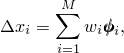

# 11.3.1 Introducing a geometric imperfection into a model


**Products: **Abaqus/Standard  Abaqus/Explicit  

##### **References**

- ["Unstable collapse and postbuckling analysis," Section 6.2.4](pt03ch06s02at03.md)
- [*IMPERFECTION](../key/key-link.md#usb-kws-mimperfection)

### Overview

A geometric imperfection pattern:
- is generally introduced in a model for a postbuckling load-displacement analysis;
- can be defined as a linear superposition of buckling eigenmodes obtained from a previous eigenvalue buckling prediction or eigenfrequency extraction analysis performed with Abaqus/Standard;
- can be based on the solution obtained from a previous static analysis performed with Abaqus/Standard; or
- can be specified directly.

### General postbuckling analysis

In Abaqus/Standard the Riks method (["Unstable collapse and postbuckling analysis," Section 6.2.4](pt03ch06s02at03.md)) can be used to solve postbuckling problems, both with stable and unstable postbuckling behavior. However, the exact postbuckling problem often cannot be analyzed directly due to the discontinuous response (bifurcation) at the point of buckling. To analyze a postbuckling problem, you must turn it into a problem with continuous response instead of bifurcation, which can be accomplished by introducing a geometric imperfection pattern in the “perfect” geometry so that there is some response in the buckling mode before the critical load is reached.

### Introducing geometric imperfections

Imperfections are usually introduced by perturbations in the geometry. Abaqus offers three ways to define an imperfection: as a linear superposition of buckling eigenmodes, from the displacements of a static analysis, or by specifying the node number and imperfection values directly. Only the translational degrees of freedom are modified. Abaqus will then calculate the normals using the usual algorithm based on the perturbed coordinates. Unless the precise shape of an imperfection is known, an imperfection consisting of multiple superimposed buckling modes can be introduced (["Eigenvalue buckling prediction," Section 6.2.3](pt03ch06s02at02.md)).

The usual approach involves two analysis runs with the same model definition, using Abaqus/Standard to establish the probable collapse modes and either Abaqus/Standard or Abaqus/Explicit to perform the postbuckling analysis: 

1. In the first analysis run perform an eigenvalue buckling analysis with Abaqus/Standard on the "perfect" structure to establish probable collapse modes and to verify that the mesh discretizes those modes accurately. Write the eigenmodes in the default global system to the results file as nodal data (["Output to the data and results files," Section 4.1.2](pt02ch04s01aus39.md)).
2. In the second analysis run use Abaqus/Standard or Abaqus/Explicit to introduce an imperfection in the geometry by adding these buckling modes to the "perfect" geometry. The lowest buckling modes are frequently assumed to provide the most critical imperfections, so usually these are scaled and added to the perfect geometry to create the perturbed mesh. The imperfection thus has the form  where  is the  mode shape and  is the associated scale factor. You must choose the scale factors of the various modes; usually (if the structure is not imperfection sensitive) the lowest buckling mode should have the largest factor. The magnitudes of the perturbations used are typically a few percent of a relative structural dimension such as a beam cross-section or shell thickness.
3. Use either Abaqus/Standard or Abaqus/Explicit to perform the postbuckling analysis. - In Abaqus/Standard perform a geometrically nonlinear load-displacement analysis of the structure containing the imperfection using the Riks method. In this way the Riks method can be used to perform postbuckling analyses of "stiff" structures that show linear behavior prior to buckling, if perfect. By performing a load-displacement analysis, other important nonlinear effects, such as material inelasticity or contact, can be included. - In Abaqus/Explicit perform a postbuckling analysis on the perturbed structure.

Abaqus imports imperfection data through the user node labels. Abaqus does not check model compatibility between both analysis runs. Node set definitions in the original model and the model with the imperfection may be different. Care must be taken for models in which Abaqus generates additional nodes (for example, the nodes generated for contact surfaces on 20-node brick elements). In such cases you have to ensure that the models for both analysis runs are identical and that the nodal information for the generated nodes is written to the results file.

If the model is defined in terms of an assembly of part instances, the part (`.prt`) file from the original analysis is required to read the eigenmodes from the results file. Both the original model and the subsequent model must be defined consistently in terms of an assembly of part instances.

#### Defining an imperfection based on eigenmode data

To define an imperfection based on the superposition of weighted mode shapes, specify the results file and step from a previous eigenfrequency extraction or eigenvalue buckling prediction analysis. Optionally, you can import eigenmode data for a specified node set.

| **Input File Usage: ** | ``` [*IMPERFECTION](../key/key-link.md#usb-kws-mimperfection), FILE=*results_file*, STEP=*step*, NSET=*name* ``` |
| --- | --- |

#### Defining an imperfection based on static analysis data

To define an imperfection based on the deformed geometry of a previous static analysis (["Unstable collapse and postbuckling analysis," Section 6.2.4](pt03ch06s02at03.md)), specify the results file and step (and, optionally, the increment number) from a previous static analysis. (If the increment number is not specified, Abaqus will read data from the last increment available for the specified step in the results file.) Optionally, you can import modal data for a specified node set.

| **Input File Usage: ** | ``` [*IMPERFECTION](../key/key-link.md#usb-kws-mimperfection), FILE=*results_file*, STEP=*step*, INC=*inc*, NSET=*name* ``` |
| --- | --- |

#### Defining an imperfection directly

You can specify the imperfection directly as a table of node numbers and coordinate perturbations in the global coordinate system or, optionally, in a cylindrical or spherical coordinate system. Alternatively, you can read the imperfection data from a separate input file.

| **Input File Usage: ** | ``` [*IMPERFECTION](../key/key-link.md#usb-kws-mimperfection), SYSTEM=*name*, INPUT=*input file* ``` |
| --- | --- |
|  | If no input file is specified, Abaqus assumes that the data follow the option. |

### Imperfection sensitivity

The response of some structures depends strongly on the imperfections in the original geometry, particularly if the buckling modes interact after buckling occurs. Hence, imperfections based on a single buckling mode tend to yield nonconservative results. By adjusting the magnitude of the scaling factors of the various buckling modes, the imperfection sensitivity of the structure can be assessed. Normally, a number of analyses should be conducted to investigate the sensitivity of a structure to imperfections. Structures with many closely spaced eigenmodes tend to be imperfection sensitive, and imperfections with shapes corresponding to the eigenmode for the lowest eigenvalue may not give the worst case.

The imperfect structure will be easier to analyze if the imperfection is large. If the imperfection is small, the deformation will be quite small (relative to the imperfection) below the critical load. The response will grow quickly near the critical load, introducing a rapid change in behavior.

On the other hand, if the imperfection is large, the postbuckling response will grow steadily before the critical load is reached. In this case the transition into postbuckled behavior will be smooth and relatively easy to analyze.

### Input file template

The following example illustrates a postbuckling analysis of a structure with an imperfection defined by a linear superposition of the buckling eigenmodes and involves two analysis runs with the same model definition.

The initial analysis run performs an eigenvalue buckling analysis with Abaqus/Standard to establish the probable collapse modes and writes them to the results file.

```
[*HEADING](../key/key-link.md#usb-kws-mheading)
*Initial analysis run to write the buckling modes to the results file*
[*NODE](../key/key-link.md#usb-kws-mnode)
*Data lines to define initial “perfect” geometry*
…
**
[*STEP](../key/key-link.md#usb-kws-hstep)
[*BUCKLE](../key/key-link.md#usb-kws-hbuckle)
*Data lines to define the number of buckling eigenmodes*
[*CLOAD](../key/key-link.md#usb-kws-hcload) and/or [*DLOAD](../key/key-link.md#usb-kws-hdload) and/or [*DSLOAD](../key/key-link.md#usb-kws-hdsload) and/or [*TEMPERATURE](../key/key-link.md#usb-kws-htemperature)
*Data lines to specify the reference load, *
[*NODE FILE](../key/key-link.md#usb-kws-hnodefile), GLOBAL=YES, LAST MODE=*n*
U
[*END STEP](../key/key-link.md#usb-kws-hendstep)
```

The second analysis run introduces the imperfection and performs a postbuckling analysis employing the modified Riks method in Abaqus/Standard.

```
[*HEADING](../key/key-link.md#usb-kws-mheading)
*Second analysis run to define the imperfection and perform the postbuckling analysis*
[*NODE](../key/key-link.md#usb-kws-mnode)
*Data lines to define initial “perfect” geometry*
…
[*IMPERFECTION](../key/key-link.md#usb-kws-mimperfection), FILE=*results_file*, STEP=*step*
*Data lines specifying the mode number and its associated scale factor*
…
**
[*STEP](../key/key-link.md#usb-kws-hstep), NLGEOM
[*STATIC](../key/key-link.md#usb-kws-hstatic), RIKS
*Data line to define incrementation and stopping criteria*
[*CLOAD](../key/key-link.md#usb-kws-hcload) and/or [*DLOAD](../key/key-link.md#usb-kws-hdload) and/or [*DSLOAD](../key/key-link.md#usb-kws-hdsload) and/or [*TEMPERATURE](../key/key-link.md#usb-kws-htemperature)
*Data lines to specify reference loading*,  
[*END STEP](../key/key-link.md#usb-kws-hendstep)
```

An alternative second analysis run introduces the imperfection and performs a postbuckling analysis with Abaqus/Explicit.

```
[*HEADING](../key/key-link.md#usb-kws-mheading)
*Second analysis run to define the imperfection and perform the postbuckling analysis*
[*NODE](../key/key-link.md#usb-kws-mnode)
*Data lines to define initial “perfect” geometry*
…
[*IMPERFECTION](../key/key-link.md#usb-kws-mimperfection), FILE=*results_file*, STEP=*step*
*Data lines specifying the mode number and its associated scale factor*
…
**
[*STEP](../key/key-link.md#usb-kws-hstep)
[*DYNAMIC](../key/key-link.md#usb-kws-hdynamic), EXPLICIT
*Data line to define the time period of the step.*
[*CLOAD](../key/key-link.md#usb-kws-hcload) and/or [*DLOAD](../key/key-link.md#usb-kws-hdload) and/or [*DSLOAD](../key/key-link.md#usb-kws-hdsload) and/or [*TEMPERATURE](../key/key-link.md#usb-kws-htemperature)
[*END STEP](../key/key-link.md#usb-kws-hendstep)
```


