# 11.4.2 Contour integral evaluation


**Products: **Abaqus/Standard  Abaqus/CAE  

##### **References**

- ["Fracture mechanics: overview," Section 11.4.1](pt04ch11s04abo13.md)
- [*CONTOUR INTEGRAL](../key/key-link.md#usb-kws-hcontintegral)
- ["Using contour integrals to model fracture mechanics," Section 31.2 of the Abaqus/CAE User's Guide](../usi/usi-link.md#usi-eng-crack)

### Overview

Abaqus/Standard offers the evaluation of several parameters for fracture mechanics studies based on either the conventional finite element method or the extended finite element method (XFEM, see ["Modeling discontinuities as an enriched feature using the extended finite element method," Section 10.7.1](pt04ch10s07at36.md)):
- the *J*-integral, which is widely accepted as a quasi-static fracture mechanics parameter for linear material response and, with limitations, for nonlinear material response;
- the -integral, which has an equivalent role to the *J*-integral in the context of time-dependent creep behavior (["Rate-dependent plasticity: creep and swelling," Section 23.2.4](pt05ch23s02abm20.md)) in a quasi-static step (["Quasi-static analysis," Section 6.2.5](pt03ch06s02at04.md));
- the stress intensity factors, which are used in linear elastic fracture mechanics to measure the strength of the local crack-tip fields;
- the crack propagation direction---i.e., the angle at which a preexisting crack will propagate; and
- the *T*-stress, which represents a stress parallel to the crack faces and is used as an indicator of the extent to which parameters like the *J*-integral are useful characterizations of the deformation field around the crack.

 Contour integrals:- are output quantities---they do not affect the results;
- can be requested only in general analysis steps;
- can be used only with two-dimensional quadrilateral elements or three-dimensional brick elements when used with the conventional finite element method;
- can be evaluated without requiring a detailed refined mesh around the crack tips when used with XFEM; and
- are currently available only for first-order or second-order tetrahedron and first-order brick elements with isotropic elastic material when used with XFEM.

### Contour integral evaluation

Abaqus/Standard offers two different ways to evaluate the contour integral. The first approach is based on the conventional finite element method, which typically requires you to conform the mesh to the cracked geometry, to explicitly define the crack front, and to specify the virtual crack extension direction. Detailed focused meshes are generally required, and obtaining accurate contour integral results for a crack in a three-dimensional curved surface can be quite cumbersome. The extended finite element method (XFEM) alleviates these shortcomings. XFEM does not require the mesh to match the cracked geometry. The presence of a crack is ensured by the special enriched functions in conjunction with additional degrees of freedom. This approach also removes the requirement for explicitly defining the crack front or specifying the virtual crack extension direction when evaluating the contour integral. The data required for the contour integral are determined automatically based on the level set signed distance functions at the nodes in an element (see ["Modeling discontinuities as an enriched feature using the extended finite element method," Section 10.7.1](pt04ch10s07at36.md)).

Several contour integral evaluations are possible at each location along a crack. In a finite element model each evaluation can be thought of as the virtual motion of a block of material surrounding the crack tip (in two dimensions) or surrounding each node along the crack line (in three dimensions). Each block is defined by contours, where each contour is a ring of elements completely surrounding the crack tip or the nodes along the crack line from one crack face to the opposite crack face. These rings of elements are defined recursively to surround all previous contours.

Abaqus/Standard automatically finds the elements that form each ring from the regions defined as the crack tip or crack line. Each contour provides an evaluation of the contour integral. The possible number of evaluations is the number of such rings of elements. You must specify the number of contours to be used in calculating contour integrals. In addition, you must specify the type of contour integral to be calculated, as described below. By default, Abaqus/Standard calculates the *J*-integral.

You can assign a name to a crack that is used to identify the contour integral values in the data file and in the output database file. The name is also used by Abaqus/CAE to request contour integral output. If you are using the conventional finite element method and do not specify a crack name, by default Abaqus/Standard generates crack numbers that follow the order in which the cracks are defined. If you are using XFEM, you must set the crack name equal to the name assigned to the enriched feature.

| **Input File Usage: ** | Use the follow option to evaluate the contour integral with the conventional finite element method: |
| --- | --- |
|  | ``` [*CONTOUR INTEGRAL](../key/key-link.md#usb-kws-hcontintegral), CRACK NAME=*crack name*, CONTOURS=*n*, TYPE=*integral_type* ``` Use the following option to evaluate the contour integral with XFEM: ``` [*CONTOUR INTEGRAL](../key/key-link.md#usb-kws-hcontintegral), CRACK NAME=*crack name*, XFEM, CONTOURS=*n*, TYPE=*integral_type* ``` |

| **Abaqus/CAE Usage: ** | Interaction module: ****Special****Crack****Create****: **Name:** *crack name*, **Type:** **Contour integral** or **XFEM**Step module: history output request editor: **Domain: Crack**: *crack name*, **Number of contours:** *n*, **Type:** *integral_type* |
| --- | --- |

#### The domain integral method

Using the divergence theorem, the contour integral can be expanded into an area integral in two dimensions or a volume integral in three dimensions, over a finite domain surrounding the crack. This domain integral method is used to evaluate contour integrals in Abaqus/Standard. The method is quite robust in the sense that accurate contour integral estimates are usually obtained even with quite coarse meshes. The method is robust because the integral is taken over a domain of elements surrounding the crack and because errors in local solution parameters have less effect on the evaluated quantities such as *J*, , the stress intensity factors, and the *T*-stress.

#### Requesting multiple contour integrals

Contour integrals at several different crack tips in two dimensions or along several different crack lines in three dimensions can be evaluated at any time by repeating the contour integral request as often as needed in the step definition. When you are using the conventional finite element method, you must specify the crack front and the direction of virtual crack extension (or the normal to the crack plane if this normal is constant) for each crack tip or crack line, as described below. When you are using XFEM, you do not need to specify the crack front or the virtual crack extension direction because they will be determined by Abaqus/Standard. However, you must set each crack name equal to the corresponding enriched feature, with each enriched feature consisting of only one crack. In addition, regardless of whether you are using either the conventional finite element method or XFEM, you must specify the number of contours to be calculated for each integral.

### The *J*-integral

The *J*-integral is usually used in rate-independent quasi-static fracture analysis to characterize the energy release associated with crack growth. It can be related to the stress intensity factor if the material response is linear.

The *J*-integral is defined in terms of the energy release rate associated with crack advance. For a virtual crack advance 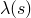 in the plane of a three-dimensional fracture, the energy release rate is given by 

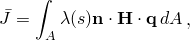

where 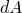 is a surface element along a vanishing small tubular surface enclosing the crack tip or crack line,  is the outward normal to , and  is the local direction of virtual crack extension.  is given by 

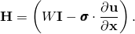

For elastic material behavior *W* is the elastic strain energy; for elastic-plastic or elasto-viscoplastic material behavior *W* is defined as the elastic strain energy density plus the plastic dissipation, thus representing the strain energy in an “equivalent elastic material.” Therefore, the *J*-integral calculated is suitable only for monotonic loading of elastic-plastic materials.

| **Input File Usage: ** | ``` [*CONTOUR INTEGRAL](../key/key-link.md#usb-kws-hcontintegral), CONTOURS=*n*, TYPE=J ``` |
| --- | --- |

| **Abaqus/CAE Usage: ** | Step module: history output request editor: **Domain: Crack**: *crack name*, **Number of contours:** *n*, **Type: J-integral** |
| --- | --- |

#### Domain dependence

The *J*-integral should be independent of the domain used provided that the crack faces are parallel to each other, but *J*-integral estimates from different rings may vary because of the approximate nature of the finite element solution. Strong variation in these estimates, commonly called domain dependence or contour dependence, typically indicates an error in the contour integral definition. Gradual variation in these estimates may indicate that a finer mesh is needed or, if plasticity is included, that the contour integral domain does not completely include the plastic zone. If the “equivalent elastic material” is not a good representation of the elastic-plastic material, the contour integrals will be domain independent only if they completely include the plastic zone. Since it is not always possible to include the plastic zone in three dimensions, a finer mesh may be the only solution.

If the first contour integral is defined by specifying the nodes at the crack tip, the first few contours may be inaccurate. To check the accuracy of these contours, you can request more contours and determine the value of the contour integral that appears approximately constant from one contour to the next. The contour integral values that are not approximately equal to this constant should be discarded. In linear elastic problems the first and second contours typically should be ignored as inaccurate.

For some three-dimensional models with an open crack front, the *J*-integral estimates may be inaccurate from the node sets (or elements in the case with XFEM) at the crack front ends. The resolution difficulty is compounded by the skewness of the outmost layer of elements. This accuracy loss is confined only to the contour integrals at the front ends and has no effect on the accuracy of the contour integral values at the neighboring node sets  (or elements in the case with XFEM) along the crack front.

#### Including the effect of a residual stress field on *J*-integral evaluation

A residual stress field often occurs in a structure; for example, as a result of service loads that produce plasticity, a metal forming process in the absence of an anneal treatment, thermal effects, or swelling effects. When the residual stresses are significant, the standard definition of the *J*-integral as described above may lead to a path-dependent value. To ensure its path independence, the *J*-integral evaluation must include an additional term that accounts for the residual stress field. In Abaqus/Standard the problem with a residual stress field is treated as an initial strain problem. If the total strain is written as the sum of mechanical strain, , and initial strain, 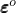; i.e., 


 a path-independent energy release rate in the presence of a residual stress field is given by

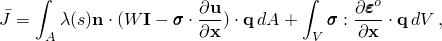

 where *V* is the domain volume enclosing the crack tip or crack line, *W* is defined as the mechanical strain energy density only, 

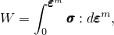

 and 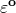 remains constant during the entire deformation.

The residual stress field can be specified by reading the stress data from a previous analysis step or by defining an initial condition (see ["Defining initial stresses" in "Initial conditions in Abaqus/Standard and Abaqus/Explicit," Section 34.2.1](pt07ch34s02aus116.md#usb-prc-pinitialcond-stress)). You specify the step number from which the stress data in the last available increment of the specified step will be considered as residual stresses. If the step number is set equal to zero (default), the residual stress field is defined by the initial condition definition. When XFEM is used, the residual stress field can be defined only with an initial condition definition.

| **Input File Usage: ** | ``` [*CONTOUR INTEGRAL](../key/key-link.md#usb-kws-hcontintegral), RESIDUAL STRESS STEP=*n*, TYPE=J ``` |
| --- | --- |

| **Abaqus/CAE Usage: ** | Step module: history output request editor: **Domain: Crack**: *crack name*, **Number of contours:** *n*, **Step for residual stress initialization values:** *step*, **Type: J-integral** |
| --- | --- |

### The *Ct*-integral

The *Ct*-integral is supported with the conventional finite element method; however, it is not supported with XFEM.

The -integral can be used for time-dependent creep behavior, where it characterizes creep crack deformation under certain creep conditions, including transient crack growth.  is, for example, proportional to the rate of growth of the crack-tip/crack-line creep zone for a stationary crack under small-scale creep conditions. Under steady-state creep conditions, when creep dominates throughout the specimen,  becomes path independent and is known as . -integrals should be requested only in a quasi-static step.

The -integral is obtained by replacing the displacements with velocities and the strain energy density with the strain energy rate density in the *J*-integral expansion. The strain energy rate density is defined as 


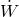 is not uniquely defined if multiple deformation mechanisms contribute to the strain rate. However, the creep mechanism will dominate within a zone surrounding a crack tip or crack line, so elastic and plastic contributions to  are negligible. The size of that zone depends on the extent of creep relaxation: the zone is initially small but eventually encompasses the entire specimen when steady-state creep is reached. Abaqus/Standard considers only creep in the calculation of . Neglecting elastic and plastic strain rates, the strain energy density for the power law creep model with time hardening form in Abaqus/Standard is 

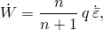

where *n* is the power law exponent, *q* is the equivalent Mises stress, and  is the equivalent uniaxial strain rate.

For the hyperbolic-sine law an analytical expression of  is not available. For this law  is obtained by numerical integration; a five-point Gauss quadrature scheme gives reasonable accuracy in the range of realistic creep strain rates.

The domain integral method is used for -integrals as described above for *J*-integrals.

For user-defined creep laws the strain energy rate density must be defined in user subroutine [`CREEP`](../sub/sub-link.md#sub-xsl-creep).

| **Input File Usage: ** | ``` [*CONTOUR INTEGRAL](../key/key-link.md#usb-kws-hcontintegral), CONTOURS=*n*, TYPE=C ``` |
| --- | --- |

| **Abaqus/CAE Usage: ** | Step module: history output request editor: **Domain: Crack**: *crack name*, **Number of contours:** *n*, **Type: Ct-integral** |
| --- | --- |

#### Domain dependence

Prior to steady state -integral estimates will exhibit domain dependence, even if the finite element mesh is sufficiently refined, because of the assumption of creep dominance within the domain specified. These  estimates should be extrapolated to zero radius to obtain an improved  estimate corresponding to a contour shrunk onto the crack tip or crack line (see ["*Ct*-integral evaluation," Section 1.16.6 of the Abaqus Benchmarks Guide](../bmk/bmk-link.md#bmk-anl-ctintegral)).

#### Including the effect of a residual stress field on -integral evaluation

An additional term is included to account for the residual stress field when calculating the -integral, as described in ["Including the effect of a residual stress field on *J*-integral evaluation](pt04ch11s04aus68.md#usb-anl-acontintegral-jintegral-stressfield).”

| **Input File Usage: ** | ``` [*CONTOUR INTEGRAL](../key/key-link.md#usb-kws-hcontintegral), RESIDUAL STRESS STEP=*n*, TYPE=C ``` |
| --- | --- |

| **Abaqus/CAE Usage: ** | Step module: history output request editor: **Domain: Crack**: *crack name*, **Number of contours:** *n*, **Step for residual stress initialization values:** *step*, **Type: Ct-integral** |
| --- | --- |

### The stress intensity factors

The stress intensity factors , , and  are usually used in linear elastic fracture mechanics to characterize the local crack-tip/crack-line stress and displacement fields. They are related to the energy release rate (the *J*-integral) through 

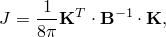

where 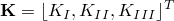 are the stress intensity factors and  is called the pre-logarithmic energy factor matrix. For homogeneous, isotropic materials  is diagonal, and the above equation simplifies to

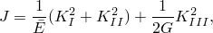

where 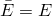 for plane stress and 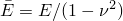 for plane strain, axisymmetry, and three dimensions. For an interfacial crack between two dissimilar isotropic materials, 


where 

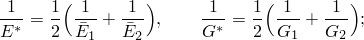

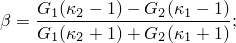

 for plane strain, axisymmetry, and three dimensions; and 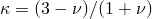 for plane stress. Unlike their analogues in a homogeneous material,  and  are no longer the pure Mode I and Mode II stress intensity factors for an interfacial crack. They are simply the real and imaginary parts of a complex stress intensity factor.

Although the energy release rate is calculated directly in Abaqus/Standard, it is usually not straightforward to compute stress intensity factors from a known *J*-integral for mixed-mode problems. Abaqus/Standard provides an interaction integral method to compute the stress intensity factors directly for a crack under mixed-mode loading. This capability is available for linear isotropic and anisotropic materials. The theory is described in detail in ["Stress intensity factor extraction," Section 2.16.2 of the Abaqus Theory Guide](../stm/stm-link.md#stm-anl-stressintfact).

In this case the *J*-integrals calculated from the stress intensity factors will also be output. These *J*-integral values may be slightly different from those estimated by requesting the *J*-integral directly, due to the different algorithms used for the calculations.

| **Input File Usage: ** | ``` [*CONTOUR INTEGRAL](../key/key-link.md#usb-kws-hcontintegral), CONTOURS=*n*, TYPE=K FACTORS ``` |
| --- | --- |

| **Abaqus/CAE Usage: ** | Step module: history output request editor: **Domain: Crack**: *crack name*, **Number of contours:** *n*, **Type: Stress intensity factors** |
| --- | --- |

#### Domain dependence

The stress intensity factors have the same domain dependence features as the *J*-integral.

#### Including the effect of a residual stress field on stress intensity factor evaluation

An additional term is included to account for the residual stress field when calculating the stress intensity factors, as described in ["Including the effect of a residual stress field on *J*-integral evaluation](pt04ch11s04aus68.md#usb-anl-acontintegral-jintegral-stressfield).”

| **Input File Usage: ** | ``` [*CONTOUR INTEGRAL](../key/key-link.md#usb-kws-hcontintegral), RESIDUAL STRESS STEP=*n*, TYPE=K FACTORS ``` |
| --- | --- |

| **Abaqus/CAE Usage: ** | Step module: history output request editor: **Domain: Crack**: *crack name*, **Number of contours:** *n*, **Step for residual stress initialization values:** *step*, **Type: Stress intensity factors** |
| --- | --- |

#### The crack propagation direction

For homogeneous, isotropic elastic materials the direction of cracking initiation can be calculated using one of the following three criteria: the maximum tangential stress criterion, the maximum energy release rate criterion, or the  criterion.  is not taken into account in any of these criteria.

##### The maximum tangential stress criterion

Using either the condition  or  (where *r* and  are polar coordinates centered at the crack tip in a plane orthogonal to the crack line), we can obtain

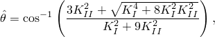

where the crack propagation angle  is measured with respect to the crack plane and  represents the crack propagation in the “straight-ahead” direction. 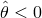 if  while  if 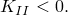 The crack propagation angle is measured from  to ; i.e., it is measured about the direction , or counterclockwise measured from  in [Figure 11.4.2--1](pt04ch11s04aus68.md#acontint-focused-mesh).

The crack propagation angle  will be output.

| **Input File Usage: ** | ``` [*CONTOUR INTEGRAL](../key/key-link.md#usb-kws-hcontintegral), CONTOURS=*n*, TYPE=K FACTORS, DIRECTION=MTS ``` |
| --- | --- |

| **Abaqus/CAE Usage: ** | Step module: history output request editor: **Domain: Crack**: *crack name*, **Number of contours:** *n*, **Type: Stress intensity factors**, **Crack initiation criterion: Maximum tangential stress** |
| --- | --- |

##### The maximum energy release rate criterion

This criterion postulates that a crack initially propagates in the direction that maximizes the energy release rate.

The crack propagation angle  will be output.

| **Input File Usage: ** | ``` [*CONTOUR INTEGRAL](../key/key-link.md#usb-kws-hcontintegral), CONTOURS=*n*, TYPE=K FACTORS, DIRECTION=MERR ``` |
| --- | --- |

| **Abaqus/CAE Usage: ** | Step module: history output request editor: **Domain: Crack**: *crack name*, **Number of contours:** *n*, **Type: Stress intensity factors**, **Crack initiation criterion: Maximum energy release rate** |
| --- | --- |

##### The *KII = 0* criterion

This criterion assumes that a crack initially propagates in the direction that makes .

The crack propagation angle  will be output.

| **Input File Usage: ** | ``` [*CONTOUR INTEGRAL](../key/key-link.md#usb-kws-hcontintegral), CONTOURS=*n*, TYPE=K FACTORS, DIRECTION=KII0 ``` |
| --- | --- |

| **Abaqus/CAE Usage: ** | Step module: history output request editor: **Domain: Crack**: *crack name*, **Number of contours:** *n*, **Type: Stress intensity factors**, **Crack initiation criterion: K11=0** |
| --- | --- |

### The *T*-stress

The *T*-stress component represents a stress parallel to the crack faces at the crack tip. Its magnitude can alter not only the size and shape of the plastic zone but also the stress triaxiality ahead of the crack tip. It is, therefore, a useful indicator of whether measures of the strength of the crack-tip singularity (such as the *J*-integral or the stress intensity factors) are useful in characterizing a crack under a particular loading. In a linear elastic analysis the *T*-stress should be calculated using loads equal to the loads in the elastic-plastic analysis. See ["*T*-stress extraction," Section 2.16.3 of the Abaqus Theory Guide](../stm/stm-link.md#stm-anl-tstress), for more information.

| **Input File Usage: ** | ``` [*CONTOUR INTEGRAL](../key/key-link.md#usb-kws-hcontintegral), CONTOURS=*n*, TYPE=T-STRESS ``` |
| --- | --- |

| **Abaqus/CAE Usage: ** | Step module: history output request editor: **Domain: Crack**: *crack name*, **Number of contours:** *n*, **Type: T-stress** |
| --- | --- |

#### Domain dependence

In general, the *T*-stress has larger domain dependence or contour dependence than the *J*-integral and the stress intensity factors. Numerical tests suggest that the estimates from the first two rings of elements abutting the crack tip or crack line generally do not provide accurate results. Sufficient contours extending from the crack tip or crack line should be chosen so that the *T*-stress can be determined to be independent of the number of contours, within engineering accuracy. Particularly for axisymmetric models, the closer the crack tip is to the symmetry axis, the more refined the mesh in the domain should be to achieve path independence of the contour integral.

#### Including the effect of a residual stress field on *T*-stress evaluation

An additional term is included to account for the residual stress field when calculating the *T*-stress, as described in ["Including the effect of a residual stress field on *J*-integral evaluation](pt04ch11s04aus68.md#usb-anl-acontintegral-jintegral-stressfield).”

| **Input File Usage: ** | ``` [*CONTOUR INTEGRAL](../key/key-link.md#usb-kws-hcontintegral), RESIDUAL STRESS STEP=*n*, TYPE=T-STRESS ``` |
| --- | --- |

| **Abaqus/CAE Usage: ** | Step module: history output request editor: **Domain: Crack**: *crack name*, **Number of contours:** *n*, **Step for residual stress initialization values:** *step*, **Type: T-stress** |
| --- | --- |

### Defining the data required for a contour integral with the conventional finite element method

To request contour integral output with the conventional finite element method, you must define the crack front and specify the virtual crack extension direction.

#### Defining the crack front

You must specify the crack front; i.e., the region that defines the first contour. Abaqus/Standard uses this region and one layer of elements surrounding it to compute the first contour integral. An additional layer of elements is used to compute each subsequent contour.

The crack front can be equivalent to the crack tip in two dimensions or the crack line in three dimensions; or it can be a larger region surrounding the crack tip or crack line, in which case it must include the crack tip or crack line.

If blunted crack tips are modeled, the crack front should include all the nodes going from one crack face to the other that would collapse onto the crack tip if the radius of the blunted tip were reduced to zero. Otherwise, the contour integral value will depend on the path until the contour region reaches the parallel crack faces.

| **Input File Usage: ** | ``` [*CONTOUR INTEGRAL](../key/key-link.md#usb-kws-hcontintegral), CONTOURS=*n* *Specify the crack front node set name on the data line; the format depends on the method you use to specify the virtual crack extension direction.* ``` |
| --- | --- |
|  | For two-dimensional cases only one crack front node set (the crack front at the crack tip) must be specified. For three-dimensional cases you must repeat the data line to specify the crack front for each node (or cluster of focused nodes) along the crack line in order from one end of the crack to the other, including the midside nodes of second-order elements; it is not permissible to skip nodes along the crack line. |

| **Abaqus/CAE Usage: ** | Interaction module: ****Special****Crack****Create****: select the crack front |
| --- | --- |

##### Defining the crack tip or crack line

By default, Abaqus/Standard defines the crack tip as the first node specified for the crack front and the crack line as the sequence of first nodes specified for the crack front. The first node is the node with the smallest node number, unless the node set is generated as unsorted. Alternatively, you can specify the crack-tip node or crack-line nodes directly. This specification plays a critical role for a three-dimensional crack with a blunt crack tip.

Abaqus/CAE cannot determine the crack tip or crack line automatically based on the specified crack front. However, if you select a point to define the crack front in two dimensions, the same point defines the crack tip; likewise, if you select edges to define the crack front in three dimensions, the same edges define the crack line. For all other cases you must define the crack tip or crack line directly.

| **Input File Usage: ** | Use the following option to specify the crack-tip nodes directly: |
| --- | --- |
|  | ``` [*CONTOUR INTEGRAL](../key/key-link.md#usb-kws-hcontintegral), CONTOURS=*n*, CRACK TIP NODES *Specify the crack front node set name and the crack tip node number or node set name on the data line; the format depends on the method you use to specify the virtual crack extension direction.* ``` Repeat the data line for three-dimensional cases. |

| **Abaqus/CAE Usage: ** | Interaction module: ****Special****Crack****Create****: select the crack front, then select the crack tip (in two dimensions) or crack line (in three dimensions) |
| --- | --- |

##### Defining a closed-loop crack line

Sometimes a crack line may form a closed loop (for example, when modeling a full penny-shaped crack without invoking symmetry conditions). In such cases the finite element mesh in the crack-tip region can be created with or without seams; i.e., linear constraint equations (["Linear constraint equations," Section 35.2.1](pt08ch35s02aus129.md)) or multi-point constraints (["General multi-point constraints," Section 35.2.2](pt08ch35s02aus130.md)) may or may not be used to tie two layers of nodes together.

If a crack line forms a closed loop, the starting node set of the crack front can be chosen arbitrarily and the other node sets defining the crack front must go around the crack front sequentially. The last node set defining the crack front must be the same as the first node set. If a closed loop is formed by creating coincident nodes that are then tied together by linear constraint equations and multi-point constraints, the node sets must be specified in order starting from one of the node sets involved in the constraint equation or multi-point constraint and terminating with the other node set.

#### Specifying the virtual crack extension direction

You must specify the direction of virtual crack extension at each crack tip in two dimensions or at each node along the crack line in three dimensions by specifying either the normal to the crack plane, , or the virtual crack extension direction, .

If the virtual crack extension direction is specified to point into the material (parallel to the crack faces), the *J*-integral values calculated will be positive. Negative *J*-integral values are obtained when the virtual crack extension direction is specified in the opposite direction.

##### Specifying the normal to the crack plane

The virtual crack extension direction can be defined by specifying the normal, , to the crack plane. In this case Abaqus/Standard will calculate a virtual crack extension direction, , that is orthogonal to the crack front tangent, , and the normal, . As shown in [Figure 11.4.2--1](pt04ch11s04aus68.md#acontint-focused-mesh), 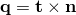 for a three-dimensional crack; for a two-dimensional crack, we simply have 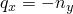 and . Specifying the normal implies that the crack plane is flat since only one value of  can be given per contour integral.

**Figure 11.4.2–1** Typical focused mesh for fracture mechanics evaluation.

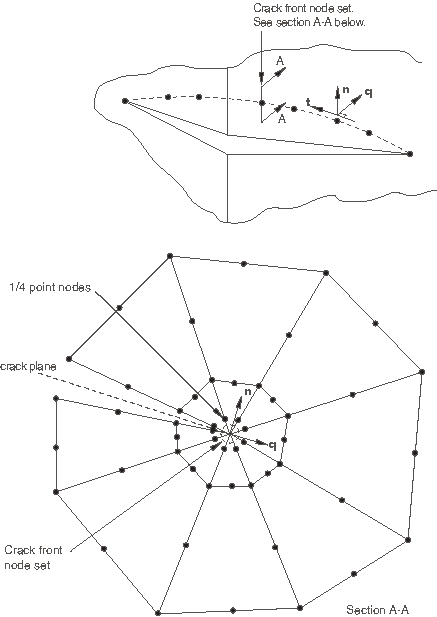

| **Input File Usage: ** | ``` [*CONTOUR INTEGRAL](../key/key-link.md#usb-kws-hcontintegral), CONTOURS=*n*, NORMAL *-direction cosine (or ), -direction cosine (or ), -direction cosine (or blank)* *crack front node set name (2D) or names (3D)* ``` |
| --- | --- |

| **Abaqus/CAE Usage: ** | Interaction module: ****Special****Crack****Create****: select the crack front: **Specify crack extension direction using: Normal to crack plane** |
| --- | --- |

##### Specifying the virtual crack extension direction

Alternatively, the virtual crack extension direction, , can be specified directly. In three dimensions the virtual crack extension direction, , will be corrected to be orthogonal to any normal defined at a node or in other cases to the tangent to the crack line itself. The tangent, , to the crack line at a particular point is obtained by parabolic interpolation through the crack front for which the virtual crack extension vector is defined and the nearest node sets on either side of this region. Abaqus/Standard will normalize the virtual crack extension direction, .

| **Input File Usage: ** | ``` [*CONTOUR INTEGRAL](../key/key-link.md#usb-kws-hcontintegral), CONTOURS=*n* *crack front node set name, -direction cosine (or ), -direction cosine (or ), -direction cosine (or blank)* ``` |
| --- | --- |
|  | Repeat the data line for three-dimensional cases to specify the crack front and virtual crack extension vector for each node (or cluster of focused nodes) along the crack line. |

| **Abaqus/CAE Usage: ** | Interaction module: ****Special****Crack****Create****: select the crack front: **Specify crack extension direction using: q vectors** |
| --- | --- |

##### Defining surface normals

In a case where the crack front intersects the external surface of a three-dimensional solid, where there is a surface of material discontinuity in the model, or where the crack is in a curved shell, the virtual crack extension direction, , must lie in the plane of the surface for accurate contour integral evaluation. Surface normals should be specified at all nodes that lie on such surfaces within the contours requested for this purpose (these nodes are printed out under the “Contour Integral” information in the data file). For shell element models the normals can be specified with the nodal coordinates if the normals calculated by Abaqus/Standard are not adequate. For solid element models the normals can be specified either directly (see ["Normal definitions at nodes," Section 2.1.4](pt01ch02s01aus08.md), and ["A plate with a part-through crack: elastic line spring modeling," Section 1.4.1 of the Abaqus Example Problems Guide](../exa/exa-link.md#exa-sta-crackplate)) or using the nodal coordinates (the fourth–sixth coordinates). If surface normals are not specified for the nodes on the crack surfaces and the external surfaces at the ends of a crack line, Abaqus/Standard will calculate the normals automatically for these nodes to correct any inadequate virtual crack extension directions, .

### Defining the data required for a contour integral with XFEM

If you are using XFEM to evaluate the contour integral, both the crack front and the virtual crack extension direction are determined by Abaqus/Standard.

### Symmetry with the conventional finite element method

If the crack is defined on a symmetry plane, only half the structure needs to be modeled. The change in potential energy calculated from the virtual crack front advance is doubled to compute the correct contour integral values.

| **Input File Usage: ** | Use the following option to indicate that the crack is defined on a symmetry plane: |
| --- | --- |
|  | ``` [*CONTOUR INTEGRAL](../key/key-link.md#usb-kws-hcontintegral), CONTOURS=*n*, SYMM ``` |

| **Abaqus/CAE Usage: ** | Interaction module: ****Special****Crack****Create****: select the crack front and crack tip or crack line, and specify the crack extension direction: **General**: toggle on **On symmetry plane (half-crack model)** |
| --- | --- |

### Constructing a fracture mechanics mesh for small-strain analysis with the conventional finite element method

Sharp cracks (where the crack faces lie on top of one another in the undeformed configuration) are usually modeled using small-strain assumptions. Focused meshes, as shown in [Figure 11.4.2--1](pt04ch11s04aus68.md#acontint-focused-mesh), should normally be used for small-strain fracture mechanics evaluations. However, for a sharp crack the strain field becomes singular at the crack tip. This result is obviously an approximation to the physics; however, the large-strain zone is very localized, and most fracture mechanics problems can be solved satisfactorily using only small-strain analysis.

The crack-tip strain singularity depends on the material model used. Linear elasticity, perfect plasticity, and power-law hardening are commonly used in fracture mechanics analysis. Power-law hardening has the form 

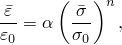

where  is the equivalent total strain,  is a reference strain,  is the Mises stress,  is the initial yield stress, *n* is the power-law hardening exponent (typically in the range of 3 to 8; 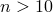 is very close to perfect plasticity for large ), and  is a material constant (typically in the range 0.5 to 1.0).

Results for pure power-law nonlinear elastic materials in a body under traction loading are proportional to the load to some power. Therefore, the fracture parameters for one geometry under a particular load can be scaled to any other load of the same distribution but different magnitude.

If the loading is proportional (the direction of the stress increase in stress space is approximately constant) and monotonically increasing, power-law hardening deformation plasticity and incremental plasticity are essentially equivalent. However, deformation plasticity is a nonlinear elastic material for which more analytical results are available. Abaqus uses the Ramberg-Osgood form of deformation plasticity (see ["Deformation plasticity," Section 23.2.13](pt05ch23s02abm29.md)); this model is not a pure power law model, which must be considered.

#### Creating the singularity

In most cases the singularity at the crack tip should be considered in small-strain analysis (when geometric nonlinearities are ignored). Including the singularity often improves the accuracy of the *J*-integral, the stress intensity factors, and the stress and strain calculations because the stresses and strains in the region close to the crack tip are more accurate. If *r* is the distance from the crack tip, the strain singularity in small-strain analysis is

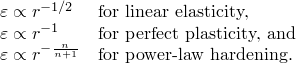

#### Modeling the crack-tip singularity in two dimensions

The square root and  singularity can be built into a finite element mesh using standard elements. The crack tip is modeled with a ring of collapsed quadrilateral elements, as shown in [Figure 11.4.2--2](pt04ch11s04aus68.md#acontint-coll-2d).

**Figure 11.4.2–2** Collapsed two-dimensional element.

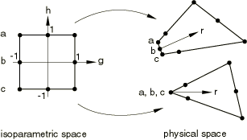

To obtain a mesh singularity, generally second-order elements are used and the elements are collapsed as follows:

1. Collapse one side of an 8-node isoparametric element (CPE8R, for example) so that all three nodes---*a*, *b*, and *c*---have the same geometric location (on the crack tip).
2. Move the midside nodes on the sides connected to the crack tip to the 1/4 point nearest the crack tip. You can create "quarter point" spacing with second-order isoparametric elements when you generate nodes for a region of a mesh; see ["Creating quarter-point spacing" in "Node definition," Section 2.1.1](pt01ch02s01aus05.md#usb-int-inode-nfill-quarterpoint).

This procedure will create the strain singularity 


The 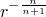 singularity cannot be created using Abaqus elements, but the combination of the 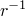 and 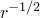 terms can provide a reasonable approximation for .

If 4-node isoparametric elements (for example, CPE4R) are used, one side of the element is collapsed, and the two coincident nodes are free to displace independently, a  singularity is created.

If the crack region is meshed with linear elements, the position specified for the midside nodes is ignored.

##### Creating a square root singularity

If nodes *a*, *b*, and *c* are constrained to move together, 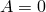 and the strains and stresses are square root singular (suitable for linear elasticity).

| **Input File Usage: ** | ``` [*NFILL](../key/key-link.md#usb-kws-mnfill), SINGULAR ``` |
| --- | --- |
|  | Constrain the collapsed nodes to move together by specifying the same node number in the list of nodes forming the element or by using a linear constraint equation or multi-point constraint to tie them together. |

| **Abaqus/CAE Usage: ** | Interaction module: ****Special****Crack****Create****: select the crack front and crack tip, and specify the crack extension direction: **Singularity**: **Midside node parameter:** 0.25, **Collapsed element side, single node** |
| --- | --- |

##### Creating a *1/r* singularity

If the midside nodes remain at the midside points rather than being moved to the 1/4 points and nodes *a*, *b*, and *c* are allowed to move independently, only the  singularity in strain is created (suitable for perfect plasticity).

| **Input File Usage: ** | ``` [*NFILL](../key/key-link.md#usb-kws-mnfill) ``` |
| --- | --- |

| **Abaqus/CAE Usage: ** | Interaction module: ****Special****Crack****Create****: select the crack front and crack tip, and specify the crack extension direction: **Singularity**: **Midside node parameter:** 0.5, **Collapsed element side, duplicate nodes** |
| --- | --- |

##### Creating a combined square root and *1/r* singularity

If the midside nodes are moved to the 1/4 points but nodes *a*, *b*, and *c* are allowed to move independently, the singularity created is a combination of the square root and  singularities. This combination is usually best for a power-law hardening material. However, since the  singularity dominates, moving the midside nodes to the 1/4 points gives only slightly better results than if the nodes are left at the midside points. Since creating a mesh with the midside nodes moved to the quarter points can be difficult, it is often best to simply use the  singularity.

| **Input File Usage: ** | ``` [*NFILL](../key/key-link.md#usb-kws-mnfill), SINGULAR ``` |
| --- | --- |

| **Abaqus/CAE Usage: ** | Interaction module: ****Special****Crack****Create****: select the crack front and crack tip, and specify the crack extension direction: **Singularity**: **Midside node parameter:** 0.25, **Collapsed element side, duplicate nodes** |
| --- | --- |

#### Modeling the crack-tip singularity in three dimensions

To create singular fields, 20-node bricks and 27-node bricks can be used with a collapsed face (see [Figure 11.4.2--3](pt04ch11s04aus68.md#acontint-coll-3d)).

**Figure 11.4.2–3** Collapsed three-dimensional element.


The planes of the three-dimensional elements perpendicular to the crack line should be planar for the best accuracy. If they are not planar, the element Jacobian may become negative at some integration points when the midside nodes are moved to the 1/4 points. To correct this problem, move the midside nodes slightly away from the 1/4 points toward the midpoint position (the distance moved is not critical).

See ["Meshing the crack region and assigning elements," Section 31.2.7 of the Abaqus/CAE User's Guide](../usi/usi-link.md#usi-eng-conc-crack-meshing), for information on creating a three-dimensional fracture mechanics mesh in Abaqus/CAE.

##### Creating a square root singularity

To obtain a square root singularity, constrain the nodes on the collapsed face of the edge planes to move together and move the nodes to the 1/4 points.

If the nodes at the midplane of a collapsed 20-node brick are constrained to move together, ; therefore, the singularity is not the same on the midplane as on an edge plane. This difference causes local oscillations in the solution about the crack tip along the crack line, although normally the oscillations are not significant.

If all midface nodes and the centroid node are included in a 27-node brick and the midside and midface nodes are moved to the 1/4 points closest to the crack line, the oscillation in the local stress and strain fields can be reduced.

| **Input File Usage: ** | ``` [*NFILL](../key/key-link.md#usb-kws-mnfill), SINGULAR ``` |
| --- | --- |
|  | Constrain the collapsed nodes to move together by specifying the same node number in the list of nodes forming the element or by using a linear constraint equation or multi-point constraint to tie them together. |

| **Abaqus/CAE Usage: ** | Interaction module: ****Special****Crack****Create****: select the crack front and crack line, and specify the crack extension direction: **Singularity**: **Midside node parameter:** 0.25, **Collapsed element side, single node** |
| --- | --- |

##### Creating a *1/r* singularity

To obtain a  singularity, allow the three nodes on the collapsed face to displace independently and keep the midside nodes at the midpoints.

| **Input File Usage: ** | ``` [*NFILL](../key/key-link.md#usb-kws-mnfill) ``` |
| --- | --- |

| **Abaqus/CAE Usage: ** | Interaction module: ****Special****Crack****Create****: select the crack front and crack line, and specify the crack extension direction: **Singularity**: **Midside node parameter:** 0.5, **Collapsed element side, duplicate nodes** |
| --- | --- |

##### Creating a combined square root and *1/r* singularity

To obtain a combined square root and  singularity, allow the nodes on the collapsed face to displace independently and move the midside nodes to the 1/4 points. As in the two-dimensional case, if it is difficult to create the mesh with the nodes moved to the 1/4 points, simply use the  singularity.

| **Input File Usage: ** | ``` [*NFILL](../key/key-link.md#usb-kws-mnfill), SINGULAR ``` |
| --- | --- |

| **Abaqus/CAE Usage: ** | Interaction module: ****Special****Crack****Create****: select the crack front and crack line, and specify the crack extension direction: **Singularity**: **Midside node parameter:** 0.25, **Collapsed element side, duplicate nodes** |
| --- | --- |

#### Mesh refinement

The size of the crack-tip elements influences the accuracy of the solutions: the smaller the radial dimension of the elements from the crack tip, the better the stress, strain, etc. results will be and, therefore, the better the contour integral calculations will be.

The angular strain dependence is not modeled with the singular elements. Reasonable results are obtained if typical elements around the crack tip subtend angles in the range of 10 (accurate) to 22.5 (moderately accurate).

Since the crack tip causes a stress concentration, the stress and strain gradients are large as the crack tip is approached. Path dependence in the evaluation of the *J*-integral may be an indication that the mesh is not sufficiently refined, but path independence does not prove mesh convergence. The finite element mesh must be refined in the vicinity of the crack to get accurate stresses and strains; however, accurate *J*-integral results can frequently be obtained even with a relatively coarse mesh.

In many cases if sufficiently fine meshes are used, accurate contour integral values can be obtained without using singular elements.

#### Modeling the crack-tip region in shells

Focused meshes can be used, but not all of the three-dimensional shell elements in Abaqus/Standard can be collapsed. Elements S8R and S8RT cannot be degenerated into triangles; element types S4, S4R, S4R5, S8R5, and S9R5 can. 

The quarter-point technique (moving the midside nodes to the quarter points to give a  singularity for elastic fracture mechanics applications) can be used with S8R5 and S9R5 elements but not with S8R(T) elements. When the quarter-point technique is used with S9R5 elements, the midface node should be moved to the quarter-point position along with the two midside nodes.

If S8R(T) elements are used, a keyhole should be introduced at the crack tip.

Flaws lying in the plane through the thickness of a shell can be modeled using line spring elements; see ["Line spring elements for modeling part-through cracks in shells," Section 32.9.1](pt06ch32s09alm54.md). In many cases line spring elements provide accurate *J*-integral and stress intensity values, but these elements are limited to modeling small strain and rotations. Limited modeling of plasticity is also allowed with line springs.

### Constructing a fracture mechanics mesh for finite-strain analysis with the conventional finite element method

In large-strain analysis (when geometric nonlinearities are included) singular elements should not normally be used. The mesh must be sufficiently refined to model the very high strain gradients around the crack tip if details in this region are required. Even if only the *J*-integral is required, the deformation around the crack tip may dominate the solution and the crack-tip region will have to be modeled with sufficient detail to avoid numerical problems.

Physically, the crack tip is not perfectly sharp. Therefore, it is normally modeled as a blunted notch with a radius of 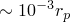, where  is a characteristic dimension of the plastic zone ahead of the crack tip. The notch must be small enough that, at the loads of interest, the deformed shape of the notch no longer depends on the original geometry. Typically, the notch must blunt out to more than four times its original radius for the deformed shape to be independent of the original geometry. The size of the elements around the notch should be about 1/10 the notch-tip radius to obtain accurate results.

If a crack is modeled as sharp, the finite elements near the crack tip may not be able to approximate the high gradients, resulting in convergence problems. The stress and strain results around the crack tip will probably be inaccurate even if convergence is achieved. However, if the solution converges, the contour integral results should be reasonably accurate. The convergence difficulties will probably be greater in three dimensions than in two dimensions.

In situations involving finite rotations but small strains, such as bending of slender structures, a small “keyhole” around the crack tip should be modeled. If the hole is small, the results will not be affected significantly and problems in dealing with the singular strains at the crack tip will be avoided.

### Using constraints with the conventional finite element method

General multi-point constraints and linear constraint equations (["Kinematic constraints: overview," Section 35.1.1](pt08ch35s01abo32.md)) should not be used on nodes in the mesh regions where contour integrals are calculated unless the nodes involved in the constraint are located at the same point. The nodes at the crack tip of a focused mesh can be tied together using multi-point constraints without adversely affecting the contour integral calculations. Tying these nodes will change the singularity at the crack tip, but path independence of the contour integral will be maintained. In addition, path independence of the contour integrals will not be affected if two faces of a model are joined using MPC type TIE or a linear constraint equation, provided that all nodes of the two faces are coincident. Using multi-point constraints for mesh refinement or for applying symmetry/antisymmetry boundary conditions within the contour integral region will result in path dependence of the contour integrals. No warning or error messages are provided if this rule is violated.

### Procedures

You can request contour integrals in fracture mechanics problems that were modeled using the following procedures: 
- static (["Static stress analysis," Section 6.2.2](pt03ch06s02at01.md)) with both XFEM and the conventional finite element methods;
- quasi-static (["Quasi-static analysis," Section 6.2.5](pt03ch06s02at04.md)) with the conventional finite element method only;
- steady-state transport (["Steady-state transport analysis," Section 6.4.1](pt03ch06s04at17.md)) with the conventional finite element method only;
- coupled thermal-stress procedures (["Fully coupled thermal-stress analysis," Section 6.5.3](pt03ch06s05at19.md)) with the conventional finite element method only; and
- crack propagation (["Crack propagation analysis," Section 11.4.3](pt04ch11s04aus69.md)) with the conventional finite element method only.

Contour integrals can be requested only in general analysis steps: they are not calculated in linear perturbation analyses (["General and linear perturbation procedures," Section 6.1.3](pt03ch06s01aus44.md)).

A crack analysis with pressure applied on the crack surfaces may give inaccurate contour integral values if geometric nonlinearity is included in a step.

### Loads

Contour integral calculations include the following distributed load types:
- thermal loads;
- distributed loads, including crack face pressure and traction loads on continuum elements as well as those applied using user subroutine [`DLOAD`](../sub/sub-link.md#sub-xsl-dload) and [`UTRACLOAD`](../sub/sub-link.md#sub-xsl-utracload);
- distributed loads, including surface traction loads and crack face edge loads on shell elements as well as those applied using user subroutine [`UTRACLOAD`](../sub/sub-link.md#sub-xsl-utracload);
- uniform and nonuniform body forces; and
- centrifugal loads on continuum and shell elements.

Contributions to the contour integral due to concentrated loads in the domain are not included; instead, the mesh must be modified to include a small element and a distributed load must be applied to this element.

Contributions due to contact forces are not included.

### Material options

*J*-integral calculations are valid for linear elastic, nonlinear elastic, and elastic-plastic materials. Plastic behavior can be modeled as nonlinear elastic (["Deformation plasticity," Section 23.2.13](pt05ch23s02abm29.md)), but the results are generally best if the material is modeled by incremental plasticity and is subject to proportional, monotonic traction loading.

If unloading has taken place in the plastic zone around the crack tip, the *J*-integral will not be valid except in very limited cases.

The -integral is valid for problems involving creep (["Rate-dependent plasticity: creep and swelling," Section 23.2.4](pt05ch23s02abm20.md)).

The stress intensity factor calculation is valid for cracks in homogeneous, linear elastic materials. It is also valid for an interfacial crack between two different isotropic linear elastic materials. It is not valid for any other types of materials, including user-defined materials.

The crack propagation direction is valid only for homogeneous, isotropic linear elastic materials.

The *T*-stress is valid only for homogeneous, isotropic linear elastic materials. Although the *T*-stress is calculated using the linear elastic material properties of the body with a crack, it is usually used with the *J*-integral calculated using the elastic-plastic material properties of the body (see ["*T*-stress extraction," Section 2.16.3 of the Abaqus Theory Guide](../stm/stm-link.md#stm-anl-tstress)).

If there is material discontinuity, the normal to the material discontinuity line must be specified for all nodes on the material discontinuity that will lie in a contour integral domain. The normal can be specified by defining user-specified normals (see ["Normal definitions at nodes," Section 2.1.4](pt01ch02s01aus08.md)) for the elements on both sides of the discontinuity or by using nodal normal coordinates for the nodes on the discontinuity. Contour integral calculations cannot be performed for a crack with a material discontinuity line passing through its tip (except for an interfacial crack between two different materials). Therefore, you should be careful when specifying a normal that is not perpendicular to the virtual crack extension direction, , for the nodes at the crack tip.

### Elements

When used with XFEM, the contour integral can be evaluated only in first-order or second-order tetrahedron and first-order brick elements. The following paragraphs apply only to the conventional finite element method.

The contour integral evaluation capability in Abaqus/Standard assumes that the elements that lie within the domain used for the calculations are quadrilaterals in two-dimensional or shell models or bricks in continuum three-dimensional models. Triangles, tetrahedra, or wedges should not be used in the mesh that is included in the contour integral regions. When the elements around the crack tip are generated in Abaqus/CAE, triangular elements (in two dimensions) or wedge elements (in three dimensions) are converted to collapsed quadrilateral or hexahedral elements. The elements within the contour domain should be of the same type.

In shell structures the contour integrals calculated by Abaqus/Standard will be contour independent only if the deformation mode around the crack tip is primarily membrane. If there are significant bending or transverse shear effects in the domain, the contour integrals may not be contour independent and contour integral values should be obtained directly from the displacements and/or the stresses.

Generalized plane strain elements, generalized axisymmetric elements with twist, asymmetric-axisymmetric elements, membrane elements, and cylindrical elements should not be used in the contour integral regions.

The contribution of rebar is included only in the calculations of the *J*-integral and the -integral for shell elements defined with a shell section integrated during the analysis (see ["Using a shell section integrated during the analysis to define the section behavior," Section 29.6.5](pt06ch29s06alm19.md)).

### Output

The domain associated with each contour is calculated automatically. The nodes belonging to each domain can be printed in the data file; see ["Controlling the amount of analysis input file processor information written to the data file" in "Output," Section 4.1.1](pt02ch04s01aus38.md#usb-out-ooutput-data-control). If you are using the conventional contour integral method, for each domain Abaqus/Standard creates a new node set in the output database to include these nodes; you can view these node sets in Abaqus/CAE. In addition, new node sets are created in the output database for nodes on crack surfaces and on free surfaces whose nodal normals are calculated by Abaqus/Standard. 

Contour integrals cannot be recovered from the restart file as described in ["Output," Section 4.1.1](pt02ch04s01aus38.md).

You should not request element output extrapolated to the nodes (["Element output" in "Output to the data and results files," Section 4.1.2](pt02ch04s01aus39.md#usb-out-oprintfile-elementoutput)) for second-order elements with one collapsed side in two dimensions or one collapsed face in three dimensions.

#### Default contour integral output

By default, the contour integral values are written to the data file and to the output database file. The following naming convention is used for contour integrals written to the output database: 

```
*integral-type*: *abbrev-integral-type* at *history-output-request-name*_*crack-name*_*internal-crack-tip-node-set-name*__Contour_*contour-number*
```
where *integral-type* can be - `Crack propagation direction (Cpd)`
- `J-integral (J)`
- `J-integral estimated from Ks (JKs)`
- `Stress intensity factor K1 (K1)`
- `Stress intensity factor K2 (K2)`
- `T-stress (T)`

For example, 
```
J-integral: J at JINT_CRACK_CRACKTIP-1__Contour_1
```

#### Writing the contour integrals to the results file

You can choose to write the contour integral values to the results file in addition to the data file.

| **Input File Usage: ** | Use the following option to write the contour integrals to the results file instead of the data file: |
| --- | --- |
|  | ``` [*CONTOUR INTEGRAL](../key/key-link.md#usb-kws-hcontintegral), CONTOURS=*n*, OUTPUT=FILE ``` Use the following option to write the contour integrals to the results file in addition to the data file: ``` [*CONTOUR INTEGRAL](../key/key-link.md#usb-kws-hcontintegral), CONTOURS=*n*, OUTPUT=BOTH ``` |

| **Abaqus/CAE Usage: ** | You cannot write contour integrals to the results file from Abaqus/CAE. |
| --- | --- |

#### Controlling the output frequency

You can control the output frequency, in increments, of contour integrals. By default, the crack-tip location and associated quantities will be printed every increment. Specify an output frequency of 0 to suppress contour integral output.

The output frequency for contour integral output to the output database is controlled by the larger of the frequency values specified for history output to the output database (see ["Output to the output database," Section 4.1.3](pt02ch04s01aus40.md)) or for contour integral output. If you specify an output frequency of 0 for the history output to the output database, contour integral values will not be written to the output database.

| **Input File Usage: ** | ``` [*CONTOUR INTEGRAL](../key/key-link.md#usb-kws-hcontintegral), CRACK NAME=*crack name*, CONTOURS=*n*, FREQUENCY=*f* ``` |
| --- | --- |

| **Abaqus/CAE Usage: ** | Step module: history output request editor: **Domain: Crack**: *crack name*, **Number of contours:** *n*, **Save output at** |
| --- | --- |


