# 11.4.3 Crack propagation analysis


**Products: **Abaqus/Standard  Abaqus/Explicit  Abaqus/CAE  

##### **References**

- ["Defining an analysis," Section 6.1.2](pt03ch06s01abo05.md)
- ["Fracture mechanics: overview," Section 11.4.1](pt04ch11s04abo13.md)
- ["Low-cycle fatigue analysis using the direct cyclic approach," Section 6.2.7](pt03ch06s02at06.md)
- ["Surface-based cohesive behavior," Section 37.1.10](pt09ch37s01alm63.md)
- [*COHESIVE BEHAVIOR](../key/key-link.md#usb-kws-mcohesivebehavior)
- [*CONTACT CLEARANCE](../key/key-link.md#usb-kws-hcontactclearance)
- [*DEBOND](../key/key-link.md#usb-kws-hdebond)
- [*DIRECT CYCLIC](../key/key-link.md#usb-kws-hdirectcyclic)
- [*FRACTURE CRITERION](../key/key-link.md#usb-kws-hfracturecriterion)
- [*NODAL ENERGY RATE](../key/key-link.md#usb-kws-mnodalenergyrate)
- ["Defining surface-to-surface contact in an Abaqus/Standard analysis" in "Defining surface-to-surface contact," Section 15.13.7 of the Abaqus/CAE User's Guide](../usi/usi-link.md#usi-itn-help-surftosurf-std)

### Overview

Crack propagation analysis:
- allows for six types of fracture criteria in Abaqus/Standard---critical stress at a certain distance ahead of the crack tip, critical crack opening displacement, crack length versus time, VCCT (the Virtual Crack Closure Technique), enhanced VCCT, and the low-cycle fatigue criterion based on the Paris law;
- allows for the VCCT fracture criterion in Abaqus/Explicit;
- in Abaqus/Standard models quasi-static crack growth in two dimensions (planar and axisymmetric) for all types of fracture criteria and in three dimensions (solid, shells, and continuum shells) for VCCT, enhanced VCCT, and the low-cycle fatigue criteria; and
- in Abaqus/Explicit models crack growth in three dimensions (solid, shells, and continuum shells) for VCCT criterion; and
- requires that you define two distinct initially bonded contact surfaces between which the crack will propagate.

### Defining initially bonded crack surfaces in Abaqus/Standard

Potential crack surfaces are modeled as slave and master contact surfaces (see ["Defining contact pairs in Abaqus/Standard," Section 36.3.1](pt09ch36s03aus145.md)). Any contact formulation except the finite-sliding, surface-to-surface formulation can be used. The predetermined crack surfaces are assumed to be initially partially bonded so that the crack tips can be identified explicitly by Abaqus/Standard. Initially bonded crack surfaces cannot be used with self-contact.

Define an initial condition to identify which part of the crack is initially bonded. You specify the slave surface, the master surface, and a node set that identifies the initially bonded part of the slave surface. The unbonded portion of the slave surface will behave as a regular contact surface. Either the slave surface or the master surface must be specified; if only the master surface is given, all of the slave surfaces associated with this master surface that have nodes in the node set will be bonded at these nodes.

If a node set is not specified, the initial contact conditions will apply to the entire contact pair; in this case, no crack tips can be identified, and the bonded surfaces cannot separate.

If a node set is specified, the initial conditions apply only to the slave nodes in the node set. Abaqus/Standard checks to ensure that the node set defined includes only slave nodes belonging to the contact pair specified.

By default, the nodes in the node set are considered to be initially bonded in all directions.

| **Input File Usage: ** | ``` [*INITIAL CONDITIONS](../key/key-link.md#usb-kws-minitialcond), TYPE=CONTACT ``` |
| --- | --- |

| **Abaqus/CAE Usage: ** | Interaction module: **Create Interaction**: **Surface-to-surface contact (Standard)** |
| --- | --- |

#### Bonding only in the normal direction

For fracture criteria based on the critical stress, critical crack opening displacement, or crack length versus time, it is possible to bond the nodes in the node set (or the contact pair if a node set is not defined) only in the normal direction. In this case the nodes are allowed to move freely tangential to the contact surfaces. Friction (["Frictional behavior," Section 37.1.5](pt09ch37s01aus169.md)) cannot be specified if the nodes are bonded only in the normal direction.

Bonding only in the normal direction is typically used to model bonded contact conditions in Mode I crack problems where the shear stress ahead of the crack along the crack plane is zero.

| **Input File Usage: ** | ``` [*INITIAL CONDITIONS](../key/key-link.md#usb-kws-minitialcond), TYPE=CONTACT, NORMAL ``` |
| --- | --- |

| **Abaqus/CAE Usage: ** | Bonding only in the normal direction is not supported in Abaqus/CAE. |
| --- | --- |

### Activating the crack propagation capability in Abaqus/Standard

The crack propagation capability must be activated within the step definition to specify that crack propagation may occur between the two surfaces that are initially partially bonded. You specify the surfaces along which the crack propagates.

If the crack propagation capability is not activated for partially bonded surfaces, the surfaces will not separate; in this case the specified initial contact conditions would have the same effect as that provided by the tied contact capability, which generates a permanent bond between two surfaces during the entire analysis (see ["Defining tied contact in Abaqus/Standard," Section 36.3.7](pt09ch36s03aus151.md)).

| **Input File Usage: ** | ``` [*DEBOND](../key/key-link.md#usb-kws-hdebond), SLAVE=*slave_surface_name*, MASTER=*master_surface_name* ``` |
| --- | --- |

| **Abaqus/CAE Usage: ** | Interaction module: **Create Interaction**: **Surface-to-surface contact (Standard)**, select master and slave surfaces |
| --- | --- |

#### Propagation of multiple cracks

Cracks can propagate from either a single crack tip or multiple crack tips. The crack propagation capability in Abaqus/Standard requires that the surfaces be initially partially bonded so that the crack tips can be identified. A contact pair can have crack propagation from multiple crack tips. However, only one crack propagation criterion is allowed for a given contact pair. Crack propagation along several contact pairs can be modeled by specifying multiple crack propagation definitions.

### Defining and activating crack propagation in Abaqus/Explicit

In Abaqus/Explicit potential crack surfaces are modeled as bonded general contact surfaces (see ["Defining general contact interactions in Abaqus/Explicit," Section 36.4.1](pt09ch36s04aus155.md)) in the context of  surface-based cohesive behavior (see ["Surface-based cohesive behavior," Section 37.1.10](pt09ch37s01alm63.md)). Hence, the capability is available in three-dimensional analyses only and is implemented using a pure master-slave formulation. As is the case in Abaqus/Standard, the predetermined crack surfaces are assumed to be initially partially bonded so that the crack tips can be identified explicitly.

To identify which pair of surfaces determine the crack and which part of the crack is initially bonded, you must define and assign a contact clearance (see ["Controlling initial contact status for general contact in Abaqus/Explicit," Section 36.4.4](pt09ch36s04aus158.md)). You first define a contact clearance to specify the node set that is initially bonded, and then you assign this contact clearance to a pair of two single-sided surfaces that define the crack. The unbonded portion behaves as a regular contact surface. The nodes in the node set are considered to be initially bonded in all directions.

The crack tip is identified only from the specified two surfaces and the node set. No attempt is made to determine a crack tip from all surfaces included in the general contact domain. Consequently, to be able to identify the crack tip, the surface including the specified node set must extend past the node set. Otherwise, the surfaces will not debond, and the crack cannot propagate.

You complete the definition of the crack propagation capability by defining a fracture-based cohesive behavior surface interaction. You activate the crack propagation by assigning it to the pair of surfaces that are initially partially bonded. If the fracture criterion is met, crack propagation occurs between these two surfaces. Cohesive behavior is also used to specify the elastic behavior of the bonds (see ["Surface-based cohesive behavior," Section 37.1.10](pt09ch37s01alm63.md)).

If a fracture-based surface interaction is not assigned to a pair of surfaces, the crack definition is incomplete. Unlike Abaqus/Standard where the identified nodes will stay bonded if the crack is not activated, in Abaqus/Explicit the nodes identified by the contact clearance definition will separate without generating any interface stress. 

Similar to Abaqus/Standard, cracks can propagate from single or multiple crack tips for the same pair of surfaces.

| **Input File Usage: ** | Use the following options: |
| --- | --- |
|  | ``` [*CONTACT CLEARANCE](../key/key-link.md#usb-kws-hcontactclearance), NAME=*clearance_name*, SEARCH NSET=*bonded_nset_name* ** [*SURFACE INTERACTION](../key/key-link.md#usb-kws-hsurfaceinteraction), NAME=*interaction_name* [*COHESIVE BEHAVIOR](../key/key-link.md#usb-kws-mcohesivebehavior) [*FRACTURE CRITERION](../key/key-link.md#usb-kws-hfracturecriterion) ..** [*CONTACT](../key/key-link.md#usb-kws-hcontact) [*CONTACT CLEARANCE ASSIGNMENT](../key/key-link.md#usb-kws-hcontclearassign) *slave_surface*, *master_surface*, *clearance_name* [*CONTACT PROPERTY ASSIGNMENT](../key/key-link.md#usb-kws-hcontpropassign) *slave_surface*, *master_surface*, *interaction_name* ``` |

| **Abaqus/CAE Usage: ** | Defining and activating crack propagation in Abaqus/Explicitis not supported in Abaqus/CAE. |
| --- | --- |

### Specifying a fracture criterion

You can specify the crack propagation criteria, as discussed below. [Table 11.4.3--1](pt04ch11s04aus69.md#vct-chp-analysissupport) shows which criteria are supported by Abaqus/Standard and Abaqus/Explicit. Only one crack propagation criterion is allowed per contact pair even if multiple cracks are present. 

**Table 11.4.3–1** 
| Crack propagation criterion | Abaqus/Standard | Abaqus/Explicit |
| --- | --- | --- |
| Critical stress | Yes | No |
| Critical crack opening displacement | Yes | No |
| Crack length versus time | Yes | No |
| VCCT | Yes | Yes |
| Enhanced VCCT | Yes | No |
| Low-cycle fatigue | Yes | No |

Crack propagation analysis is carried out on a nodal basis. The crack-tip node debonds when the fracture criterion, *f*, reaches the value 1.0 within a given tolerance: 


where 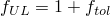 and 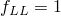 for VCCT, enhanced VCCT, and low-cycle fatigue criteria or 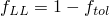 for other fracture criteria. You can specify the tolerance . In Abaqus/Standard, if , the time increment is cut back such that the crack propagation criterion is satisfied except in the case of an unstable crack growth problem where multiple nodes at and ahead of a crack tip are allowed to debond without the cut back of increment size in one increment. The default value of  is 0.1 for the critical stress, critical crack opening displacement, and crack length versus time criteria and is 0.2 for the VCCT, enhanced VCCT, and low-cycle fatigue criteria.

| **Input File Usage: ** | ``` [*FRACTURE CRITERION](../key/key-link.md#usb-kws-hfracturecriterion), TOLERANCE=, TYPE=*type* ``` |
| --- | --- |

| **Abaqus/CAE Usage: ** | Interaction module: **Create Interaction Property**: **Contact**, ****Mechanical****Fracture Criterion****, **Type**: **VCCT** or **Enhanced VCCT**, **Tolerance** |
| --- | --- |

#### Critical stress criterion

This criterion is available only in Abaqus/Standard.

If you specify a critical stress criterion at a critical distance ahead of the crack tip, the crack-tip node debonds when the local stress across the interface at a specified distance ahead of the crack tip reaches a critical value.

This criterion is typically used for crack propagation in brittle materials. The critical stress criterion is defined as 


where  is the normal component of stress carried across the interface at the distance specified;  and  are the shear stress components in the interface; and 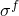 and 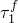 are the normal and shear failure stresses, which you must specify. The second component of the shear failure stress, , is not relevant in a two-dimensional analysis; therefore, the value of 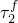 need not be specified. The crack-tip node debonds when the fracture criterion, *f*, reaches the value 1.0.

If the value of  is not given or is specified as zero, it will be taken to be a very large number so that the shear stress has no effect on the fracture criterion.

The distance ahead of the crack tip is measured along the slave surface, as shown in [Figure 11.4.3--1](pt04ch11s04aus69.md#acrackprop-crit-stress). The stresses at the specified distance ahead of the crack tip are obtained by interpolating the values at the adjacent nodes. The interpolation depends on whether first-order or second-order elements are used to define the slave surface.

**Figure 11.4.3–1** Distance specification for the critical stress criterion.

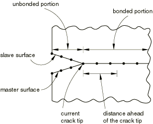

| **Input File Usage: ** | ``` [*FRACTURE CRITERION](../key/key-link.md#usb-kws-hfracturecriterion), TYPE=CRITICAL STRESS, DISTANCE=*n* ``` |
| --- | --- |

| **Abaqus/CAE Usage: ** | The critical stress criterion is not supported in Abaqus/CAE. |
| --- | --- |

#### Critical crack opening displacement criterion

This criterion is available only in Abaqus/Standard.

If you base the crack propagation analysis on the crack opening displacement criterion, the crack-tip node debonds when the crack opening displacement at a specified distance behind the crack tip reaches a critical value. This criterion is typically used for crack propagation in ductile materials.

The crack opening displacement criterion is defined as 


where  is the measured value of crack opening displacement and 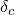 is the critical value of the crack opening displacement (user-specified). The crack-tip node debonds when the fracture criterion reaches the value 1.0.

You must supply the crack opening displacement versus cumulative crack length data. In Abaqus/Standard the cumulative crack length is defined as the distance between the initial crack tip and the current crack tip measured along the slave surface in the current configuration. The crack opening displacement is defined as the normal distance separating the two faces of the crack at the given distance.

You specify the position, *n*, behind the crack tip where the critical crack opening displacement is calculated. The value of this position must be specified as the length of the straight line joining the current crack tip and points on the slave and master surfaces ([Figure 11.4.3--2](pt04ch11s04aus69.md#acrackprop-cod)).

**Figure 11.4.3–2** Distance specification for the critical crack opening displacement criterion.


Abaqus/Standard computes the crack opening displacement at that point by interpolating the values at the adjacent nodes. The interpolation depends on whether first-order or second-order elements are used to define the slave surface. An error message will be issued if the value of *n* is not within the end points of the contact pair.

| **Input File Usage: ** | ``` [*FRACTURE CRITERION](../key/key-link.md#usb-kws-hfracturecriterion), TYPE=COD, DISTANCE=*n* ``` |
| --- | --- |

| **Abaqus/CAE Usage: ** | The critical crack opening displacement criterion is not supported in Abaqus/CAE. |
| --- | --- |

##### Modeling symmetry

In problems where the debonding surfaces lie on a symmetry plane, you can specify that Abaqus/Standard should consider only half of the user-specified crack opening displacement values. In this case the initial bonding must be in the normal direction only (see ["Bonding only in the normal direction](pt04ch11s04aus69.md#usb-anl-acrackpropagation-initcond-normal)” above).

| **Input File Usage: ** | ``` [*FRACTURE CRITERION](../key/key-link.md#usb-kws-hfracturecriterion), TYPE=COD, DISTANCE=*n*, SYMMETRY ``` |
| --- | --- |

| **Abaqus/CAE Usage: ** | Modeling symmetry is not supported in Abaqus/CAE. |
| --- | --- |

#### Crack length versus time criterion

This criterion is available only in Abaqus/Standard.

To specify the crack propagation explicitly as a function of total time, you must provide a crack length versus time relationship and a reference point from which the crack length is measured. This reference point is defined by specifying a node set. Abaqus/Standard finds the average of the current positions of the nodes in the set to define the reference point. During crack propagation the crack length is measured from this user-specified reference point along the slave surface in the deformed configuration. The time specified must be total time, not step time.

The fracture criterion, *f*, is stated in terms of the user-specified crack length and the length of the current crack tip. The length of the current crack tip from the reference point is measured as the sum of the straight line distance of the initial crack tip from the reference point and the distance between the initial crack tip and the current crack tip measured along the slave surface.

Referring to [Figure 11.4.3--3](pt04ch11s04aus69.md#acrackprop-vs-time), let node 1 be the initial location of the crack tip and node 3 be the current location of the crack tip. The distance of the current crack tip located at node 3 is given by 


where  is the length of the straight line joining node 1 and the reference point, 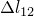 is the distance between nodes 1 and 2, and  is the distance between nodes 2 and 3 measured along the slave surface.

**Figure 11.4.3–3** Crack propagation as a function of time.


 The fracture criterion, *f*, is given by 


where *l* is the length at the current time obtained from the user-specified crack length versus time curve. Crack-tip node 3 will debond when the failure function *f* reaches the value of 1.0 (within the user-defined tolerance).

If geometric nonlinearity is considered in the step (["Defining an analysis," Section 6.1.2](pt03ch06s01abo05.md)), the reference point may move as the body deforms; you must ensure that this movement does not invalidate the crack length versus time criterion.

Abaqus/Standard does not extrapolate beyond the end points of your crack data. Therefore, if the first crack length specified is greater than the distance from the crack reference point to the first bonded node, the first bonded node will never debond and the crack will not propagate. In this case Abaqus/Standard will print warning messages in the message (`.msg`) file.

| **Input File Usage: ** | ``` [*FRACTURE CRITERION](../key/key-link.md#usb-kws-hfracturecriterion), TYPE=CRACK LENGTH, NSET=*name* ``` |
| --- | --- |

| **Abaqus/CAE Usage: ** | The crack length versus time criterion is not supported in Abaqus/CAE. |
| --- | --- |

#### VCCT criterion

This criterion is available in both Abaqus/Standard and Abaqus/Explicit.

The Virtual Crack Closure Technique (VCCT) criterion uses the principles of linear elastic fracture mechanics (LEFM) and, therefore, is appropriate for problems in which brittle crack propagation occurs along predefined surfaces.

VCCT is based on the assumption that the strain energy released when a crack is extended by a certain amount is the same as the energy required to close the crack by the same amount. For example, [Figure 11.4.3--4](pt04ch11s04aus69.md#vct-chp-intro-energy) illustrates the similarity between crack extension from *i* to *j* and crack closure at *j*.

**Figure 11.4.3–4** Mode I: The energy released when a crack is extended by a certain amount is the same as the energy required to close the crack.

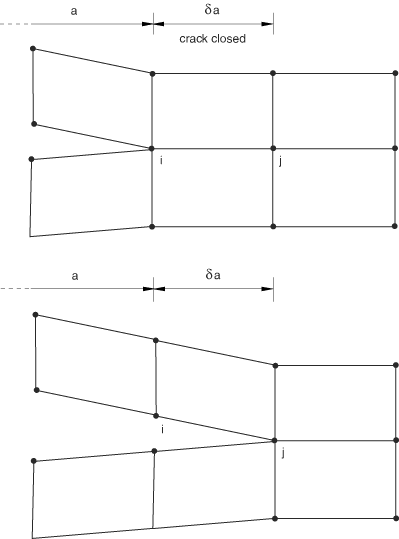

 In [Figure 11.4.3--5](pt04ch11s04aus69.md#vct-chp-intro-mode1) nodes 2 and 5 will start to release when 

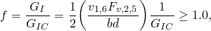

where  is the Mode I energy release rate,  is the critical Mode I energy release rate, *b* is the width, *d* is the length of the elements at the crack front,  is the vertical force between nodes 2 and 5, and 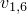 is the vertical displacement between nodes 1 and 6. Assuming that the crack closure is governed by linear elastic behavior, the energy to close the crack (and, thus, the energy to open the crack) is calculated from the previous equation. Similar arguments and equations can be written in two dimensions for Mode II and for three-dimensional crack surfaces including Mode III.

**Figure 11.4.3–5** Pure Mode I modified.

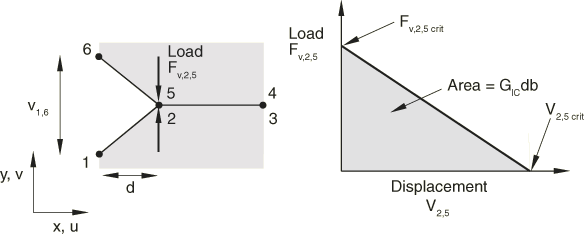

In the general case involving Mode I, II, and III the fracture criterion is defined as 


where  is the equivalent strain energy release rate calculated at a node, and  is the critical equivalent strain energy release rate calculated based on the user-specified mode-mix criterion and the bond strength of the interface. The crack-tip node will debond when the fracture criterion reaches the value of 1.0. 

Abaqus provides three common mode-mix formulae for computing : the BK law, the power law, and the Reeder law models. The choice of model is not always clear in any given analysis; an appropriate model is best selected empirically.

##### BK law

	The BK law model is described in Benzeggagh (1996) by the following formula:


To define this model, you must provide  and . This model provides a power law relationship combining energy release rates in Mode I, Mode II, and Mode III into a single scalar fracture criterion.

| **Input File Usage: ** | ``` [*FRACTURE CRITERION](../key/key-link.md#usb-kws-hfracturecriterion), TYPE=VCCT, MIXED MODE BEHAVIOR=BK ``` |
| --- | --- |

| **Abaqus/CAE Usage: ** | Interaction module: **Create Interaction Property**: **Contact**, ****Mechanical****Fracture Criterion****, **Type**: **VCCT**, **Mixed mode behavior**: **BK** |
| --- | --- |

##### Power law

The power law model is described in Wu (1965) by the following formula:


To define this model, you must provide  and .

| **Input File Usage: ** | ``` [*FRACTURE CRITERION](../key/key-link.md#usb-kws-hfracturecriterion), TYPE=VCCT, MIXED MODE BEHAVIOR=POWER ``` |
| --- | --- |

| **Abaqus/CAE Usage: ** | Interaction module: **Create Interaction Property**: **Contact**, ****Mechanical****Fracture Criterion****, **Type**: **VCCT**, **Mixed mode behavior**: **Power** |
| --- | --- |

##### Reeder law

The Reeder law model is described in Reeder (2002) by the following formula:


To define this model, you must provide  and . The Reeder law is best applied when . When 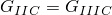, the Reeder law reduces to the BK law. The Reeder law applies only to three-dimensional problems.

| **Input File Usage: ** | ``` [*FRACTURE CRITERION](../key/key-link.md#usb-kws-hfracturecriterion), TYPE=VCCT, MIXED MODE BEHAVIOR=REEDER ``` |
| --- | --- |

| **Abaqus/CAE Usage: ** | Interaction module: **Create Interaction Property**: **Contact**, ****Mechanical****Fracture Criterion****, **Type**: **VCCT**, **Mixed mode behavior**: **Reeder** |
| --- | --- |

##### Releasing multiple nodes in one increment in Abaqus/Standard

For an unstable crack growth problem, sometimes it is more efficient to allow multiple nodes at and ahead of a crack tip to debond in one increment without cutting back the increment size when the VCCT fracture criterion is satisfied. This capability is activated automatically if you specify an unstable growth tolerance, 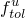. In this case if the fracture criterion, *f*, is within the given unstable growth tolerance: 


where  is the tolerance described earlier in this section, rather than cut back the increment size, more nodes at and ahead of the crack tip are allowed to debond in one increment until 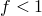 for all the nodes ahead of the crack tip. The forces at those debonded nodes are completely released immediately during the following increment. If you do not specify a value for the unstable growth tolerance, the default value is infinity. In this case the fracture criterion, *f*, for unstable crack growth is not limited by any upper-bound value in the above equation.

| **Input File Usage: ** | ``` [*FRACTURE CRITERION](../key/key-link.md#usb-kws-hfracturecriterion), TYPE=VCCT,UNSTABLE GROWTH TOLERANCE= ``` |
| --- | --- |

| **Abaqus/CAE Usage: ** | Interaction module: **Create Interaction Property**: **Contact**, ****Mechanical****Fracture Criterion****, **Type**: **VCCT**, toggle on **Specify tolerance for unstable crack propagation**: *specify value* |
| --- | --- |

##### Defining variable critical energy release rates

You can define a VCCT criterion with varying energy release rates by specifying the critical energy release rates at the nodes. 

If you indicate that the nodal critical energy rates will be specified, any constant critical energy release rates you specify are ignored, and the critical energy release rates are interpolated from the nodes. The critical energy release rates must be defined at all nodes on the slave surface.

| **Input File Usage: ** | Use both of the following options: |
| --- | --- |
|  | ``` [*FRACTURE CRITERION](../key/key-link.md#usb-kws-hfracturecriterion), TYPE=VCCT, NODAL ENERGY RATE [*NODAL ENERGY RATE](../key/key-link.md#usb-kws-mnodalenergyrate) ``` |

| **Abaqus/CAE Usage: ** | Defining variable critical energy release rates is not supported in Abaqus/CAE. |
| --- | --- |

#### Enhanced VCCT criterion

This criterion is available only in Abaqus/Standard.

The enhanced VCCT criterion is very similar to the original VCCT criterion described above. As in the original VCCT criterion, the fracture criterion in the general case involving Mode I, II, and III is defined as 


The crack-tip node debonds when the fracture criterion reaches the value of 1.0. However, unlike the original VCCT criterion, you can specify two different critical fracture energy release rates:  for the onset of a crack and 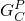 for the growth of a crack. When the enhanced VCCT criterion is used in the general case involving Mode I, II, and III fracture, the amount of energy dissipated associated with the release of the debonding force is controlled by the critical equivalent strain energy release rate required to propagate the crack, 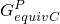, rather than by the critical equivalent strain energy release rate required to initiate the crack, 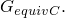 The formulae for calculating  are identical to those used for  for different mixed-mode fracture criteria.

| **Input File Usage: ** | ``` [*FRACTURE CRITERION](../key/key-link.md#usb-kws-hfracturecriterion), TYPE=ENHANCED VCCT ``` |
| --- | --- |

| **Abaqus/CAE Usage: ** | Interaction module: **Create Interaction Property**: **Contact**, ****Mechanical****Fracture Criterion****, **Type**: **Enhanced VCCT** |
| --- | --- |

#### Low-cycle fatigue criterion

This criterion is available only in Abaqus/Standard.

 If you specify the low-cycle fatigue criterion, progressive delamination growth at the interfaces in laminated composites subjected to sub-critical cyclic loadings can be simulated. This criterion can be used only in a low-cycle fatigue analysis using the direct cyclic approach (["Low-cycle fatigue analysis using the direct cyclic approach," Section 6.2.7](pt03ch06s02at06.md)). The onset and delamination growth are characterized by using the Paris law, which relates the relative fracture energy release rate to crack growth rates as illustrated in [Figure 11.4.3--6](pt04ch11s04aus69.md#usb-anl-direct-cyclic-acrackpropagation-parislaw-nls). The fracture energy release rates at the crack tips in the interface elements are calculated based on the above mentioned VCCT technique. 

The Paris regime is bounded by the energy release rate threshold, , below which there is no consideration of fatigue crack initiation or growth, and the energy release rate upper limit, , above which the fatigue crack will grow at an accelerated rate.  is the critical equivalent strain energy release rate calculated based on the user-specified mode-mix criterion and the bond strength of the interface. The formulae for calculating  have been provided above for different mixed mode fracture criteria. You can specify the ratio of  over  and the ratio of  over . The default values are  and . 

**Figure 11.4.3–6** Fatigue crack growth govern by Paris law.


| **Input File Usage: ** | ``` [*FRACTURE CRITERION](../key/key-link.md#usb-kws-hfracturecriterion), TYPE=FATIGUE ``` |
| --- | --- |

| **Abaqus/CAE Usage: ** | The low-cycle fatigue criterion is not supported in Abaqus/CAE. |
| --- | --- |

##### Onset of delamination growth

The onset of delamination growth refers to the beginning of fatigue crack growth at the crack tip along the interface. In a low-cycle fatigue analysis the onset of the fatigue crack growth criterion is characterized by , which is the relative fracture energy release rate when the structure is loaded between its maximum and minimum values. The fatigue crack growth initiation criterion is defined as 


 where  and  are material constants and  is the cycle number. The interface elements at the crack tips will not be released unless the above equation is satisfied and the maximum fracture energy release rate, , which corresponds to the cyclic energy release rate when the structure is loaded up to its maximum value, is greater than .

##### Fatigue delamination growth using the Paris law

Once the onset of delamination growth criterion is satisfied at the interface, the delamination growth rate, , can be calculated based on the relative fracture energy release rate, . The rate of the delamination growth per cycle is given by the Paris law if 


 where  and  are material constants.

At the end of cycle , Abaqus/Standard extends the crack length, , from the current cycle forward over an incremental number of cycles,  to  by releasing at least one element at the interface. Given the material constants  and , combined with the known node spacing  at the interface elements at the crack tips, the number of cycles necessary to fail each interface element at the crack tip can be calculated as , where *j* represents the node at the *j*the crack tip. The analysis is set up to release at least one interface element after the loading cycle is stabilized. The element with the fewest cycles is identified to be released, and its  is represented as the number of cycles to grow the crack equal to its element length, . The most critical element is completely released with a zero constraint and a zero stiffness at the end of the stabilized cycle. As the interface element is released, the load is redistributed and a new relative fracture energy release rate must be calculated for the interface elements at the crack tips for the next cycle. This capability allows at least one interface element at the crack tips to be released after each stabilized cycle and precisely accounts for the number of cycles needed to cause fatigue crack growth over that length.

 If , the interface elements at the crack tips will be released by increasing the cycle number count, 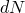, by one only.

### Specifying how a debonding force is released after a fracture criterion is met in Abaqus/Standard

After debonding, the traction between two surfaces is initially carried as equal and opposite forces at the slave node and the corresponding point on the master surface. The debonding force is released as the crack opens and advances. Once complete debonding has occurred at a point, the bond surfaces act like standard contact surfaces with associated interface characteristics. There are two different ways to release the debonding force, depending on the fracture criterion that you specify.

#### Specifying a debonding amplitude curve

When you use the critical stress, critical crack opening displacement, or crack length versus time fracture criteria, you can define how this force is to be reduced to zero with time after debonding starts at a particular node on the bonded surface. You specify a relative amplitude, *a*, as a function of time after debonding starts at a node. Thus, suppose the force transmitted between the surfaces at slave node *N* is 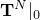 when that node starts to debond, which occurs at time . Then, for any time  the force transmitted between the surfaces at node *N* is 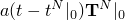. The relative amplitude must be 1.0 at the relative time 0.0 and must reduce to 0.0 at the last relative time point given.

The best choice of the amplitude curve depends on the material properties, specified loading, and the crack propagation criterion. If the stresses are removed too rapidly, the resulting large changes in the strains near the crack tip can cause convergence difficulties. For large-strain problems severe mesh distortion can also occur. For problems with rate-independent materials a linear amplitude curve is normally adequate. For problems with rate-dependent materials the stresses should be ramped off more slowly at the beginning of debonding to avoid convergence and mesh distortion difficulties. To reduce the likelihood of convergence and mesh distortion difficulties, you can reduce the value of the debond stress by 25% in 50% of the time to debond. The solution should not be strongly influenced by the details of the unloading procedure; if it is, this usually indicates that the mesh should be refined in the debond region.

| **Input File Usage: ** | ``` [*DEBOND](../key/key-link.md#usb-kws-hdebond), SLAVE=*slave*, MASTER=*master* *Data lines to define debonding amplitude curve* ``` |
| --- | --- |

| **Abaqus/CAE Usage: ** | Specifying a debonding amplitude curve is not supported in Abaqus/CAE. |
| --- | --- |

#### Ramping down debonding force for the VCCT and the enhanced VCCT criteria

 For the VCCT and the enhanced VCCT criteria, when the energy release rate exceeds the critical value at a crack tip, you can either release the traction between the two surfaces at the crack tip immediately during the following increment or release the traction gradually during succeeding increments with the reduction of the magnitude of the debonding force being governed by the critical fracture energy release rate. The latter approach is sometimes recommended to avoid sudden loss of stability when the crack tip is advanced. The enhanced VCCT criterion is meaningful only when used in conjunction with the latter approach. When the former approach is used, the results obtained by using the enhanced VCCT criterion are identical to those obtained by using the original VCCT criterion.

| **Input File Usage: ** | Use the following option to release the traction immediately: |
| --- | --- |
|  | ``` [*DEBOND](../key/key-link.md#usb-kws-hdebond), SLAVE=*slave*, MASTER=*master*, DEBONDING FORCE=STEP ``` Use the following option to release the traction gradually: ``` [*DEBOND](../key/key-link.md#usb-kws-hdebond), SLAVE=*slave*, MASTER=*master*, DEBONDING FORCE=RAMP ``` |

| **Abaqus/CAE Usage: ** | Interaction module: ****Special****Crack****Create****: **Name:** *crack name*, **Type:** **Debond using VCCT**, select the step and the surface to surface (Standard) interaction, **Debonding force:** **Step** or **Ramp** |
| --- | --- |

### Procedures

Crack propagation analysis can be performed for static or dynamic overloadings using the following procedures: 
- ["Static stress analysis," Section 6.2.2](pt03ch06s02at01.md)
- ["Quasi-static analysis," Section 6.2.5](pt03ch06s02at04.md)
- ["Implicit dynamic analysis using direct integration," Section 6.3.2](pt03ch06s03at07.md)
- ["Explicit dynamic analysis," Section 6.3.3](pt03ch06s03at08.md)
- ["Fully coupled thermal-stress analysis," Section 6.5.3](pt03ch06s05at19.md)

It can also be performed for sub-critical cyclic fatigue loadings using the following procedure:- ["Low-cycle fatigue analysis using the direct cyclic approach," Section 6.2.7](pt03ch06s02at06.md)

#### Controlling time incrementation during debonding in Abaqus/Standard

When automatic incrementation is used for any criteria other than VCCT, enhanced VCCT, or low-cycle fatigue, you can specify the size of the time increment used just after debonding starts. By default, the time increment is equal to the last relative time specified. However, if a fracture criterion is met at the beginning of an increment, the size of the time increment used just after debonding starts will be set equal to the minimum time increment allowed in this step.

For fixed time incrementation the specified time increment value will be used as the time increment size after debonding starts if Abaqus/Standard finds it needs a smaller time increment than the fixed time increment size. The time increment size will be modified as required until debonding is complete.

| **Input File Usage: ** | ``` [*DEBOND](../key/key-link.md#usb-kws-hdebond), SLAVE=*slave*, MASTER=*master*, TIME INCREMENT=*t* ``` |
| --- | --- |

| **Abaqus/CAE Usage: ** | Controlling time incrementation during debonding is not supported in Abaqus/CAE. |
| --- | --- |

#### Viscous regularization for VCCT in Abaqus/Standard

The simulation of structures with unstable propagating cracks is challenging and difficult. Nonconvergent behavior may occur from time to time. While the usual stabilization techniques (such as contact pair stabilization and static stabilization) can be used to overcome some convergence difficulties, localized damping is included for VCCT or enhanced VCCT by using the viscous regularization technique. Viscous regularization damping causes the tangent stiffness matrix of the softening material to be positive for sufficiently small time increments.

| **Input File Usage: ** | Use one of following options: |
| --- | --- |
|  | ``` [*FRACTURE CRITERION](../key/key-link.md#usb-kws-hfracturecriterion), TYPE=VCCT, VISCOSITY= ``` ``` [*FRACTURE CRITERION](../key/key-link.md#usb-kws-hfracturecriterion), TYPE=ENHANCED VCCT, VISCOSITY= ``` |

| **Abaqus/CAE Usage: ** | Interaction module: **Create Interaction Property**: **Contact**, ****Mechanical****Fracture Criterion****, **Type**: **VCCT** or **Enhanced VCCT**, **Viscosity** |
| --- | --- |

#### Linear scaling to accelerate convergence for VCCT in Abaqus/Standard

For most crack propagation simulations using VCCT or the enhanced VCCT criterion, the deformation can be nearly linear up to the point of the onset of crack growth; past this point the analysis becomes very nonlinear. In this case a linear scaling method can be used to effectively reduce the solution time to reach the onset of crack growth.

Suppose that an applied “trial” load at increment  is just a fraction of the critical load at the onset time of crack growth, . The following algorithm is used in Abaqus/Standard to quickly converge to the critical load state:

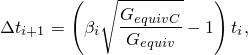

where initially  would be set between 0.7 and 0.9 depending on the degree of nonlinearity (the default value is 0.9). When 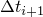 becomes smaller than 0.5% (indicating that the load is within 0.5% of its critical value), the next  is automatically set to 1.0 to cause the most critical crack-tip node to precisely reach the critical value at the next increment. After the first crack-tip node releases, the linear scaling calculations are no longer valid and the time increment is set to the default value. Cutback is then allowed.

| **Input File Usage: ** | ``` [*CONTROLS](../key/key-link.md#usb-kws-hcontrols), TYPE=VCCT LINEAR SCALING ``` |
| --- | --- |

| **Abaqus/CAE Usage: ** | Step module: ****Other****General Solution Controls****Edit****: *step name*, **VCCT Linear Scaling** |
| --- | --- |

#### Tips for using the VCCT or enhanced VCCT criterion in Abaqus/Standard

Crack propagation problems using the VCCT or enhanced VCCT criterion are numerically challenging. The following tips will help you create a successful Abaqus/Standard model:
- An analysis with the VCCT or enhanced VCCT criterion requires small time increments. Abaqus/Standard tracks the location of the active crack front node by node when the VCCT or enhanced VCCT criterion is used. Therefore, the crack front is allowed to advance only a single node forward in any single increment (although such an advance may take place across the entire crack front in three-dimensional problems). Because an analysis using the VCCT or enhanced VCCT criterion provides detailed results of the growth of the crack, you will need small time increments, especially if the mesh is highly refined.
- Three different types of damping can be used to aid convergence for a model using the VCCT or enhanced VCCT criterion: contact stabilization, automatic or static stabilization, and viscous regularization. Contact and automatic stabilization are not specific to VCCT; they are built into Abaqus/Standard and are compatible with VCCT. Setting the value of the damping parameters is often an iterative procedure. If your VCCT model fails to converge due to unstable crack propagation, set the damping parameters to relatively high values and rerun the analysis. If the parameters are high enough, stable incrementation should return. However, the crack propagation behavior may have been modified by the damping forces and may not be physically correct. To monitor the energy absorbed by viscous damping, plot the damping energy and compare the results to the total strain energy in the model (ALLSE). When set properly, the value of the damping energy should be a small fraction of the total energy. Monitor the damping energy to ensure that the results of the VCCT simulation are reasonable in the presence of damping. When you use contact or automatic stabilization, Abaqus writes the damping energy to the variable ALLSD in the output database (.`odb`) file. When you use viscous regularization, Abaqus writes the damping energy to the variable ALLVD.
- To maximize the accuracy of the debonding simulation, try to use matched meshes between the slave and master surfaces of the debonding contact pair.
- If you do use a mismatched mesh, you can maximize the accuracy of the simulation by using the small-sliding, surface-to-surface formulation for the contact pair (see ["Contact formulations in Abaqus/Standard," Section 38.1.1](pt09ch38s01aus177.md)).
- Printing contact constraint information to the data (`.dat`) file allows you to review the status of the debonding contact pair at the beginning of the analysis. By printing detailed contact conditions to the message (`.msg`) file, you can track the incremental behavior of the advancing crack front during the analysis. For more information about these output requests, see ["Output," Section 4.1.1](pt02ch04s01aus38.md).
- You can add a small clearance to the initially unbonded portion of the debonding contact pair (["Adjusting initial surface positions and specifying initial clearances in Abaqus/Standard contact pairs," Section 36.3.5](pt09ch36s03aus149.md)). The small clearance will help to eliminate unnecessary severe discontinuity iterations during incrementation as the crack begins to progress.
- Do not use tie MPCs (["General multi-point constraints," Section 35.2.2](pt08ch35s02aus130.md)) for the slave surface in a debonding contact pair. Abaqus is unable to resolve the overconstraint presented by the MPC and the debonded contact state.
- You must have continuous master debonding surfaces.
- You may be able to help the analysis converge by adding geometric nonlinearity (even if small-sliding is used for the debonding contact pair). For more information, see ["Geometric nonlinearity" in "General and linear perturbation procedures," Section 6.1.3](pt03ch06s01aus44.md#usb-anl-alinearnonlinear-nlgeom).
- For two-dimensional models with contact pairs involving higher-order underlying elements, the initially unbonded portion must extend over complete element faces. In other words, the crack tip in a two-dimensional, higher-order model must start at a corner node on the quadratic slave surfaces. The crack tip must not start at a midside node.

#### Tips for using the VCCT criterion in Abaqus/Explicit

Crack propagation problems using the VCCT criterion analyzed in Abaqus/Explicit benefit from the robustness of the general contact algorithm in the context of an explicit time integrator. Nevertheless, as is the case in Abaqus/Standard, these analyses remain challenging given the discontinuous nature of the fracture phenomenon. The following tips will help you create a successful Abaqus/Explicit model:
- Dynamic effects are of utmost relevance when assessing the results from a debonding analysis using the VCCT criterion. In most cases experimental and/or theoretical data are available in quasi-static settings. You must ensure that the Abaqus/Explicit analysis generates low ratios of kinetic energy to internal energy (1% or less). In practical terms this requirement often translates into avoiding the use of mass scaling in the model. Use smooth amplitudes to drive the loading to help reduce the kinetic energy in the model. Running the analysis over a longer period of time will not help in most cases because bond breakage is an inherently fast and localized process.
- If appropriate, use damping-like behavior in the materials associated with the debonding plates to reduce dynamic vibrations. Unlike Abaqus/Standard, where a pure static equilibrium is achieved at the end of a converged increment, in Abaqus/Explicit the bond breakage at a given location is associated with a dynamic overshoot beyond the static equilibrium position. If the vibrations are significant (kinetic energy is clearly observable), the dynamic overshoot at nodes behind the crack tip may lead to premature debonding of the crack tip.
- To maximize the accuracy of the debonding simulation, use quad meshes between the slave and master surfaces of the debonding surfaces. Avoid using elements with aspect ratios greater than 2. In most cases mesh refinement will help with obtaining a realistic result.
- Highly mismatched critical energy values between modes tend to induce crack propagation in continuously changing directions in a manner that may be unstable and unrealistic, particularly for modes II and III. Do not use such values unless experimental data suggest so.
- Use frequent field output requests to evaluate the debonding evolution as the analysis progresses. In some cases this can point to nontrivial modeling deficiencies that are difficult to identify from a simple data check analysis.
- Avoid the use of other constraints involving nodes on both surfaces of the debonding interface because the cohesive contact forces will compete with the constraint forces to achieve global equilibrium. Bond breakage might be hard to interpret in these cases.

#### Comparing VCCT and cohesive elements

Using VCCT to solve delamination problems is very similar to using cohesive elements in Abaqus. [Table 11.4.3--2](pt04ch11s04aus69.md#vct-chp-techniques-vcctversuscohesive) describes the advantages and disadvantages of the two approaches.

For an example of the use of cohesive elements, see ["Delamination analysis of laminated composites," Section 2.7.1 of the Abaqus Benchmarks Guide](../bmk/bmk-link.md#bmk-elm-alfanodelamination). This example also shows the effect of viscous regularization on the predicted force-displacement response.

**Table 11.4.3–2** Comparing VCCT and cohesive elements.
| VCCT | Cohesive Elements |
| --- | --- |
| Simulation (mechanics)-driven crack propagation along a known crack surface. | Simulation (mechanics)-driven crack propagation along a known crack surface. However, cohesive elements can also be placed between element faces as a mechanism for allowing individual elements to separate. |
| Models brittle fracture using LEFM only. | Model brittle or ductile fracture for LEFM or EPFM. Very general interaction modeling capability is possible. |
| Uses a surface-based framework. Does not require additional elements. | Require definition of the connectivity and interconnectivity of cohesive elements with the rest of the structure. For accuracy, the mesh of cohesive elements may need to be smaller than the surrounding structural mesh and the associated "cohesive zone." As a result, cohesive elements may be more expensive. |
| Requires a pre-existing flaw at the beginning of the crack surface. Cannot model crack initiation from a surface that is not already cracked. | Can model crack initiation from initially uncracked surfaces. The crack initiates when the cohesive traction stress exceeds a critical value. |
| Crack propagates when strain energy release rate exceeds fracture toughness. | Crack propagates according to cohesive damage model, usually calibrated so that the energy released when the crack is fully open equals the critical strain energy release rate. |
| Multiple crack fronts/surfaces can be included. | Multiple crack fronts/surfaces can be included. |
| In Abaqus/Standard crack surfaces are rigidly bonded when uncracked. | Crack surfaces are joined elastically when uncracked in Abaqus/Standard. |
| Requires user-specified fracture toughness of the bond. | Require user-specified critical traction value and fracture toughness of the bond, as well as elasticity of the bonded surface. |

#### Measuring the critical strain energy release properties for VCCT

You must obtain the critical strain energy release properties of the bonded surfaces for VCCT. The procedure to obtain the critical strain energy release properties is beyond the scope of this guide; however, you can refer to the following ASTM test specifications for guidance:
- ASTM D 5528-94a, "Standard Test Method for Mode I Interlaminar Fracture Toughness of Unidirectional Fiber-Reinforced Polymer Matrix Composites"
- ASTM D 6671-01, "Standard Test Method for Mixed Mode I-Mode II Interlaminar Fracture Toughness of Unidirectional Fiber-Reinforced Polymer Matrix Composites"
- ASTM D 6115-97, "Standard Test Method for Mode I Fatigue Delamination Growth Onset of Unidirectional Fiber-Reinforced Polymer Matrix Composites"

These test specifications can be found in the Annual Book of ASTM Standards, American Society for Testing and Materials, vol. 15.03, 2000.

### Initial conditions

Initial contact conditions are used to identify which part of the slave surface is initially bonded, as explained earlier.

### Boundary conditions

Boundary conditions should not be applied to any of the nodes on the master or slave crack surfaces, but they can be used to load the structure and cause crack propagation. Boundary conditions can be applied to any of the displacement degrees of freedom in a crack propagation analysis (["Boundary conditions in Abaqus/Standard and Abaqus/Explicit," Section 34.3.1](pt07ch34s03aus118.md)). In a low-cycle fatigue analysis, prescribed boundary conditions must have an amplitude definition that is cyclic over the step: the start value must be equal to the end value (see ["Amplitude curves," Section 34.1.2](pt07ch34s01aus115.md)).

### Loads

The following types of loading can be prescribed in a crack propagation analysis: 
- Concentrated nodal forces can be applied to the displacement degrees of freedom (1--6); see ["Concentrated loads," Section 34.4.2](pt07ch34s04aus121.md).
- Distributed pressure forces or body forces can be applied; see ["Distributed loads," Section 34.4.3](pt07ch34s04aus122.md). The distributed load types available with particular elements are described in [Part VI, "Elements](pt06.md)."

For a low-cycle fatigue analysis each load must have an amplitude definition that is cyclic over the step: the start value must be equal to the end value (see ["Amplitude curves," Section 34.1.2](pt07ch34s01aus115.md)).

### Predefined fields

The following predefined fields can be specified in a crack propagation analysis, as described in ["Predefined fields," Section 34.6.1](pt07ch34s06aus128.md):
- Although temperature is not a degree of freedom in stress/displacement elements, nodal temperatures can be specified as predefined fields. The specified temperature affects temperature-dependent critical stress and crack opening displacement failure criteria, if specified.
- The values of user-defined field variables can be specified. These values affect field-variable-dependent critical stress and crack opening displacement failure criteria, if specified.

The temperatures and user-defined field variables on slave and master surfaces are averaged to determine the critical stresses and crack opening displacements.

In a low-cycle fatigue analysis, the temperature values specified must be cyclic over the step: the start value must be equal to the end value (see ["Amplitude curves," Section 34.1.2](pt07ch34s01aus115.md)). If the temperatures are read from the results file, you should specify initial temperature conditions equal to the temperature values at the end of the step (see ["Initial conditions in Abaqus/Standard and Abaqus/Explicit," Section 34.2.1](pt07ch34s02aus116.md)). Alternatively, you can ramp the temperatures back to their initial condition values, as described in ["Predefined fields," Section 34.6.1](pt07ch34s06aus128.md). 

### Material options

Any of the mechanical constitutive models in Abaqus/Standard can be used to model the mechanical behavior of the cracking material. See [Part V, "Materials](pt05.md).”

### Elements

Regular, rectangular meshes give the best results in crack propagation analyses. Results with nonlinear materials are more sensitive to meshing than results with small-strain linear elasticity.

First-order elements generally work best for crack propagation analysis.

Line spring elements cannot be used in crack propagation analysis.

The VCCT, enhanced VCCT, and low-cycle fatigue criteria not only support two-dimensional models (planar and axisymmetric) but also three-dimensional models with contact pairs involving first-order underlying elements (solids, shells, and continuum shells). In Abaqus/Standard use of the VCCT or  enhanced VCCT criterion in two-dimensional models with contact pairs involving higher-order underlying elements is limited to crack fronts that are aligned with the corner nodes of the higher-order element faces. Use of the low-cycle fatigue criterion with contact pairs involving higher-order underlying elements is not supported.

### Output

Unless otherwise stated, the following discussions in this section are applied only to the critical stress, critical crack opening displacement, and crack length versus time criteria.

At the start of an analysis Abaqus/Standard will scan the partially bonded surfaces and identify all of the crack tips that are present in the model. The initial contact status of all of the slave surface nodes is printed in the data (`.dat`) file. At this stage Abaqus/Standard will explicitly identify all the crack tips and mark them as crack 1, crack 2, etc. The slave and master surfaces that are associated with these cracks are also identified.

The initial contact status of all of the slave surface nodes is also printed in the data (`.dat`) file for the VCCT, enhanced VCCT, and low-cycle fatigue criteria.

#### Printing crack propagation information to the data file

By default, crack propagation information will be printed to the data file during the analysis. For each crack that is identified Abaqus/Standard will print out the initial and current crack-tip node numbers, accumulated incremental crack length (distance from the initial crack tip to the current crack tip, measured along the slave surface), and the current value of the user-specified fracture criterion used. Crack propagation information cannot be printed to the data file in Abaqus/Explicit.

| **Input File Usage: ** | ``` [*DEBOND](../key/key-link.md#usb-kws-hdebond), SLAVE=*slave*, MASTER=*master* ``` |
| --- | --- |

| **Abaqus/CAE Usage: ** | Interaction module: ****Special****Crack****Create****: **Type:** **Debond using VCCT**, **Write output to DAT file every** *n* **increments** |
| --- | --- |

For example, if the crack opening displacement criterion is used, the printed output during the analysis will appear as follows in the data file: 

```
     CRACK TIP LOCATION AND ASSOCIATED QUANTITIES
CRACK  SLAVE   MASTER  INITIAL  CURRENT  CUMULATIVE  CRITICAL
NUMBER SURFACE SURFACE CRACKTIP CRACKTIP INCREMENTAL COD
                       NODE #   NODE #   LENGTH
   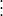                                             
```

#### Writing crack propagation information to the results file

In Abaqus/Standard you can choose to write the crack propagation information to the results (`.fil`) file.

| **Input File Usage: ** | ``` [*DEBOND](../key/key-link.md#usb-kws-hdebond), SLAVE=*slave*, MASTER=*master*, OUTPUT=FILE ``` |
| --- | --- |

| **Abaqus/CAE Usage: ** | Writing crack propagation information to the results file is not supported in Abaqus/CAE. |
| --- | --- |

#### Writing crack propagation information to both the data file and the results file

In Abaqus/Standard you can write the crack propagation information to both the data and the results files.

| **Input File Usage: ** | ``` [*DEBOND](../key/key-link.md#usb-kws-hdebond), SLAVE=*slave*, MASTER=*master*, OUTPUT=BOTH ``` |
| --- | --- |

| **Abaqus/CAE Usage: ** | Writing crack propagation information to both the data file and the results file is not supported in Abaqus/CAE. |
| --- | --- |

#### Controlling the output frequency

In Abaqus/Standard you can control the output frequency in increments. By default, the crack-tip location and associated quantities will be printed every increment. Specify an output frequency of 0 to suppress crack propagation output.

| **Input File Usage: ** | ``` [*DEBOND](../key/key-link.md#usb-kws-hdebond), SLAVE=*slave*, MASTER=*master*, FREQUENCY=*f* ``` |
| --- | --- |

| **Abaqus/CAE Usage: ** | Interaction module: ****Special****Crack****Create****: **Type:** **Debond using VCCT**, **Write output to DAT file every** *n* **increments** |
| --- | --- |

#### Output variables

The following bond failure quantities can be requested as surface output (see ["Output to the data and results files," Section 4.1.2](pt02ch04s01aus39.md); ["Abaqus/Standard output variable identifiers," Section 4.2.1](pt02ch04s02abv01.md); and ["Abaqus/Explicit output variable identifiers," Section 4.2.2](pt02ch04s02xbv01.md)) for all fracture criteria: 

| DBT | The time when bond failure occurred. For the VCCT, enhanced VCCT, and low-cycle fatigue criteria, this is the time when debonding initiates. |
| --- | --- |

| DBSF | Fraction of stress at bond failure that still remains. |
| --- | --- |

| DBS | All components of remaining stress in the failed bond. |
| --- | --- |

| DBS1*i* | 1*i* component of stress in the failed bond that remains (). |
| --- | --- |

For the VCCT, enhanced VCCT, and low-cycle fatigue criteria, the following additional variables can be also  requested as surface output (see ["Output to the data and results files," Section 4.1.2](pt02ch04s01aus39.md)): 

| CSDMG | Overall value of the scalar damage variable. |
| --- | --- |

| BDSTAT | Bond state. The bond state varies between 1.0 (fully bonded) and 0.0 (fully unbonded). |
| --- | --- |

| OPENBC | Relative displacement behind crack when the fracture criterion is met. |
| --- | --- |

| CRSTS | All components of critical stress at failure |
| --- | --- |

| CRSTS1*i* | 1*i* component of critical stress at failure (). |
| --- | --- |

| ENRRT | All components of strain energy release rate. |
| --- | --- |

| ENRRT1*i* | 1*i* component of strain energy release rate (). |
| --- | --- |

| EFENRRTR | Effective energy release rate ratio, 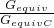. |
| --- | --- |

Surface output requests provide the usual output of contact variables in addition to the above quantities. The bond failure quantities must be requested explicitly; otherwise, only the default output for contact will be given.

Abaqus/CAE provides support for the visualization of time-history plots and *X*–*Y* plots of the variables that are written to the output database.

#### Contour integrals

Contour integrals can be requested for two-dimensional crack propagation analyses performed using the critical stress, critical crack opening displacement, or crack length versus time fracture criteria. If the contours are chosen so that the crack tip passes through the contour, the contour value will go to zero (as it should). Therefore, in crack propagation analysis contour integrals should be requested far enough from the crack tip that the crack tip does not pass through the contour, which is easily done by including all nodes along the bond surface in the crack-tip node set specified. See ["Contour integral evaluation," Section 11.4.2](pt04ch11s04aus68.md), for details on contour integral output.

### Input file template

#### Abaqus/Standard analysis

```
[*HEADING](../key/key-link.md#usb-kws-mheading)
…
[*BOUNDARY](../key/key-link.md#usb-kws-hboundary)
*Data lines to specify zero-valued boundary conditions*
[*INITIAL CONDITIONS](../key/key-link.md#usb-kws-minitialcond), TYPE=CONTACT (, NORMAL)
*Data lines to specify initial conditions*
[*SURFACE](../key/key-link.md#usb-kws-msurface), NAME=*slave*
*Data lines to define slave surface*
[*SURFACE](../key/key-link.md#usb-kws-msurface), NAME=*master*
*Data lines to define master surface*
**
[*CONTACT PAIR](../key/key-link.md#usb-kws-hcontactpair)
*slave, master*
** 
[*STEP](../key/key-link.md#usb-kws-hstep) (, NLGEOM)
[*STATIC](../key/key-link.md#usb-kws-hstatic) *or* [*VISCO](../key/key-link.md#usb-kws-hvisco) *or* [*COUPLED TEMPERATURE-DISPLACEMENT](../key/key-link.md#usb-kws-hcouptempdisp)
[*DEBOND](../key/key-link.md#usb-kws-hdebond), SLAVE=*slave*, MASTER=*master*
*Data lines to define debonding amplitude curve*
[*FRACTURE CRITERION](../key/key-link.md#usb-kws-hfracturecriterion), TYPE=*type*, DISTANCE *or* NSET
*Data lines to define fracture criterion*
[*BOUNDARY](../key/key-link.md#usb-kws-hboundary)
*Data lines to define zero-valued or nonzero boundary conditions*
[*CLOAD](../key/key-link.md#usb-kws-hcload) and/or [*DLOAD](../key/key-link.md#usb-kws-hdload) and/or [*TEMPERATURE](../key/key-link.md#usb-kws-htemperature) and/or [*FIELD](../key/key-link.md#usb-kws-hfield)
*Data lines to define loading*
**
[*CONTOUR INTEGRAL](../key/key-link.md#usb-kws-hcontintegral), CONTOURS=*n*, TYPE=*type*
***Contour integrals can be requested in a two-dimensional crack propagation analysis*
[*CONTACT PRINT](../key/key-link.md#usb-kws-hcontactprint)
DBT, DBSF, DBS
[*EL PRINT](../key/key-link.md#usb-kws-helprint)
JK,
[*END STEP](../key/key-link.md#usb-kws-hendstep)
**
[*STEP](../key/key-link.md#usb-kws-hstep) 
[*DIRECT CYCLIC](../key/key-link.md#usb-kws-hdirectcyclic), FATIGUE
[*DEBOND](../key/key-link.md#usb-kws-hdebond), SLAVE=*slave*, MASTER=*master*
[*FRACTURE CRITERION](../key/key-link.md#usb-kws-hfracturecriterion), TYPE=FATIGUE
*Data lines to define material constants used in Paris law and  fracture criterion*
[*BOUNDARY](../key/key-link.md#usb-kws-hboundary)
*Data lines to define zero-valued or nonzero cyclic  boundary conditions*
[*CLOAD](../key/key-link.md#usb-kws-hcload) and/or [*DLOAD](../key/key-link.md#usb-kws-hdload) and/or [*TEMPERATURE](../key/key-link.md#usb-kws-htemperature) and/or [*FIELD](../key/key-link.md#usb-kws-hfield)
*Data lines to define cyclic loading*
**
[*END STEP](../key/key-link.md#usb-kws-hendstep)
**
```

#### Abaqus/Explicit analysis

```
[*HEADING](../key/key-link.md#usb-kws-mheading)
…
[*BOUNDARY](../key/key-link.md#usb-kws-hboundary)
*Data lines to specify zero-valued boundary conditions*
[*SURFACE](../key/key-link.md#usb-kws-msurface), NAME=*slave*
*Data lines to define slave surface*
[*SURFACE](../key/key-link.md#usb-kws-msurface), NAME=*master*
*Data lines to define master surface*
**
[*CONTACT CLEARANCE](../key/key-link.md#usb-kws-hcontactclearance), NAME=*clearance_name*,
SEARCH NSET=*initially_bonded_nodeset_name*
[*SURFACE INTERACTION](../key/key-link.md#usb-kws-hsurfaceinteraction), NAME=*interaction_name*
[*COHESIVE BEHAVIOR](../key/key-link.md#usb-kws-mcohesivebehavior)
*Data lines to specify elastic behavior*
[*FRACTURE CRITERION](../key/key-link.md#usb-kws-hfracturecriterion), TYPE=VCCT, MIXED MODE BEHAVIOR=BK 
**
[*STEP](../key/key-link.md#usb-kws-hstep)
[*DYNAMIC](../key/key-link.md#usb-kws-hdynamic), EXPLICIT
[*CONTACT](../key/key-link.md#usb-kws-hcontact)
[*CONTACT CLEARANCE ASSIGNMENT](../key/key-link.md#usb-kws-hcontclearassign)
*Data lines to assign a clearance name to a surface pair*
[*CONTACT PROPERTY ASSIGNMENT](../key/key-link.md#usb-kws-hcontpropassign)
*Data lines to assign a surface interaction to a surface pair*
[*END STEP](../key/key-link.md#usb-kws-hendstep)
**

```

#### Additional references

- Benzeggagh, M., and M. Kenane, "Measurement of Mixed-Mode Delamination Fracture Toughness of Unidirectional Glass/Epoxy Composites with Mixed-Mode Bending Apparatus," Composite Science and Technology, vol. 56 439, 1996.
- Reeder, J., S. Kyongchan, P. B. Chunchu, and D. R.. Ambur, "Postbuckling and Growth of Delaminations in Composite Plates Subjected to Axial Compression"43rd AIAA/ASME/ASCE/AHS/ASC Structures, Structural Dynamics, and Materials Conference, Denver, Colorado, vol. 1746, p. 10, 2002.
- Wu, E. M., and R. C. Reuter Jr., "Crack Extension in Fiberglass Reinforced Plastics," T and M Report, University of Illinois, vol. 275, 1965.


