# 11.5.2 Fluid cavity definition


**Products: **Abaqus/Standard  Abaqus/Explicit  Abaqus/CAE  

##### **References**

- ["Surface-based fluid cavities: overview," Section 11.5.1](pt04ch11s05aus70.md)
- ["Fluid exchange definition," Section 11.5.3](pt04ch11s05aus72.md)
- [*CAPACITY](../key/key-link.md#usb-kws-mcapacity)
- [*FLUID BEHAVIOR](../key/key-link.md#usb-kws-mfluidbehavior)
- [*FLUID BULK MODULUS](../key/key-link.md#usb-kws-mfluidbulk)
- [*FLUID CAVITY](../key/key-link.md#usb-kws-mfluidcavity)
- [*FLUID DENSITY](../key/key-link.md#usb-kws-mfluiddensity)
- [*MOLECULAR WEIGHT](../key/key-link.md#usb-kws-mmolecularweight)
- ["Defining a fluid cavity interaction," Section 15.13.11 of the Abaqus/CAE User's Guide](../usi/usi-link.md#usi-itn-help-fluid-cavity)
- ["Defining a fluid cavity interaction property," Section 15.14.4 of the Abaqus/CAE User's Guide](../usi/usi-link.md#usi-itn-help-prop-fluid-cavity)

### Overview

A surface-based fluid cavity: 
- can be used to model a liquid-filled or gas-filled structure;
- is associated with a node known as the cavity reference node;
- is defined by specifying a surface that fully encloses the cavity;
- is applicable only for situations where the pressure and temperature of the fluid in a particular cavity are uniform at any point in time;
- can be used to model an airbag using the assumptions of an ideal gas mixture under adiabatic conditions; and
- has a name that can be used to identify history output associated with the cavity.

### Defining the fluid cavity

You must associate a name with each fluid cavity.

| **Input File Usage: ** | ``` [*FLUID CAVITY](../key/key-link.md#usb-kws-mfluidcavity), NAME=*name* ``` |
| --- | --- |

| **Abaqus/CAE Usage: ** | Interaction module: **Create Interaction**: **Fluid cavity**, **Name**: *name* |
| --- | --- |

#### Specifying the cavity reference node

Every fluid cavity must have an associated cavity reference node. Along with the fluid cavity name, the reference node is used to identify the fluid cavity. In addition, it may be referenced by fluid exchange and inflator definitions. The reference node should not be connected to any elements in the model.

| **Input File Usage: ** | ``` [*FLUID CAVITY](../key/key-link.md#usb-kws-mfluidcavity), REF NODE=*n* ``` |
| --- | --- |

| **Abaqus/CAE Usage: ** | Interaction module: **Create Interaction**: **Fluid cavity**: select the fluid cavity reference node |
| --- | --- |

#### Specifying the boundary of the fluid cavity

The fluid cavity must be completely enclosed by finite elements unless symmetry planes are modeled (see ["Surface-based fluid cavities: overview," Section 11.5.1](pt04ch11s05aus70.md)). Surface elements can be used for portions of the cavity surface that are not structural. The boundary of the cavity is specified using an element-based surface covering the elements that surround the cavity with surface normals pointing inward. By default, an error message is issued if the underlying elements of the surface do not have consistent normals. Alternatively, you can skip the consistency checking for the surface normals.

| **Input File Usage: ** | Use the following option to define the surface with consistent normal checking: |
| --- | --- |
|  | ``` [*FLUID CAVITY](../key/key-link.md#usb-kws-mfluidcavity), SURFACE=*surface_name*, CHECK NORMALS=YES ``` Use the following option to define the surface without consistent normal checking: ``` [*FLUID CAVITY](../key/key-link.md#usb-kws-mfluidcavity), SURFACE=*surface_name*, CHECK NORMALS=NO ``` |

| **Abaqus/CAE Usage: ** | Interaction module: **Create Interaction**: **Fluid cavity**: select the fluid cavity boundary surface; toggle on or off **Check surface normals** |
| --- | --- |

#### Specifying additional volume in a fluid cavity

An additional volume can be specified for a fluid cavity. The additional volume will be added to the actual volume when the boundary of the cavity is defined by a specified surface. If you do not specify a surface forming the boundary of the fluid cavity, the fluid cavity is assumed to have a fixed volume that is equal to the added volume.

| **Input File Usage: ** | ``` [*FLUID CAVITY](../key/key-link.md#usb-kws-mfluidcavity), ADDED VOLUME=*r* ``` |
| --- | --- |

| **Abaqus/CAE Usage: ** | Specification of additional volume is not supported in Abaqus/CAE. |
| --- | --- |

#### Specifying the minimum volume

When the volume of a fluid cavity is extremely small, transients in an explicit dynamic procedure can cause the volume to go to zero or even negative causing the effective cavity stiffness values to tend to infinity. To avoid numerical problems, you can specify a minimum volume for the fluid in Abaqus/Explicit. If the volume of the cavity (which is equal to the actual volume plus the added volume) drops below the minimum, the minimum value is used to evaluate the fluid pressure.

You can specify the minimum volume either directly or as the initial volume of the fluid cavity. If the latter method is used and the initial volume of the fluid cavity is a negative value, the minimum volume is set equal to zero. 

| **Input File Usage: ** | Use the following option to specify the minimum volume directly: |
| --- | --- |
|  | ``` [*FLUID CAVITY](../key/key-link.md#usb-kws-mfluidcavity), MINIMUM VOLUME=*minimum volume* ``` Use the following option to specify the minimum volume to be equal to the initial volume: ``` [*FLUID CAVITY](../key/key-link.md#usb-kws-mfluidcavity), MINIMUM VOLUME=INITIAL VOLUME ``` |

| **Abaqus/CAE Usage: ** | Specification of a minimum volume is not supported in Abaqus/CAE. |
| --- | --- |

### Defining the fluid cavity behavior

The fluid cavity behavior governs the relationship between cavity pressure, volume, and temperature. A fluid cavity in Abaqus/Standard can contain only a single fluid. In Abaqus/Explicit a cavity can contain a single fluid or a mixture of ideal gases.

#### Fluid behavior with a homogeneous fluid

To define a fluid cavity behavior made of a single fluid, specify a single fluid behavior to define the fluid properties. You must associate the fluid behavior with a name. This name can then be used to associate a certain behavior with a fluid cavity definition.

| **Input File Usage: ** | Use the following options: |
| --- | --- |
|  | ``` [*FLUID CAVITY](../key/key-link.md#usb-kws-mfluidcavity), NAME=*fluid_cavity_name*, BEHAVIOR=*behavior_name* [*FLUID BEHAVIOR](../key/key-link.md#usb-kws-mfluidbehavior), NAME=*behavior_name* ``` |

| **Abaqus/CAE Usage: ** | Interaction module: **Create Interaction Property**: **Fluid cavity**, **Name**: *behavior_name* |
| --- | --- |

#### Fluid behavior with a mixture of ideal gases in Abaqus/Explicit

In Abaqus/Explicit you can define  a fluid cavity behavior made of multiple gas species. To define a fluid cavity behavior made of multiple gas species, you specify multiple fluid behaviors to define the fluid properties. Specify the names of the fluid behaviors and the initial mass or molar fractions defining the mixture to associate a certain group of behaviors with a fluid cavity definition.

| **Input File Usage: ** | Use the following options to define the fluid cavity mixture in terms of the initial mass fraction: |
| --- | --- |
|  | ``` [*FLUID BEHAVIOR](../key/key-link.md#usb-kws-mfluidbehavior), NAME=*behavior_name* [*FLUID CAVITY](../key/key-link.md#usb-kws-mfluidcavity), NAME=*fluid_cavity_name*, MIXTURE=MASS FRACTION *out-of-plane surface thickness (if required; otherwise, blank)* *behavior_name*, *initial mass fraction* ... ``` Use the following options to define the fluid cavity mixture in terms of the initial molar fraction: ``` [*FLUID BEHAVIOR](../key/key-link.md#usb-kws-mfluidbehavior), NAME=*behavior_name* [*FLUID CAVITY](../key/key-link.md#usb-kws-mfluidcavity), NAME=*fluid_cavity_name*, MIXTURE=MOLAR FRACTION *out-of-plane surface thickness (if required; otherwise, blank)* *behavior_name*, *initial molar fraction* ... ``` |

| **Abaqus/CAE Usage: ** | Specification of ideal gas mixtures is not supported in Abaqus/CAE. |
| --- | --- |

#### User-defined fluid behavior in Abaqus/Standard

In Abaqus/Standard the fluid behavior can be defined in user subroutine [`UFLUID`](../sub/sub-link.md#sub-xsl-ufluid).

| **Input File Usage: ** | ``` [*FLUID BEHAVIOR](../key/key-link.md#usb-kws-mfluidbehavior), USER ``` |
| --- | --- |

| **Abaqus/CAE Usage: ** | User subroutine [`UFLUID`](../sub/sub-link.md#sub-xsl-ufluid) is not supported in Abaqus/CAE. |
| --- | --- |

### Defining the ambient pressure for a fluid cavity

For pneumatic fluids the equilibrium problem is generally expressed in terms of the “gauge” pressure in the fluid cavity (that is, ambient atmospheric pressure does not contribute to the loading of the solid and structural parts of the system). You can choose to convert gauge pressure to absolute pressure  as used in the constitutive law. For hydraulic fluids you can define the ambient pressure, which can be used to calculate the pressure difference in the fluid exchange between a fluid cavity and its environment. The pressure value given as degree of freedom 8 at the cavity reference node is the value of the gauge pressure. The ambient pressure, , is assumed to be zero if you do not specify it.

| **Input File Usage: ** | ``` [*FLUID CAVITY](../key/key-link.md#usb-kws-mfluidcavity), AMBIENT PRESSURE= ``` |
| --- | --- |

| **Abaqus/CAE Usage: ** | Interaction module: **Create Interaction**: **Fluid cavity**: toggle on **Specify ambient pressure**:  |
| --- | --- |

#### Isothermal process

For hydraulic fluids and pneumatic fluids in problems of long time duration, it is reasonable to assume that the temperature is constant or a known function of the environment surrounding the cavity. In this case the temperature of the fluid can be defined by specifying initial conditions (see ["Defining initial temperatures" in "Initial conditions in Abaqus/Standard and Abaqus/Explicit," Section 34.2.1](pt07ch34s02aus116.md#usb-prc-pinitialcond-temp)) and predefined temperature fields (see ["Predefined temperature" in "Predefined fields," Section 34.6.1](pt07ch34s06aus128.md#usb-prc-pfields-temp)) at the cavity reference node. For a pneumatic fluid the pressure and density of the gas are calculated from the ideal gas law, conservation of mass, and the predefined temperature field.

### Defining the ambient temperature for a fluid cavity

For pneumatic fluids with adiabatic behavior the ambient temperature is needed when the heat energy flow is defined between a single cavity and its environment and the flow definition is based on analysis conditions. The ambient temperature, , is assumed to be zero if you do not specify it.

| **Input File Usage: ** | ``` [*FLUID CAVITY](../key/key-link.md#usb-kws-mfluidcavity), AMBIENT TEMPERATURE= ``` |
| --- | --- |

| **Abaqus/CAE Usage: ** | Specification of ambient temperature is not supported in Abaqus/CAE. |
| --- | --- |

### Hydraulic fluids

The hydraulic fluid model is used to model nearly incompressible fluid behavior and fully incompressible fluid behavior in Abaqus/Standard. Compressibility is introduced by assuming a linear pressure-volume relationship. The required parameters for compressible behavior are the bulk modulus and the reference density. You omit the bulk modulus to specify fully incompressible behavior in Abaqus/Standard. Temperature dependence of the density can be modeled as a thermal expansion of the fluid.

| **Input File Usage: ** | ``` [*FLUID CAVITY](../key/key-link.md#usb-kws-mfluidcavity), BEHAVIOR=*behavior_name* ``` |
| --- | --- |

| **Abaqus/CAE Usage: ** | Interaction module: **Create Interaction Property**: **Fluid cavity**: **Definition**: **Hydraulic** |
| --- | --- |

#### Defining the reference fluid density

The reference fluid density, , is specified at zero pressure and the initial temperature, :

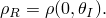

| **Input File Usage: ** | ``` [*FLUID DENSITY](../key/key-link.md#usb-kws-mfluiddensity) ``` |
| --- | --- |

| **Abaqus/CAE Usage: ** | Interaction module: **Create Interaction Property**: **Fluid cavity**: **Definition**: **Hydraulic**: **Fluid density**: *density* |
| --- | --- |

#### Defining the fluid bulk modulus for compressibility

The compressibility is described by the bulk modulus of the fluid: 

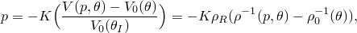

where 

*p*

is the current pressure,


is the current temperature,

*K*

is the fluid bulk modulus,

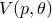

is the current fluid volume,


is the density at current pressure and temperature,


is the fluid volume at zero pressure and current temperature,

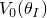

is the fluid volume at zero pressure and initial temperature, and


is the density at zero pressure and current temperature.

It is assumed that the bulk modulus is independent of the change in fluid density. However, the bulk modulus can be specified as a function of temperature or predefined field variables.

| **Input File Usage: ** | ``` [*FLUID BULK MODULUS](../key/key-link.md#usb-kws-mfluidbulk) ``` |
| --- | --- |

| **Abaqus/CAE Usage: ** | Interaction module: **Create Interaction Property**: **Fluid cavity**: **Definition**: **Hydraulic**: **Fluid Bulk Modulus** tabbed page: toggle on **Specify fluid bulk modulus**, and enter the modulus value in the table |
| --- | --- |
|  | Use the following options to include temperature and field variable dependence: Toggle on **Use temperature-dependent data**, **Number of field variables**: *n* |

#### Defining the fluid expansion

The thermal expansion coefficients are interpreted as total expansion coefficients from a reference temperature, which can be specified as a function of temperature or predefined field variables. The change in fluid volume due to thermal expansion is determined as follows: 


where  is the reference temperature for the coefficient of thermal expansion and  is the mean (secant) coefficient of thermal expansion.

If the coefficient of thermal expansion is not a function of temperature or field variables, the value of  is not needed.

Thermal expansion can also be expressed in terms of the fluid density:

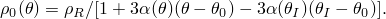

| **Input File Usage: ** | ``` [*FLUID EXPANSION](../key/key-link.md#usb-kws-mfluidexpansion), ZERO= ``` |
| --- | --- |

| **Abaqus/CAE Usage: ** | Interaction module: **Create Interaction Property**: **Fluid cavity**: **Definition**: **Hydraulic**: **Fluid Expansion** tabbed page: toggle on **Specify fluid thermal expansion coefficients**, and enter the mean coefficient of thermal expansion in the table |
| --- | --- |
|  | Use the following options to include temperature and field variable dependence: Toggle on **Use temperature-dependent data**, **Reference temperature**: , **Number of field variables**: *n* |

### Pneumatic fluids

Compressible or pneumatic fluids are modeled as an ideal gas (see ["Equation of state," Section 25.2.1](pt05ch25s02abm50.md)). The equation of state for an ideal gas (or the ideal gas law) is given as 

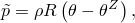

where the absolute (or total) pressure  is defined as 

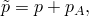

and  is the ambient pressure, *p* is the gauge pressure, *R* is the gas constant,  is the current temperature, and  is absolute zero on the temperature scale being used. The gas constant, *R*, can also be determined from the universal gas constant, 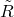, and the molecular weight, , as follows:


Conservation of mass gives the change of mass in the fluid cavity as


where *m* is the mass of the fluid, 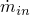 is the mass flow rate into the fluid cavity, and  is the mass flow rate out of the fluid cavity.

#### Defining the molecular weight

You must specify the value of the molecular weight of the ideal gas, .

| **Input File Usage: ** | ``` [*MOLECULAR WEIGHT](../key/key-link.md#usb-kws-mmolecularweight)  ``` |
| --- | --- |

| **Abaqus/CAE Usage: ** | Interaction module: **Create Interaction Property**: **Fluid cavity**: **Definition**: **Pneumatic**, **Ideal gas molecular weight**:  |
| --- | --- |

#### Specifying the value of the universal gas constant

You can specify the value of the universal gas constant, .

| **Input File Usage: ** | ``` [*PHYSICAL CONSTANTS](../key/key-link.md#usb-kws-mphysicalconsts), UNIVERSAL GAS CONSTANT= ``` |
| --- | --- |

| **Abaqus/CAE Usage: ** | All modules: ****Model****Edit attributes*****model name*****: **Physical Constants**: toggle on **Universal gas constant**:  |
| --- | --- |

#### Specifying the value of absolute zero

You can specify the value of absolute zero temperature, .

| **Input File Usage: ** | ``` [*PHYSICAL CONSTANTS](../key/key-link.md#usb-kws-mphysicalconsts), ABSOLUTE ZERO= ``` |
| --- | --- |

| **Abaqus/CAE Usage: ** | All modules: ****Model****Edit attributes*****model name*****: **Physical Constants**: toggle on **Absolute zero temperature**:  |
| --- | --- |

#### Adiabatic process

By default, the fluid temperature is defined by the predefined temperature field at the cavity reference node. However, for rapid events the fluid temperature in Abaqus/Explicit can be determined from the conservation of energy assumed in an adiabatic process. With this assumption, no heat is added or removed from the cavity except by transport through fluid exchange definitions or inflators. An adiabatic process is typically well suited for modeling the deployment of an airbag. During deployment, the gas jets out of the inflator at high pressure and cools as it expands at atmospheric pressure. The expansion is so quick that no significant amount of heat can diffuse out of the cavity.

The energy equation can be obtained from the first law of thermodynamics. By neglecting the kinetic and potential energy, the energy equation for a fluid cavity is given by 

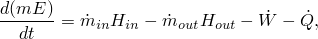

where the work done by the fluid cavity expansion is given as 


and  is the heat energy flow rate due to the heat transfer through the surface of the fluid cavity. A positive value for  will generate the heat energy flow out of the primary fluid cavity. The specific energy is given by 


where  is the initial specific energy at the initial temperature ,  is the specific heat at constant volume (or the constant volume heat capacity), which depends only upon temperature for an ideal gas,  is the specific enthalpy, and *V* is the volume occupied by the gas. By definition, the specific enthalpy is 


where 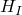 is the initial specific enthalpy at the initial (or reference) temperature  and  is the specific heat at constant pressure, which depends only upon temperature for an ideal gas. The pressure, temperature, and density of the gas are obtained by solving the ideal gas law, the energy balance, and mass conservation.

Adiabatic behavior will always be used for the fluid cavity if an adiabatic or coupled procedure is used.

| **Input File Usage: ** | ``` [*FLUID CAVITY](../key/key-link.md#usb-kws-mfluidcavity), ADIABATIC ``` |
| --- | --- |

| **Abaqus/CAE Usage: ** | Interaction module: **Create Interaction**: **Fluid cavity**: **Property definition**: **Pneumatic**, toggle on **Use adiabatic behavior** |
| --- | --- |

#### Defining the heat capacity at constant pressure

The heat capacity at constant pressure must be specified when modeling an adiabatic process for the ideal gas. It can be defined either in polynomial or tabular form. The polynomial form is based on the Shomate equation according to the National Institute of Standards and Technology. The constant pressure molar heat capacity can be expressed as


where the coefficients 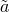, 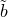, , 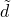, and  are gas constants. These gas constants together with molecular weight are listed in [Table 11.5.2--1](pt04ch11s05aus71.md#table-gasproperties) for some gases that are often used in airbag simulations. The constant pressure heat capacity can then be obtained by

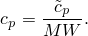

The constant volume heat capacity, , can be determined by


**Table 11.5.2–1** Properties of some commonly used gases (SI units).
| Gas | MW |  |  |  |  |  |  |
| --- | --- | --- | --- | --- | --- | --- | --- |
| ( 103) | ( 106) | ( 109) | ( 106) | (kelvin) |
| Air | 0.0289 | 28.110 | 1.967 | 4.802 | 1.966 | 0.0 | 273--1800 |
| Nitrogen | 0.028 | 26.092 | 8.218 | --1.976 | 0.1592 | 0.0444 | 298--6000 |
| Oxygen | 0.032 | 29.659 | 6.137 | --1.186 | 0.0957 | --0.219 | 298--6000 |
| Hydrogen | 0.00202 | 33.066 | 11.36 | 11.432 | --2.772 | --0.158 | 273--1000 |
| Carbon monoxide | 0.028 | 25.567 | 6.096 | 4.054 | 2.671 | 0.131 | 298--1300 |
| Carbon dioxide | 0.044 | 24.997 | 55.186 | 33.691 | 7.948 | --0.136 | 298--1200 |
| Water vapor | 0.0180 | 32.240 | 1.923 | 0.105 | 3.595 | 0.0 | 273--1800 |

You can use the polynomial form for specifying the heat capacity at constant pressure, in which case you enter the coefficients , , , , and . Alternatively, you can define a table of constant pressure heat capacity versus temperature and any predefined field variables.

| **Input File Usage: ** | Use the following option to specify the heat capacity in polynomial form: |
| --- | --- |
|  | ``` [*CAPACITY](../key/key-link.md#usb-kws-mcapacity), TYPE=POLYNOMIAL , , , ,  ``` Use the following option to specify the heat capacity in tabular form: ``` [*CAPACITY](../key/key-link.md#usb-kws-mcapacity), TYPE=TABULAR, DEPENDENCIES=*n* , *temperature, field_variable_1, etc...* *...* ``` |

| **Abaqus/CAE Usage: ** | Use the following option to specify the heat capacity in polynomial form: |
| --- | --- |
|  | Interaction module: **Create Interaction Property**: **Fluid cavity**: **Definition**: **Pneumatic**, toggle on **Specify molar heat capacity**: **Polynomial**, **Polynomial Coefficients**: , , , ,  Use the following option to specify the heat capacity in tabular form: Interaction module: **Create Interaction Property**: **Fluid cavity**: **Definition**: **Pneumatic**: toggle on **Specify molar heat capacity**: **Tabular**: enter the molar heat capacity Use the following options to include temperature and field variable dependence in the table: Toggle on **Use temperature-dependent data**, **Number of field variables**: *n* |

### A mixture of ideal gases

Abaqus/Explicit can model a mixture of ideal gases in the fluid cavity. For ideal gas mixtures the Amagat-Leduc rule of partial volumes is used to obtain an estimate of the molar-averaged thermal properties (Van Wylen and Sonntag, 1985). Let each species have constant pressure and volume heat capacities,  and 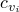; molecular weight, 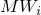; and mass fraction, . The constant pressure and volume heat capacities for the mixed gas are then given by 


and the molecular weight is given by 


The specific energy and enthalpy for the mixed gas are then given by

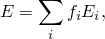

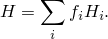

The energy flow entering the fluid cavity is given by

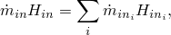

and the energy flow out of the fluid cavity is given by

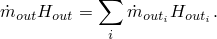

Using the properties of a mixture of ideal gases as given above, the pressure and temperature can be obtained from the ideal gas law and the energy equation.

### Averaged properties for multiple fluid cavities

If the output of the state of the fluid inside the cavity is requested for a node set that contains more than one fluid cavity, the averaged properties of the multiple fluid cavities will also be output automatically. The average pressure is calculated by volume weighting cavity pressure contributions. The average temperature for an adiabatic ideal gas is obtained by mass weighting cavity temperature contributions. Let each fluid cavity have pressure , temperature , volume 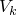, gas constant 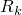, and mass . The average pressure of the fluid cavity cluster is then defined as

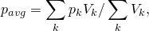

and the average temperature is

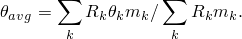

#### Additional reference

- Van Wylen, G. J., and R. E. Sonntag, *Fundamentals of Classical Thermodynamics, *Wiley, New York, 1985.


