# 11.5.3 Fluid exchange definition


**Products: **Abaqus/Standard  Abaqus/Explicit  Abaqus/CAE  

##### **References**

- ["Surface-based fluid cavities: overview," Section 11.5.1](pt04ch11s05aus70.md)
- ["Fluid cavity definition," Section 11.5.2](pt04ch11s05aus71.md)
- [*FLUID EXCHANGE](../key/key-link.md#usb-kws-mfluidexchange)
- [*FLUID EXCHANGE PROPERTY](../key/key-link.md#usb-kws-mfluidexchangeprop)
- [*FLUID EXCHANGE ACTIVATION](../key/key-link.md#usb-kws-hfluidexchangeinte)
- ["VUFLUIDEXCH," Section 1.2.15 of the Abaqus User Subroutines Reference Guide](../sub/sub-link.md#sub-rtn-uexpfluexch)
- ["VUFLUIDEXCHEFFAREA," Section 1.2.16 of the Abaqus User Subroutines Reference Guide](../sub/sub-link.md#sub-rtn-uexpfluexcheffarea)
- ["Defining a fluid exchange interaction," Section 15.13.12 of the Abaqus/CAE User's Guide](../usi/usi-link.md#usi-itn-help-fluid-exchange)
- ["Defining a fluid exchange interaction property," Section 15.14.5 of the Abaqus/CAE User's Guide](../usi/usi-link.md#usi-itn-help-prop-fluid-exchange)

### Overview

A fluid exchange definition:
- can be used to model flow between a single fluid cavity and its environment or flow between two fluid cavities;
- can be used to prescribe mass- or volume-based flux into or out of a cavity;
- can model the venting of a cavity through an exhaust orifice;
- can model flow through cavity walls such as leakage through a porous fabric;
- can be used to prescribe heat loss through a cavity surface due to heat transfer;
- can take the local material state into account;
- can account for blockage due to contacting boundary surfaces; and
- has a name that can be used to identify history output of mass flow rates out of a cavity.

### Defining fluid exchange

The fluid exchange capability is very general and can be used to define flow in and out of a cavity either as a prescribed function or based on the pressure difference arising from analysis conditions. The flow behavior in Abaqus/Standard is based on mass fluid flow, and the behavior in Abaqus/Explicit can be based on mass fluid flow or heat energy flow. You must associate the fluid exchange definition with a name.

| **Input File Usage: ** | ``` [*FLUID EXCHANGE](../key/key-link.md#usb-kws-mfluidexchange), NAME=*name* ``` |
| --- | --- |

| **Abaqus/CAE Usage: ** | Interaction module: **Create Interaction**: **Fluid exchange**, **Name**: *name* |
| --- | --- |

#### Flow between a single cavity and its environment

To define flow between a fluid cavity and its environment, specify the single reference node associated with the fluid cavity. In the discussion that follows this fluid cavity is referred to as the primary cavity. When the flow is defined as a prescribed function, the flow can either be into or out of the primary cavity. If the flow is into the cavity, the properties of the material flowing in are assumed to be the instantaneous properties of the material in the cavity itself. When the flow behavior is based on analysis conditions, the mass flow can occur only out of the primary cavity but the heat energy flow can be either into or out of the primary cavity. For the case of mass flow Abaqus will use the fluid cavity pressure and the specified constant ambient pressure to calculate the pressure difference used to determine the mass flow rate. For the case of heat energy flow Abaqus/Explicit will use the fluid cavity temperature and the specified constant ambient temperature to calculate the temperature difference used to determine the heat energy flow rate.

| **Input File Usage: ** | Use the following options: |
| --- | --- |
|  | ``` [*FLUID CAVITY](../key/key-link.md#usb-kws-mfluidcavity), NAME=*primary_cavity_name*, REF NODE=*primary_cavity_reference_node* [*FLUID EXCHANGE](../key/key-link.md#usb-kws-mfluidexchange), NAME=*fluid_exchange_name* *primary_cavity_reference_node* ``` |

| **Abaqus/CAE Usage: ** | Interaction module: **Create Interaction**: **Fluid exchange**: **Definition**: **To environment**, **Fluid cavity interaction**: *name*, **Fluid exchange property**: *name* |
| --- | --- |

#### Flow between two fluid cavities

To define flow between two fluid cavities, specify the reference nodes associated with the primary and secondary fluid cavities. When the flow is based on analysis conditions, the fluid will flow from the high pressure or upstream cavity to the low pressure or downstream cavity and the heat energy will flow from the high temperature to the low temperature.

| **Input File Usage: ** | Use the following options: |
| --- | --- |
|  | ``` [*FLUID CAVITY](../key/key-link.md#usb-kws-mfluidcavity), NAME=*primary_cavity_name*, REF NODE=*primary_cavity_reference_node* [*FLUID CAVITY](../key/key-link.md#usb-kws-mfluidcavity), NAME=*secondary_cavity_name*, REF NODE=*secondary_cavity_reference_node* [*FLUID EXCHANGE](../key/key-link.md#usb-kws-mfluidexchange), NAME=*fluid_exchange_name* *primary_cavity_reference_node, secondary_cavity_reference_node* ``` |

| **Abaqus/CAE Usage: ** | Interaction module: **Create Interaction**: **Fluid exchange**: **Definition**: **Between cavities**, **Fluid cavity interaction 1**: *name*, **Fluid cavity interaction 2**: *name*, **Fluid exchange property**: *name* |
| --- | --- |

#### Specifying the effective area in an Abaqus/Explicit analysis

The flow rate from the primary cavity for any fluid exchange property is proportional to the effective leakage area. The leakage area may represent the size of an exhaust orifice, the area of a porous fabric enclosing the cavity, or the size of a pipe between cavities.

In an Abaqus/Explicit analysis you can specify the value of the effective leakage area directly. Alternatively, you can define a surface that represents the leakage area by specifying the name of the surface on the boundary enclosing the primary fluid cavity. The effective area for fluid exchange is based on the area of the surface unless you specify the area directly or define the effective area with user subroutine [`VUFLUIDEXCHEFFAREA`](../sub/sub-link.md#sub-xsl-vufluidexcheffarea). If both the effective area and a surface are specified, the area of the surface is used only to determine blockage; see ["Accounting for blockage due to contacting boundary surfaces](pt04ch11s05aus72.md#usb-anl-afluidcavityexchange-blockage),” below. If neither area is specified, the effective area defaults to 1.0.

You can also define the effective leakage area with user subroutine [`VUFLUIDEXCHEFFAREA`](../sub/sub-link.md#sub-xsl-vufluidexcheffarea) (see ["VUFLUIDEXCHEFFAREA," Section 1.2.16 of the Abaqus User Subroutines Reference Guide](../sub/sub-link.md#sub-rtn-uexpfluexcheffarea)) if leakage needs to be modeled as a function of the material state in the underlying elements of the specified surface. For example, this subroutine can be used to define the leakage area at an element level for modeling fabric permeability in uncoated airbags where the leakage can vary locally depending on the strains in the yarn directions and the angle between the fabric yarns. Only membrane elements are supported for use with [`VUFLUIDEXCHEFFAREA`](../sub/sub-link.md#sub-xsl-vufluidexcheffarea).

| **Input File Usage: ** | Use the following option to specify the effective leakage area directly and to specify a surface that represents the leakage area: |
| --- | --- |
|  | ``` [*FLUID EXCHANGE](../key/key-link.md#usb-kws-mfluidexchange), EFFECTIVE AREA=*effective_area*, SURFACE=*surface_name* ``` Use the following option to define the effective leakage area with a user subroutine: ``` [*FLUID EXCHANGE](../key/key-link.md#usb-kws-mfluidexchange), EFFECTIVE AREA=USER, SURFACE=*surface_name* ``` |

| **Abaqus/CAE Usage: ** | Interaction module: **Create Interaction**: **Fluid exchange**: **Effective exchange area**: *effective_area* |
| --- | --- |
|  | User subroutine [`VUFLUIDEXCHEFFAREA`](../sub/sub-link.md#sub-xsl-vufluidexcheffarea) is not supported in Abaqus/CAE. |

#### Application of fluid cavity pressure on a fluid exchange surface

You can control how the effect of the cavity pressure on a fluid exchange surface is accounted for in Abaqus/Explicit. By default, the cavity pressure generates forces at all of the fluid exchange surface nodes, using the same method as for other portions of the fluid cavity. Optionally, the resultant force of the cavity pressure on the fluid exchange surface can be distributed among only the nodes that lie on the perimeter of the fluid exchange surface (for example, of the nodes shown on the fluid exchange surface in [Figure 11.5.3--1](pt04ch11s05aus72.md#usb-anl-afluidcavityexchange-initial-nls), only the nodes at locations A and B lie on the perimeter). This option can be used to avoid local bulging of a vent surface that will cause inaccurate computation of the leakage area. [Figure 11.5.3--2](pt04ch11s05aus72.md#usb-anl-afluidcavityexchange-deformed-nls) shows an example of bulging when cavity pressure forces are distributed among all nodes of a vent surface.

**Figure 11.5.3–1** Initial configuration of a fluid exchange surface.

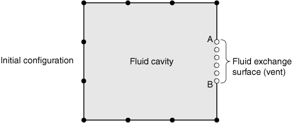

**Figure 11.5.3–2** Deformed configuration of a fluid exchange surface.


| **Input File Usage: ** | Use the following option (default) to indicate that the fluid pressure should generate forces on all nodes of a fluid exchange surface: |
| --- | --- |
|  | ``` [*FLUID EXCHANGE](../key/key-link.md#usb-kws-mfluidexchange), CAVITY PRESSURE=SURFACE, SURFACE=*surface_name* ``` Use the following option to indicate that the fluid pressure should generate force only on perimeter nodes of a fluid exchange: ``` [*FLUID EXCHANGE](../key/key-link.md#usb-kws-mfluidexchange), CAVITY PRESSURE=PERIMETER, SURFACE=*surface_name* ``` |

| **Abaqus/CAE Usage: ** | You cannot change the default pressure application in Abaqus/CAE. The pressure is always applied to all of the fluid exchange surface nodes. |
| --- | --- |

### Defining the fluid exchange property

There are several different types of fluid exchange properties available in Abaqus to define the rate flow from a fluid cavity to the environment or between two cavities. The fluid exchange property can be as simple as prescribing the mass or volume flow rate directly. More complex leakage mechanisms such as those found on automotive airbags can be modeled by defining the mass or volume leakage rate as a function of the pressure difference, ; the absolute pressure, ; and the temperature, . The heat loss due to heat transfer through the surface of the cavity can be modeled in Abaqus/Explicit by prescribing the heat energy flow rate directly or by defining the heat energy flow rate as a function of the temperature difference, ; the absolute pressure, ; and the temperature, . Alternatively, in Abaqus/Explicit the mass flow rate and/or heat energy flow rate can be specified in user subroutine [`VUFLUIDEXCH`](../sub/sub-link.md#sub-xsl-vufluidexch).

For the purposes of evaluating the mass flow rate between two cavities, the absolute pressure and temperature are taken from the high pressure or upstream cavity. The mass flow is always in the direction from the high pressure cavity to the low pressure or downstream cavity, and the heat energy flow is always in the direction from the high temperature cavity to the low temperature cavity. The cavity absolute pressure and temperature are always used to calculate the flow between a cavity and the environment.

You must associate the fluid exchange property with a name. This name can then be used to associate a certain property with a fluid exchange definition.

| **Input File Usage: ** | Use the following options: |
| --- | --- |
|  | ``` [*FLUID EXCHANGE](../key/key-link.md#usb-kws-mfluidexchange), NAME=*fluid_exchange_name*, PROPERTY=*property_name* [*FLUID EXCHANGE PROPERTY](../key/key-link.md#usb-kws-mfluidexchangeprop), NAME=*property_name* ``` |

| **Abaqus/CAE Usage: ** | Interaction module: **Create Interaction Property**: **Fluid exchange**, **Name**: *property_name* |
| --- | --- |

#### Specifying a mass or volume flux

Fluid flux into or out of the primary fluid cavity can be defined directly by prescribing the mass flow rate per unit area, 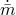. The mass flow rate is

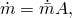

where *A* is the effective area.

Fluid flux can also be defined by prescribing a volumetric flow rate per unit area, 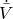. The mass flow rate is


where  is the density.

A negative value for  or  will generate flux into the primary fluid cavity. When a second fluid cavity is not defined, the state of the fluid flowing into the primary cavity is assumed to be that of the fluid already present in the primary cavity.

| **Input File Usage: ** | To prescribe a flux based on mass flow rate: |
| --- | --- |
|  | ``` [*FLUID EXCHANGE PROPERTY](../key/key-link.md#usb-kws-mfluidexchangeprop), TYPE=MASS FLUX ``` To prescribe a flux based on volumetric flow rate: ``` [*FLUID EXCHANGE PROPERTY](../key/key-link.md#usb-kws-mfluidexchangeprop), TYPE=VOLUME FLUX ``` |

| **Abaqus/CAE Usage: ** | Interaction module: **Create Interaction Property**: **Fluid exchange**: **Definition**: **Mass flux** or **Volume flux** |
| --- | --- |

#### Specifying the flow rate using the viscous and hydrodynamic resistance coefficients

The mass flow rate, , can be related to pressure difference by both viscous and hydrodynamic resistance coefficients such as 

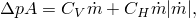

where  is the pressure difference, *A* is the effective area,  is the viscous resistance coefficient, and 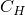 is the hydrodynamic resistance coefficient. The resistance coefficients can be functions of the average absolute pressure, average temperature, and average of any user-defined field variables. A positive value of 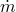 corresponds to flow out of the first cavity.

| **Input File Usage: ** | ``` [*FLUID EXCHANGE PROPERTY](../key/key-link.md#usb-kws-mfluidexchangeprop), TYPE=BULK VISCOSITY, DEPENDENCIES=*n* *viscous resistance coefficient (), hydrodynamic resistance coefficient ()* ``` |
| --- | --- |

| **Abaqus/CAE Usage: ** | Interaction module: **Create Interaction Property**: **Fluid exchange**: **Definition**: **Bulk viscosity**: **Viscous coefficient**: : **Hydrodynamic coefficient**:  |
| --- | --- |
|  | Use the following options to include pressure, temperature, and field variable dependence: Toggle on **Use pressure-dependent data**, toggle on **Use temperature-dependent data**, **Number of field variables**: *n* |

#### Specifying the flow rate through a vent or exhaust orifice

The mass flow rate through a vent or exhaust orifice that can be approximated by one-dimensional, quasi-steady, and isentropic flow is given (Bird, Stewart and Lightfoot, 2002) by

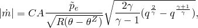

where *C* is the dimensionless discharge coefficient, *A* is the vent or exhaust orifice area,   is the temperature in the upstream fluid cavity,  is the absolute zero on the temperature scale being used, and  is the absolute pressure in the upstream fluid cavity. The pressure ratio, *q*, is defined as 


where  is the absolute pressure in the orifice. The critical pressure, , at which choked or sonic flow occurs is defined as


where  is the ratio of the constant pressure heat capacity, , and the constant volume heat capacity, :


The orifice pressure, , is then given by


where  is equal to the ambient pressure for flow out of a single fluid cavity or the downstream cavity pressure for flow between two fluid cavities.

The value of the discharge coefficient can be a function of the absolute upstream pressure, upstream temperature, and any user-defined field variables. Fluid exchange through a vent or exhaust orifice is valid only for pneumatic fluids and is available only in Abaqus/Explicit. 

| **Input File Usage: ** | ``` [*FLUID EXCHANGE PROPERTY](../key/key-link.md#usb-kws-mfluidexchangeprop), TYPE=ORIFICE, DEPENDENCIES=*n* *discharge coefficient* ``` |
| --- | --- |

| **Abaqus/CAE Usage: ** | Fluid exchange through vents or orifices is not supported in Abaqus/CAE. |
| --- | --- |

#### Specifying the flow rate due to fabric leakage

The mass flow rate due to leakage through fabric can be expressed as


where *C* is the dimensionless fabric leakage or discharge coefficient and *A* is the effective fabric leakage area.

The value of the discharge coefficient can be a function of absolute upstream pressure, upstream temperature, and any user-defined field variables.

| **Input File Usage: ** | ``` [*FLUID EXCHANGE PROPERTY](../key/key-link.md#usb-kws-mfluidexchangeprop), TYPE=FABRIC LEAKAGE, DEPENDENCIES=*n* *discharge coefficient* ``` |
| --- | --- |

| **Abaqus/CAE Usage: ** | Defining fluid exchange due to fabric leakage is not supported in Abaqus/CAE. |
| --- | --- |

#### Specifying a table of mass flow rate versus pressure difference

The overall mass flow rate can be calculated from a specified mass flow rate per unit area, , by


where *A* is the effective area.

In this case you can define the mass flow rate per unit area in a table depending on the absolute value of pressure difference and, optionally, on the average absolute pressure, average temperature, and average value of any user-defined field variables. Values for  and  must be positive and start from zero.

| **Input File Usage: ** | ``` [*FLUID EXCHANGE PROPERTY](../key/key-link.md#usb-kws-mfluidexchangeprop), TYPE=MASS RATE LEAKAGE, DEPENDENCIES=*n* 0, 0 ,  ... ``` |
| --- | --- |

| **Abaqus/CAE Usage: ** | Interaction module: **Create Interaction Property**: **Fluid exchange**: **Definition**: **Mass rate leakage**: **Mass Flow Rate**: , **Pressure Difference**:  |
| --- | --- |
|  | Use the following options to include pressure, temperature, and field variable dependence: Toggle on **Use pressure-dependent data**, toggle on **Use temperature-dependent data**, **Number of field variables**: *n* |

#### Specifying a table of volumetric flow rate versus pressure difference

The overall mass flow rate can be calculated from a specified volumetric flow rate per unit area, , by

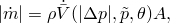

where *A* is the effective area and  is the density.

In this case you can define the volumetric flow rate per unit area in a table depending on the absolute value of pressure difference and, optionally, on the average absolute pressure, average temperature, and average value of any user-defined field variables. Values for  and  must be positive and start from zero.

| **Input File Usage: ** | ``` [*FLUID EXCHANGE PROPERTY](../key/key-link.md#usb-kws-mfluidexchangeprop), TYPE=VOLUME RATE LEAKAGE, DEPENDENCIES=*n* 0, 0 ,  ... ``` |
| --- | --- |

| **Abaqus/CAE Usage: ** | Interaction module: **Create Interaction Property**: **Fluid exchange**: **Definition**: **Volume rate leakage**: **Volumetric Flow Rate**: , **Pressure Difference**: 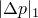 |
| --- | --- |
|  | Use the following options to include pressure, temperature, and field variable dependence: Toggle on **Use pressure-dependent data**, toggle on **Use temperature-dependent data**, **Number of field variables**: *n* |

#### Specifying a heat energy flux

In Abaqus/Explicit heat energy flux into or out of the primary fluid cavity can be defined directly by prescribing the heat energy flow rate per unit area, . The heat energy flow rate is


where *A* is the effective area. A positive value for  generates heat flux out of the primary fluid cavity. 

| **Input File Usage: ** | ``` [*FLUID EXCHANGE PROPERTY](../key/key-link.md#usb-kws-mfluidexchangeprop), TYPE=ENERGY FLUX ``` |
| --- | --- |

| **Abaqus/CAE Usage: ** | Defining fluid exchange by specifying the heat energy flow rate explicitly is not supported in Abaqus/CAE. |
| --- | --- |

#### Specifying a table of heat energy flow rate versus temperature difference

The overall heat energy flow rate can be calculated from a specified heat energy flow rate per unit area, , by

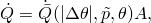

where *A* is the effective area.

In this case in Abaqus/Explicit you can define the heat energy flow rate per unit area in a table depending on the absolute value of temperature difference and, optionally, on the average absolute pressure, average temperature, and average value of any user-defined field variables. Values for  and 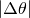 must be positive and start from zero.

| **Input File Usage: ** | ``` [*FLUID EXCHANGE PROPERTY](../key/key-link.md#usb-kws-mfluidexchangeprop), TYPE=ENERGY RATE LEAKAGE, DEPENDENCIES=*n* 0, 0 ,  ... ``` |
| --- | --- |

| **Abaqus/CAE Usage: ** | Defining fluid exchange by specifying the heat energy flow rate as a function of temperature difference and pressure is not supported in Abaqus/CAE. |
| --- | --- |

#### Specifying mass flow rate and/or heat energy flow rate with a user subroutine

The mass flow rate, , or the overall heat energy flow rate, , can be defined in Abaqus/Explicit using user subroutine [`VUFLUIDEXCH`](../sub/sub-link.md#sub-xsl-vufluidexch) (see ["VUFLUIDEXCHEFFAREA," Section 1.2.16 of the Abaqus User Subroutines Reference Guide](../sub/sub-link.md#sub-rtn-uexpfluexcheffarea)).

| **Input File Usage: ** | ``` [*FLUID EXCHANGE PROPERTY](../key/key-link.md#usb-kws-mfluidexchangeprop), TYPE=USER ``` |
| --- | --- |

| **Abaqus/CAE Usage: ** | User subroutine [`VUFLUIDEXCH`](../sub/sub-link.md#sub-xsl-vufluidexch) is not supported in Abaqus/CAE. |
| --- | --- |

### Activating the fluid exchange definition in Abaqus/Explicit

Fluid exchange will not occur in Abaqus/Explicit unless the fluid exchange definition is activated in an analysis step.

| **Input File Usage: ** | Use the following options to activate a fluid exchange for a given analysis step: |
| --- | --- |
|  | ``` [*FLUID EXCHANGE](../key/key-link.md#usb-kws-mfluidexchange), NAME=*fluid_exchange_name* [*FLUID EXCHANGE ACTIVATION](../key/key-link.md#usb-kws-hfluidexchangeinte) *fluid_exchange_name* ``` |

| **Abaqus/CAE Usage: ** | Fluid exchange is activated automatically for Abaqus/Explicit steps in Abaqus/CAE. |
| --- | --- |

#### Varying the magnitude of the flow

By default, the magnitude of the flow is based on the specified flow behavior. A time variation of flow magnitude during a step can be introduced by an amplitude curve. The magnitude based on the specified flow behavior is multiplied by the amplitude value to obtain the actual mass or heat energy flow rate. For example, a time variation of prescribed mass or volumetric flux can be defined.

An amplitude curve may be used to trigger an event for fluid exchange in the middle of a step. For example, an airbag may deploy at some predetermined time during a step, and it may be desirable to close off all exhaust orifices until the actual deployment. A step amplitude curve that starts at zero and steps up at deployment time could be used for this purpose.

| **Input File Usage: ** | Use the following options: |
| --- | --- |
|  | ``` [*AMPLITUDE](../key/key-link.md#usb-kws-mamplitude), NAME=*amplitude_name* [*FLUID EXCHANGE ACTIVATION](../key/key-link.md#usb-kws-hfluidexchangeinte), AMPLITUDE=*amplitude_name* ``` |

| **Abaqus/CAE Usage: ** | The use of an amplitude to activate a fluid exchange is not supported in Abaqus/CAE. |
| --- | --- |

#### Accounting for blockage due to contacting boundary surfaces

Abaqus/Explicit can account for the blockage of flow out of a cavity due to an obstruction caused by contacting surfaces. For example, flow out of an exhaust orifice may be fully or partially blocked because it is covered by another contacting surface.

Blockage can be considered for any fluid exchange property. However, a surface must be defined on the boundary of the fluid cavity to be checked for contact obstruction. Abaqus/Explicit will calculate the area fraction of the surface not blocked by contacting surfaces and apply this fraction to the mass or energy flow rate out of the cavity. You can control the combination of surfaces that can cause blockage. Abaqus/Explicit will not consider contacting surfaces to cause blockage unless you specify that they can potentially cause blockage (see ["Contact blockage," Section 37.1.4](pt09ch37s01aus168.md)).

| **Input File Usage: ** | ``` [*FLUID EXCHANGE ACTIVATION](../key/key-link.md#usb-kws-hfluidexchangeinte), BLOCKAGE=YES ``` |
| --- | --- |

| **Abaqus/CAE Usage: ** | Accounting for blockage due to contacting boundary surfaces is not supported in Abaqus/CAE. |
| --- | --- |

#### Limiting the flow direction

By default, flow can occur both in and out of the primary fluid cavity when a second node is included in the fluid exchange definition. In addition, heat energy flow can occur in both directions when flow is defined between a single cavity and its environment. You can limit the flow direction in Abaqus/Explicit in these cases such that fluid or heat energy flows only out of the primary fluid cavity. This method is relevant only for a fluid exchange definition based on analysis conditions and not on prescribed mass, volume, or heat energy flux.

| **Input File Usage: ** | ``` [*FLUID EXCHANGE ACTIVATION](../key/key-link.md#usb-kws-hfluidexchangeinte), OUTFLOW ONLY ``` |
| --- | --- |

| **Abaqus/CAE Usage: ** | Limiting the flow direction is not supported by Abaqus/CAE. |
| --- | --- |

#### Activating the fluid exchange based on the change in the leakage area

The flow between cavities can be activated in Abaqus/Explicit based on a change in the area of the surface defining the effective area. You need to specify the ratio of the actual surface area to the initial effective area, which represents the threshold value for triggering the fluid exchange. The effective area used for the fluid exchange between the cavities (or between the cavity and the ambient) is the area difference between the actual area and the initial area.

| **Input File Usage: ** | Use the following options: |
| --- | --- |
|  | ``` [*FLUID EXCHANGE](../key/key-link.md#usb-kws-mfluidexchange), SURFACE=*surface_name* [*FLUID EXCHANGE ACTIVATION](../key/key-link.md#usb-kws-hfluidexchangeinte), DELTA LEAKAGE AREA=*surface_ratio* ``` |

| **Abaqus/CAE Usage: ** | Activating the fluid exchange based on the change in the leakage area is not supported by Abaqus/CAE. |
| --- | --- |

#### Activation in multiple steps

By default, when you modify the activation of a fluid exchange definition or activate a new fluid exchange definition, all existing fluid exchange activations in the step remain. When modifying an existing activation, all applicable data must be respecified.

Activated fluid exchange definitions remain active in subsequent steps unless deactivated. You can choose to deactivate all fluid exchange definitions in the model and optionally reactivate new ones. If you deactivate any fluid exchange definition in a step, all fluid exchange definitions must be respecified.

| **Input File Usage: ** | Use the following option to modify an existing fluid exchange activation or to specify an additional fluid exchange activation (default): |
| --- | --- |
|  | ``` [*FLUID EXCHANGE ACTIVATION](../key/key-link.md#usb-kws-hfluidexchangeinte), OP=MOD ``` Use the following option to deactivate all fluid exchange definitions in the model and optionally reactivate new ones: ``` [*FLUID EXCHANGE ACTIVATION](../key/key-link.md#usb-kws-hfluidexchangeinte), OP=NEW ``` |

| **Abaqus/CAE Usage: ** | Fluid exchange activation is automatic for all fluid exchange interactions in all steps in Abaqus/CAE. No modifications or additions are allowed. |
| --- | --- |

### Specifying mass flux in Abaqus/Standard

In Abaqus/Standard the amount of fluid in a cavity can be varied in a step. An amplitude curve can be used to define the mass flow rate during the particular step.

| **Input File Usage: ** | Use the following options: |
| --- | --- |
|  | ``` [*AMPLITUDE](../key/key-link.md#usb-kws-mamplitude), NAME=*amplitude_name* [*FLUID FLUX](../key/key-link.md#usb-kws-hfluidflux), AMPLITUDE=*amplitude_name* ``` Use the following option to modify an existing fluid flux or to specify an additional fluid flux to a cavity (default): ``` [*FLUID FLUX](../key/key-link.md#usb-kws-hfluidflux), OP=MOD ``` Use the following option to deactivate all fluid flux definitions in the model and optionally reactivate new ones: ``` [*FLUID FLUX](../key/key-link.md#usb-kws-hfluidflux), OP=NEW ``` |

| **Abaqus/CAE Usage: ** | The use of fluid flux to modify mass flow rates is not supported in Abaqus/CAE. |
| --- | --- |

#### Additional reference

- Bird, R. B., W. E. Stewart, and E. N. Lightfoot, *Transport Phenomena, *Wiley, New York, 2002.


