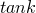
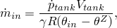
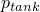
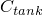
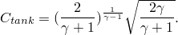
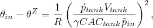
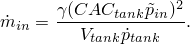

# 11.5.4 Inflator definition


**Product: **Abaqus/Explicit  

##### **References**

- ["Surface-based fluid cavities: overview," Section 11.5.1](pt04ch11s05aus70.md)
- ["Fluid cavity definition," Section 11.5.2](pt04ch11s05aus71.md)
- ["Fluid exchange definition," Section 11.5.3](pt04ch11s05aus72.md)
- [*FLUID INFLATOR](../key/key-link.md#usb-kws-mfluidinflator)
- [*FLUID INFLATOR PROPERTY](../key/key-link.md#usb-kws-mfluidinflatorproperty)
- [*FLUID INFLATOR ACTIVATION](../key/key-link.md#usb-kws-hfluidinflatorinte)

### Overview

An inflator definition: 
- can be used to inflate a fluid cavity to simulate actual inflators used for airbag supplemental restraint systems;
- can inflate a fluid cavity with an ideal gas mixture different from that present in the fluid cavity;
- can be specified directly or by defining data from a tank test;
- has a name that can be used to identify history output of mass flow rates; and
- can be activated at any time during the analysis.

### Defining an inflator

The inflator capability in Abaqus/Explicit is suited for modeling the flow characteristics of inflators used for airbag systems. You must associate the inflator definition with a name. You specify the reference node of the fluid cavity that the inflator will fill with gas. A single fluid cavity can have any number of inflators.

| **Input File Usage: ** | ``` [*FLUID INFLATOR](../key/key-link.md#usb-kws-mfluidinflator), NAME=*name* *fluid_cavity_reference_node* ``` |
| --- | --- |

### Defining the inflator property

The inflator property defines the mass flow rate and temperature as a function of inflation time either directly or by entering tank test data. It also defines the mixture of gases entering the fluid cavity. You must associate the inflator property with a name. This name can then be used to associate a certain property with an inflator definition.

| **Input File Usage: ** | Use the following options: |
| --- | --- |
|  | ``` [*FLUID INFLATOR](../key/key-link.md#usb-kws-mfluidinflator), NAME=*fluid_inflator_name*, PROPERTY=*property_name* [*FLUID INFLATOR PROPERTY](../key/key-link.md#usb-kws-mfluidinflatorproperty), NAME=*property_name* ``` |

#### Specifying the gas temperature and mass flow rate directly

The temperature and the mass flow rate of the gas entering the fluid cavity can be given directly as functions of inflation time. Enter a table of mass flow rate and temperature versus inflation time.

| **Input File Usage: ** | ``` [*FLUID INFLATOR PROPERTY](../key/key-link.md#usb-kws-mfluidinflatorproperty), TYPE=TEMPERATURE AND MASS *inflation time, inflator gas temperature, inflator mass flow rate* ... ``` |
| --- | --- |

#### Using tank test data

The mass flow rate and the temperature of the gas entering the fluid cavity can be determined by the results of a tank test. In the test the inflator is discharged into a closed, fixed volume tank, and the time history of pressure in the tank is measured. The inflator mass flow rate can then be calculated from the pressure history using the equations of gas dynamics. For an ideal gas, conservation of energy for an adiabatic process is given by


where  is the temperature,  is the absolute zero on the temperature scale being used, and the subscripts  and  refer to quantities in the inflator and the rigid tank, respectively. Using mass balance 


and the equation of state for an ideal gas with constant volume gives


The mass flow rate can be found by combining the above equations



where  is the ratio of the constant pressure heat capacity, , and the constant volume heat capacity, :


To calculate the mass flow rate using the results of a tank test, enter a table of tank pressure and inflator temperature versus inflation time, and specify the volume of the tank.

| **Input File Usage: ** | ``` [*FLUID INFLATOR PROPERTY](../key/key-link.md#usb-kws-mfluidinflatorproperty), TYPE=TANK TEST, TANK VOLUME= *inflation time, inflator gas temperature, tank pressure* ... ``` |
| --- | --- |

#### Using the dual pressure method

If both the inflator pressure, , and tank pressure, , time history curves can be measured during a tank test, the inflator mass flow rate and temperature can then be calculated using the assumption of isentropic flow (Wang and Nefske, 1988). The mass flow rate through the inflator orifice can be described by


where *C* is the discharge coefficient,  *A* is the effective area, and the coefficient  is determined by assuming choked or sonic flow as



Comparing the expression for inflator mass flow rate obtained in a rigid tank with that given above, the inflator temperature is given by 



and the inflator mass flow rate is



To calculate the inflator mass flow rate and temperature using the dual pressure method, enter a table of tank pressure and inflator pressure versus inflation time; and specify the volume of the tank, the effective area, and the discharge coefficient. The tank volume and effective area must be specified. The discharge coefficient has a default value of 0.4.

| **Input File Usage: ** | ``` [*FLUID INFLATOR PROPERTY](../key/key-link.md#usb-kws-mfluidinflatorproperty), TYPE=DUAL PRESSURE, TANK VOLUME=, EFFECTIVE AREA=*A*, DISCHARGE COEFFICIENT=*C* *inflation time, inflator pressure, tank pressure* ... ``` |
| --- | --- |

#### Specifying the inflator pressure and mass flow rate directly

You can enter a table of the mass flow rate and inflator pressure versus inflation time and specify the effective area and discharge coefficient. The gas temperature in the inflator will be calculated by using the assumption of isentropic flow. The effective area must be specified. The discharge coefficient has a default value of 0.4.

| **Input File Usage: ** | ``` [*FLUID INFLATOR PROPERTY](../key/key-link.md#usb-kws-mfluidinflatorproperty), TYPE=PRESSURE AND MASS, EFFECTIVE AREA=*A*, DISCHARGE COEFFICIENT=*C* *inflation time, inflator pressure, inflator mass flow rate* ... ``` |
| --- | --- |

#### Specifying the gas mixture

To define the inflator gas mixture, specify the number of gas species used for the inflator, and enter a list of names of fluid behaviors and a table of the mass fraction or molar fraction of the species. The mass fraction or molar fraction of the species may be a function of inflation time. The sum of the mass fractions or molar fractions for the species should be equal to one at any given time.

| **Input File Usage: ** | Use the following options to specify the gas mixture in terms of the mass fractions: |
| --- | --- |
|  | ``` [*FLUID INFLATOR PROPERTY](../key/key-link.md#usb-kws-mfluidinflatorproperty) [*FLUID INFLATOR MIXTURE](../key/key-link.md#usb-kws-mfluidinflatormixture), NUMBER SPECIES=*k*, TYPE=MASS FRACTION *fluid_behavior_name_1, fluid_behavior_name_2, etc.* *inflation time, mass fraction 1, mass fraction 2, etc.* ... ``` Use the following options to specify the gas mixture in terms of the molar fractions: ``` [*FLUID INFLATOR PROPERTY](../key/key-link.md#usb-kws-mfluidinflatorproperty) [*FLUID INFLATOR MIXTURE](../key/key-link.md#usb-kws-mfluidinflatormixture), NUMBER SPECIES=*k*, TYPE=MOLAR FRACTION *fluid_behavior_name_1, fluid_behavior_name_2, etc.* *inflation time, molar fraction 1, molar fraction 2, etc.* ... ``` |

### Activating the inflator definition

Inflation will not occur unless the inflation definition is activated in an analysis step.

| **Input File Usage: ** | Use the following options to activate a fluid inflator for a given analysis step: |
| --- | --- |
|  | ``` [*FLUID INFLATOR](../key/key-link.md#usb-kws-mfluidinflator), NAME=*fluid_inflator_name* [*FLUID INFLATOR ACTIVATION](../key/key-link.md#usb-kws-hfluidinflatorinte) *fluid_inflator_name* ``` |

#### Relating inflation time to analysis time

Inflator property definition consists of specifying tables of gas variables versus inflation time. In Abaqus/Explicit the inflation time, , is related to the value of an amplitude curve  by 


Typically the amplitude variation is a step function stepping from zero to one at the time the airbag should be deployed. This amplitude variation has the effect of offsetting the inflation time from the analysis time.

| **Input File Usage: ** | Use the following options: |
| --- | --- |
|  | ``` [*AMPLITUDE](../key/key-link.md#usb-kws-mamplitude), NAME=*amplitude_name* [*FLUID INFLATOR ACTIVATION](../key/key-link.md#usb-kws-hfluidinflatorinte), INFLATION TIME AMPLITUDE=*amplitude_name* ``` |

#### Modifying the mass flow rate

If the mass flow rate is prescribed directly in the inflator property definition, you can modify it by specifying an amplitude definition during a step. However, if the mass flow rate is calculated by using tank test data or the dual pressure method, the amplitude definition will be ignored.

| **Input File Usage: ** | Use the following options: |
| --- | --- |
|  | ``` [*AMPLITUDE](../key/key-link.md#usb-kws-mamplitude), NAME=*amplitude_name* [*FLUID INFLATOR ACTIVATION](../key/key-link.md#usb-kws-hfluidinflatorinte), MASS FLOW AMPLITUDE=*amplitude_name* ``` |

#### Activation in multiple steps

By default, when you modify the activation of a fluid inflator definition or activate a new fluid inflator definition, all existing fluid inflator activations in the step remain. When modifying an existing activation, all applicable parameters must be respecified.

Activated inflator definitions remain active in subsequent steps unless deactivated. You can choose to deactivate all fluid inflator definitions in the model and optionally reactivate new ones. If you deactivate any fluid inflator definition in a step, all fluid inflator definitions must be respecified.

| **Input File Usage: ** | Use the following option to modify an existing fluid inflator activation or to specify an additional fluid inflator activation (default): |
| --- | --- |
|  | ``` [*FLUID INFLATOR ACTIVATION](../key/key-link.md#usb-kws-hfluidinflatorinte), OP=MOD ``` Use the following option to deactivate all fluid inflator definitions in the model and optionally reactivate new ones: ``` [*FLUID INFLATOR ACTIVATION](../key/key-link.md#usb-kws-hfluidinflatorinte), OP=NEW ``` |

#### Additional reference

- Wang, J. T., and O. J. Nefske, "A New CAL3D Airbag Inflation Model," SAE paper 880654, 1988.


