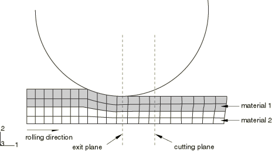
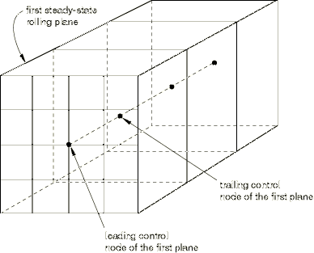

# 11.8.1 Steady-state detection


**Product: **Abaqus/Explicit  

##### **References**

- ["Output," Section 4.1.1](pt02ch04s01aus38.md)
- [*STEADY STATE DETECTION](../key/key-link.md#usb-kws-hsteadystatedetection)
- [*STEADY STATE CRITERIA](../key/key-link.md#usb-kws-hsteadystatecriteria)

### Overview

Steady-state detection: 
- can be used to detect the time in a quasi-static uni-directional Abaqus/Explicit simulation when a steady-state condition has been reached and then terminate the simulation;
- can be used to output quantities that are useful in tracking the progress of a uni-directional Abaqus/Explicit simulation; and
- is available only for three-dimensional analysis.

### Introduction

Many types of uni-directional processes are used to transform preformed shapes into forms more suitable for further processing. The most common examples are rolling, wire drawing, and extrusion processes. Since the processes are usually carried out at low speeds, explicit dynamic procedures such as those in Abaqus/Explicit are often used to model the processes as quasi-static. The analyses usually consist of a workpiece that is formed into a desired shape by any number of rollers or other forming surfaces along a primary direction. The forming surfaces are usually modeled as rigid bodies. For rolling simulations the rigid body reference node is usually defined at the center of the roller. The mesh of the workpiece is often extruded and may be constructed of multiple layers of material. As the workpiece progresses through the forming surfaces, the shape eventually reaches a constant state. The position where the workpiece exits the final forming surface is referred to as the exit plane and is usually aligned with the rigid body reference node of the final forming surface. As soon as this constant shape is reached, the analysis is considered to have reached steady state. The force and torque on the final forming surfaces at this steady-state condition have also reached constant values or oscillate about constant values. A significant computational savings can be achieved by detecting the steady-state condition and halting the analysis either immediately or as soon as the steady-state cross-section progresses beyond the exit plane to a position referred to as the cutting plane.

#### Mesh requirements

The workpiece mesh is required to meet certain conditions for use with the steady-state detection capability. First, the mesh must be topologically regular in the primary direction. In other words, the mesh should consist of multiple planes of elements with each plane being similar to its adjacent leading and trailing planes in that it contains the same number of elements and the same element topology in the cross-section. Furthermore, each element in a plane is connected to elements in leading and trailing planes that reference the same material and section properties. Therefore, meshes with multiple materials and section properties are permitted, but any row of elements in the primary direction must be of the same type and must reference the same material and section properties (see [Figure 11.8.1--1](pt04ch11s08aus76.md#ssdetection-deformed)).

**Figure 11.8.1–1** Acceptable multiple-material extruded mesh for a rolling analysis.



### Steady-state detection criteria sampling

To determine if steady state has been reached, steady-state detection “norms” are calculated, which represent an averaged value of a variable of interest over the cross-section of the workpiece as material passes through a given position along the primary direction. This position is referred to as the exit plane and usually coincides with the position of the last rigid forming tool (e.g., roller) that the workpiece passes through. The normal of the exit plane is by definition coincident with the primary direction. The time intervals at which the norms are sampled vary depending on whether the rolling analysis is modeled in an Eulerian or Lagrangian manner.

#### Sampling in a Lagrangian analysis

In a Lagrangian-based analysis (which may include adaptive meshing employed on a Lagrangian domain) the steady-state norms are calculated as the trailing control node of each plane of elements passes the exit plane. [Figure 11.8.1--2](pt04ch11s08aus76.md#ssdetection-controlnode) illustrates the control node definitions. 

**Figure 11.8.1–2** Control node positioning.



The time period of norm sampling is, therefore, based on the frequency at which the planes of elements cross the exit plane. For output purposes the values of the norms are assumed to remain constant between the times at which successive control nodes pass the exit plane.

#### Sampling in an Eulerian analysis

An Eulerian analysis employs a control volume approach in which material is drawn from an inflow Eulerian boundary and is pushed or pulled out through an outflow boundary. Adaptive mesh domains are defined on the workpiece, and sliding boundary regions are defined to model contact between the workpiece and forming tools such as rollers. See ["ALE adaptive meshing: overview," Section 12.2.1](pt04ch12s02abo14.md), for details of adaptive meshing techniques. The mesh remains relatively stationary while the material moves through the exit plane. The time period between sampling is, therefore, based on the progress of the material moving through the exit plane. To determine a time period in a manner consistent with the Lagrangian case, the sampling period is determined by dividing the characteristic element length of the workpiece by the speed of the material flow. This period is roughly the time it takes for material to pass through an element of typical size.

### Steady-state detection norm definitions

An individual norm is considered to have achieved steady state if its relative change in value over three consecutive planes does not exceed a tolerance. You can provide the norm tolerances when you define the steady-state criteria, or default values of tolerances can be chosen by Abaqus/Explicit. The norms can be output by requesting their identifiers listed in the definitions below.

#### Equivalent plastic strain norm

The plastic strain norm of a plane of elements is defined by summing the product of the equivalent plastic strain and the element volume of each element on the plane, then dividing by the total volume of the elements on the plane. This norm provides a weighted average of the equivalent plastic strain for the plane. The identifier for the equivalent plastic strain norm is SSPEEQ.

#### Spread norm

The spread norm of a plane of elements is computed as the largest of the area moments of inertia of the cross-section of the plane. In determining the spread norm, the cross-section of the plane of elements is determined by projecting the element faces whose normals originally coincided with the primary direction onto the exit plane. The area moments of inertia are then determined about the centroid of the section in the directions of the original principal axes of the cross-section. The identifier for the spread norm is SSSPRD.

#### Force norm

The force norm is computed by averaging the magnitude of the force at the rigid body reference node of a forming tool, such as the exit roller, over the time period between sampling points. You provide the rigid body reference node and force direction. The identifier for the force norm is SSFORC.

#### Torque norm

The torque norm is computed by averaging the magnitude of the torque at the rigid body reference node of a forming tool, such as the exit roller, over the time period between sampling points. You provide the rigid body reference node and torque direction. The identifier for the torque norm is SSTORQ.

### Requesting steady-state detection during an analysis

You must define the criteria that are used to determine if steady state has been reached. Abaqus/Explicit will halt the analysis based on the achievement of steady state.

#### Steady-state detection

A steady-state detection definition is used to define the elements in the workpiece, the primary direction of the workpiece, the cutting position, and the type of sampling used. The primary direction is defined by specifying the direction cosines with respect to the global Cartesian coordinate system. The cutting position is defined by specifying the global coordinates of a point lying in the cutting plane. The normal to the cutting plane is assumed to coincide with the primary direction. Once steady state has been detected, the analysis is terminated when the plane of the workpiece that was first detected to have reached steady state has progressed to the cutting plane. You can choose the sampling method used, as described below.

##### Requesting sampling as elements pass the exit plane for a Lagrangian analysis

You can request that all steady-state norms be calculated as each plane of elements crosses the exit plane.

| **Input File Usage: ** | ``` [*STEADY STATE DETECTION](../key/key-link.md#usb-kws-hsteadystatedetection), ELSET=*elset*, SAMPLING=PLANE BY PLANE ``` |
| --- | --- |

##### Requesting sampling at uniform intervals for an Eulerian analysis

Alternatively, you can request that all steady-state norms be calculated at an interval based on the time required for material to progress the length of an average element.

| **Input File Usage: ** | ``` [*STEADY STATE DETECTION](../key/key-link.md#usb-kws-hsteadystatedetection), ELSET=*elset*, SAMPLING=UNIFORM ``` |
| --- | --- |

#### Steady-state criteria

Any number of steady-state criteria definitions can be specified. Only when all of the criteria specified under any one steady-state criteria definition have been satisfied will the analysis be considered to have reached steady state.

To define the criteria, you specify the norm type identifier, the norm tolerance, and the global coordinates of a point on the exit plane. For force and torque norms, you also specify the rigid body reference node of the forming tool at the exit plane and the direction cosines of the force or torque. Exit planes can be defined separately for each norm definition.

| **Input File Usage: ** | Use the following options to define the criteria needed to achieve steady state: |
| --- | --- |
|  | ``` [*STEADY STATE DETECTION](../key/key-link.md#usb-kws-hsteadystatedetection), ELSET*=elset*, SAMPLING=PLANE BY PLANE or UNIFORM [*STEADY STATE CRITERIA](../key/key-link.md#usb-kws-hsteadystatecriteria) [*STEADY STATE CRITERIA](../key/key-link.md#usb-kws-hsteadystatecriteria) ... ``` For example, assume that two sets of criteria are of interest and that the analysis can be terminated as soon as either is satisfied. The input might be as follows: ``` [*STEADY STATE DETECTION](../key/key-link.md#usb-kws-hsteadystatedetection), ELSET=sheet, SAMPLING=PLANE BY PLANE 1.0, 0.0, 0.0, 6.0, 0.0, 0.0 [*STEADY STATE CRITERIA](../key/key-link.md#usb-kws-hsteadystatecriteria) SSPEEQ,.002, 5.0, 0.0, 0.0 SSSPRD,.002, 5.0, 0.0, 0.0 SSFORC,.005, 5.0, 0.0, 0.0, 1000, 1.0, 0.0, 0.0 SSFORC,.005, 5.0, 0.0, 0.0, 1000, 0.0, 1.0, 0.0 SSTORQ,.005, 5.0, 0.0, 0.0, 1000, 0.0, 0.0, 1.0 [*STEADY STATE CRITERIA](../key/key-link.md#usb-kws-hsteadystatecriteria) SSPEEQ,.001, 5.0, 0.0, 0.0 SSSPRD,.001, 5.0, 0.0, 0.0 SSFORC,.010, 5.0, 0.0, 0.0, 1000, 0.0, 1.0, 0.0 ``` |

### Materials

Steady-state detection is intended to be used with plasticity-based materials since the equivalent plastic strain norm would be zero for nonplasticity-based material models. 

### Procedures

One steady-state detection definition is allowed per analysis. The definition can be entered in any step and is continued through subsequent steps in an analysis. A steady-state detection definition cannot be entered in an annealing step or continued through an annealing step.

### Elements

The current steady-state detection capabilities support the use of C3D8R and C3D8RT elements only.

### Output

The output variables SSPEEQ*n*, SSSPRD*n*, SSFORC*n*, and SSTORQ*n* are used to output the equivalent plastic strain, spread, force, and torque norms, respectively. Abaqus/CAE can be used to obtain history plots of each of the steady-state detection norm variables. Individual norms can be output by requesting the norm number *n*, which is based on the order in which the norms are specified. Referring to the example above, if the force norm of the second steady-state criteria definition were to be requested, the output identifier would be SSFORC3. If a steady-state detection norm is requested that does not include a norm number, SSFORC for example, all norms of that type are output.

Once steady state has been detected, an element set is created automatically by Abaqus/Explicit and written to the output database consisting of the plane of elements that first satisfied the steady-state criteria. The element set created is named *SteadyStatePlane-StepN*, where *N* is the step number; and it can be viewed with Abaqus/CAE. If no output requests are made to the output database, the element set *SteadyStatePlane-StepN* is not created.

### Input file template

```
[*HEADING](../key/key-link.md#usb-kws-mheading)
 …
[*ELSET](../key/key-link.md#usb-kws-melset), ELSET=WORKPIECE
*************************
[*STEP](../key/key-link.md#usb-kws-hstep)
[*DYNAMIC](../key/key-link.md#usb-kws-hdynamic), EXPLICIT
*Data line to specify the time period of the step*
...
[*STEADY STATE DETECTION](../key/key-link.md#usb-kws-hsteadystatedetection), ELSET=WORKPIECE, SAMPLING=PLANE BY PLANE
*Data line specifying rolling direction and cutting plane position*
[*STEADY STATE CRITERIA](../key/key-link.md#usb-kws-hsteadystatecriteria)
*Data lines specifying steady-state detection norm criteria*
...
[*OUTPUT](../key/key-link.md#usb-kws-houtput), HISTORY, TIME INTERVAL=1.E-6
[*INCREMENTATION OUTPUT](../key/key-link.md#usb-kws-hincrementationoutput)
SSPEEQ, SSSPRD, SSFORC, SSTORQ
...
[*END STEP](../key/key-link.md#usb-kws-hendstep)
```


