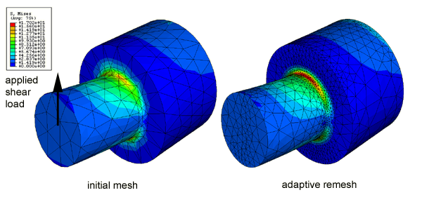

# 12.1.1 Adaptivity techniques

**Products: **Abaqus/Standard  Abaqus/Explicit  Abaqus/CAE  

##### **References**

- ["ALE adaptive meshing: overview," Section 12.2.1](pt04ch12s02abo14.md)
- ["Adaptive remeshing: overview," Section 12.3.1](pt04ch12s03abo15.md)
- ["Mesh-to-mesh solution mapping," Section 12.4.1](pt04ch12s04aus86.md)
- [*ADAPTIVE MESH](../key/key-link.md#usb-kws-hadaptivemesh)
- ["Understanding adaptive remeshing," Section 17.13 of the Abaqus/CAE User's Guide](../usi/usi-link.md#usi-mgn-conc-adaptivity)

### Overview

The finite element discretization that results from suboptimal meshing of models can limit your ability to obtain adequate analysis results at a reasonable CPU cost. This section provides an overview of the adaptivity techniques available in Abaqus that help you optimize a mesh and, therefore, obtain quality solutions while controlling the cost of your analysis. The term “adaptivity” reflects the adaptive, or solution-dependent, processes that Abaqus uses to adapt your mesh to meet your analysis goals.

### Selecting an adaptivity technique

Three adaptivity techniques are available in Abaqus: Arbitrary Lagrangian-Eulerian (ALE) adaptive meshing; varying topology adaptive remeshing; and mesh-to-mesh solution mapping, to enable rezoning analysis. [Table 12.1.1--1](pt04ch12s01aus77.md#usb-anl-aadpchoicesover-adtech) shows that the adaptivity techniques can be classified according to
- their applicability to achieving particular goals, either accuracy or control of mesh distortion;
- their impact on mesh definitions, either through smoothing a single mesh or through generating multiple dissimilar meshes; and
- when adaptivity occurs with respect to analysis steps.

**Table 12.1.1–1** The characteristics of the adaptivity techniques.
|  | Accuracy | Distortion control | Single mesh | Multiple meshes | Adaptivity occurs |
| --- | --- | --- | --- | --- | --- |
| ALE adaptive meshing |  |  |  |  | Throughout a step |
| Adaptive remeshing |  |  |  |  | Separately from analysis steps |
| Mesh-to-mesh solution mapping |  |  |  |  | Between analysis steps |

#### ALE adaptive meshing

Arbitrary Lagrangian-Eulerian (ALE) adaptive meshing provides control of mesh distortion. ALE adaptive meshing uses a single mesh definition that is gradually smoothed within analysis steps. ALE adaptive meshing is available for limited applications in Abaqus/Standard and is more generally applicable in Abaqus/Explicit. The term ALE implies a broad range of analysis approaches, from purely Lagrangian analysis, in which the node motion corresponds to material motion, to purely Eulerian analysis, in which the nodes remain fixed in space and material “flows” through the elements. Typically ALE analyses use an approach between these two extremes. The ALE feature is distinct from the Eulerian analysis capability in Abaqus/Explicit, which is described in ["Eulerian analysis," Section 14.1.1](pt04ch14s01aus90.md).

You can use adaptive meshing to control element distortion in cases where large deformation or loss of material occurs. [Figure 12.1.1--1](pt04ch12s01aus77.md#aadaptivity-ale) illustrates a case where adaptive meshing limits mesh distortion in a bulk forming simulation.

**Figure 12.1.1–1** Use of ALE adaptive meshing to control element distortion.

Unlike other adaptivity techniques, adaptive meshing operates on your original mesh definition and is, therefore, useful only when a single mesh can be effective for the duration of a simulation. The mesh is adapted through smoothing of the mesh nodes. This smoothing is typically applied frequently within analysis steps. ALE adaptive meshing requires only one analysis job. See ["ALE adaptive meshing: overview," Section 12.2.1](pt04ch12s02abo14.md), for details.

#### Adaptive remeshing (varying topology adaptivity)

Adaptive remeshing is typically used for accuracy control, although it can also be used for distortion control in some situations. The adaptive remeshing process involves the iterative generation of multiple dissimilar meshes to determine a single, optimized mesh that is used throughout an analysis. Adaptive remeshing is available only for Abaqus/Standard analyses submitted from Abaqus/CAE. The goal of adaptive remeshing is to obtain a solution that satisfies mesh discretization error indicator targets that you set, while minimizing the number of elements and, hence, the cost of your analysis. You can use adaptive remeshing to obtain a mesh that provides a balance between solution cost and desired accuracy. [Figure 12.1.1--2](pt04ch12s01aus77.md#aadaptivity-remesh) illustrates a case where adaptive remeshing improves the quality of the stress result around a fillet with targeted mesh refinement.

**Figure 12.1.1–2** Use of adaptive remeshing to improve the quality of a stress result.

Adaptive remeshing involves an iterative process to determine a single, optimized mesh that is used through an analysis. The iterative process and the remeshing are controlled in Abaqus/CAE. Each successive analysis job covers the same simulation history time period but uses a different mesh. Once the adaptive remeshing process is complete, a single mesh and a single analysis job represent your entire analysis history. See ["Adaptive remeshing: overview," Section 12.3.1](pt04ch12s03abo15.md), and ["Understanding adaptive remeshing," Section 17.13 of the Abaqus/CAE User's Guide](../usi/usi-link.md#usi-mgn-conc-adaptivity).

#### Mesh-to-mesh solution mapping

Mesh-to-mesh solution mapping is available only in Abaqus/Standard. You can use this technique to control element distortion in cases where large deformation occurs by replacing the mesh and continuing the analysis. [Figure 12.1.1--3](pt04ch12s01aus77.md#aadaptivity-rezone) illustrates a case where solution mapping is used in conjunction with a new mesh to overcome difficulties associated with element distortion.

**Figure 12.1.1–3** Use of mesh-to-mesh solution mapping as a component of a rezoning technique.

Mesh replacement, or rezoning, involves the creation of multiple Abaqus jobs, each of which represents the configuration of the model in distinct, sequential periods of the simulation history. You use mesh replacement when a single mesh cannot be effective for the duration of a simulation. Each mesh subsequent to the initial configuration reflects a solution-dependent deformed configuration of the model. Therefore, analyses that use mesh replacement are sequentially dependent, and Abaqus uses mesh-to-mesh solution mapping to propagate solution variables from one analysis to the next. In contrast to adaptive remeshing, each mesh replacement job represents a component of the overall analysis history—no single mesh and no single analysis job represent your entire analysis. See ["Mesh-to-mesh solution mapping," Section 12.4.1](pt04ch12s04aus86.md), for details.

