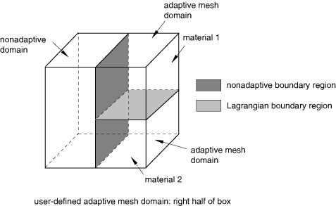
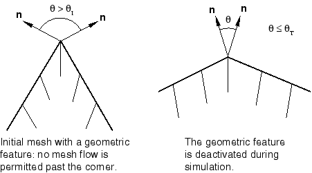
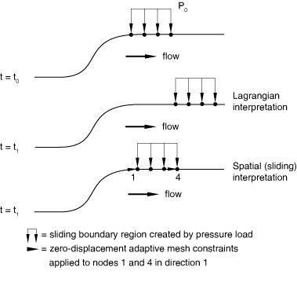
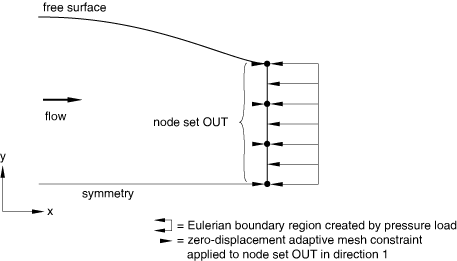
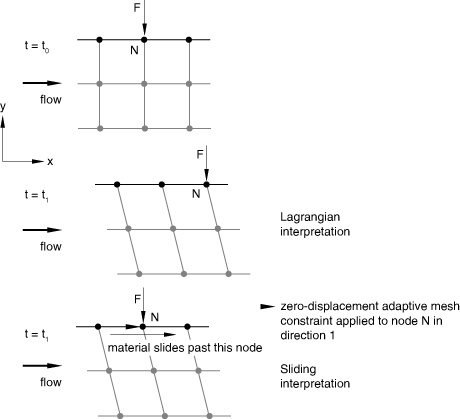
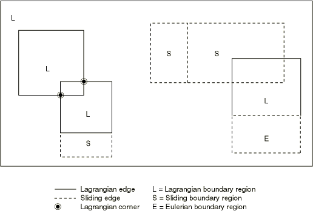

# 12.2.2 Defining ALE adaptive mesh domains in Abaqus/Explicit


**Products: **Abaqus/Explicit  Abaqus/CAE  

##### **References**

- ["ALE adaptive meshing: overview," Section 12.2.1](pt04ch12s02abo14.md)
- ["ALE adaptive meshing and remapping in Abaqus/Explicit," Section 12.2.3](pt04ch12s02aus79.md)
- [*ADAPTIVE MESH](../key/key-link.md#usb-kws-hadaptivemesh)
- ["Understanding ALE adaptive meshing," Section 14.6 of the Abaqus/CAE User's Guide](../usi/usi-link.md#usi-sim-conc-other-adaptmesh)

### Overview

Arbitrary Lagrangian-Eulerian (ALE) adaptive mesh domains:
- define the portions of a finite element model where mesh movement is independent of material deformation;
- can be used to analyze Lagrangian or Eulerian problems;
- can contain only first-order, reduced-integration, solid elements (4-node quadrilaterals, 3-node triangles, 8-node hexahedra, 6-node wedges, and 4-node tetrahedra);
- can be used in planar, axisymmetric, and three-dimensional geometries;
- have boundary regions where loads, boundary conditions, and surfaces can be defined; and
- are active only for geometrically nonlinear steps.

### Defining an ALE adaptive mesh domain

ALE adaptive meshing is performed in adaptive mesh domains, which can be either Lagrangian or Eulerian. Within either type of adaptive mesh domain the mesh will move independently of the material. Lagrangian adaptive mesh domains are usually used to analyze transient problems with large deformations. On the boundary of a Lagrangian domain the mesh will follow the material in the direction normal to the boundary, so that the mesh covers the same material domain at all times. Eulerian adaptive mesh domains are usually used to analyze steady-state processes involving material flow. On certain user-defined boundaries of an Eulerian domain, material can flow into or out of the mesh. By default, the mesh is not fixed spatially on these boundaries; mesh constraints must be applied to prevent the mesh from moving with the material, as described in ["Mesh constraints](pt04ch12s02aus78.md#usb-anl-aaledomains-mesh-const),” presented later in this section. There can never be any “empty” elements; all elements in the domain must be filled completely with material at all times.

You must specify the region of the original mesh that will be subject to adaptive meshing.

| **Input File Usage: ** | ``` [*ADAPTIVE MESH](../key/key-link.md#usb-kws-hadaptivemesh), ELSET=*name* ``` |
| --- | --- |
|  | Multiple adaptive mesh domains can be defined in a step by reusing the [*ADAPTIVE MESH](../key/key-link.md#usb-kws-hadaptivemesh) option (for example, to prevent material from flowing from one domain to another or to apply adaptive meshing to unconnected domains). The element sets used to create adaptive mesh domains cannot overlap. |

| **Abaqus/CAE Usage: ** | Step module: ****Other****ALE Adaptive Mesh Domain****Edit****: toggle on **Use the ALE adaptive mesh domain below**, and click **Edit** to select the region |
| --- | --- |
|  | Only one adaptive mesh domain can be defined in Abaqus/CAE for any particular step. |

#### Modifying an ALE adaptive mesh domain

By default, all adaptive mesh domains defined in the previous analysis step remain unchanged in the subsequent step. You define the adaptive mesh domains in effect for a given step relative to the preexisting adaptive mesh domains. At each new step the existing adaptive mesh domains can be modified and additional adaptive mesh domains can be specified (except in Abaqus/CAE, where only one adaptive mesh domain can be in effect for a given step).

| **Input File Usage: ** | Use either of the following options to modify an existing adaptive mesh domain or to specify an additional adaptive mesh domain: |
| --- | --- |
|  | ``` [*ADAPTIVE MESH](../key/key-link.md#usb-kws-hadaptivemesh), ELSET=*name* [*ADAPTIVE MESH](../key/key-link.md#usb-kws-hadaptivemesh), ELSET=*name*, OP=MOD ``` |

| **Abaqus/CAE Usage: ** | Step module: ****Other****ALE Adaptive Mesh Domain****Edit**** |
| --- | --- |

#### Removing an ALE adaptive mesh domain

If you choose to remove any adaptive mesh domain in a step, no adaptive mesh domains will be propagated from the previous step. Therefore, all adaptive mesh domains that are in effect during this step must be respecified.

| **Input File Usage: ** | Use the following option to remove all previously defined adaptive mesh domains and to specify new adaptive mesh domains: |
| --- | --- |
|  | ``` [*ADAPTIVE MESH](../key/key-link.md#usb-kws-hadaptivemesh), ELSET=*name*, OP=NEW ``` If the OP=NEW parameter is used on any [*ADAPTIVE MESH](../key/key-link.md#usb-kws-hadaptivemesh) option within a step, it must be used on all [*ADAPTIVE MESH](../key/key-link.md#usb-kws-hadaptivemesh) options in the step. |

| **Abaqus/CAE Usage: ** | Step module: ****Other****ALE Adaptive Mesh Domain****Edit****: toggle on **No adaptive mesh domain for this step** |
| --- | --- |

#### Splitting ALE adaptive mesh domains

User-defined adaptive mesh domains are examined by Abaqus/Explicit. The user-defined domain will be modeled using a single adaptive mesh if the domain: 
- consists of a single element type;
- consists of a single connected region;
- consists of a single material;
- is subject to a uniform body force (including zero body force); and
- has identical section controls.

The user-defined domain will be split into multiple adaptive mesh domains, separated by boundary regions, if the domain:- consists of multiple element types;
- spans part instances;
- consists of multiple regions (including regions that are connected by less than a single element face, only by contact conditions, or only by connectors such as MPCs);
- consists of multiple materials;
- is subject to multiple body force definitions; or
- is subject to multiple section control definitions.

In this documentation the term “adaptive mesh domain” refers to a single domain after splitting by Abaqus/Explicit. On the rare occasion that a reference is made to an adaptive mesh domain prior to the automatic splitting, it is referred to as a “user-defined adaptive mesh domain.” Since adaptive mesh domains are split across element types, degenerate elements should be used for mixed domains that include both triangles and quadrilaterals (or tetrahedron and bricks). For example, when defining a mixed plane strain domain with quadrilateral and triangular elements, the CPE4R element type should be used to define both quadrilaterals and degenerated quadrilaterals. Using the CPE3 element will result in split domains, which is generally not desirable.

### ALE adaptive mesh boundary regions

Each ALE adaptive mesh domain has a boundary, which can consist of one or more regions. (Regions, in this context, are surfaces in three-dimensional models or lines in two-dimensional or axisymmetric models.) A boundary region can be either Lagrangian, sliding, or Eulerian. Some boundary regions are created automatically by Abaqus/Explicit; others can be created by defining boundary conditions, loads, and surfaces. Adaptive mesh boundary regions are separated by edges in three dimensions and by corners in two dimensions. Both edges and corners are referred to as “boundary region edges” throughout this documentation.

#### Boundary region edges

Two types of boundary region edges can exist: Lagrangian and sliding. Lagrangian edges are always associated with a material line. Material can never flow past a Lagrangian edge, and nodes can move only along a Lagrangian edge (like beads on a string). Sliding edges are associated only with the mesh. Material can flow past a sliding edge (that is, sliding edges are free to slide over the underlying material).

Lagrangian edges can be viewed with Abaqus/CAE; see ["Output and diagnostics for ALE adaptive meshing in Abaqus/Explicit," Section 12.2.5](pt04ch12s02aus81.md).

#### Lagrangian boundary regions

Lagrangian boundary regions are the most common boundary regions in structural finite element analysis; therefore, with the exception of contact surfaces, they are always the default in Abaqus/Explicit. A Lagrangian boundary region has the most constraints of all the boundary region types. The mesh is constrained to move with the material in the direction normal to the surface of the boundary region and in the directions perpendicular to the boundary region edges.

Lagrangian boundary regions have Lagrangian edges: the edges follow the material. On the interior of a Lagrangian boundary region, the mesh can move independently of the material in the surface of the boundary region. Thus, a Lagrangian boundary region can be thought of as a “mesh patch” that follows the material. Nodes are free to move within and along the edges of the patch but cannot leave the patch.

##### Lagrangian corners

A Lagrangian corner is formed where two Lagrangian edges meet. The node at a Lagrangian corner is constrained to move with the material in all directions; it is nonadaptive.

#### Sliding boundary regions

A sliding boundary region is the same as a Lagrangian boundary region except that it has a sliding edge. Sliding boundary regions are created by default when you define a surface on the boundary of an adaptive mesh domain (see ["Surfaces: overview," Section 2.3.1](pt01ch02s03aus16.md)).

The mesh is constrained to move with the material in the direction normal to the boundary region, but it is completely unconstrained in the directions tangential to the boundary region. Thus, a sliding boundary region can be thought of as a “mesh patch” that moves independently of the underlying material.

Sliding boundary regions can be created by defining a surface, boundary condition, or load on the boundary of an adaptive mesh domain (as explained later in this section). Since the mesh is totally unconstrained in the directions tangential to a sliding boundary region, the location of an applied boundary condition or load may not be physically meaningful as the mesh moves over the material. Therefore, to retain the spatial meaning of an applied boundary condition or load, spatial mesh constraints (described in ["Mesh constraints](pt04ch12s02aus78.md#usb-anl-aaledomains-mesh-const),” presented later in this section) are usually applied tangential to sliding boundary regions.

#### Eulerian boundary regions

Eulerian boundary regions can be defined on the exterior of a model where it makes physical sense to let material flow across the boundary (for example, at the inlet and outlet of a steady-state extrusion or rolling problem). This flow across the boundary distinguishes Eulerian boundary regions from Lagrangian or sliding boundary regions.

Eulerian boundary regions have sliding edges and must lie completely on an exterior surface of a model. It makes no physical sense to allow material flow to originate on an interior surface. You must explicitly define Eulerian boundary regions since, by default, Abaqus/Explicit assumes that no material flows into or out of an adaptive mesh domain.

Eulerian boundary regions are created by defining a surface, a boundary condition, or a load on the boundary of an adaptive mesh domain. On Eulerian boundary regions the mesh motion usually should be constrained in the direction normal to the material motion; therefore, the surface mesh should be fixed in space using spatial mesh constraints (described in ["Mesh constraints](pt04ch12s02aus78.md#usb-anl-aaledomains-mesh-const),” presented later in this section). Applying these constraints normal to an Eulerian boundary region allows material to flow into or out of the mesh, as in a fluid flow problem, while allowing adaptive meshing to occur on the surface of the boundary region to maximize mesh quality.

The material flowing into an Eulerian boundary region is assumed to have the same properties as the material that is inside the adaptive mesh domain.

Techniques for modeling Eulerian domains are presented in ["Modeling techniques for Eulerian adaptive mesh domains in Abaqus/Explicit," Section 12.2.4](pt04ch12s02aus80.md).

#### Creation of boundary regions

Abaqus/Explicit will create adaptive mesh boundary regions automatically on 
- the exterior of a model,
- the boundary between different adaptive mesh domains, or
- the boundary between an adaptive mesh domain and a nonadaptive domain.

By default, a boundary region on the exterior of a model will be Lagrangian, so that the boundary region follows the material, and loads, boundary conditions, etc. will retain their Lagrangian interpretation. A boundary region between different adaptive mesh domains is always Lagrangian: no material can flow through such a boundary region. An additional constraint is applied when the model contains multiple parallel domains (see ["Parallel execution in Abaqus/Explicit," Section 3.5.3](pt01ch03s05aus34.md)). In this case the boundary region is nonadaptive: no material can flow through the boundary region, and the nodes on this boundary are constrained to move exactly with the underlying material in all directions. A boundary region between an adaptive mesh domain and a nonadaptive domain is always nonadaptive. The only exception to this occurs if an Eulerian boundary region is defined on the boundary between an adaptive mesh domain and a nonadaptive domain that comprises displacement-based infinite elements. In this case the nodes on the boundary behave as in Eulerian boundary regions (see the description under ["Eulerian boundary regions](pt04ch12s02aus78.md#usb-anl-aaledomains-eulerianbr),” presented earlier in this section), and the mesh motion at the boundary nodes can be constrained using spatial mesh constraints.

The boundary between two different materials can never “flow” through the mesh; such a physical boundary is always associated with a Lagrangian boundary region or a nonadaptive mesh boundary.

[Figure 12.2.2--1](pt04ch12s02aus78.md#aaledomains-bdry-regions) shows some boundary regions that will be created automatically by Abaqus/Explicit. In the model shown in this figure Abaqus/Explicit splits the user-defined adaptive mesh domain into two adaptive mesh domains because the original domain is composed of two different materials.

**Figure 12.2.2–1** Automatic splitting of mesh domains and creation of boundary regions.



In addition to the boundary regions created automatically by Abaqus/Explicit, Lagrangian, sliding, and Eulerian boundary regions can be created by the definition of surfaces, boundary conditions, and loads, as described later in this section.

### Geometric features

Many models include distinct geometric kinks that take the form of geometric edges or corners. It is usually not desirable to perform adaptive meshing across such geometric features unless they flatten. Once a geometric feature does flatten, it is usually best if the feature is deactivated so that adaptive meshing will occur across it. This is especially true when adaptive mesh domains are subject to large deformation.

The adaptive meshing algorithm in Abaqus/Explicit will respect geometric features on Lagrangian and sliding boundaries. In three dimensions geometric features consist of edges and corners (see [Figure 12.2.2--2](pt04ch12s02aus78.md#aaledomains-geom-feat)), while in two dimensions they consist of only corners. If a geometric edge coincides with the edge of a Lagrangian boundary region, the presence of the geometric feature has no effect on the treatment of the edge: material cannot flow perpendicular to a Lagrangian edge.

**Figure 12.2.2–2** Geometric features formed on a solid block with a crack.


Geometric features are not detected or tracked on Eulerian boundary regions because they generally are not physically meaningful.

Output options are available for viewing the formation of geometric edges and corners—see ["Output and diagnostics for ALE adaptive meshing in Abaqus/Explicit," Section 12.2.5](pt04ch12s02aus81.md).

#### Controlling the detection of geometric edges and corners

Geometric features are identified initially as edges on boundary regions where the angle between the normals on adjacent element faces is greater than the initial geometric feature angle,  (). See [Figure 12.2.2--3](pt04ch12s02aus78.md#aaledomains-geom-corner). The default value for the initial geometric feature angle is . 

**Figure 12.2.2–3** Detection and deactivation of geometric features.



You can change the value of the angle that will be used to recognize geometric features. Setting  will ensure that no geometric edges or corners are formed on the boundary of the adaptive mesh domain. 

| **Input File Usage: ** | ``` [*ADAPTIVE MESH CONTROLS](../key/key-link.md#usb-kws-hadaptivemeshcontrols), NAME=*name*, INITIAL FEATURE ANGLE= ``` |
| --- | --- |

| **Abaqus/CAE Usage: ** | Step module: ****Other****ALE Adaptive Mesh Controls****Create****: **Name**: *name*, **Initial feature angle:**  |
| --- | --- |

#### Controlling the deactivation of geometric edges and corners

Geometric features affect only Lagrangian and sliding boundary regions, where they act as temporary Lagrangian edges. During each mesh sweep in an adaptive mesh increment, nodes along a geometric edge are positioned by applying the basic smoothing methods (see ["ALE adaptive meshing and remapping in Abaqus/Explicit," Section 12.2.3](pt04ch12s02aus79.md)). The nodes are constrained to lie along the discrete geometric edge unless the angle forming the geometric edge becomes less than the transition geometric feature angle,  (). The default value for the transition feature angle is . If the angle across the geometric edge becomes less than , the boundary surface is considered to be flattened sufficiently for the feature to be deactivated, and the mesh is allowed to slide freely over the material (unconstrained by the deactivated geometric edge). Geometric corners are allowed to flatten in a similar fashion. This logic allows great flexibility in mesh adaptation while preserving geometric features in the model.

You can change the transition feature angle. Setting  will ensure that no geometric edges or corners are ever deactivated.

| **Input File Usage: ** | ``` [*ADAPTIVE MESH CONTROLS](../key/key-link.md#usb-kws-hadaptivemeshcontrols), NAME=*name*, TRANSITION FEATURE ANGLE= ``` |
| --- | --- |

| **Abaqus/CAE Usage: ** | Step module: ****Other****ALE Adaptive Mesh Controls****Create****: **Name**: *name*, **Transition feature angle:**  |
| --- | --- |

### Mesh constraints

In most adaptive mesh problems the motion of nodes in the mesh is determined by the meshing algorithm, with constraints imposed by the domain boundary and the boundary region edges. However, there are cases when you must explicitly define the motion of the nodes. As explained earlier, Eulerian and sliding boundary regions generally require mesh constraints for the regions to be physically meaningful. In some problems you may wish to keep certain nodes fixed, to move nodes in a particular direction, or to force certain nodes to move with the material. In other problems you may desire a node or particular set of nodes to follow the material motion. Adaptive mesh constraints allow full control over the mesh movement and act independently of any boundary conditions or loads applied to the underlying material.

#### Applying spatial mesh constraints

Use a spatial mesh constraint (the default) to prescribe spatial mesh motion that is independent of the material motion. You specify the nodes to which the constraint is applied, the directions of the prescribed motion, and the amplitude of the prescribed motion. You can prescribe either a displacement or a velocity for the spatial mesh motion.

| **Input File Usage: ** | Use the following option to define the mesh constraints explicitly: |
| --- | --- |
|  | ``` [*ADAPTIVE MESH CONSTRAINT](../key/key-link.md#usb-kws-hadaptivemeshconstraint), CONSTRAINT TYPE=SPATIAL, TYPE=DISPLACEMENT or VELOCITY ``` |

| **Abaqus/CAE Usage: ** | To define the mesh constraints explicitly: |
| --- | --- |
|  | Step module: ****Other****ALE Adaptive Mesh Constraint****Create****: **Types for selected step:** **Displacement/Rotation** or **Velocity/Angular velocity**: select region: **Motion:** **Independent of underlying material** |

##### Rules for applying spatial mesh constraints

Spatial mesh constraints can be applied without restriction to nodes on an Eulerian boundary region or in the interior of an adaptive mesh domain.

In both two and three dimensions nodes at Lagrangian and active geometric corners are fully constrained to move with the underlying material. No mesh constraints can be applied at such corners.

Adaptive mesh constraints must not conflict with other mesh constraints inherent to Lagrangian and sliding boundary regions; therefore, adaptive mesh constraints can be applied only tangentially to a Lagrangian or sliding boundary region. This restriction implies that adaptive mesh constraints can be applied only in two directions in a three-dimensional boundary region, in one direction in a two-dimensional boundary region, or in one direction on a Lagrangian or active geometric edge. It may not always be feasible to adhere to this rule, particularly if the boundary experiences finite rotation. Therefore, if the normal to a boundary region is not perpendicular to a prescribed mesh constraint at a node, it is always moved along the current surface of the boundary region so that the projection of the mesh motion in the direction of the prescribed constraint is correct (see [Figure 12.2.2--4](pt04ch12s02aus78.md#aaledomains-mesh-constraint)).

**Figure 12.2.2–4** Enforcing a spatial mesh constraint.


If the normal to the boundary region approaches the direction of the applied mesh constraint, large mesh motions will be required to satisfy the constraint. By default, an analysis is terminated if the angle between the normal to the boundary region and the direction of the prescribed constraint becomes less than . This cutoff angle is referred to as the mesh constraint angle, and its default value is 60.

The mesh constraint angle, , is also used when adaptive mesh constraints are applied to nodes along a Lagrangian or active geometric edge. Since independent mesh motion cannot be prescribed perpendicular to these edges, an analysis is terminated if the angle between the prescribed constraint and the plane perpendicular to the edge falls below the specified mesh constraint angle.

You can change the value of the mesh constraint angle (). Setting  is not recommended because it may cause errors in determining the free surface geometry, especially for curved surfaces.

| **Input File Usage: ** | ``` [*ADAPTIVE MESH CONTROLS](../key/key-link.md#usb-kws-hadaptivemeshcontrols), MESH CONSTRAINT ANGLE= ``` |
| --- | --- |

| **Abaqus/CAE Usage: ** | Step module: ****Other****ALE Adaptive Mesh Controls****Create****: **Mesh constraint angle:**  |
| --- | --- |

##### Defining mesh constraints that vary with time

The prescribed magnitude of a nonzero mesh constraint can vary with time during a step according to an amplitude definition (see ["Amplitude curves," Section 34.1.2](pt07ch34s01aus115.md)).

| **Input File Usage: ** | Use both of the following options: |
| --- | --- |
|  | ``` [*AMPLITUDE](../key/key-link.md#usb-kws-mamplitude), NAME=*name* [*ADAPTIVE MESH CONSTRAINT](../key/key-link.md#usb-kws-hadaptivemeshconstraint), AMPLITUDE=*name* ``` |

| **Abaqus/CAE Usage: ** | Step module: ****Other****ALE Adaptive Mesh Constraint****Create****: **Types for selected step:** **Displacement/Rotation** or **Velocity/Angular velocity**: select region: **Motion:** **Independent of underlying material**: **Amplitude:** *amplitude* |
| --- | --- |

#### Applying spatial mesh constraints in local directions

Spatial mesh constraints are applied in local directions if a local coordinate system is defined at a node (see ["Transformed coordinate systems," Section 2.1.5](pt01ch02s01aus09.md)); otherwise, they are applied in global directions.

#### Applying Lagrangian mesh constraints

Lagrangian mesh constraints on a node are used to indicate that mesh smoothing should not be applied; i.e., the node must follow the material. 

| **Input File Usage: ** | ``` [*ADAPTIVE MESH CONSTRAINT](../key/key-link.md#usb-kws-hadaptivemeshconstraint), CONSTRAINT TYPE=LAGRANGIAN ``` |
| --- | --- |

| **Abaqus/CAE Usage: ** | Step module: ****Other****ALE Adaptive Mesh Constraint****Create****: **Types for selected step:** **Displacement/Rotation** or **Velocity/Angular velocity**: select region: **Motion: ****Follow underlying material** |
| --- | --- |

#### Modifying ALE adaptive mesh constraints

By default, all adaptive mesh constraints defined in the previous analysis step remain unchanged in the subsequent step. You define the adaptive mesh constraints in effect for a given step relative to the preexisting adaptive mesh constraints. At each new step the existing adaptive mesh constraints can be modified and additional adaptive mesh constraints can be specified.

| **Input File Usage: ** | Use either of the following options to modify an existing adaptive mesh constraint or to specify an additional adaptive mesh constraint: |
| --- | --- |
|  | ``` [*ADAPTIVE MESH CONSTRAINT](../key/key-link.md#usb-kws-hadaptivemeshconstraint), [*ADAPTIVE MESH CONSTRAINT](../key/key-link.md#usb-kws-hadaptivemeshconstraint), OP=MOD ``` |

| **Abaqus/CAE Usage: ** | Step module: ****Other****ALE Adaptive Mesh Constraint****Manager****: select the desired step and mesh constraint: **Edit** |
| --- | --- |

#### Removing ALE adaptive mesh constraints

If you choose to remove any adaptive mesh constraint in a step, no adaptive mesh constraints will be propagated from the previous step. Therefore, all adaptive mesh constraints that are in effect during this step must be respecified.

| **Input File Usage: ** | Use the following option to remove all previously defined adaptive mesh constraints and to specify new adaptive mesh constraints: |
| --- | --- |
|  | ``` [*ADAPTIVE MESH CONSTRAINT](../key/key-link.md#usb-kws-hadaptivemeshconstraint), OP=NEW ``` If the OP=NEW parameter is used on any [*ADAPTIVE MESH CONSTRAINT](../key/key-link.md#usb-kws-hadaptivemeshconstraint) option within a step, it must be used on all [*ADAPTIVE MESH CONSTRAINT](../key/key-link.md#usb-kws-hadaptivemeshconstraint) options in the step. |

| **Abaqus/CAE Usage: ** | Step module: ****Other****ALE Adaptive Mesh Constraint****Manager****: select the desired step and mesh constraint: **Deactivate** |
| --- | --- |

### Initial conditions

There are no initial conditions specific to adaptive meshing; initial conditions can be defined in the same way as in nonadaptive problems. If initial mesh sweeps are performed to smooth the mesh at the beginning of a step (see ["ALE adaptive meshing and remapping in Abaqus/Explicit," Section 12.2.3](pt04ch12s02aus79.md)), all initial conditions (except temperatures and field variables, which are discussed in ["Predefined fields](pt04ch12s02aus78.md#usb-anl-aaledomains-predef-fields),” presented later in this section) are remapped to the new mesh. Initial temperatures are remapped during adaptive meshing in an adiabatic analysis.

Initial conditions prescribed near an inflow Eulerian boundary region will affect the state of the material flowing into the domain throughout the analysis. See ["Modeling techniques for Eulerian adaptive mesh domains in Abaqus/Explicit," Section 12.2.4](pt04ch12s02aus80.md), for a discussion of the proper treatment of inflow boundaries.

### Defining surfaces on ALE adaptive mesh boundaries

When you define a surface on the boundary of an adaptive mesh domain (see ["Surfaces: overview," Section 2.3.1](pt01ch02s03aus16.md)), Abaqus creates a boundary region coinciding with the surface. By default, a sliding boundary region is created. You can choose to create a Lagrangian or Eulerian boundary region instead.

A surface defined in the interior of an adaptive mesh domain will move independently of the material (unless constrained by mesh constraints).

#### Defining a sliding boundary region using a surface

By default, the boundary region created by a surface definition will be sliding (the surface edge will slide freely over the material).

| **Input File Usage: ** | ``` [*SURFACE](../key/key-link.md#usb-kws-msurface), REGION TYPE=SLIDING ``` |
| --- | --- |

| **Abaqus/CAE Usage: ** | Boundary regions defined using surfaces are not supported in Abaqus/CAE. |
| --- | --- |

#### Defining a Lagrangian boundary region using a surface

To force the surface edge to follow the material, create a Lagrangian boundary region.

| **Input File Usage: ** | ``` [*SURFACE](../key/key-link.md#usb-kws-msurface), REGION TYPE=LAGRANGIAN ``` |
| --- | --- |

| **Abaqus/CAE Usage: ** | Boundary regions defined using surfaces are not supported in Abaqus/CAE. |
| --- | --- |

#### Defining an Eulerian boundary region using a surface

To decouple the surface from the material motion, create an Eulerian boundary region and apply spatial mesh constraints normal to the surface. If no mesh constraints are applied, the surface will behave like a sliding boundary region (no material will flow through the surface).

As an example, it is often assumed that there is no normal or shear stress in the material at the outflow boundary of an Eulerian domain. This condition can be modeled by defining an Eulerian boundary region using a surface and applying spatial mesh constraints perpendicular to the surface, as shown in [Figure 12.2.2--5](pt04ch12s02aus78.md#aaledomains-eulerian-surf).

| **Input File Usage: ** | ``` [*SURFACE](../key/key-link.md#usb-kws-msurface), REGION TYPE=EULERIAN ``` |
| --- | --- |

| **Abaqus/CAE Usage: ** | Boundary regions defined using surfaces are not supported in Abaqus/CAE. |
| --- | --- |

**Figure 12.2.2–5** Modeling the outflow boundary of an Eulerian adaptive mesh domain.


#### Contact

Lagrangian and sliding boundary regions created using surfaces can be used in contact pairs; they have the same meaning as surfaces defined on nonadaptive regions. Since contact generally involves relative sliding between bodies, sliding boundary regions are typically appropriate for contact surfaces.

Surfaces defined on Eulerian boundary regions cannot be used in contact pairs.

If the small-sliding formulation is used for a contact pair, all the nodes on both surfaces are nonadaptive (see ["Defining contact pairs in Abaqus/Explicit," Section 36.5.1](pt09ch36s05aus160.md), and ["Contact formulations for contact pairs in Abaqus/Explicit," Section 38.2.2](pt09ch38s02aus181.md)). The nodes of an element-based surface in a no-separation contact pair are nonadaptive (see  ["Contact pressure-overclosure relationships," Section 37.1.2](pt09ch37s01aus166.md)). All nodes in a general contact domain are nonadaptive (see ["Defining general contact interactions in Abaqus/Explicit," Section 36.4.1](pt09ch36s04aus155.md)). Similarly, the nodes at which spot welds are defined are nonadaptive (see ["Breakable bonds," Section 37.1.9](pt09ch37s01aus173.md).)

### Distributed loads

When a distributed pressure load is applied to the boundary of an adaptive mesh domain, Abaqus/Explicit creates a boundary region that coincides with the area of the load application. The characteristics of boundary regions created in this way are identical to those of boundary regions created by defining surfaces. If a pressure load is applied to a surface in the interior of an adaptive mesh domain, the nodes on the surface will move with the material in all directions (i.e., they will be nonadaptive).

Boundary regions created by different pressure loads may overlap. If pressure loads with the same magnitude and amplitude definition are applied to adjacent regions, the regions will be merged into a single boundary region to minimize the number of Lagrangian edges and corners formed (see [Figure 12.2.2--6](pt04ch12s02aus78.md#aaledomains-overlap-dloads)).

**Figure 12.2.2–6** Applying distributed pressure loads to an adaptive mesh domain.


If a nonuniform pressure is applied (for example, a pressure that varies linearly over a surface) or if a pressure load is defined in user subroutine [`VDLOAD`](../sub/sub-link.md#sub-xsl-vdload), each element face or edge becomes a separate Lagrangian boundary region. Since Lagrangian corners are formed where Lagrangian edges meet, all nodes will follow the material in every direction, and each region becomes nonadaptive. Likewise, if a nonuniform body force is applied to an adaptive mesh domain, the domain is split into multiple domains, each with a uniform body force. If this splitting results in one-element domains, the region becomes nonadaptive.

#### Defining a Lagrangian boundary region with a pressure load

By default, the boundary region created to coincide with a pressure load will be Lagrangian. Pressure loads applied to Lagrangian regions are identical to pressure loads applied to nonadaptive regions, except that the mesh can move inside the boundary region.

| **Input File Usage: ** | ``` [*DLOAD](../key/key-link.md#usb-kws-hdload), REGION TYPE=LAGRANGIAN ``` |
| --- | --- |

| **Abaqus/CAE Usage: ** | Boundary regions defined using pressure loads are not supported in Abaqus/CAE. |
| --- | --- |

#### Defining a sliding boundary region with a pressure load

A pressure load can be applied to a sliding boundary region to simulate a load that is fixed in space while material moves past it (see [Figure 12.2.2--7](pt04ch12s02aus78.md#aaledomains-sliding-dload)). A sliding edge is unconstrained in the direction tangential to the boundary region; therefore, unless adaptive mesh constraints are applied, the area of the load application will move according to the adaptive meshing algorithm, which is probably not physically meaningful.

To allow a pressure load to slide over the material, create a sliding boundary region.

| **Input File Usage: ** | ``` [*DLOAD](../key/key-link.md#usb-kws-hdload), REGION TYPE=SLIDING ``` |
| --- | --- |

| **Abaqus/CAE Usage: ** | Boundary regions defined using pressure loads are not supported in Abaqus/CAE. |
| --- | --- |

**Figure 12.2.2–7** Applying a sliding distributed pressure load to an adaptive mesh domain.



#### Defining an Eulerian boundary region with a pressure load

To decouple the area of pressure application from the material motion, create an Eulerian boundary region and apply spatial mesh constraints normal to the surface. If no mesh constraints are applied, the mesh will behave like a sliding boundary region (no material will flow through the surface).

As an example, it is often assumed that a uniform ambient pressure exists at the outflow boundary of an Eulerian domain. This condition can be modeled by defining the pressure at an Eulerian boundary region using a distributed load and applying spatial mesh constraints perpendicular to the surface, as shown in [Figure 12.2.2--8](pt04ch12s02aus78.md#aaledomains-eulerian-dload).

| **Input File Usage: ** | ``` [*DLOAD](../key/key-link.md#usb-kws-hdload), REGION TYPE=EULERIAN ``` |
| --- | --- |

| **Abaqus/CAE Usage: ** | Boundary regions defined using pressure loads are not supported in Abaqus/CAE. |
| --- | --- |

**Figure 12.2.2–8** Modeling an ambient pressure at the outflow boundary of an Eulerian adaptive mesh domain.



### Distributed surface fluxes and thermal conditions

In coupled thermal-stress analysis Abaqus/Explicit also creates boundary regions for distributed surface fluxes, convective film conditions, and radiation conditions. The rules governing boundary regions for these loads are identical to those discussed for distributed loads. The ability to specify the boundary region type is also the same.

### Concentrated loads

When a concentrated load is applied to the boundary of an adaptive mesh domain, Abaqus/Explicit creates a boundary region to coincide with the load. Every node to which a concentrated load is applied will be considered its own boundary region because it is not possible to identify a surface area associated with a concentrated load. However, you can control the behavior of each one-node region.

If concentrated loads are applied to nodes in the interior of an adaptive mesh domain, those nodes will move with the material in all directions (i.e., they will be nonadaptive).

#### Defining a Lagrangian boundary region with a concentrated load

By default, the boundary region created by a concentrated load will be Lagrangian. Each one-node Lagrangian boundary region will follow the material in every direction (the nodes will be nonadaptive).

| **Input File Usage: ** | ``` [*CLOAD](../key/key-link.md#usb-kws-hcload), REGION TYPE=LAGRANGIAN ``` |
| --- | --- |

| **Abaqus/CAE Usage: ** | Boundary regions defined using concentrated loads are not supported in Abaqus/CAE. |
| --- | --- |

#### Defining a sliding boundary region with a concentrated load

A concentrated load can be applied to a sliding boundary region to simulate a load that is fixed in space while material moves past it (see [Figure 12.2.2--9](pt04ch12s02aus78.md#aaledomains-sliding-cload)). 

**Figure 12.2.2–9** Applying a concentrated sliding load to an adaptive mesh domain.



A sliding node is unconstrained in the direction tangential to the boundary region; therefore, unless adaptive mesh constraints are applied, the point of load application will move according to the adaptive meshing algorithm, which is probably not physically meaningful.

To allow the concentrated load to slide freely over the material, create a sliding boundary region.

| **Input File Usage: ** | ``` [*CLOAD](../key/key-link.md#usb-kws-hcload), REGION TYPE=SLIDING ``` |
| --- | --- |

| **Abaqus/CAE Usage: ** | Boundary regions defined using concentrated loads are not supported in Abaqus/CAE. |
| --- | --- |

#### Defining an Eulerian boundary region with a concentrated load

To decouple the concentrated load from the material motion, create an Eulerian boundary region and apply spatial mesh constraints normal to the surface. If no mesh constraints are applied, each one-node boundary region will behave like a sliding boundary region.

| **Input File Usage: ** | ``` [*CLOAD](../key/key-link.md#usb-kws-hcload), REGION TYPE=EULERIAN ``` |
| --- | --- |

| **Abaqus/CAE Usage: ** | Boundary regions defined using concentrated loads are not supported in Abaqus/CAE. |
| --- | --- |

### Concentrated fluxes and thermal conditions

In coupled thermal-stress analysis Abaqus/Explicit also creates boundary regions for concentrated heat fluxes, film conditions, and radiation conditions. The rules governing boundary regions for these loads are identical to those discussed for concentrated loads. The ability to specify the boundary region type is also the same.

### Boundary conditions

Lagrangian, sliding, and Eulerian boundary regions can be created by applying kinematic constraints to the boundary of an adaptive mesh domain. If kinematic boundary conditions are applied to nodes in the interior of an adaptive mesh domain, those nodes will move with the material in all directions (i.e., they will be nonadaptive), regardless of the specified boundary region type.

#### Defining a Lagrangian boundary region using a boundary condition

By default, the boundary region created by a kinematic boundary condition will be Lagrangian. Abaqus/Explicit will recognize surface-type and point or edge constraints automatically and will create an appropriate Lagrangian boundary region for each type, as explained in the following subsections.

| **Input File Usage: ** | ``` [*BOUNDARY](../key/key-link.md#usb-kws-hboundary), REGION TYPE=LAGRANGIAN ``` |
| --- | --- |

| **Abaqus/CAE Usage: ** | Boundary regions defined using boundary conditions are not supported in Abaqus/CAE. |
| --- | --- |

##### Surface-type constraints applied using boundary conditions

Although boundary conditions are always applied to individual nodes in Abaqus/Explicit, they often represent physical constraints on surfaces. For example, symmetry conditions, where nodes are constrained to move in a plane, are actually surface constraints. A fully clamped (ENCASTRE) condition along a boundary can also be considered a surface constraint. (During adaptive meshing it is meaningful to allow nodes to move along a fully clamped edge.)

Abaqus/Explicit will examine an adaptive mesh boundary and try to create regions that are coincident with the applied boundary conditions. Currently, Abaqus/Explicit can create boundary regions for surface-based constraints on:
- symmetry planes,
- fully clamped planes, and
- planes on which a uniform motion is prescribed.

[Figure 12.2.2--2](pt04ch12s02aus78.md#aaledomains-geom-feat) shows an example in which boundary regions are created by applying surface-type boundary conditions. This figure shows a block of material with a crack and three symmetry planes (therefore, three Lagrangian boundary regions). Material will not flow across any symmetry plane, yet adaptive meshing can be performed within each Lagrangian boundary region. This flexibility is often helpful in problems that have significant deformation.

##### Point or edge constraints applied using boundary conditions

Some boundary conditions represent point or edge constraints. For example, a displacement can be prescribed at a node. The boundary regions associated with such nodes are exactly the same as those created by concentrated loads.

#### Defining a sliding boundary region using a boundary condition

A sliding boundary region associated with a boundary condition can move according to the adaptive meshing algorithm. Since this behavior is probably not physically meaningful, the edges of a sliding boundary region are usually fixed in the direction tangential to the surface using adaptive mesh constraints. This approach can be used, for example, to simulate frictionless contact between a rigid punch and a deformable body, as shown in [Figure 12.2.2--10](pt04ch12s02aus78.md#aaledomains-contact-sim). 

**Figure 12.2.2–10** Contact simulation using a sliding boundary region.


In this example the punch is replaced by a sliding boundary region with a constant velocity boundary condition applied in the area of “contact.” A tangential mesh constraint is applied to the edge of the boundary region at node N (the other edge is constrained by the Lagrangian boundary region created automatically on the symmetry plane). This problem definition allows material to flow radially underneath the “punch” while retaining the original size and location of the “contact” area.

Abaqus/Explicit makes no distinction between surface-type constraints and point or edge constraints for sliding boundary regions.

To allow the boundary condition to slide freely over the material, create a sliding boundary region.

| **Input File Usage: ** | ``` [*BOUNDARY](../key/key-link.md#usb-kws-hboundary), REGION TYPE=SLIDING ``` |
| --- | --- |

| **Abaqus/CAE Usage: ** | Boundary regions defined using boundary conditions are not supported in Abaqus/CAE. |
| --- | --- |

#### Defining an Eulerian boundary region using a boundary condition

To decouple the boundary region from the material motion, create an Eulerian boundary region and apply spatial mesh constraints normal to the surface. If no mesh constraints are applied, the mesh will behave like a sliding boundary region (no material will flow through the surface).

As an example, the mass flow rate at an Eulerian inflow boundary can be prescribed by defining an Eulerian boundary region using a boundary condition.

Abaqus/Explicit makes no distinction between surface-type constraints and point or edge constraints for Eulerian boundary regions.

| **Input File Usage: ** | ``` [*BOUNDARY](../key/key-link.md#usb-kws-hboundary), REGION TYPE=EULERIAN ``` |
| --- | --- |

| **Abaqus/CAE Usage: ** | Boundary regions defined using boundary conditions are not supported in Abaqus/CAE. |
| --- | --- |

### Overlapping boundary regions

A Lagrangian boundary region can overlap any number of other Lagrangian or sliding boundary regions (see [Figure 12.2.2--11](pt04ch12s02aus78.md#aaledomains-overlap-regions)). If two boundary regions partially overlap, three regions are formed: the overlapping region and the two initial regions minus the overlapping region. A sliding boundary region is formed when a Lagrangian and a sliding boundary region overlap.

**Figure 12.2.2–11** Overlapping boundary regions.



An Eulerian boundary region can never overlap a Lagrangian or sliding boundary region. Furthermore, an Eulerian boundary region can never share a boundary with or overlap a nonadaptive region. Because infinite elements are nonadaptive, this latter restriction implies that infinite elements cannot be used to simulate ambient conditions at an outflow boundary.

#### Coincident edges

Edges shared by different types of boundary regions are subject to the following rules: 
- An edge shared between a Lagrangian and a sliding boundary region will be Lagrangian.
- An edge shared between a Lagrangian and an Eulerian boundary region will be sliding.
- An edge shared between a Lagrangian and a nonadaptive boundary region will be nonadaptive.
- An edge shared between a sliding and a nonadaptive boundary region will be nonadaptive.
- An edge of an Eulerian boundary region can never be coincident with an edge of a nonadaptive region.

### Predefined fields

There are no restrictions on applying prescribed temperatures or field variables in an adaptive mesh domain, but these nodal values are not remapped when adaptive meshing is performed. Therefore, predefined fields that are not spatially uniform may not be meaningful within an adaptive mesh domain. (Time-varying, spatially uniform predefined fields are acceptable, since adaptive meshing is applied at discrete instances in time.) However, if temperature or field variable data are collected from a spatial frame of reference, it may make physical sense to apply a spatially varying field for an Eulerian domain in which the mesh does not move. Abaqus/Explicit does not perform any checks or calculations on predefined fields for adaptive meshing; you must ensure that the predefined fields are meaningful.

### Materials

All material models and behaviors, except brittle cracking (["Cracking model for concrete," Section 23.6.2](pt05ch23s06abm38.md)), fabric (["Fabric material behavior," Section 23.4.1](pt05ch23s04abm35.md)), and low-density foam (["Low-density foams," Section 22.9.1](pt05ch22s09abm16.md)) materials, can be used in an adaptive mesh domain.

For domains modeled with hyperelastic or hyperfoam materials the usefulness of adaptive meshing is limited. The recommended enhanced hourglass method (["Section controls," Section 27.1.4](pt06ch27s01aus113.md)), which will generally predict a much better return to the original configuration for these materials when loading is removed, cannot be used in an adaptive mesh domain. Therefore, for hyperelastic or hyperfoam materials it is recommended that the analysis be run without adaptive meshing but with enhanced hourglass control.

If the porous failure model (["Failure criteria in Abaqus/Explicit" in "Porous metal plasticity," Section 23.2.9](pt05ch23s02abm25.md#usb-mat-cpormetalplas-failure)), shear failure model (["Shear failure model" in "Dynamic failure models," Section 23.2.8](pt05ch23s02abm24.md#usb-mat-cfailuremodels-shear)), tensile failure model (["Tensile failure model" in "Dynamic failure models," Section 23.2.8](pt05ch23s02abm24.md#usb-mat-cfailuremodels-tensile)), or one of the progressive damage models ([Chapter 24, "Progressive Damage and Failure](pt05ch24.md)”) is specified within an adaptive mesh domain, Abaqus/Explicit will continuously monitor the status of elements while performing adaptive meshing. When elements within the domain fail, the nodes along the interface between the failed and unfailed elements will become nonadaptive. This has the effect of creating a material boundary between the failed and unfailed zones.

When failure occurs in elements that use the shear failure, the tensile failure, or the progressive damage models without element deletion, elements in the failure zone will not be deleted; they can carry some states of stress. Adaptive meshing will occur within the failure zone but not along the interface with the unfailed material.

### Elements

An adaptive mesh domain can contain only first-order, reduced-integration, solid elements. All elements within an adaptive mesh domain must have the same geometry (all two-dimensional, three-dimensional, axisymmetric, or plane strain, etc.). Since adaptive mesh domains are split across element types, degenerate elements should be used for mixed domains that include both triangles and quadrilaterals (or tetrahedron and bricks). All elements other than first-order, reduced-integration, solid elements—including mass, rotary inertia, and infinite elements—are nonadaptive. These elements can be connected to an adaptive mesh domain, but their nodes are nonadaptive. All nodes and elements on a rigid body are nonadaptive. Rebar are not supported within an adaptive mesh domain.

### Multi-point constraints and equations

As with boundary conditions, multi-point constraints (["General multi-point constraints," Section 35.2.2](pt08ch35s02aus130.md)) and equations (["Linear constraint equations," Section 35.2.1](pt08ch35s02aus129.md)) are always applied to nodes but sometimes represent constraints on surfaces. Abaqus/Explicit will recognize surface-type constraints when the following conditions are satisfied:
- an equation, PIN MPC, or TIE MPC ties a node set to a single node; and
- all the nodes involved in the MPC or equation are coplanar and lie within the boundary region.

If these conditions are satisfied, a boundary region will be associated with the node set in the MPC or equation. If the MPC is applied within a Lagrangian or sliding boundary region, a Lagrangian edge will be created. If the MPC is applied within an Eulerian boundary region, no edge will be created. If the above conditions are not satisfied, all nodes connected to the MPC or equation will be nonadaptive.

As an example, a constraint can be applied to force a plane section to remain plane in a Lagrangian adaptive mesh domain, as shown in [Figure 12.2.2--12](pt04ch12s02aus78.md#aaledomains-adapt-mesh-mpc)(a). In this case all nodes are constrained by an equation to lie in the same plane throughout the analysis, but adaptive meshing is allowed within the plane.

**Figure 12.2.2–12** Using equations with adaptive meshing.


As another example, consider the outflow boundary of an Eulerian domain, as shown in [Figure 12.2.2--12](pt04ch12s02aus78.md#aaledomains-adapt-mesh-mpc)(b). The outflow boundary of an Eulerian domain is often assumed to be far enough downstream that the velocity is uniform but unknown. To model this condition, an Eulerian boundary region is created at the outflow boundary using a surface. An adaptive mesh constraint is used to fix the mesh perpendicular to the boundary, and all nodes on the plane are constrained by an equation to have the same velocity orthogonal to the plane.

For surface-based tie constraints (see ["Mesh tie constraints," Section 35.3.1](pt08ch35s03aus132.md)), all nodes on the tied surfaces will be nonadaptive.

### Procedures

During an adiabatic analysis temperatures will be remapped properly in adaptive mesh domains. Adaptive meshing is not used during annealing procedures or during geometrically linear analyses.

The definitions of adaptive mesh domains, boundary regions, mesh constraints, and controls (as explained in ["ALE adaptive meshing and remapping in Abaqus/Explicit," Section 12.2.3](pt04ch12s02aus79.md)) will propagate from step to step.

### User subroutines

Solution-dependent state variables defined in user subroutine [`VUMAT`](../sub/sub-link.md#sub-xsl-vumat) will be remapped to the new mesh when adaptive meshing is performed.

Solution-dependent state variables that are defined on a slave surface in user subroutines [`VFRIC`](../sub/sub-link.md#sub-xsl-vfric), [`VUINTER`](../sub/sub-link.md#sub-xsl-vuinter), [`VFRICTION`](../sub/sub-link.md#sub-xsl-vfriction), and [`VUINTERACTION`](../sub/sub-link.md#sub-xsl-vuinteraction) will not be remapped to the new mesh when adaptive meshing is performed. Therefore, to ensure physically meaningful results, a Lagrangian adaptive mesh constraint should be used for nodes on the contact slave surfaces with solution-dependent state variables where the contact constraint is defined using these user subroutines.

### Output

Since the mesh is no longer constrained to the material when adaptive meshing is performed, output at elements and nodes must be interpreted differently than in a pure Lagrangian problem. See ["Output and diagnostics for ALE adaptive meshing in Abaqus/Explicit," Section 12.2.5](pt04ch12s02aus81.md), for details.

### Input file template

To create a Lagrangian adaptive mesh domain:

```
[*HEADING](../key/key-link.md#usb-kws-mheading)
 …
[*ELSET](../key/key-link.md#usb-kws-melset), ELSET=ADAPT
*************************
[*STEP](../key/key-link.md#usb-kws-hstep)
[*DYNAMIC](../key/key-link.md#usb-kws-hdynamic), EXPLICIT
*Data line to specify the time period of the step*
[*ADAPTIVE MESH](../key/key-link.md#usb-kws-hadaptivemesh), ELSET=ADAPT
...
[*END STEP](../key/key-link.md#usb-kws-hendstep)
```

To create an Eulerian adaptive mesh domain with a prescribed velocity inflow condition and a prescribed pressure outflow condition (both in the global *x*-direction):

```
[*HEADING](../key/key-link.md#usb-kws-mheading)...
[*ELSET](../key/key-link.md#usb-kws-melset), ELSET=ADAPT
...
[*ELSET](../key/key-link.md#usb-kws-melset), ELSET=OUT
...
[*NSET](../key/key-link.md#usb-kws-mnset), NSET=INFLOW
...
[*NSET](../key/key-link.md#usb-kws-mnset), NSET=OUTFLOW
...
[*SURFACE](../key/key-link.md#usb-kws-msurface), NAME=INSURF, REGION TYPE=EULERIAN
*Data lines to define the surface*
[*SURFACE](../key/key-link.md#usb-kws-msurface), NAME=OUTSURF, REGION TYPE=EULERIAN
*Data lines to define the surface*
...
[*EQUATION](../key/key-link.md#usb-kws-mequation)
*Data lines specifying uniform velocity at the inflow*
*************************
[*STEP](../key/key-link.md#usb-kws-hstep)
[*DYNAMIC](../key/key-link.md#usb-kws-hdynamic), EXPLICIT
*Data line to specify the time period of the step*
[*ADAPTIVE MESH](../key/key-link.md#usb-kws-hadaptivemesh), ELSET=ADAPT
[*ADAPTIVE MESH CONSTRAINT](../key/key-link.md#usb-kws-hadaptivemeshconstraint)
 INFLOW,  1, 1, 0
 OUTFLOW, 1, 1, 0
[*BOUNDARY](../key/key-link.md#usb-kws-hboundary), TYPE=VELOCITY, REGION TYPE=EULERIAN
 INFLOW, 1, 1, 10.0
[*DLOAD](../key/key-link.md#usb-kws-hdload), REGION TYPE=EULERIAN
 OUT, P2, 15.0
...
[*END STEP](../key/key-link.md#usb-kws-hendstep)
```


