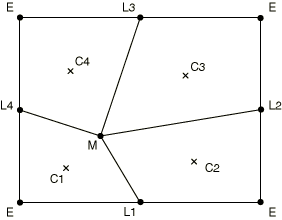
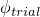
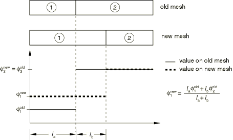

# 12.2.3 ALE adaptive meshing and remapping in Abaqus/Explicit


**Products: **Abaqus/Explicit  Abaqus/CAE  

##### **References**

- ["ALE adaptive meshing: overview," Section 12.2.1](pt04ch12s02abo14.md)
- ["Defining ALE adaptive mesh domains in Abaqus/Explicit," Section 12.2.2](pt04ch12s02aus78.md)
- ["Output and diagnostics for ALE adaptive meshing in Abaqus/Explicit," Section 12.2.5](pt04ch12s02aus81.md)
- [*ADAPTIVE MESH](../key/key-link.md#usb-kws-hadaptivemesh)
- [*ADAPTIVE MESH CONSTRAINT](../key/key-link.md#usb-kws-hadaptivemeshconstraint)
- [*ADAPTIVE MESH CONTROLS](../key/key-link.md#usb-kws-hadaptivemeshcontrols)
- ["Customizing ALE adaptive meshing," Section 14.14 of the Abaqus/CAE User's Guide](../usi/usi-link.md#usi-sim-other-adaptmesh)

### Overview

ALE adaptive meshing consists of two fundamental tasks: 
- creating a new mesh, and
- remapping solution variables from the old mesh to the new mesh with a process called advection.

The success of the adaptive meshing technique depends on the choice of the methods used for each of these tasks. The default methods for creating a new mesh and for remapping solution variables have been chosen carefully to work for a wide variety of problems. However, you may wish to override the default choices to balance the robustness and efficiency of adaptive meshing or to extend the use of adaptive meshing to more difficult or unusual applications.

### Meshing

A new mesh:
- is created at a specified frequency for each adaptive domain;
- is found by sweeping iteratively over the adaptive mesh domain and moving nodes to smooth the mesh; and
- can retain the initial gradation of the original mesh.

### Remapping

The methods used for advecting solution variables to the new mesh:
- are consistent, monotonic, and (by default) accurate to the second order; and
- conserve mass, momentum, and energy.

### Controlling the frequency of ALE adaptive meshing

In most cases the frequency of adaptive meshing is the parameter that most affects the mesh quality and the computational efficiency of adaptive meshing. A typical adaptive mesh application without Eulerian boundaries will require adaptive meshing every 5–100 increments. In contrast, adaptive meshing should generally be performed much more frequently in a steady-state process simulation using Eulerian boundaries. Thus, if a spatial adaptive mesh constraint or an Eulerian boundary region is defined on an adaptive mesh domain, the default frequency is 1; otherwise, the default frequency is 10.

| **Input File Usage: ** | Use the following option to change the frequency of adaptive meshing: |
| --- | --- |
|  | ``` [*ADAPTIVE MESH](../key/key-link.md#usb-kws-hadaptivemesh), FREQUENCY=*number of increments* ``` |

| **Abaqus/CAE Usage: ** | Step module: ****Other****ALE Adaptive Mesh Domain****Edit****: toggle on **Use the ALE adaptive mesh domain below**, **Frequency:** *number of increments* |
| --- | --- |

### Controlling the intensity of ALE adaptive meshing

During each adaptive meshing increment, the new mesh is created by performing one or more mesh sweeps and then advecting the solution variables to the new mesh.

#### Mesh sweeps

In an adaptive meshing increment, a new, smoother mesh is created by sweeping iteratively over the adaptive mesh domain. During each mesh sweep, nodes in the domain are relocated—based on the current positions of neighboring nodes and elements—to reduce element distortion. In a typical sweep a node is moved a fraction of the characteristic length of any element surrounding the node. Increasing the number of sweeps increases the intensity of adaptive meshing in each adaptive meshing increment. The default number of mesh sweeps is one.

| **Input File Usage: ** | Use the following option to change the number of mesh sweeps to be performed in each adaptive mesh increment: |
| --- | --- |
|  | ``` [*ADAPTIVE MESH](../key/key-link.md#usb-kws-hadaptivemesh), MESH SWEEPS=*number of sweeps* ``` |

| **Abaqus/CAE Usage: ** | Step module: ****Other****ALE Adaptive Mesh Domain****Edit****: toggle on **Use the ALE adaptive mesh domain below**, **Remeshing sweeps per increment:** *number of sweeps* |
| --- | --- |

#### Advection sweeps

The process of mapping solution variables from an old mesh to a new mesh is referred to as an advection sweep. At least one advection sweep is performed in every adaptive mesh increment. Ideally, an advection sweep will be performed only once, after all mesh sweeps for the increment are complete. However, numerical stability of the advection sweep is maintained only if the difference between the old mesh and the new mesh is small. Therefore, if after a mesh sweep the total accumulated movement of any node in the domain is greater than 50% of the characteristic length of any adjacent element, an advection sweep is performed to remap the solution variables from the old mesh to the intermediate mesh. Mesh sweeps will continue until the specified number is reached or until the movement of any node again exceeds the 50% threshold. At this time an advection sweep is performed again to map variables from the last intermediate mesh to the new intermediate mesh. The cycle will continue until the number of mesh sweeps reaches the specified number.

The number of advection sweeps per adaptive mesh increment required for each adaptive mesh domain is determined automatically by Abaqus/Explicit; you cannot override this automatic calculation. The number of advection sweeps is printed by default to the message (`.msg`) file (see ["Output and diagnostics for ALE adaptive meshing in Abaqus/Explicit," Section 12.2.5](pt04ch12s02aus81.md)).

### The computational cost of ALE adaptive meshing

The cost of adaptive meshing depends on the frequency of remeshing, the number of mesh and advection sweeps performed, and the size of the adaptive mesh domains. When compared to a purely Lagrangian analysis, additional computational cost is incurred only within adaptive mesh increments.

Generally, the cost of one advection sweep is several times greater than the cost of one mesh sweep. Multiple advection sweeps are triggered when adaptive meshing is performed too infrequently and/or a high number of mesh sweeps is specified. Performing adaptive meshing more frequently and doing 1–5 mesh sweeps in each adaptive mesh increment will usually generate only one advection sweep, minimizing the computational cost.

The relatively smooth mesh and improved element aspect ratios that result from adaptive meshing may increase the stable time increment compared to a similar pure Lagrangian analysis. In some cases this increase can offset the cost of adaptive meshing completely.

Although computational cost can vary greatly with the type of application, performing adaptive meshing on the entire problem domain in every increment will typically increase the cost of the analysis by 3–5 times that of a similar Lagrangian analysis. Defining adaptive mesh domains that cover only a fraction of the entire problem domain will reduce the cost proportionally. Changing the frequency to every 10–25 increments will result in CPU times that are only moderately higher than those for a pure Lagrangian analysis.

### Guidelines for controlling ALE adaptive meshing frequency and intensity

Although the default values work well for many problems, difficult analyses may require a more frequent adaptive meshing frequency or meshing with a higher intensity.

#### Guidelines for transient analysis

For problems without spatial adaptive mesh constraints or Eulerian boundary regions, the default frequency for adaptive meshing is 10, and the default number of mesh sweeps is 1. The default values are usually adequate for low- to moderate-rate dynamic problems and for quasi-static process simulations undergoing moderate deformation. If the frequency or number of mesh sweeps is too low, excess element distortion may cause the analysis to terminate before the mesh is adapted; or, if a solution can be obtained, it may not be as accurate as the solution that could be obtained with a higher quality mesh. In virtually all cases, however, performing adaptive meshing at any frequency will reduce the distortion of elements (and, thus, improve the quality of the solution) compared to a pure Lagrangian analysis.

For high-rate impact problems undergoing large amounts of deformation, it may be necessary to increase the frequency of adaptive meshing or the number of mesh sweeps. It is generally less expensive to increase the number of mesh sweeps slightly before increasing the frequency, as long as the number of advection sweeps remains small.

For problems involving explosions taking place over just a few hundred increments, adaptive meshing is usually required at every increment. It may also be necessary to increase the frequency of adaptive meshing for quasi-static process simulations that involve large amounts of flow per increment.

For problems in which the deformation per increment is small, a high-quality mesh can be maintained by performing adaptive meshing only every 25–100 increments. For these problems the additional cost of adaptive meshing is negligible.

#### Guidelines for steady-state analysis

When an adaptive mesh domain contains Eulerian boundary regions or has spatial adaptive mesh constraints, the default frequency of adaptive meshing is 1. This default frequency is conservative and is chosen primarily because spatial mesh constraints are applied only during adaptive mesh increments. Thus, between adaptive mesh increments the mesh may drift from its prescribed location, which may affect the solution. However, drift from adaptive mesh constraints will always be eliminated in the next adaptive mesh increment: it will not accumulate.

For problems in which the speed of deformation or the speed of material flow from element to element is much less than the material wave speed, the frequency typically can be increased to 5 or higher. This class of problems includes most steady-state process simulations, where the drift of the mesh from the prescribed location is negligible over a few increments. By performing adaptive meshing less often, steady-state simulations become competitive with their corresponding transient simulations. For Eulerian domains in which the speed of the deformation or material flow is high, such as in dynamic shock problems, the default frequency of 1 should be used.

### Mesh smoothing methods

The determination of the new mesh in Abaqus/Explicit is based on four aspects. You can control each of these aspects by defining adaptive mesh controls. Defaults have been chosen so that the overall algorithm works well for most problems.

First, the calculation of the new mesh in Abaqus/Explicit is based on some combination of three basic smoothing methods: volume smoothing, Laplacian smoothing, and equipotential smoothing. The smoothing methods are applied at each node in the adaptive mesh domain to determine the new location of the node based on the locations of surrounding nodes or elements. Although all the smoothing methods tend to smooth the mesh and reduce element distortion, the resulting meshes will differ depending on the methods used.

Second, initial element gradation can be maintained at the expense of element distortion if desired. Third, optimal positioning of the nodes before the basic smoothing methods are applied can improve mesh quality and minimize the frequency of adaptive meshing required.

Finally, solution-dependent meshing is used to concentrate mesh refinement near areas of evolving boundary curvature. This counteracts the tendency of the basic smoothing methods to reduce the mesh refinement near concave boundaries where solution accuracy is important.

#### Volume smoothing

Volume smoothing relocates a node by computing a volume-weighted average of the element centers in the elements surrounding the node. In [Figure 12.2.3--1](pt04ch12s02aus79.md#aaleremesh-smooth-method) the new position of node M is determined by a volume-weighted average of the positions of the element centers, C, of the four surrounding elements. The volume weighting will tend to push the node away from element center C1 and toward element center C3, thus reducing element distortion.

**Figure 12.2.3–1** Relocation of a node during a mesh sweep.



Volume smoothing is very robust and is the default method in Abaqus/Explicit. It works well for both structured and highly unstructured domains. (A structured domain is one that contains no degenerate elements and where every node is surrounded by four elements in two dimensions or eight elements in three dimensions.)

#### Laplacian smoothing

Laplacian smoothing relocates a node by calculating the average of the positions of each of the adjacent nodes connected by an element edge to the node in question. In [Figure 12.2.3--1](pt04ch12s02aus79.md#aaleremesh-smooth-method) the new position of node M is determined by averaging the positions of the four nodes, L, connected to M by element edges. The locations of nodes L2 and L3 will pull node M up and to the right to reduce element distortion.

Laplacian smoothing is the least expensive smoothing algorithm and is commonly used in mesh preprocessors. For low to moderately distorted mesh domains, the results of Laplacian smoothing are similar to volume smoothing. For domains with boundaries of complex curvature, volume smoothing generally results in a more balanced mesh.

#### Equipotential smoothing

Equipotential smoothing is a higher-order method that relocates a node by calculating a higher-order, weighted average of the positions of the node's eight nearest neighbor nodes in two dimensions (or its eighteen nearest neighbor nodes in three dimensions). In [Figure 12.2.3--1](pt04ch12s02aus79.md#aaleremesh-smooth-method) the new position of node M is based on the position of all the surrounding nodes, L and E.

The weighted averaging for the equipotential smoothing method is fairly complex and is based on the solution of the Laplace equation. Equipotential smoothing tends to minimize the local curvature of lines running across a mesh over several elements. Although this tendency can be desirable for gently curving domains, it can inhibit the ability of equipotential smoothing to reduce element distortion in highly deformed and locally curved domains.

Equipotential smoothing can be performed only for nodes that are surrounded by a locally structured mesh. Nodes that are surrounded by an unstructured mesh are moved with an equivalent amount of volume smoothing when equipotential smoothing is chosen.

#### Combining smoothing methods

The default smoothing method in Abaqus/Explicit is volume smoothing. To choose an alternate smoothing method or to combine smoothing methods, you specify the weighting factor for each method. When more than one smoothing method is used, a node is relocated by computing a weighted average of the locations predicted by each chosen method. All weights must be positive, and their sum should typically be 1.0. If the sum of the chosen weights is less than 1.0, the mesh smoothing algorithm will be less aggressive at each adaptive mesh increment. If the sum of the chosen weights is greater than 1.0, their values are normalized so that their sum is 1.0.

| **Input File Usage: ** | ``` [*ADAPTIVE MESH CONTROLS](../key/key-link.md#usb-kws-hadaptivemeshcontrols), NAME=*name* *volume smoothing weight, Laplacian smoothing weight, equipotential smoothing weight* ``` |
| --- | --- |
|  | For example, the following option could be used to define an equal blend of volume and equipotential smoothing, with no Laplacian smoothing: ``` [*ADAPTIVE MESH CONTROLS](../key/key-link.md#usb-kws-hadaptivemeshcontrols), NAME=*name* 0.5, 0.0, 0.5 ``` |

| **Abaqus/CAE Usage: ** | Step module: ****Other****ALE Adaptive Mesh Controls****Create****: **Name**: *name*, **Volumetric:** *volume smoothing weight*, **Laplacian:** *Laplacian smoothing weight*, **Equipotential:** *equipotential smoothing weight* |
| --- | --- |

#### Geometric enhancements to the basic smoothing methods

The conventional forms of the basic smoothing methods do not perform well in highly distorted domains. To ensure the robustness of adaptive meshing, Abaqus/Explicit uses geometrically enhanced forms of the basic smoothing algorithms by default. The enhanced forms are recommended for all adaptive mesh applications. However, since the basic smoothing algorithms are used by many finite element preprocessors, their conventional forms are provided as an option.

| **Input File Usage: ** | Use the following option to use the conventional forms of the volume, Laplacian, or equipotential smoothing algorithms: |
| --- | --- |
|  | ``` [*ADAPTIVE MESH CONTROLS](../key/key-link.md#usb-kws-hadaptivemeshcontrols), NAME=*name*, GEOMETRIC ENHANCEMENT=NO ``` |

| **Abaqus/CAE Usage: ** | Step module: ****Other****ALE Adaptive Mesh Controls****Create****: **Name**: *name*, toggle off **Use enhanced algorithm based on evolving element geometry** |
| --- | --- |

#### Specifying a uniform mesh smoothing objective

For adaptive mesh domains without any Eulerian boundary regions, the default objective of the mesh smoothing methods is to minimize mesh distortion while improving element aspect ratios, at the expense of diffusing initial mesh gradation. The uniform mesh smoothing objective is recommended for problems with moderate to large overall deformation.

| **Input File Usage: ** | Use the following option to specify the uniform mesh smoothing objective: |
| --- | --- |
|  | ``` [*ADAPTIVE MESH CONTROLS](../key/key-link.md#usb-kws-hadaptivemeshcontrols), NAME=*name*, SMOOTHING OBJECTIVE=UNIFORM ``` |

| **Abaqus/CAE Usage: ** | Step module: ****Other****ALE Adaptive Mesh Controls****Create****: **Name**: *name*, **Priority: Improve aspect ratio** |
| --- | --- |

#### Specifying a graded mesh smoothing objective

Alternatively, the smoothing methods can attempt to preserve initial mesh gradation while reducing element distortion as the analysis evolves. This objective is the default for adaptive mesh domains with one or more Eulerian boundary regions. The graded mesh smoothing objective is recommended only for adaptive mesh domains with reasonably structured graded meshes undergoing low to moderate overall deformation. Element distortion will be minimized, but the aspect ratios of adjacent elements will be maintained approximately. Mesh gradation is particularly useful in steady-state problems where overall deformations are small and a focused mesh is used in a specific area to capture high solution gradients.

| **Input File Usage: ** | Use the following option to specify the graded mesh smoothing objective: |
| --- | --- |
|  | ``` [*ADAPTIVE MESH CONTROLS](../key/key-link.md#usb-kws-hadaptivemeshcontrols), NAME=*name*, SMOOTHING OBJECTIVE=GRADED ``` |

| **Abaqus/CAE Usage: ** | Step module: ****Other****ALE Adaptive Mesh Controls****Create****: **Name**: *name*, **Priority: Preserve initial mesh grading** |
| --- | --- |

#### Positioning nodes in Lagrangian domains

If an adaptive mesh domain has no Eulerian boundary regions, then, by default, the mesh sweeps are based on current nodal locations, which account for material motion accumulated since the last adaptive mesh increment. This approach is generally the best for Lagrangian problems that undergo large overall deformation.

| **Input File Usage: ** | Use the following option to request that the current deformed positions of nodes be used as the starting locations for mesh smoothing: |
| --- | --- |
|  | ``` [*ADAPTIVE MESH CONTROLS](../key/key-link.md#usb-kws-hadaptivemeshcontrols), NAME=*name*, MESHING PREDICTOR=CURRENT ``` |

| **Abaqus/CAE Usage: ** | Step module: ****Other****ALE Adaptive Mesh Controls****Create****: **Name**: *name*, **Meshing predictor: Current deformed position** |
| --- | --- |

#### Positioning nodes in Eulerian domains

Mesh sweeps can be based on the locations of nodes at the end of the previous adaptive mesh increment. This technique is recommended for problems that are Eulerian in nature, where material flow is significant compared to overall deformation. Therefore, it is the default for adaptive mesh domains with one or more Eulerian boundary regions. This approach will result in a virtually stationary mesh.

| **Input File Usage: ** | Use the following option to use the position of the nodes at the end of the previous adaptive mesh increment as a starting location for mesh smoothing: |
| --- | --- |
|  | ``` [*ADAPTIVE MESH CONTROLS](../key/key-link.md#usb-kws-hadaptivemeshcontrols), NAME=*name*, MESHING PREDICTOR=PREVIOUS ``` |

| **Abaqus/CAE Usage: ** | Step module: ****Other****ALE Adaptive Mesh Controls****Create****: **Name**: *name*, **Meshing predictor: Position from previous adaptive mesh increment** |
| --- | --- |

### Solution-dependent meshing based on concave boundary curvature

Mesh smoothing algorithms based only on minimizing element distortion tend to reduce the mesh refinement in areas of concave curvature, especially as the curvature evolves. Having sufficient mesh refinement near highly curved boundaries is often important to model both the shape and volume of the domain. To prevent the natural reduction in mesh refinement of areas near evolving concave curvature, Abaqus/Explicit uses solution-dependent meshing to focus mesh gradation toward these areas automatically.

Although solution-dependent meshing may “pull” more elements into areas of high curvature, its primary purpose is to retain the nominal refinement in these zones. Therefore, a fine mesh should always be used when and where highly curved boundaries are expected and solution-dependent meshing should generally not be used as a direct substitute for more elements.

The aggressiveness of the solution-dependent meshing is governed by the curvature refinement weight, . By default, , which correponds to an aggressivity level that has been chosen to work well on a wide variety of problems. You can change the curvature refinement weight. A value of zero indicates no solution dependence due to evolving boundary curvature, and a value greater than one increases the aggressivity from the default.

| **Input File Usage: ** | ``` [*ADAPTIVE MESH CONTROLS](../key/key-link.md#usb-kws-hadaptivemeshcontrols), NAME=*name*, CURVATURE REFINEMENT= ``` |
| --- | --- |

| **Abaqus/CAE Usage: ** | Step module: ****Other****ALE Adaptive Mesh Controls****Create****: **Name**: *name*, **Curvature refinement:**  |
| --- | --- |

### Smoothing a distorted mesh at the beginning of a step

When an adaptive mesh domain contains a structured mesh of uniform density, the mesh will move independently from the material only when the domain deforms. If the mesh is initially nonuniform, the meshing algorithms in Abaqus/Explicit will smooth the mesh even in the absence of deformation or material transport.

When the initial mesh contains highly distorted elements, it is often useful to smooth the mesh before the step begins so that the best possible mesh is used throughout the step. When a uniform smoothing objective is used, five mesh sweeps are performed by default at the beginning of the step in which the adaptive mesh domain is defined. For a graded smoothing objective, two mesh sweeps are performed by default at the beginning of the step without acccounting for gradation. The aspect ratios used for gradation in all subsequent mesh sweeps are based on this locally smoothed mesh.

Initial conditions are advected to the new mesh when initial mesh sweeps are performed.

| **Input File Usage: ** | Use the following option to change the number of mesh sweeps that will be performed at the beginning of the first step in which the adaptive mesh definition is active: |
| --- | --- |
|  | ``` [*ADAPTIVE MESH](../key/key-link.md#usb-kws-hadaptivemesh), INITIAL MESH SWEEPS=*number of initial sweeps* ``` For example, the following option would smooth a badly distorted mesh with 15 mesh sweeps at the beginning of the step, before performing adaptive meshing with three mesh sweeps every 20 increments throughout the step: ``` [*ADAPTIVE MESH](../key/key-link.md#usb-kws-hadaptivemesh), FREQUENCY=20, MESH SWEEPS=3, INITIAL MESH SWEEPS=15 ``` |

| **Abaqus/CAE Usage: ** | Step module: ****Other****ALE Adaptive Mesh Domain****Edit****: toggle on **Use the ALE adaptive mesh domain below**, **Initial remeshing sweeps: Value:** *number of initial sweeps* |
| --- | --- |

### Meshing on boundary regions

Adaptive meshing on Lagrangian and sliding boundary regions is subject to the constraint that the mesh and material must move together in the direction normal to the boundary. Nodes on the interior of such a boundary are allowed to slide freely over the material within the boundary region, which maximizes the amount of mesh smoothing that can be performed. Nodes are positioned in each mesh sweep by applying the basic smoothing methods while constraining the nodes to lie on the boundary region. In three dimensions some nodes on Lagrangian boundary regions will be on a Lagrangian edge. In each mesh sweep these nodes are positioned by applying the basic smoothing methods while constraining the node to lie along the discrete Lagrangian edge.

For problems in which the flow of material from element to element along the boundary is significant compared to the deformation, oscillations in the boundary mesh can result if these constraints are applied symmetrically with respect to the upstream and downstream directions of material flow. Abaqus/Explicit uses a Petrov-Galerkin weighting of the free boundary constraint to suppress any oscillations. The algorithm is volume preserving, and the degree of upwinding is chosen automatically.

### Advecting solution variables to the new mesh

The framework for adaptive meshing in Abaqus/Explicit is the Arbitrary Lagrangian-Eulerian method, which introduces advective terms into the momentum balance and mass conservation equations to account for independent mesh and material motion. There are two basic ways to solve these modified equations: solve the nonsymmetric system of equations directly, or decouple the Lagrangian (material) motion from the additional mesh motion using an operator split. The operator split method is used in Abaqus/Explicit because of its computational efficiency. Furthermore, this technique is appropriate in an explicit setting because small time increments limit the amount of motion within a single increment.

In an adaptive meshing increment the element formulations, boundary conditions, external loads, contact conditions, etc. are handled first in a manner consistent with a pure Lagrangian analysis. Once the Lagrangian motion is updated and mesh sweeps have been performed to find the new mesh, the solution variables are remapped by performing an advection sweep. The advection sweep accounts for the advective terms in the momentum balance and continuity equations.

### Advection methods for element variables

Element and material state variables must be transferred from the old mesh to the new mesh in each advection sweep. The number of variables to be advected depends on the material model and element formulation; however, stress, history variables, density, and internal energy are always solution variables. Two methods are available for the advection of element variables: the default second-order method based on the work of Van Leer (Van Leer, 1977) and a first-order method based on donor cell differencing.

Both advection methods incorporate the concept of upwinding. They also conserve the element variables in an integral sense when mapping from the old mesh to the new mesh (that is, the value of any solution variable integrated over the domain is unchanged by adaptive meshing). Using a conservative algorithm to advect the element density and the internal energy automatically ensures conservation of mass and energy for an adaptive mesh domain without Eulerian boundary regions.

Both advection methods are also monotonic and consistent. A method is monotonic if an element quantity with a monotonic, increasing spatial distribution over a portion of the old mesh remains as such in the new mesh. A method is consistent if, when solution variables are advected to a new mesh that is identical to the old mesh, all element quantities remain unchanged.

#### Second-order advection

Second-order advection is used by default for all adaptive mesh domains. It is recommended for all problems, ranging from quasi-static to transient dynamic shock. An element variable, , is remapped from the old mesh to the new mesh by first determining a linear distribution of the variable in each old element, as illustrated in [Figure 12.2.3--2](pt04ch12s02aus79.md#aaleremesh-2ndord-advection) for a simple one-dimensional mesh. 

**Figure 12.2.3–2** Second-order advection.


The linear distribution of  in the middle element depends on the values of  in the two adjacent elements. To construct the linear distribution:

1. A quadratic interpolation is constructed from the constant values of  at the integration points of the middle element and in its adjacent elements.
2. A trial linear distribution, , is found by differentiating the quadratic function to find the slope at the integration point of the middle element.
3. The trial linear distribution in the middle element is limited by reducing its slope until its minimum and maximum values are within the range of the original constant values in the adjacent elements. This process is referred to as flux-limiting and is essential to ensure that the advection is monotonic.

Once the flux-limited linear distributions are determined for all elements in the old mesh, these distributions are integrated over each new element. The new value of the variable is found by dividing the value of each integral by the new element volume. (See [Figure 12.2.3--3](pt04ch12s02aus79.md#aaleremesh-1stord-advection) for a first-order example of this calculation.)

**Figure 12.2.3–3** First-order advection.



| **Input File Usage: ** | Use the following option to specify that the second-order advection method should be used to remap element variables: |
| --- | --- |
|  | ``` [*ADAPTIVE MESH CONTROLS](../key/key-link.md#usb-kws-hadaptivemeshcontrols), NAME=*name*, ADVECTION=SECOND ORDER ``` |

| **Abaqus/CAE Usage: ** | Step module: ****Other****ALE Adaptive Mesh Controls****Create****: **Name**: *name*, toggle on **Second order** |
| --- | --- |

#### First-order advection

First-order advection is simple and computationally efficient; however, it tends to diffuse sharp gradients over time, especially in transient dynamic analyses or other problems that require fairly frequent adaptive meshing. Therefore, this technique should be used only as a computationally efficient alternative for quasi-static simulations that do not require frequent adaptive meshing.

[Figure 12.2.3--3](pt04ch12s02aus79.md#aaleremesh-1stord-advection) illustrates the first-order method for a portion of a one-dimensional mesh. An element variable, , is remapped from the old mesh to the new mesh by first assuming a constant value of the variable for each old element. These values are then integrated over each new element. The new value of the variable is found by dividing the value of each integral by the new element volume.

| **Input File Usage: ** | Use the following option to specify that the first-order advection method should be used to remap element variables: |
| --- | --- |
|  | ``` [*ADAPTIVE MESH CONTROLS](../key/key-link.md#usb-kws-hadaptivemeshcontrols), NAME=*name*, ADVECTION=FIRST ORDER ``` |

| **Abaqus/CAE Usage: ** | Step module: ****Other****ALE Adaptive Mesh Controls****Create****: **Name**: *name*, toggle on **First order** |
| --- | --- |

### Momentum advection

Nodal velocities are computed on a new mesh by first advecting momentum, then using the mass distribution on the new mesh to calculate the velocity field. Advecting momentum directly ensures that momentum is conserved properly in the adaptive mesh domain during remapping. Two methods are available for advecting momentum: the default element center projection method and the half-index shift method (Benson, 1992). Both methods are applicable for all adaptive mesh applications.

#### Element center projection method

The element center projection method is the default method used to advect momentum and requires the fewest numerical operations. The element momentum is calculated first for the old mesh based on the mass and velocity of the element nodes. The element momentum is then advected from the old mesh to the new mesh by the same first- or second-order algorithms used for advecting element variables. Finally, the element momentum on the new mesh is assembled at the nodes using a projection. The element center projection method requires the advection of only two or three extra variables in two dimensions or three dimensions, respectively.

| **Input File Usage: ** | Use the following option to request the most computationally efficient momentum advection method: |
| --- | --- |
|  | ``` [*ADAPTIVE MESH CONTROLS](../key/key-link.md#usb-kws-hadaptivemeshcontrols), NAME=*name*, MOMENTUM ADVECTION=ELEMENT CENTER PROJECTION ``` |

| **Abaqus/CAE Usage: ** | Step module: ****Other****ALE Adaptive Mesh Controls****Create****: **Name**: *name*, **Momentum advection: Element center projection** |
| --- | --- |

#### Half-index shift method

The half-index shift method is computationally more intensive than the element center projection method, but it may result in less wave dispersion for some problems. This method first shifts each of the nodal momentum variables from the nodes surrounding an element to the element center. The shifted momentum variables are then advected from the old mesh to the new mesh by the same first- or second-order algorithms used for advecting element variables, providing momentum variables at the center of the new elements. Finally, the momentum variables at the element centers in the new mesh are shifted back to the nodes. The half-index shift method requires the advection of 8 or 24 extra variables in two or three dimensions, respectively, which can increase the cost of each advection sweep significantly.

| **Input File Usage: ** | Use the following option to specify that the half-index shift method should be used for momentum advection: |
| --- | --- |
|  | ``` [*ADAPTIVE MESH CONTROLS](../key/key-link.md#usb-kws-hadaptivemeshcontrols), NAME=*name*, MOMENTUM ADVECTION=HALF INDEX SHIFT ``` |

| **Abaqus/CAE Usage: ** | Step module: ****Other****ALE Adaptive Mesh Controls****Create****: **Name**: *name*, **Momentum advection: Half-index shift** |
| --- | --- |

#### Additional references

- Benson, D. J., "Momentum Advection on a Staggered Mesh," Journal of Computational Physics, vol. 100, pp. 143--162, 1992.
- Van Leer, B., "Towards the Ultimate Conservative Difference Scheme III. Upstream-centered Finite-Difference Schemes for Ideal Compressible Flow," Journal of Computational Physics, vol. 23, pp. 263--275, 1977.
- Van Leer, B., "Towards the Ultimate Conservative Difference Scheme IV. A New Approach to Numerical Convection," Journal of Computational Physics, vol. 23, pp. 276--299, 1977.


