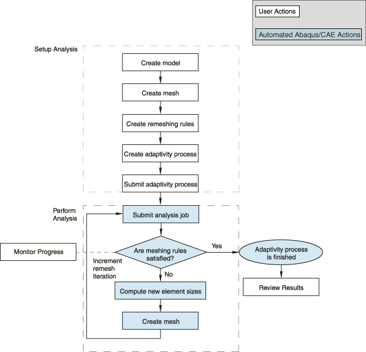
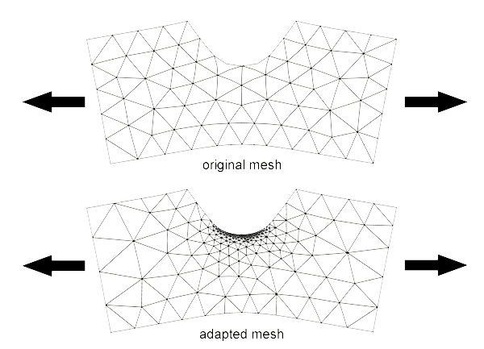
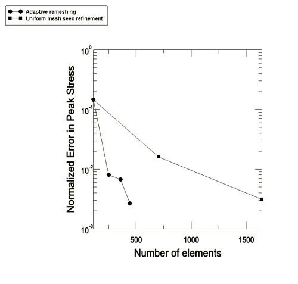
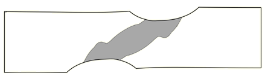
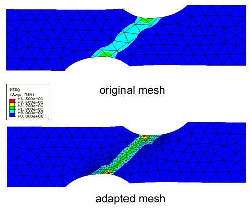
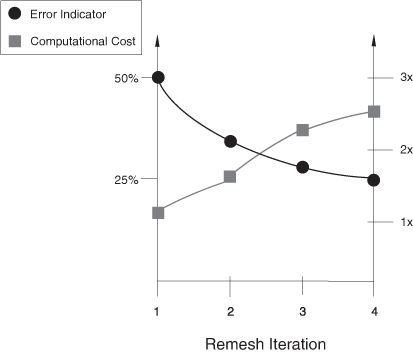

# 12.3.1 Adaptive remeshing: overview

Abaqus/CAE provides an automated process to remesh your model adaptively. The goal of the adaptive remeshing process is to approach or reach targets on selected error indicators for a specified model and its accompanying load history. See ["Adaptivity techniques," Section 12.1.1](pt04ch12s01aus77.md), for a comparison of this process to other Abaqus adaptivity methods.

### Overview

The following steps are required to incorporate adaptive remeshing into your Abaqus/CAE model:
- You identify regions of the model where you wish to apply one or more adaptive remeshing rules. A remeshing rule defines the step during which it will be applied, the error indicator output variables and targets for those error indicators, the sizing method, and any constraints on element size. See ["What are remeshing rules?," Section 17.13.1 of the Abaqus/CAE User's Guide](../usi/usi-link.md#usi-mgn-conc-adaptivity-rulerole).
- You define a succession of analysis jobs, an "adaptivity process," that will be run as Abaqus/CAE attempts to meet your remeshing rule targets. See ["What is an adaptivity process?," Section 19.3.1 of the Abaqus/CAE User's Guide](../usi/usi-link.md#usi-ana-adaptivity-steps).

 Based on these remeshing rules and your adaptivity process definition, Abaqus/CAE iteratively: - executes an Abaqus/Standard analysis, which will write selected error indicator output variables based on your remeshing rule settings (See ["Selection of error indicators influencing adaptive remeshing," Section 12.3.2](pt04ch12s03aus84.md)),
- uses the error indicator variables in a sizing function to compute element sizes for a new mesh, respecting any size constraints you might specify (See ["Solution-based mesh sizing," Section 12.3.3](pt04ch12s03aus85.md)), and
- generates a new mesh in the regions specified, based on the computed element sizes. The neighboring regions will also be remeshed.

 These iterations continue until either: - all remeshing rule targets are satisfied, or
- a maximum number of remesh iterations is reached.

 See ["When will my mesh adaptivity stop iterating?," Section 19.3.2 of the Abaqus/CAE User's Guide](../usi/usi-link.md#usi-ana-adaptivity-automatic), for more details. [Figure 12.3.1--1](pt04ch12s03abo15.md#aadaptivity-bigloop) shows the interaction of Abaqus products and files in this process.

**Figure 12.3.1–1** User actions and automated Abaqus/CAE actions in the adaptive remeshing process.

### Typical applications

Adaptive remeshing can improve the quality of your simulation results. Adaptive remeshing can be helpful when:
- you are unsure how refined a mesh needs to be to reach a particular level of accuracy or how coarse the mesh can be without unacceptably impacting solution accuracy;
- it is difficult to design an adequately refined mesh near a region of interest, such as near a stress riser; or
- you do not know a location of interest, such as with formation of a plastic zone, a priori.

An example of using adaptive remeshing to study the thermal and stress behavior of a bolted vessel is provided in ["Thermal-stress analysis of a reactor pressure vessel bolted closure," Section 5.1.6 of the Abaqus Example Problems Guide](../exa/exa-link.md#exa-htr-reactor). The example includes a Python script that you can run from Abaqus/CAE to create the model and the remeshing rules. A second script allows you to submit the adaptivity process and to view the changing mesh as Abaqus/CAE computes new element sizes.

#### Example: stress riser

[Figure 12.3.1--2](pt04ch12s03abo15.md#aadaptivity-meshes) shows how adaptive remeshing generates a high-quality mesh for a typical notched specimen subjected to axial loading. 

**Figure 12.3.1–2** Stress riser mesh before and after refinement.

[Figure 12.3.1--3](pt04ch12s03abo15.md#aadaptivity-stress-graph) shows the effect of these mesh changes on solution accuracy in comparison to the effect of uniform mesh refinement on solution accuracy. Adaptive mesh refinement is much more efficient than uniform mesh refinement at reducing solution error.

**Figure 12.3.1–3** Comparison of adaptive remeshing to uniform mesh refinement based on boundary seeding.

#### Example: plastic hinge

This example, a doubly-notched specimen axially strained until a plastic hinge or band forms, is used to demonstrate how adaptive remeshing will focus a mesh on a plastic hinge. It illustrates the value of adaptive remeshing in cases where the region of interest may not be known a priori. [Figure 12.3.1--4](pt04ch12s03abo15.md#aadaptivity-plastichinge) shows the specimen and the region of active yielding. [Figure 12.3.1--5](pt04ch12s03abo15.md#aadaptivity-plasticmeshes) shows the original mesh and the adapted mesh after three adaptive remeshing iterations. 

**Figure 12.3.1–4** Region of active yielding in a doubly-notched specimen.

**Figure 12.3.1–5** Mesh of doubly-notched specimen before and after adaptive remeshing.

### Preparing your model for adaptive remeshing

You use Abaqus/CAE to do the following when performing adaptive remeshing:
- create the model and specify the boundary conditions and loading history,
- create remeshing rules,
- create an adaptivity process, and
- start and monitor the progress of the adaptivity process.

#### Creating the model

You do not have to consider adaptive remeshing when you create the model and specify the boundary conditions and loading history; however, before using adaptive remeshing you must do the following:
- create the geometry of the model---you cannot use an orphan mesh part---and
- provide an initial, nominal, mesh. This mesh can be fairly coarse. Providing an extremely coarse mesh, however, can result in more adaptive remesh iterations due to the poor quality of early remesh iteration error indicator calculations. You can, in typical cases, define a reasonable initial mesh by using the default part instance mesh seeding in Abaqus/CAE.

#### Creating a remeshing rule

You create and configure a remeshing rule using the Mesh module in Abaqus/CAE. See ["Creating a remeshing rule," Section 17.21.1 of the Abaqus/CAE User's Guide](../usi/usi-link.md#usi-mgn-adaptivity-rule), for details on defining remesh rules. Refer to ["Selection of error indicators influencing adaptive remeshing," Section 12.3.2](pt04ch12s03aus84.md), and ["Solution-based mesh sizing," Section 12.3.3](pt04ch12s03aus85.md), for details on the methods used to determine revised mesh size distributions.

| **Abaqus/CAE Usage: ** | Mesh module: ****Adaptivity****Remeshing Rule****Create**** |
| --- | --- |

#### Creating an adaptivity process

You create and configure an adaptivity process using the Job module in Abaqus/CAE. When you create an adaptivity process, you can specify the maximum number of remesh iterations to be performed and set various system resource parameters. See ["Creating, editing, and manipulating jobs," Section 19.7 of the Abaqus/CAE User's Guide](../usi/usi-link.md#usi-ana-managejob), for details.

| **Abaqus/CAE Usage: ** | Job module: ****Adaptivity****Create**** |
| --- | --- |

### Performing adaptive remeshing with a provisional analysis

In some cases you will want to determine an adequate mesh for your model prior to conducting a fully detailed analysis, which might include many steps and complex behavior. A “provisional” analysis can often be used, along with adaptive remeshing, to efficiently determine a good mesh for a model. The provisional analysis may include various simplifications of your fully detailed analyis, such as
- replacing your steps with a single linear perturbation step with loading that adequately reflects your more general loading cases,
- removing plasticity and other material nonlinearities, and
- disabling geometric nonlinearity.

The provisional analysis approach may result in a mesh that is not ideally suited to your ultimate choice of loading. However, the cost for obtaining a mesh from a provisional model may be significantly lower than the case where your adaptivity process considers all of the complexity in the fully detailed analysis, and you may find the refined mesh adequate for use in a variety of analysis situations.

### Special considerations

In general, the Abaqus adaptive remeshing process iterates automatically toward a better quality mesh; however, you should be aware of certain considerations.

#### Singularities

Stress singularities frequently result from geometric abstractions, such as reentrant corners and contact of a sharp edge in elastic materials, and from point loads or abruptly ended distributed load regions. In these situations the stress field near the singularity is unbounded, and no amount of mesh refinement will enable resolution of the correct solution. If you apply the adaptive remeshing process to regions of your model that include singularities, the process will drive elements near the singularity to very small sizes. The end result may be unacceptably expensive analyses. 

You can prevent excessively expensive analyses of models with singularities using the following techniques:
- Exclude the region of the singularity from consideration in the remeshing process. You exclude a region by partitioning the model and assigning remeshing rules only to regions away from the singularity.
- Apply a minimum element size constraint in the remeshing rule. Abaqus/CAE does assign a minimum element size by default, which is a fraction of the default part instance mesh seed. You can modify this constraint to achieve a quality solution near the singularity while avoiding an excessively refined mesh. You can also use the remeshing rule to control the rate at which Abaqus/CAE refines the size of the elements. Element size constraints may prevent an adaptivity process from achieving specified error indicator targets.
- Specify a maximum number of elements for a remeshing rule region. Abaqus/CAE adjusts the mesh sizing such that the generated total number of elements approximately satisfies this constraint.

#### Convergence issues

[Figure 12.3.1--6](pt04ch12s03abo15.md#aadaptivity-costanderror) shows a typical history of an error indicator and the computational cost, in Abaqus/Standard, versus remesh iteration.

**Figure 12.3.1–6** Error indicator and computational cost versus iteration for a model with a 25% error indicator target.

The example in [Figure 12.3.1--6](pt04ch12s03abo15.md#aadaptivity-costanderror) shows a desirable convergence profile. The solution error indicator decreases monotonically and quickly to the desired 25% error indicator target. Accompanying this error indicator decrease is a moderate increase in computational cost, measured either in model degrees of freedom or time in Abaqus/Standard. Certain situations can interfere with this desirable convergence profile, as follows:
- If your initial mesh is too coarse, the error indicator variables may be of insufficient quality to result in a mesh that is sufficiently improved in the next iteration. The adaptive remeshing process typically creates a high-quality mesh eventually even if the initial mesh is quite coarse. However, some mesh iterations can be avoided with a reasonably refined initial mesh.
- Minimum element size constraints and constraints on the maximum number of elements that you specify when creating the remeshing rule can prevent the mesh from achieving sufficient refinement (in the extreme case of singularities this will always be the case) to satisfy your error indicator targets. You may be able to satisfy your targets by relaxing these constraints; for example, by decreasing the minimum element size. For more information, see ["What are remeshing rules?," Section 17.13.1 of the Abaqus/CAE User's Guide](../usi/usi-link.md#usi-mgn-conc-adaptivity-rulerole).
- In addition to producing small mesh sizes resulting in a large number of elements, singularities can cause an adaptivity process to fail in achieving the error target or to require more remeshing iterations. As described in ["Singularities](pt04ch12s03abo15.md#usb-anl-aadpover-singularities)," above, you can control the computational cost by specifying a minimum element size constraint or the maximum number of elements. In any case where a singularity exists within a remeshing rule region, you may see poor convergence in the error indicator results.
- Linear elements (C3D4, CPS4, etc.) and modified elements (C3D10M, CPS6M, etc.) converge slowly compared to quadratic elements (C3D10, CPS6, etc.) requiring a relatively large number of elements to achieve a given error target. Hence, you should use quadratic elements whenever possible.

#### Continuing a stopped adaptive remeshing process

The adaptive remeshing process is designed to be automatic—Abaqus/CAE performs a sequence of analyses as it continues to refine your mesh. However, there are occasions where the process will stop and you will want to continue adaptive remeshing from your most recent mesh:
- when you want to change remeshing rules for later remesh iterations, or
- when the adaptive remesh process fails to complete due to machine resource problems.

You can continue the adaptive remeshing process by resubmitting an existing adaptivity process, creating and submitting a new adaptivity process, or performing manual remeshing. See ["Manually resizing and remeshing," Section 17.21.6 of the Abaqus/CAE User's Guide](../usi/usi-link.md#usi-mgn-adaptivity-remeshing).

### Limitations

Adaptive remeshing requires the use of Abaqus/CAE, and only Abaqus/Standard procedures are supported. Other specific limitations also apply.

#### Element types

Abaqus/CAE can perform adaptive remeshing only with elements of the following shapes (see ["Which mesh controls can I use with adaptive remeshing?," Section 17.13.2 of the Abaqus/CAE User's Guide](../usi/usi-link.md#usi-mgn-conc-adaptivity-elements)):
- Planar continuum triangles and quadrilaterals
- Shell triangles and quadrilaterals
- Tetrahedrals

#### Procedures

Abaqus/CAE can perform remeshing with the following Abaqus/Standard procedures:
- ["Static stress analysis," Section 6.2.2](pt03ch06s02at01.md) (general and linear perturbation).
- ["Quasi-static analysis," Section 6.2.5](pt03ch06s02at04.md).
- ["Uncoupled heat transfer analysis," Section 6.5.2](pt03ch06s05at18.md).
- ["Fully coupled thermal-stress analysis," Section 6.5.3](pt03ch06s05at19.md).
- ["Coupled thermal-electrical analysis," Section 6.7.3](pt03ch06s07at22.md).
- ["Coupled pore fluid diffusion and stress analysis," Section 6.8.1](pt03ch06s08at26.md).

