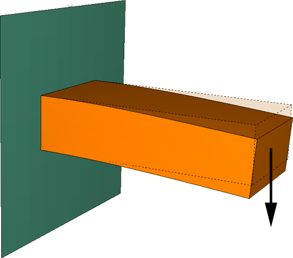
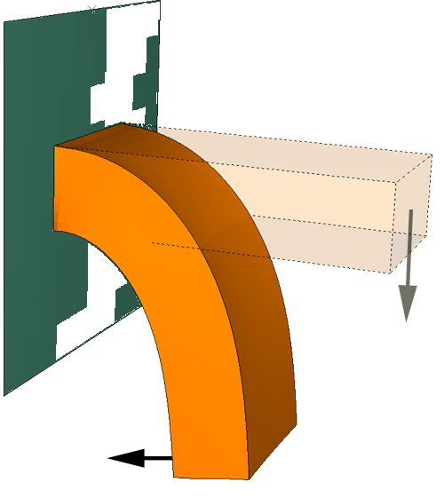
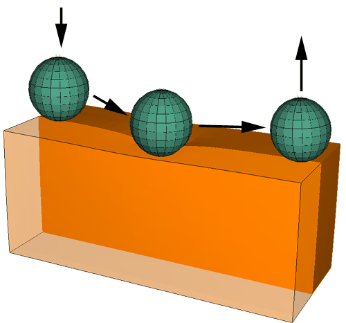
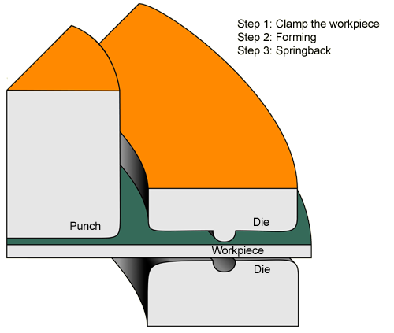

# 12.3.2 Selection of error indicators influencing adaptive remeshing

**Products: **Abaqus/Standard  Abaqus/CAE  

##### **References**

- ["Error indicator output," Section 4.1.4](pt02ch04s01aus41.md)
- ["Adaptive remeshing: overview," Section 12.3.1](pt04ch12s03abo15.md)
- ["Abaqus/Standard output variable identifiers," Section 4.2.1](pt02ch04s02abv01.md)
- [*CONTACT OUTPUT](../key/key-link.md#usb-kws-hcontactoutput)
- [*ELEMENT OUTPUT](../key/key-link.md#usb-kws-helementoutput)
- ["Understanding adaptive remeshing," Section 17.13 of the Abaqus/CAE User's Guide](../usi/usi-link.md#usi-mgn-conc-adaptivity)
- ["Controlling adaptive remeshing," Section 17.21 of the Abaqus/CAE User's Guide](../usi/usi-link.md#usi-mgn-adaptivity)

### Overview

Your selection of which error indicator variables to use in adaptive remeshing rules for a particular analysis should take into consideration:
- characteristics of the error indicator variables;
- which fields exist and are of interest; and
- the nature of the loading.

### Error indicator characteristics

Error indicator output variables provide estimates of solution accuracy (see ["Error indicator output," Section 4.1.4](pt02ch04s01aus41.md)). In the context of adaptive remeshing, error indicators help determine where the mesh should be refined or coarsened to achieve the specified accuracy targets (see ["Adaptive remeshing: overview," Section 12.3.1](pt04ch12s03abo15.md) and ["Solution-based mesh sizing," Section 12.3.3](pt04ch12s03aus85.md)). This Section discusses additional characteristics of error indicators in the context of how well-suited they are for influencing adaptive remeshing in various analysis types.

### Which fields exist and are of interest

Certain variables apply naturally to certain types of analyses. For example, the heat flux indicator (HFLERI) is used in analyses with temperature degrees of freedom. When selecting error indicator variables in the **Remeshing Rule** editor in Abaqus/CAE (see ["What are remeshing rules?," Section 17.13.1 of the Abaqus/CAE User's Guide](../usi/usi-link.md#usi-mgn-conc-adaptivity-rulerole)), your choices will be restricted to variables available for the selected procedure type.

### The nature of the loading

Some error indicator variables only indicate discretization error at the current analysis time—the particular increment in a step. Other error indicator variables provide a record of the solution history up to the current analysis time. For example, if your simulation involves non-proportional loading or a significantly nonlinear response, you will typically see better adaptive remeshing results when using error indicator variables that record the solution history. [Table 12.3.2--1](pt04ch12s03aus84.md#usb-anl-aadperrorindicators-history) lists the error indicator variables applicable to adaptive remeshing and indicates whether they record the solution history. 

**Table 12.3.2–1** Error indicator variables applicable to adaptive remeshing that record the solution history.
| Solution Quantity | Error indicator variable () | Records the solution history? |
| --- | --- | --- |
| Element energy density | ENDENERI | Yes |
| Mises stress | MISESERI | No |
| Equivalent plastic strain | PEEQERI | Yes |
| Plastic strain | PEERI | No |
| Creep strain | CEERI | No |
| Heat flux | HFLERI | No |
| Electric flux | EFLERI | No |
| Electric potential gradient | EPGERI | No |

By default, when you create a remeshing rule, error indicators are specified for the final increment of the final step of your analysis and adaptive remeshing is based on error indicators in this final increment. When you select an error indicator that records the solution history, this default error indicator specification is appropriate for almost all analyses. However, for other error indicator variables that do not record the solution history, you may find it appropriate (for multistep cases with non-proportional loading, for example) to define mutiple remeshing rules for the same region, with each rule applied to a different step. 

The examples that follow provide simple illustrations of typical cases and show appropriate choices of error indicator output variables.

#### Linear response example

[Figure 12.3.2--1](pt04ch12s03aus84.md#aadaptivity-proportional-example) illustrates the simplest load case, where the load is proportional to the step time and the model's response is linear. In this case the solution at the final increment would be proportional to any other increment. Therefore, it is appropriate to base the remeshing on the value of the error indicator in the last increment for any choice of error indicator variable.

**Figure 12.3.2–1** Proportional-loading, linear-response example: small deflection of a cantilever.

#### Monotonic response example

[Figure 12.3.2--2](pt04ch12s03aus84.md#aadaptivity-nlgeom-example) illustrates a more general case, where the model has a nonlinear response—in this case resulting from a geometric nonlinearity—and the loading is monotonic but not generally proportional to the step time. 

**Figure 12.3.2–2** Monotonic response example: large deflection of a cantilever.

The response of the model is slightly more general because the solution at a particular increment is not proportional to the solution at the final increment. However, the value of the error indicator output in the final increment still reflects the extreme of the model's response to the load history. Therefore, it is appropriate to base the remeshing on the value of the error indicator in the last increment for any choice of error indicator variable.

#### General response example

[Figure 12.3.2--3](pt04ch12s03aus84.md#aadaptivity-general-example) illustrates a case where the loading characteristics change dramatically during the analysis.

**Figure 12.3.2–3** General response example: block subjected to a rigid indenter.

Your choice of error indicator in this case will depend on the material model. The element energy density error indicator, ENDENERI, will account for the complexity of load history (and lead to an adapted mesh that provides an accurate solution through the analysis) regardless of the material type. If plastic deformation occurs, you also have the option to use the equivalent plastic strain, PEEQERI, or plastic strain, PEERI, error indicators. Plastic strain and the plastic strain error indicator generally do not capture history effects; for example, they do not account for peak straining in models undergoing symmetric strain reversals. This example, however, involves no strain reversals; therefore, PEERI would be a valid error indicator choice.

#### General multistep response example: die forming and springback

[Figure 12.3.2--4](pt04ch12s03aus84.md#aadaptivity-multistep-example) illustrates a further generalization of a general response. Here, a forming operation is simulated, and different steps are used for different stages of the operation.

**Figure 12.3.2–4** General multistep response example.

In this case the response of the model varies from step to step. You will typically want the error indicator to capture the extreme of the model's response to the load history adequately. However, you do not know if any particular increment captures this extreme. Therefore, you should select an error indicator variable that records the solution history.

