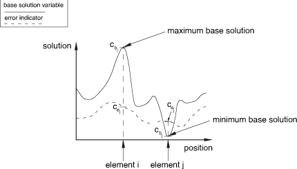
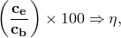
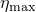
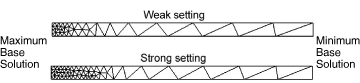
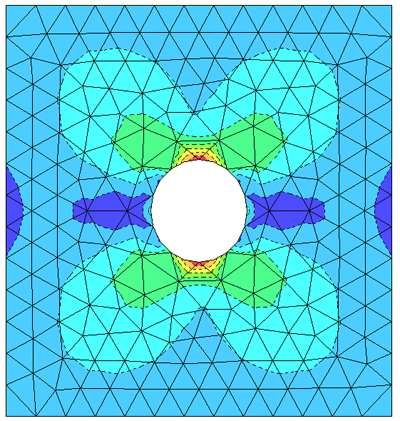
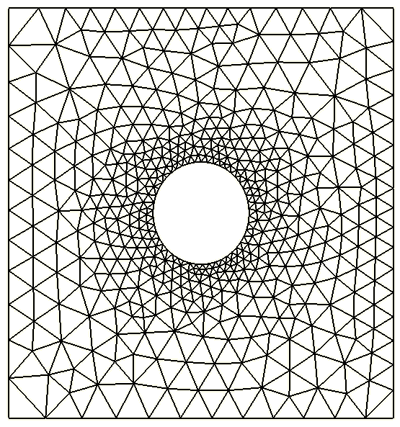

# 12.3.3 Solution-based mesh sizing

**Products: **Abaqus/Standard  Abaqus/CAE  

##### **References**

- ["Adaptive remeshing: overview," Section 12.3.1](pt04ch12s03abo15.md)
- ["Selection of error indicators influencing adaptive remeshing," Section 12.3.2](pt04ch12s03aus84.md)
- ["Understanding ALE adaptive meshing," Section 14.6 of the Abaqus/CAE User's Guide](../usi/usi-link.md#usi-sim-conc-other-adaptmesh)
- ["Advanced meshing techniques," Section 17.14 of the Abaqus/CAE User's Guide](../usi/usi-link.md#usi-mgn-advanced-meshing)

### Overview

Solution-based mesh sizing:
- is performed in Abaqus/CAE; and
- operates on error indicator output variables and your remeshing rule parameters (see ["Creating a remeshing rule," Section 17.21.1 of the Abaqus/CAE User's Guide](../usi/usi-link.md#usi-mgn-adaptivity-rule)) to determine an improved element size distribution for your mesh.

### Basic operation of the sizing method

The sizing method calculates new element sizes during the adaptive remeshing process. Abaqus/CAE applies the sizing method to a field of error indicator variables and their corresponding base solution variables over the region defined by the remeshing rule. The output of a sizing method is a set of scalar sizes located at the nodes in the region defined by the remeshing rule. [Figure 12.3.3--1](pt04ch12s03aus85.md#aadaptivity-sizingmethod) illustrates the sizing operation. [Figure 12.3.3--1](pt04ch12s03aus85.md#aadaptivity-sizingmethod) shows the base solution and error indicator distributions after the first remesh iteration. The sizing method determines that the element size should be reduced in the region of greatest error indicator and increased in the region of the lowest error indicator. The mesh that is generated from these target element sizes is illustrated.

**Figure 12.3.3–1** Sizing method operation and interaction with meshing.

### Characteristics of error indicators

The sizing method and parameter settings that you select have a significant impact on how adaptive remeshing changes the error indicator distribution in your model. You may, for example, choose a sizing method that aggressively reduces error indicators only near a stress riser. In other cases, where the global response of your structure is more important than local effects, you may choose a sizing method that attempts to reduce the error indicators to a uniform level throughout the region. To understand how the sizing methods affect the error indicators, you should first understand typical characteristics of the error indicator variables.

[Figure 12.3.3--2](pt04ch12s03aus85.md#aadaptivity-errordistribution) provides an illustration of an error indicator and corresponding base solution distribution on a generalized slice through a model.

**Figure 12.3.3–2** Error indicator and base solution distribution.

[Figure 12.3.3--2](pt04ch12s03aus85.md#aadaptivity-errordistribution) illustrates the following error indicator characteristics:
- In regions where the value of the base solution is high, such as for element "i" in [Figure 12.3.3--2](pt04ch12s03aus85.md#aadaptivity-errordistribution), error indicator values can be low relative to local values of the base solution. In many cases you may want to use mesh refinement to drive these error indicators even lower.
- In regions where the base solution is low, such as for element "j" in [Figure 12.3.3--2](pt04ch12s03aus85.md#aadaptivity-errordistribution), error indicator values can be high relative to the local values of the base solution. In many cases you may not be interested in obtaining an accurate solution in these regions.

These characteristics can affect your decision on which sizing method to use and what parameters to set in the sizing method.

### Sizing methods

Sizing methods employ the concept of an error target, , which is expressed in a normalized percentage form and which defines a general goal

where  is a measure of the error indicator and  is a measure of the base solution. Based on your definition of the error targets when you created the remeshing rule, Abaqus/CAE creates a size distribution that attempts to meet your error target in the subsequent analysis job using the remeshed model. The specific meaning of an error target depends on your choice of the sizing method.

Abaqus/CAE provides two fundamental sizing methods: **Minimum/maximum control** and **Uniform error distribution**. You can also choose a third method, **Default method and parameters**, which results in Abaqus/CAE choosing one of the fundamental sizing methods for you, based on your choice of error indicator variable.

| **Abaqus/CAE Usage: ** | Mesh module: **Create Remeshing Rule**: **Sizing Method** |
| --- | --- |

#### Minimum/maximum control

The minimum/maximum control method provides the most flexibility in the remeshing of your model. This method has the following characteristics:
- Two error indicator targets for controlling the sizing.  controls the sizing in regions where the base solution (such as stress) is highest, and  controls the sizing in regions where the base solution is lowest.
- A continuous variation in error targets between regions of high and low base solution values, with a bias factor parameter provided to control the variation.
- To avoid excessive refinement at elements with a small base solution, a global averaged element base is chosen when the element base solution is smaller than the global averaged element base.
- If singularities are present in the remeshing rule region, this method will fail to satisfy the error target because the maximum base solution, which occurs at the location of the singularity, is unbounded.

You can either allow Abaqus to choose the targets automatically, or you can specify the error targets. Similarly, you can accept the default bias factor displayed by Abaqus/CAE, or you can specify a qualitative bias factor.

| **Abaqus/CAE Usage: ** | Mesh module: **Create Remeshing Rule**: **Sizing Method**: **Method**: choose **Minimum/Maximum control** |
| --- | --- |

##### Allowing Abaqus/CAE to choose the error targets

If you specify the minimum/maximum error control method without setting error targets, Abaqus/CAE automatically chooses the error targets,  and . Both targets are computed as a fraction of the error indicator result in the previous remesh iteration analysis. Automatic error target reduction is a good choice for mesh refinement studies, where you have no specific error target goal but want to see the impact of mesh refinement on your results.

| **Abaqus/CAE Usage: ** | Mesh module: **Create Remeshing Rule**: **Sizing Method**: **Error Targets**; choose **Automatic error target reduction** |
| --- | --- |

##### Specifying the error targets

As an alternative to automatic error target reduction, you can specify the two error targets,  and . [Figure 12.3.3--2](pt04ch12s03aus85.md#aadaptivity-errordistribution) illustrates these two locations.  is applied to element , and  is applied to element .

Using the value of the two error targets, Abaqus/CAE applies a sizing method that attempts to meet both  and  at their respective locations.

| **Abaqus/CAE Usage: ** | Mesh module: **Create Remeshing Rule**: **Sizing Method**: **Error Targets**; choose **Fixed error targets**; enter the maximum base solution error indicator target, , and the minimum base solution error indicator target,  |
| --- | --- |

##### Bias factor

You can use the bias factor definition in the remeshing rule to further tune the distribution of sizing between maximum and minimum base solution locations. The bias factor defines the gradient of the size distribution between these two extremes in your remesh region, as shown in [Figure 12.3.3--3](pt04ch12s03aus85.md#aadapting-globallocal-targets). 

**Figure 12.3.3–3** The impact of the bias factor on the element size distribution.

You can set this factor between two qualitative extremes, “weak” and “strong.” At the weak extreme, element sizes will increase most quickly at locations moving away from the maximum base solution. At the strong extreme, element sizes will increase most slowly. The default setting is a bias toward the strong extreme.

| **Abaqus/CAE Usage: ** | Mesh module: **Create Remeshing Rule**: **Sizing Method**: **Mesh Bias**; drag the slider to a setting between **Weak** and **Strong** |
| --- | --- |

#### Uniform error distribution

The uniform error distribution method provides a single error indicator target, , for controlling the sizing. Abaqus/CAE applies a sizing method such that the total error in the remeshing rule region is distributed uniformly across all the elements and satisfies the given error indicator target.  This method attempts to satisfy the error indicator target collectively for the whole remeshing rule region but not at every element. Therefore, the presence of singularities will not prevent the adaptivity process from achieving the error target.

| **Abaqus/CAE Usage: ** | Mesh module: **Create Remeshing Rule**: **Sizing Method**: **Method**: choose **Uniform error distribution** |
| --- | --- |

##### Allowing Abaqus/CAE to choose the error target

If you specify the uniform error distribution method without setting an error target, Abaqus/CAE automatically chooses the error target, . The target is computed as a fraction of the error indicator result in the previous remesh iteration analysis. Automatic error target reduction is a good choice for mesh refinement studies, where you have no specific error target goal but want to see the impact of mesh refinement on your results.

| **Abaqus/CAE Usage: ** | Mesh module: **Create Remeshing Rule**: **Sizing Method**: **Error Targets**; choose **Automatic error target reduction** |
| --- | --- |

##### Specifying the error target

As an alternative to the automatic error target reduction, you can specify the single error target, . When you use the uniform error distribution method, Abaqus/CAE compares the error target to a global norm of a normalized form of the error indicator. Such an approach ensures a globally converging mesh within the region.

| **Abaqus/CAE Usage: ** | Mesh module: **Create Remeshing Rule**: **Sizing Method**: **Error Targets**: choose **Fixed error target**; enter the error indicator target,  |
| --- | --- |

#### Default sizing methods and parameters

This method results in application of the **Automatic error target reduction** form of either the **Minimum/maximum control** or **Uniform error distribution** method, with the method applied based on the error indicator variable according to [Table 12.3.3--1](pt04ch12s03aus85.md#usb-anl-aadpsizing-table).

**Table 12.3.3–1** Default sizing method for each error indicator.
| Solution Quantity | Error indicator variable | Default sizing method |
| --- | --- | --- |
| Element energy density | ENDENERI | Uniform error distribution |
| Mises stress | MISESERI | Minimum/maximum control |
| Equivalent plastic strain | PEEQERI | Minimum/maximum control |
| Plastic strain | PEERI | Minimum/maximum control |
| Creep strain | CEERI | Minimum/maximum control |
| Heat flux | HFLERI | Uniform error distribution |
| Electric flux | EFLERI | Minimum/maximum control |
| Electric potential gradient | EPGERI | Minimum/maximum control |

When your remeshing rule refers to multiple error indicators, sizing methods will be applied independently to each error indicator variable with the resulting local size based on the smallest size calculated from each sizing method.

| **Abaqus/CAE Usage: ** | Mesh module: **Create Remeshing Rule**: **Sizing Method**: **Method**: choose **Default methods and parameters** |
| --- | --- |

#### Example: Plate with a circular stress riser

The difference between the basic behavior of the minimum/maximum control and the uniform error distribution methods is illustrated by a simple example. [Figure 12.3.3--4](pt04ch12s03aus85.md#aadaptivity-hole-iter0) shows the stress result for a simple loading of a plate with a hole.

**Figure 12.3.3–4** Initial mesh and Mises stress distribution for a plane stress plate with a hole, subjected to a uniform horizontal boundary traction.

##### Minimum/maximum control

[Figure 12.3.3--5](pt04ch12s03aus85.md#aadaptivity-hole-minmax1) illustrates the adaptive mesh that was generated by Abaqus/CAE when the user selected the minimum/maximum control method and specified the two error targets ( and ). In this example =5% and =1%, and the mesh bias is set to the default setting. These settings result in a mesh that focuses tightly around the hole, the stress riser, while transitioning smoothly to a relatively coarse mesh away from the hole.

**Figure 12.3.3–5** Adaptive remesh resulting from the minimum/maximum control sizing method.

##### Uniform error distribution

[Figure 12.3.3--6](pt04ch12s03aus85.md#aadaptivity-hole-uniform1) illustrates the adaptive mesh that was generated by Abaqus/CAE when the user selected the uniform error distribution method and specified the single uniform error indicator target (). In this example =1%. This setting results in a mesh that focuses around the hole, the stress riser, while also refining the mesh in less stressed regions.

**Figure 12.3.3–6** Adaptive remesh resulting from the uniform error distribution sizing method.

### Impact of additional remeshing rule settings

You specify the sizing method when you create a remeshing rule, and the sizing method calculates new element sizes during the adaptive remeshing process. However, the following additional settings in the remeshing rule can affect the mesh generated by Abaqus/CAE, regardless of the sizing method that you selected:
- region selection,
- step and frame selection,
- size constraints,
- approximate maximum number of elements, and
- refinement and coarsening rate factors.

#### Region selection

Sizing methods are defined across sets of elements, corresponding to the regions over which the remeshing rules were applied in Abaqus/CAE. Within each set of elements, Abaqus/CAE applies the sizing operation to the error indicator variables specified in the remeshing rule. The results of the sizing operation are based on the extrapolation of whole element calculations to the nearest nodes, and the results are node based.

| **Abaqus/CAE Usage: ** | Mesh module: **Create Remeshing Rule**: **Edit Region** |
| --- | --- |

#### Step and frame selection

Abaqus applies sizing operations to error indicator variables from only the last available frame in a specified step. See ["Error indicator characteristics" in "Selection of error indicators influencing adaptive remeshing," Section 12.3.2](pt04ch12s03aus84.md#usb-anl-aadperrorindicators-choosing), for a discussion of how your selection of the step, frame, and error indicator can affect your ability to capture the response in transient analyses.

| **Abaqus/CAE Usage: ** | Mesh module: **Create Remeshing Rule**: **Step and Indicator**: **Step**; select the step to which the rule is applied |
| --- | --- |
|  | and Mesh module: **Create Remeshing Rule**: **Step and Indicator**: **Output Frequency**; choose either **Last increment of step** or **All increments of step** |

#### Size constraints

When you create the remeshing rule, you can constrain the sizing operation from specifying elements greater than or less than size constraints that you define for the remesh rule region. Abaqus/CAE provides default settings for these constraints. 
- The default minimum element size constraint is 1% of the default boundary seed size for the part instance to which the remeshing rule is applied.
- The default maximum element size constraint is 10 times the default boundary seed size for the part instance to which the remeshing rule is applied.

| **Abaqus/CAE Usage: ** | Mesh module: **Create Remeshing Rule**: **Constraints**: **Element Size** |
| --- | --- |

#### Approximate maximum number of elements

For a remeshing rule you can specify an approximate limit for the maximum number of elements. By using this constraint, you can control the cost of your analysis and ensure that unreasonably large meshes are not created. If the target error requires more elements than the specified limit when this constraint is defined, Abaqus/CAE will reduce the target error internally so that the generated elements approximately satisfy the specified element count. The use of this constraint may prevent an adaptivity process from achieving the error targets. By default, this constraint is not active.

| **Abaqus/CAE Usage: ** | Mesh module: **Create Remeshing Rule**: **Constraints**: **Approximate maximum number of elements** |
| --- | --- |

#### Refinement and coarsening rate factors

The refinement and coarsening factors that you specify define a constraint on the mesh size in terms of iteration to iteration changes to the mesh. These factors modulate the aggressivity of the sizing methods. The refinement factor controls the refinement of the mesh or the introduction of smaller elements. The coarsening factor controls the coarsening of the mesh or the introduction of larger elements. Abaqus/CAE provides default settings for these rate factors, which are designed to prevent excessive coarsening or prohibitively expensive refinement in a single remesh iteration.

The refinement factor can have a significant effect on the convergence of the adaptive meshing procedure. Once you have settled on sizing method parameters that work well for your application, you may be able to achieve faster and more efficient mesh convergence by increasing the refinement factor. In cases where your adaptivity process is not converging well, however, an increased refinement factor could result in an excessive increase in elements in a remesh iteration.

| **Abaqus/CAE Usage: ** | Mesh module: **Create Remeshing Rule**: **Constraints**: **Rate Limits** |
| --- | --- |

### Reconciling overlapping remeshing rules

Abaqus/CAE imposes no restrictions on the region or the steps associated with your remeshing rules. You can apply multiple remeshing rules and, hence, sizing functions to the same region at the same time. Similarly, you can specify remeshing rules that overlap one another. When Abaqus/CAE generates the new mesh, it considers all of the remeshing rules at all of the locations and uses the smallest calculated element size to drive the meshing algorithm.

