# 13.2.1 Design responses

**Product: **Abaqus/CAE  

##### **References**

- ["Structural optimization: overview," Section 13.1.1](pt04ch13s01abo16.md)
- ["Configuring design responses," Section 18.7 of the Abaqus/CAE User's Guide](../usi/usi-link.md#usi-opz-designresponsedit)

### Overview

A design response: 
- is a single scalar value, such as the volume of your structure;
- is calculated by the Optimization Module by reading results and model data from the output database file;
- can be referred to from objective functions and constraints (for example, you can create an objective function that tries to minimize the displacement at a node or a constraint that forces the weight of the structure to be reduced by at least 50%); and
- is available only for certain analysis procedures (for example, you must perform an eigenvalue extraction analysis if you select a design response that tries to maximize the lowest eigenfrequencies).

### Design response operators

You must specify the operation that the Optimization Module will use to arrive at a single scalar value for the design response, although some restrictions apply. For example, a volume design response can only use the sum of the volume within the design area. A design response that calculates the von Mises stress must use the maximum value of the stress within a region of the model. (None of the operators are relevant when the Optimization Module calculates a dynamic frequency design response.) The following design response operators are provided by the Optimization Module:

**Minimum or maximum**: The minimum or maximum value within the selected region. The Optimization Module allows only the maximum operator for stress, contact stress, and strain design responses.

**Sum**: The sum of all the values within the selected area. The Optimization Module allows only the sum operator for volume, weight, moment of inertia, and gravity design responses.

### Design responses for condition-based topology optimization

The Optimization Module provides strain energy and volume design responses for condition-based topology optimization.

#### Strain energy

The compliance of a structure is a measure of its overall flexibility or stiffness and is defined as the sum of the strain energy of all the elements, 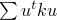 for linear models, where  is the displacement vector and  is the global stiffness matrix. Compliance is the reciprocal of stiffness, and minimizing the compliance is equivalent to maximizing the global stiffness. If a load case is driven by forces or pressures, you should choose to minimize the strain energy to maximize the global stiffness. However, if a load case is driven by a thermal field, strain energy decreases when the optimization modifies the structure to make it softer. As a result, you should always choose to maximize the strain energy because attempting to minimize the strain energy can result in a stiff structure. In addition, you should always choose to maximize the strain energy if prescribed displacements are applied to your model.

Topology optimization considers the total strain energy for all of the elements; therefore, if you choose strain energy as an objective function, you must apply the objective to the entire model. You cannot use strain energy as a constraint in your optimization.

| **Abaqus/CAE Usage: ** | Optimization module: ****Task*****condition-based topology task*****, ****Design Response****Create****: **Single-term**, **Variable** **Strain energy** |
| --- | --- |

#### Volume

The volume is defined as the sum of the volume of the elements in the design area, 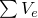, where 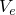 is the element volume. During a topology optimization, the elements are scaled with the current relative density defined in your Abaqus model. For most optimization problems, you must apply a volume constraint. For example, if you are trying to minimize the strain energy (maximize the stiffness) and do not apply a volume constraint, the Optimization Module simply fills the entire design area with material.

| **Abaqus/CAE Usage: ** | Optimization module: ****Task*****condition-based topology task*****, ****Design Response****Create****: **Single-term**, **Variable:** **Volume** |
| --- | --- |

### Design responses for general and sizing topology optimization

The Optimization Module provides center of gravity, displacement, rotation, eigenfrequency, energy stiffness, moment of inertia, internal and reaction forces and moments, strain energy, volume, and weight design responses for general and sizing topology optimization. In addition, the Optimization Module provides a stress design response for general topology optimization.

#### Center of gravity

You can use the center of gravity of a selected region as a design response in an optimization. You can choose the center of gravity in the three principal directions: 

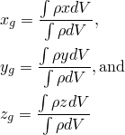

When the Optimization Module calculates the center of gravity, the elements are scaled with the current relative density defined in your Abaqus model. 

For example, you might want to constrain the center of gravity in the *Y*-direction so that it remains within a minimum and maximum range during the optimization. The design response can consider the center of gravity of the whole model or a region of the model. 

If you select a local coordinate system, the Optimization Module uses both the direction of the axes and the position of the origin to recalculate the center of gravity. The Optimization Module applies the global coordinate system if you do not select a local coordinate system. 

When the Optimization Module calculates the center of gravity, it treats shell and membrane regions as three-dimensional regions by applying the thickness of the region. The Optimization Module calculates the center of gravity using only the element types that are supported by topology optimization. As a result, the center of gravity calculated by the Optimization Module might not be the same as the center of gravity calculated by Abaqus/Standard or Abaqus/Explicit; for example, if your model contains wire regions.

| **Abaqus/CAE Usage: ** | Optimization module: ****Task*****general topology or sizing task*****, ****Design Response****Create****: **Single-term**, **Variable:** **Center of gravity** |
| --- | --- |

#### Displacement and rotation

In most optimization problems you will use displacement and/or rotation to define your objective function or constraints. For example, the maximum displacement of a vertex could be either an objective or a constraint of an optimization. The performance of the optimization is improved if you apply displacements and rotations to only vertices or to small regions. In addition, performance is improved if you assign regions that are used to define displacements or reactions as frozen regions (the Optimization Module will not remove elements from frozen regions during the optimization).

[Table 13.2.1--1](pt04ch13s02aus87.md#usb-anl-aoptdesignresponses-gentop-disp) lists the available displacement and rotation variables.

**Table 13.2.1–1** Displacement and rotation variables for a general and sizing topology optimization.
|  | Displacement | Rotation |
| --- | --- | --- |
| *i*-direction |  | 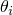 |
| Absolute | 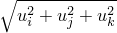 | 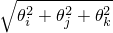 |
| Absolute in *i*-direction | 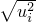 |  |

| **Abaqus/CAE Usage: ** | Optimization module: ****Task*****general topology or sizing task*****, ****Design Response****Create****: **Single-term**, **Variable:** **Displacement** |
| --- | --- |

#### Energy stiffness measure

The energy stiffness is a measure that has no physical meaning but can be used as an objective function or a constraint in a general topology or sizing optimization to optimize the stiffness of a structure that is subjected to both external loading and prescribed displacements. 

To optimize the stiffness of a structure with only external loading, the strain energy should be minimized: 

where  is the external loading and  is the resulting deflection of the loaded nodes. If only external loading is present, the energy stiffness measure is equal to the total strain energy, also called the compliance.

In contrast, if a load case is driven by prescribed displacements, the elastic energy, or compliance, will decrease only if the structure is made softer. To optimize a structure with only prescribed displacements, the strain energy should be maximized:

where  is the prescribed displacement at the nodes and  is the resulting reaction force at the displaced nodes. If only prescribed displacements are present, the energy stiffness measure is equal to the negative of the total strain energy.

The strain energy with both external loads and prescribed displacements is given as

The energy stiffness measure is used only for optimization (it has no physical meaning) and is given as

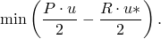

You cannot use the energy stiffness measure as a design response in a model that is experiencing thermal loading or mass-dependent loading, such as gravity. An energy stiffness design response must be applied to the entire model. When energy stiffness is used as an objective function, you must select a target that tries to minimize the sum of the weighted differences between the design response and the reference value, regardless of whether an external load and/or prescribed displacements are being applied to the structure. 

| **Abaqus/CAE Usage: ** | Optimization module: ****Task*****general topology or sizing task*****, ****Design Response****Create****: **Single-term**, **Variable:** **Energy stiffness measure** |
| --- | --- |

#### Modal eigenfrequency analysis

Modal eigenvalues are the simplest dynamic responses in structural analysis. Typical uses of data from an eigenfrequency analysis during a topology optimization include the following:
- maximize the lowest eigenfrequencies,
- maximize a selected eigenfrequency,
- constrain an eigenfrequency to be higher or lower than a given value,
- maximize or minimize an eigenfrequency at a certain mode, and
- perform a bandgap optimization that force modes away from a certain frequency.

The Optimization Module supports two approaches for optimizing the eigenfrequencies:
- single eigenfrequencies from modal analysis and
- the Kreisselmaier-Steinhauser formulation.

The Kreisselmaier-Steinhauser formulation is the more efficient of the two approaches and should be used whenever possible. The only advantage of optimizing single eigenfrequencies is that you can use the sum of the eigenfrequencies as a constraint in a general topology or sizing optimization, which you cannot do with the Kreisselmaier-Steinhauser formulation. 

When you are trying to maximize the lowest eigenfrequency, it is recommended that you consider not only the first eigenfrequency but also at least the next two highest natural frequencies. During the optimization, the various natural frequencies are weighted by their distance from the lowest natural frequency—the closer a natural frequency approaches the first natural frequency during the optimization, the more it is weighted. You should use the Kreisselmaier-Steinhauser eigenvalue formulation if you are trying to maximize the lowest eigenfrequency or, in particular, if you are trying to maximize more than one of the lowest eigenfrequencies. You do not need to use mode tracking if you are using the Kreisselmaier-Steinhauser formulation to maximize the lowest eigenfrequency, but you should use mode tracking for the higher modes because the modes might switch. For example, while the model is being optimized, the frequency of the first mode is maximized and the second eigenmode can become the mode with the lowest frequency. 

| **Abaqus/CAE Usage: ** | Optimization module: ****Task*****general topology or sizing task*****, ****Design Response****Create****: **Single-term**, **Variable:** **Eigenfrequency from modal analysis** or **Eigenfrequency calculated with Kreisselmaier-Steinhauser formula** |
| --- | --- |

#### Moment of inertia

You can use a moment of inertia design response in an optimization to minimize the rotational inertia about a selected axis. You can use the sum of the moment of inertia of the whole model or a region of the model as an objective function or a constraint in a general topology or sizing optimization. 

You can choose the moment of inertia in the three principal directions or the three principal planes: 

If you select a local coordinate system, the Optimization Module uses the direction of the axes to recalculate the center of gravity. The Optimization Module applies the global coordinate system if you do not select a local coordinate system. 

When the Optimization Module calculates the moment of inertia, it treats shell and membrane regions as three-dimensional regions by applying the thickness of the region. The Optimization Module calculates the moment of inertia using only the element types that are supported by topology optimization. As a result, the moment of inertia calculated by the Optimization Module might not be the same as the moment of inertia calculated by Abaqus/Standard or Abaqus/Explicit; for example, if your model contains beam or truss elements (wire regions in Abaqus/CAE).

The moment of inertia with respect to any two orthogonal axes is zero if you have selected either of the axes to be an axis of symmetry.

| **Abaqus/CAE Usage: ** | Optimization module: ****Task*****general topology or sizing task*****, ****Design Response****Create****: **Single-term**, **Variable:** **Moment of inertia** |
| --- | --- |

#### Internal forces and moments

You can use nodal internal forces and moments of the whole model or a region of the model as an objective function or a constraint in a general topology or sizing optimization. 

[Table 13.2.1--2](pt04ch13s02aus87.md#usb-anl-aoptdesignresponses-gentop-iforce) lists the available nodal internal force and moment variables.

**Table 13.2.1–2** Nodal internal force and moment variables for a general and sizing topology optimization for the elements *e* attached to the nodes *i*.
|  | Nodal internal force | Nodal internal moment |
| --- | --- | --- |
| *i*-direction | 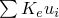 |  |
| Absolute |  |  |
| Absolute in *i*-direction |  |  |

You must use the global coordinate system with an absolute internal force or with absolute internal moment. Your structure must have stiffness in the direction of the force used in the optimization; otherwise, the internal force will be zero in this direction.

| **Abaqus/CAE Usage: ** | Optimization module: ****Task*****general topology or sizing task*****, ****Design Response****Create****: **Single-term**, **Variable:** **Internal force** or **Internal moment** |
| --- | --- |

#### Reaction forces and moments

Nodal reaction forces and moments can be used as a design response only in general and sizing topology optimization. As with displacements, the performance of the optimization is improved if you apply reaction forces or moments to only vertices or to small regions and assign those regions as frozen regions (the Optimization Module will not remove elements during the optimization).

[Table 13.2.1--3](pt04ch13s02aus87.md#usb-anl-aoptdesignresponses-gentop-rforce) lists the available nodal reaction force and moment variables.

**Table 13.2.1–3** Nodal reaction force and moment variables for a general and sizing topology optimization for the elements *e* attached to the nodes *i*.
|  | Nodal reaction force | Nodal reaction moment |
| --- | --- | --- |
| *i*-direction |  |  |
| Absolute |  |  |
| Absolute in *i*-direction |  |  |

You cannot use a reference coordinate system with an absolute reaction force or with an absolute reaction moment. Your structure must have stiffness in the direction of the force used in the optimization; otherwise, the reaction force will be zero in this direction.

| **Abaqus/CAE Usage: ** | Optimization module: ****Task*****general topology and sizing task*****, ****Design Response****Create****: **Single-term**, **Variable:** **Reaction force** or **Reaction moment** |
| --- | --- |

#### Strain energy

The compliance of a structure is a measure of its overall stiffness and is defined as the sum of the strain energy of all the elements,  for linear models, where  is the displacement vector and  is the global stiffness matrix. Compliance is the reciprocal of stiffness, and minimizing the compliance is equivalent to maximizing the global stiffness. If a load case is driven by a thermal field, strain energy decreases when the structure is made softer. As a result, attempting to minimize strain energy can result in a stiff structure. In addition, you should always choose to maximize the strain energy if prescribed displacements are applied to your model.

Topology optimization considers the total strain energy for all of the elements; therefore, if you choose strain energy as an objective function, you must apply the objective to the entire model.

| **Abaqus/CAE Usage: ** | Optimization module: ****Task*****general topology or sizing task*****, ****Design Response****Create****: **Single-term**, **Variable:** **Strain energy** |
| --- | --- |

#### Scaled centroidal von Mises stress

You can use the scaled element centroidal von Mises stress of the whole model or a region of the model as an objective function or as a constraint in a general topology optimization. You must avoid regions with stress singularities caused by external loads or boundary conditions.

The scaled element centroidal von Mises stress is defined as

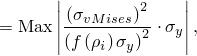

where 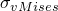 is the element centroidal von Mises stress, 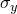 is the reference stress, and  is a factor for interpolating the stresses of elements that have a reduced current relative density because of the topology optimization. The weighting factor and the interpolation are required for convergence during the optimization.

The von Mises stress is calculated at the centroid of the element to avoid stress singularities that might be present in the initial model or might appear in an optimized structure before it is smoothed. You cannot compare the scaled element centroidal von Mises stress with the von Mises stress calculated by Abaqus. The two measures are equal only when the element is solid and has a relative density of 1.0.

You can provide the reference stress when you create the objective function, or the Optimization Module can calculate the reference stress during the initial optimization iteration. If you provide the reference stress, the value should not be too low or numerical singularities will result. The reference stress is given as 

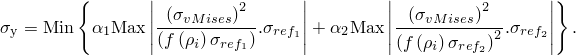

You can define multiple load cases for the scaled element centroidal von Mises stress measure. Static linear analysis is supported. Static nonlinear analysis supports only contact nonlinearities. Nonlinear materials and geometrical nonlinearities, such as large deformations, are not supported.

| **Abaqus/CAE Usage: ** | Optimization module: ****Task*****general topology task*****, ****Design Response****Create****: **Single-term**, **Variable:** **Stress** |
| --- | --- |

#### Volume

The volume is defined as the sum of the volume of all the elements in the design area, , where  is the element volume. For most optimization problems, you must apply a volume constraint. For example, if you are trying to minimize the strain energy (maximize the stiffness) and do not apply a volume constraint, the Optimization Module simply fills the design area with material.

| **Abaqus/CAE Usage: ** | Optimization module: ****Task*****general topology or sizing task*****, ****Design Response****Create****: **Single-term**, **Variable:** **Volume** |
| --- | --- |

#### Weight

The weight is defined as the sum of the weight of all the elements in the design area, , where 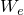 is the element weight. The Optimization Module scales elements using the current relative density. For most optimization problems, you must apply either a volume or a weight constraint. Using weight instead of volume allows you to constrain the optimized model to a specified physical weight. The Optimization Module uses only supported element types when calculating the weight.

| **Abaqus/CAE Usage: ** | Optimization module: ****Task*****general topology or sizing task*****, ****Design Response****Create****: **Single-term**, **Variable:** **Weight** |
| --- | --- |

### Design responses for shape optimization

The Optimization Module provides eigenfrequency, stress, contact stress, strain, nodal strain energy density, and volume design responses for shape optimization. Only a volume design response can be used to define a constraint; all other design responses are used to define objective functions. 

#### Eigenfrequency from the Kreisselmaier-Steinhauser formulation

You should use the Kreisselmaier-Steinhauser formulation of the eigenvalues as an objective function in a shape optimization if you are trying to maximize the first eigenfrequency or, in particular, if you are trying to maximize more than one of the first eigenfrequencies. You do not need to use mode tracking if you are using the Kreisselmaier-Steinhauser formulation of the eigenvalues.

| **Abaqus/CAE Usage: ** | Optimization module: ****Task*****shape task*****, ****Design Response****Create****: **Single-term**, **Variable:** **Eigenfrequency calculated with Kreisselmaier-Steinhauser formula** |
| --- | --- |

#### Stress and contact stress

Equivalent stresses are the most commonly used objective function of a shape optimization. All of the stress values that are calculated by the Optimization Module, whether nodal or from Gauss points or elements, are interpolated to the nodes. For example, you can try to optimize your model with an objective function that tries to minimize the maximum von Mises stresses in a region with stress concentrations or tries to minimize contact pressure in a region with contact. The Optimization Module considers only the maximum value of an equivalent stress within a region. The Optimization Module issues warnings for nodes that do not have the appropriate stress values. For example, if you select an objective response of contact stress, the Optimization Module issues warnings about nodes of elements that are not in contact. If your Abaqus model contains multiple load cases, the design response is evaluated by summing the stress values from each load case.

You can choose from the following equivalent stresses:
- von Mises
- Maximum principal and absolute maximum principal
- Minimum principal and absolute minimum principal
- Second principal
- Beltrami
- Drucker Prager
- Galilei
- Kuhn
- Mariotte
- Sandel
- Sauter
- Tresca

You can choose from the following equivalent contact stresses:- Contact stress pressure
- Total shear contact stress
- Shear contact stress in the 1-direction
- Shear contact stress in the 2-direction
- Total contact stress

You can create a design response that uses stress or contact stress only in shape optimization, and it can be used only as an objective function. 

| **Abaqus/CAE Usage: ** | Optimization module: ****Task*****shape task*****, ****Design Response****Create****: **Single-term**, **Variable:** **Stress** or **Contact stress** |
| --- | --- |

#### Strain

If your model is undergoing large deformations, a measure of the stress is not always a good indicator of the model's response. For example, a structure undergoing plastic deformation will, for an ideal plastic material, experience a large constant stress over the plastic area. In these circumstances a measure of the strain is a more reliable indicator of the model's response. You can choose from the following equivalent strains:
- Elastic
- Plastic
- Total (the sum of the elastic and plastic)

You can create a design response that uses strain only in shape optimization, and it can be used only as an objective function. 

| **Abaqus/CAE Usage: ** | Optimization module: ****Task*****shape task*****, ****Design Response****Create****: **Single-term**, **Variable:** **Strain** |
| --- | --- |

#### Nodal strain energy density

The nodal strain energy density, , is a local point-wise strain energy that can provide a better representation of failure than stresses in nonlinear materials.

| **Abaqus/CAE Usage: ** | Optimization module: ****Task*****shape task*****, ****Design Response****Create****: **Single-term**, **Variable:** **Strain energy density** |
| --- | --- |

#### Volume

Volume is the only constraint allowed for a shape optimization. The volume is defined as the sum of the volume of all the elements in the design area, , where  is the element volume. 

For most optimization problems, you must apply a volume constraint to a region of your model. For example, if you are trying to minimize the strain energy (maximize the stiffness) and do not apply a volume constraint, Abaqus simply fills the design area with material.

| **Abaqus/CAE Usage: ** | Optimization module: ****Task*****shape task*****, ****Design Response****Create****: **Single-term**, **Variable:** **Volume** |
| --- | --- |

### Operating on design responses

You can define a design response that is a combination of the single values generated by multiple design responses; for example, you can add values or find the maximum of several values. You can also define a design response that is the result of an operation on another design response; for example, the difference between the value of the design response at different nodes.

For example, you can create two design responses that correspond to the displacement in the 1-direction of two selected vertices. Alternatively, you can create a design response that is the difference between the displacement in the 1-direction of two selected vertices. You can then define a constraint that forces the design response to be close to zero. In effect, the constraint forces the two selected vertices to move together in the 1-direction.

| **Abaqus/CAE Usage: ** | Optimization module: ****Design Response****Create****: **Combined-term** |
| --- | --- |

#### Additional references

- Bakhtiary, N., P. Allinger, M. Friedrich, F. Mulfinger, J. Sauter, O. Mller, and J. Puchinger, "A New Approach for Size, Shape and Topology Optimization," SAE International Congress and Exposition, Detroit, Michigan, USA, February 26--29, 1996.
- Bendse, M. P., E. Lund, N. Ohloff, and O. Sigmund, "Topology Optimization - Broadening the Areas of Application," Control and Cybernetics, vol. 34, pp. 7--35, 2005.
- Bendse, M. P., and O. Sigmund, *Topology Optimization: Theory, Methods and Applications, *Springer-Verlag, Berlin Heidelberg New York, 2003.
- Bendse, M. P., and O. Sigmund, "Material Interpolations in Topology Optimization," Archive of Applied Mechanics, vol. 69, pp. 635--654, 1999.
- Clausen, P. M., and C. B. W. Pedersen, Non-Parametric Large Scale Structural Optimization, ECCM 2006 III European Conference on Computational Mechanics, Lisbon, Portugal, June 5--9, 2006.
- Cook, R. D., D. S. Malkus, and M. E. Plesha, *Concepts and Applications of Finite Element Analysis, *John Wiley & Sons Inc., 1989.
- Hansen, L. V., "Topology Optimization of Free Vibrations of Fiber Laser Packages," Structural and Multidisciplinary Optimization, vol. 29(5), pp. 341--348, 2005.
- Olhoff, N., and J. Du, Topology Optimization of Vibrating Bi-Material Plate Structures with Respect to Sound Radiation, IUTUAM Symposium on Topological Design Optimization of Structures, Machines and Materials: Status and Perspectives, M. P. Bendse, N. Olhoff, and O. Sigmund, eds., pp. 147--156, Springer, 2006.
- Pedersen, C. B. W., and P. Allinger, Industrial Implementation and Applications of Topology Optimization and Future Needs, IUTUAM Symposium on Topological Design Optimization of Structures, Machines and Materials: Status and Perspectives, M. P. Bendse, N. Olhoff, and O. Sigmund, eds., pp. 147--156, Springer, 2006.
- Sigmund, O., and J. S. Jensen, "Systematic Design of Phononic Band Gap Materials and Structures by Topology Optimization," Philosophical Transactions of the Royal Society: Mathematical, Physical and Engineering Sciences, vol. 361, pp. 1001--1019, 2003.
- Stolpe, M., and K. Svanberg, "An Alternative Interpolation Scheme for Minimum Compliance Optimization," Structural and Multidisciplinary Optimization, vol. 22, pp. 116--124, 2001.
- Svanberg, K., "The Method of Moving Asymptotes---A New Method for Structural Optimization," International Journal for Numerical Methods in Engineering, vol. 24, pp. 359--373, 1987.

