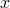
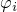
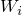
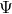
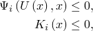
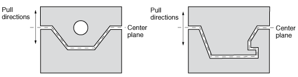

# 13.2.2 Objectives and constraints

**Product: **Abaqus/CAE  

##### **References**

- ["Structural optimization: overview," Section 13.1.1](pt04ch13s01abo16.md)
- ["Creating objective functions," Section 18.8 of the Abaqus/CAE User's Guide](../usi/usi-link.md#usi-opz-objectivefunctionedit)
- ["Creating constraints," Section 18.9 of the Abaqus/CAE User's Guide](../usi/usi-link.md#usi-opz-constraintedit)
- ["Configuring geometric restrictions," Section 18.10 of the Abaqus/CAE User's Guide](../usi/usi-link.md#usi-opz-geomrestrictedit)
- ["Creating local stop conditions," Section 18.11 of the Abaqus/CAE User's Guide](../usi/usi-link.md#usi-opz-stopconditionedit)

### Overview

For an optimization problem:
- an objective function defines the objective of the optimization;
- a constraint imposes limitations on the optimization and defines a feasible design;
- geometric restrictions impose limitations on the topology or shape of the structure that can be generated by the optimization; and
- stop conditions define when an optimization task is considered complete.

### Objective functions

 Objective functions define the objective of the optimization. An objective function is a single scalar value that is formulated from a set of design responses. For example, if the design responses are defined from the strain energy of the nodes in a region, the objective function could minimize the sum of the design responses; i.e., minimize the sum of the strain energy, in effect maximizing the stiffness of the region. 

An optimization problem can be stated as: 

where  is the objective function that depends on the state variables, , and the design variables, . 

The formula for the objective function that tries to minimize  design responses can be stated as:

where each design response, , is given a weight, , and a reference value, . The formula for the objective function that tries to maximize  design responses can be stated as:

The default weighting factor is 1.0. For a topology optimization the default reference value is 0.0; for shape and sizing optimization the default reference value is calculated by the Optimization Module. For the most common optimization problems you do not need to change the default values of the weighting factor and the reference value. However, in some cases you may have to change the weighting factor to balance the effect of an objective function that is dominating the optimization. You should be aware that changing the weighting factor can have a significant impact on the final design. In addition, a design response that is dominant at the start of the optimization may have less effect as the Optimization Module modifies your model.

An objective function that tries to minimize the maximum design response is an important optimization formulation. During each design cycle the Optimization Module first determines which of the set of weighted design responses has the maximum value and then tries to minimize that design response. In many problems, minimizing the maximum design response provides a satisfactory solution because it reduces the maximum of a number of design responses. For example, if your design responses are defined from the stress in multiple regions of your model, minimizing the maximum design response attempts to minimize the stress in the region that is exhibiting the maximum stress. The formula can be stated as:

The design responses provided with the Optimization Module are listed in ["Design responses," Section 13.2.1](pt04ch13s02aus87.md).

#### Defining the target of an objective function

The target of an objective function can be minimized or maximized. Alternatively, the target of an objective function can be set to minimize the maximum, such that the design response targets the maximum value, and the objective attempts to minimize that maximum value. In all cases, the weighting and reference values of the design responses are accounted for.

| **Abaqus/CAE Usage: ** | Optimization module: ****Objective Function****Create****: **Target** |
| --- | --- |

### Constraints

As outlined in the previous section, an optimization problem can be stated as: 

where  is the objective function that depends on the state variables, , and the design variables, . Constraints, , can be applied to the optimization problem, and constraints, , can be applied to the design variables:

where  and  is the design response that is constrained by the value . In addition, , where  is an expression for the layout of the design variables, such as manufacturability, and  is the constraint on the design variables.

The Optimization Module can arrive at a solution that optimizes the objective function; however, if the constraints are not satisfied, the result of the optimization may not be a feasible design. A constraint is based on a design response and, similar to a design response, is formulated from a single scalar value. Most optimizations have constraints that prevent the optimization from arriving at a trivial solution. For example, if you are trying to maximize the stiffness of a structure, the Optimization Module will simply fill the entire design area if you do not apply any constraints. However, if you apply a weight constraint that limits the weight to 50% of its initial value, the Optimization Module is forced to seek an optimum solution that both optimizes the stiffness objective and satisfies the weight constraint. You can apply only volume constraints to both topology optimization and to shape optimization; you cannot use volume as an objective function. You cannot apply multiple constraints of the same type, such as volume, to the whole model or to a single region. 

| **Abaqus/CAE Usage: ** | Optimization module: ****Constraint****Create**** |
| --- | --- |

#### Applying constraints to regions

You can apply different constraints to different regions of your model. In addition, those regions can have different material properties or a material property can vary within a region. When the Optimization Module calculates the design response, it considers varying material properties within the region. You cannot apply multiple volume constraints to the whole model or to a single region. 

### Geometric restrictions

Geometric restrictions are constraints that are applied directly to the design variables. Geometric restrictions allow you to model design limitations and manufacturing limitations. 

#### Defining a frozen area

You can specify that a region within the optimization region is excluded from the optimization by freezing the region. For example, you could exclude a circular shaft that forms a bearing surface or a boss that is used to attach the structure to a rigid surface. You must freeze regions that are used to apply prescribed conditions. To simplify this operation, you can request that the Optimization Module automatically freeze regions that are used to apply prescribed conditions and loads when you create an optimization process.

| **Abaqus/CAE Usage: ** | Optimization module: ****Geometric Restriction****Create****: **Frozen area** |
| --- | --- |

#### Specifying minimum and maximum member size

In most cases you should try to avoid the generation of thin trusses in the structure by defining a minimum member size. However, the Optimization Module cannot ensure that the optimized structure will not contain regions with a diameter that is smaller than the minimum member size. The minimum member size must be larger than the average element edge length. The maximum member size must be larger than twice the element length; otherwise, the optimization algorithm may experience issues with element connectivity. A coarse mesh and a fine mesh lead to an optimization with the topological equivalent result if you specify the same minimum member size for both cases. The Optimization Module will not generate a thin region where prescribed conditions have been applied to the structure. Removing material from these regions may result in the structure collapsing. 

If your structure will be cast, you may want to avoid the generation of overly thick parts by specifying a region with a maximum member size. The optimization process will avoid creating a thick region by generating several thinner regions. You do not need to specify both a maximum and a minimum member size. The Optimization Module assumes the value that you enter for the maximum member size also applies to the minimum member size and will generate trusses of the specified size. The combination of a maximum member size constraint with a restraint that imposes a pull direction, such as a moldable or stampable manufacturing constraint, is allowed only for a general topology optimization. (The “pull direction” is the direction in which the two halves of a mold separate or the direction in which a stamping tool moves.)

Computational time increases significantly when you specify regions with a minimum or maximum member size. Therefore, you should apply the member size restrictions only to regions where thin or thick members must be avoided. You should run an optimization without member size restrictions to identify such regions. 

| **Abaqus/CAE Usage: ** | Optimization module: ****Geometric Restriction****Create****: **Member size** |
| --- | --- |

#### Applying manufacturing restrictions

The topology optimization process always creates a structural layout that satisfies the objective function and the constraints; however, the design may be impossible to create using standard manufacturing techniques, such as casting and forging. You can apply geometric restrictions that force the topology optimization process to consider only designs that can be manufactured. For example, when you are using topology optimization you can force the Optimization Module to create a castable shape that can be extracted from a mold or a stampable shape that can be created with a tool and die.

##### Maintaining a moldable structure

In cases where bending and torsion loads are applied, topology optimization is likely to generate a model with hollow areas or with undercuts that cannot be manufactured. You can prevent the topology optimization from generating cavities and undercuts by specifying the following:
- A forgeable structure that can be removed from the forging die, as shown in [Figure 13.2.2--1](pt04ch13s02aus88.md#aoptimization-geomrest-forge-nls). **Figure 13.2.2--1** A forgable part. 
- A moldable structure that can be removed from two halves of a mold, as shown in [Figure 13.2.2--2](pt04ch13s02aus88.md#aoptimization-geomrest-demold-nls). **Figure 13.2.2--2** A moldable part.  In contrast, [Figure 13.2.2--3](pt04ch13s02aus88.md#aoptimization-geomrest-nodemold-nls) illustrates parts with a cavity and an undercut that are not moldable. **Figure 13.2.2--3** Cavities and undercuts prevent a part from being moldable. 

| **Abaqus/CAE Usage: ** | Optimization module: ****Geometric Restriction****Create****: **Demold control**; **Demold technique**, **Demolding with a central plane** |
| --- | --- |
|  | Optimization module: ****Geometric Restriction****Create****: **Demold control**; **Demold technique**, **Demolding at the region surface** Optimization module: ****Geometric Restriction****Create****: **Demold control**; **Demold technique**, **Forging** |

##### Maintaining a stampable structure

You can specify that the structure is to be manufactured by a stamping process. If the optimization process removes one element from the structure, it also removes all elements positioned either behind or in front of the element (with respect to the pull direction), as shown in [Figure 13.2.2--4](pt04ch13s02aus88.md#aoptimization-geomrest-stamp-nls). 

**Figure 13.2.2–4** A stampable structure.

The rate at which the Optimization Module modifies the element properties should not be set too high if the stamping restriction is activated in a condition-based topology optimization; otherwise, supports or trusses generated by the optimization may become unattached from the rest of the structure.

| **Abaqus/CAE Usage: ** | Use the following option to create a stamping geometric restriction in a topology optimization: |
| --- | --- |
|  | Optimization module: ****Geometric Restriction****Create****: **Demold control**; **Demold technique**, **Stamping** Use the following option to create a stamping geometric restriction in a shape optimization: Optimization module: ****Geometric Restriction****Create****: **Stamp control** Use the following option to specify the rate at which the Optimization Module modifies the element properties: Optimization module: ****Task****Create****: **Advanced **, **Size of increment for volume modification** |

#### Specifying bounds on shell thickness

You can specify upper and lower bounds on the thickness of shell elements when you are configuring a sizing optimization. The value can be an absolute thickness or a fraction of the initial thickness.

| **Abaqus/CAE Usage: ** | Optimization module: ****Geometric Restriction****Create****: **Thickness control** |
| --- | --- |

#### Specifying a symmetric structure

Introducing symmetry constraints into your model can significantly increase the speed at which the Optimization Module calculates the optimized structure. You can use the Optimization Module to apply the following symmetry constraints:
- Symmetry about an axis or plane (reflection symmetry)
- Symmetry about a point
- Rotational symmetry
- Cyclic symmetry (replication of an area with a given distance)

You can apply a symmetry restriction to unstructured meshes or to tetrahedron meshes in a topology optimization. The elements should be approximately the same size because the resulting symmetry is based on the resolution of the coarsest part of the mesh. In addition, the Optimization Module may fail to create the symmetric conditions if the difference in the element size is too large.

To define symmetry for a shape optimization, the Optimization Module assembles nodes that are approximately symmetric into a symmetry group (normally there are two symmetric nodes in each symmetry group). The Optimization Module then determines the master node of the symmetry group and calculates the design displacements of the client nodes in such a way that they move symmetrically to the plane of the master node.

If you are performing a topology optimization, your meshed Abaqus model does not have to be symmetric before the optimization starts. Conversely, if you are performing a shape optimization, your meshed Abaqus model should be symmetric before the optimization starts to allow the Optimization Module to identify symmetric nodes and maintain their symmetry when the surface nodes are moved.

| **Abaqus/CAE Usage: ** | Optimization module: ****Geometric Restriction****Create****: **Planar symmetry**, **Point symmetry**, **Rotational symmetry**, or **Cyclic symmetry** |
| --- | --- |

#### Specifying the minimum width

A sizing optimization determines the optimal element thickness when modeling a sheet metal structure with shell elements. Specifying the minimum width of a region containing elements of the same thickness prevents narrow slivers of elements with equal thickness appearing in the solution after a sizing optimization. Specifying a minimum width also prevents oscillations in the shell thickness or a “checkerboard” pattern of element thicknesses.

A coarse mesh and a fine mesh lead to the same optimized solution if the same minimum width is specified in both cases; thus, the optimized solution is independent of the mesh resolution. However, in all cases the minimum width must be larger than the average length of the element edges. 

| **Abaqus/CAE Usage: ** | Optimization module: ****Geometric Restriction****Create****: **Thickness control** |
| --- | --- |

#### Specifying clustering

You can specify that selected regions contain clusters of shell elements of equal thickness after a sizing optimization. You can use clustering to generate strengthening ribs or rings in the sheet metal structure you are optimizing or to define borders between regions of equal thickness. Clustered regions can be reproduced in manufacturing using sheets of constant thickness; for example, a vehicle “body in white” formed by welding and stamping individual sheet metal structures. To allow for maximum design flexibility, you should first optimize your structure without specifying clustering and use the initial design to decide which regions to cluster in your final optimization. 

| **Abaqus/CAE Usage: ** | Optimization module: ****Geometric Restriction****Create****: **Cluster areas** |
| --- | --- |

#### Applying additional restrictions during a shape optimization

Shape optimization determines the displacement of each surface node in an effort to homogenize the stress on the surface and satisfy the objective function and any constraints. The Optimization Module does not couple the displacement of neighboring nodes; each of the design nodes can move independently of the other design nodes. For example, during the optimization a planar surface can develop into a nonplanar free-form surface. By coupling the design nodes you can force the optimization to maintain the regularity of a plane.

 Coupling conditions restrict the range of solutions for the system and reduce the optimization potential. In addition, defining the appropriate coupling conditions can be very time consuming. To simplify your optimization, you should start with an optimization with as few restrictions as possible and only a few coupling conditions and introduce additional coupling conditions only if they are required. 

You can apply additional restrictions while the Optimization Module is moving surface nodes during a shape optimization:
- The optimized shape can be manufactured by a tool on a lathe cutting into the model along a specified direction.
- The optimized shape can be manufactured by a tool drilling into the model along a specified direction. The hole created by the tool is symmetric about the axis of the tool. In addition, the tool can be withdrawn from the hole.
- Selected faces in the optimized shape can slide along each other and/or cannot penetrate each other.
- Nodes are restricted to move: - along a specified vector, - a specified distance either inward or outward (shrinkage or growth), - along a specified direction, - only along selected degrees of freedom, and - only in the direction of applied loads.

| **Abaqus/CAE Usage: ** | Optimization module: ****Geometric Restriction****Create****: **Turn control**, **Drill control**, **Penetration check**, **Slide region control**, or **Vector** |
| --- | --- |

### Combining geometric constraints

Each geometric constraint that you apply reduces the possibility of Abaqus arriving at an optimized solution. In addition, if you apply too many geometric restrictions, the solution that Abaqus generates may not be the most optimal solution available. Therefore, you should start by allowing Abaqus to perform an optimization with no geometric restrictions applied or with only a limited number. After you have studied the results of the unrestricted, or less-restricted, optimization, you should apply only the restrictions that are required to solve the problem. 

You can combine geometric constraints; however, only certain combinations are permissible. Abaqus processes geometrical constraints in the following order:
- Minimum member size
- Symmetry constraints
- Manufacturing constraints
- Maximum member size

Applying one constraint may weaken the effect of another constraint. For example, you cannot define symmetry about a plane in conjunction with a demold pull direction that is not parallel with the axis or plane of symmetry.

The following manufacturing restriction combinations are permissible:
- You can combine symmetry about a plane with a pull direction provided the pull direction is perpendicular or parallel to the plane of symmetry.
- You can combine rotational symmetry with a pull direction provided the pull direction is parallel to the axis of rotation.
- You can combine two symmetries about a plane provided the planes are perpendicular.
- When you first run a condition-based topology optimization, you should not use a combination of a maximum member size and a pull direction because the optimization may not converge, depending on the finite element mesh. When you are confident the optimization will converge, you can introduce this combination of geometric constraints.
- You can specify a minimum member size that is greater than the maximum member size. Abaqus first processes the minimum member size requirement and creates relatively thick supports. The thick supports are subsequently divided into smaller parallel members when Abaqus processes the maximum size requirement.

### Stop conditions

Stop conditions are examined after each design cycle and determine whether an optimization should end because the maximum number of design cycles has been reached or because the optimization has converged on an optimal solution. The Optimization Module provides both global and local stop conditions; however, local stop conditions are rarely required.

#### Global stop conditions

The global convergence stop condition defines the maximum number of design cycles that should be performed. To limit the number of design cycles, you must define a global stop condition for each optimization task. The default value for the maximum number of design cycles depends on the type of optimization, as shown in [Table 13.2.2--1](pt04ch13s02aus88.md#usb-anl-aoptobjectives-maxcycles).

**Table 13.2.2–1** Default maximum number of design cycles.
| Optimization Type | Default maximum number of design cycles |
| --- | --- |
| Condition-based topology optimization | 15 |
| General topology optimization | 50 |
| Shape optimization | 10 |
| Sizing optimization | 50 |

| **Abaqus/CAE Usage: ** | Job module: ****Optimization****Create****: **Maximum cycles** |
| --- | --- |

#### Local stop conditions

Local stop conditions indicate if a general topology optimization has converged on an optimal solution. Local stop conditions apply to the displacements or stresses in a region of your model and define when the goals of an optimization have been reached. A local stop condition compares a single scalar value of displacement or equivalent stress to a reference value. The single scalar value can be either the maximum or minimum value over a region or the sum of all the values. The reference value can be taken from the value of the single scalar value after the previous iteration or after the first iteration. In addition, you can modify the reference value by a fixed amount or by a percentage. For example, you can specify a local stop condition that ends the optimization if the sum of the displacements within a region is smaller than 1% of the sum of the displacements after the first optimization cycle. You can define one or two local stop conditions, and you can specify if either or both (default) of the local stop conditions must be met for the Optimization Module to end the optimization.

Examples of local stop conditions include the following:
- If you have specified that the displacement or stress should be minimized (or maximized), a local stop condition can end the optimization if the value of the displacement or stress increases (or decreases) after an optimization cycle.
- When the optimization approaches the optimum solution, you can expect only small changes in the value of the displacement or stress. A local stop condition can end the optimization if the relative change in the displacement or stress falls below a tolerance limit after an optimization cycle.
- When the optimization approaches the optimum solution, you can expect only small changes in the sum of the displacements and, therefore, only minor modifications to the model. A local stop condition can end the optimization if the change in the sum of the displacements falls below a tolerance limit after an optimization cycle. You can use the sum of the displacements as a stop condition for optimizations with and without constraints. In addition, this stop condition is suitable for a variety of objective functions, such as stress or frequency.

| **Abaqus/CAE Usage: ** | Optimization module: ****Stop Condition****Create**** |
| --- | --- |

