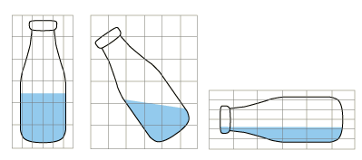

# 14.1.3 Eulerian mesh motion


**Products: **Abaqus/Explicit  Abaqus/CAE  

##### **References**

- ["Eulerian surface definition," Section 2.3.5](pt01ch02s03aus20.md)
- ["Eulerian analysis," Section 14.1.1](pt04ch14s01aus90.md)
- [*EULERIAN MESH MOTION](../key/key-link.md#usb-kws-heulmeshmotion)
- [*EULERIAN SECTION](../key/key-link.md#usb-kws-meulsection)
- [*SURFACE](../key/key-link.md#usb-kws-msurface)
- ["Defining an Eulerian mesh motion boundary condition," Section 16.10.22 of the Abaqus/CAE User's Guide](../usi/usi-link.md#usi-lbi-bceditors-meshmotion)

### Overview

In a traditional Eulerian analysis, material flows through an Eulerian mesh that is fixed in space.  Since it is stationary, the Eulerian mesh must be large enough to enclose the entire trajectory of interest.  In some simulations, such as a tumbling liquid-filled bottle, this trajectory can be long, requiring a large Eulerian mesh whose elements are mostly empty.  The Eulerian mesh motion feature allows the Eulerian mesh to move in space, following, expanding, and contracting to enclose a target object.  This can greatly reduce mesh size and, hence, simulation cost.  Mesh motion can also simplify modeling by ensuring that the entire trajectory of interest, which may be unpredictable, is indeed covered by the Eulerian mesh.

### Activating mesh motion

You can independently activate mesh motion for each Eulerian section in a model.  The motion applies to all of the elements in the section.

| **Input File Usage: ** | ``` [*EULERIAN MESH MOTION](../key/key-link.md#usb-kws-heulmeshmotion), ELSET=*name* ``` |
| --- | --- |

| **Abaqus/CAE Usage: ** | Load module: ****BC****Create****, **Category:** **Other**, **Types for Selected Step:** **Eulerian mesh motion**: select an Eulerian part instance |
| --- | --- |

### Computing mesh motion

The motion of the Eulerian mesh is computed using an internally constructed bounding box that encloses the entire Eulerian section. The bounding box has six degrees of freedom: translation of the box center and scaling of each of the three box dimensions.

The bounding box is constructed in a local coordinate system.  Its six degrees of freedom are also defined in this local system. The local coordinate directions remain fixed in space during the simulation. If no local coordinate system is specified, the local system coincides with the global system.  

| **Input File Usage: ** | ``` [*EULERIAN MESH MOTION](../key/key-link.md#usb-kws-heulmeshmotion), ORIENTATION=* name* ``` |
| --- | --- |

| **Abaqus/CAE Usage: ** | Load module: Eulerian mesh motion editor: **Bounding Box Csys**: **Edit** or **Create** |
| --- | --- |

### Defining the target object

You use a surface to define the target object that the Eulerian mesh will follow. By default, the Eulerian mesh bounding box (and, hence, the Eulerian mesh) moves to enclose the surface at all times, subject to any constraints specified on the mesh motion. If the surface type is Lagrangian, the Eulerian mesh bounding box moves to enclose the surface nodes (see [Figure 14.1.3--1](pt04ch14s01aus92.md#usb-mesh-motion-lag)).  If the surface type is Eulerian, the Eulerian mesh bounding box moves to enclose the Eulerian material named in the surface definition (see [Figure 14.1.3--2](pt04ch14s01aus92.md#usb-mesh-motion-eul)). 

**Figure 14.1.3–1** Mesh motion, where the target object is the Lagrangian bottle.



**Figure 14.1.3–2** Mesh motion, where the target object is the Eulerian liquid.


The Eulerian mesh may not fully enclose the target object due to:- constraints on the bounding box motion;
- a misalignment of the bounding box local orientation;
- a mismatch between the shape of the mesh boundary and the bounding box (i.e., the Eulerian mesh is not a rectangular box); or
- an inadequately sized or positioned initial Eulerian mesh.

| **Input File Usage: ** | ``` [*EULERIAN MESH MOTION](../key/key-link.md#usb-kws-heulmeshmotion), SURFACE=*name* ``` |
| --- | --- |

| **Abaqus/CAE Usage: ** | Load module: Eulerian mesh motion editor: **Object to Follow**: *name* |
| --- | --- |

### Constraining Eulerian mesh motion

Once the motion of the bounding box is computed, the translations and scaling factors are applied directly to the Eulerian mesh.  Several types of constraints are available to restrict these motions. Conflicts between competing constraints are resolved in the following order of precedence:

1. constraining the center and faces of the mesh bounding box,
2. limiting the rate of mesh motion,
3. turning off mesh contraction,
4. centering the mesh bounding box on the target's center of mass or bounding box center,
5. preventing mesh expansion or contraction outside the scale factor limits,
6. limiting aspect ratio changes, and
7. maintaining a buffer between the mesh and target.

#### Constraining mesh expansion and contraction

By default, the Eulerian mesh may expand or contract by an unlimited amount in each direction, as necessary to contain the target object.  This can be undesirable: expansion creates large Eulerian elements that crudely approximate the shape of Eulerian objects, while contraction leads to decreased stable time increment sizes.

You can apply constraints to limit the expansion and contraction independently in each local direction by specifying lower and/or upper limits on the bounding box size scale factors. For example, a maximum scale factor of 1.0 constrains the box dimension to be no larger than 1.0 times the initial box dimension, effectively prohibiting any expansion, while a minimum scale factor of 0.5 limits the box dimension to be no smaller than half its initial dimension.

| **Input File Usage: ** | ``` [*EULERIAN MESH MOTION](../key/key-link.md#usb-kws-heulmeshmotion) *scaling factor limits* ``` |
| --- | --- |

| **Abaqus/CAE Usage: ** | Load module: Eulerian mesh motion editor: **Axis *n***: **Expansion ratio**, **Contraction ratio** |
| --- | --- |

#### Preventing mesh contraction

An additional control is available to prevent incremental contraction.  If specified, the box dimensions may increase, but at no point during the simulation may they decrease below their current values.  This option prevents oscillations in mesh size during simulations where the mesh is nominally expanding.

| **Input File Usage: ** | ``` [*EULERIAN MESH MOTION](../key/key-link.md#usb-kws-heulmeshmotion), CONTRACT=NO ``` |
| --- | --- |

| **Abaqus/CAE Usage: ** | Load module: Eulerian mesh motion editor: **Controls**: toggle off **Allow mesh contraction** |
| --- | --- |

#### Constraining mesh translation

You can specify the motion of the center of the bounding box to be either free (default) or fixed in each of the local directions.  You can also independently specify free (default) or fixed normal motion of the positive and negative box faces in the local coordinate directions.

| **Input File Usage: ** | ``` [*EULERIAN MESH MOTION](../key/key-link.md#usb-kws-heulmeshmotion) , *face constraints* *center constraints* ``` |
| --- | --- |

| **Abaqus/CAE Usage: ** | Load module: Eulerian mesh motion editor: **Axis *n***: **Center position**, **Positive plane position**, **Negative plane position** |
| --- | --- |

#### Centering the mesh bounding box

If the motion of the mesh bounding box is unconstrained, the center of the bounding box is aligned with the center of a box enclosing the target surface. If the target surface fragments or “emits” low density material, aligning the center of the bounding box with the center of mass of the target may be advantageous.

| **Input File Usage: ** | Use the following option to center the mesh bounding box on the center of mass of the target object: |
| --- | --- |
|  | ``` [*EULERIAN MESH MOTION](../key/key-link.md#usb-kws-heulmeshmotion), CENTER=MASS ``` Use the following option to center the mesh bounding box on the center of the target object's bounding box: ``` [*EULERIAN MESH MOTION](../key/key-link.md#usb-kws-heulmeshmotion), CENTER=BOUNDING BOX ``` |

| **Abaqus/CAE Usage: ** | The center of the mesh bounding box cannot be changed in Abaqus/CAE; the center of the mesh bounding box corresponds to the center of the target object's bounding box. |
| --- | --- |

#### Controlling the mesh buffer around the target object

The mesh moves to maintain a buffer of Eulerian elements between the target object and the bounding box. By default, this buffer is equal to twice the maximum Eulerian element size in the mesh. You can specify the buffer size as a multiple of the maximum Eulerian element size. You can also specify that the initial spacing between the target object and the mesh (set to zero where the target initially extends outside of the mesh) is used to compute the buffer size.

| **Input File Usage: ** | Use the following option to use a buffer equal to the initial spacing between the target object and the mesh: |
| --- | --- |
|  | ``` [*EULERIAN MESH MOTION](../key/key-link.md#usb-kws-heulmeshmotion), BUFFER=INITIAL ``` Use the following option to specify a buffer as a multiple of the maximum Eulerian element size: ``` [*EULERIAN MESH MOTION](../key/key-link.md#usb-kws-heulmeshmotion), BUFFER=* value* ``` |

| **Abaqus/CAE Usage: ** | Load module: Eulerian mesh motion editor: **Controls**: **Buffer size:** **Initial** or **Specify** |
| --- | --- |

#### Limiting aspect ratio changes

Excessive mesh motion in a single direction can produce badly shaped Eulerian elements.  An optional parameter is available to limit the change in maximum aspect ratio of the bounding box.  By default, this limit is 10. When the aspect ratio limit is reached, motion in one local direction will induce motion in the other directions to preserve the box aspect ratio. This aspect ratio limit applies to the bounding box dimensions, not the underlying Eulerian element dimensions.

| **Input File Usage: ** | ``` [*EULERIAN MESH MOTION](../key/key-link.md#usb-kws-heulmeshmotion), ASPECT RATIO MAX=* value* ``` |
| --- | --- |

| **Abaqus/CAE Usage: ** | Load module: Eulerian mesh motion editor: **Controls**: **Aspect ratio limit:** * value* |
| --- | --- |

#### Limiting the rate of mesh motion

The Eulerian mesh must not be allowed to move abruptly.  A hard limit on its motion is given by the advective Courant condition, which prohibits mesh velocity larger than the material wave speed.  In addition you can limit the mesh velocity to a multiple of the maximum velocity in the target object.  By default, this limit is set to 1.01.

| **Input File Usage: ** | ``` [*EULERIAN MESH MOTION](../key/key-link.md#usb-kws-heulmeshmotion), VMAX FACTOR=* value* ``` |
| --- | --- |

| **Abaqus/CAE Usage: ** | Load module: Eulerian mesh motion editor: **Controls**: **Mesh velocity factor:** * value* |
| --- | --- |

### Ignoring fragments of Eulerian material

When the target object is an Eulerian material, tiny fragments can drive excessive mesh motion.  You can specify a minimum Eulerian volume fraction below which Eulerian material is ignored during the mesh motion calculation.  This can be particularly useful for impact calculations, where tiny fragments of an impacting, splattering projectile may be allowed to leave the Eulerian domain.  The default minimum volume fraction is 0.5.

| **Input File Usage: ** | ``` [*EULERIAN MESH MOTION](../key/key-link.md#usb-kws-heulmeshmotion), VOLFRAC MIN=* value* ``` |
| --- | --- |

| **Abaqus/CAE Usage: ** | Load module: Eulerian mesh motion editor: **Controls**: **Volume fraction threshold:** * value* |
| --- | --- |

### Limitations

An Eulerian mesh can move only according to the available Eulerian mesh motion options. You cannot apply prescribed displacement boundary conditions to Eulerian nodes.


