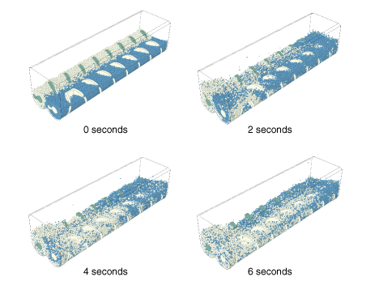
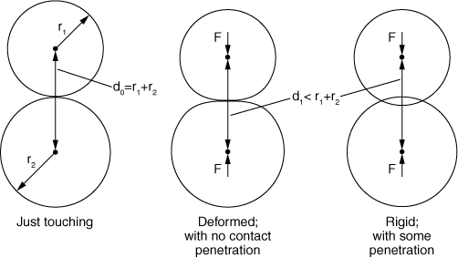
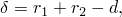
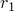
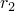
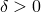
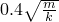
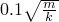
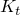
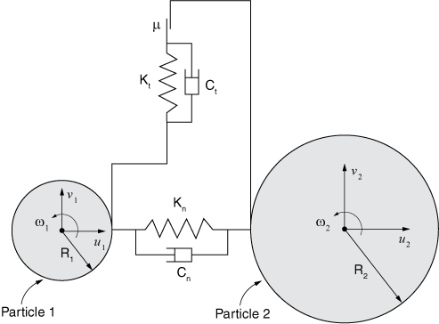

# 15.1.1 Discrete element method


**Products: **Abaqus/Explicit  Abaqus/Viewer  

##### **References**

- ["Discrete particle elements," Section 33.1.1](pt06ch33s01alm61.md)
- [*DISCRETE SECTION](../key/key-link.md#usb-kws-mdiscretesection)
- [*CONTACT](../key/key-link.md#usb-kws-hcontact)
- [*INITIAL CONDITIONS](../key/key-link.md#usb-kws-minitialcond)

### Overview

The discrete element method (DEM):
- is intended for modeling events in which large numbers of discrete particles contact each other;
- models each particle with a single-node element that has a rigid spherical shape, which may represent an individual grain, tablet, shot peen, or other simple body;
- is a versatile tool for modeling particulate material behavior in pharmaceutical, chemical, food, ceramic, metallurgical, mining, and other industries; and
- is not meant for modeling deformation of a continuum, but DEM can be used together with finite elements for modeling discrete particles interacting with deformable continua or other rigid bodies.

### Introduction

The discrete element method (DEM) is an intuitive method in which discrete particles collide with each other and with other surfaces during an explicit dynamic simulation. Typically, each DEM particle represents a separate grain, tablet, shot peen, etc. DEM is not applicable to situations in which individual particles undergo complex deformation. Therefore, DEM is unlike, and conceptually simpler than, the smoothed particle hydrodynamic (SPH) method in which groups of particles collectively model a continuum body (see ["Smoothed particle hydrodynamics," Section 15.2.1](pt04ch15s02aus95.md)).

For example, DEM is well-suited for particle mixing applications, such as that shown in [Figure 15.1.1--1](pt04ch15s01aus94.md#dem-augermixer). In this application DEM is used to model the initially separated blue and white particles, and rigid finite elements are used to model two mixing augers and the box-shaped container. The sequence of deformed plots in [Figure 15.1.1--1](pt04ch15s01aus94.md#dem-augermixer) shows the particle response as the augers turn. DEM results for simulations such as this are often best viewed with animations. Another example of using DEM for a mixing application is described in ["Mixing of granular media in a drum mixer," Section 13.1.1 of the Abaqus Example Problems Guide](../exa/exa-link.md#exa-dem-rollmillmixing).

**Figure 15.1.1–1** DEM particle mixing example.



Each DEM particle is modeled with a single-node element of type PD3D. These elements are rigid spheres with specified radii. Nodes of PD3D elements have displacement and rotational degrees of freedom. Rotations of DEM particles can significantly influence contact interactions when friction is considered.

General contact definitions are easily extended to include interactions among DEM particles and interactions between DEM particles and finite-element-based (or analytical) surfaces. Large relative motion among particles is typical for DEM applications. Particle-to-particle interactions can involve like or unlike particles. Each particle can be involved in many contact interactions simultaneously. DEM particle interactions use finite contact stiffness, which introduces some compliance into the particle systems. For example, the contact stiffness can be specified such as to reflect the macroscopic stiffness of a packed granular material model with DEM.

For example, consider the interactions between the two spherical particles shown in [Figure 15.1.1--2](pt04ch15s01aus94.md#spheres-overlap). 

**Figure 15.1.1–2** Interactions between spherical particles.



The three cases show two undeformed spheres just touching, two deformed spheres pushed toward one another with contact strictly enforced, and two rigid spheres pushed toward one another with some penetration. The distance between the centers of the spheres is the same for the cases shown in the middle and on the right in [Figure 15.1.1--2](pt04ch15s01aus94.md#spheres-overlap). The physical behavior corresponds to the middle case. The case on the right corresponds to a DEM approximation. If the variable  is defined as 



where  and  are the radii of the two spheres and *d* is the distance between the sphere centers,  when the undeformed spheres are just touching and  if the distance between the sphere centers is less than the combined radii. For the DEM approximation,  corresponds to the maximum penetration distance between the particles. You can improve the accuracy for some DEM applications by tuning the contact stiffness relationship (contact force *F* versus penetration ) for DEM particles to reflect the Hertz contact solution (middle case in [Figure 15.1.1--2](pt04ch15s01aus94.md#spheres-overlap)). See ["Mixing of granular media in a drum mixer," Section 13.1.1 of the Abaqus Example Problems Guide](../exa/exa-link.md#exa-dem-rollmillmixing), for further discussion of tuning the contact stiffness.

### Applications

DEM is a versatile tool for modeling particulate material behavior in pharmaceutical, chemical, food, ceramic, metallurgical, mining, and other industries. DEM applications include the following categories:

**Particle packing**: involves processes such as pouring or deposition under gravity (such as sandpiling), vibration after deposition of particles, and compaction.

**Particle flow**: may occur under gravity only (as in the case of a hopper) or under gravity and other driving forces (such as for mixers and mills).

**Particle-fluid interaction**: occurs in transport of granular material within a fluid flow, during wavelike motion, and during fluidization (wherein fluid flows upwards through a bed of particles).
DEM can provide insight for many situations that are difficult to investigate with other computational methods or with physical experiments.

### Strategies for creating and initializing a DEM model

Particulate media often consist of randomly distributed grains of varying sizes. Generating an initial mesh for a DEM analysis can be challenging. A common strategy for DEM is to specify approximate initial positions of particles with some gaps between them and to allow the particles to settle into position under gravity loading during the first step. For example, this strategy is used for the mixing analysis shown in [Figure 15.1.1--1](pt04ch15s01aus94.md#dem-augermixer): the augers are kept stationary during the first step in which the particles are allowed to settle, and the augers are turned during the second step to study the mixing behavior (which is the focus of the figure shown).

### Strategy for reducing solution noise

The solution noise generated by numerous opening and closing contact conditions can be reduced by applying a small amount of mass proportional damping. For more information, see ["Alpha damping" in "Discrete particle elements," Section 33.1.1](pt06ch33s01alm61.md#usb-elm-ediscreteparticleelem-damping).

### Time incrementation considerations

DEM uses the explicit dynamics procedure type. In most cases Abaqus/Explicit automatically controls the time increment size, as discussed in ["Automatic time incrementation" in "Explicit dynamic analysis," Section 6.3.3](pt03ch06s03at08.md#usb-anl-aexpdynamic-automatic), based on stiffness and mass characteristics of the model. The relationship between the maximum stable time increment size, mass, and stiffness properties is complex. The stable time increment size tends to be proportional to the square root of mass and inversely proportional to the square root of stiffness. However, a stable time increment cannot be computed for each PD3D element because the particles are rigid, so you must specify a fixed time increment size for purely DEM analyses (see ["Fixed time incrementation" in "Explicit dynamic analysis," Section 6.3.3](pt03ch06s03at08.md#usb-anl-aexpdynamic-fixed)). You can use automatic time incrementation for models that have PD3D elements along with regular deformable finite elements.

Contact interactions among DEM particles can influence the appropriate time increment size. DEM analyses without tightly packed particles may simply call for a contact stiffness that is large enough to avoid significant penetrations, rather than a contact stiffness that is highly representative of physical stiffness characteristics of the particles (which are each modeled as rigid with DEM). If you do not specify the contact stiffness, Abaqus/Explicit assigns a default (penalty) contact stiffness based on the time increment size and mass/rotary inertia characteristics of the particles. In such cases you should ensure that the time increment size is small enough to result in a sufficiently large penalty stiffness.

In many cases it is important to carefully set the contact stiffness; for example, to allow DEM results to match Hertz contact behavior between deformable spheres. If you specify the DEM contact stiffness, you must ensure that the time increment used for the analysis is small enough to avoid numerical instabilities. For dense three-dimensional packing of particles where each particle simultaneously contacts many particles, the numerical stability considerations are complex. A general guideline is that the time increment should not exceed , where *m* and *k* represent the particle mass and contact stiffness, respectively. In some applications an even smaller time increment, such as , may result in an improved solution.

If particle velocities become very large, the amount of incremental motion can influence the appropriate time increment size. Accurate resolution of particle motion sometimes requires specifying a smaller time increment than the maximum numerical stability time increment.

### Initial conditions

Initial conditions pertinent to mechanical analyses can be used in a discrete element method analysis. All of the initial conditions that are available for an explicit dynamic analysis are described in ["Initial conditions in Abaqus/Standard and Abaqus/Explicit," Section 34.2.1](pt07ch34s02aus116.md). 

### Boundary conditions

Boundary conditions are defined as described in ["Boundary conditions in Abaqus/Standard and Abaqus/Explicit," Section 34.3.1](pt07ch34s03aus118.md). Boundary conditions are rarely applied on individual particles in DEM.

### Loads

The loading types available for an explicit dynamic analysis are explained in ["Applying loads: overview," Section 34.4.1](pt07ch34s04aus120.md). Gravity loads are very important for settling and particulate flow analysis in DEM. Concentrated loads are rarely applied on particles. 

### Elements

The discrete element method uses PD3D elements to model individual particles. These 1-node elements define individual grains of a particulate media, are spherical in shape, and are modeled as rigid (any compliance is built into the contact model). These particle elements use existing Abaqus functionality to reference element-related features such as initial conditions, distributed loads, and visualization. You can define these elements in a similar fashion as you would define point masses or rotary inertia. The coordinates of the node of a particle correspond to the center location of the physical grain of material. PD3D elements are assigned to a discrete section definition, where particle characteristics are specified. For more information, see ["Discrete particle elements," Section 33.1.1](pt06ch33s01alm61.md).

| **Input File Usage: ** | Use the following options to define a discrete element medium: |
| --- | --- |
|  | ``` [*ELEMENT](../key/key-link.md#usb-kws-melement), TYPE=PD3D, ELSET=*particle_body* *element number*, *node number* ``` ``` [*DISCRETE SECTION](../key/key-link.md#usb-kws-mdiscretesection), ELSET=*element_set_name* ``` |

### Constraints

Since PD3D elements are Lagrangian elements, their nodes can be involved in other features such as connectors or constraints. Although the PD3D element has a spherical shape, it is possible to model grains of complex shapes by clustering particles together, as illustrated in [Figure 15.1.1--3](pt04ch15s01aus94.md#dem-rigid-cluster). A cluster is a group of particles that are held together either rigidly or via  compliant connections.

**Figure 15.1.1–3** Rigid cluster of particles.


The particles in a cluster may overlap with each other. Contact forces that try to push apart overlapping particles of a cluster will exist unless contact exclusions are specified among particles of a cluster (see ["Specifying contact exclusions" in "Defining general contact interactions in Abaqus/Explicit," Section 36.4.1](pt09ch36s04aus155.md#usb-cni-acontactgeneral-specify-exclusions)). These contact forces will have no effect on particles held together rigidly but are problematic for clusters with compliant connections.

The particle-cluster approach may not replicate the precise geometry of actual grains. For example, the cluster shown in [Figure 15.1.1--3](pt04ch15s01aus94.md#dem-rigid-cluster) may approximate an ellipsoidal shape (indicated by the dashed line in the figure). More spherical particles of various sizes can be added to the cluster to obtain a closer approximation of the true shape.

Define BEAM-type multi-point constraints between nodes of a group of particles to create a rigid cluster, or define connector elements between nodes of particles to create a rigid or “deformable” cluster. Appropriate constitutive behavior can be defined for connector elements to capture compliant behavior for particle connections within a cluster. Clusters of overlapping particles that do not involve multi-point constraints or connectors may exhibit nonphysical behavior. For more information, see ["General multi-point constraints," Section 35.2.2](pt08ch35s02aus130.md), and ["Connectors: overview," Section 31.1.1](pt06ch31s01abo28.md). 

### Interactions

Contact is an essential ingredient for DEM analyses, as discussed above. General contact is used to define contact involving DEM particles. A DEM particle can be involved in multiple contact interactions simultaneously with
- another particle with the same discrete section definition;
- another particle with a different discrete section definition;
- a surface based on finite elements; and
- an analytical rigid surface.

Modeling contact between DEM particles requires that the particles be explicitly included in general contact as element-based surfaces using contact inclusions (see ["Element-based surface definition," Section 2.3.2](pt01ch02s03aus17.md)). See ["Defining general contact interactions in Abaqus/Explicit," Section 36.4.1](pt09ch36s04aus155.md), for a discussion of general contact. By default, the particles are not part of the general contact domain, similar to other 1-node elements (such as point masses).

Contact stiffness for DEM is often intended to account for the physical stiffness characteristics of the particles because DEM models each particle as rigid; therefore, nondefault contact property assignments are common for DEM interactions.

#### Normal and tangential contact forces

[Figure 15.1.1--4](pt04ch15s01aus94.md#dem-particle-interaction) is a schematic representation of the contact stiffness and damping between two particles. The spring stiffness  acts in the contact normal direction and may represent a simple linear or a nonlinear contact stiffness. The dashpot  represents contact damping in the normal direction. The tangential spring stiffness  along with the friction coefficient  represent friction between the particles. The dashpot  represents contact damping in the tangential direction. 

**Figure 15.1.1–4** Normal and tangential contact interaction between two discrete elements.



[Figure 15.1.1--4](pt04ch15s01aus94.md#dem-particle-interaction) shows that the tangential contact forces acting on particle surfaces cause moments at particle centers. Interactions involving DEM particles account for moment transfer across the interface.

### Output

No element output is available for  PD3D elements. The nodal output includes all output variables generally available in Abaqus/Explicit analyses (see ["Abaqus/Explicit output variable identifiers," Section 4.2.2](pt02ch04s02xbv01.md)).

### Limitations

Discrete element method analyses are subject to the following limitations: 
- Volume average output for stress, strain, and other similar continuum element output is not available for DEM analysis.
- Only a spherical shape is supported for PD3D elements.
- It is not possible to specify cohesive or thermal contact between PD3D elements or between PD3D elements and other elements.
- Rolling friction is ignored for contact between PD3D elements or between PD3D elements and other elements.
- User-defined surface interaction is not supported for contact between PD3D elements.
- Although supported in Abaqus/Viewer, the functionality is not supported in Abaqus/CAE. You can use the existing functionality in Abaqus/CAE to generate mass elements, write an input file, and then manually edit the input file to convert the mass elements to particles. Alternatively, you can create a mesh using C3D8R elements, write an input file, and then use a script to convert these elements to particles as described in "Generating particle elements from a solid mesh" in the Dassault Systmes Knowledge Base at [www.3ds.com/support/knowledge-base](http://www.3ds.com/support/knowledge-base).

DEM computations are distributed across parallel domains except when multiple discrete sections are defined with different alpha damping parameters (which will degrade parallel scalability). DEM analyses are subject to the following limitations if multiple CPUs are used:
- Contact output is not supported for DEM slave nodes.
- Energy history output other than for the whole model is not supported.
- Dynamic load balancing cannot be activated.
- If any DEM particles participate in general contact, all DEM particles must be included in the general contact definition.
- At least 10,000 DEM particles per domain is suggested to achieve good scalability.
- A significant increase in memory usage may be needed if a large number of CPUs is used.

### Input file template

The following example illustrates a discrete element method analysis:

```
[*HEADING](../key/key-link.md#usb-kws-mheading)
…
[*ELEMENT](../key/key-link.md#usb-kws-melement), TYPE=PD3D, ELSET=*name*
*Element number, node number*
…
[*DISCRETE SECTION](../key/key-link.md#usb-kws-mdiscretesection), ELSET=*name*
*Particle radius*
**
[*INITIAL CONDITIONS](../key/key-link.md#usb-kws-minitialcond), TYPE=VELOCITY
*Data lines to define velocity initial conditions*
[*NSET](../key/key-link.md#usb-kws-mnset), NSET=*name*, ELSET=*name*
[*SURFACE](../key/key-link.md#usb-kws-msurface), NAME=*name*
,
**
[*SURFACE INTERACTION](../key/key-link.md#usb-kws-hsurfaceinteraction)
**
[*STEP](../key/key-link.md#usb-kws-hstep)
[*DYNAMIC](../key/key-link.md#usb-kws-hdynamic), EXPLICIT
[*DLOAD](../key/key-link.md#usb-kws-hdload)
*Data lines to define gravity load*
**
[*CONTACT](../key/key-link.md#usb-kws-hcontact)
[*CONTACT INCLUSIONS](../key/key-link.md#usb-kws-hcontactinclusions)
[*CONTACT PROPERTY ASSIGNMENT](../key/key-link.md#usb-kws-hcontpropassign)
**
[*CONTACT CONTROLS ASSIGNMENT](../key/key-link.md#usb-kws-hcontcntrlassign)
[*OUTPUT](../key/key-link.md#usb-kws-houtput), FIELD
[*END STEP](../key/key-link.md#usb-kws-hendstep)
```

#### Additional references

- Cundall, P. A., and O. D. Strack, "A Distinct Element Method for Granular Assemblies," Geotechnique, vol. 29, pp. 47--65, 1979.
- Munjiza, A., and K. R. F. Andrews, "NBS Contact Detection Algorithm for Bodies of Similar Size," International Journal for Numerical Methods in Engineering, vol. 43, pp. 131--149, 1998.
- O'Sullivan, C., and J. D. Bray, "Selecting a Suitable Time Step for Discrete Element Simulations that Use the Central Difference Time Integration Scheme," Engineering Computations, vol. 21(2/3/4), pp. 278--303, 2004.
- Zhu, H. P., Z. Y. Zhou, R. Y. Yang, and A. B. Yu, "Discrete Particle Simulation of Particulate Systems: A Review of Major Applications and Findings," Chemical Engineering Science, vol. 63, pp. 5728--5770, 2008.
- Zhu, H. P., Z. Y. Zhou, R. Y. Yang, and A. B. Yu, "Discrete Particle Simulation of Particulate Systems: Theoretical Developments," Chemical Engineering Science, vol. 62, pp. 3378--3396, 2007.


