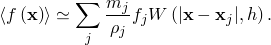
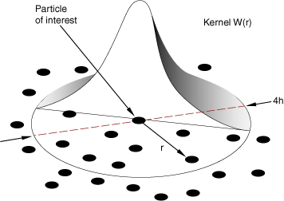

# 15.2.1 Smoothed particle hydrodynamics


**Product: **Abaqus/Explicit  

##### **References**

- ["Continuum particle elements," Section 33.2.1](pt06ch33s02alm62.md)
- [*SOLID SECTION](../key/key-link.md#usb-kws-msolidsection)
- [*SECTION CONTROLS](../key/key-link.md#usb-kws-msectioncontrols)
- [*INITIAL CONDITIONS](../key/key-link.md#usb-kws-minitialcond)

### Overview

Smoothed particle hydrodynamics (SPH) is a numerical method that is part of the larger family of meshless (or mesh-free) methods. For these methods you do not define nodes and elements as you would normally define in a finite element analysis; instead, only a collection of points are necessary to represent a given body. In smoothed particle hydrodynamics these nodes are commonly referred to as particles or pseudo-particles. 

The example shown in [Figure 15.2.1--1](pt04ch15s02aus95.md#sph-meshes) contrasts the two approaches. Both discrete representations model the initial configuration of a body of fluid inside a bottle, as described in detail in ["Impact of a water-filled bottle," Section 2.3.2 of the Abaqus Example Problems Guide](../exa/exa-link.md#exa-dyn-bottledrop). The model on the left is a traditional tetrahedron mesh of the volume occupied by the fluid. On the right, the same volume is represented by a collection of discrete points. Note that in the latter case there are no edges connecting the points as these points (pseudo-particles) do not require the definition of multiple-node element connectivity, as is the case in the traditional finite element representation on the left. An alternative to directly defining particle elements is to define conventional continuum finite elements and automatically convert them to particle elements at the beginning of the analysis or during the analysis, as discussed in ["Finite element conversion to SPH particles," Section 15.2.2](pt04ch15s02aus96.md).

**Figure 15.2.1–1** Finite element mesh and SPH particle distribution.


Smoothed particle hydrodynamics is a fully Lagrangian modeling scheme permitting the discretization of a prescribed set of continuum equations by interpolating the properties directly at a discrete set of points distributed over the solution domain without the need to define a spatial mesh. The method's Lagrangian nature, associated with the absence of a fixed mesh, is its main strength. Difficulties associated with fluid flow and structural problems involving large deformations and free surfaces are resolved in a relatively natural way. 

At its core, the method is not based on discrete particles (spheres) colliding with each other in compression or exhibiting cohesive-like behavior in tension as the word particle might suggest. Rather, it is simply a clever discretization method of continuum partial differential equations. In that respect, smoothed particle hydrodynamics is quite similar to the finite element method. SPH uses an evolving interpolation scheme to approximate a field variable at any point in a domain. The value of a variable at a particle of interest can be approximated by summing the contributions from a set of neighboring particles, denoted by subscript *j*, for which the “kernel” function, *W*, is not zero 



An example kernel function is shown in [Figure 15.2.1--2](pt04ch15s02aus95.md#sph-int-method-nls). The smoothing length, *h*, determines how many particles influence the interpolation for a particular point.

**Figure 15.2.1–2** Kernel function.



The SPH method has received substantial theoretical support since its inception ([Gingold and Monaghan, 1977](pt04ch15s02aus95.md#asphanalysis-gingold1977)), and the number of publications related to the method is now very large. A number of references are listed below. 

The method can use any of the materials available in Abaqus/Explicit (including user materials). You can specify initial conditions and boundary conditions as for any other Lagrangian model. Contact interactions with other Lagrangian bodies are also allowed, thus expanding the range of applications for which this method can be used.

The method is less accurate in general than Lagrangian finite element analyses when the deformation is not too severe and than coupled Eulerian-Lagrangian analyses in higher deformation regimes. If a large percentage of all nodes in the model are associated with smoothed particle hydrodynamics, the analysis may not scale well if multiple CPUs are used.

### Applications

Smoothed particle hydrodynamic analyses are effective for applications involving extreme deformation. Fluid sloshing, wave engineering, ballistics, spraying (as in paint spraying), gas flow, and obliteration and fragmentation followed by secondary impacts are a few examples. There are many applications for which both the coupled Eulerian-Lagrangian and the smoothed particle hydrodynamic methods can be used. In many coupled Eulerian-Lagrangian analyses the material to void ratio is small and, consequently, the computational effort may be prohibitively high. In these cases, the smoothed particle hydrodynamic method is preferred. For example, tracking fragments from primary impacts through a large volume until secondary impact occurs can be very expensive in a coupled Eulerian-Lagrangian analysis but comes at no additional cost in a smoothed particle hydrodynamic analysis. 

["Impact of a water-filled bottle," Section 2.3.2 of the Abaqus Example Problems Guide](../exa/exa-link.md#exa-dyn-bottledrop), includes an example of using the smoothed particle hydrodynamic method to model the violent sloshing associated with the impact.

### Artificial viscosity

Artificial viscosity in smoothed particle hydrodynamics has the same meaning as bulk viscosity for finite elements. Similar to other Lagrangian elements, particle elements use linear and quadratic viscous contributions to dampen high frequency noise from the computed response. In rare cases when the default values are not appropriate, you can control the amount of artificial viscosity included in a smoothed particle hydrodynamic analysis. 

| **Input File Usage: ** | Use the following options to specify scale factors for the linear and quadratic artificial viscosities: |
| --- | --- |
|  | ``` [*SECTION CONTROLS](../key/key-link.md#usb-kws-msectioncontrols) , , , *scale factor for linear artificial viscosity, scale factor for quadratic artificial viscosity* ``` |

### Initial conditions

["Initial conditions in Abaqus/Standard and Abaqus/Explicit," Section 34.2.1](pt07ch34s02aus116.md), describes all of the initial conditions that are available for an explicit dynamic analysis. Initial conditions pertinent to mechanical analyses can be used in a smoothed particle hydrodynamic analysis. 

### Boundary conditions

Boundary conditions are defined as described in ["Boundary conditions in Abaqus/Standard and Abaqus/Explicit," Section 34.3.1](pt07ch34s03aus118.md).

### Loads

The loading types available for an explicit dynamic analysis are explained in ["Applying loads: overview," Section 34.4.1](pt07ch34s04aus120.md). Concentrated nodal loads can be applied as usual. Gravity loads are the only distributed loads allowed in a smoothed particle hydrodynamic analysis. 

### Material options

Any of the material models in Abaqus/Explicit can be used in a smoothed particle hydrodynamic analysis.

### Elements

The smoothed particle hydrodynamic method is implemented via the formulation associated with PC3D elements. These 1-node elements are simply a means of defining particles in space that model a particular body or bodies. These particle elements utilize existing functionality in Abaqus to reference element-related features such as materials, initial conditions, distributed loads, and visualization.

You define these elements in a similar fashion as you would define point masses. The coordinates of these points lie either on the surface or in the interior of the body being modeled, similar to the nodes of a body meshed with brick elements. For more accurate results, you should strive to space the nodal coordinates of these particles as uniformly as possible in all directions. 

An alternative to directly defining PC3D elements is to define conventional continuum finite element types C3D8R, C3D6, or C3D4 and automatically convert them to particle elements at the beginning of the analysis or during the analysis, as discussed in ["Finite element conversion to SPH particles," Section 15.2.2](pt04ch15s02aus96.md).

The smoothed particle hydrodynamic method implemented in Abaqus/Explicit uses a cubic spline as the interpolation polynomial and is based on the classical smoothed particle hydrodynamic theory as outlined in the references below.

The smoothed particle hydrodynamic method is not implemented for two-dimensional elements. Axisymmetry can be simulated using a wedge-shaped sector and symmetry boundary conditions. There are no hourglass or distortion control forces associated with PC3D elements. These elements do not have faces or edges associated with them.

#### SPH kernel interpolator

By default, the smoothed particle hydrodynamic method implemented in Abaqus/Explicit uses a cubic spline as the interpolation polynomial. Alternatively, you can choose a quadratic ([Johnson et al, 1996](pt04ch15s02aus95.md#asphanalysis-johnson)) or quintic ([Wendland, 1995](pt04ch15s02aus95.md#asphanalysis-wendland)) interpolator. 

The implementation is based on the classical smoothed particle hydrodynamic theory as outlined in the references below. You also have the option of using a mean flow correction configuration update, commonly referred to in the literature as the XSPH method (see [Monaghan, 1992](pt04ch15s02aus95.md#asphanalysis-monaghan)), as well as the corrected kernel of [Randles and Libersky, 1997](pt04ch15s02aus95.md#asphanalysis-randles), also referred to as the normalized SPH (NSPH) method. 

You can control these settings as discussed in ["Using section controls for smoothed particle hydrodynamics (SPH)" in "Section controls," Section 27.1.4](pt06ch27s01aus113.md#usb-elm-esectioncontrol-sph). 

#### Computing the particle volume

There is currently no capability to automatically compute the volume associated with these particles. Hence, you need to supply a characteristic length that will be used to compute the particle volume, which in turn is used to compute the mass associated with the particle. It is assumed that the nodes are distributed uniformly in space and that each particle is associated with a small cube centered at the particle. When stacked together, these cubes will fill the overall volume of the body with some minor approximation at the free surface of the body. The characteristic length is half the length of the cube side. From a practical perspective, once you have created the nodes, you can use the half-distance between two nodes as the characteristic length. Alternatively, if you know the mass and density of the part, you can compute the volume of the part and divide it by the total number of particles in the part to obtain the volume of the small cube associated with each particle. Half of the cubic root of this small volume is a reasonable characteristic length for this particle set. You can check the mass of individual sets in the model if you request that model definition data be printed to the data (`.dat`) file (see ["Model and history definition summaries" in "Output," Section 4.1.1](pt02ch04s01aus38.md#usb-out-ooutput-modelhist-sum)).

| **Input File Usage: ** | Use the following options to define a smoothed particle hydrodynamic body: |
| --- | --- |
|  | ``` [*ELEMENT](../key/key-link.md#usb-kws-melement), TYPE=PC3D, ELSET=*particle_body* *element number*, *node number* ``` Repeat the data line as often as necessary. ``` [*SOLID SECTION](../key/key-link.md#usb-kws-msolidsection), ELSET=*particle_body*, MATERIAL=*material_name* *characteristic length associated with particle volume* ``` |

#### Smoothing length calculation

Even though particle elements are defined in the model using one node per element, the smoothed particle hydrodynamic method computes contributions for each element based on neighboring particles that are within a sphere of influence. The radius of this sphere of influence is referred to in the literature as the smoothing length. The smoothing length is independent of the characteristic length discussed above and governs the interpolation properties of the method. By default, the smoothing length is computed automatically. As the deformation progresses, particles move with respect to each other and, hence, the neighbors of a given particle can (and typically do) change. Every increment Abaqus/Explicit recomputes this local connectivity internally and computes kinematic quantities (such as normal and shear strains, deformation gradients, etc.) based on contributions from this cloud of particles centered at the particle of interest. Stresses are then computed in a similar fashion as for reduced-integration brick elements, which are in turn used to compute element nodal forces for the particles in the cloud based on the smoothed particle hydrodynamic formulation.

By default, Abaqus/Explicit computes a smoothing length at the beginning of the analysis such that the average number of particles associated with an element is roughly between 30 and 50. The smoothing length is kept constant during the analysis. Therefore, the average number of particles per element can either decrease or increase during the analysis depending on whether the average behavior in the model is expansive or compressive, respectively. If the analysis is mostly compressive in nature, the total number of particles associated with a given element might exceed the maximum allowed and the analysis will be stopped. By default, the maximum number of allowed particles associated with one element is 140.

You can control most of these settings as discussed in ["Using section controls for smoothed particle hydrodynamics (SPH)" in "Section controls," Section 27.1.4](pt06ch27s01aus113.md#usb-elm-esectioncontrol-sph). 

#### Smoothed particle hydrodynamic domain

A rectangular region is computed at the beginning of the analysis as the bounding box within which the particles will be tracked. This fixed rectangular box is 10% larger than the overall dimensions of the whole model, and it is centered at the geometric center of the model. As the analysis progresses, if a particle is outside this box, it behaves like a free-flying point mass and does not contribute to smoothed particle hydrodynamic calculations. If the particle reenters the box at a later stage, it is once again included in the calculations.

You can modify the size of the bounding box as discussed in ["Using section controls for smoothed particle hydrodynamics (SPH)" in "Section controls," Section 27.1.4](pt06ch27s01aus113.md#usb-elm-esectioncontrol-sph). 

### Constraints

 Since the PC3D elements are Lagrangian elements, their nodes can be involved in other features, such as other elements, connectors, or constraints. Since these elements do not have faces or edges, an element-based surface cannot be defined using PC3D elements. Consequently, constraints that require element-based surfaces (such as fasteners) cannot be defined for particles.

### Interactions

Bodies modeled with particles can interact with other finite element meshed bodies via contact. The contact interaction is the same as any contact interaction between a node-based surface (associated with the particles) and an element-based or analytical surface. Both general contact and contact pairs can be used. All interaction types and formulations available for contact involving a node-based surface are allowed, including cohesive behavior. Different contact properties can be assigned via the usual options. By default, the particles are not part of the general contact domain similar to other 1-node elements (such as point masses). The default contact thickness for particles is the same value specified as the characteristic length on the section definition; thus, for contact purposes, particles behave as spheres with radii equal to the radius of a sphere inscribed in the small cube associated with the particle volume as described above.

 You should not specify a contact thickness of zero for the nodes associated with PC3D elements or contact may not be resolved robustly. The recommended approach is to use the default or specify a reasonable contact thickness.

Interaction between different bodies all modeled with PC3D elements is allowed. However, this interaction is meaningful only in cases when the colliding smoothed particle hydrodynamic bodies are made of the same fluid-like material, such as a water drop falling in a bucket partially filled with water. In solids-related applications, such as modeling a bullet perforating an armor plate, one of the bodies must be modeled using regular finite elements.

Contact interactions cannot be defined between particles and Eulerian regions.

| **Input File Usage: ** | Use the following options to define contact between a meshed or analytical surface with a particle-based surface: |
| --- | --- |
|  | ``` [*CONTACT](../key/key-link.md#usb-kws-hcontact) [*CONTACT INCLUSIONS](../key/key-link.md#usb-kws-hcontactinclusions) *node-based particle surface*, *element-based/analytical_surface* ``` |

### Output

The element output available for  PC3D elements includes all mechanics-related output for continuum elements: stress; strain; energies; and the values of state, field, and user-defined variables. The nodal output includes all output variables generally available in Abaqus/Explicit analyses. 

Particles can be visualized in Abaqus/CAE via circular discs. In contour plots the values of field output variables are shown as circular patches of color. Symbol plots are also available.

### Limitations

Smoothed particle hydrodynamic analyses are subject to the following limitations: 		
- They are less accurate in general than Lagrangian finite element analyses when the deformation is not too severe and the elements are not distorted. In higher deformation regimes coupled Eulerian-Lagrangian analyses are also generally more accurate. The smoothed particle dynamic method should be used primarily in cases when the conventional finite element method or the coupled Eulerian-Lagrangian method have reached their inherent limitations or are prohibitively expensive to perform.
- When the material is in a state of tensile stress, the particle motion may become unstable leading to the so-called tensile instability. This instability, which is strictly related to the interpolation technique of the standard smoothed particle dynamic method, is especially noticeable when simulating the stretched state of a solid. As a consequence, particles tend to clump together and show fracture-like behavior.
- Mass distribution in a body defined with particle elements is somewhat different when compared to the mass distribution of the same body defined with continuum elements, such as C3D8R elements. When particle elements are used, the volume of all particles in that body are the same. Consequently, the nodal mass associated with all particles in that body is the same. If the nodes are not placed in a regular cubic arrangement, the mass distribution is somewhat inexact, particularly at the free surface of the body being modeled.
- Surface loads cannot be specified on PC3D elements. However, distributed loads, such as pressure, can be applied to other finite element surfaces that can apply a pressure onto the particle elements via contact interactions.
- Bodies modeled with particles that were not defined using the same section definition do not interact with each other. Hence, you cannot use smoothed particle hydrodynamics to model the mixing of bodies with dissimilar materials.
- The functionality is not directly supported in Abaqus/CAE. However, you can do the following: - You can use the existing functionality in Abaqus/CAE to generate mass elements, write an input file, and then manually edit the input file to convert the mass elements to particles. - You can use finite element conversion to SPH particles (see ["Boundary conditions" in "Finite element conversion to SPH particles," Section 15.2.2](pt04ch15s02aus96.md#usb-anl-ashpconv-bc)) at the beginning of an analysis (a time-based conversion criterion at time equal to zero). - You can create a mesh using C3D8R elements, write an input file, and then use a script to convert these elements to particles as described in "Generating particle elements from a solid mesh" in the Dassault Systmes Knowledge Base at [www.3ds.com/support/knowledge-base](http://www.3ds.com/support/knowledge-base).
- Within a given body (part) defined via one solid section definition, gravity loads and mass scaling cannot be specified selectively on a subset of elements referenced by this definition. Instead, the two features must be applied to all the elements in the element set associated with the solid section definition.

Smoothed particle hydrodynamic computations are distributed across parallel domains in most cases; however, they are all performed by a single domain (with a single processor) for models with any of the following characteristics (which will often dramatically degrade parallel scalability):
- Finite element conversion to SPH particles (see ["Boundary conditions" in "Finite element conversion to SPH particles," Section 15.2.2](pt04ch15s02aus96.md#usb-anl-ashpconv-bc)) after the beginning of an analysis. The parallel smoothed particle hydrodynamics implementation supports conversion to SPH particles only at the beginning of an analysis (at time equal to zero).
- Multiple solid sections for PC3D elements
- Normalized kernel specified as a section control
- Predefined field variable (including temperature) dependence of material properties

 Smoothed particle hydrodynamic analyses are subject to the following limitations if multiple CPUs are used:
- Contact output is not supported for smoothed particle hydrodynamic slave nodes.
- Element history output is not supported.
- Energy history output other than for the whole model is not supported.
- Dynamic load balancing cannot be activated.
- If any SPH particles participate in general contact, all SPH particles must be included in the general contact definition.
- At least 10,000 particles per domain is suggested to achieve good scalability.
- A significant increase in memory usage may be needed if a large number of CPUs are used.

### Input file template

The following example illustrates a smoothed particle hydrodynamic analysis of a bottle filled with fluid being dropped on the floor. The plastic bottle and the floor are modeled with conventional shell elements. The fluid is modeled via smoothed particle hydrodynamics using PC3D elements. The nodal coordinates of the particles are defined such they are all located inside the bottle. Material property definitions are defined as usual for both the fluid and the bottle. Contact interaction is defined between the smoothed particle hydrodynamic particles representing the water (node-based surface) and the interior walls of the bottle and also between the bottle exterior and the floor using element-based surfaces (not shown). Output is requested for stresses (pressure) and density in the fluid.

```
[*HEADING](../key/key-link.md#usb-kws-mheading)
…
[*ELEMENT](../key/key-link.md#usb-kws-melement), TYPE=PC3D, ELSET=Fluid_Inside_The_Bottle
*Element number, node number*
…
[*SOLID SECTION](../key/key-link.md#usb-kws-msolidsection), ELSET=Fluid_Inside_The_Bottle, MATERIAL=Water
*Element characteristic length associated with particle volume*
[*MATERIAL](../key/key-link.md#usb-kws-mmaterial), NAME=Water
*Material definition for water, such as an EOS material*
[*ELEMENT](../key/key-link.md#usb-kws-melement), TYPE=S4R, ELSET=Plastic_Bottle
*Element definitions for the shells*
**
[*INITIAL CONDITIONS](../key/key-link.md#usb-kws-minitialcond), TYPE=VELOCITY
*Data lines to define velocity initial conditions*
[*NSET](../key/key-link.md#usb-kws-mnset), NSET=Water_Nodes, ELSET=Fluid_Inside_The_Bottle
[*SURFACE](../key/key-link.md#usb-kws-msurface), NAME=Water_Surface, TYPE=NODE
Water_Nodes,
[*SURFACE](../key/key-link.md#usb-kws-msurface), NAME=Bottle_Interior
Plastic_Bottle, SNEG
**
[*STEP](../key/key-link.md#usb-kws-hstep)
[*DYNAMIC](../key/key-link.md#usb-kws-hdynamic), EXPLICIT
[*DLOAD](../key/key-link.md#usb-kws-hdload)
*Data lines to define gravity load*
**
[*CONTACT](../key/key-link.md#usb-kws-hcontact)
[*CONTACT INCLUSIONS](../key/key-link.md#usb-kws-hcontactinclusions)
Water_Surface, Bottle_Interior
**
[*OUTPUT](../key/key-link.md#usb-kws-houtput), FIELD
[*ELEMENT OUTPUT](../key/key-link.md#usb-kws-helementoutput), ELSET=Fluid_Inside_The_Bottle
S, DENSITY
[*END STEP](../key/key-link.md#usb-kws-hendstep)
```

#### Additional references

- Gingold, R. A., and J. J. Monaghan, "Smoothed Particle Hydrodynamics: Theory and Application to Non-Spherical Stars," Royal Astronomical Society, Monthly Notices, vol. 181, pp. 375--389, 1977.
- Johnson, J., R. Stryk, and S. Beissel, "SPH for High Velocity Impact Calculations," Computer Methods in Applied Mechanics and Engineering, 1996.
- Libersky, L. D., and A. G. Petschek, "High Strain Lagrangian Hydrodynamics," Journal of Computational Physics, vol. 109, pp. 67--75, 1993.
- Monaghan, J., "Smoothed Particle Hydrodynamics," Annual Review of Astronomy and Astrophysics, 1992.
- Munjiza, A., and K. R. F. Andrews, "NBS Contact Detection Algorithm for Bodies of Similar Size," International Journal for Numerical Methods in Engineering, vol. 43, pp. 131--149, 1998.
- Randles, P. W., and L. D. Libersky, "Recent Improvements in SPH Modeling of Hypervelocity Impact," International Journal of Impact Engineering, 1997.
- Swegle, J. W., and S. W. Attaway, "An Analysis of Smoothed Particle Hydrodynamics," Sandia National Lab Report SAND93--2513, 1994.
- Wendland, H., "Piecewise Polynomial, Positive Definite and Compactly Supported Radial Functions of Minimal Degree," Advances in Computational Mathematics, 1995.


