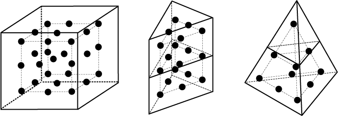

# 15.2.2 Finite element conversion to SPH particles


**Products: **Abaqus/Explicit  Abaqus/CAE  

##### **References**

- ["Continuum particle elements," Section 33.2.1](pt06ch33s02alm62.md)
- [*CONTACT](../key/key-link.md#usb-kws-hcontact)
- [*INITIAL CONDITIONS](../key/key-link.md#usb-kws-minitialcond)
- [*OUTPUT](../key/key-link.md#usb-kws-houtput)
- [*SECTION CONTROLS](../key/key-link.md#usb-kws-msectioncontrols)
- [*SOLID SECTION](../key/key-link.md#usb-kws-msolidsection)

### Overview

You can take advantage of the intrinsic strengths of both Lagrangian finite element and SPH methods when modeling a body. You can define the model with Lagrangian finite elements and convert them to SPH particles either at the beginning of an analysis or after the deformation becomes significant. It is sometimes easier to create the mesh with Lagrangian finite elements, and Lagrangian finite elements are often more accurate for small deformations. SPH methods are well suited for large deformation.

You start by defining a part as usual. You mesh the part with C3D8R, C3D6, or C3D4 reduced-integration elements or a combination of these elements. You then specify that these “parent” elements are to convert to internally generated SPH particles when a user-specified criterion is met. Gravity loads, contact interactions, initial conditions, mass scaling, and output requests associated with the parent elements or nodes of the parent elements will be transferred appropriately to the generated particles upon conversion in an intuitive way as explained below. A special formulation is used to ensure the smoothest possible transition between the two modeling methods. The technique can use any of the materials available in Abaqus/Explicit (including user materials). 

### Activating the conversion to SPH particles functionality

The element conversion to particles functionality is not active by default. The conversion functionality is intended to be used when the deformations in the original finite element mesh are significant and elements may distort. Traditionally, in such cases deletion of the soon-to-be distorted Lagrangian elements would be the only choice to allow the analysis to continue. Converting to SPH particles offers an improvement over the element deletion option because the generated particles are able to provide resistance to deformation beyond finite element distortion levels. Consequently, element deletion cannot be used together with element conversion. 

You can control the number of particles generated per parent element and choose between one of four criteria to specify when the conversion is to be triggered.

| **Input File Usage: ** | ``` [*SECTION CONTROLS](../key/key-link.md#usb-kws-msectioncontrols), ELEMENT CONVERSION=YES ``` |
| --- | --- |

| **Abaqus/CAE Usage: ** | Mesh module: ****Mesh****Element Type****: **Conversion to particles**: **Yes** |
| --- | --- |

#### Specifying the number of particles to be generated

By default, one particle is generated per parent element. You can control the number of particles generated per element by specifying the number of particles to be generated per parent element isoparametric direction. The total number of particles generated per element depends on the element type that is being converted. For example, if you specify 3 particles to be generated per isoparametric direction, upon conversion 27 particles would be generated from a C3D8R element, 18 from a C3D6 element, and 10 from a C3D4 element, as illustrated in [Figure 15.2.2--1](pt04ch15s02aus96.md#asphconversion-particles). A maximum value of seven particles per direction can be specified. The particles are evenly spaced inside the parent element such that they fill the volume as uniformly as possible. For example, if cubic parent elements are stacked in the user-defined mesh, the particles would be evenly spaced throughout the part.

**Figure 15.2.2–1** Internally generated particles per parent element illustrated for three particles per isoparametric direction.



You can control the number of particles generated per isoparametric direction as discussed in ["Using section controls to convert continuum elements to particles" in "Section controls," Section 27.1.4](pt06ch27s01aus113.md#usb-elm-esectioncontrol-sphconvert).

#### Time-based criterion

You can specify the time when the conversion of all the elements in the affected element set is to take place regardless of the deformation levels. This option is intended for applications where the SPH functionality is the preferred modeling method, such as fluid sloshing in a tank or a synthetic bird strike on an aircraft. If the conversion time is specified as zero, the conversion takes place at the beginning of the analysis. For example, fluid sloshing is a good candidate for using a time-based criterion if sloshing is expected to start at the beginning of the analysis. You can specify a later time at which the conversion takes place if extreme deformations do not occur until later in the analysis. A bird strike analysis is a potential candidate as the bird might travel for some time without any deformation prior to hitting the intended target.

You can control the time when the conversion is to occur as discussed in ["Using section controls to convert continuum elements to particles" in "Section controls," Section 27.1.4](pt06ch27s01aus113.md#usb-elm-esectioncontrol-sphconvert).

#### Strain-based criterion

You can specify the absolute value of the maximum principal strain when the conversion of a given element is to take place. As elements deform, if the absolute value of the maximum principal strain is greater than the specified threshold, the parent elements will convert progressively to SPH particles. This option is intended for applications where the finite element method is the preferred modeling method but severe deformations could occur in certain regions. Examples include blast applications and crushing. 

You can control the strain-based threshold upon which conversion is to occur as discussed in ["Using section controls to convert continuum elements to particles" in "Section controls," Section 27.1.4](pt06ch27s01aus113.md#usb-elm-esectioncontrol-sphconvert).

#### Stress-based criterion

You can specify the absolute value of the maximum principal stress value at which the conversion of a given element takes place. As elements deform, if the absolute value of the maximum principal stress is greater than the specified threshold, the parent elements will convert progressively to SPH particles. This option is intended for the same candidate applications as those discussed for the strain-based criterion.

You can control the stress-based threshold upon which conversion is to occur as discussed in ["Using section controls to convert continuum elements to particles" in "Section controls," Section 27.1.4](pt06ch27s01aus113.md#usb-elm-esectioncontrol-sphconvert).

#### User subroutine--based criterion

The user subroutine–based criterion provides the flexibility of a user subroutine implementation that allows you to implement your own conversion criterion. Element conversion can be controlled during the course of an Abaqus/Explicit analysis through any of the user subroutines that can actively modify state variables associated with a material point, such as [`VUSDFLD`](../sub/sub-link.md#sub-xsl-vusdfld) and [`VUMAT`](../sub/sub-link.md#sub-xsl-vumat). You specify the state variable number controlling the element conversion flag. For example, specifying a state variable number of two indicates that the second state variable is the conversion flag in the user subroutine. The conversion state variable should be set to a value of one or zero. A value of one indicates that the element is active, while a value of zero indicates that Abaqus/Explicit should convert the element to particles. Since user subroutines have access via arguments (or in the case of the [`VUSDFLD`](../sub/sub-link.md#sub-xsl-vusdfld) subroutine via utility routines) to material point state data, the functionality provides a comprehensive means to define the conversion state variable.

| **Input File Usage: ** | Use the following options to define a user subroutine--based conversion criterion: |
| --- | --- |
|  | ``` [*SECTION CONTROLS](../key/key-link.md#usb-kws-msectioncontrols), ELEMENT CONVERSION=YES,CONVERSION CRITERION=USER ... [*MATERIAL](../key/key-link.md#usb-kws-mmaterial) [*DEPVAR](../key/key-link.md#usb-kws-mdepvar), CONVERT=*variable number* ``` |

| **Abaqus/CAE Usage: ** | Specifying a user subroutine--based criterion for element conversion is not supported in Abaqus/CAE. |
| --- | --- |

### Conversion to particles formulation

When using the conversion technique, particles are generated internally at the beginning of the preprocessing phase of the analysis, and they are placed in an inactive or dormant state. The particles are attached to the parent elements in a similar fashion as the nodes of embedded elements are attached (see ["Embedded elements," Section 35.4.1](pt08ch35s04aus136.md)), and they follow the motion of the parent element nodes in an average sense. The inertial properties of the particles in this inactive state (while the parent finite elements are active) are automatically disregarded to avoid doubling the momentum at a given location. Similar to SPH particles defined directly as PC3D elements, particles generated from parent element sets associated with different section definitions will not interact with each other.

Upon conversion a number of internally generated particles per parent element are activated, as illustrated for various element types in [Figure 15.2.2--1](pt04ch15s02aus96.md#asphconversion-particles). The computational cost of the analysis can increase significantly after conversion takes place if a large number of particles are generated per element since a larger number of active elements needs to be processed. In addition, the computational cost increases because the stable time increment associated with the internally generated particles decreases as the particle density increases.

Upon conversion the state information (such as stress or equivalent plastic strain) associated with the element being converted is transferred to the generated particles to ensure the smoothest possible transition. The activated particles will interact via the SPH formalism with both the previously activated particles and the neighboring inactive particles that are still embedded in active parent elements.

### Automatically generated sets and surfaces

Since the particles are generated internally, you do not have the ability to define element sets, node sets, or surfaces associated with these particles. Consequently, a number of sets and surfaces are created internally for convenience. You can visualize these internal sets and surfaces via the usual techniques. [Table 15.2.2--1](pt04ch15s02aus96.md#sphconv-elset), [Table 15.2.2--2](pt04ch15s02aus96.md#sphconv-nset), and [Table 15.2.2--3](pt04ch15s02aus96.md#sphconv-surf) describe the internally generated sets and surfaces.

**Table 15.2.2–1** Internally generated element sets.
| Internally generated element set | Description |
| --- | --- |
| ALL_GENERATED_ELEMENTS_SPH | All generated SPH particles in the entire model |
| ALL_PARENT_ELEMENTS_SPH | All parent elements in the entire model |
| *UserDefinedElsetName*_SECT_SPH | All generated particles associated with the *UserDefinedElsetName* element set used in the section definition |
| *UserDefined_AElsetName*_SPH | All generated particles associated with the element set *UserDefined_AElsetName* |

**Table 15.2.2–2** Internally generated node sets.
| Internally generated node set | Description |
| --- | --- |
| ALL_PARENT_ELEMENT_NODES_E_SPH | All nodes of all parent elements in the entire model |
| ALL_GENERATED_NODES_SPH | All nodes of all generated particles in the entire model |
| *UserDefinedElsetName*_SECT_E_SPH | All nodes of generated particles associated with the *UserDefinedElsetName* element set used in the section definition |
| *UserDefined_ANsetName*_SPH | Nodes of generated particles from parent elements touching nodes of the *UserDefined_ANsetName* node set |

**Table 15.2.2–3** Internally generated surfaces.
| Internally generated surfaces | Description |
| --- | --- |
| *UserDefinedElsetName*_PARENT_EE_SPH | Element-based surface containing all facets of all elements associated with the *UserDefinedElsetName* element set used in the section definition |
| *UserDefinedElsetName*_SECT_NE_SPH | Node-based surface with all nodes of all generated particles associated with the *UserDefinedElsetName* element set used in the section definition |
| *UserDefinedSurfaceName*_NS_SPH | Node-based surface containing all nodes of generated particles associated with the elements used in the definition of the *UserDefinedSurfaceName* element-based surface |

These sets and surfaces are used by features that are automatically generated internally, such as loads, initial conditions, mass scaling, contact definitions, and output requests. These internally generated features extend the features that you have defined for the associated parent sets and surfaces to internally generated particles. In all cases the internally generated features preserve the attributes that you have defined. 

### Initial conditions

Initial conditions (see ["Initial conditions in Abaqus/Standard and Abaqus/Explicit," Section 34.2.1](pt07ch34s02aus116.md)) cannot be specified directly for the generated particles. However, a subset of the possible initial conditions (stresses, velocity and rotating velocity) is applied to the generated particles automatically. You specify these initial conditions on the original element or node set you have defined in the model, and they are applied appropriately to the associated generated particles. The initial conditions are applied via the internally created sets described above; hence, you must use an element or node set rather than element or node numbers when applying initial conditions.

Initial stresses specified on parent elements are applied to the generated particles. This feature is leveraged in cases where parent elements convert to particles at the very beginning of the analysis (time zero). All other initial conditions associated with elements are taken into account for the generated particles as long as the parent elements convert to particles after the first increment in the analysis. The state transfer mechanism described above appropriately transfers the information to particles and, hence, initial conditions are accounted for correctly in the particles. 

### Boundary conditions

Boundary conditions (see ["Boundary conditions in Abaqus/Standard and Abaqus/Explicit," Section 34.3.1](pt07ch34s03aus118.md)) cannot be applied directly to the generated particles. Boundary conditions applied to nodes of the parent elements are not transferred to the generated particles. However, you can use contact interactions to enforce boundary conditions as explained in ["Interactions](pt04ch15s02aus96.md#usb-anl-asphconv-int).”

Temperature and field variables specified on node sets that include parent element nodes are extended to the generated particles. Abaqus/Explicit generates corresponding temperature and field variables definitions internally via the internal node sets described in ["Automatically generated sets and surfaces](pt04ch15s02aus96.md#usb-anl-asphconvgenset).” If all of the nodes of a particular parent element have the same value at a given time, the generated particles would have that same value as well. If different values are specified, no interpolation occurs. Instead, the value of the last definition is used.

### Loads

The loading types available for an explicit dynamic analysis are explained in ["Applying loads: overview," Section 34.4.1](pt07ch34s04aus120.md). Concentrated nodal loads cannot be applied to generated particles. Gravity loads specified on the parent elements are the only distributed loads that are transferred upon conversion to the generated particles.

### Material options

Any of the material models in Abaqus/Explicit can be used with the conversion technique.

### Elements

When using the conversion technique and C3D8R, C3D6, and/or C3D4 reduced-integration parent elements to define the part, PC3D elements are generated internally at the beginning of the analysis; the parent elements are active, and the PC3D elements are inactive. Upon conversion the active status switches. At no time are a parent element and the associated generated particles both active. By default, the Visualization module automatically displays only the elements that are active at any given time.

Particle mass (and volume) is computed automatically from the mass (volume) of the parent element. All particles associated with a specific parent element will have the same mass (volume). The SPH smoothing length and domain required for the SPH formalism are computed in the same fashion as in the case when you define PC3D elements directly (see ["Smoothed particle hydrodynamics," Section 15.2.1](pt04ch15s02aus95.md)).

If mass scaling is defined on element sets containing parent elements, Abaqus/Explicit internally generates mass scaling definitions associated with the corresponding internal element sets described in ["Automatically generated sets and surfaces](pt04ch15s02aus96.md#usb-anl-asphconvgenset).”

### Constraints

 Constraints such as couplings or ties cannot be applied directly to the generated particles. However, constraints can be defined on nodes and surfaces associated with the parent element nodes and faces. If such constraints are used to attach parent elements to other Lagrangian bodies or they are used to drive the motion of a part, care must be exercised when the parent element faces involved in such constraints convert to particles. The constraint may be nullified upon parent element conversion and, consequently, the connection to other parts (in the case of tie constraints) or to the driving feature (in the case of coupling constraints) would no longer be realized. Hence, in certain cases you may need to place these constraints far enough from the parent elements that can convert for the constraints to be active throughout the analysis.

Element sets that are marked for possible conversion to particles but that are also part of the rigid body definition will never convert because the rigid body constraint is always enforced on the parent elements.

### Interactions

Bodies modeled with elements that may convert to particles can interact with other finite element–meshed or analytical bodies via contact. Upon conversion the internally generated particles may also interact via contact with these bodies but only via the general contact functionality. 

By default, if general contact interactions are included in your model, contact inclusions and exclusions involving internal node-based surfaces associated with the internal particles are generated. User-specified contact inclusions and exclusions referencing element-based surfaces that include convertible elements will also be reflected in internally generated requests. [Table 15.2.2--4](pt04ch15s02aus96.md#sphconvcontincl) and [Table 15.2.2--5](pt04ch15s02aus96.md#sphconvcontexcl) show all correspondences. The naming convention used for the internally generated surfaces is explained in ["Automatically generated sets and surfaces](pt04ch15s02aus96.md#usb-anl-asphconvgenset)” above. 

**Table 15.2.2–4** Internally generated contact inclusions.
| User-defined contact inclusion | Internally generated contact inclusions |
| --- | --- |
| [*CONTACT INCLUSIONS](../key/key-link.md#usb-kws-hcontactinclusions), ALL EXTERIOR | *blank*, *AllUserElsets*_SECT_NE_SPH |
| *blank*, *UserElemBased* | *blank*, *UserElemBased*_NS_SPH |
| *UserElemBased*, | None |
| *UserElemBased1*, *UserElemBased2* | *UserElemBased1*, *UserElemBased2*_NS_SPH and *UserElemBased2*, *UserElemBased1*_NS_SPH |

**Table 15.2.2–5** Internally generated contact exclusions.
| User-defined contact exclusion | Internally generated contact exclusions |
| --- | --- |
| Always, regardless of user definitions | *UserElemBased*_PARENT_EE_SPH, *UserElemBased*_SECT_NE_SPH |
| *blank*, *UserElemBased* | *blank*, *UserElemBased*_NS_SPH |
| *UserElemBased*, | None |
| *UserElemBased1*, *UserElemBased2* | *UserElemBased1*, *UserElemBased2*_NS_SPH and *UserElemBased2*, *UserElemBased1*_NS_SPH |

As shown in the second row of [Table 15.2.2--5](pt04ch15s02aus96.md#sphconvcontexcl), contact between the generated particles and the faces of the associated parent elements is always excluded from the general contact domain. The activated internal particles will interact with the neighboring yet inactive particles still attached to parent elements with exposed faces via the SPH formalism.

The contact interaction for the generated particles is the same as any contact interaction between a node-based surface (associated with the internal particles) and an element-based or analytical surface. All interaction types and formulations available for contact involving a node-based surface are allowed, including cohesive behavior. Different contact properties can be assigned via the usual options. The contact control and property assignment options used for pairs of surfaces that involve parent elements that can convert to particles will be reflected in internally generated assignments for the internal particle-based surfaces. [Table 15.2.2--6](pt04ch15s02aus96.md#sphconvcontassign) shows the internally generated assignments associated with user-defined requests.

**Table 15.2.2–6** Internally generated contact control and property assignments.
| User-defined contact inclusion | Internally generated contact inclusions |
| --- | --- |
| *blank*, *blank* | *blank*, *AllUserElsets*_SECT_NE_SPH |
| *blank*, *UserElemBased* | *blank*, *UserElemBased*_NS_SPH |
| *UserElemBased*, | *UserElemBased*, *UserElemBased*_NS_SPH |
| *UserElemBased1*, *UserElemBased2* | *UserElemBased1*, *UserElemBased2*_NS_SPH and *UserElemBased2*, *UserElemBased1*_NS_SPH |

The generated particles may have different contact thicknesses since they are computed automatically at the beginning of the analysis. If one or two particles per isoparametric direction are requested to be generated upon conversion, all generated particles will have a contact thickness such that they are barely touching the closest face of the parent element. If three or more particles per direction are requested, some of the particles will not be touching the faces of the parent element. For these particles, the contact thickness will be the minimum thickness of all of the particles that are touching the parent element faces on that parent element. 

You can specify the contact thickness of the generated particles by using the surface property assignment option for an element-based surface that includes the faces of the parent elements. This modeling choice affects contact interactions on parent elements before they convert.

### Output

Output requests associated with parent elements, nodes of parent elements, or contact involving faces of parent elements trigger the creation of output requests associated with the corresponding internally generated particles. For example, if you request element output for an element set that contains parent elements, Abaqus/Explicit automatically creates an additional element output request using the corresponding internal element set containing generated particles, as described in ["Automatically generated sets and surfaces](pt04ch15s02aus96.md#usb-anl-asphconvgenset).”

A field output request for the STATUS  output variable is created automatically for all parent elements and generated particles. The value of the STATUS  output variable is toggled automatically between a value of zero and one upon conversion for both parent and generated particles. By default, only the active elements are displayed in the Visualization module. In addition, contour and vector plots are displayed appropriately on the elements that are currently active.

History output requests are also replicated for the generated particles. Since the actual element or node numbers of generated particles are defined internally, you can query the actual number of a particle in the Visualization module before identifying which output curve to display. For example, assume that you requested equivalent plastic strain history output for a small element set containing three C3D8R parent elements and that you requested that two particles per isoparametric direction (eight particles per parent element) are to be generated upon conversion. Before conversion you would have 3 curves to analyze; but after the three elements are converted, there are 24 curves from which to choose. You can query the element number of a particle and then select that curve from the 24 available history curves. Before conversion the curves associated with the particles have a value of zero. Upon conversion there will be a jump to the equivalent plastic strain value at the current time.

### Limitations

Analyses involving finite element conversion to SPH particles are subject to the following limitations: 		
- Only reduced-integration continuum elements C3D8R, C3D6, and C3D4 are available for conversion.
- Surface loads specified on the faces of parent elements that convert during the analysis are not applied after conversion to particles. However, distributed loads, such as pressure, can be applied to other finite element surfaces that do not convert (e.g., on a piston surface) that can apply a pressure onto the particle elements (e.g., the fluid pushed by the piston) via contact interactions.
- Bodies modeled with elements that may convert to particles that were not defined using the same section definition will not interact with each other between the converted portions of the bodies. For example, body A and body B allow elements to convert to particles, but these elements are associated with different section definitions. After conversion, the particles will not interact.
- Within a given body (part) defined via one solid section definition, gravity loads and mass scaling cannot be specified selectively on a subset of elements referenced by this definition. Instead, the two features must be applied to all the elements in the element set associated with the solid section definition.
- Progressive conversion of finite elements into SPH particles during an analysis (based on strain, stress, or user-defined criterion) should be used only in applications that are inertia dominated and for which at any point during the analysis the strain energy is a small percentage of the total energy in the system. Specifically, progressive conversion should be used only in applications involving severe deformations, such as hypervelocity impact, blast, and crushing.

### Input file template

The following example illustrates a smoothed particle hydrodynamic analysis of a bottle filled with fluid being dropped on the floor using the conversion technique. The plastic bottle and the floor are modeled with conventional shell elements. The fluid is modeled with C3D4 elements that will convert to two particles per isoparametric direction (four particles per element) at the beginning of the analysis based on a time-based criterion. Material property definitions are defined as usual for both the fluid and the bottle. Contact interaction is defined using the default options. Output is requested for stresses (pressure) and density in the fluid.

```
[*HEADING](../key/key-link.md#usb-kws-mheading)
…
[*ELEMENT](../key/key-link.md#usb-kws-melement), TYPE=C3D4, ELSET=Fluid_Inside_The_Bottle
…
[*SOLID SECTION](../key/key-link.md#usb-kws-msolidsection), ELSET=Fluid_Inside_The_Bottle, MATERIAL=Water,
CONTROLS=Time_Based_Conversion
[*SECTION CONTROLS](../key/key-link.md#usb-kws-msectioncontrols), ELEMENT CONVERSION=YES,
CONVERSION CRITERION=TIME, NAME=Time_Based_Conversion
*First data line*
*Second data line*
*Third data line*
2, 0.0
[*MATERIAL](../key/key-link.md#usb-kws-mmaterial), NAME=Water
*Material definition for water, such as an EOS material*
[*ELEMENT](../key/key-link.md#usb-kws-melement), TYPE=S4R, ELSET=Plastic_Bottle
*Element definitions for the shells*
**
[*INITIAL CONDITIONS](../key/key-link.md#usb-kws-minitialcond), TYPE=VELOCITY
*Data lines to define velocity initial conditions*
**
[*STEP](../key/key-link.md#usb-kws-hstep)
[*DYNAMIC](../key/key-link.md#usb-kws-hdynamic), EXPLICIT
[*DLOAD](../key/key-link.md#usb-kws-hdload)
*Data lines to define gravity load*
**
[*CONTACT](../key/key-link.md#usb-kws-hcontact)
[*OUTPUT](../key/key-link.md#usb-kws-houtput), FIELD
[*ELEMENT OUTPUT](../key/key-link.md#usb-kws-helementoutput), ELSET=Fluid_Inside_The_Bottle
S, DENSITY
[*END STEP](../key/key-link.md#usb-kws-hendstep)
```


