# 19.1.1 Design sensitivity analysis


**Product: **Abaqus/Design  

##### **References**

- ["Parametric input," Section 1.4.1](pt01ch01s04aus04.md)
- ["Parametric shape variation," Section 2.1.2](pt01ch02s01aus06.md)
- [*STEP](../key/key-link.md#usb-kws-hstep)
- [*DESIGN PARAMETER](../key/key-link.md#usb-kws-mdesignparameter)
- [*DESIGN RESPONSE](../key/key-link.md#usb-kws-hdesignresponse)

### Overview

Design sensitivity analysis (DSA):
- is performed with Abaqus/Design, an add-on option for Abaqus/Standard;
- provides the sensitivities of responses with respect to specified design parameters;
- is available for static stress and frequency analysis using models that have only stress/displacement elements; and
- can include design parameters affecting: material properties (elastic, hyperelastic, and hyperfoam models); section properties; concentrated forces and moments; and nodal coordinates (and beam and shell normals if applicable).

### Design sensitivity analysis

The design sensitivity analysis (DSA) capability provides the derivatives of certain output variables with respect to specified design parameters. These derivatives are commonly referred to as *sensitivities*, because they provide a first-order measure of how sensitive the output variable is to a change in the design parameter. The output variables for which sensitivities are computed are called *design responses* or simply *responses*. Design parameters are chosen from a set of existing analysis parameters. As an example, you can choose to obtain the derivatives of stresses with respect to Young's modulus; stress is the response, and Young's modulus is the design parameter. The sensitivities are computed based on the direct differentiation method used in conjunction with the semi-analytical computational technique. In the semi-analytical technique some derivatives are computed using numerical (finite) differencing, thus requiring perturbations of the design parameters. For these derivatives by default Abaqus/Design will use a central differencing scheme and automatically determine appropriate perturbation sizes based on a heuristic algorithm. You can override these defaults by specifying the numerical differencing method and the perturbation sizes directly. A full discussion of DSA theory is given in ["Design sensitivity analysis," Section 2.18.1 of the Abaqus Theory Guide](../stm/stm-link.md#stm-anl-dsa).

### Activating DSA

You activate DSA on a step-by-step basis.

| **Input File Usage: ** | Use the following option to activate DSA in a particular step: |
| --- | --- |
|  | ``` [*STEP](../key/key-link.md#usb-kws-hstep), DSA=YES ``` |

#### Activating DSA in multiple steps

Once DSA is activated in a general step, it remains active in all subsequent general steps until it is deactivated in a subsequent general step. Once DSA is activated in a perturbation step, it remains active in all subsequent consecutive perturbation steps until it is deactivated in a subsequent consecutive perturbation step. However, if DSA is activated in a step whose procedure is not supported for DSA, DSA will be deactivated until it is activated again.

| **Input File Usage: ** | Use the following option to deactivate DSA in a particular step: |
| --- | --- |
|  | ``` [*STEP](../key/key-link.md#usb-kws-hstep), DSA=NO ``` |

### Specifying design parameters

You can define multiple parameters to be used in place of Abaqus input quantities for an analysis. You must indicate which of these parameters are to be considered as design parameters.

| **Input File Usage: ** | Use the following option to define analysis parameters: |
| --- | --- |
|  | ``` [*PARAMETER](../key/key-link.md#usb-kws-mparameter) *par1*=*x* *par2*=*y*  ``` Use the following option to specify the design parameters: ``` [*DESIGN PARAMETER](../key/key-link.md#usb-kws-mdesignparameter) *par1*, *par2*,  ``` |

#### Restrictions on design parameters

The following are restrictions on design parameters:
- Design parameters can be associated only with floating point data. The following analysis components can include design-dependent data: - Beam sections integrated during analysis (["Using a beam section integrated during the analysis to define the section behavior," Section 29.3.6](pt06ch29s03alm11.md)) - Concentrated loads (["Concentrated loads," Section 34.4.2](pt07ch34s04aus121.md)) - Elastic materials (["Linear elastic behavior," Section 22.2.1](pt05ch22s02abm02.md)) - Friction (["Frictional behavior," Section 37.1.5](pt09ch37s01aus169.md)) - Gasket sections (["Gasket elements: overview," Section 32.6.1](pt06ch32s06abo30.md)) - Hyperelastic materials (["Hyperelastic behavior of rubberlike materials," Section 22.5.1](pt05ch22s05abm07.md)) - Hyperfoam materials (["Hyperelastic behavior in elastomeric foams," Section 22.5.2](pt05ch22s05abm08.md)) - Membrane sections (["Membrane elements," Section 29.1.1](pt06ch29s01alm05.md)) - Local orientations (["Orientations," Section 2.2.5](pt01ch02s02aus15.md)) - Shell sections integrated during analysis (["Using a shell section integrated during the analysis to define the section behavior," Section 29.6.5](pt06ch29s06alm19.md)) - Solid sections (["Solid (continuum) elements," Section 28.1.1](pt06ch28s01alm01.md)) - Transverse shear stiffnesses (["Choosing a beam element," Section 29.3.3](pt06ch29s03alm08.md), or ["Shell section behavior," Section 29.6.4](pt06ch29s06alm18.md))
- Shape design parameters (i.e., design parameters that affect nodal coordinates and beam and/or shell normals) can be used only in conjunction with parametric shape variations (see ["Parametric shape variation," Section 2.1.2](pt01ch02s01aus06.md)).
- Design parameters must be mutually independent.
- Design parameters cannot be tabularly dependent (see ["Parametric input," Section 1.4.1](pt01ch01s04aus04.md)).

### Specifying responses

Response requests are specified using a syntax analogous to that for specifying output requests to the output database. Except for eigenvalues and eigenfrequencies, there are no default responses—if no responses are requested, no response sensitivities will be output. If DSA is active in a frequency step, eigenvalue and eigenfrequency sensitivities will be output automatically. Specifying a response will cause output of both the response and the response sensitivities.

| **Input File Usage: ** | Use the following options to request design responses: |
| --- | --- |
|  | ``` [*DESIGN RESPONSE](../key/key-link.md#usb-kws-hdesignresponse), FREQUENCY=*interval*, MODE LIST [*CONTACT RESPONSE](../key/key-link.md#usb-kws-hcontactresponse), MASTER=*master name*, NSET=*nset name*, SLAVE=*slave name* [*ELEMENT RESPONSE](../key/key-link.md#usb-kws-helementresponse), ELSET=*elset name* [*NODE RESPONSE](../key/key-link.md#usb-kws-hnoderesponse), NSET=*nset name* ``` |

#### Requesting responses in multiple steps

Unless respecified, response requests defined in a step propagate to subsequent steps according to the following rules: 

1. Requests in general steps propagate to subsequent general steps.
2. Requests in linear perturbation steps propagate to subsequent consecutive linear perturbation steps.
3. When a non-DSA step appears between DSA steps, the responses must be respecified in the DSA step following the non-DSA step.

#### Restrictions on responses

The available responses are a subset of the existing output variables. The valid responses based on procedure type are described below.
- For static steps the valid responses are: - Node responses: U and RF - Element responses: S, SF, SINV, SP, E, SE, EP, EE, EEP, LE, LEP, NE, NEP, ENER, ELEN, EVOL, and MASS - Contact responses: CSTRESS and CDISP
- For frequency steps the valid responses are: - Node responses: None - Element responses: MASS - Contact responses: None - Eigenvalue (EIGVAL) and eigenfrequency (EIGFREQ) sensitivities are output automatically.

### Specifying design gradients of design-dependent input data

The DSA calculations require the gradients of the design-dependent input data with respect to the design parameters. For example, if Poisson's ratio, , is made dependent on a design parameter, say *h*, the gradient 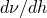 is required. Design gradients with respect to shape design parameters are specified differently than those with respect to other design parameters.

#### Specifying design gradients with respect to shape design parameters

Gradients with respect to shape design parameters must be specified using a parametric shape variation definition (see ["Parametric shape variation," Section 2.1.2](pt01ch02s01aus06.md)). For the purposes of DSA if the parameter to which the shape variation data refer is a design parameter, the shape variation data are interpreted as the gradients of the nodal coordinates with respect to the design parameter. If a nonzero value is given for the shape parameter, Abaqus/Design will also perturb the base coordinates.

| **Input File Usage: ** | Use the following option to specify the design gradients for shape design parameters: |
| --- | --- |
|  | ``` [*PARAMETER SHAPE VARIATION](../key/key-link.md#usb-kws-mparametershape), PARAMETER=*design parameter* ``` |

#### Specifying gradients for non-shape design parameters

For non-shape design parameters, by default Abaqus/Design will use numerical differentiation to calculate design gradients based on the information you provide. However, you can override this default behavior by specifying the gradients directly using Python expressions (see ["Parametric input," Section 1.4.1](pt01ch01s04aus04.md)). You specify a design parameter as the independent parameter and a list of the parameters that depend on that design parameter. Only one independent (design) parameter can be given for each design gradient definition.

| **Input File Usage: ** | Use the following option to specify the design gradients for non-shape design parameters: |
| --- | --- |
|  | ``` [*DESIGN GRADIENT](../key/key-link.md#usb-kws-mdesigngradient), INDEPENDENT=*design parameter*, DEPENDENT=*(list of dependent parameters)* ``` |

### History dependence and formulation type in a multi-increment analysis

Both total and incremental formulations are implemented for DSA. The choice of formulation depends on whether or not an analysis is history dependent. Below is a brief description of these formulation types. A more detailed discussion can be found in ["Design sensitivity analysis," Section 2.18.1 of the Abaqus Theory Guide](../stm/stm-link.md#stm-anl-dsa). By default, the incremental DSA formulation is used. You can specify the DSA formulation only for the entire model; this specification is ignored if given as part of a step definition.

#### Incremental DSA formulation

In the incremental formulation the problem is assumed to be history dependent. Abaqus/Design solves for the incremental displacement sensitivities, and the total displacement sensitivity is updated at the end of the increment. Due to the history dependence, the incremental displacement sensitivities for the current increment depend on the sensitivities of the state variables at the beginning of the increment, in the same sense that incremental displacements depend on the state variables at the beginning of the increment for equilibrium analyses. Thus, Abaqus/Design must also compute and update state variable sensitivities in each increment. Consequently, DSA must be activated for *all* steps up to the last step in which DSA is active, and the DSA calculations will be done at *all* increments in these steps, regardless of whether or not a design response is requested for a given step. If a response is requested for a step, the specified response frequency is ignored for the purposes of the DSA calculations (the frequency at which the output is written will still be governed by the specified response frequency).

The disadvantage of the incremental DSA formulation is its cost, due to the necessity of computing both state variable and incremental displacement sensitivities at each increment prior to the last DSA increment. This increased cost is unavoidable if the problem is history dependent but is unnecessary if the problem is history independent. Thus, the total DSA formulation should be chosen for problems that are not history dependent.

| **Input File Usage: ** | ``` [*DSA CONTROLS](../key/key-link.md#usb-kws-mdsacontrols), FORMULATION=INCREMENTAL ``` |
| --- | --- |

#### Total DSA formulation

In the total displacement formulation the total displacement sensitivities are calculated directly based on the assumption that the problem is not history dependent. In other words, the displacement sensitivities do not depend on sensitivity results calculated in previous increments. Thus, the advantage of the total formulation is that the sensitivity calculations need only be done at increments of interest. You can control when DSA calculations are done by activating DSA for only the desired steps and specifying the desired frequency for each design response request.

You may choose to use the total DSA formulation in problems that are known to be history dependent. However, in this case the DSA solution is approximate, with the degree of approximation increasing as the problem becomes more strongly history dependent. To assess the validity of using the total DSA formulation, it is recommended that you run both an incremental and total sensitivity analysis for a typical problem and compare the results.

| **Input File Usage: ** | ``` [*DSA CONTROLS](../key/key-link.md#usb-kws-mdsacontrols), FORMULATION=TOTAL ``` |
| --- | --- |

### DSA in linear perturbation steps

The sensitivity of the perturbation response can be calculated in a linear perturbation step (see ["General and linear perturbation procedures," Section 6.1.3](pt03ch06s01aus44.md)). The perturbation response will include the effects of stress and load stiffening in the base state if geometric nonlinearity is considered. Since we need to calculate the sensitivity of an incremental (perturbation) response, the sensitivity of the stress and load stiffening effects must be known at the end of the base step. Thus, if geometric nonlinearity is considered in the base step, DSA must also be active in the base step, irrespective of the type of formulation (total or incremental).

### Determination of design parameter perturbation sizes

The basis of the semi-analytic technique is the use of numerical differencing to obtain derivatives of certain element vectors and matrices (see ["Design sensitivity analysis," Section 2.18.1 of the Abaqus Theory Guide](../stm/stm-link.md#stm-anl-dsa)). Abaqus/Design will automatically determine appropriate perturbation sizes to be used in the semi-analytic technique unless you specify them directly. Abaqus/Design determines the perturbation sizes using a heuristic perturbation sizing algorithm based on the behavior of a scalar *s* associated with an element. By default, the perturbation sizing algorithm is applied only for the first increment (static procedure) or first mode (frequency procedure) in each step for which DSA is active. The perturbation sizes are then reused for the remaining increments or modes in the step for which DSA calculations are done.

The goal of the algorithm is to find perturbation sizes that are optimal for numerical differencing. Differencing formulas are based on Taylor series expansions, and the order of approximation of the derivative to be computed is reflected in the terms that are neglected in the series. The accuracy of the approximated derivatives often depends strongly on the perturbation size used in the differencing formula. Choosing a perturbation size that is too large will cause a truncation error, which occurs when the order of approximation is no longer valid (i.e., as a result of truncating higher-order terms in the Taylor series). A perturbation size that is too small will lead to inaccuracies in the differencing operations due to round-off, typically referred to as a cancellation error.

The algorithm attempts to find perturbation sizes giving the best compromise between cancellation and truncation errors by observing the behavior of *s*. For each design parameter *s* is computed for perturbation sizes spanning several orders of magnitude. The error in *s* between consecutive perturbation sizes is calculated as 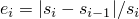. The perturbation size yielding an acceptable error, , is chosen as the best perturbation size.

This scalar *s* is selected as follows:
- Static procedure. For static steps *s* is chosen as the norm of the element pseudoload (the partial derivative of the element residual with respect to the design parameters).
- Frequency procedure. For frequency steps *s* is computed from the element contribution to a matrix involving the derivatives of the mass and stiffness matrices (namely , where  is the stiffness,  is the mass, *h* is the design parameter, and  is an eigenvalue). The scalar *s* is taken as the projection of this matrix onto an eigenvector . If the perturbation sizing algorithm is applied to a mode with a distinct eigenvalue,  is taken as the eigenvector associated with this mode. However, if a mode happens to be associated with a repeated eigenvalue,  is taken as the sum of all the eigenvectors associated with the repeated eigenvalue. Thus, the entire set of modes associated with a repeated eigenvalue will be treated simultaneously by the perturbation sizing algorithm (the eigenvalue sensitivities of a repeated eigenvalue are obtained simultaneously from the same reduced eigenvalue system).

See ["Design sensitivity analysis," Section 2.18.1 of the Abaqus Theory Guide](../stm/stm-link.md#stm-anl-dsa), for further details on the selection of *s*.

#### Controlling the numerical differencing behavior

You can control various aspects of the numerical differencing operations. These aspects are described in detail in the following sections. You can specify DSA controls for the entire model and/or for individual steps. Specifying these controls for the entire model has the effect of creating new default values for the various settings. When you specify these controls for individual steps, the following propagation rules are enforced:
- Once DSA controls are specified in a non-perturbation step, they remain in effect for all subsequent non-perturbation steps, unless they are respecified or reset.
- Once DSA controls are specified in a perturbation step, they remain in effect for all subsequent consecutive perturbation steps, unless they are respecified or reset.

#### Resetting DSA controls

You can reset DSA controls only for individual steps. If DSA controls are specified for the entire model, resetting them in a particular step will reset the numerical differencing behavior to the behavior specified for the entire model; otherwise, the behavior will be reset to the original default values. Any additional changes specified will be applied after the behavior is reset.

| **Input File Usage: ** | Use the following option to reset the DSA controls for a particular step: |
| --- | --- |
|  | ``` [*DSA CONTROLS](../key/key-link.md#usb-kws-mdsacontrols), RESET ``` |

#### Changing the defaults for the heuristic perturbation sizing algorithm

The following two sections describe how certain parameters associated with the perturbation sizing algorithm can be changed from their default values for purposes of computational efficiency and accuracy.

##### Changing the default tolerance

By default, the tolerance  is set to 1.0  104. Warning messages are written to the message file for elements for which this tolerance is not achieved. These elements are collected in element sets and can be viewed in the Visualization module of Abaqus/CAE. It is important to understand that this tolerance controls the effort expended in obtaining an optimum perturbation size; it is not a direct measure of the accuracy of the numerical differentiation.

| **Input File Usage: ** | Use the following option to override the default tolerance: |
| --- | --- |
|  | ``` [*DSA CONTROLS](../key/key-link.md#usb-kws-mdsacontrols), TOLERANCE=*tolerance* ``` |

##### Changing the frequency at which the perturbation sizing algorithm is used

Determining perturbation sizes using the heuristic algorithm is computationally intensive. You can specify the frequency at which the perturbation sizes are recalculated. For example, specifying a sizing frequency of *n* will cause Abaqus/Design to determine new perturbation sizes at every *n* increments or eigenmodes. The perturbation size will always be recalculated at the first increment or eigenmode in each step for which DSA is active, which is equivalent to specifiying a sizing frequency of 0. Since the perturbation sizing algorithm is computationally intensive, care should be exercised to ensure that the sizing frequency is as large as possible (or zero).

As discussed above, the perturbation sizing algorithm is applied simultaneously to all modes associated with a repeated eigenvalue. Thus, the actual number of modes associated with a repeated eigenvalue that are “hit” based on the sizing frequency is irrelevant, so long as it is at least one.

| **Input File Usage: ** | Use the following option to specify the frequency at which the perturbation sizes are recalculated: |
| --- | --- |
|  | ``` [*DSA CONTROLS](../key/key-link.md#usb-kws-mdsacontrols), SIZING FREQUENCY=*frequency* ``` |

#### Overriding the default heuristic perturbation sizing algorithm

If an appropriate perturbation size is already known for a particular design parameter (from previous analyses of similar problems, for example), economy can be gained by applying this perturbation size directly rather than having Abaqus/Design automatically find the perturbation size. You can specify either forward differencing or central differencing directly together with an absolute perturbation size for each design parameter. If you override the default algorithm, it is up to you to choose perturbation sizes that will lead to accurate sensitivities.

| **Input File Usage: ** | Use the following option to override the default heuristic perturbation sizing algorithm for a given design parameter: |
| --- | --- |
|  | ``` [*DSA CONTROLS](../key/key-link.md#usb-kws-mdsacontrols) *design parameter*, FD (forward differencing) or CD (central differencing), *absolute perturbation size* ``` For example, to specify an absolute perturbation size of 0.001 and forward differencing for design parameter `despar` use the following input: ``` [*DSA CONTROLS](../key/key-link.md#usb-kws-mdsacontrols) despar, FD, 0.001 ``` This data line is specified for each design parameter for which the default scheme is to be overridden. |

### Accuracy of the DSA solution

As can be seen in ["Design sensitivity analysis," Section 2.18.1 of the Abaqus Theory Guide](../stm/stm-link.md#stm-anl-dsa), the accuracy of the DSA solution is dictated by both the accuracy of the numerically computed derivatives and, for nonlinear static analysis, the accuracy of the tangent stiffness matrix. The accuracy of the numerically computed derivatives is governed by the semi-analytic DSA algorithm; you can control it by specifying DSA controls. In nonlinear static analysis DSA uses the tangent stiffness matrix formed during the last equilibrium iteration. It is possible that the accuracy of the tangent stiffness matrix needed to achieve an accurate equilibrium solution may be insufficient to achieve an accurate DSA solution. In such cases you can tighten the convergence tolerances during the equilibrium analysis so that a more accurate tangent stiffness matrix is obtained (see ["Commonly used control parameters," Section 7.2.2](pt03ch07s02aus50.md)). Furthermore, an accurate equilibrium solution often can be obtained when unsymmetric terms in the tangent stiffness are ignored (i.e., the unsymmetric matrix storage and solution scheme is not used; see ["Defining an analysis," Section 6.1.2](pt03ch06s01abo05.md)). However, even if mildly unsymmetric stiffness terms are neglected, the DSA solution may be inaccurate. Therefore, it is recommended that the unsymmetric solution scheme be used for DSA when the tangent stiffness matrix is known to be unsymmetric.

In some cases a response at a certain instant in time may be discontinuous with respect to a design parameter. For example, at this point of discontinuity a variation in the design parameter may cause a node to come into contact, frictional behavior to change from sticking to sliding, or a material point to transition from elastic to inelastic behavior. Since the DSA calculations make use of numerical differencing, it is possible that the perturbation of the design parameter used in the differencing scheme may result in values of the response to be differenced that lie on opposite sides of the discontinuity. If this occurs, the accuracy of the computed derivative cannot be guaranteed. Mathematically speaking, the derivative (sensitivity) of the response with respect to the design parameter does not exist at the point of discontinuity. Practically speaking, it is unlikely that the response at any given instant will lie precisely on the discontinuity. In cases where the response is near a discontinuity, if you choose to use the default perturbation sizing algorithm, the algorithm will attempt to choose design parameter perturbation sizes such that the values of the perturbed responses remain on the same side of the discontinuity. In addition, for contact elements DSA calculations are not performed in increments in which the associated contact node is open. Typically, the global results in any increment are not affected by a few discontinuous points in the model.

### Design dependence and supported features

Responses depend on design parameters *explicitly* and *implicitly*. Implicit design dependence is the dependence on the design parameter through the solution variables; therefore, this type of dependence can be quantified only after the DSA solution is obtained (recall that the DSA solution is the total displacement sensitivity for the total formulation and the incremental displacement sensitivity for the incremental formulation). All other design dependencies are explicit, meaning that they can be resolved without knowing the DSA solution. The types of dependencies can be identified by looking at the form of the sensitivity of a response, say *r*, with respect to a design parameter, say *h*. This sensitivity is expressed as

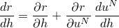

for the total formulation and

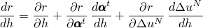

for the incremental formulation, where  is a displacement degree of freedom and  represents state variables at the beginning of the increment (see ["Design sensitivity analysis," Section 2.18.1 of the Abaqus Theory Guide](../stm/stm-link.md#stm-anl-dsa), for further details). The state variables include the displacements at the beginning of the increment. In both cases the last term on the right-hand side represents the implicit design dependence through the solution variables.

It is observed from the incremental equation above that the explicit design dependence consists of two terms. The first of these, 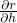, represents a *direct design dependence*, because this term arises from the direct dependence of the response on the design parameter. The second explicit term, 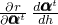, represents the dependence on the design parameter through the state variables at the beginning of the increment. For the total formulation, it is seen that the explicit term involves only direct design dependence.

Any feature for which direct design dependence calculations are implemented in Abaqus will be referred to as *supported* for DSA. Supported and unsupported features can be mixed in an analysis, unless the supported features cause unsupported features to become directly design dependent (an example of this would be making the Young's modulus for a frame element design dependent, since frames are not supported for DSA).

To make a clearer distinction between the types of design dependencies, consider the more concrete example of a linear elastic truss element, fixed at one end and pulled with a concentrated load at the other end. Let 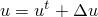 represent the displacement at the free end, *E* represent Young's modulus, and *L* represent the length of the truss. Consider the axial stress 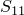 as the response. Although it is clear in this simple example that the stress can be computed easily as the load divided by the cross-sectional area, the finite element analysis computes the stress equivalently as 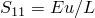. Choosing Young's modulus, *E*, as the design parameter, the stress sensitivity is given by


for the total formulation and

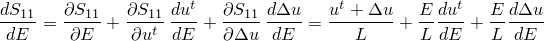

for the incremental formulation. This example is a valid analysis since elastic materials and truss elements are supported for DSA. Suppose now that a frame element is added, extending the length of the structure. If the frame element shares the same Young's modulus, the analysis becomes invalid since the dependency on the design parameter *E* causes the frame element, which is unsupported, to become directly design dependent (i.e., the term 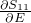 would need to be computed). On the other hand, if the frame uses a different modulus, say  that is not a design parameter, the analysis again becomes valid, since the frame no longer depends directly on the design parameter *E*.

### Contact interactions

Surface-based contact between deformable and rigid surfaces with small- or finite-sliding relative surface motion including friction is supported in a design sensitivity analysis. In all the friction models only the friction coefficients (no test data input) can be made design dependent. Shape design parameters are not valid for rigid surfaces. Contact between deformable surfaces is not supported.

### Restarting a design sensitivity analysis

A design sensitivity analysis can be restarted (see ["Restarting an analysis," Section 9.1.1](pt04ch09s01aus53.md)). However, DSA must have been active in the base analysis, and no design parameter or gradient data can be modified in the restart run. The restarted analysis will follow all the DSA propagation rules that are applicable to a regular analysis. For total formulation DSA, you may choose to activate or deactivate DSA in any new step that is added to the restart run. However, for the incremental formulation DSA must have been active in the step at which restart is attempted for you to continue doing DSA in the restarted analysis. 

### Procedures

DSA is available in the following analysis procedures:
- Frequency analysis
- Static stress analysis (including nonlinear geometric effects and contact)

The following analysis procedures and techniques are not supported:- Static stress analysis with the Riks method
- Substructuring
- Mesh modification or replacement
- Importing and transferring results
- Symmetric model generation and results transfer
- Contour integrals
- Cyclic symmetry in frequency procedures

#### Submodeling limitations

Design sensitivity analysis can be performed in both the global model and submodel, with the limitation that the DSA solution will not be interpolated from the global model to the submodel. This means that DSA is valid in the submodel only if the global solution that is interpolated onto the boundary of the submodel can be considered independent of the design parameters chosen for the submodel sensitivity analysis.

### Material options

The following material models are supported: 
- Isotropic, orthotropic, and anisotropic elasticity
- Hyperelasticity
- Hyperfoam

In these models only directly input material coefficients (not test data) can be made design dependent. If test data are specified, that material definition can be replaced by specifying the material coefficients calculated by Abaqus/Design directly. Supported and unsupported material models can be mixed in the same analysis.

### Elements

Solid, truss, shell, beam, gasket, and membrane stress/displacement elements are supported. Shell elements with five degrees of freedom per node cannot be used in a total DSA formulation. Supported and unsupported elements can be mixed in the same analysis.

### Output

The responses and response sensitivities (see ["Specifying responses](pt04ch19s01aus107.md#usb-anl-adsa-responses)” above) are output only to the output database (sensitivity output to the data file and results file is not supported). The names of the sensitivities are related to the names of the responses as follows:


For example, if the name of the response is S and the name of the design parameter is Young, the name of the sensitivity is d_S_Young.

### Input file template

```
[*HEADING](../key/key-link.md#usb-kws-mheading)
…
[*PARAMETER](../key/key-link.md#usb-kws-mparameter)
*Python expressions defining parameters.*
[*DESIGN PARAMETER](../key/key-link.md#usb-kws-mdesignparameter)
*List of independent parameters to be considered as design parameters.*
…
[*NODE](../key/key-link.md#usb-kws-mnode), NSET=*nset*
*Data lines to define the nodes.*
[*PARAMETER SHAPE VARIATION](../key/key-link.md#usb-kws-mparametershape), PARAMETER=*parameter*
*Data lines to define the gradients of coordinates with respect to the parameter.*
…
[*ELEMENT](../key/key-link.md#usb-kws-melement), TYPE=*solid element type*, ELSET=*elset_elastic*
*Data lines to define the elements.*
[*ELEMENT](../key/key-link.md#usb-kws-melement), TYPE=*solid element type*, ELSET=*elset_hyper*
*Data lines to define the elements.*
[*SOLID SECTION](../key/key-link.md#usb-kws-msolidsection), ELSET=*elset_elastic*, MATERIAL=*elastic*
[*SOLID SECTION](../key/key-link.md#usb-kws-msolidsection), ELSET=*elset_hyper*, MATERIAL=*hyper*
[*MATERIAL](../key/key-link.md#usb-kws-mmaterial), NAME=*elastic*
[*ELASTIC](../key/key-link.md#usb-kws-melastic)
*Data lines to define the elastic properties.*
[*MATERIAL](../key/key-link.md#usb-kws-mmaterial), NAME=*hyper*
[*HYPERELASTIC](../key/key-link.md#usb-kws-mhyperelast)
*Data lines to define the hyperelastic properties.*
…
[*STEP](../key/key-link.md#usb-kws-hstep),DSA
[*STATIC](../key/key-link.md#usb-kws-hstatic)
…
[*DESIGN RESPONSE](../key/key-link.md#usb-kws-hdesignresponse), FREQUENCY=*interval*
[*ELEMENT RESPONSE](../key/key-link.md#usb-kws-helementresponse), ELSET=*elset*
*Data lines to specify the element response identifier keys.*
[*NODE RESPONSE](../key/key-link.md#usb-kws-hnoderesponse), NSET=*nset*
*Data lines to specify the nodal response identifier keys.*
[*END STEP](../key/key-link.md#usb-kws-hendstep)
```


