# 21.1.2 Material data definition


**Products: **Abaqus/Standard  Abaqus/Explicit  Abaqus/CFD  Abaqus/CAE  

##### **References**

- ["Material library: overview," Section 21.1.1](pt05ch21s01abo18.md)
- ["Combining material behaviors," Section 21.1.3](pt05ch21s01aus110.md)
- [*MATERIAL](../key/key-link.md#usb-kws-mmaterial)
- ["Creating materials," Section 12.4.1 of the Abaqus/CAE User's Guide](../usi/usi-link.md#usi-prp-editor-material)

### Overview

A material definition in Abaqus: 
- specifies the behavior of a material and supplies all the relevant property data;
- can contain multiple material behaviors;
- is assigned a name, which is used to refer to those parts of the model that are made of that material;
- can have temperature and/or field variable dependence;
- can have solution variable dependence in Abaqus/Standard; and
- can be specified in a local coordinate system (["Orientations," Section 2.2.5](pt01ch02s02aus15.md)), which is required if the material is not isotropic.

### Material definitions

Any number of materials can be defined in an analysis. Each material definition can contain any number of material behaviors, as required, to specify the complete material behavior. For example, in a linear static stress analysis only elastic material behavior may be needed, while in a more complicated analysis several material behaviors may be required.

A name must be assigned to each material definition. This name allows the material to be referenced from the section definitions used to assign this material to regions in the model.

| **Input File Usage: ** | ``` [*MATERIAL](../key/key-link.md#usb-kws-mmaterial), NAME=*name* ``` |
| --- | --- |
|  | Each material definition is specified in a data block, which is initiated by a [*MATERIAL](../key/key-link.md#usb-kws-mmaterial) option. The material definition continues until an option that does not define a material behavior (such as another [*MATERIAL](../key/key-link.md#usb-kws-mmaterial) option) is introduced, at which point the material definition is assumed to be complete. The order of the material behavior options is not important. All material behavior options within the data block are assumed to define the same material. |

| **Abaqus/CAE Usage: ** | Property module: material editor: **Name**Use the menu bar under the **Material Options** list to add behaviors to a material. |
| --- | --- |

### Large-strain considerations

When giving material properties for finite-strain calculations, “stress” means “true” (Cauchy) stress (force per current area) and “strain” means logarithmic strain. For example, unless otherwise indicated, for uniaxial behavior


### Specifying material data as functions of temperature and independent field variables

Material data are often specified as functions of independent variables such as temperature. Material properties are made temperature dependent by specifying them at several different temperatures.

In some cases a material property can be defined as a function of variables calculated by Abaqus; for example, to define a work-hardening curve, stress must be given as a function of equivalent plastic strain.

Material properties can also be dependent on “field variables” (user-defined variables that can represent any independent quantity and are defined at the nodes, as functions of time). For example, material moduli can be functions of weave density in a composite or of phase fraction in an alloy. See ["Specifying field variable dependence](pt05ch21s01aus109.md#usb-mat-cmaterialdata-fvdepen)” for details. The initial values of field variables are given as initial conditions (see ["Initial conditions in Abaqus/Standard and Abaqus/Explicit," Section 34.2.1](pt07ch34s02aus116.md)) and can be modified as functions of time during an analysis (see ["Predefined fields," Section 34.6.1](pt07ch34s06aus128.md)). This capability is useful if, for example, material properties change with time because of irradiation or some other precalculated environmental effect.

Any material behaviors defined using a distribution in Abaqus/Standard (mass density, linear elastic behavior, and/or thermal expansion) cannot be defined with temperature and/or field dependence. However, material behaviors defined with distributions can be included in a material definition with other material behaviors that have temperature and/or field dependence. See ["Density," Section 21.2.1](pt05ch21s02abm01.md); ["Linear elastic behavior," Section 22.2.1](pt05ch22s02abm02.md); and ["Thermal expansion," Section 26.1.2](pt05ch26s01abm52.md).

#### Interpolation of material data

In the simplest case of a constant property, only the constant value is entered. When the material data are functions of only one variable, the data must be given in order of increasing values of the independent variable. Abaqus then interpolates linearly for values between those given. The property is assumed to be constant outside the range of independent variables given (except for fabric materials, where it is extrapolated linearly outside the specified range using the slope at the last specified data point). Thus, you can give as many or as few input values as are necessary for the material model. If the material data depend on the independent variable in a strongly nonlinear manner, you must specify enough data points so that a linear interpolation captures the nonlinear behavior accurately.

When material properties depend on several variables, the variation of the properties with respect to the first variable must be given at fixed values of the other variables, in ascending values of the second variable, then of the third variable, and so on. The data must always be ordered so that the independent variables are given increasing values. This process ensures that the value of the material property is completely and uniquely defined at any values of the independent variables upon which the property depends. See ["Input syntax rules," Section 1.2.1](pt01ch01s02aus01.md), for further explanation and an example.

##### Example: Temperature-dependent linear isotropic elasticity

[Figure 21.1.2--1](pt05ch21s01aus109.md#cmaterialdata-exa) shows a simple, isotropic, linear elastic material, giving the Young's modulus and the Poisson's ratio as functions of temperature. 

**Figure 21.1.2–1** Example of material definition.

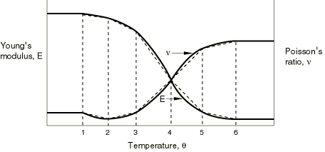

In this case six sets of values are used to specify the material description, as shown in the following table: 

| Elastic Modulus | Poisson's Ratio | Temperature |
| --- | --- | --- |
|  |  |  |
|  |  |  |
|  |  |  |
|  |  | 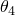 |
|  |  |  |
|  |  |  |

For temperatures that are outside the range defined by  and 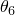, Abaqus assumes constant values for *E* and . The dotted lines on the graph represent the straight-line approximations that will be used for this model. In this example only one value of the thermal expansion coefficient is given, , and it is independent of temperature.

##### Example: Elastic-plastic material

[Figure 21.1.2--2](pt05ch21s01aus109.md#cmaterialdata-2var-exa) shows an elastic-plastic material for which the yield stress is dependent on the equivalent plastic strain and temperature. 

**Figure 21.1.2–2** Example of material definition with two independent variables.

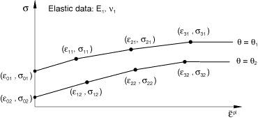

In this case the second independent variable (temperature) must be held constant, while the yield stress is described as a function of the first independent variable (equivalent plastic strain). Then, a higher value of temperature is chosen and the dependence on equivalent plastic strain is given at this temperature. This process, as shown in the following table, is repeated as often as necessary to describe the property variations in as much detail as required:

| Yield Stress | Equivalent Plastic Strain | Temperature |
| --- | --- | --- |
| 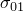 | 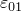 |  |
|  |  |  |
|  | 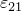 |  |
|  | 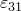 |  |
|  |  |  |
|  |  |  |
|  |  |  |
|  |  |  |

#### Specifying field variable dependence

You can specify the number of user-defined field variable dependencies required for many material behaviors (see ["Predefined fields," Section 34.6.1](pt07ch34s06aus128.md)). If you do not specify a number of field variable dependencies for a material behavior with which field variable dependence is available, the material data are assumed not to depend on field variables.

| **Input File Usage: ** | ``` **MATERIAL BEHAVIOR OPTION*, DEPENDENCIES=*n* ``` |
| --- | --- |
|  | **MATERIAL BEHAVIOR OPTION* refers to any material behavior option for which field dependence can be specified. Each data line can hold up to eight data items. If more field variable dependencies are required than fit on a single data line, more data lines can be added. For example, a linear, isotropic elastic material can be defined as a function of temperature and seven field variables () as follows: ``` [*ELASTIC](../key/key-link.md#usb-kws-melastic), TYPE=ISOTROPIC, DEPENDENCIES=7 *E*, , , , , , ,  ,  ``` This pair of data lines would be repeated as often as necessary to define the material as a function of the temperature and field variables. |

| **Abaqus/CAE Usage: ** | Property module: material editor: *material behavior*: **Number of field ** **variables:** *n* |
| --- | --- |
|  | *material behavior* refers to any material behavior for which field dependence can be specified. |

### Specifying material data as functions of solution-dependent variables

In Abaqus you can introduce dependence on solution variables with a user subroutine. User subroutines [`USDFLD`](../sub/sub-link.md#sub-xsl-usdfld) in Abaqus/Standard and [`VUSDFLD`](../sub/sub-link.md#sub-xsl-vusdfld) in Abaqus/Explicit allow you to define field variables at a material point as functions of time, of material directions, and of any of the available material point quantities: those listed in ["Abaqus/Standard output variable identifiers," Section 4.2.1](pt02ch04s02abv01.md), for the case of [`USDFLD`](../sub/sub-link.md#sub-xsl-usdfld), and those listed in ["Available output variable keys" in "Obtaining material point information in an Abaqus/Explicit analysis," Section 2.1.7 of the Abaqus User Subroutines Reference Guide](../sub/sub-link.md#sub-utl-uvgetvrm-keys), for the case of [`VUSDFLD`](../sub/sub-link.md#sub-xsl-vusdfld). Material properties defined as functions of these field variables may, thus, be dependent on the solution.

User subroutines [`USDFLD`](../sub/sub-link.md#sub-xsl-usdfld) and [`VUSDFLD`](../sub/sub-link.md#sub-xsl-vusdfld) are called at each material point for which the material definition includes a reference to the user subroutine.

For general analysis steps the values of variables provided in user subroutines [`USDFLD`](../sub/sub-link.md#sub-xsl-usdfld) and [`VUSDFLD`](../sub/sub-link.md#sub-xsl-vusdfld) are those corresponding to the start of the increment. Hence, the solution dependence introduced in this way is explicit: the material properties for a given increment are not influenced by the results obtained during the increment. Consequently, the accuracy of the results will generally depend on the time increment size. This is usually not a concern in Abaqus/Explicit because the stable time increment is usually sufficiently small to ensure good accuracy. In Abaqus/Standard you can control the time increment from inside subroutine `USDFLD`. For linear perturbation steps the solution variables in the base state are available. (See ["General and linear perturbation procedures," Section 6.1.3](pt03ch06s01aus44.md), for a discussion of general and linear perturbation steps.)

| **Input File Usage: ** | ``` [*USER DEFINED FIELD](../key/key-link.md#usb-kws-muserdefinedfield) ``` |
| --- | --- |

| **Abaqus/CAE Usage: ** | User subroutines [`USDFLD`](../sub/sub-link.md#sub-xsl-usdfld) and [`VUSDFLD`](../sub/sub-link.md#sub-xsl-vusdfld) are not supported in Abaqus/CAE. |
| --- | --- |

### Defining the characteristic element length at a material point in Abaqus/Explicit

The characteristic element length is used by Abaqus for the regularization of models that exhibit strain softening or is passed to user subroutines that are called at a material point. By default, Abaqus computes the characteristic element length using the geometric mean–based definition.

The default value for a first-order element is the typical length of a line across an element, and the default value for a second-order element is half of the same typical length. For trusses the default value is a characteristic length along the element axis. For membranes and shells the default value is a characteristic length in the reference surface. For axisymmetric elements the default value is a characteristic length in the *r*–*z* plane only.

In Abaqus/Explicit you can redefine the value of the characteristic element length based on the element topology and geometry in user subroutine [`VUCHARLENGTH`](../sub/sub-link.md#sub-xsl-vucharlength).

| **Input File Usage: ** | Use the following option for the geometric mean--based definition of the characteristic element length (default): |
| --- | --- |
|  | ``` [*CHARACTERISTIC LENGTH](../key/key-link.md#usb-kws-mcharacteristiclength), DEFINITION=GEOMETRIC MEAN ``` Use the following option to specify the characteristic element length in user subroutine [`VUCHARLENGTH`](../sub/sub-link.md#sub-xsl-vucharlength): ``` [*CHARACTERISTIC LENGTH](../key/key-link.md#usb-kws-mcharacteristiclength), DEFINITION=USER, COMPONENT=*n*, PROPERTIES=*n* ``` |

| **Abaqus/CAE Usage: ** | User subroutine [`VUCHARLENGTH`](../sub/sub-link.md#sub-xsl-vucharlength) is not supported in Abaqus/CAE. |
| --- | --- |

### Regularizing user-defined data in Abaqus/Explicit and Abaqus/CFD

Interpolating material data as functions of independent variables requires table lookups of the material data values during the analysis. The table lookups occur frequently in Abaqus/Explicit and Abaqus/CFD, and are most economical if the interpolation is from regular intervals of the independent variables. For example, the data shown in [Figure 21.1.2--1](pt05ch21s01aus109.md#cmaterialdata-exa) are not regular because the intervals in temperature (the independent variable) between adjacent data points vary. You are not required to specify regular material data. Abaqus/Explicit and Abaqus/CFD will automatically regularize user-defined data. For example, the temperature values in [Figure 21.1.2--1](pt05ch21s01aus109.md#cmaterialdata-exa) may be defined at 10, 20, 25, 28, 30, and 35 C. In this case Abaqus/Explicit and Abaqus/CFD can regularize the data by defining the data over 25 increments of 1 C and your piecewise linear data will be reproduced exactly. This regularization requires the expansion of your data from values at 6 temperature points to values at 26 temperature points. This example is a case where a simple regularization can reproduce your data exactly.

If there are multiple independent variables, the concept of regular data also requires that the minimum and maximum values (the range) be constant for each independent variable while specifying the other independent variables. The material definition in [Figure 21.1.2--2](pt05ch21s01aus109.md#cmaterialdata-2var-exa) illustrates a case where the material data are not regular since , 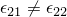, and 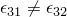. Abaqus/Explicit will also regularize data involving multiple independent variables, although the data provided must satisfy the rules specified in ["Input syntax rules," Section 1.2.1](pt01ch01s02aus01.md).

#### Error tolerance used in regularizing user-defined data

It is not always desirable to regularize the input data so that they are reproduced exactly in a piecewise linear manner. Suppose the yield stress is defined as a function of plastic strain in Abaqus/Explicit as follows: 

| Yield Stress | Plastic Strain |
| --- | --- |
| 50000 | .0 |
| 75000 | .001 |
| 80000 | .003 |
| 85000 | .010 |
| 86000 | 1.0 |

It is possible to regularize the data exactly but it is not very economical, since it requires the subdivision of the data into 1000 regular intervals. Regularization is more difficult if the smallest interval you defined is small compared to the range of the independent variable.

Abaqus/Explicit and Abaqus/CFD use an error tolerance to regularize the input data. The number of intervals in the range of each independent variable is chosen such that the error between the piecewise linear regularized data and each of your defined points is less than the tolerance times the range of the dependent variable. In some cases the number of intervals becomes excessive and Abaqus/Explicit or Abaqus/CFD cannot regularize the data using a reasonable number of intervals. The number of intervals considered reasonable depends on the number of intervals you define. If you defined 50 or less intervals, the maximum number of intervals used by Abaqus/Explicit and Abaqus/CFD for regularization is equal to 100 times the number of user-defined intervals. If you defined more than 50 intervals, the maximum number of intervals used for regularization is equal to 5000 plus 10 times the number of user-defined intervals above 50. If the number of intervals becomes excessive, the program stops during the data checking phase and issues an error message. You can either redefine the material data or change the tolerance value. The default tolerance is 0.03.

The yield stress data in the example above are a typical case where such an error message may be issued. In this case you can simply remove the last data point since it produces only a small difference in the ultimate yield value.

| **Input File Usage: ** | ``` [*MATERIAL](../key/key-link.md#usb-kws-mmaterial), RTOL=*tolerance* ``` |
| --- | --- |

| **Abaqus/CAE Usage: ** | Property module: material editor: ****General****Regularization****: **Rtol:** *tolerance* |
| --- | --- |

#### Regularization of strain-rate-dependent data in Abaqus/Explicit

Since strain rate dependence of data is usually measured at logarithmic intervals, Abaqus/Explicit regularizes strain rate data using logarithmic intervals rather than uniformly spaced intervals by default. This will generally provide a better match to typical strain-rate-dependent curves. You can specify linear strain rate regularization to use uniform intervals for regularization of strain rate data. The use of linear strain rate regularization affects only the regularization of strain rate as an independent variable and is relevant only if one of the following behaviors is used to define the material data:
- low-density foams (["Low-density foams," Section 22.9.1](pt05ch22s09abm16.md))
- rate-dependent metal plasticity (["Classical metal plasticity," Section 23.2.1](pt05ch23s02abm17.md))
- rate-dependent viscoplasticity defined by yield stress ratios (["Rate-dependent yield," Section 23.2.3](pt05ch23s02abm19.md))
- shear failure defined using direct tabular data (["Dynamic failure models," Section 23.2.8](pt05ch23s02abm24.md))
- rate-dependent Drucker-Prager hardening (["Extended Drucker-Prager models," Section 23.3.1](pt05ch23s03abm30.md))
- rate-dependent concrete damaged plasticity (["Concrete damaged plasticity," Section 23.6.3](pt05ch23s06abm39.md))
- rate-dependent damage initiation criterion (["Damage initiation for ductile metals," Section 24.2.2](pt05ch24s02abm42.md))

| **Input File Usage: ** | Use the following option to specify logarithmic regularization (default): |
| --- | --- |
|  | ``` [*MATERIAL](../key/key-link.md#usb-kws-mmaterial), STRAIN RATE REGULARIZATION=LOGARITHMIC ``` Use the following option to specify linear regularization: ``` [*MATERIAL](../key/key-link.md#usb-kws-mmaterial), STRAIN RATE REGULARIZATION=LINEAR ``` |

| **Abaqus/CAE Usage: ** | Property module: material editor: ****General****Regularization****: **Strain rate regularization**: **Logarithmic** or **Linear** |
| --- | --- |

### Evaluation of strain-rate-dependent data in Abaqus/Explicit

Rate-sensitive material constitutive behavior may introduce nonphysical high-frequency oscillations in an explicit dynamic analysis. To overcome this problem, Abaqus/Explicit computes the equivalent plastic strain rate used for the evaluation of strain-rate-dependent data as


Here  is the incremental change in equivalent plastic strain during the time increment , and 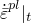 and 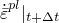 are the strain rates at the beginning and end of the increment, respectively. The factor  () facilitates filtering high-frequency oscillations associated with strain-rate-dependent material behavior. You can specify the value of the strain rate factor, , directly. The default value is 0.9. A value of  does not provide the desired filtering effect and should be avoided.

| **Input File Usage: ** | ``` [*MATERIAL](../key/key-link.md#usb-kws-mmaterial), SRATE FACTOR= ``` |
| --- | --- |

| **Abaqus/CAE Usage: ** | You cannot specify the value of the strain rate factor in Abaqus/CAE. |
| --- | --- |


