# 22.2.1 Linear elastic behavior


**Products: **Abaqus/Standard  Abaqus/Explicit  Abaqus/CAE  

##### **References**

- ["Material library: overview," Section 21.1.1](pt05ch21s01abo18.md)
- ["Elastic behavior: overview," Section 22.1.1](pt05ch22s01abo19.md)
- [*ELASTIC](../key/key-link.md#usb-kws-melastic)
- ["Creating a linear elastic material model" in "Defining elasticity," Section 12.9.1 of the Abaqus/CAE User's Guide](../usi/usi-link.md#usi-prp-mechanical-elastic-elastic)

### Overview

A linear elastic material model:
- is valid for small elastic strains (normally less than 5%);
- can be isotropic, orthotropic, or fully anisotropic;
- can have properties that depend on temperature and/or other field variables; and
- can be defined with a distribution for solid continuum elements in Abaqus/Standard.

### Defining linear elastic material behavior

The total stress is defined from the total elastic strain as 


where  is the total stress (“true,” or Cauchy stress in finite-strain problems),  is the fourth-order elasticity tensor, and  is the total elastic strain (log strain in finite-strain problems). Do not use the linear elastic material definition when the elastic strains may become large; use a hyperelastic model instead. Even in finite-strain problems the elastic strains should still be small (less than 5%).

#### Defining linear elastic response for viscoelastic materials

The elastic response of a viscoelastic material (["Time domain viscoelasticity," Section 22.7.1](pt05ch22s07abm12.md)) can be specified by defining either the instantaneous response or the long-term response of the material. To define the instantaneous response, experiments to determine the elastic constants have to be performed within time spans much shorter than the characteristic relaxation time of the material.

| **Input File Usage: ** | ``` [*ELASTIC](../key/key-link.md#usb-kws-melastic), MODULI=INSTANTANEOUS ``` |
| --- | --- |

| **Abaqus/CAE Usage: ** | Property module: material editor: ****Mechanical****Elasticity****Elastic****: **Moduli time scale (for viscoelasticity)**: **Instantaneous** |
| --- | --- |

If, on the other hand, the long-term elastic response is used, data from experiments have to be collected after time spans much longer than the characteristic relaxation time of the viscoelastic material. Long-term elastic response is the default elastic material behavior.

| **Input File Usage: ** | ``` [*ELASTIC](../key/key-link.md#usb-kws-melastic), MODULI=LONG TERM ``` |
| --- | --- |

| **Abaqus/CAE Usage: ** | Property module: material editor: ****Mechanical****Elasticity****Elastic****: **Moduli time scale (for viscoelasticity)**: **Long-term** |
| --- | --- |

### Directional dependence of linear elasticity

Depending on the number of symmetry planes for the elastic properties, a material can be classified as either *isotropic* (an infinite number of symmetry planes passing through every point) or *anisotropic* (no symmetry planes). Some materials have a restricted number of symmetry planes passing through every point; for example, *orthotropic* materials have two orthogonal symmetry planes for the elastic properties. The number of independent components of the elasticity tensor  depends on such symmetry properties. You define the level of anisotropy and method of defining the elastic properties, as described below. If the material is anisotropic, a local orientation (["Orientations," Section 2.2.5](pt01ch02s02aus15.md)) must be used to define the direction of anisotropy.

### Stability of a linear elastic material

Linear elastic materials must satisfy the conditions of material or Drucker stability (see the discussion on material stability in ["Hyperelastic behavior of rubberlike materials," Section 22.5.1](pt05ch22s05abm07.md)). Stability requires that the tensor  be positive definite, which leads to certain restrictions on the values of the elastic constants. The stress-strain relations for several different classes of material symmetries are given below. The appropriate restrictions on the elastic constants stemming from the stability criterion are also given.

### Defining isotropic elasticity

The simplest form of linear elasticity is the isotropic case, and the stress-strain relationship is given by 

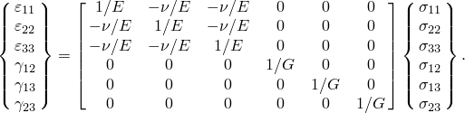

The elastic properties are completely defined by giving the Young's modulus, *E*, and the Poisson's ratio, . The shear modulus, *G*, can be expressed in terms of *E* and  as 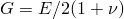. These parameters can be given as functions of temperature and of other predefined fields, if necessary.

In Abaqus/Standard spatially varying isotropic elastic behavior can be defined for homogeneous solid continuum elements by using a distribution (["Distribution definition," Section 2.8.1](pt01ch02s08aus26.md)). The distribution must include default values for *E* and . If a distribution is used, no dependencies on temperature and/or field variables for the elastic constants can be defined. 

| **Input File Usage: ** | ``` [*ELASTIC](../key/key-link.md#usb-kws-melastic), TYPE=ISOTROPIC ``` |
| --- | --- |

| **Abaqus/CAE Usage: ** | Property module: material editor: ****Mechanical****Elasticity****Elastic****: **Type**: **Isotropic** |
| --- | --- |

#### Stability

The stability criterion requires that 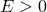, 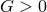, and 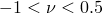. Values of Poisson's ratio approaching 0.5 result in nearly incompressible behavior. With the exception of plane stress cases (including membranes and shells) or beams and trusses, such values require the use of “hybrid” elements in Abaqus/Standard and generate high frequency noise and result in excessively small stable time increments in Abaqus/Explicit. 

In Abaqus/Standard it is recommended that you use solid continuum hybrid elements for linear elastic materials with Poisson's ratio greater than 0.495 (i.e., the ratio of 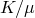 greater than 100) to avoid potential convergence problems. Otherwise, the analysis preprocessor will issue an error. You can use the “nonhybrid incompressible” diagnostics control to downgrade this error to a warning message.

| **Input File Usage: ** | Use the following option to downgrade an error message to a warning message: |
| --- | --- |
|  | ``` [*DIAGNOSTICS](../key/key-link.md#usb-kws-hdiagnostics), NONHYBRID INCOMPRESSIBLE=WARNING ``` |

### Defining orthotropic elasticity by specifying the engineering constants

Linear elasticity in an orthotropic material is most easily defined by giving the “engineering constants”: the three moduli , , ; Poisson's ratios , , ; and the shear moduli , 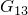, and 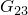 associated with the material's principal directions. These moduli define the elastic compliance according to 


The quantity  has the physical interpretation of the Poisson's ratio that characterizes the transverse strain in the *j*-direction, when the material is stressed in the *i*-direction. In general,  is not equal to 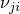: they are related by 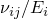=. The engineering constants can also be given as functions of temperature and other predefined fields, if necessary.

In Abaqus/Standard spatially varying orthotropic elastic behavior can be defined for homogeneous solid continuum elements by using a distribution (["Distribution definition," Section 2.8.1](pt01ch02s08aus26.md)). The distribution must include default values for the elastic moduli and Poisson's ratios. If a distribution is used, no dependencies on temperature and/or field variables for the elastic constants can be defined. 

| **Input File Usage: ** | ``` [*ELASTIC](../key/key-link.md#usb-kws-melastic), TYPE=ENGINEERING CONSTANTS ``` |
| --- | --- |

| **Abaqus/CAE Usage: ** | Property module: material editor: ****Mechanical****Elasticity****Elastic****: **Type**: **Engineering Constants** |
| --- | --- |

#### Stability

Material stability requires 


When the left-hand side of the inequality approaches zero, the material exhibits incompressible behavior. Using the relations =, the second, third, and fourth restrictions in the above set can also be expressed as 


### Defining transversely isotropic elasticity

A special subclass of orthotropy is *transverse isotropy*, which is characterized by a plane of isotropy at every point in the material. Assuming the 1–2 plane to be the plane of isotropy at every point, transverse isotropy requires that ==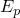, ==, ==, and ==, where *p* and *t* stand for “in-plane” and “transverse,” respectively. Thus, while  has the physical interpretation of the Poisson's ratio that characterizes the strain in the plane of isotropy resulting from stress normal to it,  characterizes the transverse strain in the direction normal to the plane of isotropy resulting from stress in the plane of isotropy. In general, the quantities  and  are not equal and are related by 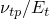=. The stress-strain laws reduce to 

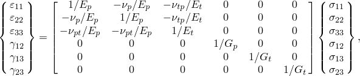

where = and the total number of independent constants is only five.

In Abaqus/Standard spatially varying transverse isotropic elastic behavior can be defined for homogeneous solid continuum elements by using a distribution (["Distribution definition," Section 2.8.1](pt01ch02s08aus26.md)). The distribution must include default values for the elastic moduli and Poisson's ratio. If a distribution is used, no dependencies on temperature and/or field variables for the elastic constants can be defined.

| **Input File Usage: ** | ``` [*ELASTIC](../key/key-link.md#usb-kws-melastic), TYPE=ENGINEERING CONSTANTS ``` |
| --- | --- |

| **Abaqus/CAE Usage: ** | Property module: material editor: ****Mechanical****Elasticity****Elastic****: **Type**: **Engineering Constants** |
| --- | --- |

#### Stability

In the transversely isotropic case the stability relations for orthotropic elasticity simplify to 

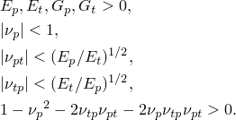

### Defining orthotropic elasticity in plane stress

Under plane stress conditions, such as in a shell element, only the values of , , , , , and  are required to define an orthotropic material. (In all of the plane stress elements in Abaqus the 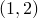 surface is the surface of plane stress, so that the plane stress condition is .) The shear moduli  and  are included because they may be required for modeling transverse shear deformation in a shell. The Poisson's ratio  is implicitly given as . In this case the stress-strain relations for the in-plane components of the stress and strain are of the form

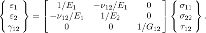

In Abaqus/Standard spatially varying plane stress orthotropic elastic behavior can be defined for homogeneous solid continuum elements by using a distribution (["Distribution definition," Section 2.8.1](pt01ch02s08aus26.md)). The distribution must include default values for the elastic moduli and Poisson's ratio. If a distribution is used, no dependencies on temperature and/or field variables for the elastic constants can be defined. 

| **Input File Usage: ** | ``` [*ELASTIC](../key/key-link.md#usb-kws-melastic), TYPE=LAMINA ``` |
| --- | --- |

| **Abaqus/CAE Usage: ** | Property module: material editor: ****Mechanical****Elasticity****Elastic****: **Type**: **Lamina** |
| --- | --- |

#### Stability

Material stability for plane stress requires 


### Defining orthotropic elasticity by specifying the terms in the elastic stiffness matrix

Linear elasticity in an orthotropic material can also be defined by giving the nine independent elastic stiffness parameters, as functions of temperature and other predefined fields, if necessary. In this case the stress-strain relations are of the form 

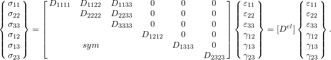

For an orthotropic material the engineering constants define the  matrix as 

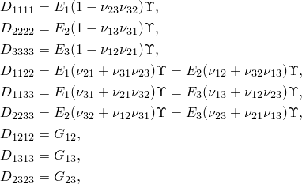

where 

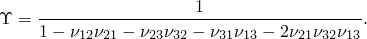

When the material stiffness parameters (the 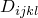) are given directly, Abaqus imposes the constraint  for the plane stress case to reduce the material's stiffness matrix as required.

In Abaqus/Standard spatially varying orthotropic elastic behavior can be defined for homogeneous solid continuum elements by using a distribution (["Distribution definition," Section 2.8.1](pt01ch02s08aus26.md)). The distribution must include default values for the elastic moduli. If a distribution is used, no dependencies on temperature and/or field variables for the elastic constants can be defined. 

| **Input File Usage: ** | ``` [*ELASTIC](../key/key-link.md#usb-kws-melastic), TYPE=ORTHOTROPIC ``` |
| --- | --- |

| **Abaqus/CAE Usage: ** | Property module: material editor: ****Mechanical****Elasticity****Elastic****: **Type**: **Orthotropic** |
| --- | --- |

#### Stability

The restrictions on the elastic constants due to material stability are 


The last relation leads to 

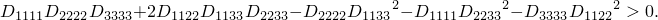

These restrictions in terms of the elastic stiffness parameters are equivalent to the restrictions in terms of the “engineering constants.” Incompressible behavior results when the left-hand side of the inequality approaches zero.

### Defining fully anisotropic elasticity

For fully anisotropic elasticity 21 independent elastic stiffness parameters are needed. The stress-strain relations are as follows: 

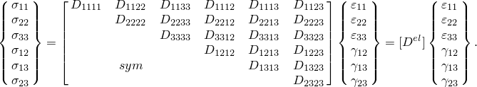

When the material stiffness parameters (the ) are given directly, Abaqus imposes the constraint  for the plane stress case to reduce the material's stiffness matrix as required.

In Abaqus/Standard spatially varying anisotropic elastic behavior can be defined for homogeneous solid continuum elements by using a distribution (["Distribution definition," Section 2.8.1](pt01ch02s08aus26.md)). The distribution must include default values for the elastic moduli. If a distribution is used, no dependencies on temperature and/or field variables for the elastic constants can be defined. 

| **Input File Usage: ** | ``` [*ELASTIC](../key/key-link.md#usb-kws-melastic), TYPE=ANISOTROPIC ``` |
| --- | --- |

| **Abaqus/CAE Usage: ** | Property module: material editor: ****Mechanical****Elasticity****Elastic****: **Type**: **Anisotropic** |
| --- | --- |

#### Stability

The restrictions imposed upon the elastic constants by stability requirements are too complex to express in terms of simple equations. However, the requirement that  is positive definite requires that all of the eigenvalues of the elasticity matrix 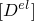 be positive.

### Defining orthotropic elasticity for warping elements

For two-dimensional meshed models of solid cross-section Timoshenko beam elements modeled with warping elements (see ["Meshed beam cross-sections," Section 10.6.1](pt04ch10s06at35.md)), Abaqus offers a linear elastic material definition that can have two different shear moduli in the user-specified material directions. In the user-specified directions the stress-strain relations are as follows: 

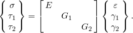

A local orientation is used to define the angle  between the global directions and the user-specified material directions. In the cross-section directions the stress-strain relations are as follows: 


where  represents the beam's axial stress and  and 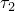 represent two shear stresses.

| **Input File Usage: ** | ``` [*ELASTIC](../key/key-link.md#usb-kws-melastic), TYPE=TRACTION ``` |
| --- | --- |

| **Abaqus/CAE Usage: ** | Property module: material editor: ****Mechanical****Elasticity****Elastic****: **Type**: **Traction** |
| --- | --- |

#### Stability

The stability criterion requires that , 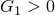, and .

### Defining elasticity in terms of tractions and separations for cohesive elements

For cohesive elements used to model bonded interfaces (see ["Defining the constitutive response of cohesive elements using a traction-separation description," Section 32.5.6](pt06ch32s05alm45.md)) Abaqus offers an elasticity definition that can be written directly in terms of the nominal tractions and the nominal strains. Both uncoupled and coupled behaviors are supported. For uncoupled behavior each traction component depends only on its conjugate nominal strain, while for coupled behavior the response is more general (as shown below). In the local element directions the stress-strain relations for uncoupled behavior are as follows: 


The quantities 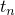, , and  represent the nominal tractions in the normal and the two local shear directions, respectively; while the quantities 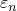, , and  represent the corresponding nominal strains. For coupled traction separation behavior the stress-strain relations are as follows:


| **Input File Usage: ** | Use the following option to define uncoupled elastic behavior for cohesive elements: |
| --- | --- |
|  | ``` [*ELASTIC](../key/key-link.md#usb-kws-melastic), TYPE=TRACTION ``` Use the following option to define coupled elastic behavior for cohesive elements: ``` [*ELASTIC](../key/key-link.md#usb-kws-melastic), TYPE=COUPLED TRACTION ``` |

| **Abaqus/CAE Usage: ** | Use the following option to define uncoupled elastic behavior for cohesive elements: |
| --- | --- |
|  | Property module: material editor: ****Mechanical****Elasticity****Elastic****: **Type**: **Traction** Use the following option to define coupled elastic behavior for cohesive elements: Property module: material editor: ****Mechanical****Elasticity****Elastic****: **Type**: **Coupled Traction** |

#### Stability

The stability criterion for uncoupled behavior requires that 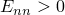, , and . For coupled behavior the stability criterion requires that:


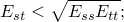

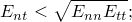

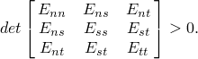

### Defining isotropic shear elasticity for equations of state in Abaqus/Explicit

Abaqus/Explicit allows you to define isotropic shear elasticity to describe the deviatoric response of materials whose volumetric response is governed by an equation of state (["Elastic shear behavior" in "Equation of state," Section 25.2.1](pt05ch25s02abm50.md#usb-mat-ceos-deviatoricelastic)). In this case the deviatoric stress-strain relationship is given by

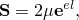

where  is the deviatoric stress and  is the deviatoric elastic strain. You must provide the elastic shear modulus, , when you define the elastic deviatoric behavior.

| **Input File Usage: ** | ``` [*ELASTIC](../key/key-link.md#usb-kws-melastic), TYPE=SHEAR ``` |
| --- | --- |

| **Abaqus/CAE Usage: ** | Property module: material editor: ****Mechanical****Elasticity****Elastic****: **Type**: **Shear** |
| --- | --- |

### Elements

Linear elasticity can be used with any stress/displacement element or coupled temperature-displacement element in Abaqus. The exceptions are traction elasticity, which can be used only with warping elements and cohesive elements; coupled traction elasticity, which can be used only with cohesive elements; shear elasticity, which can be used only with solid (continuum) elements except plane stress elements; and, in Abaqus/Explicit, anisotropic elasticity, which is not supported for truss, rebar, pipe, and beam elements.

If the material is (almost) incompressible (Poisson's ratio 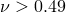 for isotropic elasticity), hybrid elements should be used in Abaqus/Standard. Compressible anisotropic elasticity should not be used with second-order hybrid continuum elements: inaccurate results and/or convergence problems may occur.


