# 22.2.3 Plane stress orthotropic failure measures


**Products: **Abaqus/Standard  Abaqus/Explicit  Abaqus/CAE  

##### **References**

- ["Material library: overview," Section 21.1.1](pt05ch21s01abo18.md)
- ["Elastic behavior: overview," Section 22.1.1](pt05ch22s01abo19.md)
- ["Linear elastic behavior," Section 22.2.1](pt05ch22s02abm02.md)
- [*FAIL STRAIN](../key/key-link.md#usb-kws-mefailstrain)
- [*FAIL STRESS](../key/key-link.md#usb-kws-mefailstress)
- [*ELASTIC](../key/key-link.md#usb-kws-melastic)
- ["Defining stress-based failure measures for an elastic model" in "Defining elasticity," Section 12.9.1 of the Abaqus/CAE User's Guide](../usi/usi-link.md#usi-prp-mechanical-elastic-elastic-stressfailure)
- ["Defining strain-based failure measures for an elastic model" in "Defining elasticity," Section 12.9.1 of the Abaqus/CAE User's Guide](../usi/usi-link.md#usi-prp-mechanical-elastic-elastic-strainfailure)

### Overview

The orthotropic plane stress failure measures:
- are indications of material failure (normally used for fiber-reinforced composite materials; for alternative damage and failure models for fiber-reinforced composite materials, see ["Damage and failure for fiber-reinforced composites: overview," Section 24.3.1](pt05ch24s03abm44.md));
- can be used only in conjunction with a linear elastic material model (with or without local material orientations);
- can be used for any element that uses a plane stress formulation; that is, for plane stress continuum elements, shell elements, and membrane elements;
- are postprocessed output requests and do not cause any material degradation; and
- take values that are greater than or equal to 0.0, with values that are greater than or equal to 1.0 implying failure.

### Failure theories

Five different failure theories are provided: four stress-based theories and one strain-based theory.

We denote orthotropic material directions by 1 and 2, with the 1-material direction aligned with the fibers and the 2-material direction transverse to the fibers. For the failure theories to work correctly, the 1- and 2-directions of the user-defined elastic material constants must align with the fiber and the transverse-to-fiber directions, respectively. For applications other than fiber-reinforced composites, the 1- and 2-material directions should represent the strong and weak orthotropic-material directions, respectively.

In all cases tensile values must be positive and compressive values must be negative.

### Stress-based failure theories

The input data for the stress-based failure theories are tensile and compressive stress limits,  and , in the 1-direction; tensile and compressive stress limits,  and , in the 2-direction; and shear strength (maximum shear stress), *S*, in the *X*–*Y* plane.

All four stress-based theories are defined and available with a single definition in Abaqus; the desired output is chosen by the output variables described at the end of this section. 

| **Input File Usage: ** | ``` [*FAIL STRESS](../key/key-link.md#usb-kws-mefailstress) ``` |
| --- | --- |

| **Abaqus/CAE Usage: ** | Property module: material editor: ****Mechanical****Elasticity****Elastic****: ****Suboptions****Fail Stress**** |
| --- | --- |

#### Maximum stress theory

If , ; otherwise, 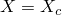. If 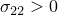, ; otherwise, . The maximum stress failure criterion requires that 

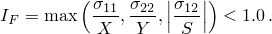

#### Tsai-Hill theory

If , ; otherwise, . If , ; otherwise, . The Tsai-Hill failure criterion requires that 


#### Tsai-Wu theory

The Tsai-Wu failure criterion requires that 


The Tsai-Wu coefficients are defined as follows: 

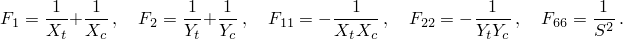

 is the equibiaxial stress at failure. If it is known, then 

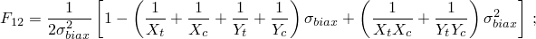

otherwise, 


where 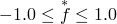. The default value of  is zero. For the Tsai-Wu failure criterion either  or  must be given as input data. The coefficient  is ignored if  is given.

#### Azzi-Tsai-Hill theory

The Azzi-Tsai-Hill failure theory is the same as the Tsai-Hill theory, except that the absolute value of the cross product term is taken: 

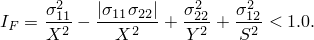

This difference between the two failure criteria shows up only when  and  have opposite signs.

### Stress-based failure measures---failure envelopes

To illustrate the four stress-based failure measures, [Figure 22.2.3--1](pt05ch22s02abm04.md#cfailmeas-max-stress), [Figure 22.2.3--2](pt05ch22s02abm04.md#cfailmeas-tsai-wu), and [Figure 22.2.3--3](pt05ch22s02abm04.md#cfailmeas-azzi-tsai-hill) show each failure envelope (i.e., 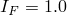) in (–) stress space compared to the Tsai-Hill envelope for a given value of in-plane shear stress. In each case the Tsai-Hill surface is the piecewise continuous elliptical surface with each quadrant of the surface defined by an ellipse centered at the origin. The parallelogram in [Figure 22.2.3--1](pt05ch22s02abm04.md#cfailmeas-max-stress) defines the maximum stress surface. In [Figure 22.2.3--2](pt05ch22s02abm04.md#cfailmeas-tsai-wu) the Tsai-Wu surface appears as the ellipse. In [Figure 22.2.3--3](pt05ch22s02abm04.md#cfailmeas-azzi-tsai-hill) the Azzi-Tsai-Hill surface differs from the Tsai-Hill surface only in the second and fourth quadrants, where it is the outside bounding surface (i.e., further from the origin). Since all of the failure theories are calibrated by tensile and compressive failure under uniaxial stress, they all give the same values on the stress axes.

**Figure 22.2.3–1** Tsai-Hill versus maximum stress failure envelope ().

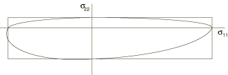

**Figure 22.2.3–2** Tsai-Hill versus Tsai-Wu failure envelope (, 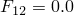).

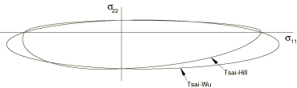

**Figure 22.2.3–3** Tsai-Hill versus Azzi-Tsai-Hill failure envelope ().


### Strain-based failure theory

The input data for the strain-based theory are tensile and compressive strain limits, 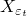 and 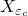, in the 1-direction; tensile and compressive strain limits,  and , in the 2-direction; and shear strain limit, , in the *X*–*Y* plane.

| **Input File Usage: ** | ``` [*FAIL STRAIN](../key/key-link.md#usb-kws-mefailstrain) ``` |
| --- | --- |

| **Abaqus/CAE Usage: ** | Property module: material editor: ****Mechanical****Elasticity****Elastic****: ****Suboptions****Fail Strain**** |
| --- | --- |

#### Maximum strain theory

If 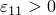, ; otherwise, . If , ; otherwise, . The maximum strain failure criterion requires that 


### Elements

The plane stress orthotropic failure measures can be used with any plane stress, shell, or membrane element in Abaqus.

### Output

Abaqus provides output of the failure index, *R*, if failure measures are defined with the material description. The definition of the failure index and the different output variables are described below.

#### Output failure indices

Each of the stress-based failure theories defines a failure surface surrounding the origin in the three-dimensional space 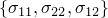. Failure occurs any time a state of stress is either on or outside this surface. The failure index, *R*, is used to measure the proximity to the failure surface. *R* is defined as the scaling factor such that, for the given stress state , 

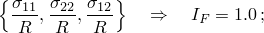

that is,  is the scaling factor with which we need to multiply all of the stress components simultaneously to lie on the failure surface. Values  indicate that the state of stress is within the failure surface, while values  indicate failure. For the maximum stress theory .

The failure index *R* is defined similarly for the maximum strain failure theory. *R* is the scaling factor such that, for the given strain state 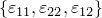, 

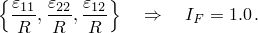

For the maximum strain theory .

#### Output variables

Output variable CFAILURE will provide output for all of the stress- and strain-based failure theories (see ["Abaqus/Standard output variable identifiers," Section 4.2.1](pt02ch04s02abv01.md), and ["Abaqus/Explicit output variable identifiers," Section 4.2.2](pt02ch04s02xbv01.md)). In Abaqus/Standard history output can also be requested for the individual stress theories with output variables MSTRS, TSAIH, TSAIW, and AZZIT and for the strain theory with output variable MSTRN.

Output variables for the stress- and strain-based failure theories are always calculated at the material points of the element. In Abaqus/Standard element output can be requested at a location other than the material points (see ["Output to the data and results files," Section 4.1.2](pt02ch04s01aus39.md)); in this case the output variables are first calculated at the material points, then interpolated to the element centroid or extrapolated to the nodes.


