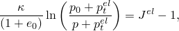
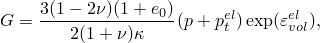
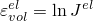
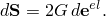

# 22.3.1 Elastic behavior of porous materials


**Products: **Abaqus/Standard  Abaqus/CAE  

##### **References**

- ["Material library: overview," Section 21.1.1](pt05ch21s01abo18.md)
- ["Elastic behavior: overview," Section 22.1.1](pt05ch22s01abo19.md)
- [*POROUS ELASTIC](../key/key-link.md#usb-kws-mporouselastic)
- [*INITIAL CONDITIONS](../key/key-link.md#usb-kws-minitialcond)
- ["Creating a porous elastic material model" in "Defining elasticity," Section 12.9.1 of the Abaqus/CAE User's Guide](../usi/usi-link.md#usi-prp-mechanical-elastic-porouselastic)

### Overview

A porous elastic material model:
- is valid for small elastic strains (normally less than 5%);
- is a nonlinear, isotropic elasticity model in which the pressure stress varies as an exponential function of volumetric strain;
- allows a zero or nonzero elastic tensile stress limit; and
- can have properties that depend on temperature and other field variables.

### Defining the volumetric behavior

Often, the elastic part of the volumetric behavior of porous materials is modeled accurately by assuming that the elastic part of the change in volume of the material is proportional to the logarithm of the pressure stress ([Figure 22.3.1--1](pt05ch22s03abm05.md#cporouselast-vol-behav)): 



where  is the “logarithmic bulk modulus”;  is the initial void ratio; *p* is the equivalent pressure stress, defined by 


 is the initial value of the equivalent pressure stress;  is the elastic part of the volume ratio between the current and reference configurations; and  is the “elastic tensile strength” of the material (in the sense that  as ).

**Figure 22.3.1–1** Porous elastic volumetric behavior.


| **Input File Usage: ** | Use all three of the following options to define a porous elastic material: |
| --- | --- |
|  | ``` [*POROUS ELASTIC](../key/key-link.md#usb-kws-mporouselastic), SHEAR=G or POISSON to define  and  [*INITIAL CONDITIONS](../key/key-link.md#usb-kws-minitialcond), TYPE=STRESS to define  [*INITIAL CONDITIONS](../key/key-link.md#usb-kws-minitialcond), TYPE=RATIO to define  ``` |

| **Abaqus/CAE Usage: ** | Use all three of the following options to define a porous elastic material: |
| --- | --- |
|  | Property module: material editor: ****Mechanical****Elasticity****Porous Elastic**** Load module: **Create Predefined Field**: **Step: Initial**: choose **Mechanical** for the **Category** and **Stress** for the **Types for Selected Step** Load module: **Create Predefined Field**: **Step: Initial**: choose **Other** for the **Category** and **Void ratio** for the **Types for Selected Step** |

### Defining the shear behavior

The deviatoric elastic behavior of a porous material can be defined in either of two ways.

#### By defining the shear modulus

Give the shear modulus, *G*. The deviatoric stress, , is then related to the deviatoric part of the total elastic strain, , by 


In this case the shear behavior is not affected by compaction of the material.

| **Input File Usage: ** | ``` [*POROUS ELASTIC](../key/key-link.md#usb-kws-mporouselastic), SHEAR=G ``` |
| --- | --- |

| **Abaqus/CAE Usage: ** | Property module: material editor: ****Mechanical****Elasticity****Porous Elastic****: **Shear**: **G** |
| --- | --- |

#### By defining Poisson's ratio

Define Poisson's ratio, . The instantaneous shear modulus is then defined from the instantaneous bulk modulus and Poisson's ratio as 



where  is the logarithmic measure of the elastic volume change. In this case 



Thus, the elastic shear stiffness increases as the material is compacted. This equation is integrated to give the total stress–total elastic strain relationship.

| **Input File Usage: ** | ``` [*POROUS ELASTIC](../key/key-link.md#usb-kws-mporouselastic), SHEAR=POISSON ``` |
| --- | --- |

| **Abaqus/CAE Usage: ** | Property module: material editor: ****Mechanical****Elasticity****Porous Elastic****: **Shear**: **Poisson** |
| --- | --- |

### Material options

The porous elasticity model can be used by itself, or it can be combined with:
- the ["Extended Drucker-Prager models," Section 23.3.1](pt05ch23s03abm30.md);
- the ["Modified Drucker-Prager/Cap model," Section 23.3.2](pt05ch23s03abm31.md);
- the ["Critical state (clay) plasticity model," Section 23.3.4](pt05ch23s03abm33.md); or
- isotropic expansion to introduce thermal volume changes (["Thermal expansion," Section 26.1.2](pt05ch26s01abm52.md)).

 It is not possible to use porous elasticity with rate-dependent plasticity or viscoelasticity.

Porous elasticity cannot be used with the porous metal plasticity model (["Porous metal plasticity," Section 23.2.9](pt05ch23s02abm25.md)).

See ["Combining material behaviors," Section 21.1.3](pt05ch21s01aus110.md), for more details.

### Elements

Porous elasticity cannot be used with hybrid elements or plane stress elements (including shells and membranes), but it can be used with any other pure stress/displacement element in Abaqus/Standard.

If used with reduced-integration elements with total-stiffness hourglass control, Abaqus/Standard cannot calculate a default value for the hourglass stiffness of the element if the shear behavior is defined through Poisson's ratio. Hence, you must specify the hourglass stiffness. See ["Section controls," Section 27.1.4](pt06ch27s01aus113.md), for details.

If fluid pore pressure is important (such as in undrained soils), stress/displacement elements that include pore pressure can be used.


