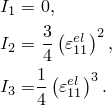

# 22.4.1 Hypoelastic behavior


**Products: **Abaqus/Standard  Abaqus/CAE  

##### **References**

- ["Material library: overview," Section 21.1.1](pt05ch21s01abo18.md)
- ["Elastic behavior: overview," Section 22.1.1](pt05ch22s01abo19.md)
- [*HYPOELASTIC](../key/key-link.md#usb-kws-mhypoelastic)
- ["Creating a hypoelastic material model" in "Defining elasticity," Section 12.9.1 of the Abaqus/CAE User's Guide](../usi/usi-link.md#usi-prp-mechanical-elastic-hypoelastic)

### Overview

The hypoelastic material model:
- is valid for small elastic strains---the stresses should not be large compared to the elastic modulus of the material;
- is used when the load path is monotonic; and
- must be defined by user subroutine [`UHYPEL`](../sub/sub-link.md#sub-xsl-uhypel) if temperature dependence is to be included.

### Defining hypoelastic material behavior

In a hypoelastic material the rate of change of stress is defined as a tangent modulus matrix multiplying the rate of change of the elastic strain: 


where  is the rate of change of the stress (the “true,” Cauchy, stress in finite-strain problems),  is the tangent elasticity matrix, and  is the rate of change of the elastic strain (the log strain in finite-strain problems).

### Determining the hypoelastic material parameters

The entries in  are provided by giving Young's modulus, *E*, and Poisson's ratio, , as functions of strain invariants. The strain invariants are defined for this purpose as 


You can define the material parameters directly or by using a user subroutine.

#### Direct specification

You can define the variation of Young's modulus and Poisson's ratio directly by specifying *E*, , , , and .

| **Input File Usage: ** | ``` [*HYPOELASTIC](../key/key-link.md#usb-kws-mhypoelastic) ``` |
| --- | --- |

| **Abaqus/CAE Usage: ** | Property module: material editor: ****Mechanical****Elasticity****Hypoelastic**** |
| --- | --- |

#### User subroutine

If specifying *E* and  as functions of the strain invariants directly does not allow sufficient flexibility, you can define the hypoelastic material by user subroutine [`UHYPEL`](../sub/sub-link.md#sub-xsl-uhypel).

| **Input File Usage: ** | ``` [*HYPOELASTIC](../key/key-link.md#usb-kws-mhypoelastic), USER ``` |
| --- | --- |

| **Abaqus/CAE Usage: ** | Property module: material editor: ****Mechanical****Elasticity****Hypoelastic****: **Use user subroutine UHYPEL** |
| --- | --- |

### Plane or uniaxial stress

For plane stress and uniaxial stress states Abaqus/Standard does not compute the out-of-plane strain components. For the purpose of defining the above invariants, it is assumed that ; that is, the material is assumed to be incompressible. For example, in a uniaxial stress case (such as a truss element) this assumption implies that 



### Large-displacement analysis

For large-displacement analysis the strain measure in Abaqus is the integration of the rate of deformation. This strain measure corresponds to log strain if the principal directions do not rotate relative to the material. The strain invariant definitions should be interpreted in this way.

### Material options

The hypoelastic material model can be used only by itself in the material definition. It cannot be combined with viscoelasticity or with any inelastic response model. See ["Combining material behaviors," Section 21.1.3](pt05ch21s01aus110.md), for more details.

### Elements

The hypoelastic material model can be used with any of the stress/displacement elements in Abaqus/Standard.


