# 22.5.1 Hyperelastic behavior of rubberlike materials


**Products: **Abaqus/Standard  Abaqus/Explicit  Abaqus/CAE  

##### **References**

- ["Material library: overview," Section 21.1.1](pt05ch21s01abo18.md)
- ["Elastic behavior: overview," Section 22.1.1](pt05ch22s01abo19.md)
- ["Mullins effect," Section 22.6.1](pt05ch22s06abm10.md)
- ["Permanent set in rubberlike materials," Section 23.7.1](pt05ch23s07abm40.md)
- [*HYPERELASTIC](../key/key-link.md#usb-kws-mhyperelast)
- [*UNIAXIAL TEST DATA](../key/key-link.md#usb-kws-munitestdata)
- [*BIAXIAL TEST DATA](../key/key-link.md#usb-kws-mbitestdata)
- [*PLANAR TEST DATA](../key/key-link.md#usb-kws-mplanartestdata)
- [*VOLUMETRIC TEST DATA](../key/key-link.md#usb-kws-mvoltestdata)
- [*MULLINS EFFECT](../key/key-link.md#usb-kws-mmullinseffect)
- ["Creating an isotropic hyperelastic material model" in "Defining elasticity," Section 12.9.1 of the Abaqus/CAE User's Guide](../usi/usi-link.md#usi-prp-mechanical-elastic-hyperelastic)

### Overview

The hyperelastic material model:
- is isotropic and nonlinear;
- is valid for materials that exhibit instantaneous elastic response up to large strains (such as rubber, solid propellant, or other elastomeric materials); and
- requires that geometric nonlinearity be accounted for during the analysis step (["General and linear perturbation procedures," Section 6.1.3](pt03ch06s01aus44.md)), since it is intended for finite-strain applications.

### Compressibility

Most elastomers (solid, rubberlike materials) have very little compressibility compared to their shear flexibility. This behavior does not warrant special attention for plane stress, shell, membrane, beam, truss, or rebar elements, but the numerical solution can be quite sensitive to the degree of compressibility for three-dimensional solid, plane strain, and axisymmetric analysis elements. In cases where the material is highly confined (such as an O-ring used as a seal), the compressibility must be modeled correctly to obtain accurate results. In applications where the material is not highly confined, the degree of compressibility is typically not crucial; for example, it would be quite satisfactory in Abaqus/Standard to assume that the material is fully incompressible: the volume of the material cannot change except for thermal expansion.

Another class of rubberlike materials is elastomeric foam, which is elastic but very compressible. Elastomeric foams are discussed in ["Hyperelastic behavior in elastomeric foams," Section 22.5.2](pt05ch22s05abm08.md).

We can assess the relative compressibility of a material by the ratio of its initial bulk modulus, , to its initial shear modulus, . This ratio can also be expressed in terms of Poisson's ratio, , since 

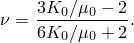

The table below provides some representative values.

|  | Poisson's ratio |
| --- | --- |
| 10 | 0.452 |
| 20 | 0.475 |
| 50 | 0.490 |
| 100 | 0.495 |
| 1000 | 0.4995 |
| 10,000 | 0.49995 |

#### Compressibility in Abaqus/Standard

In Abaqus/Standard it is recommended that you use solid continuum hybrid elements for almost incompressible hyperelastic materials with initial Poisson's ratio greater than 0.495 (i.e., the ratio of  greater than 100) to avoid potential convergence problems. Otherwise, the analysis preprocessor will issue an error. Except for fully incompressible hyperelastic materials, you can use the “nonhybrid incompressible” diagnostics control to downgrade this error to a warning message.

In plane stress, shell, and membrane elements the material is free to deform in the thickness direction. Similarly, in one-dimensional elements (such as beams, trusses, and rebars) the material is free to deform in the lateral directions. In these cases special treatment of the volumetric behavior is not necessary; the use of regular stress/displacement elements is satisfactory.

| **Input File Usage: ** | Use the following option to downgrade an error message to a warning message: |
| --- | --- |
|  | ``` [*DIAGNOSTICS](../key/key-link.md#usb-kws-hdiagnostics), NONHYBRID INCOMPRESSIBLE=WARNING ``` |

#### Compressibility in Abaqus/Explicit

Except for plane stress and uniaxial cases, it is not possible to assume that the material is fully incompressible in Abaqus/Explicit because the program has no mechanism for imposing such a constraint at each material calculation point. Instead, we must provide some compressibility. The difficulty is that, in many cases, the actual material behavior provides too little compressibility for the algorithms to work efficiently. Thus, except for plane stress and uniaxial cases, you must provide enough compressibility for the code to work, knowing that this makes the bulk behavior of the model softer than that of the actual material. Some judgment is, therefore, required to decide whether or not the solution is sufficiently accurate, or whether the problem can be modeled at all with Abaqus/Explicit because of this numerical limitation.

If no value is given for the material compressibility in the hyperelastic model, by default Abaqus/Explicit assumes 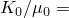 20, corresponding to Poisson's ratio of 0.475. Since typical unfilled elastomers have  ratios in the range of 1,000 to 10,000 ( 0.4995 to  0.49995) and filled elastomers have  ratios in the range of 50 to 200 ( 0.490 to  0.497), this default provides much more compressibility than is available in most elastomers. However, if the elastomer is relatively unconfined, this softer modeling of the material's bulk behavior usually provides quite accurate results. Unfortunately, in cases where the material is highly confined—such as when it is in contact with stiff, metal parts and has a very small amount of free surface, especially when the loading is highly compressive—it may not be feasible to obtain accurate results with Abaqus/Explicit.

If you are defining the compressibility rather than accepting the default value, an upper limit of 100 is suggested for the ratio of . Larger ratios introduce high frequency noise into the dynamic solution and require the use of excessively small time increments.

### Isotropy assumption

In Abaqus all hyperelastic models are based on the assumption of isotropic behavior throughout the deformation history. Hence, the strain energy potential can be formulated as a function of the strain invariants.

### Strain energy potentials

Hyperelastic materials are described in terms of a “strain energy potential,” 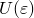, which defines the strain energy stored in the material per unit of reference volume (volume in the initial configuration) as a function of the strain at that point in the material. There are several forms of strain energy potentials available in Abaqus to model approximately incompressible isotropic elastomers: the Arruda-Boyce form, the Marlow form, the Mooney-Rivlin form, the neo-Hookean form, the Ogden form, the polynomial form, the reduced polynomial form, the Yeoh form, and the Van der Waals form. As will be pointed out below, the reduced polynomial and Mooney-Rivlin models can be viewed as particular cases of the polynomial model; the Yeoh and neo-Hookean potentials, in turn, can be viewed as special cases of the reduced polynomial model. Thus, we will occasionally refer collectively to these models as “polynomial models.”

Generally, when data from multiple experimental tests are available (typically, this requires at least uniaxial and equibiaxial test data), the Ogden and Van der Waals forms are more accurate in fitting experimental results. If limited test data are available for calibration, the Arruda-Boyce, Van der Waals, Yeoh, or reduced polynomial forms provide reasonable behavior. When only one set of test data (uniaxial, equibiaxial, or planar test data) is available, the Marlow form is recommended. In this case a strain energy potential is constructed that will reproduce the test data exactly and that will have reasonable behavior in other deformation modes.

#### Evaluating hyperelastic materials

Abaqus/CAE allows you to evaluate hyperelastic material behavior by automatically creating response curves using selected strain energy potentials. In addition, you can provide experimental test data for a material without specifying a particular strain energy potential and have Abaqus/CAE evaluate the material to determine the optimal strain energy potential. See ["Evaluating hyperelastic and viscoelastic material behavior," Section 12.4.7 of the Abaqus/CAE User's Guide](../usi/usi-link.md#usi-prp-editor-evaluate), for details. Alternatively, you can use single-element test cases to evaluate the strain energy potential.

#### Arruda-Boyce form

The form of the Arruda-Boyce strain energy potential is 

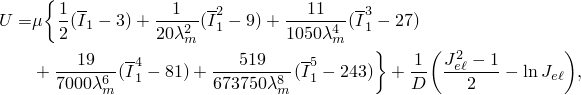

where *U* is the strain energy per unit of reference volume; , , and *D* are temperature-dependent material parameters;  is the first deviatoric strain invariant defined as 

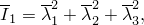

where the deviatoric stretches 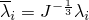; *J* is the total volume ratio;  is the elastic volume ratio as defined below in ["Thermal expansion";](pt05ch22s05abm07.md#usb-mat-chyperelastic-therm-expan) and  are the principal stretches. The initial shear modulus, , is related to  with the expression


 A typical value of  is 7, for which . Both the initial shear modulus, , and the parameter  are printed in the data (`.dat`) file if you request a printout of the model data from the analysis input file processor. The initial bulk modulus is related to *D* with the expression

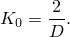

#### Marlow form

The form of the Marlow strain energy potential is 


where *U* is the strain energy per unit of reference volume, with  as its deviatoric part and  as its volumetric part;  is the first deviatoric strain invariant defined as 


where the deviatoric stretches ; *J* is the total volume ratio; 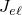 is the elastic volume ratio as defined below in ["Thermal expansion";](pt05ch22s05abm07.md#usb-mat-chyperelastic-therm-expan) and  are the principal stretches. The deviatoric part of the potential is defined by providing either uniaxial, equibiaxial, or planar test data; while the volumetric part is defined by providing the volumetric test data, defining the Poisson's ratio, or specifying the lateral strains together with the uniaxial, equibiaxial, or planar test data.

#### Mooney-Rivlin form

The form of the Mooney-Rivlin strain energy potential is 

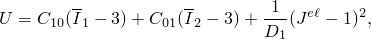

where *U* is the strain energy per unit of reference volume; , 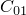, and  are temperature-dependent material parameters;  and 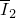 are the first and second deviatoric strain invariants defined as 

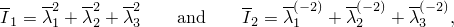

where the deviatoric stretches ; *J* is the total volume ratio;  is the elastic volume ratio as defined below in ["Thermal expansion";](pt05ch22s05abm07.md#usb-mat-chyperelastic-therm-expan) and  are the principal stretches. The initial shear modulus and bulk modulus are given by 

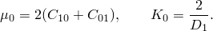

#### Neo-Hookean form

The form of the neo-Hookean strain energy potential is 

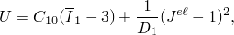

where *U* is the strain energy per unit of reference volume;  and  are temperature-dependent material parameters;  is the first deviatoric strain invariant defined as 


where the deviatoric stretches ; *J* is the total volume ratio;  is the elastic volume ratio as defined below in ["Thermal expansion";](pt05ch22s05abm07.md#usb-mat-chyperelastic-therm-expan) and  are the principal stretches. The initial shear modulus and bulk modulus are given by 

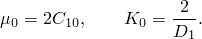

#### Ogden form

The form of the Ogden strain energy potential is 

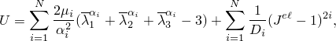

where  are the deviatoric principal stretches ;  are the principal stretches; *N* is a material parameter; and , , and  are temperature-dependent material parameters. The initial shear modulus and bulk modulus for the Ogden form are given by 

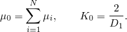

The particular material models described above—the Mooney-Rivlin and neo-Hookean forms—can also be obtained from the general Ogden strain energy potential for special choices of  and . 

#### Polynomial form

The form of the polynomial strain energy potential is 


where *U* is the strain energy per unit of reference volume; *N* is a material parameter;  and  are temperature-dependent material parameters;  and  are the first and second deviatoric strain invariants defined as 


where the deviatoric stretches ; *J* is the total volume ratio;  is the elastic volume ratio as defined below in ["Thermal expansion";](pt05ch22s05abm07.md#usb-mat-chyperelastic-therm-expan) and  are the principal stretches. The initial shear modulus and bulk modulus are given by 


For cases where the nominal strains are small or only moderately large (< 100%), the first terms in the polynomial series usually provide a sufficiently accurate model. Some particular material models—the Mooney-Rivlin, neo-Hookean, and Yeoh forms—are obtained for special choices of . 

#### Reduced polynomial form

The form of the reduced polynomial strain energy potential is 

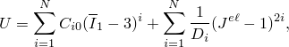

where *U* is the strain energy per unit of reference volume; *N* is a material parameter; 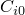 and  are temperature-dependent material parameters;  is the first deviatoric strain invariant defined as 


where the deviatoric stretches ; *J* is the total volume ratio;  is the elastic volume ratio as defined below in ["Thermal expansion";](pt05ch22s05abm07.md#usb-mat-chyperelastic-therm-expan) and  are the principal stretches. The initial shear modulus and bulk modulus are given by 


#### Van der Waals form

The form of the Van der Waals strain energy potential is

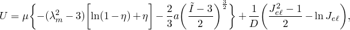

where 

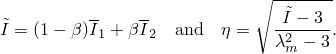

Here, *U* is the strain energy per unit of reference volume;  is the initial shear modulus;  is the locking stretch; *a* is the global interaction parameter;  is an invariant mixture parameter; and *D* governs the compressibility. These parameters can be temperature-dependent.  and  are the first and second deviatoric strain invariants defined as 


where the deviatoric stretches ; *J* is the total volume ratio;  is the elastic volume ratio as defined below in ["Thermal expansion";](pt05ch22s05abm07.md#usb-mat-chyperelastic-therm-expan) and  are the principal stretches. The initial shear modulus and bulk modulus are given by 

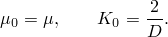

#### Yeoh form

The form of the Yeoh strain energy potential is 

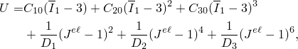

where *U* is the strain energy per unit of reference volume;  and  are temperature-dependent material parameters;  is the first deviatoric strain invariant defined as 


where the deviatoric stretches ; *J* is the total volume ratio;  is the elastic volume ratio as defined below in ["Thermal expansion";](pt05ch22s05abm07.md#usb-mat-chyperelastic-therm-expan) and  are the principal stretches. The initial shear modulus and bulk modulus are given by 


### Thermal expansion

Only isotropic thermal expansion is permitted with the hyperelastic material model.

The elastic volume ratio, , relates the total volume ratio, *J*, and the thermal volume ratio, : 


 is given by 


where  is the linear thermal expansion strain that is obtained from the temperature and the isotropic thermal expansion coefficient (["Thermal expansion," Section 26.1.2](pt05ch26s01abm52.md)).

### Defining the hyperelastic material response

The mechanical response of a material is defined by choosing a strain energy potential to fit the particular material. The strain energy potential forms in Abaqus are written as separable functions of a deviatoric component and a volumetric component; i.e., 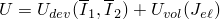. Alternatively, in Abaqus/Standard you can define the strain energy potential with user subroutine [`UHYPER`](../sub/sub-link.md#sub-xsl-uhyper), in which case the strain energy potential need not be separable.

Generally for the hyperelastic material models available in Abaqus, you can either directly specify material coefficients or provide experimental test data and have Abaqus automatically determine appropriate values of the coefficients. An exception is the Marlow form: in this case the deviatoric part of the strain energy potential must be defined with test data. The different methods for defining the strain energy potential are described in detail below.

The properties of rubberlike materials can vary significantly from one batch to another; therefore, if data are used from several experiments, all of the experiments should be performed on specimens taken from the same batch of material, regardless of whether you or Abaqus compute the coefficients.

#### Viscoelastic and hysteretic materials

The elastic response of viscoelastic materials (["Time domain viscoelasticity," Section 22.7.1](pt05ch22s07abm12.md), and ["Parallel rheological framework," Section 22.8.2](pt05ch22s08abm15.md)) and hysteretic materials (["Hysteresis in elastomers," Section 22.8.1](pt05ch22s08abm14.md)) can be specified by defining either the instantaneous response or the long-term response of such materials. To define the instantaneous response, the experiments outlined in the “Experimental tests” section that follows have to be performed within time spans much shorter than the characteristic relaxation times of these materials.

| **Input File Usage: ** | ``` [*HYPERELASTIC](../key/key-link.md#usb-kws-mhyperelast), MODULI=INSTANTANEOUS ``` |
| --- | --- |

| **Abaqus/CAE Usage: ** | Property module: material editor: ****Mechanical****Elasticity****Hyperelastic****: **Material type: Isotropic**; any **Strain energy potential** except **Unknown**: **Moduli time scale (for viscoelasticity): Instantaneous** |
| --- | --- |

If, on the other hand, the long-term elastic response is used, data from experiments have to be collected after time spans much longer than the characteristic relaxation times of these materials. Long-term elastic response is the default elastic material behavior.

| **Input File Usage: ** | ``` [*HYPERELASTIC](../key/key-link.md#usb-kws-mhyperelast), MODULI=LONG TERM ``` |
| --- | --- |

| **Abaqus/CAE Usage: ** | Property module: material editor: ****Mechanical****Elasticity****Hyperelastic****: **Material type: Isotropic**; any **Strain energy potential** except **Unknown**: **Moduli time scale (for viscoelasticity): Long-term** |
| --- | --- |

#### Accounting for compressibility

Compressibility can be defined by specifying nonzero values for  (except for the Marlow model), by setting the Poisson's ratio to a value less than 0.5, or by providing test data that characterize the compressibility. The test data method is described later in this section. If you specify the Poisson's ratio for hyperelasticity other than the Marlow model, Abaqus computes the initial bulk modulus from the initial shear modulus 

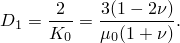

For the Marlow model the specified Poisson's ratio represents a constant value, which determines the volumetric response throughout the deformation process. If  is equal to zero, all of the  must be equal to zero. In such a case the material is assumed to be fully incompressible in Abaqus/Standard, while Abaqus/Explicit will assume compressible behavior with  (Poisson's ratio of 0.475).

| **Input File Usage: ** | ``` [*HYPERELASTIC](../key/key-link.md#usb-kws-mhyperelast), POISSON= ``` |
| --- | --- |

| **Abaqus/CAE Usage: ** | Property module: material editor: ****Mechanical****Elasticity****Hyperelastic****: **Material type: Isotropic**; any **Strain energy potential** except **Unknown** or **User-defined**: **Input source: Test data**: **Poisson's ratio:**  |
| --- | --- |

#### Specifying material coefficients directly

The parameters of the hyperelastic strain energy potentials can be given directly as functions of temperature for all forms of the strain energy potential except the Marlow form.

| **Input File Usage: ** | Use one of the following options: |
| --- | --- |
|  | ``` [*HYPERELASTIC](../key/key-link.md#usb-kws-mhyperelast), ARRUDA-BOYCE [*HYPERELASTIC](../key/key-link.md#usb-kws-mhyperelast), MOONEY-RIVLIN [*HYPERELASTIC](../key/key-link.md#usb-kws-mhyperelast), NEO HOOKE [*HYPERELASTIC](../key/key-link.md#usb-kws-mhyperelast), OGDEN, N=*n* () [*HYPERELASTIC](../key/key-link.md#usb-kws-mhyperelast), POLYNOMIAL, N=*n* () [*HYPERELASTIC](../key/key-link.md#usb-kws-mhyperelast), REDUCED POLYNOMIAL, N=*n* () [*HYPERELASTIC](../key/key-link.md#usb-kws-mhyperelast), VAN DER WAALS [*HYPERELASTIC](../key/key-link.md#usb-kws-mhyperelast), YEOH ``` |

| **Abaqus/CAE Usage: ** | Property module: material editor: ****Mechanical****Elasticity****Hyperelastic****: **Material type: Isotropic**; **Input source: Coefficients** and **Strain energy potential: Arruda-Boyce**, **Mooney-Rivlin**, **Neo Hooke**, **Ogden**, **Polynomial**, **Reduced Polynomial**, **Van der Waals**, or **Yeoh** |
| --- | --- |

#### Using test data to calibrate material coefficients

The material coefficients of the hyperelastic models can be calibrated by Abaqus from experimental stress-strain data. In the case of the Marlow model, the test data directly characterize the strain energy potential (there are no material coefficients for this model); the Marlow model is described in detail below. The value of *N* and experimental stress-strain data can be specified for up to four simple tests: uniaxial, equibiaxial, planar, and, if the material is compressible, a volumetric compression test. Abaqus will then compute the material parameters. The material constants are determined through a least-squares-fit procedure, which minimizes the relative error in stress. For the *n* nominal-stress–nominal-strain data pairs, the relative error measure *E* is minimized, where 

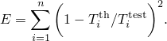

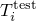 is a stress value from the test data, and  comes from one of the nominal stress expressions derived below (see “Experimental tests”). Abaqus minimizes the relative error rather than an absolute error measure since this provides a better fit at lower strains. This method is available for all strain energy potentials and any order of *N* except for the polynomial form, where a maximum of 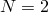 is allowed. The polynomial models are linear in terms of the constants ; therefore, a linear least-squares procedure can be used. The Arruda-Boyce, Ogden, and Van der Waals potentials are nonlinear in some of their coefficients, thus necessitating the use of a nonlinear least-squares procedure. ["Fitting of hyperelastic and hyperfoam constants," Section 4.6.2 of the Abaqus Theory Guide](../stm/stm-link.md#stm-mat-fithyperconst), contains a detailed derivation of the related equations.

It is generally best to obtain data from several experiments involving different kinds of deformation over the range of strains of interest in the actual application and to use all of these data to determine the parameters. This is particularly true for the phenomenological models; i.e., the Ogden and the polynomial models. It has been observed that to achieve good accuracy and stability, it is necessary to fit these models using test data from more than one deformation state. In some cases, especially at large strains, removing the dependence on the second invariant may alleviate this limitation. The Arruda-Boyce, neo-Hookean, and Van der Waals models with  = 0 offer a physical interpretation and provide a better prediction of general deformation modes when the parameters are based on only one test. An extensive discussion of this topic can be found in ["Hyperelastic material behavior," Section 4.6.1 of the Abaqus Theory Guide](../stm/stm-link.md#stm-mat-hyperelastic).

This method does not allow the hyperelastic properties to be temperature dependent. However, if temperature-dependent test data are available, several curve fits can be conducted by performing a data check analysis on a simple input file. The temperature-dependent coefficients determined by Abaqus can then be entered directly in the actual analysis run.

Optionally, the parameter  in the Van der Waals model can be set to a fixed value while the other parameters are found using a least-squares curve fit.

As many data points as required can be entered from each test. It is recommended that data from all four tests (on samples taken from the same piece of material) be included and that the data points cover the range of nominal strains expected to arise in the actual loading. For the (general) polynomial and Ogden models and for the coefficient  in the Van der Waals model, the planar test data must be accompanied by the uniaxial test data, the biaxial test data, or both of these types of test data; otherwise, the solution to the least-squares fit will not be unique.

The strain data should be given as nominal strain values (change in length per unit of original length). For the uniaxial, equibiaxial, and planar tests stress data are given as nominal stress values (force per unit of original cross-sectional area). These tests allow for entering both compression and tension data. Compressive stresses and strains are entered as negative values. 

If compressibility is to be specified, the  or *D* can be computed from volumetric compression test data. Alternatively, compressibility can be defined by specifying a Poisson's ratio, in which case Abaqus computes the bulk modulus from the initial shear modulus. If no such data are given, Abaqus/Standard assumes that *D* or all of the  are zero, whereas Abaqus/Explicit assumes compressibility corresponding to a Poisson's ratio of 0.475 (see “Compressibility in Abaqus/Explicit” above). For these compression tests the stress data are given as pressure values.

| **Input File Usage: ** | Use one of the following options to select the strain energy potential: |
| --- | --- |
|  | ``` [*HYPERELASTIC](../key/key-link.md#usb-kws-mhyperelast), TEST DATA INPUT, ARRUDA-BOYCE [*HYPERELASTIC](../key/key-link.md#usb-kws-mhyperelast), TEST DATA INPUT, MOONEY-RIVLIN [*HYPERELASTIC](../key/key-link.md#usb-kws-mhyperelast), TEST DATA INPUT, NEO HOOKE [*HYPERELASTIC](../key/key-link.md#usb-kws-mhyperelast), TEST DATA INPUT, OGDEN, N=*n* () [*HYPERELASTIC](../key/key-link.md#usb-kws-mhyperelast), TEST DATA INPUT, POLYNOMIAL, N=*n* () [*HYPERELASTIC](../key/key-link.md#usb-kws-mhyperelast), TEST DATA INPUT, REDUCED POLYNOMIAL, N=*n* () [*HYPERELASTIC](../key/key-link.md#usb-kws-mhyperelast), TEST DATA INPUT, VAN DER WAALS [*HYPERELASTIC](../key/key-link.md#usb-kws-mhyperelast), TEST DATA INPUT, VAN DER WAALS, BETA= () [*HYPERELASTIC](../key/key-link.md#usb-kws-mhyperelast), TEST DATA INPUT, YEOH ``` In addition, use at least one and up to four of the following options to give the test data (see "Experimental tests" below): ``` [*UNIAXIAL TEST DATA](../key/key-link.md#usb-kws-munitestdata) [*BIAXIAL TEST DATA](../key/key-link.md#usb-kws-mbitestdata) [*PLANAR TEST DATA](../key/key-link.md#usb-kws-mplanartestdata) [*VOLUMETRIC TEST DATA](../key/key-link.md#usb-kws-mvoltestdata) ``` |

| **Abaqus/CAE Usage: ** | Property module: material editor: ****Mechanical****Elasticity****Hyperelastic****: **Material type: Isotropic**; **Input source: Test data** and **Strain energy potential: Arruda-Boyce**, **Mooney-Rivlin**, **Neo Hooke**, **Ogden**, **Polynomial**, **Reduced Polynomial**, **Van der Waals** (**Beta: Fitted value** or **Specify**), or **Yeoh** |
| --- | --- |
|  | In addition, use at least one and up to four of the following options to give the test data (see "Experimental tests" below): ****Test Data****Uniaxial Test Data********Test Data****Biaxial Test Data********Test Data****Planar Test Data********Test Data****Volumetric Test Data**** Alternatively, you can select **Strain energy potential: Unknown** to define the material temporarily without specifying a particular strain energy potential. Then select ****Material****Evaluate**** to have Abaqus/CAE evaluate the material to determine the optimal strain energy potential. |

#### Specifying the Marlow model

The Marlow model assumes that the strain energy potential is independent of the second deviatoric invariant . This model is defined by providing test data that define the deviatoric behavior, and, optionally, the volumetric behavior if compressibility must be taken into account. Abaqus will construct a strain energy potential that reproduces the test data exactly, as shown in [Figure 22.5.1--1](pt05ch22s05abm07.md#chyperelast-marlow). 

**Figure 22.5.1–1** The results of the Marlow model with test data.

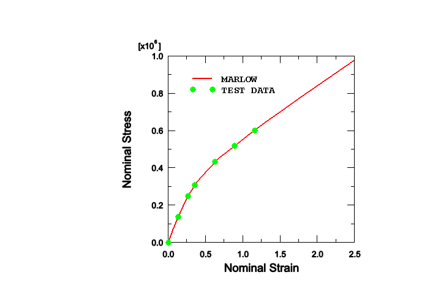

The interpolation and extrapolation of stress-strain data with the Marlow model is approximately linear for small and large strains. For intermediate strains in the range 0.1 to 1.0 a noticeable degree of nonlinearity may be observed in the interpolation/extrapolation with the Marlow model; for example, some nonlinearity is apparent between the 4th and 5th data points in [Figure 22.5.1--1](pt05ch22s05abm07.md#chyperelast-marlow). To minimize undesirable nonlinearity, make sure that enough data points are specified in the intermediate strain range.

The deviatoric behavior is defined by specifying uniaxial, biaxial, or planar test data. Generally, you can specify either the data from tension tests or the data from compression tests because the tests are equivalent (see ["Equivalent experimental tests](pt05ch22s05abm07.md#usb-mat-chyperelast-equiv-tests)). However, for beams, trusses, and rebars, the data from tension and compression tests can be specified together. Volumetric behavior is defined by using one of the following three methods:
- Specify nominal lateral strains, in addition to nominal stresses and nominal strains, as part of the uniaxial, biaxial, or planar test data.
- Specify Poisson's ratio for the hyperelastic material.
- Specify volumetric test data directly. Both hydrostatic tension and hydrostatic compression data can be specified. If only hydrostatic compression data are available, as is usually the case, Abaqus will assume that the hydrostatic pressure is an antisymmetric function of the nominal volumetric strain, 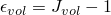.

If you do not define volumetric behavior, Abaqus/Standard assumes fully incompressible behavior, while Abaqus/Explicit assumes compressibility corresponding to a Poisson's ratio of 0.475.

Material test data in which the stress does not vary smoothly with increasing strain may lead to convergence difficulty during the simulation. It is highly recommended that smooth test data be used to define the Marlow form. Abaqus provides a smoothing algorithm, which is described in detail later in this section.

The test data for the Marlow model can also be given as a function of temperature and field variables. You must specify the number of user-defined field variable dependencies required.

Uniaxial, biaxial, and planar test data must be given in ascending order of the nominal strains; volumetric test data must be given in descending order of the volume ratio.

| **Input File Usage: ** | To define the Marlow test data as a function of temperature and/or field variables, use the following option: |
| --- | --- |
|  | ``` [*HYPERELASTIC](../key/key-link.md#usb-kws-mhyperelast), MARLOW ``` with one of the following first three options and, optionally, the fourth option: ``` [*UNIAXIAL TEST DATA](../key/key-link.md#usb-kws-munitestdata), DEPENDENCIES=*n* [*BIAXIAL TEST DATA](../key/key-link.md#usb-kws-mbitestdata), DEPENDENCIES=*n* [*PLANAR TEST DATA](../key/key-link.md#usb-kws-mplanartestdata), DEPENDENCIES=*n* [*VOLUMETRIC TEST DATA](../key/key-link.md#usb-kws-mvoltestdata), DEPENDENCIES=*n* ``` |

| **Abaqus/CAE Usage: ** | Property module: material editor: ****Mechanical****Elasticity****Hyperelastic****: **Material type: Isotropic**; **Input source: Test data** and **Strain energy potential: Marlow** |
| --- | --- |
|  | In addition, select one of the following first three options and, optionally, the fourth option to give the test data (see "Experimental tests" below): ****Test Data****Uniaxial Test Data********Test Data****Biaxial Test Data********Test Data****Planar Test Data********Test Data****Volumetric Test Data**** In each of the **Test Data Editor** dialog boxes, you can toggle on **Use temperature-dependent data** to define the test data as a function of temperature and/or select the **Number of field variables** to define the test data as a function of field variables. Alternatively, you can select ****Material****Evaluate**** to have Abaqus/CAE evaluate the material. If you included temperature dependencies, field variable dependencies, or lateral nominal strain in the test data---which can only be defined in the **Marlow** hyperelastic definition---**Marlow** will be the only strain energy potential available for evaluation. |

#### User subroutine specification in Abaqus/Standard

An alternative method provided in Abaqus/Standard for defining the hyperelastic material parameters allows the strain energy potential to be defined in user subroutine [`UHYPER`](../sub/sub-link.md#sub-xsl-uhyper). Either compressible or incompressible behavior can be specified. Optionally, you can specify the number of property values needed as data in the user subroutine. The derivatives of the strain energy potential with respect to the strain invariants must be provided directly through user subroutine [`UHYPER`](../sub/sub-link.md#sub-xsl-uhyper). If needed, you can specify the number of solution-dependent variables (see ["User subroutines: overview," Section 18.1.1](pt04ch18s01aus104.md)).

| **Input File Usage: ** | Use one of the following two options: |
| --- | --- |
|  | ``` [*HYPERELASTIC](../key/key-link.md#usb-kws-mhyperelast), USER, TYPE=COMPRESSIBLE, PROPERTIES=*n* [*HYPERELASTIC](../key/key-link.md#usb-kws-mhyperelast), USER, TYPE=INCOMPRESSIBLE, PROPERTIES=*n* ``` |

| **Abaqus/CAE Usage: ** | Property module: material editor: ****Mechanical****Elasticity****Hyperelastic****: **Material type: Isotropic**; **Input source: Coefficients** and **Strain energy potential: User-defined**: optionally, toggle on **Include compressibility** and/or specify the **Number of property values** |
| --- | --- |

### Experimental tests

For a homogeneous material, homogeneous deformation modes suffice to characterize the material constants. Abaqus accepts test data from the following deformation modes:
- Uniaxial tension and compression
- Equibiaxial tension and compression
- Planar tension and compression (also known as pure shear)
- Volumetric tension and compression

These modes are illustrated schematically in [Figure 22.5.1--2](pt05ch22s05abm07.md#chyperelast-def-modes) and are described below. The most commonly performed experiments are uniaxial tension, uniaxial compression, and planar tension. 

**Figure 22.5.1–2** Schematic illustrations of deformation modes.

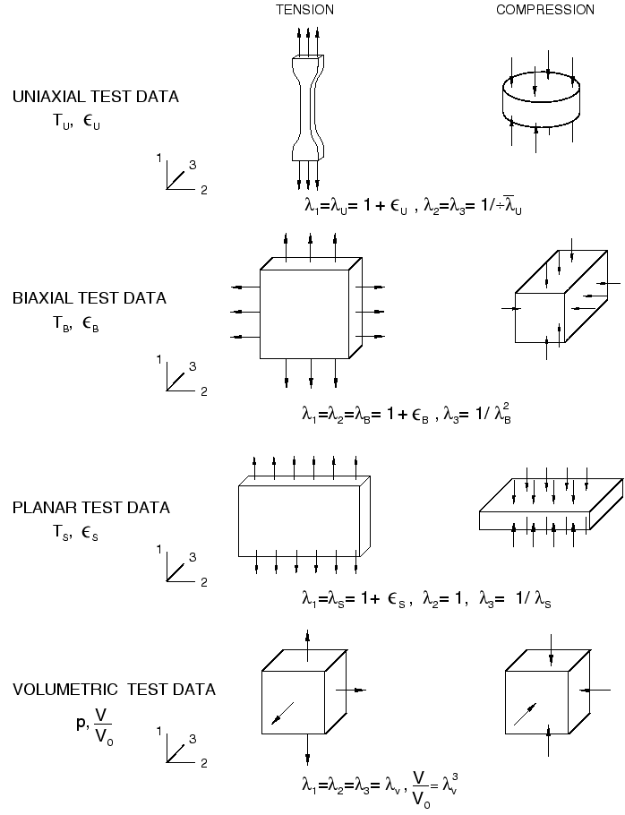

Combine data from these three test types to get a good characterization of the hyperelastic material behavior.

For the incompressible version of the material model, the stress-strain relationships for the different tests are developed using derivatives of the strain energy function with respect to the strain invariants. We define these relations in terms of the nominal stress (the force divided by the original, undeformed area) and the nominal, or engineering, strain defined below.

The deformation gradient, expressed in the principal directions of stretch, is 

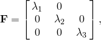

where , , and  are the principal stretches: the ratios of current length to length in the original configuration in the principal directions of a material fiber. The principal stretches, , are related to the principal nominal strains, , by 


Because we assume incompressibility and isothermal response,  and, hence, 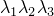 = 1. The deviatoric strain invariants in terms of the principal stretches are then 

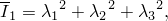

and 

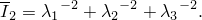

#### Uniaxial tests

The uniaxial deformation mode is characterized in terms of the principal stretches, , as 

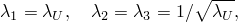

where  is the stretch in the loading direction. The nominal strain is defined by 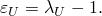

To derive the uniaxial nominal stress , we invoke the principle of virtual work: 

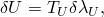

so that 

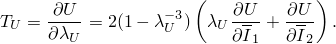

The uniaxial tension test is the most common of all the tests and is usually performed by pulling a “dog-bone” specimen. The uniaxial compression test is performed by loading a compression button between lubricated surfaces. The loading surfaces are lubricated to minimize any barreling effect in the button that would cause deviations from a homogeneous uniaxial compression stress-strain state.

| **Input File Usage: ** | ``` [*UNIAXIAL TEST DATA](../key/key-link.md#usb-kws-munitestdata) ``` |
| --- | --- |

| **Abaqus/CAE Usage: ** | Property module: material editor: ****Mechanical****Elasticity****Hyperelastic****: **Material type: Isotropic**; **Input source: Test data** and ****Test Data****Uniaxial Test Data**** |
| --- | --- |

#### Equibiaxial tests

The equibiaxial deformation mode is characterized in terms of the principal stretches, , as 

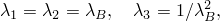

where 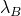 is the stretch in the two perpendicular loading directions. The nominal strain is defined by 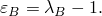

To develop the expression for the equibiaxial nominal stress, , we again use the principle of virtual work (assuming that the stress perpendicular to the loading direction is zero), 

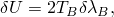

so that 

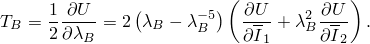

In practice, the equibiaxial compression test is rarely performed because of experimental setup difficulties. In addition, this deformation mode is equivalent to a uniaxial tension test, which is straightforward to conduct.

A more common test is the equibiaxial tension test, in which a stress state with two equal tensile stresses and zero shear stress is created. This state is usually achieved by stretching a square sheet in a biaxial testing machine. It can also be obtained by inflating a circular membrane into a spheroidal shape (like blowing up a balloon). The stress field in the middle of the membrane then closely approximates equibiaxial tension, provided that the thickness of the membrane is very much smaller than the radius of curvature at this point. However, the strain distribution will not be quite uniform, and local strain measurements will be required. Once the strain and radius of curvature are known, the nominal stress can be derived from the inflation pressure.

| **Input File Usage: ** | ``` [*BIAXIAL TEST DATA](../key/key-link.md#usb-kws-mbitestdata) ``` |
| --- | --- |

| **Abaqus/CAE Usage: ** | Property module: material editor: ****Mechanical****Elasticity****Hyperelastic****: **Material type: Isotropic**; **Input source: Test data** and ****Test Data****Biaxial Test Data**** |
| --- | --- |

#### Planar tests

The planar deformation mode is characterized in terms of the principal stretches, , as 

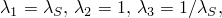

where 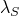 is the stretch in the loading direction. Then, the nominal strain in the loading direction is 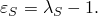

This test is also called a “pure shear” test since, in terms of logarithmic strains, 

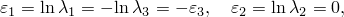

which corresponds to a state of pure shear at an angle of 45 to the loading direction.

The principle of virtual work gives 

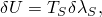

where  is the nominal planar stress, so that 

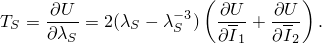

For the (general) polynomial and Ogden models and for the coefficient  in the Van der Waals model this equation alone will not determine the constants uniquely. The planar test data must be augmented by uniaxial test data and/or biaxial test data to determine the material parameters.

Planar tests are usually done with a thin, short, and wide rectangular strip of material fixed on its wide edges to rigid loading clamps that are moved apart. If the separation direction is the *1*-direction and the thickness direction is the *3*-direction, the comparatively long size of the specimen in the *2*-direction and the rigid clamps allow us to use the approximation ; that is, there is no deformation in the wide direction of the specimen. This deformation mode could also be called planar compression if the *3*-direction is considered to be the primary direction. All forms of incompressible plane strain behavior are characterized by this deformation mode. Consequently, if plane strain analysis is performed, planar test data represent the relevant form of straining of the material.

| **Input File Usage: ** | ``` [*PLANAR TEST DATA](../key/key-link.md#usb-kws-mplanartestdata) ``` |
| --- | --- |

| **Abaqus/CAE Usage: ** | Property module: material editor: ****Mechanical****Elasticity****Hyperelastic****: **Material type: Isotropic**; **Input source: Test data** and ****Test Data****Planar Test Data**** |
| --- | --- |

#### Volumetric tests

The following discussion describes procedures for obtaining  values (or *D*, for the Arruda-Boyce and Van der Waals models) corresponding to the actual material behavior. With these values you can compare the material's initial bulk modulus, , to its initial shear modulus ( for the polynomial model,  for Ogden's model) and then judge whether  values that will provide results are sufficiently realistic. For Abaqus/Explicit caution should be used;  should be less than 100. Otherwise, noisy solutions will be obtained and time increments will be excessively small (see “Compressibility in Abaqus/Explicit” above). The  and *D* can be calculated from data obtained in pure volumetric compression of a specimen (volumetric tension tests are much more difficult to perform). In a pure volumetric test ; therefore,  and  (the volume ratio). Using the polynomial form of the strain energy potential, the total pressure stress on the specimen is obtained as 


This equation can be used to determine the . If we are using a second-order polynomial series for *U*, we have , and so two  are needed. Therefore, a minimum of two points on the pressure-volume ratio curve are required to give two equations for the . For the Ogden and reduced polynomial potentials  can be determined for up to . A linear least-squares fit is performed when more than *N* data points are provided. 

An approximate way of conducting a volumetric test consists of using a cylindrical rubber specimen that fits snugly inside a rigid container and whose top surface is compressed by a rigid piston. Although both volumetric and deviatoric deformation are present, the deviatoric stresses will be several orders of magnitude smaller than the hydrostatic stresses (because the bulk modulus is much higher than the shear modulus) and can be neglected. The compressive stress imposed by the rigid piston is effectively the pressure, and the volumetric strain in the rubber cylinder is computed from the piston displacement.

Nonzero values of  affect the uniaxial, equibiaxial, and planar stress results. However, since the material is assumed to be only slightly compressible, the techniques described for obtaining the deviatoric coefficients should give sufficiently accurate values even though they assume that the material is fully incompressible.

| **Input File Usage: ** | ``` [*VOLUMETRIC TEST DATA](../key/key-link.md#usb-kws-mvoltestdata) ``` |
| --- | --- |

| **Abaqus/CAE Usage: ** | Property module: material editor: ****Mechanical****Elasticity****Hyperelastic****: **Material type: Isotropic**; **Input source: Test data** and ****Test Data****Volumetric Test Data**** |
| --- | --- |

#### Equivalent experimental tests

The superposition of a tensile or compressive hydrostatic stress on a loaded, fully incompressible elastic body results in different stresses but does not change the deformation. Thus, [Figure 22.5.1--3](pt05ch22s05abm07.md#chyperelast-equiv-def-modes) shows that some apparently different loading conditions are actually equivalent in their deformations and, therefore, are equivalent tests:
- Uniaxial tension  Equibiaxial compression
- Uniaxial compression  Equibiaxial tension
- Planar tension  Planar compression

**Figure 22.5.1–3** Equivalent deformation modes through superposition of hydrostatic stress.


On the other hand, the tensile and compressive cases of the uniaxial and equibiaxial modes are independent from each other: uniaxial tension and uniaxial compression provide independent data. 

#### Smoothing the test data

Experimental test data often contain noise in the sense that the test variable is both slowly varying and also corrupted by random noise. This noise can affect the quality of the strain energy potential that Abaqus derives. This noise is particularly a problem with the Marlow form, where a strain energy potential that exactly describes the test data that are used to calibrate the model is computed. It is less of a concern with the other forms, since smooth functions are fitted through the test data.

Abaqus provides a smoothing technique to remove the noise from the test data based on the Savitzky-Golay method. The idea is to replace each data point by a local average of its surrounding data points, so that the level of noise can be reduced without biasing the dominant trend of the test data. In the implementation a cubic polynomial is fitted through each data point *i* and *n* data points to the immediate left and right of that point. A least-squares method is used to fit the polynomial through these  points. The value of data point *i* is then replaced by the value of the polynomial at the same position. Each polynomial is used to adjust one data point except near the ends of the curve, where a polynomial is used to adjust multiple points, because the first and last few points cannot be the center of the fitting set of data points. This process is applied repeatedly to all data points until two consecutive passes through the data produce nearly the same results.

By default, the test data are not smoothed. If smoothing is specified, the default value is *n*=3. Alternatively, you can specify the number of data points to the left and right of a data point in the moving window within which a least-squares polynomial is fit.

| **Input File Usage: ** | For the Marlow form, use one of the first three options and, optionally, the fourth option; for the other potential forms, use one and up to four of the following options: |
| --- | --- |
|  | ``` [*UNIAXIAL TEST DATA](../key/key-link.md#usb-kws-munitestdata), SMOOTH=*n* () [*BIAXIAL TEST DATA](../key/key-link.md#usb-kws-mbitestdata), SMOOTH=*n* () [*PLANAR TEST DATA](../key/key-link.md#usb-kws-mplanartestdata), SMOOTH=*n* () [*VOLUMETRIC TEST DATA](../key/key-link.md#usb-kws-mvoltestdata), SMOOTH=*n* () ``` |

| **Abaqus/CAE Usage: ** | Property module: material editor: ****Mechanical****Elasticity****Hyperelastic****: **Material type: Isotropic**; **Input source: Test data** and ****Test Data****Uniaxial Test Data****, **Biaxial Test Data**, **Planar Test Data**, or **Volumetric Test Data** |
| --- | --- |
|  | In each of the **Test Data Editor** dialog boxes, toggle on **Apply smoothing**, and select a value for *n* (). |

### Model prediction of material behavior versus experimental data

Once the strain energy potential is determined, the behavior of the hyperelastic model in Abaqus is established. However, the quality of this behavior must be assessed: the prediction of material behavior under different deformation modes must be compared against the experimental data. You must judge whether the strain energy potentials determined by Abaqus are acceptable, based on the correlation between the Abaqus predictions and the experimental data. You can evaluate the hyperelastic behavior automatically in Abaqus/CAE. Alternatively, single-element test cases can be used to derive the nominal stress–nominal strain response of the material model.

See ["Fitting of rubber test data," Section 3.1.4 of the Abaqus Benchmarks Guide](../bmk/bmk-link.md#bmk-mat-rubberfit), which illustrates the entire process of fitting hyperelastic constants to a set of test data.

#### Hyperelastic material stability

An important consideration in judging the quality of the fit to experimental data is the concept of material or Drucker stability. Abaqus checks the Drucker stability of the material for the first three deformation modes described above.

The Drucker stability condition for an incompressible material requires that the change in the stress, , following from any infinitesimal change in the logarithmic strain, , satisfies the inequality 


Using , where  is the tangent material stiffness, the inequality becomes 


thus requiring the tangential material stiffness to be positive-definite.

For an isotropic elastic formulation the inequality can be represented in terms of the principal stresses and strains, 


As before, since the material is assumed to be incompressible, we can choose any value for the hydrostatic pressure without affecting the strains. A convenient choice for the stability calculation is , which allows us to ignore the third term in the above equation.

The relation between the changes in stress and in strain can then be obtained in the form of the matrix 


where . For material stability  must be positive-definite; thus, it is necessary that 


This stability check is performed for the polynomial models, the Ogden potential, the Van der Waals form, and the Marlow form. The Arruda-Boyce form is always stable for positive values of (, ); hence, it suffices to check the material coefficients to ensure stability.

You should be careful when defining the  or  for the polynomial models or the Ogden form: especially when , the behavior at higher strains is strongly sensitive to the values of the  or , and unstable material behavior may result if these values are not defined correctly. When some of the coefficients are strongly negative, instability at higher strain levels is likely to occur.

Abaqus performs a check on the stability of the material for six different forms of loading—uniaxial tension and compression, equibiaxial tension and compression, and planar tension and compression—for  (nominal strain range of ) at intervals . If an instability is found, Abaqus issues a warning message and prints the lowest absolute value of  for which the instability is observed. Ideally, no instability occurs. If instabilities are observed at strain levels that are likely to occur in the analysis, it is strongly recommended that you either change the material model or carefully examine and revise the material input data. If user subroutine [`UHYPER`](../sub/sub-link.md#sub-xsl-uhyper) is used to define the hyperelastic material, you are responsible for ensuring stability.

#### Improving the accuracy and stability of the test data fit

Unfortunately, the initial fit of the models to experimental data may not come out as well as expected. This is particularly true for the most general models, such as the (general) polynomial model and the Ogden model. For some of the simpler models, stability is assured by following some simple rules.
- For positive values of the initial shear modulus, , and the locking stretch, , the Arruda-Boyce form is always stable.
- For positive values of the coefficient  the neo-Hookean form is always stable.
- Given positive values of the initial shear modulus, , and the locking stretch, , the stability of the Van der Waals model depends on the global interaction parameter, *a*.
- For the Yeoh model stability is assured if all . Typically, however,  will be negative, since this helps capture the S-shape feature of the stress-strain curve. Thus, reducing the absolute value of  or magnifying the absolute value of  will help make the Yeoh model more stable.

In all cases the following suggestions may improve the quality of the fit:- Both tension and compression data are allowed; compressive stresses and strains are entered as negative values. Use compression or tension data depending on the application: it is difficult to fit a single material model accurately to both tensile and compressive data.
- Always use many more experimental data points than unknown coefficients.
- If  is used, experimental data should be available to at least 100% tensile strain or 50% compressive strain.
- Perform different types of tests (e.g., compression and simple shear tests). Proper material behavior for a deformation mode requires test data to characterize that mode.
- Check for warning messages about material instability or error messages about lack of convergence in fitting the test data. This check is especially important with new test data; a simple finite element model with the new test data can be run through the analysis input file processor to check the material stability.
- Use the material evaluation capability in Abaqus/CAE to compare the response curves for different strain energy potentials to the experimental data. Alternatively, you can perform one-element simulations for simple deformation modes and compare the Abaqus results against the experimental data. The *X--Y* plotting options in the Visualization module of Abaqus/CAE can be used for this comparison.
- Delete some data points at very low strains if large strains are anticipated. A disproportionate number of low strain points may unnecessarily bias the accuracy of the fit toward the low strain range and cause greater errors in the large strain range.
- Delete some data points at the highest strains if small to moderate strains are expected. The high strain points may force the fitting to lose accuracy and/or stability in the low strain range.
- Pick data points at evenly spaced strain intervals over the expected range of strains, which will result in similar accuracy throughout the entire strain range.
- The higher the order of *N*, the more oscillations are likely to occur, leading to instabilities in the stress-strain curves. If the (general) polynomial model is used, lower the order of *N* from 2 to 1 (3 to 2 for Ogden), especially if the maximum strain level is low (say, less than 100% strain).
- If multiple types of test data are used and the fit still comes out poorly, some of the test data probably contain experimental errors. New tests may be needed. One way of determining which test data are erroneous is to first calibrate the initial shear modulus  of the material. Then fit each type of test data separately in Abaqus and compute the shear modulus, , from the material constants using the relations  Alternatively, the initial Young's modulus, , can be calibrated and compared with  The values of  or  that are most different from  or  indicate the erroneous test data.

### Elements

The hyperelastic material model can be used with solid (continuum) elements, finite-strain shells (except S4), continuum shells, membranes, and one-dimensional elements (trusses and rebars). In Abaqus/Standard the hyperelastic material model can be also used with Timoshenko beams (B21, B22, B31, B31OS, B32, B32OS, PIPE21, PIPE22, PIPE31, PIPE32, and their “hybrid” equivalents). It cannot be used with Euler-Bernoulli beams (B23, B23H, B33, and B33H) and small-strain shells (STRI3, STRI65, S4R5, S8R, S8R5, S9R5).

#### Pure displacement formulation versus hybrid formulation in Abaqus/Standard

For continuum elements in Abaqus/Standard hyperelasticity can be used with the pure displacement formulation elements or with the “hybrid” (mixed formulation) elements. Because elastomeric materials are usually almost incompressible, fully integrated pure displacement method elements are not recommended for use with this material, except for plane stress cases. If fully or selectively reduced-integration displacement method elements are used with the almost incompressible form of this material model, a penalty method is used to impose the incompressibility constraint in anything except plane stress analysis. The penalty method can sometimes lead to numerical difficulties; therefore, the fully or selectively reduced-integrated “hybrid” formulation elements are recommended for use with hyperelastic materials.

In general, an analysis using a single hybrid element will be only slightly more computationally expensive than an analysis using a regular displacement-based element. However, when the wavefront is optimized, the Lagrange multipliers may not be ordered independently of the regular degrees of freedom associated with the element. Thus, the wavefront of a very large mesh of second-order hybrid tetrahedra may be noticeably larger than that of an equivalent mesh using regular second-order tetrahedra. This may lead to significantly higher CPU costs, disk space, and memory requirements.

#### Incompatible mode elements in Abaqus/Standard

Incompatible mode elements should be used with caution in applications involving large strains. Convergence may be slow, and in hyperelastic applications inaccuracies may accumulate. Erroneous stresses may sometimes appear in incompatible mode hyperelastic elements that are unloaded after having been subjected to a complex deformation history.

### Procedures

Hyperelasticity must always be used with geometrically nonlinear analyses (["General and linear perturbation procedures," Section 6.1.3](pt03ch06s01aus44.md)).


