# 22.5.2 Hyperelastic behavior in elastomeric foams


**Products: **Abaqus/Standard  Abaqus/Explicit  Abaqus/CAE  

##### **References**

- ["Material library: overview," Section 21.1.1](pt05ch21s01abo18.md)
- ["Elastic behavior: overview," Section 22.1.1](pt05ch22s01abo19.md)
- ["Energy dissipation in elastomeric foams," Section 22.6.2](pt05ch22s06abm11.md)
- [*HYPERFOAM](../key/key-link.md#usb-kws-mhyperfoam)
- [*UNIAXIAL TEST DATA](../key/key-link.md#usb-kws-munitestdata)
- [*BIAXIAL TEST DATA](../key/key-link.md#usb-kws-mbitestdata)
- [*PLANAR TEST DATA](../key/key-link.md#usb-kws-mplanartestdata)
- [*VOLUMETRIC TEST DATA](../key/key-link.md#usb-kws-mvoltestdata)
- [*SIMPLE SHEAR TEST DATA](../key/key-link.md#usb-kws-msimplesheartestdata)
- [*MULLINS EFFECT](../key/key-link.md#usb-kws-mmullinseffect)
- ["Creating a hyperfoam material model" in "Defining elasticity," Section 12.9.1 of the Abaqus/CAE User's Guide](../usi/usi-link.md#usi-prp-mechanical-elastic-hyperfoam)

### Overview

The elastomeric foam material model:
- is isotropic and nonlinear;
- is valid for cellular solids whose porosity permits very large volumetric changes;
- optionally allows the specification of energy dissipation and stress softening effects (see ["Energy dissipation in elastomeric foams," Section 22.6.2](pt05ch22s06abm11.md));
- can deform elastically to large strains, up to 90% strain in compression; and
- requires that geometric nonlinearity be accounted for during the analysis step (see ["Defining an analysis," Section 6.1.2](pt03ch06s01abo05.md), and ["General and linear perturbation procedures," Section 6.1.3](pt03ch06s01aus44.md)), since it is intended for finite-strain applications.

 Abaqus/Explicit also provides a separate foam material model intended to capture the strain-rate sensitive behavior of low-density elastomeric foams such as used in crash and impact applications (see ["Low-density foams," Section 22.9.1](pt05ch22s09abm16.md)).

### Mechanical behavior of elastomeric foams

Cellular solids are made up of interconnected networks of solid struts or plates that form the edges and faces of cells. Foams are made up of polyhedral cells that pack in three dimensions. The foam cells can be either open (e.g., sponge) or closed (e.g., flotation foam). Common examples of elastomeric foam materials are cellular polymers such as cushions, padding, and packaging materials that utilize the excellent energy absorption properties of foams: the energy absorbed by foams is substantially greater than that absorbed by ordinary stiff elastic materials for a certain stress level.

Another class of foam materials is crushable foams, which undergo permanent (plastic) deformation. Crushable foams are discussed in ["Crushable foam plasticity models," Section 23.3.5](pt05ch23s03abm34.md).

Foams are commonly loaded in compression. [Figure 22.5.2--1](pt05ch22s05abm08.md#chyperfoam-comp-curve) shows a typical compressive stress-strain curve.

**Figure 22.5.2–1** Typical compressive stress-strain curve.

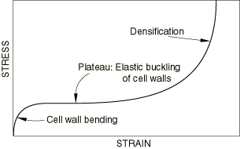

 Three stages can be distinguished during compression:

1. At small strains ( 5%) the foam deforms in a linear elastic manner due to cell wall bending.
2. The next stage is a plateau of deformation at almost constant stress, caused by the elastic buckling of the columns or plates that make up the cell edges or walls. In closed cells the enclosed gas pressure and membrane stretching increase the level and slope of the plateau.
3. Finally, a region of densification occurs, where the cell walls crush together, resulting in a rapid increase of compressive stress. Ultimate compressive nominal strains of 0.7 to 0.9 are typical.

 The tensile deformation mechanisms for small strains are similar to the compression mechanisms, but they differ for large strains. [Figure 22.5.2--2](pt05ch22s05abm08.md#chyperfoam-ten-curve) shows a typical tensile stress-strain curve. 

**Figure 22.5.2–2** Typical tensile stress-strain curve.

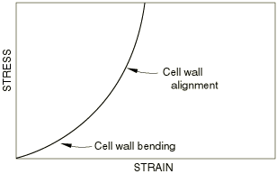

There are two stages during tension:

1. At small strains the foam deforms in a linear, elastic manner as a result of cell wall bending, similar to that in compression.
2. The cell walls rotate and align, resulting in rising stiffness. The walls are substantially aligned at a tensile strain of about . Further stretching results in increased axial strains in the walls.

At small strains for both compression and tension, the average experimentally observed Poisson's ratio, , of foams is 1/3. At larger strains it is commonly observed that Poisson's ratio is effectively zero during compression: the buckling of the cell walls does not result in any significant lateral deformation. However,  is nonzero during tension, which is a result of the alignment and stretching of the cell walls. 

The manufacture of foams often results in cells with different principal dimensions. This shape anisotropy results in different loading responses in different directions. However, the hyperfoam model does not take this kind of initial anisotropy into account. 

### Strain energy potential

In the elastomeric foam material model the elastic behavior of the foams is based on the strain energy function 

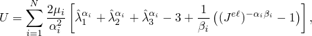

where *N* is a material parameter; , , and  are temperature-dependent material parameters; 

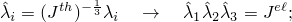

and  are the principal stretches. The elastic and thermal volume ratios,  and , are defined below.

The coefficients  are related to the initial shear modulus, , by 


while the initial bulk modulus, , follows from 

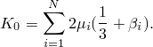

For each term in the energy function, the coefficient  determines the degree of compressibility.  is related to the Poisson's ratio, , by the expressions 


Thus, if  is the same for all terms, we have a single effective Poisson's ratio, . This effective Poisson's ratio is valid for finite values of the logarithmic principal strains 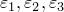; in uniaxial tension 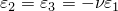.

### Thermal expansion

Only isotropic thermal expansion is permitted with the hyperfoam material model.

The elastic volume ratio, , relates the total volume ratio (current volume/reference volume), *J*, and the thermal volume ratio, : 


 is given by 


where  is the linear thermal expansion strain that is obtained from the temperature and the isotropic thermal expansion coefficient (["Thermal expansion," Section 26.1.2](pt05ch26s01abm52.md)).

### Determining the hyperfoam material parameters

The response of the material is defined by the parameters in the strain energy function, *U*; these parameters must be determined to use the hyperfoam model. Two methods are provided for defining the material parameters: you can specify the hyperfoam material parameters directly or specify test data and allow Abaqus to calculate the material parameters.

The elastic response of a viscoelastic material (["Time domain viscoelasticity," Section 22.7.1](pt05ch22s07abm12.md)) can be specified by defining either the instantaneous response or the long-term response of such a material. To define the instantaneous response, the experiments outlined in the “Experimental tests” section that follows have to be performed within time spans much shorter than the characteristic relaxation time of the material.

| **Input File Usage: ** | ``` [*HYPERFOAM](../key/key-link.md#usb-kws-mhyperfoam), MODULI=INSTANTANEOUS ``` |
| --- | --- |

| **Abaqus/CAE Usage: ** | Property module: material editor: ****Mechanical****Elasticity****Hyperfoam****: **Moduli time scale (for viscoelasticity): Instantaneous** |
| --- | --- |

If, on the other hand, the long-term elastic response is used, data from experiments have to be collected after time spans much longer than the characteristic relaxation time of the viscoelastic material. Long-term elastic response is the default elastic material behavior.

| **Input File Usage: ** | ``` [*HYPERFOAM](../key/key-link.md#usb-kws-mhyperfoam), MODULI=LONG TERM ``` |
| --- | --- |

| **Abaqus/CAE Usage: ** | Property module: material editor: ****Mechanical****Elasticity****Hyperfoam****: **Moduli time scale (for viscoelasticity): Long-term** |
| --- | --- |

#### Direct specification

When the parameters *N*, , , and  are specified directly, they can be functions of temperature. 

The default value of  is zero, which corresponds to an effective Poisson's ratio of zero. The incompressible limit corresponds to all 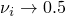. However, this material model should not be used for approximately incompressible materials: use of the hyperelastic model (["Hyperelastic behavior of rubberlike materials," Section 22.5.1](pt05ch22s05abm07.md)) is recommended if the effective Poisson's ratio 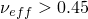.

| **Input File Usage: ** | ``` [*HYPERFOAM](../key/key-link.md#usb-kws-mhyperfoam), N=*n* () ``` |
| --- | --- |

| **Abaqus/CAE Usage: ** | Property module: material editor: ****Mechanical****Elasticity****Hyperfoam****: **Strain energy potential order: *n*** (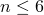); optionally, toggle on **Use temperature-dependent data** |
| --- | --- |

#### Test data specification

The value of *N* and the experimental stress-strain data can be specified for up to five simple tests: uniaxial, equibiaxial, simple shear, planar, and volumetric. Abaqus contains a capability for obtaining the , , and  for the hyperfoam model with up to six terms (*N*=6) directly from test data. Poisson effects can be included either by means of a constant Poisson's ratio or through specification of volumetric test data and/or lateral strains in the other test data.

It is important to recognize that the properties of foam materials can vary significantly from one batch to another. Therefore, all of the experiments should be performed on specimens taken from the same batch of material.

This method does not allow the properties to be temperature dependent.

As many data points as required can be entered from each test. Abaqus will then compute , , and, if necessary, . The technique uses a least squares fit to the experimental data so that the relative error in the nominal stress is minimized. 

It is recommended that data from the uniaxial, biaxial, and simple shear tests (on samples taken from the same piece of material) be included and that the data points cover the range of nominal strains expected to arise in the actual loading. The planar and volumetric tests are optional. 

For all tests the strain data, including the lateral strain data, should be given as nominal strain values (change in length per unit of original length). For the uniaxial, equibiaxial, simple shear, and planar tests, stress data are given as nominal stress values (force per unit of original cross-sectional area). The tests allow for both compression and tension data; compressive stresses and strains should be entered as negative values. For the volumetric tests the stress data are given as pressure values.

| **Input File Usage: ** | Use the first option to define an effective Poisson's ratio (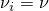 for all *i*), or use the second option to define the lateral strains as part of the test data input: |
| --- | --- |
|  | ``` [*HYPERFOAM](../key/key-link.md#usb-kws-mhyperfoam), N=*n*, POISSON=, TEST DATA INPUT () [*HYPERFOAM](../key/key-link.md#usb-kws-mhyperfoam), N=*n*, TEST DATA INPUT (). ``` In addition, use at least one and up to five of these additional options to give the experimental stress-strain data (see "Experimental tests" below): ``` [*UNIAXIAL TEST DATA](../key/key-link.md#usb-kws-munitestdata) [*BIAXIAL TEST DATA](../key/key-link.md#usb-kws-mbitestdata) [*PLANAR TEST DATA](../key/key-link.md#usb-kws-mplanartestdata) [*SIMPLE SHEAR TEST DATA](../key/key-link.md#usb-kws-msimplesheartestdata) [*VOLUMETRIC TEST DATA](../key/key-link.md#usb-kws-mvoltestdata) ``` |

| **Abaqus/CAE Usage: ** | Property module: material editor: ****Mechanical****Elasticity****Hyperfoam****: toggle on **Use test data**; **Strain energy potential order: *n*** (); optionally, toggle on **Use constant Poisson's ratio:** and enter a value for the effective Poisson's ratio ( for all *i*) |
| --- | --- |
|  | In addition, use at least one and up to five of the suboptions to give the experimental stress-strain data (see "Experimental tests" below): ****Suboptions****Uniaxial Test Data**** ****Suboptions****Biaxial Test Data**** ****Suboptions****Planar Test Data**** ****Suboptions****Simple Shear Test Data**** ****Suboptions****Volumetric Test Data**** |

### Experimental tests

For a homogeneous material, homogeneous deformation modes suffice to characterize the material parameters. Abaqus accepts test data from the following deformation modes:
- Uniaxial tension and compression
- Equibiaxial tension and compression
- Planar tension and compression (pure shear)
- Simple shear
- Volumetric tension and compression

The stress-strain relations are defined in terms of the nominal stress (the force divided by the original, undeformed area) and the nominal, or engineering, strains, 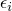. The principal stretches, , are related to the principal nominal strains, , by 

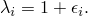

#### Uniaxial, equibiaxial, and planar tests

The deformation gradient, expressed in the principal directions of stretch, is 

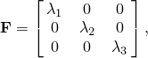

where , , and 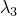 are the principal stretches: the ratios of current length to length in the original configuration in the principal directions of a material fiber. The deformation modes are characterized in terms of the principal stretches, , and the volume ratio, 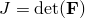. The elastomeric foams are not incompressible, so that . The transverse stretches, 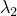 and/or , are independently specified in the test data either as individual values from the measured lateral deformations or through the definition of an effective Poisson's ratio.

The three deformation modes use a single form of the nominal stress-stretch relation, 

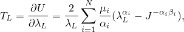

where  is the nominal stress and 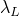 is the stretch in the loading direction. Because of the compressible behavior, the planar mode does not result in a state of pure shear. In fact, if the effective Poisson's ratio is zero, planar deformation is identical to uniaxial deformation.

##### Uniaxial mode

In uniaxial mode 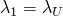, 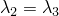, and 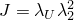.

| **Input File Usage: ** | ``` [*UNIAXIAL TEST DATA](../key/key-link.md#usb-kws-munitestdata) ``` |
| --- | --- |

| **Abaqus/CAE Usage: ** | Property module: material editor: ****Mechanical****Elasticity****Hyperfoam****: toggle on **Use test data**, ****Suboptions****Uniaxial Test Data**** |
| --- | --- |

##### Equibiaxial mode

In equibiaxial mode 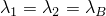 and 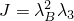.

| **Input File Usage: ** | ``` [*BIAXIAL TEST DATA](../key/key-link.md#usb-kws-mbitestdata) ``` |
| --- | --- |

| **Abaqus/CAE Usage: ** | Property module: material editor: ****Mechanical****Elasticity****Hyperfoam****: toggle on **Use test data**, ****Suboptions****Biaxial Test Data**** |
| --- | --- |

##### Planar mode

In planar mode 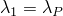, 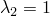, and 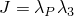. Planar test data must be augmented by either uniaxial or biaxial test data.

| **Input File Usage: ** | ``` [*PLANAR TEST DATA](../key/key-link.md#usb-kws-mplanartestdata) ``` |
| --- | --- |

| **Abaqus/CAE Usage: ** | Property module: material editor: ****Mechanical****Elasticity****Hyperfoam****: toggle on **Use test data**, ****Suboptions****Planar Test Data**** |
| --- | --- |

#### Simple shear tests

Simple shear is described by the deformation gradient 


where  is the shear strain. For this deformation 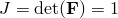. A schematic illustration of simple shear deformation is shown in [Figure 22.5.2--3](pt05ch22s05abm08.md#chyperfoam-simple-shear).

**Figure 22.5.2–3** Simple shear test.

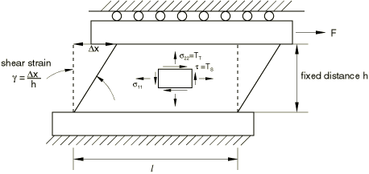

The nominal shear stress, , is 

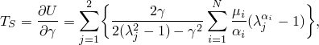

where  are the principal stretches in the plane of shearing, related to the shear strain  by 

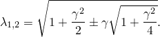

The stretch in the direction perpendicular to the shear plane is 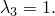 The transverse (tensile) stress, , developed during simple shear deformation due to the Poynting effect, is 

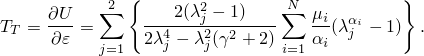

| **Input File Usage: ** | ``` [*SIMPLE SHEAR TEST DATA](../key/key-link.md#usb-kws-msimplesheartestdata) ``` |
| --- | --- |

| **Abaqus/CAE Usage: ** | Property module: material editor: ****Mechanical****Elasticity****Hyperfoam****: toggle on **Use test data**, ****Suboptions****Simple Shear Test Data**** |
| --- | --- |

#### Volumetric tests

The deformation gradient, , is the same for volumetric tests as for uniaxial tests. The volumetric deformation mode consists of all principal stretches being equal; 

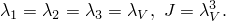

The pressure-volumetric ratio relation is 

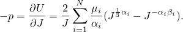

A volumetric compression test is illustrated in [Figure 22.5.2--4](pt05ch22s05abm08.md#chyperfoam-vol-compress). The pressure exerted on the foam specimen is the hydrostatic pressure of the fluid, and the decrease in the specimen volume is equal to the additional fluid entering the pressure chamber. The specimen is sealed against fluid penetration. 

**Figure 22.5.2–4** Volumetric compression test.

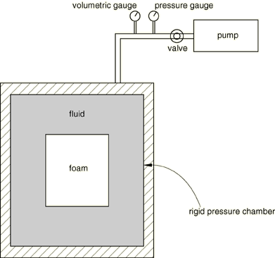

| **Input File Usage: ** | ``` [*VOLUMETRIC TEST DATA](../key/key-link.md#usb-kws-mvoltestdata) ``` |
| --- | --- |

| **Abaqus/CAE Usage: ** | Property module: material editor: ****Mechanical****Elasticity****Hyperfoam****: toggle on **Use test data**, ****Suboptions****Volumetric Test Data**** |
| --- | --- |

### Difference between compression and tension deformation

For small strains ( 5%) foams behave similarly for both compression and tension. However, at large strains the deformation mechanisms differ for compression (buckling and crushing) and tension (alignment and stretching). Therefore, accurate hyperfoam modeling requires that the experimental data used to define the material parameters correspond to the dominant deformation modes of the problem being analyzed. If compression dominates, the pertinent tests are:
- Uniaxial compression
- Simple shear
- Planar compression (if Poisson's ratio 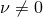)
- Volumetric compression (if Poisson's ratio )

If tension dominates, the pertinent tests are:- Uniaxial tension
- Simple shear
- Biaxial tension (if Poisson's ratio )
- Planar tension (if Poisson's ratio )

Lateral strain data can also be used to define the compressibility of the foam. Measurement of the lateral strains may make other tests redundant; for example, providing lateral strains for a uniaxial test eliminates the need for a volumetric test. However, if volumetric test data are provided in addition to the lateral strain data for other tests, both the volumetric test data and the lateral strain data will be used in determining the compressibility of the foam. The hyperfoam model may not accurately fit Poisson's ratio if it varies significantly between compression and tension.

### Model prediction of material behavior versus experimental data

Once the elastomeric foam constants are determined, the behavior of the hyperfoam model in Abaqus is established. However, the quality of this behavior must be assessed: the prediction of material behavior under different deformation modes must be compared against the experimental data. You must judge whether the elastomeric foam constants determined by Abaqus are acceptable, based on the correlation between the Abaqus predictions and the experimental data. Single-element test cases can be used to calculate the nominal stress–nominal strain response of the material model.

See ["Fitting of elastomeric foam test data," Section 3.1.5 of the Abaqus Benchmarks Guide](../bmk/bmk-link.md#bmk-mat-foamdatafitting), which illustrates the entire process of fitting elastomeric foam constants to a set of test data.

#### Elastomeric foam material stability

As with incompressible hyperelasticity, Abaqus checks the Drucker stability of the material for the deformation modes described above. The Drucker stability condition for a compressible material requires that the change in the Kirchhoff stress, , following from an infinitesimal change in the logarithmic strain, , satisfies the inequality 


where the Kirchhoff stress . Using , the inequality becomes 


This restriction requires that the tangential material stiffness  be positive definite.

For an isotropic elastic formulation the inequality can be represented in terms of the principal stresses and strains 


Thus, the relation between changes in the stress and changes in the strain can be obtained in the form of the matrix equation 


where 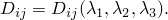

Since  must be positive definite, it is necessary that 


You should be careful about defining the parameters , , and : especially when 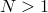, the behavior at higher strains is strongly sensitive to the values of these parameters, and unstable material behavior may result if these values are not defined correctly. When some of the coefficients are strongly negative, instability at higher strain levels is likely to occur. Abaqus performs a check on the stability of the material for nine different forms of loading—uniaxial tension and compression, equibiaxial tension and compression, simple shear, planar tension and compression, and volumetric tension and compression—for 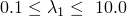 (nominal strain range of 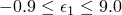), at intervals 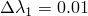. If an instability is found, Abaqus issues a warning message and prints the lowest absolute value of 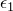 for which the instability is observed. Ideally, no instability occurs. If instabilities are observed at strain levels that are likely to occur in the analysis, it is strongly recommended that you carefully examine and revise the material input data.

#### Improving the accuracy and stability of the test data fit

["Hyperelastic behavior of rubberlike materials," Section 22.5.1](pt05ch22s05abm07.md), contains suggestions for improving the accuracy and stability of elastomeric modeling. ["Fitting of elastomeric foam test data," Section 3.1.5 of the Abaqus Benchmarks Guide](../bmk/bmk-link.md#bmk-mat-foamdatafitting), illustrates the process of fitting elastomeric foam test data.

### Elements

The hyperfoam model can be used with solid (continuum) elements, finite-strain shells (except S4), and membranes. However, it cannot be used with one-dimensional solid elements (trusses and beams), small-strain shells (STRI3, STRI65, S4R5, S8R, S8R5, S9R5), or the Eulerian elements (EC3D8R and EC3D8RT).

For continuum elements elastomeric foam hyperelasticity can be used with pure displacement formulation elements or, in Abaqus/Standard, with the “hybrid” (mixed formulation) elements. Since elastomeric foams are assumed to be very compressible, the use of hybrid elements will generally not yield any advantage over the use of purely displacement-based elements.

### Procedures

The hyperfoam model must always be used with geometrically nonlinear analyses (["General and linear perturbation procedures," Section 6.1.3](pt03ch06s01aus44.md)).


