# 22.5.3 Anisotropic hyperelastic behavior


**Products: **Abaqus/Standard  Abaqus/Explicit  Abaqus/CAE  

##### **References**

- ["Material library: overview," Section 21.1.1](pt05ch21s01abo18.md)
- ["Elastic behavior: overview," Section 22.1.1](pt05ch22s01abo19.md)
- ["Mullins effect," Section 22.6.1](pt05ch22s06abm10.md)
- [*ANISOTROPIC HYPERELASTIC](../key/key-link.md#usb-kws-manisohyperelast)
- [*VISCOELASTIC](../key/key-link.md#usb-kws-mviscoelast)
- [*MULLINS EFFECT](../key/key-link.md#usb-kws-mmullinseffect)
- ["Creating an anisotropic hyperelastic material model" in "Defining elasticity," Section 12.9.1 of the Abaqus/CAE User's Guide](../usi/usi-link.md#usi-prp-mechanical-elastic-hyperelastic-aniso)

### Overview

The anisotropic hyperelastic material model:
- provides a general capability for modeling materials that exhibit highly anisotropic and nonlinear elastic behavior (such as biomedical soft tissues, fiber-reinforced elastomers, etc.);
- can be used in combination with large-strain time-domain viscoelasticity (["Time domain viscoelasticity," Section 22.7.1](pt05ch22s07abm12.md)); however, viscoelasticity is isotropic;
- optionally allows the specification of energy dissipation and stress softening effects (see ["Mullins effect," Section 22.6.1](pt05ch22s06abm10.md)); and
- requires that geometric nonlinearity be accounted for during the analysis step (["General and linear perturbation procedures," Section 6.1.3](pt03ch06s01aus44.md)) since it is intended for finite-strain applications.

### Anisotropic hyperelasticity formulations

Many materials of industrial and technological interest exhibit anisotropic elastic behavior due to the presence of preferred directions in their microstructure. Examples of such materials include common engineering materials (such as fiber-reinforced composites, reinforced rubber, wood, etc.) as well as soft biological tissues (arterial walls, heart tissue, etc.). When these materials are subjected to small deformations (less than 2–5%), their mechanical behavior can generally be modeled adequately using conventional anisotropic linear elasticity ( see ["Defining fully anisotropic elasticity" in "Linear elastic behavior," Section 22.2.1](pt05ch22s02abm02.md#usb-mat-clinearelastic-anisotropic)). Under large deformations, however, these materials exhibit highly anisotropic and nonlinear elastic behavior due to rearrangements in the microstructure, such as reorientation of the fiber directions with deformation. The simulation of these nonlinear large-strain effects calls for more advanced constitutive models formulated within the framework of anisotropic hyperelasticity. Hyperelastic materials are described in terms of a “strain energy potential,” , which defines the strain energy stored in the material per unit of reference volume (volume in the initial configuration) as a function of the deformation at that point in the material. Two distinct formulations are used for the representation of the strain energy potential of anisotropic hyperelastic materials: strain-based and invariant-based.

#### Strain-based formulation

In this case the strain energy function is expressed directly in terms of the components of a suitable strain tensor, such as the Green strain tensor (see ["Strain measures," Section 1.4.2 of the Abaqus Theory Guide](../stm/stm-link.md#stm-int-strainmeas)):


where 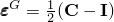 is Green's strain; 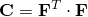 is the right Cauchy-Green strain tensor;  is the deformation gradient; and  is the identity matrix. Without loss of generality, the strain energy function can be written in the form 


where  is the modified Green strain tensor;  is the distortional part of the right Cauchy-Green strain;  is the total volume change; and 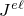 is the elastic volume ratio as defined below in ["Thermal expansion."](pt05ch22s05abm09.md#usb-mat-canisohyperelastic-therm-expan)

The underlying assumption in models based on the strain-based formulation is that the preferred material directions are initially aligned with an orthogonal coordinate system  in the reference (stress-free) configuration. These directions may become non-orthogonal only after deformation. Examples of this form of strain energy function include the generalized Fung-type form described below.

#### Invariant-based formulation

Using the continuum theory of fiber-reinforced composites (Spencer, 1984) the strain energy function can be expressed directly in terms of the invariants of the deformation tensor and fiber directions. For example, consider a composite material that consists of an isotropic hyperelastic matrix reinforced with  families of fibers. The directions of the fibers in the reference configuration are characterized by a set of unit vectors , (). Assuming that the strain energy depends not only on deformation, but also on the fiber directions, the following form is postulated 


The strain energy of the material must remain unchanged if both matrix and fibers in the reference configuration undergo a rigid body rotation. Then, following Spencer (1984), the strain energy can be expressed in terms of an irreducible set of scalar invariants that form the integrity basis of the tensor  and the vectors :


 where  and  are the first and second deviatoric strain invariants;  is the elastic volume ratio (or third strain invariant);  and  are the *pseudo-invariants* of 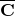, ; and , defined as:

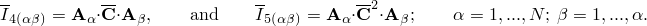

The terms  are geometrical constants (independent of deformation) equal to the cosine of the angle between the directions of any two families of fibers in the reference configuration:

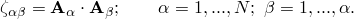

 Unlike for the case of the strain-based formulation, in the invariant-based formulation the fiber directions need not be orthogonal in the initial configuration. An example of an invariant-based energy function is the form proposed by Holzapfel, Gasser, and Ogden (2000) for arterial walls (see ["Holzapfel-Gasser-Ogden form](pt05ch22s05abm09.md#usb-mat-canisohyperelastic-holzapfel),” below).

### Anisotropic strain energy potentials

There are two forms of strain energy potentials available in Abaqus to model approximately incompressible anisotropic materials: the generalized Fung form (including fully anisotropic and orthotropic cases) and the form proposed by Holzapfel, Gasser, and Ogden for arterial walls. Both forms are adequate for modeling soft biological tissue. However, whereas Fung's form is purely phenomenological, the Holzapfel-Gasser-Ogden form is micromechanically based.

In addition, Abaqus provides a general capability to support user-defined forms of the strain energy potential via two sets of user subroutines: one for strain-based and one for invariant-based formulations.

#### Generalized Fung form

The generalized Fung strain energy potential has the following form:

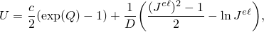

where *U* is the strain energy per unit of reference volume;  and *D* are temperature-dependent material parameters;  is the elastic volume ratio as defined below in ["Thermal expansion";](pt05ch22s05abm09.md#usb-mat-canisohyperelastic-therm-expan) and  is defined as 


where  is a dimensionless symmetric fourth-order tensor of anisotropic material constants that can be temperature dependent and  are the components of the modified Green strain tensor.

 The initial deviatoric elasticity tensor, , and bulk modulus, , are given by


Abaqus supports two forms of the generalized Fung model: fully anisotropic and orthotropic. The number of independent components  that must be specified depends on the level of anisotropy of the material: 21 for the fully anisotropic case and 9 for the orthotropic case.

| **Input File Usage: ** | Use one of the following options: |
| --- | --- |
|  | ``` [*ANISOTROPIC HYPERELASTIC](../key/key-link.md#usb-kws-manisohyperelast), FUNG-ANISOTROPIC [*ANISOTROPIC HYPERELASTIC](../key/key-link.md#usb-kws-manisohyperelast), FUNG-ORTHOTROPIC ``` |

| **Abaqus/CAE Usage: ** | Property module: material editor: ****Mechanical****Elasticity****Hyperelastic****; **Material type:** **Anisotropic**; **Strain energy potential:** **Fung-Anisotropic** or **Fung-Orthotropic** |
| --- | --- |

#### Holzapfel-Gasser-Ogden form

The form of the strain energy potential is based on that proposed by Holzapfel, Gasser, and Ogden (2000) and Gasser, Ogden, and Holzapfel (2006) for modeling arterial layers with distributed collagen fiber orientations:


with


where *U* is the strain energy per unit of reference volume; 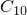, *D*, , 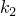, and  are temperature-dependent material parameters;  is the number of families of fibers (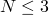);   is the first deviatoric strain invariant;  is the elastic volume ratio as defined below in ["Thermal expansion"](pt05ch22s05abm09.md#usb-mat-canisohyperelastic-therm-expan) and  are *pseudo-invariants* of  and . 

The model assumes that the directions of the collagen fibers within each family are dispersed (with rotational symmetry) about a mean preferred direction. The parameter  () describes the level of dispersion in the fiber directions. If 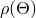 is the orientation density function that characterizes the distribution (it represents the normalized number of fibers with orientations in the range  with respect to the mean direction), the parameter  is defined as 


It is also assumed that all families of fibers have the same mechanical properties and the same dispersion. When  the fibers are perfectly aligned (no dispersion). When 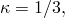 the fibers are randomly distributed and the material becomes isotropic; this corresponds to a spherical orientation density function. 

The strain-like quantity  characterizes the deformation of the family of fibers with mean direction . For perfectly aligned fibers (), ; and for randomly distributed fibers (), .

The first two terms in the expression of the strain energy function represent the distortional and volumetric contributions of the non-collagenous isotropic ground material, and the third term represents the contributions from the different families of collagen fibers, taking into account the effects of dispersion. A basic assumption of the model is that collagen fibers can support tension only, because they would buckle under compressive loading. Thus, the anisotropic contribution in the strain energy function appears only when the strain of the fibers is positive or, equivalently, when . This condition is enforced by the term 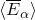, where the operator  stands for the Macauley bracket and is defined as .

See ["Anisotropic hyperelastic modeling of arterial layers," Section 3.1.7 of the Abaqus Benchmarks Guide](../bmk/bmk-link.md#bmk-mat-anisohyperelastic), for an example of an application of the Holzapfel-Gasser-Ogden energy potential to model arterial layers with distributed collagen fiber orientation.

 The initial deviatoric elasticity tensor, , and bulk modulus, , are given by


where  is the fourth-order unit tensor, and  is the Heaviside unit step function.

| **Input File Usage: ** | ``` [*ANISOTROPIC HYPERELASTIC](../key/key-link.md#usb-kws-manisohyperelast), HOLZAPFEL, LOCAL DIRECTIONS=*N* ``` |
| --- | --- |

| **Abaqus/CAE Usage: ** | Property module: material editor: ****Mechanical****Elasticity****Hyperelastic****; **Material type:** **Anisotropic**; **Strain energy potential:** **Holzapfel**, **Number of local directions:** *N* |
| --- | --- |

#### User-defined form: strain-based

Alternatively, you can define the form of a strain-based strain energy potential directly with user subroutine [`UANISOHYPER_STRAIN`](../sub/sub-link.md#sub-xsl-uanisohyper_strain) in Abaqus/Standard or [`VUANISOHYPER_STRAIN`](../sub/sub-link.md#sub-xsl-vuanisohyper_strain) in Abaqus/Explicit. The derivatives of the strain energy potential with respect to the components of the modified Green strain and the elastic volume ratio, , must be provided directly through these user subroutines. 

Either compressible or incompressible behavior can be specified in Abaqus/Standard; only nearly incompressible behavior is allowed in Abaqus/Explicit. 

Optionally, you can specify the number of property values needed as data in the user subroutine as well as the number of solution-dependent variables (see ["User subroutines: overview," Section 18.1.1](pt04ch18s01aus104.md)).

| **Input File Usage: ** | In Abaqus/Standard use the following option to define compressible behavior: |
| --- | --- |
|  | ``` [*ANISOTROPIC HYPERELASTIC](../key/key-link.md#usb-kws-manisohyperelast), USER, FORMULATION=STRAIN, TYPE=COMPRESSIBLE, PROPERTIES=*n* ``` In Abaqus/Standard use the following option to define incompressible behavior: ``` [*ANISOTROPIC HYPERELASTIC](../key/key-link.md#usb-kws-manisohyperelast), USER, FORMULATION=STRAIN, TYPE=INCOMPRESSIBLE, PROPERTIES=*n* ``` In Abaqus/Explicit use the following option to define nearly incompressible behavior: ``` [*ANISOTROPIC HYPERELASTIC](../key/key-link.md#usb-kws-manisohyperelast), USER, FORMULATION=STRAIN, PROPERTIES=*n* ``` |

| **Abaqus/CAE Usage: ** | Property module: material editor: ****Mechanical****Elasticity****Hyperelastic****; **Material type:** **Anisotropic**, **Strain energy potential:** **User**, **Formulation:** **Strain**, **Type:** **Incompressible** or **Compressible**, **Number of property values:** *n* |
| --- | --- |

#### User-defined form: invariant-based

Alternatively, you can define the form of an invariant-based strain energy potential directly with user subroutine [`UANISOHYPER_INV`](../sub/sub-link.md#sub-xsl-uanisohyper_inv) in Abaqus/Standard or [`VUANISOHYPER_INV`](../sub/sub-link.md#sub-xsl-vuanisohyper_inv) in Abaqus/Explicit. Either compressible or incompressible behavior can be specified in Abaqus/Standard; only nearly incompressible behavior is allowed in Abaqus/Explicit. 

Optionally, you can specify the number of property values needed as data in the user subroutine and the number of solution-dependent variables (see ["User subroutines: overview," Section 18.1.1](pt04ch18s01aus104.md)).

The derivatives of the strain energy potential with respect to the strain invariants must be provided directly through user subroutine [`UANISOHYPER_INV`](../sub/sub-link.md#sub-xsl-uanisohyper_inv) in Abaqus/Standard and [`VUANISOHYPER_INV`](../sub/sub-link.md#sub-xsl-vuanisohyper_inv) in Abaqus/Explicit. 

| **Input File Usage: ** | In Abaqus/Standard use the following option to define compressible behavior: |
| --- | --- |
|  | ``` [*ANISOTROPIC HYPERELASTIC](../key/key-link.md#usb-kws-manisohyperelast), USER, FORMULATION=INVARIANT, LOCAL DIRECTIONS=*N*, TYPE=COMPRESSIBLE, PROPERTIES=*n* ``` In Abaqus/Standard use the following option to define incompressible behavior: ``` [*ANISOTROPIC HYPERELASTIC](../key/key-link.md#usb-kws-manisohyperelast), USER, FORMULATION=INVARIANT, LOCAL DIRECTIONS=*N*, TYPE=INCOMPRESSIBLE, PROPERTIES=*n* ``` In Abaqus/Explicit use the following option to define nearly incompressible behavior: ``` [*ANISOTROPIC HYPERELASTIC](../key/key-link.md#usb-kws-manisohyperelast), USER, FORMULATION=INVARIANT, PROPERTIES=*n* ``` |

| **Abaqus/CAE Usage: ** | Property module: material editor: ****Mechanical****Elasticity****Hyperelastic****; **Material type:** **Anisotropic**, **Strain energy potential:** **User**, **Formulation:** **Invariant**, **Type:** **Incompressible** or **Compressible**, **Number of local directions:** *N*, **Number of property values:** *n* |
| --- | --- |

### Definition of preferred material directions

You must define the preferred material directions  (or fiber directions) of the anisotropic hyperelastic material. 

For strain-based forms (such as the Fung form and user-defined forms using user subroutines [`UANISOHYPER_STRAIN`](../sub/sub-link.md#sub-xsl-uanisohyper_strain) or [`VUANISOHYPER_STRAIN`](../sub/sub-link.md#sub-xsl-vuanisohyper_strain)), you must specify a local orientation system (["Orientations," Section 2.2.5](pt01ch02s02aus15.md)) to define the directions of anisotropy. Components of the modified Green strain tensor are calculated with respect to this system.

For invariant-based forms of the strain energy function (such as the Holzapfel form and user-defined forms using user subroutines [`UANISOHYPER_INV`](../sub/sub-link.md#sub-xsl-uanisohyper_inv) or [`VUANISOHYPER_INV`](../sub/sub-link.md#sub-xsl-vuanisohyper_inv)), you must specify the local direction vectors, , that characterize each family of fibers. These vectors need not be orthogonal in the initial configuration. Up to three local directions can be specified as part of the definition of a local orientation system (["Defining a local coordinate system directly" in "Orientations," Section 2.2.5](pt01ch02s02aus15.md#usb-int-corientation-direct)); the local directions are referred to this system.

In Abaqus/CAE, the local direction vectors of the material are orthogonal and align with the axes of the assigned material orientation. The best practice is to assign the orientation using discrete orientations in Abaqus/CAE.

Material directions can be output to the output database as described in ["Output](pt05ch22s05abm09.md#usb-mat-canisohyperelastic-output),” below.

### Compressibility

Most soft tissues and fiber-reinforced elastomers have very little compressibility compared to their shear flexibility. This behavior does not warrant special attention for plane stress, shell, or membrane elements, but the numerical solution can be quite sensitive to the degree of compressibility for three-dimensional solid, plane strain, and axisymmetric elements. In cases where the material is highly confined (such as an O-ring used as a seal), the compressibility must be modeled correctly to obtain accurate results. In applications where the material is not highly confined, the degree of compressibility is typically not crucial; for example, it would be quite satisfactory in Abaqus/Standard to assume that the material is fully incompressible: the volume of the material cannot change except for thermal expansion.

#### Compressibility in Abaqus/Standard

In Abaqus/Standard the use of “hybrid” (mixed formulation) elements is required for incompressible materials. In plane stress, shell, and membrane elements the material is free to deform in the thickness direction. In this case special treatment of the volumetric behavior is not necessary; the use of regular stress/displacement elements is satisfactory.

#### Compressibility in Abaqus/Explicit

With the exception of the plane stress case, it is not possible to assume that the material is fully incompressible in Abaqus/Explicit because the program has no mechanism for imposing such a constraint at each material calculation point. Instead, some compressibility must be modeled. The difficulty is that, in many cases, the actual material behavior provides too little compressibility for the algorithms to work efficiently. Thus, except for the plane stress case, you must provide enough compressibility for the code to work, knowing that this makes the bulk behavior of the model softer than that of the actual material. Failing to provide enough compressibility may introduce high frequency noise into the dynamic solution and require the use of excessively small time increments. Some judgment is, therefore, required to decide whether or not the solution is sufficiently accurate or whether the problem can be modeled at all with Abaqus/Explicit because of this numerical limitation.

If no value is given for the material compressibility of the anisotropic hyperelastic model, by default Abaqus/Explicit assumes the value , where  is the largest value of the initial shear modulus (among the different material directions). The exception is for the case of user-defined forms, where some compressibility must be defined directly within user subroutine [`UANISOHYPER_INV`](../sub/sub-link.md#sub-xsl-uanisohyper_inv) or [`VUANISOHYPER_INV`](../sub/sub-link.md#sub-xsl-vuanisohyper_inv).

### Thermal expansion

Both isotropic and orthotropic thermal expansion is permitted with the anisotropic hyperelastic material model.

The elastic volume ratio, , relates the total volume ratio, *J*, and the thermal volume ratio, : 


 is given by 

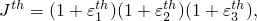

where 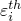 are the principal thermal expansion strains that are obtained from the temperature and the thermal expansion coefficients (["Thermal expansion," Section 26.1.2](pt05ch26s01abm52.md)).

### Viscoelasticity

Anisotropic hyperelastic models can be used in combination with isotropic viscoelasticity to model rate-dependent material behavior (["Time domain viscoelasticity," Section 22.7.1](pt05ch22s07abm12.md)). Because of the isotropy of viscoelasticity, the relaxation function is independent of the loading direction. This assumption may not be acceptable for modeling materials that exhibit strong anisotropy in their rate-dependent behavior; therefore, this option should be used with caution.

The anisotropic hyperelastic response of rate-dependent materials (["Time domain viscoelasticity," Section 22.7.1](pt05ch22s07abm12.md)) can be specified by defining either the instantaneous response or the long-term response of such materials.

| **Input File Usage: ** | Use either of the following options: |
| --- | --- |
|  | ``` [*ANISOTROPIC HYPERELASTIC](../key/key-link.md#usb-kws-manisohyperelast), MODULI=INSTANTANEOUS [*ANISOTROPIC HYPERELASTIC](../key/key-link.md#usb-kws-manisohyperelast), MODULI=LONG TERM ``` |

| **Abaqus/CAE Usage: ** | Property module: material editor: ****Mechanical****Elasticity****Hyperelastic****; **Material type:** **Anisotropic**; **Moduli:** **Long term** or **Instantaneous** |
| --- | --- |

### Stress softening

The response of typical anisotropic hyperelastic materials, such as reinforced rubbers and biological tissues, under cyclic loading and unloading usually displays stress softening effects during the first few cycles.  After a few cycles the response of the material tends to stabilize and the material is said to be *pre-conditioned*. Stress softening effects, often referred to in the elastomers literature as Mullins effect, can be accounted for by using the anisotropic hyperelastic model in combination with the *pseudo-elasticity* model for Mullins effect in Abaqus (see ["Mullins effect," Section 22.6.1](pt05ch22s06abm10.md)). The stress softening effects provided by this model are isotropic. 

### Elements

The anisotropic hyperelastic material model can be used with solid (continuum) elements, finite-strain shells (except S4), continuum shells, and membranes. When used in combination with elements with plane stress formulations, Abaqus assumes fully incompressible behavior and ignores any amount of compressibility specified for the material.

#### Pure displacement formulation versus hybrid formulation in Abaqus/Standard

For continuum elements in Abaqus/Standard anisotropic hyperelasticity can be used with the pure displacement formulation elements or with the “hybrid” (mixed formulation) elements. Pure displacement formulation elements must be used with compressible materials, and “hybrid” (mixed formulation) elements must be used with incompressible materials.

In general, an analysis using a single hybrid element will be only slightly more computationally expensive than an analysis using a regular displacement-based element. However, when the wavefront is optimized, the Lagrange multipliers may not be ordered independently of the regular degrees of freedom associated with the element. Thus, the wavefront of a very large mesh of second-order hybrid tetrahedra may be noticeably larger than that of an equivalent mesh using regular second-order tetrahedra. This may lead to significantly higher CPU costs, disk space, and memory requirements.

#### Incompatible mode elements in Abaqus/Standard

Incompatible mode elements should be used with caution in applications involving large strains. Convergence may be slow, and in hyperelastic applications inaccuracies may accumulate. Erroneous stresses may sometimes appear in incompatible mode anisotropic hyperelastic elements that are unloaded after having been subjected to a complex deformation history.

### Procedures

Anisotropic hyperelasticity must always be used with geometrically nonlinear analyses (["General and linear perturbation procedures," Section 6.1.3](pt03ch06s01aus44.md)).

### Output

In addition to the standard output identifiers available in Abaqus (["Abaqus/Standard output variable identifiers," Section 4.2.1](pt02ch04s02abv01.md), and ["Abaqus/Explicit output variable identifiers," Section 4.2.2](pt02ch04s02xbv01.md)), local material directions will be output whenever element field output is requested to the output database. The local directions are output as field variables (LOCALDIR1, LOCALDIR2, LOCALDIR3) representing the direction cosines; these variables can be visualized as vector plots in the Visualization module of Abaqus/CAE (Abaqus/Viewer).

Output of local material directions is suppressed if no element field output is requested or if you specify not to have element material directions written to the output database (see ["Specifying the directions for element output in Abaqus/Standard and Abaqus/Explicit" in "Output to the output database," Section 4.1.3](pt02ch04s01aus40.md#usb-out-odboutput-element-directions)).

#### Additional references

- Gasser, T. C., R. W. Ogden, and G. A. Holzapfel, "Hyperelastic Modelling of Arterial Layers with Distributed Collagen Fibre Orientations," Journal of the Royal Society Interface, vol. 3, pp. 15--35, 2006.
- Holzapfel, G. A., T. C. Gasser, and R. W. Ogden, "A New Constitutive Framework for Arterial Wall Mechanics and a Comparative Study of Material Models," Journal of Elasticity, vol. 61, pp. 1--48, 2000.
- Spencer, A. J. M., "Constitutive Theory for Strongly Anisotropic Solids," A. J. M. Spencer (ed.), Continuum Theory of the Mechanics of Fibre-Reinforced Composites, CISM Courses and Lectures No. 282, International Centre for Mechanical Sciences, Springer-Verlag, Wien, pp. 1--32, 1984.


