# 22.6.1 Mullins effect


**Products: **Abaqus/Standard  Abaqus/Explicit  Abaqus/CAE  

##### **References**

- ["Material library: overview," Section 21.1.1](pt05ch21s01abo18.md)
- ["Combining material behaviors," Section 21.1.3](pt05ch21s01aus110.md)
- ["Elastic behavior: overview," Section 22.1.1](pt05ch22s01abo19.md)
- ["Hyperelastic behavior of rubberlike materials," Section 22.5.1](pt05ch22s05abm07.md)
- ["Anisotropic hyperelastic behavior," Section 22.5.3](pt05ch22s05abm09.md)
- ["Permanent set in rubberlike materials," Section 23.7.1](pt05ch23s07abm40.md)
- ["Energy dissipation in elastomeric foams," Section 22.6.2](pt05ch22s06abm11.md)
- [*HYPERELASTIC](../key/key-link.md#usb-kws-mhyperelast)
- [*MULLINS EFFECT](../key/key-link.md#usb-kws-mmullinseffect)
- [*PLASTIC](../key/key-link.md#usb-kws-mplastic)
- [*UNIAXIAL TEST DATA](../key/key-link.md#usb-kws-munitestdata)
- [*BIAXIAL TEST DATA](../key/key-link.md#usb-kws-mbitestdata)
- [*PLANAR TEST DATA](../key/key-link.md#usb-kws-mplanartestdata)
- ["Mullins effect" in "Defining damage," Section 12.9.3 of the Abaqus/CAE User's Guide](../usi/usi-link.md#usi-prp-mechanical-damage-mullins)

### Overview

The Mullins effect model:
- is intended for modeling stress softening of filled rubber elastomers under quasi-static cyclic loading, a phenomenon referred to in the literature as Mullins effect;
- provides an extension to the well-known isotropic hyperelastic models;
- is based on the theory of incompressible isotropic elasticity modified by the addition of a single variable, referred to as the damage variable;
- assumes that only the deviatoric part of the material response is associated with damage;
- is intended for modeling material response in situations where different parts of the model undergo different levels of damage resulting in a different material response;
- is applied to the long-term modulus when combined with viscoelasticity; and
- cannot be used with hysteresis.

Abaqus provides a similar capability that can be applied to elastomeric foams (see ["Energy dissipation in elastomeric foams," Section 22.6.2](pt05ch22s06abm11.md)).

### Material behavior

The real behavior of filled rubber elastomers under cyclic loading conditions is quite complex. Certain idealizations have been made for modeling purposes. In essence, these idealizations result in two main components to the material behavior: the first component describes the response of a material point (from an undeformed state) under monotonic straining, and the second component is associated with damage and describes the unloading-reloading behavior. The idealized response and the two components are described in the following sections.

#### Idealized material behavior

When an elastomeric test specimen is subjected to simple tension from its virgin state, unloaded, and then reloaded, the stress required on reloading is less than that on the initial loading for stretches up to the maximum stretch achieved during the initial loading. This stress softening phenomenon is known as the Mullins effect and reflects damage incurred during previous loading. This type of material response is depicted qualitatively in [Figure 22.6.1--1](pt05ch22s06abm10.md#cmullins-idealized-response).

**Figure 22.6.1–1** Idealized response of the Mullins effect model.


This figure and the accompanying description is based on work by Ogden and Roxburgh (1999), which forms the basis of the model implemented in Abaqus. Consider the primary loading path  of a previously unstressed material, with loading to an arbitrary point . On unloading from , the path  is followed. When the material is loaded again, the softened path is retraced as . If further loading is then applied, the path  is followed, where  is a continuation of the primary loading path  (which is the path that would be followed if there was no unloading). If loading is now stopped at , the path  is followed on unloading and then retraced back to  on reloading. If no further loading beyond  is applied, the curve  represents the subsequent material response, which is then elastic. For loading beyond , the primary path is again followed and the pattern described is repeated.

This is an ideal representation of Mullins effect since in practice there is some permanent set upon unloading and/or viscoelastic effects such as hysteresis. Points such as  and  may not exist in reality in the sense that unloading from the primary curve followed by reloading to the maximum strain level attained earlier usually results in a stress that is somewhat lower than the stress corresponding to the primary curve. In addition, the cyclic response for some filled elastomers shows evidence of progressive damage during unloading from and subsequent reloading to a certain maximum strain level. Such progressive damage usually occurs during the first few cycles, and the material behavior soon stabilizes to a loading/unloading cycle that is followed beyond the first few cycles. More details regarding the actual behavior and how test data that display such behavior can be used to calibrate the Abaqus model for Mullins effect are discussed later and in ["Analysis of a solid disc with Mullins effect and permanent set," Section 3.1.7 of the Abaqus Example Problems Guide](../exa/exa-link.md#exa-veh-mullinstire).

The loading path   will henceforth be referred to as the “primary hyperelastic behavior.” The primary hyperelastic behavior is defined by using a hyperelastic material model.

Stress softening is interpreted as being due to damage at the microscopic level. As the material is loaded, the damage occurs by the severing of bonds between filler particles and the rubber molecular chains. Different chain links break at different deformation levels, thereby leading to continuous damage with macroscopic deformation. An equivalent interpretation is that the energy required to cause the damage is not recoverable.

#### Primary hyperelastic behavior

Hyperelastic materials are described in terms of a “strain energy potential” function  that defines the strain energy stored in the material per unit reference volume (volume in the initial configuration). The quantity  is the deformation gradient tensor. To account for Mullins effect, Ogden and Roxburgh propose a material description that is based on an energy function of the form , where the additional scalar variable, , represents damage in the material. The damage variable controls the material properties in the sense that it enables the material response to be governed by an energy function on unloading and subsequent submaximal reloading different from that on the primary (initial) loading path from a virgin state. Because of the above interpretation of , it is no longer appropriate to think of *U* as the stored elastic energy potential. Part of the energy is stored as strain energy, while the rest is dissipated due to damage. The shaded area in [Figure 22.6.1--1](pt05ch22s06abm10.md#cmullins-idealized-response) represents the energy dissipated by damage as a result of deformation until the point , while the unshaded part represents the recoverable strain energy.

The following paragraphs provide a summary of the Mullins effect model in Abaqus. For further details, see ["Mullins effect," Section 4.7.1 of the Abaqus Theory Guide](../stm/stm-link.md#stm-mat-mullinseffect). In preparation for writing the constitutive equations for Mullins effect, it is useful to separate the deviatoric and the volumetric parts of the total strain energy density as

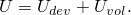

In the above equation *U*, 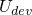, and 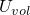 are the total, deviatoric, and volumetric parts of the strain energy density, respectively. All the hyperelasticity models in Abaqus use strain energy potential functions that are already separated into deviatoric and volumetric parts. For example, the polynomial models use a strain energy potential of the form


where the symbols have the usual interpretations. The first term on the right represents the deviatoric part of the elastic strain energy density function, and the second term represents the volumetric part. 

#### Modified strain energy density function

The Mullins effect is accounted for by using an augmented energy function of the form


where  is the deviatoric part of the strain energy density of the primary hyperelastic behavior, defined, for example, by the first term on the right-hand-side of the polynomial strain energy function given above;  is the volumetric part of the strain energy density, defined, for example, by the second term on the right-hand-side of the polynomial strain energy function given above; 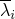 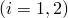 represent the deviatoric principal stretches; and  represents the elastic volume ratio. The function  is a continuous function of the damage variable  and is referred to as the “damage function.” When the deformation state of the material is on a point on the curve that represents the primary hyperelastic behavior, , 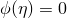, 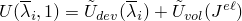, and the augmented energy function reduces to the strain energy density function of the primary hyperelastic behavior. The damage variable varies continuously during the course of the deformation and always satisfies . The above form of the energy function is an extension of the form proposed by Ogden and Roxburgh to account for material compressibility.

#### Stress computation

With the above modification to the energy function, the stresses are given by

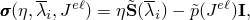

where  is the deviatoric stress corresponding to the primary hyperelastic behavior at the current deviatoric deformation level  and  is the hydrostatic pressure of the primary hyperelastic behavior at the current volumetric deformation level . Thus, the deviatoric stress as a result of Mullins effect is obtained by simply scaling the deviatoric stress of the primary hyperelastic behavior with the damage variable . The pressure stress is the same as that of the primary behavior. The model predicts loading/unloading along a single curve (that is different, in general, from the primary hyperelastic behavior) from any given strain level that passes through the origin of the stress-strain plot. It cannot capture permanent strains upon removal of load. The model also predicts that a purely volumetric deformation will not have any damage or Mullins effect associated with it.

#### Damage variable

The damage variable, , varies with the deformation according to

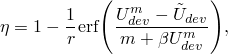

where  is the maximum value of  at a material point during its deformation history; *r*, , and *m* are material parameters; and  is the error function defined as 

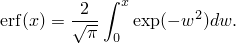

When , corresponding to a point on the primary curve, . On the other hand,  attains its minimum value, , given by 

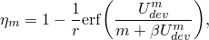

upon removal of deformation, when . For all intermediate values of ,  varies monotonically between  and . While the parameters *r* and  are dimensionless, the parameter *m* has the dimensions of energy. The equation for  reduces to that proposed by Ogden and Roxburgh when . The material parameters may be specified directly or may be computed by Abaqus based on curve-fitting of unloading-reloading test data. These parameters are subject to the restrictions , , and  (the parameters  and *m* cannot both be zero).  Alternatively, the damage variable  can be defined through user subroutine [`UMULLINS`](../sub/sub-link.md#sub-xsl-umullins) in Abaqus/Standard and [`VUMULLINS`](../sub/sub-link.md#sub-xsl-vumullins) in Abaqus/Explicit.

If the parameter  and the parameter *m* has a value that is small compared to , the slope of the stress-strain curve at the initiation of unloading from relatively large strain levels may become very high. As a result, the response may become discontinuous, as illustrated in [Figure 22.6.1--2](pt05ch22s06abm10.md#cmullins-overstiff-response).

**Figure 22.6.1–2** Overly stiff response at the initiation of unloading.


 This kind of behavior may lead to convergence problems in Abaqus/Standard. In Abaqus/Explicit the high stiffness will lead to very small stable time increments, thereby leading to a degradation in performance. This problem can be avoided by choosing a small value for . The choice  can be used to define the original Ogden-Roxburgh model. In Abaqus/Standard the default value of  is 0. In Abaqus/Explicit, however, the default value of  is 0.1. Thus, if you do not specify a value for , it is assumed to be 0 in Abaqus/Standard and 0.1 in Abaqus/Explicit.

The parameters  *r*,  , and  *m* do not have direct physical interpretations in general. The parameter  *m* controls whether damage occurs at low strain levels. If , there is a significant amount of damage at low strain levels. On the other hand, a nonzero *m* leads to little or no damage at low strain levels. For further discussion regarding the implications of this model to the energy dissipation, see ["Mullins effect," Section 4.7.1 of the Abaqus Theory Guide](../stm/stm-link.md#stm-mat-mullinseffect). The qualitative effects of varying the parameters *r* and  individually, while holding the other parameters fixed, are shown in [Figure 22.6.1--3](pt05ch22s06abm10.md#cmullins-response-vary-props). 

**Figure 22.6.1–3** Qualitative dependence of damage on material properties.


The left figure shows the unloading-reloading curve from a certain maximum strain level for increasing values of *r*. It suggests that the parameter *r* controls the amount of damage, with decreasing damage for increasing *r*. This behavior follows from the fact that the larger the value of *r*, the less the damage variable  can deviate from unity. The figure on the right shows the unloading-reloading curve from a certain maximum strain level for increasing values of . The figure suggests that increasing  also leads to lower amounts of damage. It also shows that the unloading-reloading response approaches the asymptotic response given by 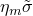, where  is the minimum value of , faster for lower values of . The dashed curves represent the asymptotic response at two different values of  (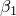 and ). For fixed values of *r* and *m*,  is a function of . In particular, if , 

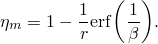

The above relation is approximately true if  is much greater than *m*.

#### Specifying the Mullins effect material model in Abaqus

The primary hyperelastic behavior is defined by using the hyperelastic material model (see ["Hyperelastic behavior of rubberlike materials," Section 22.5.1](pt05ch22s05abm07.md)). The Mullins effect model can be defined by specifying the Mullins effect parameters directly or by using test data to calibrate the parameters. Alternatively, you can define the Mullins effect model with user subroutine [`UMULLINS`](../sub/sub-link.md#sub-xsl-umullins) in Abaqus/Standard  and [`VUMULLINS`](../sub/sub-link.md#sub-xsl-vumullins) in Abaqus/Explicit.

##### Specifying the parameters directly

The parameters *r*, *m*, and  of the Mullins effect can be given directly as functions of temperature and/or field variables.

| **Input File Usage: ** | ``` [*MULLINS EFFECT](../key/key-link.md#usb-kws-mmullinseffect) ``` |
| --- | --- |

| **Abaqus/CAE Usage: ** | Property module: material editor: ****Mechanical****Damage for Elastomers****Mullins Effect****: **Definition**: **Constants** |
| --- | --- |

##### Using test data to calibrate the parameters

Experimental unloading-reloading data from different strain levels can be specified for up to three simple tests: uniaxial, biaxial, and planar. Abaqus will then compute the material parameters using a nonlinear least-squares curve fitting algorithm. It is generally best to obtain data from several experiments involving different kinds of deformation over the range of strains of interest in the actual application and to use all these data to determine the parameters. It is also important to obtain a good curve-fit for the primary hyperelastic behavior if the primary behavior is defined using test data.

By default, Abaqus attempts to fit all three parameters to the given data. This is possible in general, except in the situation when the test data correspond to unloading-reloading from only a single value of . In this case the parameters *m* and  cannot be determined independently; one of them must be specified. If you specify neither *m* nor , Abaqus needs to assume a default value for one of these parameters. In light of the potential problems discussed earlier with , Abaqus assumes that  in the above situation. The curve-fitting may also be carried out by specifying any one or two of the material parameters to be fixed, predetermined values.

As many data points as required can be entered from each test. It is recommended that data from all three tests (on samples taken from the same piece of material) be included and that the data points cover unloading/reloading from/to the range of nominal strain expected to arise in the actual loading.

The strain data should be given as nominal strain values (change in length per unit of original length). The stress data should be given as nominal stress values (force per unit of original cross-sectional area). These tests allow for entering both compression and tension data. Compressive stresses and strains are entered as negative values.

For each set of test input, the data point with the maximum nominal strain identifies the point of unloading. This point is used by the curve-fitting algorithm to compute  for that curve.

[Figure 22.6.1--4](pt05ch22s06abm10.md#cmullins-test-response) shows some typical unloading-reloading data from three different strain levels. 

**Figure 22.6.1–4** Typical available test data for Mullins effect.


The data include multiple loading and unloading cycles from each strain level. As [Figure 22.6.1--4](pt05ch22s06abm10.md#cmullins-test-response) indicates, the loading/unloading cycles from any given strain level do not occur along a single curve, and there is some amount of hysteresis. There is also some amount of permanent set upon removal of the applied load. The data also show evidence of progressive damage with repeated cycling at any given maximum strain level. The response appears to stabilize after a number of cycles. When such data are used to calibrate the Mullins effect model, the resulting response will capture the overall stiffness characteristics, while ignoring effects such as hysteresis, permanent set, or progressive damage. The above data can be provided to Abaqus in the following manner:- The primary curve can be made up of the data points indicated by the dashed curve in [Figure 22.6.1--4](pt05ch22s06abm10.md#cmullins-test-response). Essentially, this consists of an envelope of the first loading curves to the different strain levels.
- The unloading-reloading curves from the three different strain levels can be specified by providing the data points as is; i.e., as the repeated unloading-reloading cycles shown in [Figure 22.6.1--4](pt05ch22s06abm10.md#cmullins-test-response). As discussed earlier, the data from the different strain levels need to be distinguished by providing them as different tables. For example, assuming that the test data correspond to the uniaxial tension state, three tables of uniaxial test data would have to be defined for the three different strain levels shown in [Figure 22.6.1--4](pt05ch22s06abm10.md#cmullins-test-response). In this case Abaqus will provide a best fit using all the data points (from all strain levels). The resulting fit would result in a response that is an average of all the test data at any given strain level. While permanent set may be modeled (see ["Permanent set in rubberlike materials," Section 23.7.1](pt05ch23s07abm40.md)), hysteresis will be lost in the process.
- Alternatively, you may provide any one unloading-reloading cycle from each different strain level. If the component is expected to undergo repeated cyclic loading, the latter may be, for example, the stabilized cycle at each strain level. On the other hand, if the component is expected to undergo predominantly monotonic loading with perhaps small amounts of unloading, the very first unloading curve at each strain level may be the appropriate input data for calibrating the Mullins coefficients.

Once the Mullins effect constants are determined, the behavior of the Mullins effect model in Abaqus is established. However, the quality of this behavior must be assessed: the prediction of material behavior under different deformation modes must be compared against the experimental data. You must judge whether the Mullins effect constants determined by Abaqus are acceptable, based on the correlation between the Abaqus predictions and the experimental data. Single-element test cases can be used to derive the nominal stress–nominal strain response of the material model.

The steps that can be taken for improving the quality of the fit for the Mullins effect parameters are similar in essence to the guidelines provided for curve fitting the primary hyperelastic behavior (see ["Hyperelastic behavior of rubberlike materials," Section 22.5.1](pt05ch22s05abm07.md), for details). In addition, the quality of the fit for the Mullins effect parameters depends on a good fit for the primary hyperelastic behavior, if the primary behavior is defined using test data.

The quality of the fit can be evaluated by carrying out a numerical experiment with a single element that is loaded in the same mode for which test data has been provided. Alternatively, the numerical response for both the primary and the softening behavior can be obtained by requesting model definition data output (see ["Output," Section 4.1.1](pt02ch04s01aus38.md)) and carrying out a data check analysis. The response computed by Abaqus is printed in the data (`.dat`) file along with the experimental data. This tabular data can be plotted in Abaqus/CAE for comparison and evaluation purposes. The primary hyperelastic behavior can also be evaluated with the automated material evaluation tools in Abaqus/CAE.

| **Input File Usage: ** | ``` [*MULLINS EFFECT](../key/key-link.md#usb-kws-mmullinseffect), TEST DATA INPUT, BETA *and/or* M* and/or* R ``` |
| --- | --- |
|  | In addition, use at least one and up to three of the following options to give the unloading-reloading test data (see "Experimental tests" in the section describing hyperelastic test data input, ["Hyperelastic behavior of rubberlike materials," Section 22.5.1](pt05ch22s05abm07.md)): ``` [*UNIAXIAL TEST DATA](../key/key-link.md#usb-kws-munitestdata) [*BIAXIAL TEST DATA](../key/key-link.md#usb-kws-mbitestdata) [*PLANAR TEST DATA](../key/key-link.md#usb-kws-mplanartestdata) ``` Multiple unloading-reloading curves from different strain levels for any given test type can be entered by repeated specification of the appropriate test data option. |

| **Abaqus/CAE Usage: ** | Property module: material editor: ****Mechanical****Damage for Elastomers****Mullins Effect****: **Definition**: **Test Data Input**: enter the values for up to two of the values **r**, **m**, and **beta**. In addition, select and enter data for at least one of the following: ****Add Test****Biaxial Test****, **Planar Test**, or **Uniaxial Test** |
| --- | --- |

##### User subroutine specification

An alternative method for defining the Mullins effect involves defining the damage variable in user subroutine [`UMULLINS`](../sub/sub-link.md#sub-xsl-umullins) in Abaqus/Standard and [`VUMULLINS`](../sub/sub-link.md#sub-xsl-vumullins) in Abaqus/Explicit. Optionally, you can specify the number of property values needed as data in the user subroutine. You must provide the damage variable, , and its derivative, . The latter contributes to the Jacobian of the overall system of equations and is necessary to ensure good convergence characteristics in Abaqus/Standard. If needed, you can specify the number of solution-dependent variables (["User subroutines: overview," Section 18.1.1](pt04ch18s01aus104.md)). These solution-dependent variables can be updated in the user subroutine. The damage dissipation energy and the recoverable part of the energy may also be defined for output purposes.

User subroutines [`UMULLINS`](../sub/sub-link.md#sub-xsl-umullins) and [`VUMULLINS`](../sub/sub-link.md#sub-xsl-vumullins) can be used in combination with all hyperelastic potentials in Abaqus, including user-defined potentials (via user subroutines [`UHYPER`](../sub/sub-link.md#sub-xsl-uhyper), [`UANISOHYPER_INV`](../sub/sub-link.md#sub-xsl-uanisohyper_inv), and [`UANISOHYPER_STRAIN`](../sub/sub-link.md#sub-xsl-uanisohyper_strain) Abaqus/Standard, and [`VUANISOHYPER_INV`](../sub/sub-link.md#sub-xsl-vuanisohyper_inv) and [`VUANISOHYPER_STRAIN`](../sub/sub-link.md#sub-xsl-vuanisohyper_strain) in Abaqus/Explicit).

| **Input File Usage: ** | ``` [*MULLINS EFFECT](../key/key-link.md#usb-kws-mmullinseffect), USER, PROPERTIES=*constants* ``` |
| --- | --- |

| **Abaqus/CAE Usage: ** | Property module: material editor: ****Mechanical****Damage for Elastomers****Mullins Effect****: **Definition**: **User Defined** |
| --- | --- |

##### Viscoelasticity

When viscoelasticity is used in combination with Mullins effect, stress softening is applied to the long-term behavior.

In this case specification of the parameter  (which has units of energy) should be done carefully. If the underlying hyperelastic behavior is defined with an instantaneous modulus,  will be interpreted to be instantaneous. Otherwise,  is considered to be long term.

### Elements

The Mullins effect material model can be used with all element types that support the use of the hyperelastic material model.

### Procedures

The Mullins effect material model can be used in all procedure types that support the use of the hyperelastic material model. In linear perturbation steps in Abaqus/Standard the current material tangent stiffness is used to determine the response. Specifically, when a linear perturbation is carried out about a base state that is on the primary curve, the unloading tangent stiffness will be used.

In Abaqus/Explicit the unloading tangent stiffness is always used to compute the stable time increment. As a result, the inclusion of Mullins effect leads to more increments in the analysis, even when no unloading actually takes place.

The Mullins effect material model can also be used in a steady-state transport analysis in Abaqus/Standard to obtain steady-state rolling solutions. Issues related to the use of the Mullins effect in a steady-state transport analysis can be found in ["Steady-state transport analysis," Section 6.4.1](pt03ch06s04at17.md), and ["Analysis of a solid disc with Mullins effect and permanent set," Section 3.1.7 of the Abaqus Example Problems Guide](../exa/exa-link.md#exa-veh-mullinstire).

### Output

In addition to the standard output identifiers available in Abaqus (["Abaqus/Standard output variable identifiers," Section 4.2.1](pt02ch04s02abv01.md), and ["Abaqus/Explicit output variable identifiers," Section 4.2.2](pt02ch04s02xbv01.md)), the following variables have special meaning for the Mullins effect material model:

| DMENER | Energy dissipated per unit volume by damage. |
| --- | --- |

| ELDMD | Total energy dissipated in element by damage. |
| --- | --- |

| ALLDMD | Energy dissipated in whole (or partial) model by damage. The contribution from ALLDMD is included in the total strain energy ALLIE. |
| --- | --- |

| EDMDDEN | Energy dissipated per unit volume in the element by damage. |
| --- | --- |

| SENER | The recoverable part of the energy per unit volume. |
| --- | --- |

| ELSE | The recoverable part of the energy in the element. |
| --- | --- |

| ALLSE | The recoverable part of the energy in the whole (partial) model. |
| --- | --- |

| ESEDEN | The recoverable part of the energy per unit volume in the element. |
| --- | --- |

The damage energy dissipation, represented by the shaded area in [Figure 22.6.1--1](pt05ch22s06abm10.md#cmullins-idealized-response) for deformation until , is computed as follows. When the damaged material is in a fully unloaded state, the augmented energy function has the residual value . The residual value of the energy function upon complete unloading represents the energy dissipated due to damage in the material. The recoverable part of the energy is obtained by subtracting the dissipated energy from the augmented energy as .

The damage energy accumulates with progressive deformation along the primary curve and remains constant during unloading. During unloading, the recoverable part of the strain energy is released. The latter becomes zero when the material point is completely unloaded. Upon further reloading from a completely unloaded state, the recoverable part of the strain energy increases from zero. When the maximum strain that was attained earlier is exceeded upon reloading, further accumulation of damage energy occurs.

#### Additional reference

- Ogden, R. W., and D. G. Roxburgh, "A Pseudo-Elastic Model for the Mullins Effect in Filled Rubber," Proceedings of the Royal Society of London, Series A, vol. 455 2861--2877, 1999.


