# 22.6.2 Energy dissipation in elastomeric foams


**Products: **Abaqus/Standard  Abaqus/Explicit  

##### **References**

- ["Material library: overview," Section 21.1.1](pt05ch21s01abo18.md)
- ["Combining material behaviors," Section 21.1.3](pt05ch21s01aus110.md)
- ["Elastic behavior: overview," Section 22.1.1](pt05ch22s01abo19.md)
- ["Hyperelastic behavior in elastomeric foams," Section 22.5.2](pt05ch22s05abm08.md)
- ["Mullins effect," Section 22.6.1](pt05ch22s06abm10.md)
- [*HYPERFOAM](../key/key-link.md#usb-kws-mhyperfoam)
- [*MULLINS EFFECT](../key/key-link.md#usb-kws-mmullinseffect)
- [*UNIAXIAL TEST DATA](../key/key-link.md#usb-kws-munitestdata)
- [*BIAXIAL TEST DATA](../key/key-link.md#usb-kws-mbitestdata)
- [*PLANAR TEST DATA](../key/key-link.md#usb-kws-mplanartestdata)

### Overview

Energy dissipation in elastomeric foams in Abaqus:
- allows the modeling of permanent energy dissipation and stress softening effects in elastomeric foams;
- uses an approach based on the Mullins effect for elastomeric rubbers (["Mullins effect," Section 22.6.1](pt05ch22s06abm10.md));
- provides an extension to the isotropic elastomeric foam model (["Hyperelastic behavior in elastomeric foams," Section 22.5.2](pt05ch22s05abm08.md));
- is intended for modeling energy absorption in foam components subjected to dynamic loading under deformation rates that are high compared to the characteristic relaxation time of the foam; and
- cannot be used with viscoelasticity.

### Energy dissipation in elastomeric foams

Abaqus provides a mechanism to include permanent energy dissipation and stress softening effects in elastomeric foams. The approach is similar to that used to model the Mullins effect in elastomeric rubbers, described in ["Mullins effect," Section 22.6.1](pt05ch22s06abm10.md). The functionality is primarily intended for modeling energy absorption in foam components subjected to dynamic loading under deformation rates that are high compared to the characteristic relaxation time of the foam; in such cases it is acceptable to assume that the foam material is damaged permanently. 

The material response is depicted qualitatively in [Figure 22.6.2--1](pt05ch22s06abm11.md#cfoam-dissipation).

**Figure 22.6.2–1** Typical stress-stretch response of an elastomeric foam material with energy dissipation.


Consider the primary loading path  of a previously unstressed foam, with loading to an arbitrary point . On unloading from , the path  is followed. When the material is loaded again, the softened path is retraced as 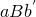. If further loading is then applied, the path 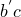 is followed, where  is a continuation of the primary loading path 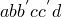 (which is the path that would be followed if there were no unloading). If loading is now stopped at , the path 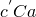 is followed on unloading and then retraced back to  on reloading. If no further loading beyond  is applied, the curve  represents the subsequent material response, which is then elastic. For loading beyond , the primary path is again followed and the pattern described is repeated. The shaded area in [Figure 22.6.2--1](pt05ch22s06abm11.md#cfoam-dissipation) represents the energy dissipated by damage in the material for deformation until .

#### Modified strain energy density function

Energy dissipation effects are accounted for by introducing an augmented strain energy density function of the form

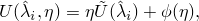

where   represent the principal mechanical stretches and  is the strain energy potential for the primary foam behavior described in ["Hyperelastic behavior in elastomeric foams," Section 22.5.2](pt05ch22s05abm08.md), defined by the polynomial strain energy function 


 The function 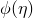 is a continuous function of the damage variable, , and is referred to as the “damage function.”  The damage variable varies continuously during the course of the deformation and always satisfies 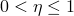, with 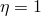 on the points of the primary curve. The damage function  satisfies the condition ; thus, when the deformation state of the material is on a point on the curve that represents the primary foam behavior, 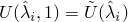 and the augmented energy function reduces to the strain energy potential for the primary foam behavior.

The above expression of the augmented strain energy density function is similar to the form proposed by Ogden and Roxburgh to model the Mullins effect in filled rubber elastomers (see ["Mullins effect," Section 22.6.1](pt05ch22s06abm10.md)), with the difference that in the case of elastomeric foams an augmentation of the total strain energy (including the volumetric part) is considered. This modification is required for the model to predict energy absorption under pure hydrostatic loading of the foam.

#### Stress computation

With the above modification to the energy function, the stresses are given by

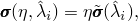

where  is the stress corresponding to the primary foam behavior at the current deformation level . Thus, the stress is obtained by simply scaling the stress of the primary foam behavior by the damage variable, . From any given strain level the model predicts unloading/reloading along a single curve (that is different, in general, from the primary foam behavior) that passes through the origin of the stress-strain plot. The model also predicts energy dissipation under purely volumetric deformation.

#### Damage variable

The damage variable, , varies with the deformation according to

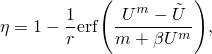

where  is the maximum value of 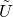 at a material point during its deformation history; *r*, , and *m* are material parameters; and 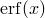 is the error function. When , corresponding to a point on the primary curve, . On the other hand, upon removal of deformation, when 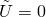, the damage variable, , attains its minimum value, , given by 

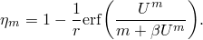

For all intermediate values of ,  varies monotonically between  and . While the parameters *r* and  are dimensionless, the parameter *m* has the dimensions of energy. The material parameters can be specified directly or can be computed by Abaqus based on curve fitting of unloading-reloading test data. These parameters are subject to the restrictions , 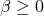, and  (the parameters  and *m* cannot both be zero).   Alternatively, the damage variable  can be defined through user subroutine [`UMULLINS`](../sub/sub-link.md#sub-xsl-umullins) in Abaqus/Standard and [`VUMULLINS`](../sub/sub-link.md#sub-xsl-vumullins) in Abaqus/Explicit.

If the parameter  and the parameter *m* has a value that is small compared to , the slope of the stress-strain curve at the initiation of unloading from relatively large strain levels may become very high. As a result, the response may become discontinuous. This kind of behavior may lead to convergence problems in Abaqus/Standard. In Abaqus/Explicit the high stiffness will lead to very small stable time increments, thereby leading to a degradation in performance. This problem can be avoided by choosing a small value for . In Abaqus/Standard the default value of  is 0. In Abaqus/Explicit, however, the default value of  is 0.1. Thus, if you do not specify a value for , it is assumed to be 0 in Abaqus/Standard and 0.1 in Abaqus/Explicit.

The parameters  *r*,  , and  *m* do not have direct physical interpretations in general. The parameter  *m* controls whether damage occurs at low strain levels. If , there is a significant amount of damage at low strain levels. On the other hand, a nonzero *m* leads to little or no damage at low strain levels. For further discussion regarding the implications of this model on the energy dissipation, see ["Mullins effect," Section 4.7.1 of the Abaqus Theory Guide](../stm/stm-link.md#stm-mat-mullinseffect).

#### Specifying properties for energy dissipation in elastomeric foams

The primary elastomeric foam behavior is defined by using the hyperfoam material model. Energy dissipation can be defined by specifying the parameters in the expression of the damage variable directly or by using test data to calibrate the parameters.  Alternatively, you can define the Mullins effect model with user subroutine [`UMULLINS`](../sub/sub-link.md#sub-xsl-umullins) in Abaqus/Standard  and [`VUMULLINS`](../sub/sub-link.md#sub-xsl-vumullins) in Abaqus/Explicit.

##### Specifying the parameters directly

The parameters *r*, *m*, and  in the expression of the damage variable can be given directly as functions of temperature and/or field variables.

| **Input File Usage: ** | ``` [*MULLINS EFFECT](../key/key-link.md#usb-kws-mmullinseffect) ``` |
| --- | --- |

| **Abaqus/CAE Usage: ** | Property module: material editor: ****Mechanical****Damage for Elastomers****Mullins Effect****: **Definition**: **Constants** |
| --- | --- |

##### Using test data to calibrate the parameters

Experimental unloading-reloading data from different strain levels can be specified for up to three simple tests: uniaxial, biaxial, and planar. Abaqus will then compute the material parameters using a nonlinear least-squares curve fitting algorithm. See ["Mullins effect," Section 22.6.1](pt05ch22s06abm10.md), for a detailed discussion of this approach.

| **Input File Usage: ** | ``` [*MULLINS EFFECT](../key/key-link.md#usb-kws-mmullinseffect), TEST DATA INPUT, BETA *and/or* M* and/or* R ``` |
| --- | --- |
|  | In addition, use at least one and up to three of the following options to give the unloading-reloading test data: ``` [*UNIAXIAL TEST DATA](../key/key-link.md#usb-kws-munitestdata) [*BIAXIAL TEST DATA](../key/key-link.md#usb-kws-mbitestdata) [*PLANAR TEST DATA](../key/key-link.md#usb-kws-mplanartestdata) ``` Multiple unloading-reloading curves from different strain levels for any given test type can be entered by repeated specification of the appropriate test data option. |

| **Abaqus/CAE Usage: ** | Property module: material editor: ****Mechanical****Damage for Elastomers****Mullins Effect****: **Definition**: **Test Data Input**: enter the values for up to two of the values **r**, **m**, and **beta**. In addition, enter data for at least one of the following ****Suboptions****Biaxial Test****, **Planar Test**, or **Uniaxial Test** |
| --- | --- |

##### User subroutine specification

An alternative method for specifying energy dissipation involves defining the damage variable in user subroutine [`UMULLINS`](../sub/sub-link.md#sub-xsl-umullins) in Abaqus/Standard and [`VUMULLINS`](../sub/sub-link.md#sub-xsl-vumullins) in Abaqus/Explicit. Optionally, you can specify the number of property values needed as data in the user subroutine. You must provide the damage variable, , and its derivative, . The latter contributes to the Jacobian of the overall system of equations and is necessary to ensure good convergence characteristics in Abaqus/Standard. If needed, you can specify the number of solution-dependent variables (["User subroutines: overview," Section 18.1.1](pt04ch18s01aus104.md)). These solution-dependent variables can be updated in the user subroutine. The damage dissipation energy and the recoverable part of the energy can also be defined for output purposes.

| **Input File Usage: ** | ``` [*MULLINS EFFECT](../key/key-link.md#usb-kws-mmullinseffect), USER, PROPERTIES=`constants` ``` |
| --- | --- |

| **Abaqus/CAE Usage: ** | Property module: material editor: ****Mechanical****Damage for Elastomers****Mullins Effect****: **Definition**: **User Defined** |
| --- | --- |

### Elements

The model can be used with all element types that support the use of the elastomeric foam material model.

### Procedures

The model can be used in all procedure types that support the use of the elastomeric foam material model. In linear perturbation steps in Abaqus/Standard the current material tangent stiffness is used to determine the response. Specifically, when a linear perturbation is carried out about a base state that is on the primary curve, the unloading tangent stiffness will be used.

In Abaqus/Explicit the unloading tangent stiffness is always used to compute the stable time increment. As a result, the inclusion of stress-softening effects may lead to more increments in the analysis, even when no unloading actually takes place.

### Output

In addition to the standard output identifiers available in Abaqus (["Abaqus/Standard output variable identifiers," Section 4.2.1](pt02ch04s02abv01.md), and ["Abaqus/Explicit output variable identifiers," Section 4.2.2](pt02ch04s02xbv01.md)), the following variables have special meaning when energy dissipation is present in the model:

| DMENER | Energy dissipated per unit volume by damage. |
| --- | --- |

| ELDMD | Total energy dissipated in element by damage. |
| --- | --- |

| ALLDMD | Energy dissipated in whole (or partial) model by damage. The contribution from ALLDMD is included in the total strain energy ALLIE. |
| --- | --- |

| EDMDDEN | Energy dissipated per unit volume in the element by damage. |
| --- | --- |

| SENER | The recoverable part of the energy per unit volume. |
| --- | --- |

| ELSE | The recoverable part of the energy in the element. |
| --- | --- |

| ALLSE | The recoverable part of the energy in the whole (partial) model. |
| --- | --- |

| ESEDEN | The recoverable part of the energy per unit volume in the element. |
| --- | --- |

The damage energy dissipation, represented by the shaded area in [Figure 22.6.2--1](pt05ch22s06abm11.md#cfoam-dissipation) for deformation until , is computed as follows. When the damaged material is in a fully unloaded state, the augmented energy function has the residual value 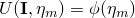. The residual value of the energy function upon complete unloading represents the energy dissipated due to damage in the material. The recoverable part of the energy is obtained by subtracting the dissipated energy from the augmented energy as 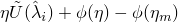.

The damage energy accumulates with progressive deformation along the primary curve and remains constant during unloading. During unloading, the recoverable part of the strain energy is released. The latter becomes zero when the material point is unloaded completely. Upon further reloading from a completely unloaded state, the recoverable part of the strain energy increases from zero. When the maximum strain that was attained earlier is exceeded upon reloading, further accumulation of damage energy occurs.


