# 22.7.2 Frequency domain viscoelasticity


**Products: **Abaqus/Standard  Abaqus/CAE  

##### **References**

- ["Material library: overview," Section 21.1.1](pt05ch21s01abo18.md)
- ["Elastic behavior: overview," Section 22.1.1](pt05ch22s01abo19.md)
- ["Time domain viscoelasticity," Section 22.7.1](pt05ch22s07abm12.md)
- [*VISCOELASTIC](../key/key-link.md#usb-kws-mviscoelast)
- ["Defining frequency domain viscoelasticity" in "Defining elasticity," Section 12.9.1 of the Abaqus/CAE User's Guide](../usi/usi-link.md#usi-prp-mechanical-elastic-viscoelastic-frequency)

### Overview

The frequency domain viscoelastic material model:
- describes frequency-dependent material behavior in small steady-state harmonic oscillations for those materials in which dissipative losses caused by "viscous" (internal damping) effects must be modeled in the frequency domain;
- assumes that the shear (deviatoric) and volumetric behaviors are independent in multiaxial stress states;
- can be used in large-strain problems;
- can be used only in conjunction with ["Linear elastic behavior," Section 22.2.1](pt05ch22s02abm02.md); ["Hyperelastic behavior of rubberlike materials," Section 22.5.1](pt05ch22s05abm07.md); and ["Hyperelastic behavior in elastomeric foams," Section 22.5.2](pt05ch22s05abm08.md), to define the long-term elastic material properties;
- can be used in conjunction with the elastic-damage gasket behavior (["Defining a nonlinear elastic model with damage" in "Defining the gasket behavior directly using a gasket behavior model," Section 32.6.6](pt06ch32s06alm51.md#usb-elm-egasketbehavior-thickness-elastdamage) ) to define the effective thickness-direction storage and loss moduli for gasket elements; and
- is active only during the direct-solution steady-state dynamic (["Direct-solution steady-state dynamic analysis," Section 6.3.4](pt03ch06s03at09.md)), the subspace-based steady-state dynamic (["Subspace-based steady-state dynamic analysis," Section 6.3.9](pt03ch06s03at14.md)), the natural frequency extraction (["Natural frequency extraction," Section 6.3.5](pt03ch06s03at10.md)), and the complex eigenvalue extraction (["Complex eigenvalue extraction," Section 6.3.6](pt03ch06s03at11.md)) procedures.

### Defining the shear behavior

Consider a shear test at small strain, in which a harmonically varying shear strain  is applied: 

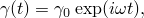

where 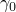 is the amplitude, ,  is the circular frequency, and *t* is time. We assume that the specimen has been oscillating for a very long time so that a steady-state solution is obtained. The solution for the shear stress then has the form 

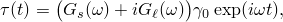

where  and 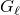 are the shear storage and loss moduli. These moduli can be expressed in terms of the (complex) Fourier transform 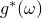 of the nondimensional shear relaxation function 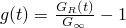: 

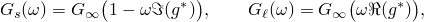

where 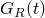 is the time-dependent shear relaxation modulus, 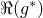 and 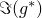 are the real and imaginary parts of , and  is the long-term shear modulus. See ["Frequency domain viscoelasticity," Section 4.8.3 of the Abaqus Theory Guide](../stm/stm-link.md#stm-mat-freqdomainvisco), for details.

The above equation states that the material responds to steady-state harmonic strain with a stress of magnitude 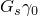 that is in phase with the strain and a stress of magnitude 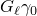 that lags the excitation by 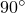. Hence, we can regard the factor 

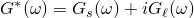

as the complex, frequency-dependent shear modulus of the steadily vibrating material. The absolute magnitude of the stress response is 

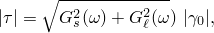

and the phase lag of the stress response is 

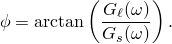

Measurements of 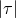 and  as functions of frequency in an experiment can, thus, be used to define  and  and, thus,  and  as functions of frequency.

Unless stated otherwise explicitly, all modulus measurements are assumed to be “true” quantities.

### Defining the volumetric behavior

In multiaxial stress states Abaqus/Standard assumes that the frequency dependence of the shear (deviatoric) and volumetric behaviors are independent. The volumetric behavior is defined by the bulk storage and loss moduli 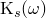 and 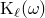. Similar to the shear moduli, these moduli can also be expressed in terms of the (complex) Fourier transform 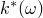 of the nondimensional bulk relaxation function 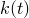: 

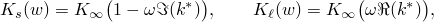

where 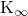 is the long-term elastic bulk modulus.

### Large-strain viscoelasticity

The linearized vibrations can also be associated with an elastomeric material whose long-term (elastic) response is nonlinear and involves finite strains (a hyperelastic material). We can retain the simplicity of the steady-state small-amplitude vibration response analysis in this case by assuming that the linear expression for the shear stress still governs the system, except that now the long-term shear modulus  can vary with the amount of static prestrain : 

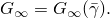

The essential simplification implied by this assumption is that the frequency-dependent part of the material's response, defined by the Fourier transform  of the relaxation function, is not affected by the magnitude of the prestrain. Thus, strain and frequency effects are separated, which is a reasonable approximation for many materials.

Another implication of the above assumption is that the anisotropy of the viscoelastic moduli has the same strain dependence as the anisotropy of the long-term elastic moduli. Hence, the viscoelastic behavior in all deformed states can be characterized by measuring the (isotropic) viscoelastic moduli in the undeformed state.

In situations where the above assumptions are not reasonable, the data can be specified based on measurements at the prestrain level about which the steady-state dynamic response is desired. In this case you must measure , , and  (likewise 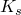, 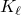, and ) at the prestrain level of interest. Alternatively, the viscoelastic data can be given directly in terms of uniaxial and volumetric storage and loss moduli that may be specified as functions of frequency and prestrain (see ["Direct specification of storage and loss moduli for large-strain viscoelasticity](pt05ch22s07abm13.md#usb-mat-cfreqviscodirect)” below.)

The generalization of these concepts to arbitrary three-dimensional deformations is provided in Abaqus/Standard by assuming that the frequency-dependent material behavior has two independent components: one associated with shear (deviatoric) straining and the other associated with volumetric straining. In the general case of a compressible material, the model is, therefore, defined for kinematically small perturbations about a predeformed state as 

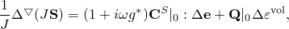

and 

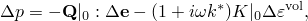

where 


is the deviatoric stress, ;

*p*

is the equivalent pressure stress, 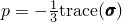;

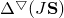

is the part of the stress increment caused by incremental straining (as distinct from the part of the stress increment caused by incremental rotation of the preexisting stress with respect to the coordinate system);

*J*

is the ratio of current to original volume;


is the (small) incremental deviatoric strain, 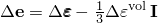;


is the deviatoric strain rate, 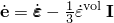;

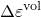

is the (small) incremental volumetric strain, 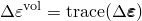;

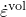

is the rate of volumetric strain, 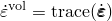;

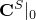

is the deviatoric tangent elasticity matrix of the material in its predeformed state (for example, 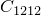 is the tangent shear modulus of the prestrained material);

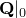

is the volumetric strain-rate/deviatoric stress-rate tangent elasticity matrix of the material in its predeformed state; and


is the tangent bulk modulus of the predeformed material.

For a fully incompressible material only the deviatoric terms in the first constitutive equation above remain and the viscoelastic behavior is completely defined by .

### Determination of viscoelastic material parameters

The dissipative part of the material behavior is defined by giving the real and imaginary parts of  and  (for compressible materials) as functions of frequency. The moduli can be defined as functions of the frequency in one of three ways: by a power law, by tabular input, or by a Prony series expression for the shear and bulk relaxation moduli.

#### Power law frequency dependence

The frequency dependence can be defined by the power law formul 

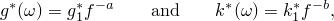

where *a* and *b* are real constants, 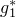 and  are complex constants, and 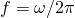 is the frequency in cycles per time.

| **Input File Usage: ** | ``` [*VISCOELASTIC](../key/key-link.md#usb-kws-mviscoelast), FREQUENCY=FORMULA ``` |
| --- | --- |

| **Abaqus/CAE Usage: ** | Property module: material editor: ****Mechanical****Elasticity****Viscoelastic****: **Domain: Frequency** and **Frequency: Formula** |
| --- | --- |

#### Tabular frequency dependence

The frequency domain response can alternatively be defined in tabular form by giving the real and imaginary parts of 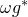 and —where  is the circular frequency—as functions of frequency in cycles per time. Given the frequency-dependent storage and loss moduli , , , and , the real and imaginary parts of  and  are then given as 

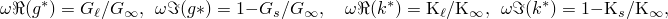

where  and  are the long-term shear and bulk moduli determined from the elastic or hyperelastic properties.

| **Input File Usage: ** | ``` [*VISCOELASTIC](../key/key-link.md#usb-kws-mviscoelast), FREQUENCY=TABULAR ``` |
| --- | --- |

| **Abaqus/CAE Usage: ** | Property module: material editor: ****Mechanical****Elasticity****Viscoelastic****: **Domain: Frequency** and **Frequency: Tabular** |
| --- | --- |

Abaqus provides an alternative approach for specifying the viscoelastic properties of hyperelastic and hyperfoam materials. This approach involves the direct (tabular) specification of storage and loss moduli from uniaxial and volumetric tests, as functions of excitation frequency and a measure of the level of pre-strain. The level of pre-strain refers to the level of elastic deformation at the base state about which the steady-state harmonic response is desired. This approach is discussed in ["Direct specification of storage and loss moduli for large-strain viscoelasticity](pt05ch22s07abm13.md#usb-mat-cfreqviscodirect)” below.

#### Prony series parameters

The frequency dependence can also be obtained from a time domain Prony series description of the dimensionless shear and bulk relaxation moduli: 

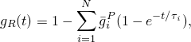

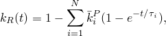

where *N*, , , and 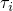, 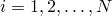, are material constants. Using Fourier transforms, the expression for the time-dependent shear modulus can be written in the frequency domain as follows:

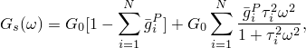

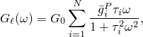

where  is the storage modulus,  is the loss modulus,  is the angular frequency, and *N* is the number of terms in the Prony series. The expressions for the bulk moduli,  and , are written analogously. Abaqus/Standard will automatically perform the conversion from the time domain to the frequency domain. The Prony series parameters  can be defined in one of three ways: direct specification of the Prony series parameters, inclusion of creep test data, or inclusion of relaxation test data. If creep test data or relaxation test data are specified, Abaqus/Standard will determine the Prony series parameters in a nonlinear least-squares fit. A detailed description of the calibration of Prony series terms is provided in ["Time domain viscoelasticity," Section 22.7.1](pt05ch22s07abm12.md).

For the test data you can specify the normalized shear and bulk data separately as functions of time or specify the normalized shear and bulk data simultaneously. A nonlinear least-squares fit is performed to determine the Prony series parameters, .

| **Input File Usage: ** | Use one of the following options to specify Prony data, creep test data, or relaxation test data: |
| --- | --- |
|  | ``` [*VISCOELASTIC](../key/key-link.md#usb-kws-mviscoelast), FREQUENCY=PRONY [*VISCOELASTIC](../key/key-link.md#usb-kws-mviscoelast), FREQUENCY=CREEP TEST DATA [*VISCOELASTIC](../key/key-link.md#usb-kws-mviscoelast), FREQUENCY=RELAXATION TEST DATA ``` Use one or both of the following options to specify the normalized shear and bulk data separately as functions of time: ``` [*SHEAR TEST DATA](../key/key-link.md#usb-kws-msheartestdata) [*VOLUMETRIC TEST DATA](../key/key-link.md#usb-kws-mvoltestdata) ``` Use the following option to specify the normalized shear and bulk data simultaneously: ``` [*COMBINED TEST DATA](../key/key-link.md#usb-kws-mcombinedtestdata) ``` |

| **Abaqus/CAE Usage: ** | Property module: material editor: ****Mechanical****Elasticity****Viscoelastic****: **Domain: Frequency** and **Frequency: Prony**, **Creep test data**, or **Relaxation test data** |
| --- | --- |
|  | Use one or both of the following options to specify the normalized shear and bulk data separately as functions of time: ****Test Data****Shear Test Data********Test Data****Volumetric Test Data**** Use the following option to specify the normalized shear and bulk data simultaneously: ****Test Data****Combined Test Data**** |

### Conversion of frequency-dependent elastic moduli

For some cases of small straining of isotropic viscoelastic materials, the material data are provided as frequency-dependent uniaxial storage and loss moduli,  and , and bulk moduli,  and . In that case the data must be converted to obtain the frequency-dependent shear storage and loss moduli  and .

The complex shear modulus is obtained as a function of the complex uniaxial and bulk moduli with the expression 


Replacing the complex moduli by the appropriate storage and loss moduli, this expression transforms into 


After some algebra one obtains 


#### Shear strain only

In many cases the viscous behavior is associated only with deviatoric straining, so that the bulk modulus is real and constant:  and . For this case the expressions for the shear moduli simplify to 


#### Incompressible materials

If the bulk modulus is very large compared to the shear modulus, the material can be considered to be incompressible and the expressions simplify further to 


### Direct specification of storage and loss moduli for large-strain viscoelasticity

For large-strain viscoelasticity Abaqus allows direct specification of storage and loss moduli from uniaxial and volumetric tests. This approach can be used when the assumption of the independence of viscoelastic properties on the pre-strain level is too restrictive.

You specify the storage and loss moduli directly as tabular functions of frequency, and you specify the level of pre-strain at the base state about which the steady-state dynamic response is desired. For uniaxial test data the measure of pre-strain is the uniaxial nominal strain; for volumetric test data the measure of pre-strain is the volume ratio. Abaqus internally converts the data that you specify to ratios of shear/bulk storage and loss moduli to the corresponding long-term elastic moduli. Subsequently, the basic formulation described in ["Large-strain viscoelasticity](pt05ch22s07abm13.md#usb-mat-cfreqviscolarge)” above is used.

For a general three-dimensional stress state it is assumed that the deviatoric part of the viscoelastic response depends on the level of pre-strain through the first invariant of the deviatoric left Cauchy-Green strain tensor (see ["Hyperelastic material behavior," Section 4.6.1 of the Abaqus Theory Guide](../stm/stm-link.md#stm-mat-hyperelastic), for a definition of this quantity), while the volumetric part depends on the pre-strain through the volume ratio. A consequence of these assumptions is that for the uniaxial case, data can be specified from a uniaxial-tension preload state or from a uniaxial-compression preload state but not both. 

The storage and loss moduli that you specify are assumed to be nominal quantities.

| **Input File Usage: ** | Use the following option to specify only the uniaxial storage and loss moduli: |
| --- | --- |
|  | ``` [*VISCOELASTIC](../key/key-link.md#usb-kws-mviscoelast), PRELOAD=UNIAXIAL ``` You can also use the following option to specify the volumetric (bulk) storage and loss moduli: ``` [*VISCOELASTIC](../key/key-link.md#usb-kws-mviscoelast), PRELOAD=VOLUMETRIC ``` |

| **Abaqus/CAE Usage: ** | Property module: material editor: ****Mechanical****Elasticity****Viscoelastic****: **Domain: Frequency** and **Frequency: Tabular** |
| --- | --- |
|  | Use the following option to specify only the uniaxial storage and loss moduli: **Type: Isotropic** or **Traction**: **Preload: Uniaxial** Use the following option to specify only the volumetric storage and loss moduli: **Type: Isotropic**: **Preload: Volumetric** Use the following option to specify both uniaxial and volumetric moduli: **Type: Isotropic**: **Preload: Uniaxial and Volumetric** |

### Defining the rate-independent part of the material behavior

In all cases elastic moduli must be specified to define the rate-independent part of the material behavior. The elastic behavior is defined by an elastic, hyperelastic, or hyperfoam material model. Since the frequency domain viscoelastic material model is developed around the long-term elastic moduli, the rate-independent elasticity must be defined in terms of long-term elastic moduli. This implies that the response in any analysis procedure other than a direct-solution steady-state dynamic analysis (such as a static preloading analysis) corresponds to the fully relaxed long-term elastic solution.

### Material options

The viscoelastic material model must be combined with the isotropic linear elasticity model to define classical, linear, small-strain, viscoelastic behavior. It is combined with the hyperelastic or hyperfoam model to define large-deformation, nonlinear, viscoelastic behavior. The long-term elastic properties defined for these models can be temperature dependent.

Viscoelasticity cannot be combined with any of the plasticity models. See ["Combining material behaviors," Section 21.1.3](pt05ch21s01aus110.md), for more details.

### Elements

The frequency domain viscoelastic material model can be used with any stress/displacement element in Abaqus/Standard.


