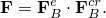
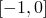
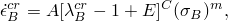
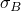
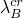
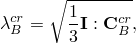
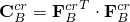
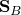
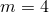
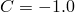

# 22.8.1 Hysteresis in elastomers


**Products: **Abaqus/Standard  Abaqus/CAE  

##### **References**

- ["Elastic behavior: overview," Section 22.1.1](pt05ch22s01abo19.md)
- [*HYSTERESIS](../key/key-link.md#usb-kws-mhysteresis)
- ["Defining hysteretic behavior for an isotropic hyperelastic material model" in "Defining elasticity," Section 12.9.1 of the Abaqus/CAE User's Guide](../usi/usi-link.md#usi-prp-mechanical-elastic-hyperelastic-hysteresis)

### Overview

The hysteresis material model:
- defines strain-rate-dependent, hysteretic behavior of materials that undergo comparable elastic and inelastic strains;
- provides inelastic response only for shear distortional behavior---the response to volumetric deformations is purely elastic;
- can be used only in conjunction with ["Hyperelastic behavior of rubberlike materials," Section 22.5.1](pt05ch22s05abm07.md), to define the elastic response of the material---the elasticity can be defined either in terms of the instantaneous moduli or the long-term moduli;
- is active during a static analysis (["Static stress analysis," Section 6.2.2](pt03ch06s02at01.md)), a quasi-static analysis (["Quasi-static analysis," Section 6.2.5](pt03ch06s02at04.md)), or a transient dynamic analysis using direct integration (["Implicit dynamic analysis using direct integration," Section 6.3.2](pt03ch06s03at07.md))---it cannot be used in fully coupled temperature-displacement analysis (["Fully coupled thermal-stress analysis," Section 6.5.3](pt03ch06s05at19.md)), fully coupled thermal-electrical-structural analysis (["Fully coupled thermal-electrical-structural analysis," Section 6.7.4](pt03ch06s07at23.md)), or steady-state transport analysis (["Steady-state transport analysis," Section 6.4.1](pt03ch06s04at17.md));
- cannot be used to model temperature-dependent creep material properties---however, the elastic material properties can be temperature dependent; and
- uses unsymmetric matrix storage and solution by default.

### Strain-rate-dependent material behavior for elastomers

Nonlinear strain-rate dependence of elastomers is modeled by decomposing the mechanical response into that of an equilibrium network (A) corresponding to the state that is approached in long-time stress relaxation tests and that of a time-dependent network (B) that captures the nonlinear rate-dependent deviation from the equilibrium state. The total stress is assumed to be the sum of the stresses in the two networks. The deformation gradient, , is assumed to act on both networks and is decomposed into elastic and inelastic parts in network B according to the multiplicative decomposition  The nonlinear rate-dependent material model is capable of reproducing the hysteretic behavior of elastomers subjected to repeated cyclic loading. It does not model “Mullins effect”—the initial softening of an elastomer when it is first subjected to a load.

The material model is defined completely by:
- a hyperelastic material model that characterizes the elastic response of the model;
- a stress scaling factor, *S*, that defines the ratio of the stress carried by network B to the stress carried by network A under instantaneous loading; i.e., identical elastic stretching in both networks;
- a positive exponent, *m*, generally greater than 1, characterizing the effective stress dependence of the effective creep strain rate in network B;
- an exponent, *C*, restricted to lie in , characterizing the creep strain dependence of the effective creep strain rate in network B;
- a nonnegative constant, *A*, in the expression for the effective creep strain rate---this constant also maintains dimensional consistency in the equation; and
- a constant, *E*, in the expression for the effective creep strain rate---this constant regularizes the creep strain rate near the undeformed state.

The effective creep strain rate in network B is given by the expression



where  is the effective creep strain rate in network B,  is the nominal creep strain in network B, and  is the effective stress in network B. The chain stretch in network B, , is defined as



where . The effective stress in network B is defined as , where  is the deviatoric Cauchy stress tensor.

### Defining strain-rate-dependent material behavior for elastomers

The elasticity of the model is defined by a hyperelastic material model. You input the stress scaling factor and the creep parameters for network B directly when you define the hysteresis material model. Typical values of the material parameters for a common elastomer are , (sec)1(MPa)*m*, , , and  (Bergstrom and Boyce, 1998; 2001).

| **Input File Usage: ** | Use both of the following options within the same material data block: |
| --- | --- |
|  | ``` [*HYSTERESIS](../key/key-link.md#usb-kws-mhysteresis) [*HYPERELASTIC](../key/key-link.md#usb-kws-mhyperelast) ``` |

| **Abaqus/CAE Usage: ** | Property module: material editor: ****Mechanical****Elasticity****Hyperelastic****: ****Suboptions****Hysteresis**** |
| --- | --- |
|  | The input of the parameter  is not supported in Abaqus/CAE. |

### Elements

The use of the hysteresis material model is restricted to elements that can be used with hyperelastic materials (["Hyperelastic behavior of rubberlike materials," Section 22.5.1](pt05ch22s05abm07.md)). In addition, this model cannot be used with elements based on the plane stress assumption (shell, membrane, and continuum plane stress elements). Hybrid elements can be used with this model only when the accompanying hyperelasticity definition is completely incompressible. When this model is used with reduced-integration elements, the instantaneous elastic moduli are used to calculate the default hourglass stiffness.

### Output

In addition to the standard output identifiers available in Abaqus/Standard (["Abaqus/Standard output variable identifiers," Section 4.2.1](pt02ch04s02abv01.md)), the following variables have special meaning if hysteretic behavior is defined:

| EE | Elastic strain corresponding to the stress state at time *t* and the instantaneous elastic material properties. |
| --- | --- |

| CE | Equivalent creep strain defined as the difference between the total strain and the elastic strain. |
| --- | --- |

These strain measures are used to approximate the strain energy, SENER, and the viscous dissipation, CENER. These approximations may lead to underestimation of the strain energy and overestimation of the viscous dissipation since the effects of internal stresses on these energy quantities are neglected. This inaccuracies may be particularly noticeable in the case of nonmonotonic loading.

#### Additional references

- Bergstrom, J. S., and M. C. Boyce, "Constitutive Modeling of the Large Strain Time-Dependent Behavior of Elastomers," Journal of the Mechanics and Physics of Solids, vol. 46, no.5, pp. 931--954, May 1998.
- Bergstrom, J. S., and M. C. Boyce, "Constitutive Modeling of the Time-Dependent and Cyclic Loading of Elastomers and Application to Soft Biological Tissues," Mechanics of Materials, vol. 33, no.9, pp. 523--530, 2001.


