# 22.8.2 Parallel rheological framework


**Products: **Abaqus/Standard  Abaqus/Explicit  

##### **References**

- ["Material library: overview," Section 21.1.1](pt05ch21s01abo18.md)
- ["Combining material behaviors," Section 21.1.3](pt05ch21s01aus110.md)
- ["Elastic behavior: overview," Section 22.1.1](pt05ch22s01abo19.md)
- ["UCREEPNETWORK," Section 1.1.23 of the Abaqus User Subroutines Reference Guide](../sub/sub-link.md#sub-rtn-uucreepnetwork)
- ["UTRSNETWORK," Section 1.1.54 of the Abaqus User Subroutines Reference Guide](../sub/sub-link.md#sub-rtn-uutrsnetwork)
- [*HYPERELASTIC](../key/key-link.md#usb-kws-mhyperelast)
- [*MULLINS EFFECT](../key/key-link.md#usb-kws-mmullinseffect)
- [*PLASTIC](../key/key-link.md#usb-kws-mplastic)
- [*TRS](../key/key-link.md#usb-kws-mtrs)
- [*VISCOELASTIC](../key/key-link.md#usb-kws-mviscoelast)

### Overview

The parallel rheological framework:
- is intended for modeling polymers and elastomeric materials that exhibit permanent set and nonlinear viscous behavior and undergo large deformations;
- consists of multiple viscoelastic networks and, optionally, an elastoplastic network in parallel;
- uses a hyperelastic material model to specify the elastic response;
- can be combined with Mullins effect;
- bases the elastoplastic response on multiplicative split of the deformation gradient and the theory of incompressible isotropic hardening plasticity;
- can include nonlinear kinematic hardening with multiple backstresses in the elastoplastic response in Abaqus/Standard; and
- uses multiplicative split of the deformation gradient and a flow rule derived from a creep potential to specify the viscous behavior.

### Material behavior

The parallel rheological framework allows definition of a nonlinear viscoelastic-elastoplastic model consisting of multiple networks connected in parallel, as shown in [Figure 22.8.2--1](pt05ch22s08abm15.md#viscoplastic-networks). The number of viscoelastic networks, *N*, can be arbitrary; however, at most one equilibrium network (network  in [Figure 22.8.2--1](pt05ch22s08abm15.md#viscoplastic-networks)) is allowed in the model. The equilibrium network response might be purely elastic or elastoplastic. In addition, it might include Mullins effect to predict material softening. The definition of the equilibrium network is optional. If it is not defined, the stress in the material will relax completely over time.

**Figure 22.8.2–1** Nonlinear viscoelastic-elastoplastic model with multiple parallel networks.

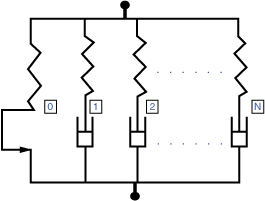

The model can be used to predict complex behavior of materials subjected to finite strains, which cannot be modeled accurately using other models available in Abaqus. An example of such complex behavior is depicted in [Figure 22.8.2--2](pt05ch22s08abm15.md#rnb612-usb-mat-relax-stress-nls-figure), which shows normalized stress relaxation curves for three different strain levels. This behavior can be modeled accurately using the nonlinear viscoelastic model depicted in [Figure 22.8.2--3](pt05ch22s08abm15.md#viscoelastic-networks), which can be defined within the framework; but it cannot be captured with the linear viscoelastic model (see ["Time domain viscoelasticity," Section 22.7.1](pt05ch22s07abm12.md)). In the latter case, the three curves would coincide.

**Figure 22.8.2–2** Normalized stress relaxation curves for three different strain levels.

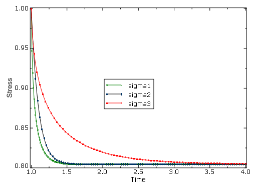

**Figure 22.8.2–3** Nonlinear viscoelastic model with multiple parallel networks.

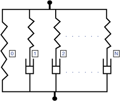

#### Elastic behavior

The elastic part of the response for all the networks is specified using the hyperelastic material model. Any of the hyperelastic models available in Abaqus can be used (see ["Hyperelastic behavior of rubberlike materials," Section 22.5.1](pt05ch22s05abm07.md)). The same hyperelastic material definition is used for all the networks, scaled by a stiffness ratio specific to each network. Consequently, only one hyperelastic material definition is required by the model along with the stiffness ratio for each network. The elastic response can be specified by defining either the instantaneous response or the long-term response.

#### Equilibrium network behavior

In addition to the elastic response described above, the response of the equilibrium network can include plasticity and Mullins effect to predict material softening. If the plastic response is defined using isotropic hardening, the response in the equilibrium network is equivalent to that of the permanent set model available in Abaqus (see ["Permanent set in rubberlike materials," Section 23.7.1](pt05ch23s07abm40.md), for a detailed description of the model). In Abaqus/Standard the nonlinear kinematic hardening model with multiple backstresses can be specified in addition to isotropic plastic hardening. The nonlinear kinematic hardening model is a generalization of the model used for metal plasticity. See ["Models for metals subjected to cyclic loading," Section 23.2.2](pt05ch23s02abm18.md), for a detailed description of the model, with the difference that the Cauchy stress is replaced with the Kirchhoff stress in the current formulation.

#### Viscous behavior

Viscous behavior must be defined for each viscoelastic network. It is modeled by assuming the multiplicative split of the deformation gradient and the existence of the creep potential, , from which the flow rule is derived. In the multiplicative split the deformation gradient is expressed as 

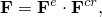

where  is the elastic part of the deformation gradient (representing the hyperelastic behavior) and 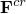is the creep part of the deformation gradient (representing the stress-free intermediate configuration). The creep potential is assumed to have the general form 

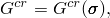

where  is the Cauchy stress. If the potential is specified, the flow rule can be obtained from 

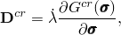

where 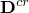 is the symmetric part of the velocity gradient, 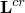, expressed in the current configuration and  is the proportionality factor. In this model the creep potential is given by

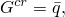

and the proportionality factor is taken as 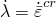, where 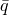 is the equivalent deviatoric Cauchy stress and  is the equivalent creep stain rate. In this case the flow rule has the form

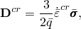

or, equivalently 

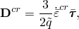

where 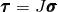 is the Kirchhoff stress,  is the determinant of ,  is the deviatoric Cauchy stress, 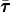 is the deviatoric Kirchhoff stress, and 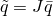. To complete the derivation, the evolution law for  must be provided. In this model  can be determined from either a power-law strain hardening model or a hyperborlic-sine model.

##### Power law model

The power law model is available in the form 

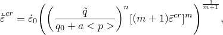

where


is the equivalent creep strain rate, 


is the equivalent creep strain, 


is the equivalent deviatoric Kirchhoff stress,


is the Kirchhoff pressure, and

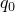, *m*, *n*, *a* and 

are material parameters.

##### Power-law strain hardening model

The power-law strain hardening model is available in the form 


where


is the equivalent creep strain rate, 


is the equivalent creep strain, 


is the equivalent deviatoric Kirchhoff stress, and

*A*, *m*, and *n*

are material parameters.

##### Hyperbolic-sine law model

The hyperbolic-sine law is available in the form 

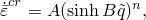

where 

 and 

are defined above, and

*A*, *B*, and *n*

are material parameters.

##### Bergstrom-Boyce model

The Bergstrom-Boyce model is available in the form 

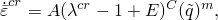

where 

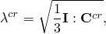

and

 and 

are defined above, and

*A*, *m*, *C*, and *E*

are material parameters.

The response of the network defined by the Bergstrom-Boyce model is very similar to the response of the time-dependent network in the hysteresis model (see ["Hysteresis in elastomers," Section 22.8.1](pt05ch22s08abm14.md)). However, there are also important differences between the models. In the Bergstrom-Boyce model the equivalent Kirchhoff stress is used instead of the equivalent Cauchy stress, which is used in the hysteresis model. (The two stress measures become equivalent for the case of incompressible materials.) In addition, the material parameters, *A*, in the models differ by a factor of 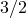. The parameter in the hysteresis model must be multiplied by  to make the parameters equivalent.

##### User-defined model in Abaqus/Standard

A user-defined creep model is available of the following general form:

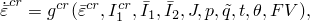

where

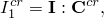

and


is the first invariant of ,

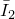

is the second invariant of ,

, , ,  and 

are defined above,

*t*

is the time,


is the temperature, and

*FV*

are field variables.

The tensor  is defined in ["UCREEPNETWORK," Section 1.1.23 of the Abaqus User Subroutines Reference Guide](../sub/sub-link.md#sub-rtn-uucreepnetwork).

#### Thermal expansion

Only isotropic thermal expansion is permitted with nonlinear viscoelastic materials (["Thermal expansion," Section 26.1.2](pt05ch26s01abm52.md)). 

### Defining viscoelastic response

The nonlinear viscoelastic response is defined by specifying the identifier, stiffness ratio, and creep law for each viscoelastic network. 

#### Specifying network identifier

Each viscoelastic network in the material model must be assigned a unique network identifier or network id. The network identifiers must be consecutive integers starting with 1. The order in which they are specified is not important.

| **Input File Usage: ** | Use the following option to specify the network identifier: |
| --- | --- |
|  | ``` [*VISCOELASTIC](../key/key-link.md#usb-kws-mviscoelast), NONLINEAR, NETWORKID=*networkId* ``` |

#### Defining the stiffness ratio

The contribution of each network to the overall response of the material is determined by the value of the stiffness ratio, , which is used to scale the elastic response of the network material. The sum of the stiffness ratios of the viscoelastic networks must be smaller than or equal to 1. If the sum of the ratios is equal to 1, the purely elastic equilibrium network is not created. If the sum of the ratios is smaller than 1, the equilibrium network is created with a stiffness ratio, , equal to

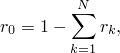

where  denotes the number of viscoelastic networks and 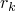 is the stiffness ratio of network .

| **Input File Usage: ** | ``` [*VISCOELASTIC](../key/key-link.md#usb-kws-mviscoelast), NONLINEAR, SRATIO=*ratio* ``` |
| --- | --- |

#### Specifying the creep law

The definition of creep behavior in Abaqus/Standard is completed by specifying the creep law.

##### Power law creep model

The power law model is defined by specifying five material parameters: , *n*, *m*, *a*, and . The parameter  must be positive. It is introduced for dimensional consistency, and its default value is 1.0. For physically reasonable behavior  and *n* must be positive, *a* must be nonnegative (the default is 0.0), and 1 < *m* ≤ 0.

| **Input File Usage: ** | ``` [*VISCOELASTIC](../key/key-link.md#usb-kws-mviscoelast), NONLINEAR, LAW=POWER LAW ``` |
| --- | --- |

##### Strain hardening power law creep model

The strain hardening law is defined by specifying three material parameters: *A*, *n*, and *m*. For physically reasonable behavior *A* and *n* must be positive and 1 < *m* ≤ 0.

| **Input File Usage: ** | ``` [*VISCOELASTIC](../key/key-link.md#usb-kws-mviscoelast), NONLINEAR, LAW=STRAIN ``` |
| --- | --- |

##### Hyperbolic sine creep model

The hyperbolic sine creep law is specified by providing three nonnegative parameters: *A*, *B*, and *n*.

| **Input File Usage: ** | ``` [*VISCOELASTIC](../key/key-link.md#usb-kws-mviscoelast), NONLINEAR, LAW=HYPERB ``` |
| --- | --- |

##### Bergstrom-Boyce creep model

The Bergstrom-Boyce creep law is specified by providing four parameters: *A*, *m*, *C*, and *E*. The parameters *A* and *E* must be nonnegative, the parameter *m* must be positive, and the parameter *C* must lie in .

| **Input File Usage: ** | ``` [*VISCOELASTIC](../key/key-link.md#usb-kws-mviscoelast), NONLINEAR, LAW=BERGSTROM-BOYCE ``` |
| --- | --- |

##### User-defined creep model in Abaqus/Standard

An alternative method for defining the creep law involves using user subroutine [`UCREEPNETWORK`](../sub/sub-link.md#sub-xsl-ucreepnetwork). Optionally, you can specify the number of property values needed as data in the user subroutine.

| **Input File Usage: ** | ``` [*VISCOELASTIC](../key/key-link.md#usb-kws-mviscoelast), NONLINEAR, LAW=USER, PROPERTIES=*n* ``` |
| --- | --- |

##### Numerical difficulties

Depending on the choice of units, the value of *A* in the strain power-law, hyperbolic-sine, and Bergstrom-Boyce models may be very small for typical creep strain rates. If *A* is less than 1027, numerical difficulties can cause errors in the material calculations; therefore, a different system of units should be used to avoid such difficulties in the calculation of creep strain increments. In such cases it is recommended to replace the strain power-law model with the power law model, which does not have the limitation described above. The strain power-law model is a special case of the power law model obtained by setting 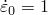, , and 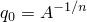.

#### Thermo-rheologically simple temperature effects

Thermo-rheologically simple temperature effects can be included for each viscoelastic network. In this case the creep law is modified and takes the following form: 

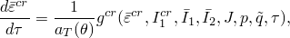

where  and 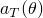 denote the reduced time and the shift function, respectively. The reduced time is related to the actual time through the integral differential equation 

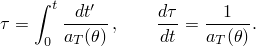

Abaqus supports the following forms of the shift function: the Williams-Landel-Ferry (WLF) form and the Arrhenius form (see ["Thermo-rheologically simple temperature effects" in "Time domain viscoelasticity," Section 22.7.1](pt05ch22s07abm12.md#usb-mat-ctimevisco-trs)). In addition, user-defined forms can be specified in Abaqus/Standard.

##### User-defined form in Abaqus/Standard

An alternative method for specifying the shift function involves using user subroutine [`UTRSNETWORK`](../sub/sub-link.md#sub-xsl-utrsnetwork). Optionally, you can specify the number of property values needed as data in the user subroutine.

| **Input File Usage: ** | ``` [*TRS](../key/key-link.md#usb-kws-mtrs), DEFINITION=USER, PROPERTIES=*n* ``` |
| --- | --- |

### Material response in different analysis steps

In Abaqus/Standard the material is active during all stress/displacement procedure types. However, the creep effects are taken into account only in quasi-static (see ["Quasi-static analysis," Section 6.2.5](pt03ch06s02at04.md)), coupled temperature-displacement (["Fully coupled thermal-stress analysis," Section 6.5.3](pt03ch06s05at19.md)), and direct-integration implicit dynamic (see ["Implicit dynamic analysis using direct integration," Section 6.3.2](pt03ch06s03at07.md)) analyses. In other stress/displacement procedures the evolution of the state variables is suppressed and the creep strain remains unchanged. In Abaqus/Explicit the creep effects are always active.

### Elements

The nonlinear viscoelastic model is available with continuum elements that include mechanical behavior (elements that have displacement degrees of freedom), except for one-dimensional and plane stress elements.

### Output

In addition to the standard output identifiers available in Abaqus (["Abaqus/Standard output variable identifiers," Section 4.2.1](pt02ch04s02abv01.md), and ["Abaqus/Explicit output variable identifiers," Section 4.2.2](pt02ch04s02xbv01.md)), the following variables have special meaning for the nonlinear viscoelastic material model:

| CEEQ | The overall equivalent creep strain, defined as 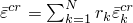. |
| --- | --- |

| CE | The overall creep strain, defined as 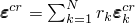. |
| --- | --- |

| CENER | The overall viscous dissipated energy per unit volume, defined as 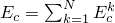. |
| --- | --- |

| SENER | The overall elastic strain energy density per unit volume, defined as 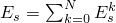. |
| --- | --- |

In the above definitions  denotes the stiffness ratio for network ,  denotes the number of viscoelastic networks, the subscript or superscript  is used to denote network quantities, and the network  is assumed to be the purely elastic network.

If plasticity is specified in the equilibrium network, the standard output identifiers available in Abaqus corresponding to other isotropic and kinematic hardening plasticity models can be obtained for this model as well. In addition, if the Mullins effect is used in the model, the output variables available for the Mullins effect model (see ["Mullins effect," Section 22.6.1](pt05ch22s06abm10.md)) can be requested.

#### Additional references

- Bergstrom, J. S., and M. C. Boyce, "Constitutive Modeling of the Large Strain Time-Dependent Behavior of Elastomers," Journal of the Mechanics and Physics of Solids, vol. 46, pp. 931--954, 1998.
- Bergstrom, J. S., and M. C. Boyce, "Large Strain Time-Dependent Behavior of Filled Elastomers," Mechanics of Materials, vol. 32, pp. 627--644, 2000.
- Bergstrom, J. S., and J. E. Bischoff, "An Advanced Thermomechanical Constitutive Model for UHMWPE," International Journal of Structural Changes in Solids, vol. 2, pp. 31--39, 2010.
- Hurtado, J. A., I. Lapczyk, and S. M. Govindarajan, "Parallel Rheological Framework to Model Non-Linear Viscoelasticity, Permanent Set, and Mullins Effect in Elastomers," Constitutive Models for Rubber VIII 95, 2013.
- Lapczyk, I., J. A. Hurtado, and S. M. Govindarajan, "A Parallel Rheological Framework for Modeling Elastomers and Polymers," 182nd Technical Meeting of the Rubber Division of the American Chemical Society, pp. 1840--1859, October 2012, Cincinnati, OH.


