# 22.9.1 Low-density foams


**Products: **Abaqus/Explicit  Abaqus/CAE  

##### **References**

- ["Material library: overview," Section 21.1.1](pt05ch21s01abo18.md)
- ["Elastic behavior: overview," Section 22.1.1](pt05ch22s01abo19.md)
- [*LOW DENSITY FOAM](../key/key-link.md#usb-kws-mlowdensfoam)
- [*UNIAXIAL TEST DATA](../key/key-link.md#usb-kws-munitestdata)
- ["Creating a low-density foam material model" in "Defining elasticity," Section 12.9.1 of the Abaqus/CAE User's Guide](../usi/usi-link.md#usi-prp-mechanical-elastic-lowdensfoam)

### Overview

The low-density foam material model:
- is intended for low-density, highly compressible elastomeric foams with significant rate sensitive behavior (such as polyurethane foam);
- requires the direct specification of uniaxial stress-strain curves at different strain rates for both tension and compression;
- optionally allows the specification of lateral strain data to include Poisson effects;
- allows for the specification of optional unloading stress-strain curves for better representation of the hysteretic behavior and energy absorption during cyclic loading; and
- requires that geometric nonlinearity be accounted for during the analysis step (see ["Defining an analysis," Section 6.1.2](pt03ch06s01abo05.md), and ["General and linear perturbation procedures," Section 6.1.3](pt03ch06s01aus44.md)), since it is intended for finite-strain applications.

### Mechanical response

Low-density, highly compressible elastomeric foams are widely used in the automotive industry as energy absorbing materials. Foam padding is used in many passive safety systems, such as behind headliners for head impact protection, in door trims for pelvis and thorax protection, etc. Energy absorbing foams are also commonly used in packaging of hand-held and other electronic devices. 

The low-density foam material model in Abaqus/Explicit is intended to capture the highly strain-rate sensitive behavior of these materials. The model uses a pseudo visco-hyperelastic formulation whereby the strain energy potential is constructed numerically as a function of principal stretches and a set of internal variables associated with strain rate. By default the Poisson's ratio of the material is assumed to be zero. With this assumption, the evaluation of the stress-strain response becomes uncoupled along the principal deformation directions. Optionally, nonzero Poisson effects can be specified to include coupling along the principal directions.

The model requires as input the stress-strain response of the material for both uniaxial tension and uniaxial compression tests. Poisson effects can be included by also specifying lateral strain data for each of these tests. The tests can be performed at different strain rates. For each test the strain data should be given in nominal strain values (change in length per unit of original length), and the stress data should be given in nominal stress values (force per unit of original cross-sectional area). Uniaxial tension and compression curves are specified separately. The uniaxial stress and strain data are given in absolute values (positive in both tension and compression). On the other hand, when specified, the lateral strain data must be negative in tension and positive in compression, corresponding to a positive Poisson's effect. The model does not support negative Poisson's effect. Rate-dependent behavior is specified by providing the uniaxial stress-strain curves for different values of nominal strain rates. 

Both loading and unloading rate-dependent curves can be specified to better characterize the hysteretic behavior and energy absorption properties of the material during cyclic loading. Use positive values of nominal strain rates for loading curves and negative values for the unloading curves. Currently this option is available only with linear strain rate regularization (see ["Regularization of strain-rate-dependent data in Abaqus/Explicit" in "Material data definition," Section 21.1.2](pt05ch21s01aus109.md#usb-mat-cmaterialdata-regularizing-rate-dep)).  When the unloading behavior is not specified directly, the model assumes that unloading occurs along the loading curve associated with the smallest deformation rate. A representative schematic of typical rate-dependent uniaxial compression data is shown in [Figure 22.9.1--1](pt05ch22s09abm16.md#usb-mat-clowdensfoam-ratedep) with both loading and unloading curves. It is important that the specified  rate-dependent stress-strain curves do not intersect. Otherwise, the material is unstable, and Abaqus issues an error message if an intersection between curves is found.

**Figure 22.9.1–1** Rate-dependent loading/unloading stress-strain curves.

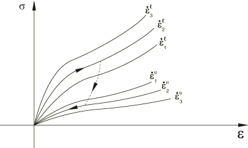

During the analysis, the stress along each principal deformation direction is evaluated by interpolating the specified loading/unloading stress-strain curves using the corresponding values of principal nominal strain and strain rate. The stress is then corrected by a coupling term if non-zero Poisson effects are included. The representative response of the model for a uniaxial compression cycle is shown in [Figure 22.9.1--1](pt05ch22s09abm16.md#usb-mat-clowdensfoam-ratedep).

| **Input File Usage: ** | Use the following options to specify a low-density foam material: |
| --- | --- |
|  | ``` [*LOW DENSITY FOAM](../key/key-link.md#usb-kws-mlowdensfoam) [*UNIAXIAL TEST DATA](../key/key-link.md#usb-kws-munitestdata), DIRECTION=TENSION [*UNIAXIAL TEST DATA](../key/key-link.md#usb-kws-munitestdata), DIRECTION=COMPRESSION ``` |

| **Input File Usage: ** | Use the first option to specify a low-density foam material with zero Poisson's ratio (default), or use the second option to include Poisson effects by defining lateral strains as part of the test data input: |
| --- | --- |
|  | ``` [*LOW DENSITY FOAM](../key/key-link.md#usb-kws-mlowdensfoam),LATERAL STRAIN DATA=NO (default) [*LOW DENSITY FOAM](../key/key-link.md#usb-kws-mlowdensfoam), LATERAL STRAIN DATA=YES ``` In addition, use these two options to give the experimental stress-strain data ``` [*UNIAXIAL TEST DATA](../key/key-link.md#usb-kws-munitestdata), DIRECTION=TENSION [*UNIAXIAL TEST DATA](../key/key-link.md#usb-kws-munitestdata), DIRECTION=COMPRESSION ``` |

| **Abaqus/CAE Usage: ** | Property module: material editor: ****Mechanical****Elasticity****Low Density Foam****: ****Uniaxial Test Data****Uniaxial Tension Test Data****, ****Uniaxial Test Data****Uniaxial Compression Test Data**** |
| --- | --- |

#### Relaxation coefficients

 Unphysical jumps in stress due to sudden changes in the deformation rate are prevented using a technique based on viscous regularization. This technique also models stress relaxation effects in a very simplistic manner. In the case of a uniaxial test, for example, the relaxation time is given as 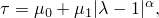 where , 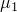, and  are material parameters and  is the stretch.  is a linear viscosity parameter that controls the relaxation time when 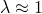, and typically small values of this parameter should be used.  is a nonlinear viscosity parameter that controls the relaxation time at higher values of deformation. The smaller this value, the shorter the relaxation time.  controls the sensitivity of the relaxation speed to the stretch. The default values of these parameters are 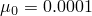 (time units), 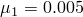 (time units), and .

| **Input File Usage: ** | Use the following option to specify relaxation coefficients: |
| --- | --- |
|  | ``` [*LOW DENSITY FOAM](../key/key-link.md#usb-kws-mlowdensfoam) , ,  ``` |

| **Abaqus/CAE Usage: ** | Property module: material editor: ****Mechanical****Elasticity****Low Density Foam****: **Relaxation coefficients:** *mu0*, *mu1*, *alpha* |
| --- | --- |

#### Strain rate

When Poisson's ratio is zero, three different strain rate measures can be used for the evaluation of the stress-strain response along each principal deformation direction for general three-dimensional deformation states: the nominal volumetric strain rate, the nominal strain rate along each principal deformation direction, or the maximum of the nominal strain rates along the principal deformation directions. By default, the nominal volumetric strain rate is used; this approach does not produce rate-sensitive behavior under volume-preserving deformation modes (e.g., simple shear). Alternatively, each principal stress can be evaluated based either on the nominal strain rate along the corresponding principal direction or the maximum of the nominal strain rates; both these approaches can provide rate-sensitive behavior for volume-preserving deformation modes. All three strain rate measures produce identical rate-dependent behavior for uniaxial loading conditions when the Poisson's ratio is zero.

When non-zero Poisson effects are defined, the model uses the maximum nominal strain rate along the principal deformation directions for the evaluation of the stress-strain response. This is the default and only strain rate measure available for this case.

| **Input File Usage: ** | Use the following option to use the volumetric strain rate (default when Poisson's ratio is zero): |
| --- | --- |
|  | ``` [*LOW DENSITY FOAM](../key/key-link.md#usb-kws-mlowdensfoam), STRAIN RATE=VOLUMETRIC ``` Use the following option to use the nominal strain rate evaluated along each principal direction: ``` [*LOW DENSITY FOAM](../key/key-link.md#usb-kws-mlowdensfoam), STRAIN RATE=PRINCIPAL ``` Use the following option to use the maximum of the nominal strain rates along the principal directions (default and only option available when Poisson's ratio is not zero): ``` [*LOW DENSITY FOAM](../key/key-link.md#usb-kws-mlowdensfoam), STRAIN RATE=MAX PRINCIPAL ``` |

| **Abaqus/CAE Usage: ** | Use the following option to use the volumetric strain rate (default): |
| --- | --- |
|  | Property module: material editor: ****Mechanical****Elasticity****Low Density Foam****: **Strain rate measure:** **Volumetric** Use the following option to use the strain rate evaluated along each principal direction: Property module: material editor: ****Mechanical****Elasticity****Low Density Foam****: **Strain rate measure:** **Principal** |

#### Extrapolation of stress-strain curves

By default, for this material model and for strain values beyond the range of specified strains, Abaqus/Explicit extrapolates the stress-strain curves using the slope at the last data point. 

When the strain rate value exceeds the maximum specified strain rate, Abaqus/Explicit uses the stress-strain curve corresponding to the maximum specified strain rate by default. You can override this default and activate strain rate extrapolation based on the slope (with respect to strain rate). 

| **Input File Usage: ** | Use the following option to activate strain rate extrapolation of loading curves: |
| --- | --- |
|  | ``` [*LOW DENSITY FOAM](../key/key-link.md#usb-kws-mlowdensfoam), RATE EXTRAPOLATION=YES ``` |

| **Abaqus/CAE Usage: ** | Property module: material editor: ****Mechanical****Elasticity****Low Density Foam****: toggle on **Extrapolate stress-strain curve beyond maximum strain rate** |
| --- | --- |

### Tension cutoff and failure

Low-density foams have limited strength in tension and can easily rupture under excessive tensile loading. The model in Abaqus/Explicit provides the option to specify a cutoff value for the maximum principal tensile stress that the material can sustain. The maximum principal stresses computed by the program will stay at or below this value. You can also activate deletion (removal) of the element from the simulation when the tension cutoff value is reached, which provides a simple method for modeling rupture.

| **Input File Usage: ** | Use the following option to define a tension cutoff value without element deletion: |
| --- | --- |
|  | ``` [*LOW DENSITY FOAM](../key/key-link.md#usb-kws-mlowdensfoam), TENSION CUTOFF=*value* ``` Use the following option to allow element deletion when the tension cutoff value is met: ``` [*LOW DENSITY FOAM](../key/key-link.md#usb-kws-mlowdensfoam), TENSION CUTOFF=*value*, FAIL=YES ``` |

| **Abaqus/CAE Usage: ** | Use the following option to define a tension cutoff value: |
| --- | --- |
|  | Property module: material editor: ****Mechanical****Elasticity****Low Density Foam****: toggle on **Maximum allowable principal tensile stress:** *value* Use the following option to allow element deletion when the tension cutoff value is met: Property module: material editor: ****Mechanical****Elasticity****Low Density Foam****: toggle on **Remove elements exceeding maximum** |

### Thermal expansion

Only isotropic thermal expansion is permitted with the low-density foam material model.

The elastic volume ratio, , relates the total volume ratio (current volume/reference volume), *J*, and the thermal volume ratio, , via the simple relationship: 


 is given by 

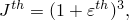

where  is the linear thermal expansion strain that is obtained from the temperature and the isotropic thermal expansion coefficient (["Thermal expansion," Section 26.1.2](pt05ch26s01abm52.md)).

### Material stability

The Drucker stability condition for a compressible material requires that the change in the Kirchhoff stress, , following from an infinitesimal change in the logarithmic strain, , satisfies the inequality 

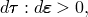

where the Kirchhoff stress . Using 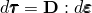, the inequality becomes 

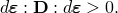

This restriction requires that the tangential material stiffness  be positive definite.

For an isotropic elastic formulation the inequality can be represented in terms of the principal stresses and strains 

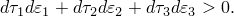

Thus, the relation between changes in the stress and changes in the strain can be obtained in the form of the matrix equation 

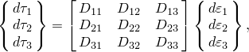

where 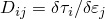. Since  must be positive definite, it is necessary that 

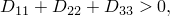


When Poisson's ratio is zero, the off diagonal terms of  become zero. In that case the necessary conditions for a positive definite matrix reduce to 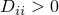; that is, the slope of the specified uniaxial stress-strain curves in the space of Kirchhoff stress versus logarithmic strain must be positive.

You should be careful defining the input data for the low-density foam model to ensure stable material response for all strain rates. If an instability is found, Abaqus issues a warning message and prints the lowest value of strain for which the instability is observed. Ideally, no instability should occur. If instabilities are observed at strain levels that are likely to occur in the analysis, it is strongly recommended that you carefully examine and revise the material input data. When nonzero Poisson effects are defined, it is highly recommended that you provide uniaxial test data in tension and compression for the same range of strain rates.

### Elements

The low-density foam model can be used with solid (continuum) elements and generalized plane strain elements. One-dimensional solid elements (truss and rebar) are also available for the case when no lateral strains are specified (Poisson's ratio is zero). The model cannot be used with shells, membranes, or the Eulerian elements (EC3D8R and EC3D8RT).

### Procedures

The low-density foam model must always be used with geometrically nonlinear analyses (["General and linear perturbation procedures," Section 6.1.3](pt03ch06s01aus44.md)).


