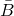
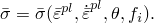
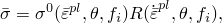
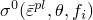
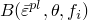
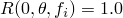
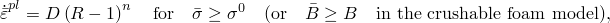
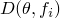

# 23.2.3 Rate-dependent yield


**Products: **Abaqus/Standard  Abaqus/Explicit  Abaqus/CAE  

##### **References**

- ["Classical metal plasticity," Section 23.2.1](pt05ch23s02abm17.md)
- ["Models for metals subjected to cyclic loading," Section 23.2.2](pt05ch23s02abm18.md)
- ["Johnson-Cook plasticity," Section 23.2.7](pt05ch23s02abm23.md)
- ["Extended Drucker-Prager models," Section 23.3.1](pt05ch23s03abm30.md)
- ["Crushable foam plasticity models," Section 23.3.5](pt05ch23s03abm34.md)
- ["Material library: overview," Section 21.1.1](pt05ch21s01abo18.md)
- ["Inelastic behavior," Section 23.1.1](pt05ch23s01abo20.md)
- [*RATE DEPENDENT](../key/key-link.md#usb-kws-mratedependent)
- ["Defining rate-dependent yield with yield stress ratios" in "Defining plasticity," Section 12.9.2 of the Abaqus/CAE User's Guide](../usi/usi-link.md#usi-prp-mechanical-plastic-plastic-rate)

### Overview

Rate-dependent yield:
- is needed to define a material's yield behavior accurately when the yield strength depends on the rate of straining and the anticipated strain rates are significant;
- is available only for the isotropic hardening metal plasticity models (Mises and Johnson-Cook), the isotropic component of the nonlinear isotropic/kinematic plasticity models, the extended Drucker-Prager plasticity model, and the crushable foam plasticity model;
- can be conveniently defined on the basis of work hardening parameters and field variables by providing tabular data for the isotropic hardening metal plasticity models, the isotropic component of the nonlinear isotropic/kinematic plasticity models, and the extended Drucker-Prager plasticity model;
- can be defined through specification of user-defined overstress power law parameters, yield stress ratios, or Johnson-Cook rate dependence parameters (this last option is not available for the crushable foam plasticity model and is the only option available for the Johnson-Cook plasticity model);
- cannot be used with any of the Abaqus/Standard creep models (metal creep, time-dependent volumetric swelling, Drucker-Prager creep, or cap creep) since creep behavior is already a rate-dependent mechanism; and
- in dynamic analysis should be specified such that the yield stress increases with increasing strain rate.

### Work hardening dependencies

Generally, a material's yield stress,  (or  for the crushable foam model), is dependent on work hardening, which for isotropic hardening models is usually represented by a suitable measure of equivalent plastic strain, ; the inelastic strain rate, ; temperature, ; and predefined field variables, : 



Many materials show an increase in their yield strength as strain rates increase; this effect becomes important in many metals and polymers when the strain rates range between 0.1 and 1 per second, and it can be very important for strain rates ranging between 10 and 100 per second, which are characteristic of high-energy dynamic events or manufacturing processes.

### Defining hardening dependencies for various material models

Strain rate dependence can be defined by entering hardening curves at different strain rates directly or by defining yield stress ratios to specify the rate dependence independently.

#### Direct entry of test data

Work hardening dependencies can be given quite generally as tabular data for the isotropic hardening Mises plasticity model, the isotropic component of the nonlinear isotropic/kinematic hardening model, and the extended Drucker-Prager plasticity model. The test data are entered as tables of yield stress values versus equivalent plastic strain at different equivalent plastic strain rates. The yield stress must be given as a function of the equivalent plastic strain and, if required, of temperature and of other predefined field variables. In defining this dependence at finite strains, “true” (Cauchy) stress and log strain values should be used. The hardening curve at each temperature must always start at zero plastic strain. For perfect plasticity only one yield stress, with zero plastic strain, should be defined at each temperature. It is possible to define the material to be strain softening as well as strain hardening. The work hardening data are repeated as often as needed to define stress-strain curves at different strain rates. The yield stress at a given strain and strain rate is interpolated directly from these tables.

| **Input File Usage: ** | Use one of the following options: |
| --- | --- |
|  | ``` [*PLASTIC](../key/key-link.md#usb-kws-mplastic), HARDENING=ISOTROPIC, RATE= [*CYCLIC HARDENING](../key/key-link.md#usb-kws-mcyclichardening), RATE= [*DRUCKER PRAGER HARDENING](../key/key-link.md#usb-kws-mdruckerhardening), RATE= ``` |

| **Abaqus/CAE Usage: ** | Use one of the following models: |
| --- | --- |
|  | Property module: material editor: ****Mechanical****Plasticity****Plastic****: **Hardening: Isotropic**, **Use strain-rate-dependent data******Mechanical****Plasticity****Drucker Prager****: ****Suboptions****Drucker Prager Hardening****: **Use strain-rate-dependent data** Cyclic hardening is not supported in Abaqus/CAE. |

#### Using yield stress ratios

Alternatively, and as the only means of defining rate-dependent yield stress for the Johnson-Cook and the crushable foam plasticity models, the strain rate behavior can be assumed to be separable, so that the stress-strain dependence is similar at all strain rate levels: 



where  (or  in the foam model) is the static stress-strain behavior and  is the ratio of the yield stress at nonzero strain rate to the static yield stress (so that ).

Three methods are offered to define *R* in Abaqus: specifying an overstress power law, defining *R* directly as a tabular function, or specifying an analytical Johnson-Cook form to define *R*.

##### Overstress power law

The Cowper-Symonds overstress power law has the form 



where  and  are material parameters that can be functions of temperature and, possibly, of other predefined field variables.

| **Input File Usage: ** | ``` [*RATE DEPENDENT](../key/key-link.md#usb-kws-mratedependent), TYPE=POWER LAW ``` |
| --- | --- |

| **Abaqus/CAE Usage: ** | Property module: material editor: ****Suboptions****Rate Dependent****: **Hardening: Power Law** *(available for valid plasticity models)* |
| --- | --- |

##### Tabular function

Alternatively, *R* can be entered directly as a tabular function of the equivalent plastic strain rate (or the axial plastic strain rate in a uniaxial compression test for the crushable foam model), ; temperature, ; and field variables, .

| **Input File Usage: ** | ``` [*RATE DEPENDENT](../key/key-link.md#usb-kws-mratedependent), TYPE=YIELD RATIO ``` |
| --- | --- |

| **Abaqus/CAE Usage: ** | Property module: material editor: ****Suboptions****Rate Dependent****: **Hardening: Yield Ratio** *(available for valid plasticity models)* |
| --- | --- |

##### Johnson-Cook rate dependence

Johnson-Cook rate dependence has the form 


where  and *C* are material constants that do not depend on temperature and are assumed not to depend on predefined field variables. Johnson-Cook rate dependence can be used in conjunction with the Johnson-Cook plasticity model, the isotropic hardening metal plasticity models, and the extended Drucker-Prager plasticity model (it cannot be used in conjunction with the crushable foam plasticity model). 

This is the only form of rate dependence available for the Johnson-Cook plasticity model. For more details, see ["Johnson-Cook plasticity," Section 23.2.7](pt05ch23s02abm23.md).

| **Input File Usage: ** | ``` [*RATE DEPENDENT](../key/key-link.md#usb-kws-mratedependent), TYPE=JOHNSON COOK ``` |
| --- | --- |

| **Abaqus/CAE Usage: ** | Property module: material editor: ****Suboptions****Rate Dependent****: **Hardening: Johnson-Cook** *(available for valid plasticity models)* |
| --- | --- |

### Elements

Rate-dependent yield can be used with all elements that include mechanical behavior (elements that have displacement degrees of freedom).


