# 23.2.6 Anisotropic yield/creep


**Products: **Abaqus/Standard  Abaqus/Explicit  Abaqus/CAE  

##### **References**

- ["Material library: overview," Section 21.1.1](pt05ch21s01abo18.md)
- ["Inelastic behavior," Section 23.1.1](pt05ch23s01abo20.md)
- ["Classical metal plasticity," Section 23.2.1](pt05ch23s02abm17.md)
- ["Models for metals subjected to cyclic loading," Section 23.2.2](pt05ch23s02abm18.md)
- ["Rate-dependent plasticity: creep and swelling," Section 23.2.4](pt05ch23s02abm20.md)
- [*POTENTIAL](../key/key-link.md#usb-kws-mpotential)
- ["Defining anisotropic yield and creep" in "Defining plasticity," Section 12.9.2 of the Abaqus/CAE User's Guide](../usi/usi-link.md#usi-prp-mechanical-plastic-plastic-potential)

### Overview

Anisotropic yield and/or creep:
- can be used for materials that exhibit different yield and/or creep behavior in different directions;
- is introduced through user-defined stress ratios that are applied in Hill's potential function;
- can be used only in conjunction with the metal plasticity and, in Abaqus/Standard, the metal creep material models;
- is available for the nonlinear isotropic/kinematic hardening model in Abaqus/Explicit (["Models for metals subjected to cyclic loading," Section 23.2.2](pt05ch23s02abm18.md)); and
- can be used in conjunction with the models of progressive damage and failure in Abaqus/Explicit (["Damage and failure for ductile metals: overview," Section 24.2.1](pt05ch24s02abm41.md)) to specify different damage initiation criteria and damage evolution laws that allow for the progressive degradation of the material stiffness and the removal of elements from the mesh.

### Yield and creep stress ratios

Anisotropic yield or creep behavior is modeled through the use of yield or creep stress ratios, . In the case of anisotropic yield the yield ratios are defined with respect to a reference yield stress,  (given for the metal plasticity definition), such that if  is applied as the only nonzero stress, the corresponding yield stress is . The plastic flow rule is defined below.

In the case of anisotropic creep the  are creep ratios used to scale the stress value when the creep strain rate is calculated. Thus, if  is the only nonzero stress, the equivalent stress, , used in the user-defined creep law is 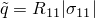.

Yield and creep stress ratios can be defined as constants or as tabular functions of temperature and predefined field variables. A local orientation must be used to define the direction of anisotropy (see ["Orientations," Section 2.2.5](pt01ch02s02aus15.md)).

| **Input File Usage: ** | Use the following option to define the yield or creep stress ratios: |
| --- | --- |
|  | ``` [*POTENTIAL](../key/key-link.md#usb-kws-mpotential) ``` This option must appear immediately after the [*PLASTIC](../key/key-link.md#usb-kws-mplastic) or the [*CREEP](../key/key-link.md#usb-kws-mcreep) material option data to which it applies. Thus, if anisotropic metal plasticity and anisotropic creep behavior are both required, the [*POTENTIAL](../key/key-link.md#usb-kws-mpotential) option must appear twice in the material definition, once after the metal plasticity data and again after the creep data. |

| **Abaqus/CAE Usage: ** | Use one of the following models: |
| --- | --- |
|  | Property module: material editor: ****Mechanical****Plasticity****Plastic****: ****Suboptions****Potential********Mechanical****Plasticity****Creep****: ****Suboptions****Potential**** |

### Anisotropic yield

Hill's potential function is a simple extension of the Mises function, which can be expressed in terms of rectangular Cartesian stress components as 

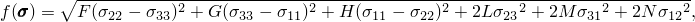

where 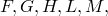 and *N* are constants obtained by tests of the material in different orientations. They are defined as 

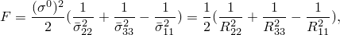

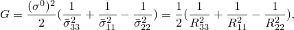

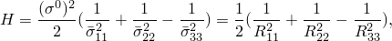

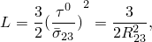

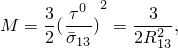

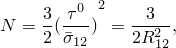

where each 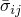 is the measured yield stress value when  is applied as the only nonzero stress component;  is the user-defined reference yield stress specified for the metal plasticity definition; , , , , , and  are anisotropic yield stress ratios; and 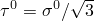. The six yield stress ratios are, therefore, defined as follows (in the order in which you must provide them): 


Because of the form of the yield function, all of these ratios must be positive. If the constants *F*, *G*, and *H* are positive, the yield function is always well-defined. However, if one or more of these constants is negative, the yield function may be undefined for some stress states because the quantity under the square root is negative.

The flow rule is 

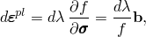

where, from the definition of *f* above, 

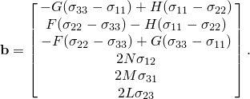

| **Input File Usage: ** | Use both of the following options: |
| --- | --- |
|  | ``` [*PLASTIC](../key/key-link.md#usb-kws-mplastic) [*POTENTIAL](../key/key-link.md#usb-kws-mpotential) ``` |

| **Abaqus/CAE Usage: ** | Property module: material editor: ****Mechanical****Plasticity****Plastic****: ****Suboptions****Potential**** |
| --- | --- |

### Anisotropic creep

For anisotropic creep in Abaqus/Standard Hill's function can be expressed as 

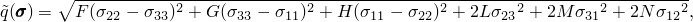

where 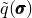 is the equivalent stress and *F*, *G*, *H*, *L*, *M*, and *N* are constants obtained by tests of the material in different orientations. The constants are defined with the same general relations as those used for anisotropic yield (above); however, the reference yield stress, , is replaced by the uniaxial equivalent deviatoric stress,  (found in the creep law), and , , , , , and  are referred to as “anisotropic creep stress ratios.” The six creep stress ratios are, therefore, defined as follows (in the order in which they must be provided): 

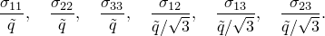

You must define the ratios  in each direction that will be used to scale the stress value when the creep strain rate is calculated. If all six  values are set to unity, isotropic creep is obtained.

| **Input File Usage: ** | Use both of the following options: |
| --- | --- |
|  | ``` [*CREEP](../key/key-link.md#usb-kws-mcreep) [*POTENTIAL](../key/key-link.md#usb-kws-mpotential) ``` |

| **Abaqus/CAE Usage: ** | Property module: material editor: ****Mechanical****Plasticity****Creep****: ****Suboptions****Potential**** |
| --- | --- |

### Defining anisotropic yield behavior on the basis of strain ratios (Lankford's *r*-values)

As discussed above, Hill's anisotropic plasticity potential is defined in Abaqus from user input consisting of ratios of yield stress in different directions with respect to a reference stress. However, in some cases, such as sheet metal forming applications, it is common to find the anisotropic material data given in terms of ratios of width strain to thickness strain. Mathematical relationships are then necessary to convert the strain ratios to stress ratios that can be input into Abaqus.

In sheet metal forming applications we are generally concerned with plane stress conditions. Consider 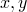 to be the “rolling” and “cross” directions in the plane of the sheet; *z* is the thickness direction. From a design viewpoint, the type of anisotropy usually desired is that in which the sheet is isotropic in the plane and has an increased strength in the thickness direction, which is normally referred to as transverse anisotropy. Another type of anisotropy is characterized by different strengths in different directions in the plane of the sheet, which is called planar anisotropy.

In a simple tension test performed in the *x*-direction in the plane of the sheet, the flow rule for this potential (given above) defines the incremental strain ratios (assuming small elastic strains) as 

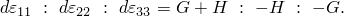

Therefore, the ratio of width to thickness strain, often referred to as Lankford's *r*-value, is 

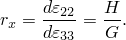

Similarly, for a simple tension test performed in the *y*-direction in the plane of the sheet, the incremental strain ratios are 

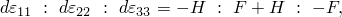

and 

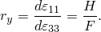

#### Transverse anisotropy

A transversely anisotropic material is one where 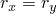. If we define  in the metal plasticity model to be equal to 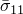, 

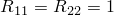

and, using the relationships above, 

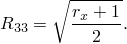

If 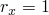 (isotropic material), 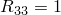 and the Mises isotropic plasticity model is recovered.

#### Planar anisotropy

In the case of planar anisotropy 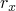 and 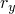 are different and 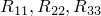 will all be different. If we define  in the metal plasticity model to be equal to , 

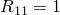

and, using the relationships above, we obtain 

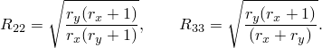

Again, if 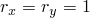, 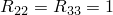 and the Mises isotropic plasticity model is recovered.

#### General anisotropy

Thus far, we have only considered loading applied along the axes of anisotropy. To derive a more general anisotropic model in plane stress, the sheet must be loaded in one other direction in its plane. Suppose we perform a simple tension test at an angle  to the *x*-direction; then, from equilibrium considerations we can write the nonzero stress components as 

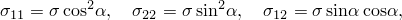

where  is the applied tensile stress. Substituting these values in the flow equations and assuming small elastic strains yields 

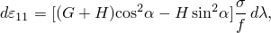

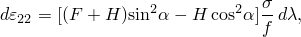

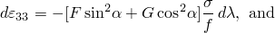

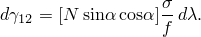

Assuming small geometrical changes, the width strain increment (the increment of strain at right angles to the direction of loading, ) is written as 

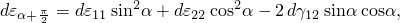

and Lankford's *r*-value for loading at an angle  is 

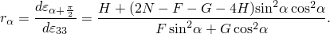

One of the more commonly performed tests is that in which the loading direction is at 45. In this case 

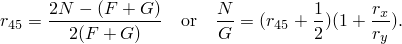

If  is equal to  in the metal plasticity model, 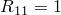. 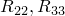 are as defined before for transverse or planar anisotropy and, using the relationships above, 

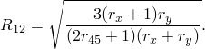

### Progressive damage and failure

In Abaqus/Explicit anisotropic yield can be used in conjunction with the models of progressive damage and failure discussed in ["Damage and failure for ductile metals: overview," Section 24.2.1](pt05ch24s02abm41.md). The capability allows for the specification of one or more damage initiation criteria, including ductile, shear, forming limit diagram (FLD), forming limit stress diagram (FLSD), and Mschenborn-Sonne forming limit diagram (MSFLD) criteria. After damage initiation, the material stiffness is degraded progressively according to the specified damage evolution response. The model offers two failure choices, including the removal of elements from the mesh as a result of tearing or ripping of the structure. The progressive damage models allow for a smooth degradation of the material stiffness, making them suitable for both quasi-static and dynamic situations.

| **Input File Usage: ** | Use the following options: |
| --- | --- |
|  | ``` [*PLASTIC](../key/key-link.md#usb-kws-mplastic) [*DAMAGE INITIATION](../key/key-link.md#usb-kws-mdamageinitiation) [*DAMAGE EVOLUTION](../key/key-link.md#usb-kws-mdamageevolution) ``` |

| **Abaqus/CAE Usage: ** | Property module: material editor: ****Mechanical****Damage for Ductile Metals*****damage initiation type*****: specify the damage initiation criterion: ****Suboptions****Damage Evolution****: specify the damage evolution parameters |
| --- | --- |

### Initial conditions

When we need to study the behavior of a material that has already been subjected to some work hardening, Abaqus allows you to prescribe initial conditions for the equivalent plastic strain, , by specifying the conditions directly (["Initial conditions in Abaqus/Standard and Abaqus/Explicit," Section 34.2.1](pt07ch34s02aus116.md)).

| **Input File Usage: ** | ``` [*INITIAL CONDITIONS](../key/key-link.md#usb-kws-minitialcond), TYPE=HARDENING ``` |
| --- | --- |

| **Abaqus/CAE Usage: ** | Load module: **Create Predefined Field**: **Step: Initial**, choose **Mechanical** for the **Category** and **Hardening** for the **Types for Selected Step** |
| --- | --- |

#### User subroutine specification in Abaqus/Standard

For more complicated cases, initial conditions can be defined in Abaqus/Standard through user subroutine [`HARDINI`](../sub/sub-link.md#sub-xsl-hardini).

| **Input File Usage: ** | ``` [*INITIAL CONDITIONS](../key/key-link.md#usb-kws-minitialcond), TYPE=HARDENING, USER ``` |
| --- | --- |

| **Abaqus/CAE Usage: ** | Load module: **Create Predefined Field**: **Step: Initial**, choose **Mechanical** for the **Category** and **Hardening** for the **Types for Selected Step**; **Definition: User-defined** |
| --- | --- |

### Elements

Anisotropic yield can be defined for any element that can be used with the classical metal plasticity models in Abaqus (["Classical metal plasticity," Section 23.2.1](pt05ch23s02abm17.md)) except one-dimensional elements in Abaqus/Explicit (beams and trusses). In Abaqus/Standard it can also be defined for any element that can be used with the linear kinematic hardening plasticity model (["Models for metals subjected to cyclic loading," Section 23.2.2](pt05ch23s02abm18.md)) but not with the nonlinear isotropic/kinematic hardening model. Likewise, anisotropic creep can be defined for any element that can be used with the classical metal creep model in Abaqus/Standard (["Rate-dependent plasticity: creep and swelling," Section 23.2.4](pt05ch23s02abm20.md)).

### Output

The standard output identifiers available in Abaqus (["Abaqus/Standard output variable identifiers," Section 4.2.1](pt02ch04s02abv01.md), and ["Abaqus/Explicit output variable identifiers," Section 4.2.2](pt02ch04s02xbv01.md)) and all output variables associated with the creep model (["Rate-dependent plasticity: creep and swelling," Section 23.2.4](pt05ch23s02abm20.md)), classical metal plasticity models (["Classical metal plasticity," Section 23.2.1](pt05ch23s02abm17.md)), and the linear kinematic hardening plasticity model (["Models for metals subjected to cyclic loading," Section 23.2.2](pt05ch23s02abm18.md)) are available when anisotropic yield and creep are defined.

The following variables have special meaning if anisotropic yield and creep are defined:

| PEEQ | Equivalent plastic strain, 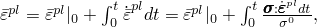 where  is the initial equivalent plastic strain (zero or user-specified; see ["Initial conditions](pt05ch23s02abm22.md#usb-mat-canisoyield-initialcond)"). |
| --- | --- |

| CEEQ | Equivalent creep strain, 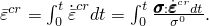 |
| --- | --- |

| YIELDS | Yield stress, . |
| --- | --- |


