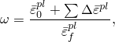
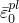
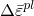
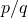
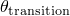
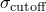
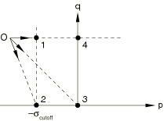
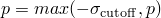
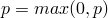

# 23.2.8 Dynamic failure models


**Product: **Abaqus/Explicit  

##### **References**

- ["Equation of state," Section 25.2.1](pt05ch25s02abm50.md)
- ["Classical metal plasticity," Section 23.2.1](pt05ch23s02abm17.md)
- ["Rate-dependent yield," Section 23.2.3](pt05ch23s02abm19.md)
- ["Johnson-Cook plasticity," Section 23.2.7](pt05ch23s02abm23.md)
- ["Material library: overview," Section 21.1.1](pt05ch21s01abo18.md)
- ["Inelastic behavior," Section 23.1.1](pt05ch23s01abo20.md)
- [*SHEAR FAILURE](../key/key-link.md#usb-kws-mshearfailure)
- [*TENSILE FAILURE](../key/key-link.md#usb-kws-mtensilefailure)

### Overview

The progressive damage and failure models described in ["Damage and failure for ductile metals: overview," Section 24.2.1](pt05ch24s02abm41.md), are the recommended method for modeling material damage and failure in Abaqus; these models are suitable for both quasi-static and dynamic situations. Abaqus/Explicit offers two additional element failure models suitable only for high-strain-rate dynamic problems. The shear failure model is driven by plastic yielding. The tensile failure model is driven by tensile loading. These failure models can be used to limit subsequent load-carrying capacity of an element (up to the point of removing the element) once a stress limit is reached. Both models can be used for the same material.

The shear failure model:
- is designed for high-strain-rate deformation of many materials, including most metals;
- uses the equivalent plastic strain as a failure measure;
- offers two choices for what occurs upon failure, including the removal of elements from the mesh;
- can be used in conjunction with either the Mises or the Johnson-Cook plasticity models; and
- can be used in conjunction with the tensile failure model.

The tensile failure model:- is designed for high-strain-rate deformation of many materials, including most metals;
- uses the hydrostatic pressure stress as a failure measure to model dynamic spall or a pressure cutoff;
- offers a number of choices for what occurs upon failure, including the removal of elements from the mesh;
- can be used in conjunction with either the Mises or the Johnson-Cook plasticity models or the equation of state material model; and
- can be used in conjunction with the shear failure model.

### Shear failure model

The shear failure model can be used in conjunction with the Mises or the Johnson-Cook plasticity models in Abaqus/Explicit to define shear failure of the material.

#### Shear failure criterion

The shear failure model is based on the value of the equivalent plastic strain at element integration points; failure is assumed to occur when the damage parameter exceeds 1. The damage parameter, , is defined as 



where  is any initial value of the equivalent plastic strain,  is an increment of the equivalent plastic strain,  is the strain at failure, and the summation is performed over all increments in the analysis.

The strain at failure, , is assumed to depend on the plastic strain rate, ; a dimensionless pressure-deviatoric stress ratio,  (where *p* is the pressure stress and *q* is the Mises stress); temperature; and predefined field variables. There are two ways to define the strain at failure, . One is to use direct tabular data, where the dependencies are given in a tabular form. Alternatively, the analytical form proposed by Johnson and Cook can be invoked (see ["Johnson-Cook plasticity," Section 23.2.7](pt05ch23s02abm23.md), for more details).

When direct tabular data are used to define the shear failure model, the strain at failure, , must be given as a tabular function of the equivalent plastic strain rate, the pressure-deviatoric stress ratio, temperature, and predefined field variables. This method requires the use of the Mises plasticity model.

For the Johnson-Cook shear failure model, you must specify the failure parameters, – (see ["Johnson-Cook plasticity," Section 23.2.7](pt05ch23s02abm23.md), for more details on these parameters). The shear failure data must be calibrated at or below the transition temperature, , defined in ["Johnson-Cook plasticity," Section 23.2.7](pt05ch23s02abm23.md). This method requires the use of the Johnson-Cook plasticity model.

| **Input File Usage: ** | Use both of the following options for the Mises plasticity model: |
| --- | --- |
|  | ``` [*PLASTIC](../key/key-link.md#usb-kws-mplastic), HARDENING=ISOTROPIC [*SHEAR FAILURE](../key/key-link.md#usb-kws-mshearfailure), TYPE=TABULAR ``` Use both of the following options for the Johnson-Cook plasticity model: ``` [*PLASTIC](../key/key-link.md#usb-kws-mplastic), HARDENING=JOHNSON COOK [*SHEAR FAILURE](../key/key-link.md#usb-kws-mshearfailure), TYPE=JOHNSON COOK ``` |

#### Element removal

When the shear failure criterion is met at an integration point, all the stress components will be set to zero and that material point fails. By default, if all of the material points at any one section of an element fail, the element is removed from the mesh; it is not necessary for all material points in the element to fail. For example, in a first-order reduced-integration solid element removal of the element takes place as soon as its only integration point fails. However, in a shell element all through-the-thickness integration points must fail before the element is removed from the mesh. In the case of second-order reduced-integration beam elements, failure of all integration points through the section at either of the two element integration locations along the beam axis leads, by default, to element removal. Similarly, in the modified triangular and tetrahedral solid elements failure at any one integration point leads, by default, to element removal. Element deletion is the default failure choice.

An alternative failure choice, where the element is not deleted, is to specify that when the shear failure criterion is met at a material point, the deviatoric stress components will be set to zero for that point and will remain zero for the rest of the calculation. The pressure stress is then required to remain compressive; that is, if a negative pressure stress is computed in a failed material point in an increment, it is reset to zero. This failure choice is not allowed when using plane stress, shell, membrane, beam, pipe, and truss elements because the structural constraints may be violated.

| **Input File Usage: ** | Use the following option to allow element deletion when the failure criterion is met (the default): |
| --- | --- |
|  | ``` [*SHEAR FAILURE](../key/key-link.md#usb-kws-mshearfailure), ELEMENT DELETION=YES ``` Use the following option to allow the element to take hydrostatic compressive stress only when the failure criterion is met: ``` [*SHEAR FAILURE](../key/key-link.md#usb-kws-mshearfailure), ELEMENT DELETION=NO ``` |

#### Determining when to use the shear failure model

The shear failure model in Abaqus/Explicit is suitable for high-strain-rate dynamic problems where inertia is important. Improper use of the shear failure model may result in an incorrect simulation.

For quasi-static problems that may require element removal, the progressive damage and failure models ([Chapter 24, "Progressive Damage and Failure](pt05ch24.md)”) or the Gurson porous metal plasticity model (["Porous metal plasticity," Section 23.2.9](pt05ch23s02abm25.md)) are recommended.

### Tensile failure model

The tensile failure model can be used in conjunction with either the Mises or the Johnson-Cook plasticity models or the equation of state material model in Abaqus/Explicit to define tensile failure of the material.

#### Tensile failure criterion

The Abaqus/Explicit tensile failure model uses the hydrostatic pressure stress as a failure measure to model dynamic spall or a pressure cutoff. The tensile failure criterion assumes that failure occurs when the pressure stress, *p*, becomes more tensile than the user-specified hydrostatic cutoff stress, . The hydrostatic cutoff stress may be a function of temperature and predefined field variables. There is no default value for this stress.

The tensile failure model can be used with either the Mises or the Johnson-Cook plasticity models or the equation of state material model.

| **Input File Usage: ** | Use both of the following options for the Mises or Johnson-Cook plasticity models: |
| --- | --- |
|  | ``` [*PLASTIC](../key/key-link.md#usb-kws-mplastic) [*TENSILE FAILURE](../key/key-link.md#usb-kws-mtensilefailure) ``` Use both of the following options for the equation of state material model: ``` [*EOS](../key/key-link.md#usb-kws-meos) [*TENSILE FAILURE](../key/key-link.md#usb-kws-mtensilefailure) ``` |

#### Failure choices

When the tensile failure criterion is met at an element integration point, the material point fails. Five failure choices are offered for the failed material points: the default choice, which includes element removal, and four different spall models. These failure choices are described below.

##### Element removal

When the tensile failure criterion is met at an integration point, all the stress components will be set to zero and that material point fails. By default, if all of the material points at any one section of an element fail, the element is removed from the mesh; it is not necessary for all material points in the element to fail. For example, in a first-order reduced-integration solid element removal of the element takes place as soon as its only integration point fails. However, in a shell element all through-the-thickness integration points must fail before the element is removed from the mesh. In the case of second-order reduced-integration beam elements, failure of all integration points through the section at either of the two element integration locations along the beam axis leads, by default, to element removal. Similarly, in the modified triangular and tetrahedral solid elements failure at any one integration point leads, by default, to element removal.

| **Input File Usage: ** | ``` [*TENSILE FAILURE](../key/key-link.md#usb-kws-mtensilefailure), ELEMENT DELETION=YES (default) ``` |
| --- | --- |

##### Spall models

An alternative failure choice that is based on spall (the crumbling of a material), rather than element removal, is also available. Four failure combinations are available in this category. When the tensile failure criterion is met at a material point, the deviatoric stress components may be unaffected or may be required to be zero, and the pressure stress may be limited by the hydrostatic cutoff stress or may be required to be compressive. Therefore, there are four possible failure combinations (see [Figure 23.2.8--1](pt05ch23s02abm24.md#ctensilefail-model), where “O” is the stress that would exist if the tensile failure model were not used). 

**Figure 23.2.8–1** Tensile failure choices.



These failure combinations are as follows:- Ductile shear and ductile pressure: this choice corresponds to point 1 in [Figure 23.2.8--1](pt05ch23s02abm24.md#ctensilefail-model) and models the case in which the deviatoric stress components are unaffected and the pressure stress is limited by the hydrostatic cutoff stress; i.e., . | **Input File Usage: ** | ``` [*TENSILE FAILURE](../key/key-link.md#usb-kws-mtensilefailure), ELEMENT DELETION=NO, SHEAR=DUCTILE, PRESSURE=DUCTILE ``` | | --- | --- |
- Brittle shear and ductile pressure: this choice corresponds to point 2 in [Figure 23.2.8--1](pt05ch23s02abm24.md#ctensilefail-model) and models the case in which the deviatoric stress components are set to zero and remain zero for the rest of the calculation, and the pressure stress is limited by the hydrostatic cutoff stress; i.e., . | **Input File Usage: ** | ``` [*TENSILE FAILURE](../key/key-link.md#usb-kws-mtensilefailure), ELEMENT DELETION=NO, SHEAR=BRITTLE, PRESSURE=DUCTILE ``` | | --- | --- |
- Brittle shear and brittle pressure: this choice corresponds to point 3 in [Figure 23.2.8--1](pt05ch23s02abm24.md#ctensilefail-model) and models the case in which the deviatoric stress components are set to zero and remain zero for the rest of the calculation, and the pressure stress is required to be compressive; i.e., . | **Input File Usage: ** | ``` [*TENSILE FAILURE](../key/key-link.md#usb-kws-mtensilefailure), ELEMENT DELETION=NO, SHEAR=BRITTLE, PRESSURE=BRITTLE ``` | | --- | --- |
- Ductile shear and brittle pressure: this choice corresponds to point 4 in [Figure 23.2.8--1](pt05ch23s02abm24.md#ctensilefail-model) and models the case in which the deviatoric stress components are unaffected and the pressure stress is required to be compressive; i.e., . | **Input File Usage: ** | ``` [*TENSILE FAILURE](../key/key-link.md#usb-kws-mtensilefailure), ELEMENT DELETION=NO, SHEAR=DUCTILE, PRESSURE=BRITTLE ``` | | --- | --- |

There is no default failure combination for the spall models. If you choose not to use the element deletion model, you must specify the failure combination explicitly. If the material's deviatoric behavior is not defined (for example, the equation of state model without deviatoric behavior is used), the deviatoric part of the combination is meaningless and will be ignored. The spall models are not allowed when using plane stress, shell, membrane, beam, pipe, and truss elements.

#### Determining when to use the tensile failure model

The tensile failure model in Abaqus/Explicit is suitable for high-strain-rate dynamic problems in which inertia effects are important. Improper use of the tensile failure model may result in an incorrect simulation.

### Using the failure models with rebar

It is possible to use the shear failure and/or the tensile failure models in elements for which rebars are also defined. When such elements fail according to the failure criterion, the base material contribution to the element stress-carrying capacity is removed or adjusted depending on the type of failure chosen, but the rebar contribution to the element stress-carrying capacity is not removed. However, if you also include failure in the rebar material definition, the rebar contribution to the element stress-carrying capacity will also be removed or adjusted if the failure criterion specified for the rebar is met.

### Elements

The shear and tensile failure models with element deletion can be used with any elements in Abaqus/Explicit that include mechanical behavior (elements that have displacement degrees of freedom). The shear and tensile failure models without element deletion can be used only with plane strain, axisymmetric, and three-dimensional solid (continuum) elements in Abaqus/Explicit.

### Output

In addition to the standard output identifiers available in Abaqus/Explicit (["Abaqus/Explicit output variable identifiers," Section 4.2.2](pt02ch04s02xbv01.md)), the following variable has special meaning for the shear and tensile failure models:

| STATUS | Status of element (the status of an element is 1.0 if the element is active, 0.0 if the element is not). |
| --- | --- |


