# 23.2.9 Porous metal plasticity


**Products: **Abaqus/Standard  Abaqus/Explicit  Abaqus/CAE  

##### **References**

- ["Material library: overview," Section 21.1.1](pt05ch21s01abo18.md)
- ["Inelastic behavior," Section 23.1.1](pt05ch23s01abo20.md)
- [*POROUS METAL PLASTICITY](../key/key-link.md#usb-kws-mpormetalplas)
- [*POROUS FAILURE CRITERIA](../key/key-link.md#usb-kws-mporfailcriteria)
- [*VOID NUCLEATION](../key/key-link.md#usb-kws-mvoidnucleation)
- ["Defining porous metal plasticity" in "Defining plasticity," Section 12.9.2 of the Abaqus/CAE User's Guide](../usi/usi-link.md#usi-prp-mechanical-plastic-porousmetal)

### Overview

The porous metal plasticity model:
- is used to model materials with a dilute concentration of voids in which the relative density is greater than 0.9;
- is based on Gurson's porous metal plasticity theory (Gurson, 1977) with void nucleation and, in Abaqus/Explicit, a failure definition; and
- defines the inelastic flow of the porous metal on the basis of a potential function that characterizes the porosity in terms of a single state variable, the relative density.

### Elastic and plastic behavior

You specify the elastic part of the response separately; only linear isotropic elasticity can be specified (see ["Linear elastic behavior," Section 22.2.1](pt05ch22s02abm02.md)). The porous metal plasticity model cannot be used in conjunction with porous elasticity (["Elastic behavior of porous materials," Section 22.3.1](pt05ch22s03abm05.md)).

You specify the hardening behavior of the fully dense matrix material by defining a metal plasticity model (see ["Classical metal plasticity," Section 23.2.1](pt05ch23s02abm17.md)). Only isotropic hardening can be specified. The hardening curve must describe the yield stress of the matrix material as a function of plastic strain in the matrix material. In defining this dependence at finite strains, “true” (Cauchy) stress and log strain values should be given. Rate dependency effects for the matrix material can be modeled (see ["Rate-dependent yield," Section 23.2.3](pt05ch23s02abm19.md)).

### Yield condition

The relative density of a material, *r*, is defined as the ratio of the volume of solid material to the total volume of the material. The relationships defining the model are expressed in terms of the void volume fraction, *f*, which is defined as the ratio of the volume of voids to the total volume of the material. It follows that 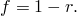 For a metal containing a dilute concentration of voids, Gurson (1977) proposed a yield condition as a function of the void volume fraction. This yield condition was later modified by Tvergaard (1981) to the form 

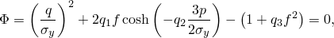

where 

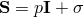

is the deviatoric part of the Cauchy stress tensor ;

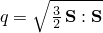

is the effective Mises stress;

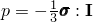

is the hydrostatic pressure;


is the yield stress of the fully dense matrix material as a function of 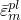, the equivalent plastic strain in the matrix; and

, , 

are material parameters.

The Cauchy stress is defined as the force per “current unit area,” comprised of voids and the solid (matrix) material. 

*f* = 0 (*r* = 1) implies that the material is fully dense, and the Gurson yield condition reduces to the Mises yield condition. *f* = 1 (*r* = 0) implies that the material is completely voided and has no stress carrying capacity. The model generally gives physically reasonable results only for 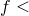0.1 (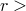0.9).

The model is described in detail in ["Porous metal plasticity," Section 4.3.6 of the Abaqus Theory Guide](../stm/stm-link.md#stm-mat-pormetalplast), along with a discussion of its numerical implementation.

If the porous metal plasticity model is used during a pore pressure analysis (see ["Coupled pore fluid diffusion and stress analysis," Section 6.8.1](pt03ch06s08at26.md)), the relative density, *r*, is tracked independently of the void ratio.

#### Specifying *q1*, *q2*, and *q3*

You specify the parameters , , and  directly for the porous metal plasticity model. For typical metals the ranges of the parameters reported in the literature are  = 1.0 to 1.5,  = 1.0, and  =  = 1.0 to 2.25 (see ["Necking of a round tensile bar," Section 1.1.9 of the Abaqus Benchmarks Guide](../bmk/bmk-link.md#bmk-anl-neckingtensilebar)). The original Gurson model is recovered when  =  =  = 1.0. You can define these parameters as tabular functions of temperature and/or field variables.

| **Input File Usage: ** | ``` [*POROUS METAL PLASTICITY](../key/key-link.md#usb-kws-mpormetalplas) ``` |
| --- | --- |

| **Abaqus/CAE Usage: ** | Property module: material editor: ****Mechanical****Plasticity****Porous Metal Plasticity**** |
| --- | --- |

#### Failure criteria in Abaqus/Explicit

The porous metal plasticity model in Abaqus/Explicit allows for failure. In this case the yield condition is written as 

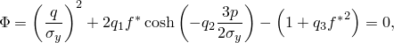

where the function 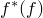 models the rapid loss of stress carrying capacity that accompanies void coalescence. This function is defined in terms of the void volume fraction: 

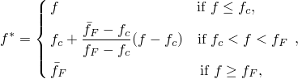

where 

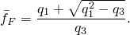

In the above relationship  is a critical value of the void volume fraction, and 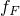 is the value of void volume fraction at which there is a complete loss of stress carrying capacity in the material. The user-specified parameters  and  model the material failure when 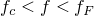, due to mechanisms such as micro fracture and void coalescence. When 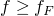, total failure at the material point occurs. In Abaqus/Explicit an element is removed once all of its material points have failed.

| **Input File Usage: ** | Use the following option in conjunction with the [*POROUS METAL PLASTICITY](../key/key-link.md#usb-kws-mpormetalplas) option: |
| --- | --- |
|  | ``` [*POROUS FAILURE CRITERIA](../key/key-link.md#usb-kws-mporfailcriteria) ``` |

| **Abaqus/CAE Usage: ** | Property module: material editor: ****Mechanical****Plasticity****Porous Metal Plasticity****: ****Suboptions****Porous Failure Criteria**** |
| --- | --- |

#### Specifying the initial relative density

You can specify the initial relative density of the porous material, , at material points or at nodes. If you do not specify the initial relative density, Abaqus will assign it a value of 1.0.

##### At material points

You can specify the initial relative density as part of the porous metal plasticity material definition.

| **Input File Usage: ** | ``` [*POROUS METAL PLASTICITY](../key/key-link.md#usb-kws-mpormetalplas), RELATIVE DENSITY= ``` |
| --- | --- |

| **Abaqus/CAE Usage: ** | Property module: material editor: ****Mechanical****Plasticity****Porous Metal Plasticity****: **Relative density:**  |
| --- | --- |

##### At nodes

Alternatively, you can specify the initial relative density at nodes as initial conditions (["Initial conditions in Abaqus/Standard and Abaqus/Explicit," Section 34.2.1](pt07ch34s02aus116.md)); these values are interpolated to the material points. The initial conditions are applied only if the relative density is not specified as part of the porous metal plasticity material definition. When a discontinuity of the initial relative density field occurs at the element boundaries, separate nodes must be used to define the elements at these boundaries, with multi-point constraints applied to make the nodal displacements and rotations equivalent.

| **Input File Usage: ** | ``` [*INITIAL CONDITIONS](../key/key-link.md#usb-kws-minitialcond), TYPE=RELATIVE DENSITY ``` |
| --- | --- |

| **Abaqus/CAE Usage: ** | Initial relative density is not supported in Abaqus/CAE. |
| --- | --- |

### Flow rule and hardening

The presence of pressure in the yield condition results in nondeviatoric plastic strains. Plastic flow is assumed to be normal to the yield surface: 

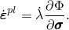

The hardening of the fully dense matrix material is described through 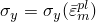. The evolution of the equivalent plastic strain in the matrix material is obtained from the following equivalent plastic work expression: 

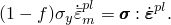

The model is illustrated in [Figure 23.2.9--1](pt05ch23s02abm25.md#cpormetplas-yield-surf), where the yield surfaces for different levels of void volume fraction are shown in the *p*–*q* plane.

**Figure 23.2.9–1** Schematic of the yield surface in the *p*–*q* plane.


[Figure 23.2.9--2](pt05ch23s02abm25.md#cpormetplas-uni-behav) compares the behavior of a porous material (whose initial yield stress is 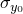) in tension and compression against the behavior of the perfectly plastic matrix material. In compression the porous material “hardens” due to closing of the voids, and in tension it “softens” due to growth and nucleation of the voids.

**Figure 23.2.9–2** Schematic of uniaxial behavior of a porous metal (perfectly plastic matrix material with initial volume fraction of voids = ).


### Void growth and nucleation

The total change in void volume fraction is given as 

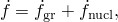

where 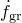 is change due to growth of existing voids and 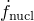 is change due to nucleation of new voids. Growth of the existing voids is based on the law of conservation of mass and is expressed in terms of the void volume fraction: 


The nucleation of voids is given by a strain-controlled relationship: 

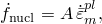

where 


The normal distribution of the nucleation strain has a mean value  and standard deviation .  is the volume fraction of the nucleated voids, and voids are nucleated only in tension.

The nucleation function  is assumed to have a normal distribution, as shown in [Figure 23.2.9--3](pt05ch23s02abm25.md#cpormetplas-nucleation) for different values of the standard deviation . 

**Figure 23.2.9–3** Nucleation function .


[Figure 23.2.9--4](pt05ch23s02abm25.md#cpormetplas-soft) shows the extent of softening in a uniaxial tension test of a porous material for different values of .

**Figure 23.2.9–4** Softening (in uniaxial tension) as a function of .


The following ranges of values are reported in the literature for typical metals:  = 0.1 to 0.3,  0.05 to 0.1, and  = 0.04 (see ["Necking of a round tensile bar," Section 1.1.9 of the Abaqus Benchmarks Guide](../bmk/bmk-link.md#bmk-anl-neckingtensilebar)). You specify these parameters, which can be defined as tabular functions of temperature and predefined field variables. Abaqus will include void nucleation in a tensile field only when you include it in the material definition.

In Abaqus/Standard the accuracy of the implicit integration of the void nucleation and growth equation is controlled by prescribing the maximum allowable time increment in the automatic time incrementation scheme.

| **Input File Usage: ** | ``` [*VOID NUCLEATION](../key/key-link.md#usb-kws-mvoidnucleation) ``` |
| --- | --- |

| **Abaqus/CAE Usage: ** | Property module: material editor: ****Mechanical****Plasticity****Porous Metal Plasticity****: ****Suboptions****Void Nucleation**** |
| --- | --- |

### Initial conditions

When we need to study the behavior of a material that has already been subjected to some work hardening, Abaqus allows you to prescribe initial conditions directly for the equivalent plastic strain,  (["Initial conditions in Abaqus/Standard and Abaqus/Explicit," Section 34.2.1](pt07ch34s02aus116.md)).

| **Input File Usage: ** | ``` [*INITIAL CONDITIONS](../key/key-link.md#usb-kws-minitialcond), TYPE=HARDENING ``` |
| --- | --- |

| **Abaqus/CAE Usage: ** | Load module: **Create Predefined Field**: **Step: Initial**, choose **Mechanical** for the **Category** and **Hardening** for the **Types for Selected Step** |
| --- | --- |

#### Defining initial hardening conditions in a user subroutine

For more complicated cases, initial conditions can be defined in Abaqus/Standard through user subroutine [`HARDINI`](../sub/sub-link.md#sub-xsl-hardini).

| **Input File Usage: ** | ``` [*INITIAL CONDITIONS](../key/key-link.md#usb-kws-minitialcond), TYPE=HARDENING, USER ``` |
| --- | --- |

| **Abaqus/CAE Usage: ** | Load module: **Create Predefined Field**: **Step: Initial**, choose **Mechanical** for the **Category** and **Hardening** for the **Types for Selected Step**; **Definition: User-defined** |
| --- | --- |

### Elements

The porous metal plasticity model can be used with any stress/displacement elements other than one-dimensional elements (beam, pipe, and truss elements) or elements for which the assumed stress state is plane stress (plane stress, shell, and membrane elements).

### Output

In addition to the standard output identifiers available in Abaqus (["Abaqus/Standard output variable identifiers," Section 4.2.1](pt02ch04s02abv01.md), and ["Abaqus/Explicit output variable identifiers," Section 4.2.2](pt02ch04s02xbv01.md)), the following variables have special meaning in the porous metal plasticity model:

| PEEQ | Equivalent plastic strain, 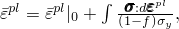 where  is the initial equivalent plastic strain (zero or user-specified; see ["Initial conditions](pt05ch23s02abm25.md#usb-mat-cpormetalplas-initialcond)"). |
| --- | --- |

| VVF | Void volume fraction. |
| --- | --- |

| VVFG | Void volume fraction due to void growth. |
| --- | --- |

| VVFN | Void volume fraction due to void nucleation. |
| --- | --- |

#### Additional references

- Gurson, A. L., "Continuum Theory of Ductile Rupture by Void Nucleation and Growth: Part I---Yield Criteria and Flow Rules for Porous Ductile Materials," Journal of Engineering Materials and Technology, vol. 99, pp. 2--15, 1977.
- Tvergaard, V., "Influence of Voids on Shear Band Instabilities under Plane Strain Condition," International Journal of Fracture Mechanics, vol. 17, pp. 389--407, 1981.


