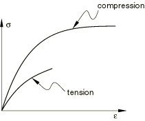
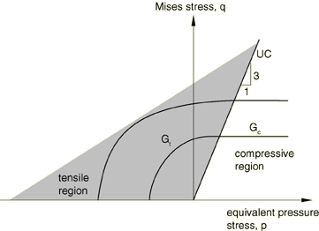
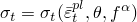
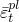
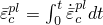
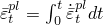

# 23.2.10 Cast iron plasticity


**Products: **Abaqus/Standard  Abaqus/Explicit  Abaqus/CAE  

##### **References**

- ["Material library: overview," Section 21.1.1](pt05ch21s01abo18.md)
- ["Combining material behaviors," Section 21.1.3](pt05ch21s01aus110.md)
- ["Inelastic behavior," Section 23.1.1](pt05ch23s01abo20.md)
- [*CAST IRON COMPRESSION HARDENING](../key/key-link.md#usb-kws-mcastironcomhardening)
- [*CAST IRON PLASTICITY](../key/key-link.md#usb-kws-mcastironplastic)
- [*CAST IRON TENSION HARDENING](../key/key-link.md#usb-kws-mcastirontenhardening)
- ["Defining cast iron plasticity" in "Defining plasticity," Section 12.9.2 of the Abaqus/CAE User's Guide](../usi/usi-link.md#usi-prp-mechanical-plastic-castiron)

### Overview

The cast iron plasticity model:
- is intended for the constitutive modeling of gray cast iron;
- provides elastic-plastic behavior with different yield strengths, flow, and hardening in tension and compression;
- is based on a yield function that depends on the maximum principal stress under tensile loading conditions and pressure-independent (von Mises type) behavior under compressive loading conditions;
- allows for simultaneous inelastic dilatation and inelastic shearing under tensile loading conditions;
- allows only inelastic shearing under compressive loading conditions;
- is intended for the simulation of material response only under essentially monotonic loading conditions; and
- cannot be used to model rate dependence.

### Elastic and plastic behavior

The cast iron plasticity model describes the mechanical behavior of gray cast iron, a material with a microstructure consisting of a distribution of graphite flakes in a steel matrix. In tension the graphite flakes act as stress concentrators, resulting in yielding as a function of the maximum principal stress, followed by brittle behavior. In compression the graphite flakes do not have an appreciable effect on the macroscopic response, resulting in a ductile behavior similar to that of many steels. 

You specify the elastic part of the response separately; only linear isotropic elasticity can be used (see ["Linear elastic behavior," Section 22.2.1](pt05ch22s02abm02.md)). The elastic stiffness is assumed to be the same under tension and compression.

The cast iron plasticity model is used to provide the value of the plastic “Poisson's ratio,” which is the absolute value of the ratio of the transverse to the longitudinal plastic strain under uniaxial tension. The plastic Poisson's ratio can vary with the plastic deformation. However, the model in Abaqus assumes that it is constant with respect to plastic deformation. It can depend on temperature and field variables. If no value is specified for the plastic Poisson's ratio, a default value of 0.04 is assumed. This default value is based on experimental results for permanent volumetric strain under uniaxial tension (see ["Cast iron plasticity," Section 4.3.7 of the Abaqus Theory Guide](../stm/stm-link.md#stm-mat-castironplasticity), for details).

Independent hardening (see [Figure 23.2.10--1](pt05ch23s02abm26.md#ccastiron-stress-strain)) of the material under tension and compression can be specified as described below. The tension hardening data provide the uniaxial tension yield stress as a function of plastic strain, temperature, and field variables under uniaxial tension. The compression hardening data provide the uniaxial compression yield stress as a function of plastic strain, temperature, and field variables under uniaxial compression.

**Figure 23.2.10–1** Typical stress-strain response of gray cast iron under uniaxial tension and uniaxial compression.



| **Input File Usage: ** | ``` [*CAST IRON PLASTICITY](../key/key-link.md#usb-kws-mcastironplastic) ``` |
| --- | --- |

| **Abaqus/CAE Usage: ** | Property module: material editor: ****Mechanical****Plasticity****Cast Iron Plasticity**** |
| --- | --- |

### Yield condition

Abaqus makes use of a composite yield surface to describe the different behavior in tension and compression. In tension yielding is assumed to be governed by the maximum principal stress, while in compression yielding is assumed to be pressure independent and governed by the deviatoric stresses alone (Mises yield condition).

The model is described in detail in ["Cast iron plasticity," Section 4.3.7 of the Abaqus Theory Guide](../stm/stm-link.md#stm-mat-castironplasticity).

### Flow rule

For the purposes of discussing the flow and hardening behavior, it is useful to divide the meridional plane into the two regions shown in [Figure 23.2.10--2](pt05ch23s02abm26.md#ccastiron-potential). 

**Figure 23.2.10–2** Schematic of the flow potentials in the *p*–*q* plane.



The region to the left of the uniaxial compression line (labeled UC) is referred to as the “tensile region,” while the region to the right of the uniaxial compression line is referred to as the “compressive region.” The flow potential consists of the Mises cylinder in the compressive region and an ellipsoidal “cap” in the tensile region. The transition between the two surfaces is smooth. The projection of the flow potential on the meridional plane (see [Figure 23.2.10--2](pt05ch23s02abm26.md#ccastiron-potential)) consists of a straight line in the compressive region and an ellipse in the tensile region. The corresponding projection on the deviatoric plane is a circle. A consequence of the above choice is that plastic flow results in inelastic volume expansion in the tensile region and no inelastic volume change in the compressive region (see ["Cast iron plasticity," Section 4.3.7 of the Abaqus Theory Guide](../stm/stm-link.md#stm-mat-castironplasticity), for details).

#### Nonassociated flow

Since the flow potential is different from the yield surface (“nonassociated” flow), the material Jacobian matrix is unsymmetric. Hence, to improve convergence, use the unsymmetric matrix storage and solution scheme (see ["Defining an analysis," Section 6.1.2](pt03ch06s01abo05.md)).

### Hardening

Since the hardening of gray cast iron is different in uniaxial tension and uniaxial compression, you need to provide two sets of hardening data in tabular form: one based on a uniaxial tension experiment that defines  and the other based on a uniaxial compression experiment that defines . Here,  and  are the equivalent plastic strains in uniaxial tension and uniaxial compression, respectively.

| **Input File Usage: ** | Use both of the following options in conjunction with the [*CAST IRON PLASTICITY](../key/key-link.md#usb-kws-mcastironplastic) option: |
| --- | --- |
|  | ``` [*CAST IRON COMPRESSION HARDENING](../key/key-link.md#usb-kws-mcastironcomhardening) [*CAST IRON TENSION HARDENING](../key/key-link.md#usb-kws-mcastirontenhardening) ``` |

| **Abaqus/CAE Usage: ** | Property module: material editor: ****Mechanical****Plasticity****Cast Iron Plasticity****: **Compression Hardening** and **Tension Hardening** |
| --- | --- |

### Restrictions on material data

The plastic Poisson's ratio, , is expected to be less than 0.5 since experimental results suggest that there is a permanent increase in the volume of gray cast iron when it is loaded in uniaxial tension beyond yield. For the potential to be well-defined,  must be greater than 1.0. Thus, the plastic Poisson's ratio must satisfy 1.0  0.5.

The cast iron plasticity material model is intended for modeling cast iron and other materials like cast iron for which the behavior in uniaxial tension and uniaxial compression matches the behavior shown in [Figure 23.2.10--1](pt05ch23s02abm26.md#ccastiron-stress-strain). In particular, the model expects the initial yield stress in uniaxial tension to be less than the initial yield stress in uniaxial compression. Even if the overall stress-strain response and hardening behavior in uniaxial stress states of some material other than cast iron is consistent with that of cast iron, you must also ensure that the flow potential (which has been constructed specifically for modeling cast iron) for the model is meaningful for other materials. Abaqus issues a warning message only if the initial yield stress in uniaxial tension is equal to or greater than that in uniaxial compression. No other checks are carried out in this regard.

If the yield stress in uniaxial tension is higher than that in uniaxial compression, a material point in uniaxial tension may actually yield at the initial yield stress specified for uniaxial compression. This apparent anomalous behavior is due to the fact that (as a result of unrealistic user-specified material properties) a uniaxial tension stressing path in stress space meets the compressive (Mises) part of the yield surface first.

### Elements

The cast iron plasticity model can be used with any stress/displacement element in Abaqus other than elements for which the assumed stress state is plane stress (plane stress continuum, shell, and membrane elements). It can be used with one-dimensional elements (trusses and beams in a plane) and, in Abaqus/Standard, with beams in space.

### Output

In addition to the standard output identifiers available in Abaqus (["Abaqus/Standard output variable identifiers," Section 4.2.1](pt02ch04s02abv01.md), and ["Abaqus/Explicit output variable identifiers," Section 4.2.2](pt02ch04s02xbv01.md)), the following variables have special meaning for the cast iron plasticity material model:

| PEEQ | Equivalent plastic strain in uniaxial compression, . |
| --- | --- |

| PEEQT | Equivalent plastic strain in uniaxial tension, . |
| --- | --- |


