# 23.2.11 Two-layer viscoplasticity


**Products: **Abaqus/Standard  Abaqus/CAE  

##### **References**

- ["Material library: overview," Section 21.1.1](pt05ch21s01abo18.md)
- ["Combining material behaviors," Section 21.1.3](pt05ch21s01aus110.md)
- ["Inelastic behavior," Section 23.1.1](pt05ch23s01abo20.md)
- [*ELASTIC](../key/key-link.md#usb-kws-melastic)
- [*PLASTIC](../key/key-link.md#usb-kws-mplastic)
- [*VISCOUS](../key/key-link.md#usb-kws-mviscous)
- ["Defining the viscous component of a two-layer viscoplasticity model" in "Defining plasticity," Section 12.9.2 of the Abaqus/CAE User's Guide](../usi/usi-link.md#usi-prp-mechanical-plastic-viscous)

### Overview

The two-layer viscoplastic model:
- is intended for modeling materials in which significant time-dependent behavior as well as plasticity is observed, which for metals typically occurs at elevated temperatures;
- consists of an elastic-plastic network that is in parallel with an elastic-viscous network (in contrast to the coupled creep and plasticity capabilities in which the plastic and the viscous networks are in series);
- is based on a Mises or Hill yield condition in the elastic-plastic network and any of the available creep models in Abaqus/Standard (except the hyperbolic creep law) in the elastic-viscous network;
- assumes a deviatoric inelastic response (hence, the pressure-dependent plasticity or creep models cannot be used to define the behavior of the two networks);
- is intended for modeling material response under fluctuating loads over a wide range of temperatures; and
- has been shown to provide good results for thermomechanical loading.

### Material behavior

The material behavior is broken down into three parts: elastic, plastic, and viscous. [Figure 23.2.11--1](pt05ch23s02abm27.md#cviscous-one-dimension) shows a one-dimensional idealization of this material model, with the elastic-plastic and the elastic-viscous networks in parallel. The following subsections describe the elastic and the inelastic (plastic and viscous) behavior in detail.

**Figure 23.2.11–1** One-dimensional idealization of the two-layer viscoplasticity model.

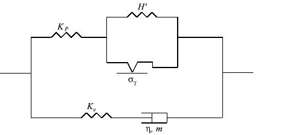

#### Elastic behavior

The elastic part of the response for both networks is specified using a linear isotropic elasticity definition. Any one of the available elasticity models in Abaqus/Standard can be used to define the elastic behavior of the networks. Referring to the one-dimensional idealization ([Figure 23.2.11--1](pt05ch23s02abm27.md#cviscous-one-dimension)), the ratio of the elastic modulus of the elastic-viscous network (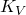) to the total (instantaneous) modulus (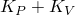) is given by 

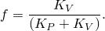

The user-specified ratio *f*, given as part of the viscous behavior definition as discussed later, apportions the total moduli specified for the elastic behavior among the elastic-viscous and the elastic-plastic networks. As a result, if isotropic elastic properties are defined, the Poisson's ratios are the same in both networks. On the other hand, if anisotropic elasticity is defined, the same type of anisotropy holds for both networks. The properties specified for the elastic behavior are assumed to be the instantaneous properties ().

| **Input File Usage: ** | ``` [*ELASTIC](../key/key-link.md#usb-kws-melastic) ``` |
| --- | --- |

| **Abaqus/CAE Usage: ** | Property module: material editor: ****Mechanical****Elasticity****Elastic**** |
| --- | --- |

#### Plastic behavior

A plasticity definition can be used to provide the static hardening data for the material model. All available metal plasticity models, including Hill's plasticity model to define anisotropic yield (["Anisotropic yield/creep," Section 23.2.6](pt05ch23s02abm22.md)), can be used.

The elastic-plastic network does not take into account rate-dependent yield. Hence, any specification of strain rate dependence for the plasticity model is not allowed.

| **Input File Usage: ** | Use the following options: |
| --- | --- |
|  | ``` [*PLASTIC](../key/key-link.md#usb-kws-mplastic) [*POTENTIAL](../key/key-link.md#usb-kws-mpotential) ``` |

| **Abaqus/CAE Usage: ** | Property module: material editor: ****Mechanical****Plasticity****Plastic****: ****Suboptions****Potential**** |
| --- | --- |

#### Viscous behavior

The viscous behavior of the material can be governed by any of the available creep laws in Abaqus/Standard (["Rate-dependent plasticity: creep and swelling," Section 23.2.4](pt05ch23s02abm20.md)), except the hyperbolic creep law. When you define the viscous behavior, you specify the viscosity parameters and choose the specific type of viscous behavior. If you choose to input the creep law through user subroutine [`CREEP`](../sub/sub-link.md#sub-xsl-creep), only deviatoric creep should be defined—more specifically, volumetric swelling behavior should not be defined within user subroutine [`CREEP`](../sub/sub-link.md#sub-xsl-creep). In addition, you also specify the fraction, *f*, that defines the ratio of the elastic modulus of the elastic-viscous network to the total (instantaneous) modulus. Viscous stress ratios can be specified under the viscous behavior definition to define anisotropic viscosity (see ["Anisotropic yield/creep," Section 23.2.6](pt05ch23s02abm22.md)).

All material properties can be specified as functions of temperature and predefined field variables.

| **Input File Usage: ** | Use the following options: |
| --- | --- |
|  | ``` [*VISCOUS](../key/key-link.md#usb-kws-mviscous), LAW=TIME *or* STRAIN *or* USER *or* ANAND *or* DARVEAUX *or* DOUBLE POWER [*POTENTIAL](../key/key-link.md#usb-kws-mpotential) ``` |

| **Abaqus/CAE Usage: ** | Property module: material editor: ****Mechanical****Plasticity****Viscous****: ****Suboptions****Potential****: **Time**, **Strain**, or **User** |
| --- | --- |
|  | Specifying the Anand, Darveaux, and double power creep laws is not supported in Abaqus/CAE. |

##### Time-dependent behavior

In the “time hardening” power law model the total time or the creep time can be used. The total time is the accumulated time over all general analysis steps. The creep time is the sum of the times of the procedures with time-dependent material behavior. If the total time is used, it is recommended that small step times compared to the creep time be used for any steps for which creep is not active in an analysis; this is necessary to avoid changes in hardening behavior in subsequent steps.

| **Input File Usage: ** | Use one of the following options: |
| --- | --- |
|  | ``` [*VISCOUS](../key/key-link.md#usb-kws-mviscous), TIME=TOTAL (default) [*VISCOUS](../key/key-link.md#usb-kws-mviscous), TIME=CREEP ``` |

| **Abaqus/CAE Usage: ** | Specifying the time type is not supported in Abaqus/CAE. |
| --- | --- |

#### Thermal expansion

Thermal expansion can be modeled by providing the thermal expansion coefficient of the material (["Thermal expansion," Section 26.1.2](pt05ch26s01abm52.md)). Anisotropic expansion can be defined in the usual manner. In the one-dimensional idealization the expansion element is assumed to be in series with the rest of the network.

### Calibration of material parameters

The calibration procedure is best explained in the context of the one-dimensional idealization of the material model. In the following discussion the viscous behavior is assumed to be governed by the Norton-Hoff rate law, which is given by

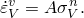

In the expression above the subscript *V* denotes quantities in the elastic-viscous network alone. This form of the rate law may be chosen, for example, by choosing a time-hardening power law for the viscous behavior and setting 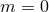. For this basic case there are six material parameters that need to be calibrated ([Figure 23.2.11--1](pt05ch23s02abm27.md#cviscous-one-dimension)). These are the elastic properties of the two networks, 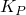 and ; the initial yield stress ; the hardening 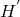; and the Norton-Hoff rate parameters, *A* and *n*.

The experiment that needs to be performed is uniaxial tension under different constant strain rates. A static (effectively zero strain rate) uniaxial tension test determines the long-term modulus, ; the initial yield stress, ; and the hardening, . The hardening is assumed to be linear for illustration purposes. The material model is not limited to linear hardening, and any general hardening behavior can be defined for the plasticity model. The instantaneous elastic modulus, 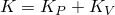, can be measured by measuring the initial elastic response of the material under nonzero, relatively high, strain rates. Several such measurements at different applied strain rates can be compared until the instantaneous moduli does not change with a change in the applied strain rate. The difference between *K* and  determines .

To calibrate the parameters *A* and *n*, it is useful to recognize that the long-term (steady-state) behavior of the elastic-viscous network under a constant applied strain rate, 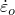, is a constant stress of magnitude 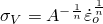. Under the assumption that the hardening modulus is negligible compared to the elastic modulus (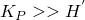), the steady-state response of the overall material is given by

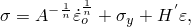

where  is the total stress for a given total strain . To determine whether steady state has been reached, one can plot the quantity 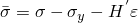 as a function of  and note when it becomes a constant. The constant value of  is equal to 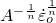. By performing several tests at different values of the constant applied strain rate , it is possible to determine the constants *A* and *n*. 

### Material response in different analysis steps

The material is active during all stress/displacement procedure types. In a static analysis step where the long-term response is requested (see ["Static stress analysis," Section 6.2.2](pt03ch06s02at01.md)), only the elastic-plastic network will be active; the elastic-viscous network will not contribute in any manner. In particular, the stress in the viscous network will be zero during a long-term static response. If the creep effects are removed in a coupled temperature-displacement procedure or a soils consolidation procedure, the response of the elastic-viscous network will be assumed to be elastic only. During a linear perturbation step, only the elastic response of the networks is considered.

Some stress/displacement procedure types (coupled temperature-displacement, soils consolidation, and quasi-static) allow user control of the time integration accuracy of the viscous constitutive equations through a user-specified error tolerance. In other procedure types where no such direct control is currently available (static, dynamic), you must choose appropriate time increments. These time increments must be small compared to the typical relaxation time of the material.

### Elements

The two-layer viscoplastic model is not available for one-dimensional elements (beams and trusses). It can be used with any other element in Abaqus/Standard that includes mechanical behavior (elements that have displacement degrees of freedom).

### Output

In addition to the standard output identifiers available in Abaqus/Standard (["Abaqus/Standard output variable identifiers," Section 4.2.1](pt02ch04s02abv01.md)), the following variables have special meaning for the two-layer viscoplastic material model:

| EE | The elastic strain is defined as: 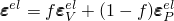. |
| --- | --- |

| PE | Plastic strain, 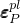, in the elastic-plastic network. |
| --- | --- |

| VE | Viscous strain, 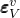, in the elastic-viscous network. |
| --- | --- |

| PS | Stress, 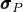, in the elastic-plastic network. |
| --- | --- |

| VS | Stress, 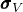, in the elastic-viscous network. |
| --- | --- |

| PEEQ | The equivalent plastic strain, defined as 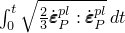. |
| --- | --- |

| VEEQ | The equivalent viscous strain, defined as 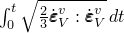. |
| --- | --- |

| SENER | The elastic strain energy density per unit volume, defined as 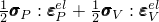. |
| --- | --- |

| PENER | The plastic dissipated energy per unit volume, defined as 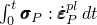. |
| --- | --- |

| VENER | The viscous dissipated energy per unit volume, defined as 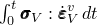. |
| --- | --- |

The above definitions of the strain tensors imply that the total strain is related to the elastic, plastic, and viscous strains through the following relation: 

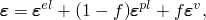

where according to the definitions given above 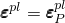 and 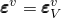. The above definitions of the output variables apply to all procedure types. In particular, when the long-term response is requested for a static procedure, the elastic-viscous network does not carry any stress and the definition of the elastic strain reduces to 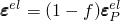, which implies that the total stress is related to the elastic strain through the instantaneous elastic moduli.

#### Additional reference

- Kichenin, J., "Comportement Thermomcanique du Polythylne---Application aux Structures Gazires," Thse de Doctorat de l'Ecole Polytechnique, Spcialit: Mcanique et Matriaux, 1992.


