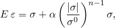
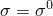
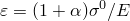
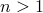
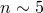
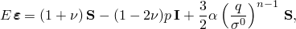
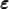
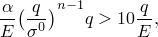
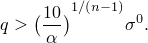

# 23.2.13 Deformation plasticity


**Products: **Abaqus/Standard  Abaqus/CAE  

##### **References**

- ["Material library: overview," Section 21.1.1](pt05ch21s01abo18.md)
- ["Inelastic behavior," Section 23.1.1](pt05ch23s01abo20.md)
- [*DEFORMATION PLASTICITY](../key/key-link.md#usb-kws-mdeformplas)
- ["Defining deformation plasticity" in "Defining other mechanical models," Section 12.9.4 of the Abaqus/CAE User's Guide](../usi/usi-link.md#usi-prp-mechanical-other-deformation)

### Overview

The deformation theory Ramberg-Osgood plasticity model:
- is primarily intended for use in developing fully plastic solutions for fracture mechanics applications in ductile metals; and
- cannot appear with any other mechanical response material models since it completely describes the mechanical response of the material.

### One-dimensional model

In one dimension the model is 



where 


is the stress;


is the strain;

*E*

is Young's modulus (defined as the slope of the stress-strain curve at zero stress);


is the “yield” offset;


is the yield stress, in the sense that, when , ; and

*n*

is the hardening exponent for the “plastic” (nonlinear) term: .

The material behavior described by this model is nonlinear at all stress levels, but for commonly used values of the hardening exponent ( or more) the nonlinearity becomes significant only at stress magnitudes approaching or exceeding .

### Generalization to multiaxial stress states

The one-dimensional model is generalized to multiaxial stress states using Hooke's law for the linear term and the Mises stress potential and associated flow law for the nonlinear term: 



where 



is the strain tensor,


is the stress tensor,


is the equivalent hydrostatic stress,


is the Mises equivalent stress,


is the stress deviator, and


is the Poisson's ratio.

The linear part of the behavior can be compressible or incompressible, depending on the value of the Poisson's ratio, but the nonlinear part of the behavior is incompressible (because the flow is normal to the Mises stress potential). The model is described in detail in ["Deformation plasticity," Section 4.3.9 of the Abaqus Theory Guide](../stm/stm-link.md#stm-mat-deformplast).

You specify the parameters *E*, , , *n*, and  directly. They can be defined as a tabular function of temperature.

| **Input File Usage: ** | ``` [*DEFORMATION PLASTICITY](../key/key-link.md#usb-kws-mdeformplas) ``` |
| --- | --- |

| **Abaqus/CAE Usage: ** | Property module: material editor: ****Mechanical****Deformation Plasticity**** |
| --- | --- |

### Typical applications

The deformation plasticity model is most commonly applied in static loading with small-displacement analysis, where the fully plastic solution must be developed in a part of the model. Generally, the load is ramped on until all points in the region being monitored satisfy the condition that the “plastic strain” dominates and, hence, exhibit fully plastic behavior, which is defined as 



or 



You can specify the name of a particular element set to be monitored in a static analysis step for fully plastic behavior. The step will end when the solutions at all constitutive calculation points in the element set are fully plastic, when the maximum number of increments specified for the step is reached, or when the time period specified for the static step is exceeded, whichever comes first.

| **Input File Usage: ** | ``` [*STATIC](../key/key-link.md#usb-kws-hstatic), FULLY PLASTIC=*ElsetName* ``` |
| --- | --- |

| **Abaqus/CAE Usage: ** | Step module: **Create Step**: **General**: **Static, General**: **Other**: **Stop when region *region* is fully plastic.** |
| --- | --- |

### Elements

Deformation plasticity can be used with any stress/displacement element in Abaqus/Standard. Since it will generally be used for cases when the deformation is dominated by plastic flow, the use of “hybrid” (mixed formulation) or reduced-integration elements is recommended with this material model.


