# 23.3.1 Extended Drucker-Prager models


**Products: **Abaqus/Standard  Abaqus/Explicit  Abaqus/CAE  

##### **References**

- ["Material library: overview," Section 21.1.1](pt05ch21s01abo18.md)
- ["Inelastic behavior," Section 23.1.1](pt05ch23s01abo20.md)
- ["Rate-dependent yield," Section 23.2.3](pt05ch23s02abm19.md)
- ["Rate-dependent plasticity: creep and swelling," Section 23.2.4](pt05ch23s02abm20.md)
- [Chapter 24, "Progressive Damage and Failure](pt05ch24.md)"
- [*DRUCKER PRAGER](../key/key-link.md#usb-kws-mdruckerprager)
- [*DRUCKER PRAGER HARDENING](../key/key-link.md#usb-kws-mdruckerhardening)
- [*RATE DEPENDENT](../key/key-link.md#usb-kws-mratedependent)
- [*DRUCKER PRAGER CREEP](../key/key-link.md#usb-kws-mdruckerpragercreep)
- [*TRIAXIAL TEST DATA](../key/key-link.md#usb-kws-mtritestdata)
- ["Defining Drucker-Prager plasticity" in "Defining plasticity," Section 12.9.2 of the Abaqus/CAE User's Guide](../usi/usi-link.md#usi-prp-mechanical-plastic-druckerprager)

### Overview

The extended Drucker-Prager models:
- are used to model frictional materials, which are typically granular-like soils and rock, and exhibit pressure-dependent yield (the material becomes stronger as the pressure increases);
- are used to model materials in which the compressive yield strength is greater than the tensile yield strength, such as those commonly found in composite and polymeric materials;
- allow a material to harden and/or soften isotropically;
- generally allow for volume change with inelastic behavior: the flow rule, defining the inelastic straining, allows simultaneous inelastic dilation (volume increase) and inelastic shearing;
- can include creep in Abaqus/Standard if the material exhibits long-term inelastic deformations;
- can be defined to be sensitive to the rate of straining, as is often the case in polymeric materials;
- can be used in conjunction with either the elastic material model (["Linear elastic behavior," Section 22.2.1](pt05ch22s02abm02.md)) or, in Abaqus/Standard if creep is not defined, the porous elastic material model (["Elastic behavior of porous materials," Section 22.3.1](pt05ch22s03abm05.md));
- can be used in conjunction with an equation of state model (["Equation of state," Section 25.2.1](pt05ch25s02abm50.md)) to describe the hydrodynamic response of the material in Abaqus/Explicit;
- can be used in conjunction with the models of progressive damage and failure (["Damage and failure for ductile metals: overview," Section 24.2.1](pt05ch24s02abm41.md)) to specify different damage initiation criteria and damage evolution laws that allow for the progressive degradation of the material stiffness and the removal of elements from the mesh; and
- are intended to simulate material response under essentially monotonic loading.

### Yield criteria

The yield criteria for this class of models are based on the shape of the yield surface in the meridional plane. The yield surface can have a linear form, a hyperbolic form, or a general exponent form. These surfaces are illustrated in [Figure 23.3.1--1](pt05ch23s03abm30.md#cdruckprag-yield-merid). The stress invariants and other terms in each of the three related yield criteria are defined later in this section.

**Figure 23.3.1–1** Yield surfaces in the meridional plane.

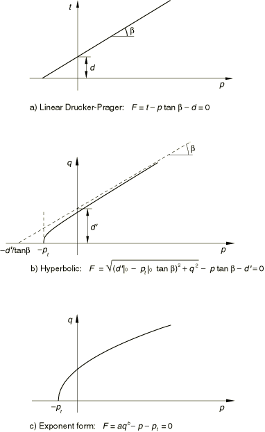

The linear model ([Figure 23.3.1--1](pt05ch23s03abm30.md#cdruckprag-yield-merid)a) provides for a possibly noncircular yield surface in the deviatoric plane (-plane) to match different yield values in triaxial tension and compression, associated inelastic flow in the deviatoric plane, and separate dilation and friction angles. Input data parameters define the shape of the yield and flow surfaces in the meridional and deviatoric planes as well as other characteristics of inelastic behavior such that a range of simple theories is provided—the original Drucker-Prager model is available within this model. However, this model cannot provide a close match to Mohr-Coulomb behavior, as described later in this section.

The hyperbolic and general exponent models use a von Mises (circular) section in the deviatoric stress plane. In the meridional plane a hyperbolic flow potential is used for both models, which, in general, means nonassociated flow.

The choice of model to be used depends largely on the analysis type, the kind of material, the experimental data available for calibration of the model parameters, and the range of pressure stress values that the material is likely to experience. It is common to have either triaxial test data at different levels of confining pressure or test data that are already calibrated in terms of a cohesion and a friction angle and, sometimes, a triaxial tensile strength value. If triaxial test data are available, the material parameters must be calibrated first. The accuracy with which the linear model can match these test data is limited by the fact that it assumes linear dependence of deviatoric stress on pressure stress. Although the hyperbolic model makes a similar assumption at high confining pressures, it provides a nonlinear relationship between deviatoric and pressure stress at low confining pressures, which may provide a better match of the triaxial experimental data. The hyperbolic model is useful for brittle materials for which both triaxial compression and triaxial tension data are available, which is a common situation for materials such as rocks. The most general of the three yield criteria is the exponent form. This criterion provides the most flexibility in matching triaxial test data. Abaqus determines the material parameters required for this model directly from the triaxial test data. A least-squares fit that minimizes the relative error in stress is used for this purpose.

For cases where the experimental data are already calibrated in terms of a cohesion and a friction angle, the linear model can be used. If these parameters are provided for a Mohr-Coulomb model, it is necessary to convert them to Drucker-Prager parameters. The linear model is intended primarily for applications where the stresses are for the most part compressive. If tensile stresses are significant, hydrostatic tension data should be available (along with the cohesion and friction angle) and the hyperbolic model should be used.

Calibration of these models is discussed later in this section.

### Hardening and rate dependence

For granular materials these models are often used as a failure surface, in the sense that the material can exhibit unlimited flow when the stress reaches yield. This behavior is called perfect plasticity. The models are also provided with isotropic hardening. In this case plastic flow causes the yield surface to change size uniformly with respect to all stress directions. This hardening model is useful for cases involving gross plastic straining or in which the straining at each point is essentially in the same direction in strain space throughout the analysis. Although the model is referred to as an isotropic “hardening” model, strain softening, or hardening followed by softening, can be defined.

As strain rates increase, many materials show an increase in their yield strength. This effect becomes important in many polymers when the strain rates range between 0.1 and 1 per second; it can be very important for strain rates ranging between 10 and 100 per second, which are characteristic of high-energy dynamic events or manufacturing processes. The effect is generally not as important in granular materials. The evolution of the yield surface with plastic deformation is described in terms of the equivalent stress , which can be chosen as either the uniaxial compression yield stress, the uniaxial tension yield stress, or the shear (cohesion) yield stress: 


where 


is the equivalent plastic strain rate, defined for the linear Drucker-Prager model as 


= if hardening is defined in uniaxial compression;


= if hardening is defined in uniaxial tension;


= if hardening is defined in pure shear,

and defined for the hyperbolic and exponential Drucker-Prager models as

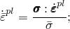


is the equivalent plastic strain;


is temperature; and

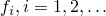

are other predefined field variables.

The functional dependence 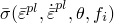 includes hardening as well as rate-dependent effects. The material data can be input either directly in a tabular format or by correlating it to static relations based on yield stress ratios.

Rate dependence as described here is most suitable for moderate- to high-speed events in Abaqus/Standard. Time-dependent inelastic deformation at low deformation rates can be better represented by creep models. Such inelastic deformation, which can coexist with rate-independent plastic deformation, is described later in this section. However, the existence of creep in an Abaqus/Standard material definition precludes the use of rate dependence as described here.

When using the Drucker-Prager material model, Abaqus allows you to prescribe initial hardening by defining initial equivalent plastic strain values, as discussed below along with other details regarding the use of initial conditions.

#### Direct tabular data

Test data are entered as tables of yield stress values versus equivalent plastic strain at different equivalent plastic strain rates; one table per strain rate. Compression data are more commonly available for geological materials, whereas tension data are usually available for polymeric materials. The guidelines on how to enter these data are provided in ["Rate-dependent yield," Section 23.2.3](pt05ch23s02abm19.md).

| **Input File Usage: ** | ``` [*DRUCKER PRAGER HARDENING](../key/key-link.md#usb-kws-mdruckerhardening), RATE= ``` |
| --- | --- |

| **Abaqus/CAE Usage: ** | Property module: material editor: ****Mechanical****Plasticity****Drucker Prager****: ****Suboptions****Drucker Prager Hardening****: toggle on **Use strain-rate-dependent data** |
| --- | --- |

#### Yield stress ratios

Alternatively, the strain rate behavior can be assumed to be separable, so that the stress-strain dependence is similar at all strain rates: 

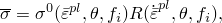

where  is the static stress-strain behavior and  is the ratio of the yield stress at nonzero strain rate to the static yield stress (so that ).

Two methods are offered to define *R* in Abaqus: specifying an overstress power law or defining the variable *R* directly as a tabular function of .

##### Overstress power law

The Cowper-Symonds overstress power law has the form 

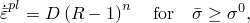

where  and  are material parameters that can be functions of temperature and, possibly, of other predefined field variables.

| **Input File Usage: ** | Use both of the following options: |
| --- | --- |
|  | ``` [*DRUCKER PRAGER HARDENING](../key/key-link.md#usb-kws-mdruckerhardening) [*RATE DEPENDENT](../key/key-link.md#usb-kws-mratedependent), TYPE=POWER LAW ``` |

| **Abaqus/CAE Usage: ** | Property module: material editor: ****Mechanical****Plasticity****Drucker Prager****: ****Suboptions****Drucker Prager Hardening****; ****Suboptions****Rate Dependent****: **Hardening: Power Law** |
| --- | --- |

##### Tabular function

When *R* is entered directly, it is entered as a tabular function of the equivalent plastic strain rate, ; temperature, ; and predefined field variables, .

| **Input File Usage: ** | Use both of the following options: |
| --- | --- |
|  | ``` [*DRUCKER PRAGER HARDENING](../key/key-link.md#usb-kws-mdruckerhardening) [*RATE DEPENDENT](../key/key-link.md#usb-kws-mratedependent), TYPE=YIELD RATIO ``` |

| **Abaqus/CAE Usage: ** | Property module: material editor: ****Mechanical****Plasticity****Drucker Prager****: ****Suboptions****Drucker Prager Hardening****; ****Suboptions****Rate Dependent****: **Hardening: Yield Ratio** |
| --- | --- |

##### Johnson-Cook rate dependence

Johnson-Cook rate dependence has the form 


where  and *C* are material constants that do not depend on temperature and are assumed not to depend on predefined field variables.

| **Input File Usage: ** | ``` [*DRUCKER PRAGER HARDENING](../key/key-link.md#usb-kws-mdruckerhardening) [*RATE DEPENDENT](../key/key-link.md#usb-kws-mratedependent), TYPE=JOHNSON COOK ``` |
| --- | --- |

| **Abaqus/CAE Usage: ** | Property module: material editor: ****Mechanical****Plasticity****Drucker Prager****: ****Suboptions****Drucker Prager Hardening****; ****Suboptions****Rate Dependent****: **Hardening: Johnson-Cook** |
| --- | --- |

### Stress invariants

The yield stress surface makes use of two invariants, defined as the equivalent pressure stress, 

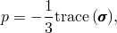

and the Mises equivalent stress, 


where  is the stress deviator, defined as 


In addition, the linear model also uses the third invariant of deviatoric stress, 


### Linear Drucker-Prager model

The linear model is written in terms of all three stress invariants. It provides for a possibly noncircular yield surface in the deviatoric plane to match different yield values in triaxial tension and compression, associated inelastic flow in the deviatoric plane, and separate dilation and friction angles.

#### Yield criterion

The linear Drucker-Prager criterion (see [Figure 23.3.1--1](pt05ch23s03abm30.md#cdruckprag-yield-merid)a) is written as 

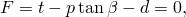

where 

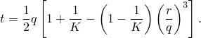


is the slope of the linear yield surface in the *p*–*t* stress plane and is commonly referred to as the friction angle of the material;

*d*

is the cohesion of the material; and

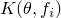

is the ratio of the yield stress in triaxial tension to the yield stress in triaxial compression and, thus, controls the dependence of the yield surface on the value of the intermediate principal stress (see [Figure 23.3.1--2](pt05ch23s03abm30.md#cdruckprag-yield-dev)).

**Figure 23.3.1–2** Typical yield/flow surfaces of the linear model in the deviatoric plane.


In the case of hardening defined in uniaxial compression, the linear yield criterion precludes friction angles 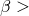 71.5 (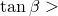 3), which is unlikely to be a limitation for real materials.

When 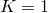, , which implies that the yield surface is the von Mises circle in the deviatoric principal stress plane (the -plane), in which case the yield stresses in triaxial tension and compression are the same. To ensure that the yield surface remains convex requires .

The cohesion, *d*, of the material is related to the input data as 

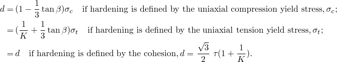

#### Plastic flow

*G* is the flow potential, chosen in this model as 


where  is the dilation angle in the *p*–*t* plane. A geometric interpretation of  is shown in the *p*–*t* diagram of [Figure 23.3.1--3](pt05ch23s03abm30.md#cdruckprag-lin-yield-p-t). In the case of hardening defined in uniaxial compression, this flow rule definition precludes dilation angles 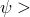 71.5 (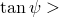 3). This restriction is not seen as a limitation since it is unlikely this will be the case for real materials.

**Figure 23.3.1–3** Linear Drucker-Prager model: yield surface and flow direction in the *p*–*t* plane.

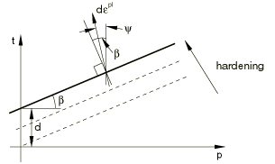

For granular materials the linear model is normally used with nonassociated flow in the *p*–*t* plane, in the sense that the flow is assumed to be normal to the yield surface in the -plane but at an angle  to the *t*-axis in the *p*–*t* plane, where usually 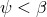, as illustrated in [Figure 23.3.1--3](pt05ch23s03abm30.md#cdruckprag-lin-yield-p-t). Associated flow results from setting . The original Drucker-Prager model is available by setting  and . Nonassociated flow is also generally assumed when the model is used for polymeric materials. If , the inelastic deformation is incompressible; if 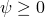, the material dilates. Hence,  is referred to as the dilation angle.

The relationship between the flow potential and the incremental plastic strain for the linear model is discussed in detail in ["Models for granular or polymer behavior," Section 4.4.2 of the Abaqus Theory Guide](../stm/stm-link.md#stm-mat-granularpoly).

| **Input File Usage: ** | ``` [*DRUCKER PRAGER](../key/key-link.md#usb-kws-mdruckerprager), SHEAR CRITERION=LINEAR ``` |
| --- | --- |

| **Abaqus/CAE Usage: ** | Property module: material editor: ****Mechanical****Plasticity****Drucker Prager****: **Shear criterion: Linear** |
| --- | --- |

#### Nonassociated flow

Nonassociated flow implies that the material stiffness matrix is not symmetric; therefore, the unsymmetric matrix storage and solution scheme should be used in Abaqus/Standard (see ["Defining an analysis," Section 6.1.2](pt03ch06s01abo05.md)). If the difference between  and  is not large and the region of the model in which inelastic deformation is occurring is confined, it is possible that a symmetric approximation to the material stiffness matrix will give an acceptable rate of convergence and the unsymmetric matrix scheme may not be needed.

### Hyperbolic and general exponent models

The hyperbolic and general exponent models available are written in terms of the first two stress invariants only.

#### Hyperbolic yield criterion

The hyperbolic yield criterion is a continuous combination of the maximum tensile stress condition of Rankine (tensile cutoff) and the linear Drucker-Prager condition at high confining stress. It is written as 


where 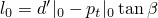 and 

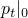

is the initial hydrostatic tension strength of the material;


is the hardening parameter;

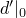

is the initial value of ; and


is the friction angle measured at high confining pressure, as shown in [Figure 23.3.1--1](pt05ch23s03abm30.md#cdruckprag-yield-merid)(b).

The hardening parameter, , can be obtained from test data as follows: 

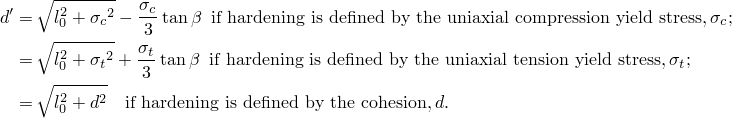

The isotropic hardening assumed in this model treats  as constant with respect to stress as depicted in [Figure 23.3.1--4](pt05ch23s03abm30.md#cdruckprag-hyper-yield-p-q).

**Figure 23.3.1–4** Hyperbolic model: yield surface and hardening in the *p*–*q* plane.

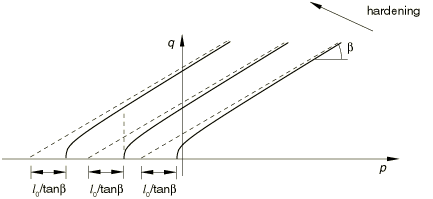

| **Input File Usage: ** | ``` [*DRUCKER PRAGER](../key/key-link.md#usb-kws-mdruckerprager), SHEAR CRITERION=HYPERBOLIC ``` |
| --- | --- |

| **Abaqus/CAE Usage: ** | Property module: material editor: ****Mechanical****Plasticity****Drucker Prager****: **Shear criterion: Hyperbolic** |
| --- | --- |

#### General exponent yield criterion

The general exponent form provides the most general yield criterion available in this class of models. The yield function is written as 


where 

 and 

are material parameters that are independent of plastic deformation; and

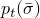

is the hardening parameter that represents the hydrostatic tension strength of the material as shown in [Figure 23.3.1--1](pt05ch23s03abm30.md#cdruckprag-yield-merid)(c).

 is related to the input test data as 


The isotropic hardening assumed in this model treats *a* and *b* as constant with respect to stress, as depicted in [Figure 23.3.1--5](pt05ch23s03abm30.md#cdruckprag-expon-yield-p-q).

**Figure 23.3.1–5** General exponent model: yield surface and hardening in the *p*–*q* plane.


The material parameters *a* and *b* can be given directly. Alternatively, if triaxial test data at different levels of confining pressure are available, Abaqus will determine the material parameters from the triaxial test data, as discussed below.

| **Input File Usage: ** | ``` [*DRUCKER PRAGER](../key/key-link.md#usb-kws-mdruckerprager), SHEAR CRITERION=EXPONENT FORM ``` |
| --- | --- |

| **Abaqus/CAE Usage: ** | Property module: material editor: ****Mechanical****Plasticity****Drucker Prager****: **Shear criterion: Exponent Form** |
| --- | --- |

#### Plastic flow

*G* is the flow potential, chosen in these models as a hyperbolic function: 

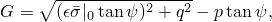

where


is the dilation angle measured in the *p*–*q* plane at high confining pressure;

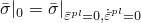

is the initial yield stress, taken from the user-specified Drucker-Prager hardening data; and


is a parameter, referred to as the eccentricity, that defines the rate at which the function approaches the asymptote (the flow potential tends to a straight line as the eccentricity tends to zero).

Suitable default values are provided for , as described below. The value of  will depend on the yield stress used.

This flow potential, which is continuous and smooth, ensures that the flow direction is always uniquely defined. The function approaches the linear Drucker-Prager flow potential asymptotically at high confining pressure stress and intersects the hydrostatic pressure axis at 90. A family of hyperbolic potentials in the meridional stress plane is shown in [Figure 23.3.1--6](pt05ch23s03abm30.md#cdruckprag-expon-fam-p-q). The flow potential is the von Mises circle in the deviatoric stress plane (the -plane).

**Figure 23.3.1–6** Family of hyperbolic flow potentials in the *p*–*q* plane.


 For the hyperbolic model flow is nonassociated in the *p*–*q* plane if the dilation angle, , and the material friction angle, , are different. The hyperbolic model provides associated flow in the *p*–*q* plane only when  and 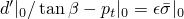. A default value of ) is assumed if the flow potential is used with the hyperbolic model, so that associated flow is recovered when .

For the general exponent model flow is always nonassociated in the *p*–*q* plane. The default flow potential eccentricity is 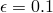, which implies that the material has almost the same dilation angle over a wide range of confining pressure stress values. Increasing the value of  provides more curvature to the flow potential, implying that the dilation angle increases more rapidly as the confining pressure decreases. Values of  that are significantly less than the default value may lead to convergence problems if the material is subjected to low confining pressures because of the very tight curvature of the flow potential locally where it intersects the *p*-axis.

The relationship between the flow potential and the incremental plastic strain for the hyperbolic and general exponent models is discussed in detail in ["Models for granular or polymer behavior," Section 4.4.2 of the Abaqus Theory Guide](../stm/stm-link.md#stm-mat-granularpoly).

#### Nonassociated flow

Nonassociated flow implies that the material stiffness matrix is not symmetric; therefore, the unsymmetric matrix storage and solution scheme should be used in Abaqus/Standard (see ["Defining an analysis," Section 6.1.2](pt03ch06s01abo05.md)). If the difference between  and  in the hyperbolic model is not large and if the region of the model in which inelastic deformation is occurring is confined, it is possible that a symmetric approximation to the material stiffness matrix will give an acceptable rate of convergence. In such cases the unsymmetric matrix scheme may not be needed.

### Progressive damage and failure

In Abaqus/Explicit the extended Drucker-Prager models can be used in conjunction with the models of progressive damage and failure discussed in ["Damage and failure for ductile metals: overview," Section 24.2.1](pt05ch24s02abm41.md). The capability allows for the specification of one or more damage initiation criteria, including ductile, shear, forming limit diagram (FLD), forming limit stress diagram (FLSD), and Mschenborn-Sonne forming limit diagram (MSFLD) criteria. After damage initiation, the material stiffness is degraded progressively according to the specified damage evolution response. The model offers two failure choices, including the removal of elements from the mesh as a result of tearing or ripping of the structure. The progressive damage models allow for a smooth degradation of the material stiffness, making them suitable for both quasi-static and dynamic situations.

| **Input File Usage: ** | Use the following options: |
| --- | --- |
|  | ``` [*DAMAGE INITIATION](../key/key-link.md#usb-kws-mdamageinitiation) [*DAMAGE EVOLUTION](../key/key-link.md#usb-kws-mdamageevolution) ``` |

| **Abaqus/CAE Usage: ** | Property module: material editor: ****Mechanical****Damage for Ductile Metals*****damage initiation type*****: specify the damage initiation criterion: ****Suboptions****Damage Evolution****: specify the damage evolution parameters |
| --- | --- |

### Matching experimental triaxial test data

Data for geological materials are most commonly available from triaxial testing. In such a test the specimen is confined by a pressure stress that is held constant during the test. The loading is an additional tension or compression stress applied in one direction. Typical results include stress-strain curves at different levels of confinement, as shown in [Figure 23.3.1--7](pt05ch23s03abm30.md#cdruckprag-triaxial-test). 

**Figure 23.3.1–7** Triaxial tests with stress-strain curves for typical geological materials at different levels of confinement.

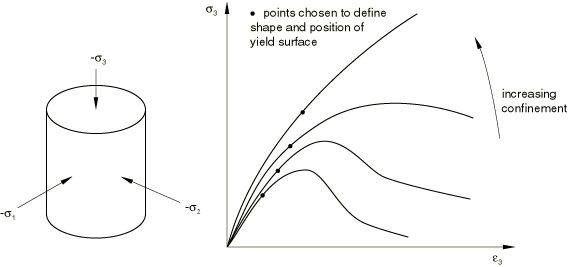

To calibrate the yield parameters for this class of models, you need to decide which point on each stress-strain curve will be used for calibration. For example, if you wish to calibrate the initial yield surface, the point in each stress-strain curve corresponding to initial deviation from elastic behavior should be used. Alternatively, if you wish to calibrate the ultimate yield surface, the point in each stress-strain curve corresponding to the peak stress should be used. 

One stress data point from each stress-strain curve at a different level of confinement is plotted in the meridional stress plane (*p*–*t* plane if the linear model is to be used, or *p*–*q* plane if the hyperbolic or general exponent model will be used). This technique calibrates the shape and position of the yield surface, as shown in [Figure 23.3.1--8](pt05ch23s03abm30.md#cdruckprag-match-merid), and is adequate to define a model if it is to be used as a failure surface (perfect plasticity). 

**Figure 23.3.1–8** Yield surface in meridional plane.

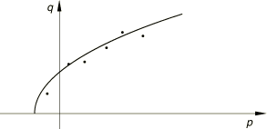

The models are also available with isotropic hardening, in which case hardening data are required to complete the calibration. In an isotropic hardening model plastic flow causes the yield surface to change size uniformly; in other words, only one of the stress-strain curves depicted in [Figure 23.3.1--7](pt05ch23s03abm30.md#cdruckprag-triaxial-test) can be used to represent hardening. The curve that represents hardening most accurately over the range of loading conditions anticipated should be selected (usually the curve for the average anticipated value of pressure stress).

As stated earlier, two types of triaxial test data are commonly available for geological materials. In a triaxial compression test the specimen is confined by pressure and an additional compression stress is superposed in one direction. Thus, the principal stresses are all negative, with 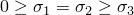 ([Figure 23.3.1--9](pt05ch23s03abm30.md#cdruckprag-tri-comp-ten)a). In the preceding inequality , , and  are the maximum, intermediate, and minimum principal stresses, respectively.

**Figure 23.3.1–9** a) Triaxial compression and b) tension.

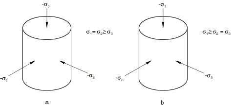

The values of the stress invariants are 


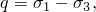

and 


so that 


The triaxial compression results can, thus, be plotted in the meridional plane shown in [Figure 23.3.1--8](pt05ch23s03abm30.md#cdruckprag-match-merid).

#### Linear Drucker-Prager model

Fitting the best straight line through the triaxial compression results provides  and *d* for the linear Drucker-Prager model.

Triaxial tension data are also needed to define *K* in the linear Drucker-Prager model. Under triaxial tension the specimen is again confined by pressure, after which the pressure in one direction is reduced. In this case the principal stresses are  ([Figure 23.3.1--9](pt05ch23s03abm30.md#cdruckprag-tri-comp-ten)b).

The stress invariants are now 


and 

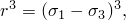

so that 


Thus, *K* can be found by plotting these test results as *q* versus *p* and again fitting the best straight line. The triaxial compression and tension lines must intercept the *p*-axis at the same point, and the ratio of values of *q* for triaxial tension and compression at the same value of *p* then gives *K* ([Figure 23.3.1--10](pt05ch23s03abm30.md#cdruckprag-lin-fit-comp-ten)).

**Figure 23.3.1–10** Linear model: fitting triaxial compression and tension data.

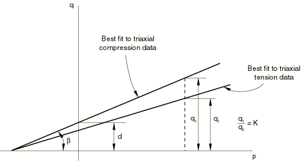

#### Hyperbolic model

Fitting the best straight line through the triaxial compression results at high confining pressures provides  and  for the hyperbolic model. This fit is performed in the same manner as that used to obtain  and *d* for the linear Drucker-Prager model. In addition, hydrostatic tension data are required to complete the calibration of the hyperbolic model so that the initial hydrostatic tension strength, , can be defined.

#### General exponent model

Given triaxial data in the meridional plane, Abaqus provides a capability to determine the material parameters *a*, *b*, and  required for the exponent model. The parameters are determined on the basis of a “best fit” of the triaxial test data at different levels of confining stress. A least-squares fit which minimizes the relative error in stress is used to obtain the “best fit” values for *a*, *b*, and . The capability allows all three parameters to be calibrated or, if some of the parameters are known, only the remaining parameters to be calibrated. This ability is useful if only a few data points are available, in which case you may wish to fit the best straight line (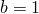) through the data points (effectively reducing the model to a linear Drucker-Prager model). Partial calibration can also be useful in a case when triaxial test data at low confinement are unreliable or unavailable, as is often the case for cohesionless materials. In this case a better fit may be obtained if the value of  is specified and only *a* and *b* are calibrated.

The data must be provided in terms of the principal stresses  and , where  is the confining stress and  is the stress in the loading direction. The Abaqus sign convention must be followed such that tensile stresses are positive and compressive stresses are negative. One pair of stresses must be entered from each triaxial test. As many data points as desired can be entered from triaxial tests at different levels of confining stress.

If the exponent model is used as a failure surface (perfect plasticity), the Drucker-Prager hardening behavior does not have to be specified. The hydrostatic tension strength, , obtained from the calibration will then be used as the failure stress. However, if the Drucker-Prager hardening behavior is specified together with the triaxial test data, the value of  obtained from the calibration will be ignored. In this case Abaqus will interpolate  directly from the hardening data.

| **Input File Usage: ** | Use both of the following options: |
| --- | --- |
|  | ``` [*DRUCKER PRAGER](../key/key-link.md#usb-kws-mdruckerprager), SHEAR CRITERION=EXPONENT FORM, TEST DATA [*TRIAXIAL TEST DATA](../key/key-link.md#usb-kws-mtritestdata) ``` |

| **Abaqus/CAE Usage: ** | Property module: material editor: ****Mechanical****Plasticity****Drucker Prager****: **Shear criterion: Exponent Form**, toggle on **Use Suboption Triaxial Test Data**, and select ****Suboptions****Triaxial Test Data**** |
| --- | --- |

### Matching Mohr-Coulomb parameters to the Drucker-Prager model

Sometimes experimental data are not directly available. Instead, you are provided with the friction angle and cohesion values for the Mohr-Coulomb model. In that case the simplest way to proceed is to use the Mohr-Coulomb model (see ["Mohr-Coulomb plasticity," Section 23.3.3](pt05ch23s03abm32.md)). In some situations it may be necessary to use the Drucker-Prager model instead of the Mohr-Coulomb model (such as when rate effects need to be considered), in which case we need to calculate values for the parameters of a Drucker-Prager model to provide a reasonable match to the Mohr-Coulomb parameters.

The Mohr-Coulomb failure model is based on plotting Mohr's circle for states of stress at failure in the plane of the maximum and minimum principal stresses. The failure line is the best straight line that touches these Mohr's circles ([Figure 23.3.1--11](pt05ch23s03abm30.md#cdruckprag-mohr-coul)).

**Figure 23.3.1–11** Mohr-Coulomb failure model.


Therefore, the Mohr-Coulomb model is defined by


where  is negative in compression. From Mohr's circle, 


Substituting for  and , multiplying both sides by , and reducing, the Mohr-Coulomb model can be written as 


where 


is half of the difference between the maximum principal stress, , and the minimum principal stress,  (and is, therefore, the maximum shear stress), 


is the average of the maximum and minimum principal stresses, and  is the friction angle. Thus, the model assumes a linear relationship between deviatoric and pressure stress and, so, can be matched by the linear or hyperbolic Drucker-Prager models provided in Abaqus.

The Mohr-Coulomb model assumes that failure is independent of the value of the intermediate principal stress, but the Drucker-Prager model does not. The failure of typical geotechnical materials generally includes some small dependence on the intermediate principal stress, but the Mohr-Coulomb model is generally considered to be sufficiently accurate for most applications. This model has vertices in the deviatoric plane (see [Figure 23.3.1--12](pt05ch23s03abm30.md#cdruckprag-mohr-coul-dev)).

**Figure 23.3.1–12** Mohr-Coulomb model in the deviatoric plane.


The implication is that, whenever the stress state has two equal principal stress values, the flow direction can change significantly with little or no change in stress. None of the models currently available in Abaqus can provide such behavior; even in the Mohr-Coulomb model the flow potential is smooth. This limitation is generally not a key concern in many design calculations involving Coulomb-like materials, but it can limit the accuracy of the calculations, especially in cases where flow localization is important.

#### Matching plane strain response

Plane strain problems are often encountered in geotechnical analysis; for example, long tunnels, footings, and embankments. Therefore, the constitutive model parameters are often matched to provide the same flow and failure response in plane strain. 

 The matching procedure described below is carried out in terms of the linear Drucker-Prager model but is also applicable to the hyperbolic model at high levels of confining stress.

The linear Drucker-Prager flow potential defines the plastic strain increment as


where  is the equivalent plastic strain increment. Since we wish to match the behavior in only one plane, we can take , which implies that . Thus, 

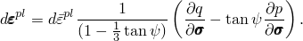

Writing this expression in terms of principal stresses provides 


with similar expressions for  and . Assume plane strain in the 1-direction. At limit load we must have 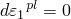, which provides the constraint 

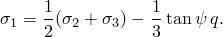

Using this constraint we can rewrite *q* and *p* in terms of the principal stresses in the plane of deformation,  and , as 

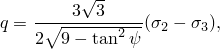

and 

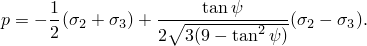

With these expressions the Drucker-Prager yield surface can be written in terms of  and  as 

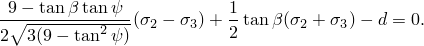

The Mohr-Coulomb yield surface in the 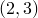 plane is 

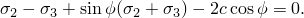

By comparison, 


These relationships provide a match between the Mohr-Coulomb material parameters and linear Drucker-Prager material parameters in plane strain. Consider the two extreme cases of flow definition: associated flow, , and nondilatant flow, when . For associated flow 


and for nondilatant flow 

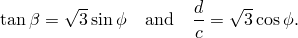

In either case  is immediately available as 


The difference between these two approaches increases with the friction angle; however, the results are not very different for typical friction angles, as illustrated in [Table 23.3.1--1](pt05ch23s03abm30.md#table-drucker-matching).

**Table 23.3.1–1** Plane strain matching of Drucker-Prager and Mohr-Coulomb models.
| Mohr-Coulomb friction angle,  | Associated flow | Nondilatant flow |
| --- | --- | --- |
| Drucker-Prager friction angle,  |  | Drucker-Prager friction angle,  |  |
| 10 | 16.7 | 1.70 | 16.7 | 1.70 |
| 20 | 30.2 | 1.60 | 30.6 | 1.63 |
| 30 | 39.8 | 1.44 | 40.9 | 1.50 |
| 40 | 46.2 | 1.24 | 48.1 | 1.33 |
| 50 | 50.5 | 1.02 | 53.0 | 1.11 |

 ["Limit load calculations with granular materials," Section 1.15.4 of the Abaqus Benchmarks Guide](../bmk/bmk-link.md#bmk-anl-granularlimitload), and ["Finite deformation of an elastic-plastic granular material," Section 1.15.5 of the Abaqus Benchmarks Guide](../bmk/bmk-link.md#bmk-anl-deformgranulartmat), show a comparison of the response of a simple loading of a granular material using the Drucker-Prager and Mohr-Coulomb models, using the plane strain approach to match the parameters of the two models.

#### Matching triaxial test response

Another approach to matching Mohr-Coulomb and Drucker-Prager model parameters for materials with low friction angles is to make the two models provide the same failure definition in triaxial compression and tension. The following matching procedure is applicable only to the linear Drucker-Prager model since this is the only model in this class that allows for different yield values in triaxial compression and tension.

We can rewrite the Mohr-Coulomb model in terms of principal stresses: 

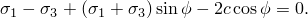

Using the results above for the stress invariants *p*, *q*, and *r* in triaxial compression and tension allows the linear Drucker-Prager model to be written for triaxial compression as 


and for triaxial tension as 

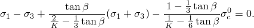

We wish to make these expressions identical to the Mohr-Coulomb model for all values of 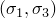. This is possible by setting 


By comparing the Mohr-Coulomb model with the linear Drucker-Prager model, 


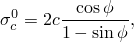

and, hence, from the previous result 


These results for  and  provide linear Drucker-Prager parameters that match the Mohr-Coulomb model in triaxial compression and tension.

The value of *K* in the linear Drucker-Prager model is restricted to  for the yield surface to remain convex. The result for *K* shows that this implies . Many real materials have a larger Mohr-Coulomb friction angle than this value. One approach in such circumstances is to choose  and then to use the remaining equations to define  and . This approach matches the models for triaxial compression only, while providing the closest approximation that the model can provide to failure being independent of the intermediate principal stress. If  is significantly larger than 22, this approach may provide a poor Drucker-Prager match of the Mohr-Coulomb parameters. Therefore, this matching procedure is not generally recommended; use the Mohr-Coulomb model instead.

While using one-element tests to verify the calibration of the model, it should be noted that the Abaqus output variables SP1, SP2, and SP3 correspond to the principal stresses , , and , respectively.

### Creep models for the linear Drucker-Prager model

Classical “creep” behavior of materials that exhibit plasticity according to the extended Drucker-Prager models can be defined in Abaqus/Standard. The creep behavior in such materials is intimately tied to the plasticity behavior (through the definitions of creep flow potentials and definitions of test data), so Drucker-Prager plasticity and Drucker-Prager hardening must be included in the material definition.

Creep and plasticity can be active simultaneously, in which case the resulting equations are solved in a coupled manner. To model creep only (without rate-independent plastic deformation), large values for the yield stress should be provided in the Drucker-Prager hardening definition: the result is that the material follows the Drucker-Prager model while it creeps, without ever yielding. When using this technique, a value must also be defined for the eccentricity, since, as described below, both the initial yield stress and eccentricity affect the creep potentials. This capability is limited to the linear model with a von Mises (circular) section in the deviatoric stress plane (; i.e., no third stress invariant effects are taken into account) and can be combined only with linear elasticity.

Creep behavior defined by the extended Drucker-Prager model is active only during soils consolidation, coupled temperature-displacement, and transient quasi-static procedures.

#### Creep formulation

The creep potential is hyperbolic, similar to the plastic flow potentials used in the hyperbolic and general exponent plasticity models. If creep properties are defined in Abaqus/Standard, the linear Drucker-Prager plasticity model also uses a hyperbolic plastic flow potential. As a consequence, if two analyses are run, one in which creep is not activated and another in which creep properties are specified but produce virtually no creep flow, the plasticity solutions will not be exactly the same: the solution with creep not activated uses a linear plastic potential, whereas the solution with creep activated uses a hyperbolic plastic potential.

##### Equivalent creep surface and equivalent creep stress

We adopt the notion of the existence of creep isosurfaces of stress points that share the same creep “intensity,” as measured by an equivalent creep stress. When the material plastifies, it is desirable to have the equivalent creep surface coincide with the yield surface; therefore, we define the equivalent creep surfaces by homogeneously scaling down the yield surface. In the *p*–*q* plane that translates into parallels to the yield surface, as depicted in [Figure 23.3.1--13](pt05ch23s03abm30.md#cdruckprag-equiv-creep). 

**Figure 23.3.1–13** Equivalent creep stress defined as the shear stress.


Abaqus/Standard requires that creep properties be described in terms of the same type of data used to define work hardening properties. The equivalent creep stress, , is then determined as follows: 


[Figure 23.3.1--13](pt05ch23s03abm30.md#cdruckprag-equiv-creep) shows how the equivalent point is determined when the material properties are in shear, with stress *d*. A consequence of these concepts is that there is a cone in *p*–*q* space inside which creep is not active since any point inside this cone would have a negative equivalent creep stress.

##### Creep flow

The creep strain rate in Abaqus/Standard is assumed to follow from the same hyperbolic potential as the plastic strain rate (see [Figure 23.3.1--6](pt05ch23s03abm30.md#cdruckprag-expon-fam-p-q)): 


where 


is the dilation angle measured in the *p*–*q* plane at high confining pressure;


is the initial yield stress taken from the user-specified Drucker-Prager hardening data; and


is a parameter, referred to as the eccentricity, that defines the rate at which the function approaches the asymptote (the creep potential tends to a straight line as the eccentricity tends to zero).

Suitable default values are provided for , as described below. This creep potential, which is continuous and smooth, ensures that the creep flow direction is always uniquely defined. The function approaches the linear Drucker-Prager flow potential asymptotically at high confining pressure stress and intersects the hydrostatic pressure axis at 90. A family of hyperbolic potentials in the meridional stress plane was shown in [Figure 23.3.1--6](pt05ch23s03abm30.md#cdruckprag-expon-fam-p-q). The creep potential is the von Mises circle in the deviatoric stress plane (the -plane).

The default creep potential eccentricity is , which implies that the material has almost the same dilation angle over a wide range of confining pressure stress values. Increasing the value of  provides more curvature to the creep potential, implying that the dilation angle increases as the confining pressure decreases. Values of  that are significantly less than the default value may lead to convergence problems if the material is subjected to low confining pressures, because of the very tight curvature of the creep potential locally where it intersects the *p*-axis. For details on the behavior of these models refer to ["Verification of creep integration," Section 3.2.6 of the Abaqus Benchmarks Guide](../bmk/bmk-link.md#bmk-mat-creep).

If the creep material properties are defined by a compression test, numerical problems may arise for very low stress values. Abaqus/Standard protects for such a case, as described in ["Models for granular or polymer behavior," Section 4.4.2 of the Abaqus Theory Guide](../stm/stm-link.md#stm-mat-granularpoly).

##### Nonassociated flow

The use of a creep potential different from the equivalent creep surface implies that the material stiffness matrix is not symmetric; therefore, the unsymmetric matrix storage and solution scheme should be used (see ["Defining an analysis," Section 6.1.2](pt03ch06s01abo05.md)). If the difference between  and  is not large and the region of the model in which inelastic deformation is occurring is confined, it is possible that a symmetric approximation to the material stiffness matrix will give an acceptable rate of convergence and the unsymmetric matrix scheme may not be needed.

#### Specifying a creep law

The definition of creep behavior in Abaqus/Standard is completed by specifying the equivalent “uniaxial behavior”—the creep “law.” In many practical cases the creep “law” is defined through user subroutine [`CREEP`](../sub/sub-link.md#sub-xsl-creep) because creep laws are usually of very complex form to fit experimental data. Data input methods are provided for some simple cases, including two forms of a power law model and a variation of the Singh-Mitchell law.

##### User subroutine [`CREEP`](../sub/sub-link.md#sub-xsl-creep)

User subroutine [`CREEP`](../sub/sub-link.md#sub-xsl-creep) provides a very general capability for implementing viscoplastic models in Abaqus/Standard in which the strain rate potential can be written as a function of the equivalent stress and any number of “solution-dependent state variables.” When used in conjunction with these material models, the equivalent creep stress, , is made available in the routine. Solution-dependent state variables are any variables that are used in conjunction with the constitutive definition and whose values evolve with the solution. Examples are hardening variables associated with the model. When a more general form is required for the stress potential, user subroutine [`UMAT`](../sub/sub-link.md#sub-xsl-umat) can be used.

| **Input File Usage: ** | ``` [*DRUCKER PRAGER CREEP](../key/key-link.md#usb-kws-mdruckerpragercreep), LAW=USER ``` |
| --- | --- |

| **Abaqus/CAE Usage: ** | Property module: material editor: ****Mechanical****Plasticity****Drucker Prager****: ****Suboptions****Drucker Prager Creep****: **Law: User** |
| --- | --- |

##### "Time hardening" form of the power law model

The “time hardening” form of the power law model is 


where 


is the equivalent creep strain rate, defined so that  if the equivalent creep stress is defined in uniaxial compression,  if defined in uniaxial tension, and  if defined in pure shear, where  is the engineering shear creep strain;


is the equivalent creep stress;

*t*

is the total or the creep time; and

*A*, *n*, and *m*

are user-defined creep material parameters specified as functions of temperature and field variables.

| **Input File Usage: ** | ``` [*DRUCKER PRAGER CREEP](../key/key-link.md#usb-kws-mdruckerpragercreep), LAW=TIME ``` |
| --- | --- |

| **Abaqus/CAE Usage: ** | Property module: material editor: ****Mechanical****Plasticity****Drucker Prager****: ****Suboptions****Drucker Prager Creep****: **Law: Time** |
| --- | --- |

##### "Strain hardening" form of the power law model

As an alternative to the “time hardening” form of the power law, as defined above, the corresponding “strain hardening” form can be used: 


For physically reasonable behavior *A* and *n* must be positive and .

| **Input File Usage: ** | ``` [*DRUCKER PRAGER CREEP](../key/key-link.md#usb-kws-mdruckerpragercreep), LAW=STRAIN ``` |
| --- | --- |

| **Abaqus/CAE Usage: ** | Property module: material editor: ****Mechanical****Plasticity****Drucker Prager****: ****Suboptions****Drucker Prager Creep****: **Law: Strain** |
| --- | --- |

##### Singh-Mitchell law

A second creep law available as data input is a variation of the Singh-Mitchell law: 


where , *t*, and  are defined above and *A*, , , and *m* are user-defined creep material parameters specified as functions of temperature and field variables. For physically reasonable behavior *A* and  must be positive, , and  should be small compared to the total time.

| **Input File Usage: ** | ``` [*DRUCKER PRAGER CREEP](../key/key-link.md#usb-kws-mdruckerpragercreep), LAW=SINGHM ``` |
| --- | --- |

| **Abaqus/CAE Usage: ** | Property module: material editor: ****Mechanical****Plasticity****Drucker Prager****: ****Suboptions****Drucker Prager Creep****: **Law: SinghM** |
| --- | --- |

##### Time-dependent behavior

In the “time hardening” power law model and the Singh-Mitchell law model the total time or the creep time can be used. The total time is the accumulated time over all general analysis steps. The creep time is the sum of the times of the procedures with time-dependent material behavior. If the total time is used, it is recommended that small step times compared to the creep time be used for any steps for which creep is not active in an analysis; this is necessary to avoid changes in hardening behavior in subsequent steps.

| **Input File Usage: ** | Use one of the following options: |
| --- | --- |
|  | ``` [*DRUCKER PRAGER CREEP](../key/key-link.md#usb-kws-mdruckerpragercreep), TIME=TOTAL (default) [*DRUCKER PRAGER CREEP](../key/key-link.md#usb-kws-mdruckerpragercreep), TIME=CREEP ``` |

| **Abaqus/CAE Usage: ** | Specifying the time type is not supported in Abaqus/CAE. |
| --- | --- |

##### Numerical difficulties

Depending on the choice of units for the creep laws described above, the value of *A* may be very small for typical creep strain rates. If *A* is less than , numerical difficulties can cause errors in the material calculations; therefore, use another system of units to avoid such difficulties in the calculation of creep strain increments.

#### Creep integration

Abaqus/Standard provides both explicit and implicit time integration of creep and swelling behavior. The choice of the time integration scheme depends on the procedure type, the parameters specified for the procedure, the presence of plasticity, and whether or not a geometric linear or nonlinear analysis is requested, as discussed in ["Rate-dependent plasticity: creep and swelling," Section 23.2.4](pt05ch23s02abm20.md).

### Initial conditions

When we need to study the behavior of a material that has already been subjected to some work hardening, Abaqus allows you to prescribe initial conditions for the equivalent plastic strain, , by specifying the conditions directly (see ["Initial conditions in Abaqus/Standard and Abaqus/Explicit," Section 34.2.1](pt07ch34s02aus116.md)). For more complicated cases initial conditions can be defined in Abaqus/Standard through user subroutine [`HARDINI`](../sub/sub-link.md#sub-xsl-hardini).

| **Input File Usage: ** | Use the following option to specify the initial equivalent plastic strain directly: |
| --- | --- |
|  | ``` [*INITIAL CONDITIONS](../key/key-link.md#usb-kws-minitialcond), TYPE=HARDENING ``` Use the following option in Abaqus/Standard to specify the initial equivalent plastic strain in user subroutine [`HARDINI`](../sub/sub-link.md#sub-xsl-hardini): ``` [*INITIAL CONDITIONS](../key/key-link.md#usb-kws-minitialcond), TYPE=HARDENING, USER ``` |

| **Abaqus/CAE Usage: ** | Use the following options to specify the initial equivalent plastic strain directly: |
| --- | --- |
|  | Load module: **Create Predefined Field**: **Step: Initial**, choose **Mechanical** for the **Category** and **Hardening** for the **Types for Selected Step** Use the following options in Abaqus/Standard to specify the initial equivalent plastic strain in user subroutine [`HARDINI`](../sub/sub-link.md#sub-xsl-hardini): Load module: **Create Predefined Field**: **Step: Initial**, choose **Mechanical** for the **Category** and **Hardening** for the **Types for Selected Step**; **Definition: User-defined** |

### Elements

The Drucker-Prager models can be used with the following element types: plane strain, generalized plane strain, axisymmetric, and three-dimensional solid (continuum) elements. All Drucker-Prager models are also available in plane stress (plane stress, shell, and membrane elements), except for the linear Drucker-Prager model with creep.

### Output

In addition to the standard output identifiers available in Abaqus (["Abaqus/Standard output variable identifiers," Section 4.2.1](pt02ch04s02abv01.md), and ["Abaqus/Explicit output variable identifiers," Section 4.2.2](pt02ch04s02xbv01.md)), the following variables have special meaning for the Drucker-Prager plasticity/creep model: 

| PEEQ | Equivalent plastic strain. For the linear Drucker-Prager plasticity model PEEQ is defined as ; where  is the initial equivalent plastic strain (zero or user-specified; see ["Initial conditions](pt05ch23s03abm30.md#usb-mat-cdruckerprager-ic)") and  is the equivalent plastic strain rate. For the hyperbolic and exponential Drucker-Prager plasticity models PEEQ is defined as , where  is the initial equivalent plastic strain and  is the yield stress. |
| --- | --- |

| CEEQ | Equivalent creep strain, . |
| --- | --- |


