# 23.3.2 Modified Drucker-Prager/Cap model


**Products: **Abaqus/Standard  Abaqus/Explicit  Abaqus/CAE  

##### **References**

- ["Inelastic behavior," Section 23.1.1](pt05ch23s01abo20.md)
- ["Material library: overview," Section 21.1.1](pt05ch21s01abo18.md)
- ["Rate-dependent plasticity: creep and swelling," Section 23.2.4](pt05ch23s02abm20.md)
- ["CREEP," Section 1.1.1 of the Abaqus User Subroutines Reference Guide](../sub/sub-link.md#sub-rtn-ucreep)
- [*CAP PLASTICITY](../key/key-link.md#usb-kws-mcapplasticity)
- [*CAP HARDENING](../key/key-link.md#usb-kws-mcaphardening)
- [*CAP CREEP](../key/key-link.md#usb-kws-mcapcreep)
- ["Defining cap plasticity" in "Defining plasticity," Section 12.9.2 of the Abaqus/CAE User's Guide](../usi/usi-link.md#usi-prp-mechanical-plastic-capplastic)

### Overview

The modified Drucker-Prager/Cap plasticity/creep model:
- is intended to model cohesive geological materials that exhibit pressure-dependent yield, such as soils and rocks;
- is based on the addition of a cap yield surface to the Drucker-Prager plasticity model (["Extended Drucker-Prager models," Section 23.3.1](pt05ch23s03abm30.md)), which provides an inelastic hardening mechanism to account for plastic compaction and helps to control volume dilatancy when the material yields in shear;
- can be used in Abaqus/Standard to simulate creep in materials exhibiting long-term inelastic deformation through a cohesion creep mechanism in the shear failure region and a consolidation creep mechanism in the cap region;
- can be used in conjunction with either the elastic material model (["Linear elastic behavior," Section 22.2.1](pt05ch22s02abm02.md)) or, in Abaqus/Standard if creep is not defined, the porous elastic material model (["Elastic behavior of porous materials," Section 22.3.1](pt05ch22s03abm05.md)); and
- provides a reasonable response to large stress reversals in the cap region; however, in the failure surface region the response is reasonable only for essentially monotonic loading.

### Yield surface

The addition of the cap yield surface to the Drucker-Prager model serves two main purposes: it bounds the yield surface in hydrostatic compression, thus providing an inelastic hardening mechanism to represent plastic compaction; and it helps to control volume dilatancy when the material yields in shear by providing softening as a function of the inelastic volume increase created as the material yields on the Drucker-Prager shear failure surface.

The yield surface has two principal segments: a pressure-dependent Drucker-Prager shear failure segment and a compression cap segment, as shown in [Figure 23.3.2--1](pt05ch23s03abm31.md#ccapplas-yield-p-t). The Drucker-Prager failure segment is a perfectly plastic yield surface (no hardening). Plastic flow on this segment produces inelastic volume increase (dilation) that causes the cap to soften. On the cap surface plastic flow causes the material to compact. The model is described in detail in ["Drucker-Prager/Cap model for geological materials," Section 4.4.4 of the Abaqus Theory Guide](../stm/stm-link.md#stm-mat-druckerpragercap).

**Figure 23.3.2–1** Modified Drucker-Prager/Cap model: yield surfaces in the *p*–*t* plane.


#### Failure surface

The Drucker-Prager failure surface is written as 


where  and 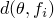 represent the angle of friction of the material and its cohesion, respectively, and can depend on temperature, , and other predefined fields . The deviatoric stress measure *t* is defined as 


 and


is the equivalent pressure stress,


is the Mises equivalent stress,

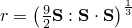

is the third stress invariant, and


is the deviatoric stress.

 is a material parameter that controls the dependence of the yield surface on the value of the intermediate principal stress, as shown in [Figure 23.3.2--2](pt05ch23s03abm31.md#cmoddruckprag-yield-dev).

**Figure 23.3.2–2** Typical yield/flow surfaces in the deviatoric plane.


The yield surface is defined so that *K* is the ratio of the yield stress in triaxial tension to the yield stress in triaxial compression.  implies that the yield surface is the von Mises circle in the deviatoric principal stress plane (the -plane), so that the yield stresses in triaxial tension and compression are the same; this is the default behavior in Abaqus/Standard and the only behavior available in Abaqus/Explicit. To ensure that the yield surface remains convex requires .

#### Cap yield surface

The cap yield surface has an elliptical shape with constant eccentricity in the meridional (*p*–*t*) plane ([Figure 23.3.2--1](pt05ch23s03abm31.md#ccapplas-yield-p-t)) and also includes dependence on the third stress invariant in the deviatoric plane ([Figure 23.3.2--2](pt05ch23s03abm31.md#cmoddruckprag-yield-dev)). The cap surface hardens or softens as a function of the volumetric inelastic strain: volumetric plastic and/or creep compaction (when yielding on the cap and/or creeping according to the consolidation mechanism, as described later in this section) causes hardening, while volumetric plastic and/or creep dilation (when yielding on the shear failure surface and/or creeping according to the cohesion mechanism, as described later in this section) causes softening. The cap yield surface is 


where  is a material parameter that controls the shape of the cap,  is a small number that we discuss later, and 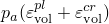 is an evolution parameter that represents the volumetric inelastic strain driven hardening/softening. The hardening/softening law is a user-defined piecewise linear function relating the hydrostatic compression yield stress, , and volumetric inelastic strain ([Figure 23.3.2--3](pt05ch23s03abm31.md#ccapplas-hard)): 


**Figure 23.3.2–3** Typical Cap hardening.

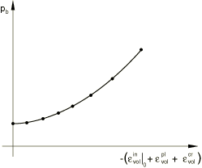

 The volumetric inelastic strain axis in [Figure 23.3.2--3](pt05ch23s03abm31.md#ccapplas-hard) has an arbitrary origin:  is the position on this axis corresponding to the initial state of the material when the analysis begins, thus defining the position of the cap () in [Figure 23.3.2--1](pt05ch23s03abm31.md#ccapplas-yield-p-t) at the start of the analysis. The evolution parameter 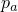 is given as 

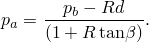

The parameter  is a small number (typically 0.01 to 0.05) used to define a transition yield surface, 


so that the model provides a smooth intersection between the cap and failure surfaces.

#### Defining yield surface variables

You provide the variables *d*, , *R*, , , and *K* to define the shape of the yield surface. In Abaqus/Standard , while in Abaqus/Explicit *K* = 1 (). If desired, combinations of these variables can also be defined as a tabular function of temperature and other predefined field variables.

| **Input File Usage: ** | ``` [*CAP PLASTICITY](../key/key-link.md#usb-kws-mcapplasticity) ``` |
| --- | --- |

| **Abaqus/CAE Usage: ** | Property module: material editor: ****Mechanical****Plasticity****Cap Plasticity**** |
| --- | --- |

#### Defining hardening parameters

The hardening curve specified for this model interprets yielding in the hydrostatic pressure sense: the hydrostatic pressure yield stress is defined as a tabular function of the volumetric inelastic strain, and, if desired, a function of temperature and other predefined field variables. The range of values for which  is defined should be sufficient to include all values of effective pressure stress that the material will be subjected to during the analysis.

| **Input File Usage: ** | ``` [*CAP HARDENING](../key/key-link.md#usb-kws-mcaphardening) ``` |
| --- | --- |

| **Abaqus/CAE Usage: ** | Property module: material editor: ****Mechanical****Plasticity****Cap Plasticity****: ****Suboptions****Cap Hardening**** |
| --- | --- |

### Plastic flow

Plastic flow is defined by a flow potential that is associated in the deviatoric plane, associated in the cap region in the meridional plane, and nonassociated in the failure surface and transition regions in the meridional plane. The flow potential surface that we use in the meridional plane is shown in [Figure 23.3.2--4](pt05ch23s03abm31.md#ccapplas-flow-p-t): it is made up of an elliptical portion in the cap region that is identical to the cap yield surface, 

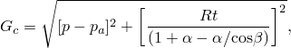

and another elliptical portion in the failure and transition regions that provides the nonassociated flow component in the model, 

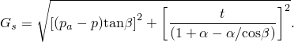

The two elliptical portions form a continuous and smooth potential surface.

**Figure 23.3.2–4** Modified Drucker-Prager/Cap model: flow potential in the *p*–*t* plane.


#### Nonassociated flow

Nonassociated flow implies that the material stiffness matrix is not symmetric and the unsymmetric matrix storage and solution scheme should be used in Abaqus/Standard (see ["Defining an analysis," Section 6.1.2](pt03ch06s01abo05.md)). If the region of the model in which nonassociated inelastic deformation is occurring is confined, it is possible that a symmetric approximation to the material stiffness matrix will give an acceptable rate of convergence; in such cases the unsymmetric matrix scheme may not be needed.

### Calibration

At least three experiments are required to calibrate the simplest version of the Cap model: a hydrostatic compression test (an oedometer test is also acceptable) and either two triaxial compression tests or one triaxial compression test and one uniaxial compression test (more than two tests are recommended for a more accurate calibration).

The hydrostatic compression test is performed by pressurizing the sample equally in all directions. The applied pressure and the volume change are recorded.

The uniaxial compression test involves compressing the sample between two rigid platens. The load and displacement in the direction of loading are recorded. The lateral displacements should also be recorded so that the correct volume changes can be calibrated.

Triaxial compression experiments are performed using a standard triaxial machine where a fixed confining pressure is maintained while the differential stress is applied. Several tests covering the range of confining pressures of interest are usually performed. Again, the stress and strain in the direction of loading are recorded, together with the lateral strain so that the correct volume changes can be calibrated.

Unloading measurements in these tests are useful to calibrate the elasticity, particularly in cases where the initial elastic region is not well defined.

The hydrostatic compression test stress-strain curve gives the evolution of the hydrostatic compression yield stress, , required for the cap hardening curve definition.

The friction angle, , and cohesion, *d*, which define the shear failure dependence on hydrostatic pressure, are calculated by plotting the failure stresses of the two triaxial compression tests (or the triaxial compression test and the uniaxial compression test) in the pressure stress (*p*) versus shear stress (*q*) space: the slope of the straight line passing through the two points gives the angle  and the intersection with the *q*-axis gives *d*. For more details on the calibration of  and *d*, see the discussion on calibration in ["Extended Drucker-Prager models," Section 23.3.1](pt05ch23s03abm30.md).

*R* represents the curvature of the cap part of the yield surface and can be calibrated from a number of triaxial tests at high confining pressures (in the cap region). *R* must be between 0.0001 and 1000.0.

### Abaqus/Standard creep model

Classical “creep” behavior of materials that exhibit plasticity according to the capped Drucker-Prager plasticity model can be defined in Abaqus/Standard. The creep behavior in such materials is intimately tied to the plasticity behavior (through the definitions of creep flow potentials and definitions of test data), so cap plasticity and cap hardening must be included in the material definition. If no rate-independent plastic behavior is desired in the model, large values for the cohesion, *d*, as well as large values for the compression yield stress, , should be provided in the plasticity definition: as a result the material follows the capped Drucker-Prager model while it creeps, without ever yielding. This capability is limited to cases in which there is no third stress invariant dependence of the yield surface () and cases in which the yield surface has no transition region (). The elastic behavior must be defined using linear isotropic elasticity (see ["Defining isotropic elasticity" in "Linear elastic behavior," Section 22.2.1](pt05ch22s02abm02.md#usb-mat-clinearelastic-isotropic)).

Creep behavior defined for the modified Drucker-Prager/Cap model is active only during soils consolidation, coupled temperature-displacement, and transient quasi-static procedures.

#### Creep formulation

This model has two possible creep mechanisms that are active in different loading regions: one is a cohesion mechanism, which follows the type of plasticity active in the shear-failure plasticity region, and the other is a consolidation mechanism, which follows the type of plasticity active in the cap plasticity region. [Figure 23.3.2--5](pt05ch23s03abm31.md#ccapplas-active-creep) shows the regions of applicability of the creep mechanisms in *p*–*q* space.

**Figure 23.3.2–5** Regions of activity of creep mechanisms.

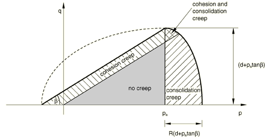

##### Equivalent creep surface and equivalent creep stress for the cohesion creep mechanism

Consider the cohesion creep mechanism first. We adopt the notion of the existence of creep isosurfaces of stress points that share the same creep “intensity,” as measured by an equivalent creep stress. Since it is desirable to have the equivalent creep surface coincide with the yield surface, we define the equivalent creep surfaces by homogeneously scaling down the yield surface. In the *p*–*q* plane the equivalent creep surfaces translate into surfaces that are parallel to the yield surface, as depicted in [Figure 23.3.2--6](pt05ch23s03abm31.md#ccapplas-cohesion-creep). 

**Figure 23.3.2–6** Equivalent creep stress for cohesion creep.


Abaqus/Standard requires that cohesion creep properties be measured in a uniaxial compression test. The equivalent creep stress, , is determined as follows: 


Abaqus/Standard also requires that  be positive. [Figure 23.3.2--6](pt05ch23s03abm31.md#ccapplas-cohesion-creep) shows such an equivalent creep stress. A consequence of these concepts is that there is a cone in *p*–*q* space inside which creep is not active. Any point inside this cone would have a negative equivalent creep stress.

##### Equivalent creep surface and equivalent creep stress for the consolidation creep mechanism

Next, consider the consolidation creep mechanism. In this case we wish to make creep dependent on the hydrostatic pressure above a threshold value of , with a smooth transition to the areas in which the mechanism is not active (). Therefore, we define equivalent creep surfaces as constant hydrostatic pressure surfaces (vertical lines in the *p*–*q* plane). Abaqus/Standard requires that consolidation creep properties be measured in a hydrostatic compression test. The effective creep pressure, , is then the point on the *p*-axis with a relative pressure of 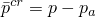. This value is used in the uniaxial creep law. The equivalent volumetric creep strain rate produced by this type of law is defined as positive for a positive equivalent pressure. The internal tensor calculations in Abaqus/Standard account for the fact that a positive pressure will produce negative (that is, compressive) volumetric creep components.

##### Creep flow

The creep strain rate produced by the cohesion mechanism is assumed to follow a potential that is similar to that of the creep strain rate in the Drucker-Prager creep model (["Extended Drucker-Prager models," Section 23.3.1](pt05ch23s03abm30.md)); that is, a hyperbolic function: 


This creep flow potential, which is continuous and smooth, ensures that the flow direction is always uniquely defined. The function approaches a parallel to the shear-failure yield surface asymptotically at high confining pressure stress and intersects the hydrostatic pressure axis at a right angle. A family of hyperbolic potentials in the meridional stress plane is shown in [Figure 23.3.2--7](pt05ch23s03abm31.md#ccapplas-cohesion-p-q). The cohesion creep potential is the von Mises circle in the deviatoric stress plane (the -plane).

**Figure 23.3.2–7** Cohesion creep potentials in the *p*–*q* plane.


Abaqus/Standard protects for numerical problems that may arise for very low stress values. See ["Drucker-Prager/Cap model for geological materials," Section 4.4.4 of the Abaqus Theory Guide](../stm/stm-link.md#stm-mat-druckerpragercap), for details.

The creep strain rate produced by the consolidation mechanism is assumed to follow a potential that is similar to that of the plastic strain rate in the cap yield surface ([Figure 23.3.2--8](pt05ch23s03abm31.md#ccapplas-consolid-creep)): 

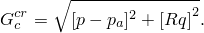

**Figure 23.3.2–8** Consolidation creep potentials in the *p*–*q* plane.


The consolidation creep potential is the von Mises circle in the deviatoric stress plane (the -plane). The volumetric components of creep strain from both mechanisms contribute to the hardening/softening of the cap, as described previously. For details on the behavior of these models refer to ["Verification of creep integration," Section 3.2.6 of the Abaqus Benchmarks Guide](../bmk/bmk-link.md#bmk-mat-creep).

##### Nonassociated flow

The use of a creep potential for the cohesion mechanism different from the equivalent creep surface implies that the material stiffness matrix is not symmetric, and the unsymmetric matrix storage and solution scheme should be used (see ["Defining an analysis," Section 6.1.2](pt03ch06s01abo05.md)). If the region of the model in which cohesive inelastic deformation is occurring is confined, it is possible that a symmetric approximation to the material stiffness matrix will give an acceptable rate of convergence; in such cases the unsymmetric matrix scheme may not be needed.

#### Specifying creep laws

The definition of the creep behavior is completed by specifying the equivalent “uniaxial behavior”—the creep “laws.” In many practical cases the creep laws are defined through user subroutine [`CREEP`](../sub/sub-link.md#sub-xsl-creep) because creep laws are usually of complex form to fit experimental data. Data input methods are provided for some simple cases.

##### User subroutine [`CREEP`](../sub/sub-link.md#sub-xsl-creep)

User subroutine [`CREEP`](../sub/sub-link.md#sub-xsl-creep) provides a general capability for implementing viscoplastic models in which the strain rate potential can be written as a function of the equivalent stress and any number of “solution-dependent state variables.” When used in conjunction with these materials, the equivalent cohesion creep stress, , and the effective creep pressure, , are made available in the routine. Solution-dependent state variables are any variables that are used in conjunction with the constitutive definition and whose values evolve with the solution. Examples are hardening variables associated with the model. When a more general form is required for the stress potential, user subroutine [`UMAT`](../sub/sub-link.md#sub-xsl-umat) can be used.

| **Input File Usage: ** | Use either or both of the following options: |
| --- | --- |
|  | ``` [*CAP CREEP](../key/key-link.md#usb-kws-mcapcreep), MECHANISM=COHESION, LAW=USER [*CAP CREEP](../key/key-link.md#usb-kws-mcapcreep), MECHANISM=CONSOLIDATION, LAW=USER ``` |

| **Abaqus/CAE Usage: ** | Define one or both of the following: |
| --- | --- |
|  | Property module: material editor: ****Mechanical****Plasticity****Cap Plasticity****: ****Suboptions****Cap Creep Cohesion****: **Law: User******Suboptions****Cap Creep Consolidation****: **Law: User** |

##### "Time hardening" form of the power law model

With respect to the cohesion mechanism, the power law is available 


where


is the equivalent creep strain rate;

 

is the equivalent cohesion creep stress;

*t*

is the total or the creep time; and

*A*, *n*, and *m*

are user-defined creep material parameters specified as functions of temperature and field variables.

In using this form of the power law model with the consolidation mechanism,  can be replaced by , the effective creep pressure, in the above relation.

| **Input File Usage: ** | Use either or both of the following options: |
| --- | --- |
|  | ``` [*CAP CREEP](../key/key-link.md#usb-kws-mcapcreep), MECHANISM=COHESION, LAW=TIME [*CAP CREEP](../key/key-link.md#usb-kws-mcapcreep), MECHANISM=CONSOLIDATION, LAW=TIME ``` |

| **Abaqus/CAE Usage: ** | Define one or both of the following: |
| --- | --- |
|  | Property module: material editor: ****Mechanical****Plasticity****Cap Plasticity****: ****Suboptions****Cap Creep Cohesion****: **Law: Time******Suboptions****Cap Creep Consolidation****: **Law: Time** |

##### "Strain hardening" form of the power law model

As an alternative to the “time hardening” form of the power law, as defined above, the corresponding “strain hardening” form can be used. For the cohesion mechanism this law has the form 


In using this form of the power law model with the consolidation mechanism,  can be replaced by , the effective creep pressure, in the above relation.

For physically reasonable behavior *A* and *n* must be positive and .

| **Input File Usage: ** | Use either or both of the following options: |
| --- | --- |
|  | ``` [*CAP CREEP](../key/key-link.md#usb-kws-mcapcreep), MECHANISM=COHESION, LAW=STRAIN [*CAP CREEP](../key/key-link.md#usb-kws-mcapcreep), MECHANISM=CONSOLIDATION, LAW=STRAIN ``` |

| **Abaqus/CAE Usage: ** | Define one or both of the following: |
| --- | --- |
|  | Property module: material editor: ****Mechanical****Plasticity****Cap Plasticity****: ****Suboptions****Cap Creep Cohesion****: **Law: Strain******Suboptions****Cap Creep Consolidation****: **Law: Strain** |

##### Singh-Mitchell law

A second cohesion creep law available as data input is a variation of the Singh-Mitchell law: 


where , *t*, and  are defined above and *A*, , , and *m* are user-defined creep material parameters specified as functions of temperature and field variables. For physically reasonable behavior *A* and  must be positive, , and  should be small compared to the total time.

In using this variation of the Singh-Mitchell law with the consolidation mechanism,  can be replaced by , the effective creep pressure, in the above relation.

| **Input File Usage: ** | Use either or both of the following options: |
| --- | --- |
|  | ``` [*CAP CREEP](../key/key-link.md#usb-kws-mcapcreep), MECHANISM=COHESION, LAW=SINGHM [*CAP CREEP](../key/key-link.md#usb-kws-mcapcreep), MECHANISM=CONSOLIDATION, LAW=SINGHM ``` |

| **Abaqus/CAE Usage: ** | Define one or both of the following: |
| --- | --- |
|  | Property module: material editor: ****Mechanical****Plasticity****Cap Plasticity****: ****Suboptions****Cap Creep Cohesion****: **Law: SinghM******Suboptions****Cap Creep Consolidation****: **Law: SinghM** |

##### Time-dependent behavior

In the “time hardening” power law model and the Singh-Mitchell law model the total time or the creep time can be used. The total time is the accumulated time over all general analysis steps. The creep time is the sum of the times of the procedures with time-dependent material behavior. If the total time is used, it is recommended that small step times compared to the creep time be used for any steps for which creep is not active in an analysis; this is necessary to avoid changes in hardening behavior in subsequent steps.

| **Input File Usage: ** | Use one of the following options: |
| --- | --- |
|  | ``` [*CAP CREEP](../key/key-link.md#usb-kws-mcapcreep), TIME=TOTAL (default) [*CAP CREEP](../key/key-link.md#usb-kws-mcapcreep), TIME=CREEP ``` |

| **Abaqus/CAE Usage: ** | Specifying the time type is not supported in Abaqus/CAE. |
| --- | --- |

##### Numerical difficulties

Depending on the choice of units for the creep laws described above, the value of *A* may be very small for typical creep strain rates. If *A* is less than 1027, numerical difficulties can cause errors in the material calculations; therefore, use another system of units to avoid such difficulties in the calculation of creep strain increments.

#### Creep integration

Abaqus/Standard provides both explicit and implicit time integration of creep and swelling behavior. The choice of the time integration scheme depends on the procedure type, the parameters specified for the procedure, the presence of plasticity, and whether or not a geometric linear or nonlinear analysis is requested, as discussed in ["Rate-dependent plasticity: creep and swelling," Section 23.2.4](pt05ch23s02abm20.md).

### Initial conditions

The initial stress at a point can be defined (see ["Defining initial stresses" in "Initial conditions in Abaqus/Standard and Abaqus/Explicit," Section 34.2.1](pt07ch34s02aus116.md#usb-prc-pinitialcond-stress)). If such a stress point lies outside the initially defined cap or transition yield surfaces and under the projection of the shear failure surface in the *p*–*t* plane (illustrated in [Figure 23.3.2--1](pt05ch23s03abm31.md#ccapplas-yield-p-t)), Abaqus will try to adjust the initial position of the cap to make the stress point lie on the yield surface and a warning message will be issued. If the stress point lies outside the Drucker-Prager failure surface (or above its projection), an error message will be issued and execution will be terminated.

### Elements

The modified Drucker-Prager/Cap material behavior can be used with plane strain, generalized plane strain, axisymmetric, and three-dimensional solid (continuum) elements. This model cannot be used with elements for which the assumed stress state is plane stress (plane stress, shell, and membrane elements).

### Output

In addition to the standard output identifiers available in Abaqus (["Abaqus/Standard output variable identifiers," Section 4.2.1](pt02ch04s02abv01.md), and ["Abaqus/Explicit output variable identifiers," Section 4.2.2](pt02ch04s02xbv01.md)), the following variables have special meaning in the cap plasticity/creep model: 

| PEEQ | , the cap position. |
| --- | --- |

| PEQC | Equivalent plastic strains for all three possible yield/failure surfaces (Drucker-Prager failure surface - PEQC1, cap surface - PEQC2, and transition surface - PEQC3) and the total volumetric inelastic strain (PEQC4). For each yield/failure surface, the equivalent plastic strain is  where  is the corresponding rate of plastic flow. The total volumetric inelastic strain is defined as  |
| --- | --- |

| CEEQ | Equivalent creep strain produced by the cohesion creep mechanism, defined as 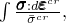 where  is the equivalent creep stress. |
| --- | --- |

| CESW | Equivalent creep strain produced by the consolidation creep mechanism, defined as , where  is the equivalent creep pressure. |
| --- | --- |


