# 23.3.3 Mohr-Coulomb plasticity


**Products: **Abaqus/Standard  Abaqus/Explicit  Abaqus/CAE  

##### **References**

- ["Material library: overview," Section 21.1.1](pt05ch21s01abo18.md)
- ["Inelastic behavior," Section 23.1.1](pt05ch23s01abo20.md)
- [*MOHR COULOMB](../key/key-link.md#usb-kws-mmohrcoulomb)
- [*MOHR COULOMB HARDENING](../key/key-link.md#usb-kws-mmohrcoulombhardening)
- [*TENSION CUTOFF](../key/key-link.md#usb-kws-mtensioncutoff)
- ["Defining Mohr-Coulomb plasticity" in "Defining plasticity," Section 12.9.2 of the Abaqus/CAE User's Guide](../usi/usi-link.md#usi-prp-mechanical-plastic-mohrcoulomb)

### Overview

The Mohr-Coulomb plasticity model:
- is used to model materials with the classical Mohr-Coloumb yield criterion;
- allows the material to harden and/or soften isotropically;
- uses a smooth flow potential that has a hyperbolic shape in the meridional stress plane and a piecewise elliptic shape in the deviatoric stress plane;
- is used with the linear elastic material model (["Linear elastic behavior," Section 22.2.1](pt05ch22s02abm02.md));
- can be used with the Rankine surface (tension cutoff) to limit load carrying capacity near the tensile region; and
- can be used for design applications in the geotechnical engineering area to simulate material response under essentially monotonic loading.

### Elastic behavior

The elastic part of the response is specified as described in ["Linear elastic behavior," Section 22.2.1](pt05ch22s02abm02.md). Linear isotropic elasticity is assumed.

### Plastic behavior: yield criteria

The yield surface is a composite of two different criteria: a shear criterion, known as the Mohr-Coulomb surface, and an optional tension cutoff criterion, modeled using the Rankine surface.

#### Mohr-Coulomb surface

The Mohr-Coulomb criterion assumes that yield occurs when the shear stress on any point in a material reaches a value that depends linearly on the normal stress in the same plane. The Mohr-Coulomb model is based on plotting Mohr's circle for states of stress at yield in the plane of the maximum and minimum principal stresses. The yield line is the best straight line that touches these Mohr's circles ([Figure 23.3.3--1](pt05ch23s03abm32.md#cmohr-coulomb)).

**Figure 23.3.3–1** Mohr-Coulomb yield model.

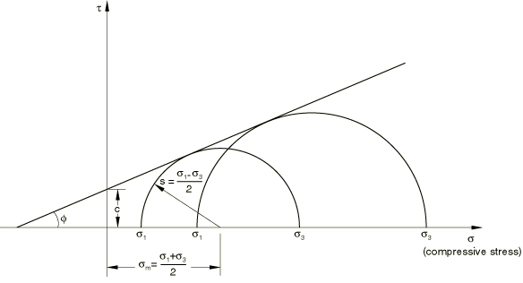

Therefore, the Mohr-Coulomb model is defined by

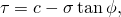

where  is negative in compression. From Mohr's circle, 

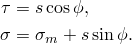

Substituting for  and , multiplying both sides by 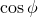, and reducing, the Mohr-Coulomb model can be written as 


where 


is half of the difference between the maximum principal stress, , and the minimum principal stress,  (and is, therefore, the maximum shear stress), 

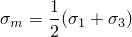

is the average of the maximum and minimum principal stresses, and  is the friction angle.

For general states of stress the model is more conveniently written in terms of three stress invariants as 


where 


is the slope of the Mohr-Coulomb yield surface in the *p*– stress plane (see [Figure 23.3.3--2](pt05ch23s03abm32.md#cmohrcoulomb-yield)), which is commonly referred to as the friction angle of the material and can depend on temperature and predefined field variables;

*c*

is the cohesion of the material; and


is the deviatoric polar angle defined as 


and 


is the equivalent pressure stress,

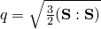

is the Mises equivalent stress,


is the third invariant of deviatoric stress, and 


is the deviatoric stress.

The friction angle, , controls the shape of the yield surface in the deviatoric plane as shown in [Figure 23.3.3--2](pt05ch23s03abm32.md#cmohrcoulomb-yield). The tension cutoff surface is shown for a meridional angle of . The friction angle range is . In the case of  the Mohr-Coulomb model reduces to the pressure-independent Tresca model with a perfectly hexagonal deviatoric section. In the case of 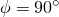 the Mohr-Coulomb model reduces to the “tension cutoff” Rankine model with a triangular deviatoric section and 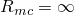 (this limiting case is not permitted within the Mohr-Coulomb model described here).

When using one-element tests to verify the calibration of the model, the output variables SP1, SP2, and SP3 correspond to the principal stresses , , and , respectively.

**Figure 23.3.3–2** Mohr-Coulomb and tension cutoff surfaces in meridional and deviatoric planes.

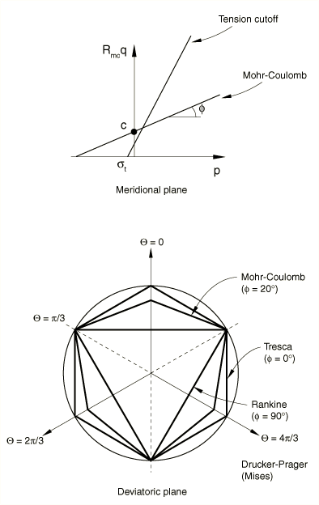

 Isotropic cohesion hardening is assumed for the hardening behavior of the Mohr-Coulomb yield surface. The hardening curve must describe the cohesion yield stress as a function of plastic strain and, possibly, temperature and predefined field variables. In defining this dependence at finite strains, “true” (Cauchy) stress and logarithmic strain values should be given. An optional tension cutoff hardening (or softening) curve can be specified 

Rate dependency effects are not accounted for in this plasticity model.

| **Input File Usage: ** | Use the following options to specify the Mohr-Coulomb yield surface and cohesion hardening: |
| --- | --- |
|  | ``` [*MOHR COULOMB](../key/key-link.md#usb-kws-mmohrcoulomb) ``` ``` [*MOHR COULOMB HARDENING](../key/key-link.md#usb-kws-mmohrcoulombhardening) ``` |

| **Abaqus/CAE Usage: ** | Use the following options to specify the Mohr-Coulomb yield surface and cohesion hardening: |
| --- | --- |
|  | Property module: material editor: ****Mechanical****Plasticity****Mohr Coulomb Plasticity**** Property module: material editor: ****Mechanical****Plasticity****Mohr Coulomb Plasticity****: **Cohesion** |

#### Rankine surface

In Abaqus tension cutoff is modeled using the Rankine surface, which is written as

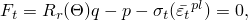

 where 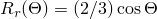, and  is the tension cutoff value representing softening (or hardening) of the Rankine surface, as a function of tensile equivalent plastic strain, .

| **Input File Usage: ** | Use the following option to specify hardening or softening for the Rankine surface: |
| --- | --- |
|  | ``` [*TENSION CUTOFF](../key/key-link.md#usb-kws-mtensioncutoff) ``` |

| **Abaqus/CAE Usage: ** | Use the following option to specify hardening or softening for the Rankine surface: |
| --- | --- |
|  | Property module: material editor: ****Mechanical****Plasticity****Mohr Coulomb Plasticity****: toggle on **Specify tension cutoff**; **Tension Cutoff** |

### Plastic behavior: flow potentials

The flow potentials used for the Mohr-Coulomb yield surface and the tension cutoff surface are described below.

#### Plastic flow on the Mohr-Coulomb yield surface

The flow potential, *G*, for the Mohr-Coulomb yield surface is chosen as a hyperbolic function in the meridional stress plane and the smooth elliptic function proposed by Mentrey and Willam (1995) in the deviatoric stress plane: 

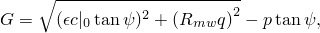

where 

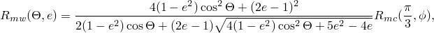

and 

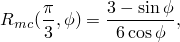


is the dilation angle measured in the *p*– plane at high confining pressure and can depend on temperature and predefined field variables;


is the initial cohesion yield stress, ;


is the deviatoric polar angle defined previously;


is a parameter, referred to as the meridional eccentricity, that defines the rate at which the hyperbolic function approaches the asymptote (the flow potential tends to a straight line in the meridional stress plane as the meridional eccentricity tends to zero); and

*e*

is a parameter, referred to as the deviatoric eccentricity, that describes the “out-of-roundedness” of the deviatoric section in terms of the ratio between the shear stress along the extension meridian () and the shear stress along the compression meridian ().

A default value of  is provided for the meridional eccentricity, .

By default, the deviatoric eccentricity, *e*, is calculated as 

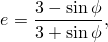

where  is the Mohr-Coulomb friction angle; this calculation corresponds to matching the flow potential to the yield surface in both triaxial tension and compression in the deviatoric plane. Alternatively, Abaqus allows you to consider this deviatoric eccentricity as an independent material parameter; in this case you provide its value directly. Convexity and smoothness of the elliptic function requires that . The upper limit,  (or  0 when you do not specify the value of *e*), leads to , which describes the Mises circle in the deviatoric plane. The lower limit,  (or  90 when you do not specify the value of *e*), leads to 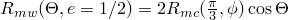 and would describe the Rankine triangle in the deviatoric plane (this limiting case is not permitted within the Mohr-Coulomb model described here).

This flow potential, which is continuous and smooth, ensures that the flow direction is always uniquely defined. A family of hyperbolic potentials in the meridional stress plane is shown in [Figure 23.3.3--3](pt05ch23s03abm32.md#cmohrcoulomb-flow-merid), and the flow potential in the deviatoric stress plane is shown in [Figure 23.3.3--4](pt05ch23s03abm32.md#cmohrcoulomb-flow-devia).

**Figure 23.3.3–3** Family of hyperbolic flow potentials in the meridional stress plane.


**Figure 23.3.3–4** Mentrey-Willam flow potential in the deviatoric stress plane.

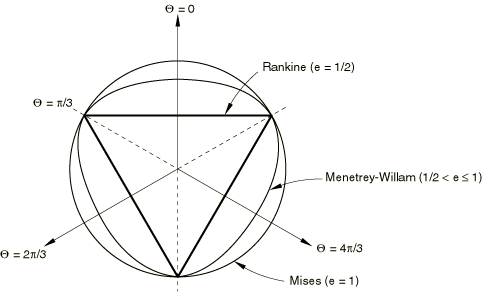

Flow in the meridional stress plane can be close to associated when the angle of friction, , and the angle of dilation, , are equal and the meridional eccentricity, , is very small; however, flow in this plane is, in general, nonassociated. Flow in the deviatoric stress plane is always nonassociated.

| **Input File Usage: ** | Use the following option to allow Abaqus to calculate the value of *e* (default): |
| --- | --- |
|  | ``` [*MOHR COULOMB](../key/key-link.md#usb-kws-mmohrcoulomb) ``` Use the following option to specify the value of *e* directly: ``` [*MOHR COULOMB](../key/key-link.md#usb-kws-mmohrcoulomb), DEVIATORIC ECCENTRICITY=*e* ``` |

| **Abaqus/CAE Usage: ** | Use the following option to allow Abaqus to calculate the value of *e* (default): |
| --- | --- |
|  | Property module: material editor: ****Mechanical****Plasticity****Mohr Coulomb Plasticity****: **Plasticity**: **Deviatoric eccentricity:** **Calculated default** Use the following option to specify the value of *e* directly: Property module: material editor: ****Mechanical****Plasticity****Mohr Coulomb Plasticity****: **Plasticity**: **Deviatoric eccentricity:** **Specify:** *e* |

#### Plastic flow on the Rankine surface

A flow potential that results in a nearly associative flow is chosen for the Rankine surface and is constructed by modifying the Mentrey-Willam potential described earlier:


where 

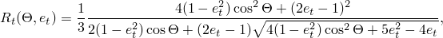


is the initial value of tension cutoff;


is the meridional eccentricity, similar to  defined earlier; and

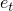

is the deviatoric eccentricity, similar to  defined earlier.

Abaqus uses values of  and , for  and , respectively.

#### Nonassociated flow

Since the plastic flow is nonassociated in general, the use of this Mohr-Coulomb model generally requires the unsymmetric matrix storage and solution scheme in Abaqus/Standard (see ["Defining an analysis," Section 6.1.2](pt03ch06s01abo05.md)).

### Elements

The Mohr-Coulomb plasticity model can be used with any stress/displacement elements other than one-dimensional elements (beam, pipe, and truss elements) or elements for which the assumed stress state is plane stress (plane stress, shell, and membrane elements).

### Output

In addition to the standard output identifiers available in Abaqus (["Abaqus/Standard output variable identifiers," Section 4.2.1](pt02ch04s02abv01.md), and ["Abaqus/Explicit output variable identifiers," Section 4.2.2](pt02ch04s02xbv01.md)), the following variables are available for the Mohr-Coulomb plasticity model:

| PEEQ | Equivalent plastic strain, 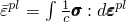, where *c* is the cohesion yield stress. |
| --- | --- |

| PEEQT | Tensile equivalent plastic strain, , on the tension cutoff yield surface. |
| --- | --- |

#### Additional reference

- Mentrey, Ph., and K. J. Willam, "Triaxial Failure Criterion for Concrete and its Generalization," ACI Structural Journal, vol. 92, pp. 311--318, May/June 1995.


