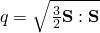
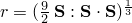
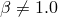
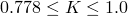
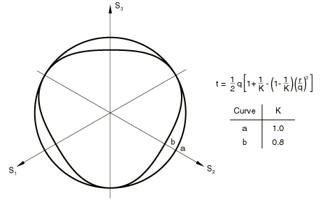
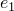
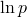
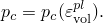
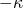
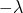

# 23.3.4 Critical state (clay) plasticity model


**Products: **Abaqus/Standard  Abaqus/Explicit  Abaqus/CAE  

##### **References**

- ["Material library: overview," Section 21.1.1](pt05ch21s01abo18.md)
- ["Inelastic behavior," Section 23.1.1](pt05ch23s01abo20.md)
- [*CLAY PLASTICITY](../key/key-link.md#usb-kws-mclayplast)
- [*CLAY HARDENING](../key/key-link.md#usb-kws-mclayhardening)
- ["Defining clay plasticity" in "Defining plasticity," Section 12.9.2 of the Abaqus/CAE User's Guide](../usi/usi-link.md#usi-prp-mechanical-plastic-clay)
- ["Critical state models," Section 4.4.3 of the Abaqus Theory Guide](../stm/stm-link.md#stm-mat-criticalstate)

### Overview

The clay plasticity model provided in Abaqus:
- describes the inelastic behavior of the material by a yield function that depends on the three stress invariants, an associated flow assumption to define the plastic strain rate, and a strain hardening theory that changes the size of the yield surface according to the inelastic volumetric strain;
- requires that the elastic part of the deformation be defined by using the linear elastic material model (["Linear elastic behavior," Section 22.2.1](pt05ch22s02abm02.md)) or, in Abaqus/Standard, the porous elastic material model (["Elastic behavior of porous materials," Section 22.3.1](pt05ch22s03abm05.md)) within the same material definition; and
- allows for the hardening law to be defined by a piecewise linear form or, in Abaqus/Standard, by an exponential form.

### Yield surface

The model is based on the yield surface 


where 


is the equivalent pressure stress;


is a deviatoric stress measure;



is the Mises equivalent stress;



is the third stress invariant;

*M*

is a constant that defines the slope of the critical state line;


is a constant that is equal to 1.0 on the “dry” side of the critical state line () but may be different from 1.0 on the “wet” side of the critical state line ( introduces a different ellipse on the wet side of the critical state line; i.e., a tighter “cap” is obtained if  as shown in [Figure 23.3.4--1](pt05ch23s03abm33.md#cclayplas-yield-p-t));


is the size of the yield surface ([Figure 23.3.4--1](pt05ch23s03abm33.md#cclayplas-yield-p-t)); and

*K*

is the ratio of the flow stress in triaxial tension to the flow stress in triaxial compression and determines the shape of the yield surface in the plane of principal deviatoric stresses (the “-plane”: see [Figure 23.3.4--2](pt05ch23s03abm33.md#cclay-yield-pi)); Abaqus requires that  to ensure that the yield surface remains convex.

The user-defined parameters *M*, , and *K* can depend on temperature  as well as other predefined field variables, . The model is described in detail in ["Critical state models," Section 4.4.3 of the Abaqus Theory Guide](../stm/stm-link.md#stm-mat-criticalstate).

| **Input File Usage: ** | ``` [*CLAY PLASTICITY](../key/key-link.md#usb-kws-mclayplast) ``` |
| --- | --- |

| **Abaqus/CAE Usage: ** | Property module: material editor: ****Mechanical****Plasticity****Clay Plasticity**** |
| --- | --- |

**Figure 23.3.4–1** Clay yield surfaces in the *p*–*t* plane.


**Figure 23.3.4–2** Clay yield surface sections in the -plane.



### Hardening law

The hardening law can have an exponential form (Abaqus/Standard only), or a piecewise linear form.

#### Exponential form in Abaqus/Standard

The exponential form of the hardening law is written in terms of some of the porous elasticity parameters and, therefore, can be used only in conjunction with the Abaqus/Standard porous elastic material model. The size of the yield surface at any time is determined by the initial value of the hardening parameter, , and the amount of inelastic volume change that occurs according to the equation 


where 


is the inelastic volume change (that part of *J*, the ratio of current volume to initial volume, attributable to inelastic deformation);


is the logarithmic bulk modulus of the material defined for the porous elastic material behavior;


is the logarithmic hardening constant defined for the clay plasticity material behavior; and


is the user-defined initial void ratio (["Defining initial void ratios in a porous medium" in "Initial conditions in Abaqus/Standard and Abaqus/Explicit," Section 34.2.1](pt07ch34s02aus116.md#usb-prc-pinitialcond-voidratio)).

##### Specifying the initial size of the yield surface directly

The initial size of the yield surface is defined for clay plasticity by specifying the hardening parameter, , as a tabular function or by defining it analytically.

 can be defined along with , *M*, , and *K*, as a tabular function of temperature and other predefined field variables. However,  is a function only of the initial conditions; it will not change if temperatures and field variables change during the analysis.

| **Input File Usage: ** | Use all of the following options: |
| --- | --- |
|  | ``` [*INITIAL CONDITIONS](../key/key-link.md#usb-kws-minitialcond), TYPE=RATIO [*POROUS ELASTIC](../key/key-link.md#usb-kws-mporouselastic) [*CLAY PLASTICITY](../key/key-link.md#usb-kws-mclayplast), HARDENING=EXPONENTIAL ``` |

| **Abaqus/CAE Usage: ** | Use all of the following options: |
| --- | --- |
|  | Property module: material editor: ****Mechanical****Elasticity****Porous Elastic********Mechanical****Plasticity****Clay Plasticity****: **Hardening: Exponential** Load module: **Create Predefined Field**: **Step: Initial**: choose **Other** for the **Category** and **Void ratio** for the **Types for Selected Step** |

##### Specifying the initial size of the yield surface indirectly

The hardening parameter  can be defined indirectly by specifying , which is the intercept of the virgin consolidation line with the void ratio axis in the plot of void ratio, *e*, versus the logarithm of the effective pressure stress,  ([Figure 23.3.4--3](pt05ch23s03abm33.md#cclayplas-pure-comp)). 

**Figure 23.3.4–3** Pure compression behavior for clay model.


If this method is used,  is defined by 


where  is the user-defined initial value of the equivalent hydrostatic pressure stress (see ["Defining initial stresses" in "Initial conditions in Abaqus/Standard and Abaqus/Explicit," Section 34.2.1](pt07ch34s02aus116.md#usb-prc-pinitialcond-stress)). You define , , *M*, , and *K*; all the parameters except  can be dependent on temperature and other predefined field variables. However,  is a function only of the initial conditions; it will not change if temperatures and field variables change during the analysis.

| **Input File Usage: ** | Use all of the following options: |
| --- | --- |
|  | ``` [*INITIAL CONDITIONS](../key/key-link.md#usb-kws-minitialcond), TYPE=RATIO [*INITIAL CONDITIONS](../key/key-link.md#usb-kws-minitialcond), TYPE=STRESS [*POROUS ELASTIC](../key/key-link.md#usb-kws-mporouselastic) [*CLAY PLASTICITY](../key/key-link.md#usb-kws-mclayplast), HARDENING=EXPONENTIAL, INTERCEPT= ``` |

| **Abaqus/CAE Usage: ** | Use all of the following options: |
| --- | --- |
|  | Property module: material editor: ****Mechanical****Elasticity****Porous Elastic********Mechanical****Plasticity****Clay Plasticity****: **Hardening: Exponential**, **Intercept:**  Load module: **Create Predefined Field**: **Step: Initial**: choose **Other** for the **Category** and **Void ratio** for the **Types for Selected Step** Load module: **Create Predefined Field**: **Step: Initial**: choose **Other** for the **Category** and **Stress** for the **Types for Selected Step** |

#### Piecewise linear form

If the piecewise linear form of the hardening rule is used, the user-defined relationship relates the yield stress in hydrostatic compression, , to the corresponding volumetric plastic strain,  ([Figure 23.3.4--4](pt05ch23s03abm33.md#cclayplas-hard-soft)): 



**Figure 23.3.4–4** Typical piecewise linear clay hardening/softening curve.


The evolution parameter, *a*, is then given by 


The volumetric plastic strain axis has an arbitrary origin:  is the position on this axis corresponding to the initial state of the material, thus defining the initial hydrostatic pressure, , and, hence, the initial yield surface size, . This relationship is defined in tabular form as clay hardening data. The range of values for which  is defined should be sufficient to include all values of equivalent pressure stress to which the material will be subjected during the analysis.

This form of the hardening law can be used in conjunction with either the linear elastic or, in Abaqus/Standard, the porous elastic material models. This is the only form of the hardening law supported in Abaqus/Explicit

| **Input File Usage: ** | Use both of the following options: |
| --- | --- |
|  | ``` [*CLAY PLASTICITY](../key/key-link.md#usb-kws-mclayplast), HARDENING=TABULAR [*CLAY HARDENING](../key/key-link.md#usb-kws-mclayhardening) ``` |

| **Abaqus/CAE Usage: ** | Property module: material editor: ****Mechanical****Plasticity****Clay Plasticity****: **Hardening: Tabular**, ****Suboptions****Compressive Clay Hardening**** |
| --- | --- |

### Calibration

At least two experiments are required to calibrate the simplest version of the Cam-clay model: a hydrostatic compression test (an oedometer test is also acceptable) and a triaxial compression test (more than one triaxial test is useful for a more accurate calibration).

#### Hydrostatic compression tests

The hydrostatic compression test is performed by pressurizing the sample equally in all directions. The applied pressure and the volume change are recorded.

The onset of yielding in the hydrostatic compression test immediately provides the initial position of the yield surface, . The logarithmic bulk moduli,  and , are determined from the hydrostatic compression experimental data by plotting the logarithm of pressure versus void ratio. The void ratio, *e*, is related to the measured volume change as 


The slope of the line obtained for the elastic regime is , and the slope in the inelastic range is . For a valid model .

#### Triaxial tests

Triaxial compression experiments are performed using a standard triaxial machine where a fixed confining pressure is maintained while the differential stress is applied. Several tests covering the range of confining pressures of interest are usually performed. Again, the stress and strain in the direction of loading are recorded, together with the lateral strain so that the correct volume changes can be calibrated.

The triaxial compression tests allow the calibration of the yield parameters *M* and . *M* is the ratio of the shear stress, *q*, to the pressure stress, *p*, at critical state and can be obtained from the stress values when the material has become perfectly plastic (critical state).  represents the curvature of the cap part of the yield surface and can be calibrated from a number of triaxial tests at high confining pressures (on the “wet” side of critical state).  must be between 0.0 and 1.0.

To calibrate the parameter *K*, which controls the yield dependence on the third stress invariant, experimental results obtained from a true triaxial (cubical) test are necessary. These results are generally not available, and you may have to guess (the value of *K* is generally between 0.8 and 1.0) or ignore this effect.

#### Unloading measurements

Unloading measurements in hydrostatic and triaxial compression tests are useful to calibrate the elasticity, particularly in cases where the initial elastic region is not well defined. From these we can identify whether a constant shear modulus or a constant Poisson's ratio should be used and what their values are.

### Initial conditions

If an initial stress at a point is given (see ["Defining initial stresses" in "Initial conditions in Abaqus/Standard and Abaqus/Explicit," Section 34.2.1](pt07ch34s02aus116.md#usb-prc-pinitialcond-stress)) such that the stress point lies outside the initially defined yield surface, Abaqus will try to adjust the initial position of the surface to make the stress point lie on it and issue a warning. However, if the stress point is such that the equivalent pressure stress, *p*, is negative, an error message will be issued and execution will be terminated.

### Elements

The clay plasticity model can be used with plane strain, generalized plane strain, axisymmetric, and three-dimensional solid (continuum) elements in Abaqus. This model cannot be used with elements for which the assumed stress state is plane stress (plane stress, shell, and membrane elements).

### Output

In addition to the standard output identifiers available in Abaqus (["Abaqus/Standard output variable identifiers," Section 4.2.1](pt02ch04s02abv01.md), and ["Abaqus/Explicit output variable identifiers," Section 4.2.2](pt02ch04s02xbv01.md)), the following variable has special meaning for material points in the clay plasticity model:

| PEEQ | Center of the yield surface, *a*. |
| --- | --- |


