# 23.3.5 Crushable foam plasticity models


**Products: **Abaqus/Standard  Abaqus/Explicit  Abaqus/CAE  

##### **References**

- ["Material library: overview," Section 21.1.1](pt05ch21s01abo18.md)
- ["Inelastic behavior," Section 23.1.1](pt05ch23s01abo20.md)
- ["Rate-dependent yield," Section 23.2.3](pt05ch23s02abm19.md)
- [*CRUSHABLE FOAM](../key/key-link.md#usb-kws-mcrushfoam)
- [*CRUSHABLE FOAM HARDENING](../key/key-link.md#usb-kws-mcrushfoamhardening)
- [*RATE DEPENDENT](../key/key-link.md#usb-kws-mratedependent)
- ["Defining crushable foam plasticity" in "Defining plasticity," Section 12.9.2 of the Abaqus/CAE User's Guide](../usi/usi-link.md#usi-prp-mechanical-plastic-crushablefoam)

### Overview

The crushable foam plasticity models:
- are intended for the analysis of crushable foams that are typically used as energy absorption structures;
- can be used to model crushable materials other than foams (such as balsa wood);
- are used to model the enhanced ability of a foam material to deform in compression due to cell wall buckling processes (it is assumed that the resulting deformation is not recoverable instantaneously and can, thus, be idealized as being plastic for short duration events);
- can be used to model the difference between a foam material's compressive strength and its much smaller tensile bearing capacity resulting from cell wall breakage in tension;
- must be used in conjunction with the linear elastic material model (["Linear elastic behavior," Section 22.2.1](pt05ch22s02abm02.md));
- can be used when rate-dependent effects are important; and
- are intended to simulate material response under essentially monotonic loading.

### Elastic and plastic behavior

The elastic part of the response is specified as described in ["Linear elastic behavior," Section 22.2.1](pt05ch22s02abm02.md). Only linear isotropic elasticity can be used.

For the plastic part of the behavior, the yield surface is a Mises circle in the deviatoric stress plane and an ellipse in the meridional (*p*–*q*) stress plane. Two hardening models are available: the volumetric hardening model, where the point on the yield ellipse in the meridional plane that represents hydrostatic tension loading is fixed and the evolution of the yield surface is driven by the volumetric compacting plastic strain, and the isotropic hardening model, where the yield ellipse is centered at the origin in the *p*–*q* stress plane and evolves in a geometrically self-similar manner. This phenomenological isotropic model was originally developed for metallic foams by Deshpande and Fleck (2000).

The hardening curve must describe the uniaxial compression yield stress as a function of the corresponding plastic strain. In defining this dependence at finite strains, “true” (Cauchy) stress and logarithmic strain values should be given. Both models predict similar behavior for compression-dominated loading. However, for hydrostatic tension loading the volumetric hardening model assumes a perfectly plastic behavior, while the isotropic hardening model predicts the same behavior in both hydrostatic tension and hydrostatic compression.

### Crushable foam model with volumetric hardening

The crushable foam model with volumetric hardening uses a yield surface with an elliptical dependence of deviatoric stress on pressure stress. It assumes that the evolution of the yield surface is controlled by the volumetric compacting plastic strain experienced by the material. 

#### Yield surface

The yield surface for the volumetric hardening model is defined as


where

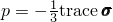

is the pressure stress,


is the Mises stress,


is the deviatoric stress,

*A*

is the size of the (horizontal) *p*-axis of the yield ellipse,

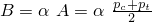

is the size of the (vertical) *q*-axis of the yield ellipse,

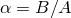

is the shape factor of the yield ellipse that defines the relative magnitude of the axes,


is the center of the yield ellipse on the *p*-axis,


is the strength of the material in hydrostatic tension, and


is the yield stress in hydrostatic compression ( is always positive).

The yield surface represents the Mises circle in the deviatoric stress plane and is an ellipse on the meridional stress plane, as depicted in [Figure 23.3.5--1](pt05ch23s03abm34.md#ccrushfoam-vol).

**Figure 23.3.5–1** Crushable foam model with volumetric hardening: yield surface and flow potential in the *p*–*q* stress plane.


The yield surface evolves in a self-similar fashion (constant ); and the shape factor can be computed using the initial yield stress in uniaxial compression, , the initial yield stress in hydrostatic compression,  (the initial value of ), and the yield strength in hydrostatic tension, :


For a valid yield surface the choice of strength ratios must be such that 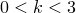 and . If this is not the case, Abaqus issues an error message and terminates execution.

To define the shape of the yield surface, you provide the values of *k* and . If desired, these variables can be defined as a tabular function of temperature and other predefined field variables. In this case the model requires that the hardening curve (described below) be also specified for the same values of temperature and predefined field variables.

| **Input File Usage: ** | ``` [*CRUSHABLE FOAM](../key/key-link.md#usb-kws-mcrushfoam), HARDENING=VOLUMETRIC ``` |
| --- | --- |

| **Abaqus/CAE Usage: ** | Property module: material editor: ****Mechanical****Plasticity****Crushable Foam****: **Hardening: Volumetric** |
| --- | --- |

##### Calibration

To use this model, one needs to know the initial yield stress in uniaxial compression, ; the initial yield stress in hydrostatic compression, ; and the yield strength in hydrostatic tension, . Since foam materials are rarely tested in tension, it is usually necessary to guess the magnitude of the strength of the foam in hydrostatic tension, . The choice of tensile strength should not have a strong effect on the numerical results unless the foam is stressed in hydrostatic tension. A common approximation is to set  equal to 5% to 10% of the initial yield stress in hydrostatic compression ; thus, = 0.05 to 0.10.

#### Flow potential

The plastic strain rate for the volumetric hardening model is assumed to be


where *G* is the flow potential, chosen in this model as 

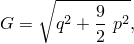

and  is the equivalent plastic strain rate defined as


The equivalent plastic strain rate is related to the rate of axial plastic strain, 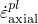, in uniaxial compression by

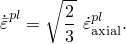

A geometrical representation of the flow potential in the *p*–*q* stress plane is shown in [Figure 23.3.5--1](pt05ch23s03abm34.md#ccrushfoam-vol). This potential gives a direction of flow that is identical to the stress direction for radial paths. This is motivated by simple laboratory experiments that suggest that loading in any principal direction causes insignificant deformation in the other directions. As a result, the plastic flow is nonassociative for the volumetric hardening model. For more details regarding plastic flow, see ["Plasticity models: general discussion," Section 4.2.1 of the Abaqus Theory Guide](../stm/stm-link.md#stm-mat-plastoverview).

##### Nonassociated flow

The nonassociated plastic flow rule makes the material stiffness matrix unsymmetric; therefore, the unsymmetric matrix storage and solution scheme should be used in Abaqus/Standard (see ["Defining an analysis," Section 6.1.2](pt03ch06s01abo05.md)). Usage of this scheme is especially important when large regions of the model are expected to flow plastically. 

#### Hardening

The yield surface intersects the *p*-axis at  and . We assume that  remains fixed throughout any plastic deformation process. By contrast, the compressive strength, , evolves as a result of compaction (increase in density) or dilation (reduction in density) of the material. The evolution of the yield surface can be expressed through the evolution of the yield surface size on the hydrostatic stress axis, , as a function of the value of volumetric compacting plastic strain, . With  constant, this relation can be obtained from user-provided uniaxial compression test data using

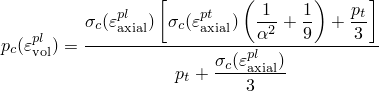

along with the fact that 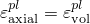 in uniaxial compression for the volumetric hardening model. Thus, you provide input to the hardening law by specifying, in the usual tabular form, only the value of the yield stress in uniaxial compression as a function of the absolute value of the axial plastic strain. The table must start with a zero plastic strain (corresponding to the virgin state of the material), and the tabular entries must be given in ascending magnitude of 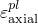. If desired, the yield stress can also be a function of temperature and other predefined field variables. In this case the model requires that the values of the strength ratios *k* and  be also specified for the same values of temperature and predefined field variables.

| **Input File Usage: ** | ``` [*CRUSHABLE FOAM HARDENING](../key/key-link.md#usb-kws-mcrushfoamhardening) ``` |
| --- | --- |

| **Abaqus/CAE Usage: ** | Property module: material editor: ****Mechanical****Plasticity****Crushable Foam****: ****Suboptions****Foam Hardening**** |
| --- | --- |

#### Rate dependence

As strain rates increase, many materials show an increase in the yield stress. For many crushable foam materials this increase in yield stress becomes important when the strain rates are in the range of 0.1–1 per second and can be very important if the strain rates are in the range of 10–100 per second, as commonly occurs in high-energy dynamic events.

Two methods for specifying strain-rate-dependent material behavior are available in Abaqus as discussed below. Both methods assume that the shapes of the hardening curves at different strain rates are similar, and either can be used in static or dynamic procedures. When rate dependence is included, the static stress-strain hardening behavior must be specified for the crushable foam as described above.

##### Overstress power law

You can specify a Cowper-Symonds overstress power law that defines strain rate dependence. This law has the form


with

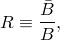

where *B* is the size of the static yield surface and  is the size of the yield surface at a nonzero strain rate. The ratio *R* can be written as 

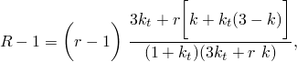

 where *r* is the uniaxial compression yield stress ratio defined by

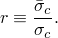

, specified as part of the crushable foam hardening definition, is the uniaxial compression yield stress at a given value of  for the experiment with the lowest strain rate and can depend on temperature and predefined field variables; *D* and *n* are material parameters that can be functions of temperature and, possibly, of other predefined field variables.

| **Input File Usage: ** | Use both of the following options: |
| --- | --- |
|  | ``` [*CRUSHABLE FOAM HARDENING](../key/key-link.md#usb-kws-mcrushfoamhardening) [*RATE DEPENDENT](../key/key-link.md#usb-kws-mratedependent), TYPE=POWER LAW ``` |

| **Abaqus/CAE Usage: ** | Property module: material editor: ****Mechanical****Plasticity****Crushable Foam****: ****Suboptions****Foam Hardening****; ****Suboptions****Rate Dependent****: **Hardening: Power Law** |
| --- | --- |

The power-law rate dependency can be rewritten in the following form

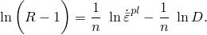

The procedure outlined below can be followed to obtain the material parameters *D* and *n* based on the uniaxial compression test data.

1. Compute *R* using the uniaxial compression yield stress ratio, *r*.
2. Convert the rate of the axial plastic strain, , to the corresponding equivalent plastic strain rate, .
3. Plot 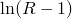 versus 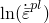. If the curve can be approximated by a straight line such as that shown in [Figure 23.3.5--2](pt05ch23s03abm34.md#ccrushfoam-power-law-cal), the overstress power law is suitable. The slope of the line is , and the intercept of the  axis is 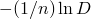.

**Figure 23.3.5–2** Calibration of overstress power law data.


##### Tabular input of yield ratio

Rate-dependent behavior can alternatively be specified by giving a table of the ratio 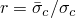 as a function of the absolute value of the rate of the axial plastic strain and, optionally, temperature and predefined field variables.

| **Input File Usage: ** | Use both of the following options: |
| --- | --- |
|  | ``` [*CRUSHABLE FOAM HARDENING](../key/key-link.md#usb-kws-mcrushfoamhardening) [*RATE DEPENDENT](../key/key-link.md#usb-kws-mratedependent), TYPE=YIELD RATIO ``` |

| **Abaqus/CAE Usage: ** | Property module: material editor: ****Mechanical****Plasticity****Crushable Foam****: ****Suboptions****Foam Hardening****; ****Suboptions****Rate Dependent****: **Hardening: Yield Ratio** |
| --- | --- |

#### Initial conditions

When we need to study the behavior of a material that has already been subjected to some hardening, Abaqus allows you to prescribe initial conditions for the volumetric compacting plastic strain,  (see ["Defining initial values of state variables for plastic hardening" in "Initial conditions in Abaqus/Standard and Abaqus/Explicit," Section 34.2.1](pt07ch34s02aus116.md#usb-prc-pinitialcond-hardening)).

| **Input File Usage: ** | ``` [*INITIAL CONDITIONS](../key/key-link.md#usb-kws-minitialcond), TYPE=HARDENING ``` |
| --- | --- |

| **Abaqus/CAE Usage: ** | Load module: **Create Predefined Field**: **Step: Initial**, choose **Mechanical** for the **Category** and **Hardening** for the **Types for Selected Step** |
| --- | --- |

### Crushable foam model with isotropic hardening

The isotropic hardening model uses a yield surface that is an ellipse centered at the origin in the *p*–*q* stress plane. The yield surface evolves in a self-similar manner, and the evolution is governed by the equivalent plastic strain (to be defined later).

#### Yield surface

The yield surface for the isotropic hardening model is defined as

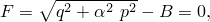

where


is the pressure stress,


is the Mises stress,


is the deviatoric stress,

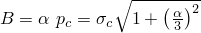

is the size of the (vertical) *q*-axis of the yield ellipse,


is the shape factor of the yield ellipse that defines the relative magnitude of the axes,


is the yield stress in hydrostatic compression, and


is the absolute value of the yield stress in uniaxial compression.

The yield surface represents the Mises circle in the deviatoric stress plane. The shape of the yield surface in the meridional stress plane is depicted in [Figure 23.3.5--3](pt05ch23s03abm34.md#ccrushfoam-iso). The shape factor, , can be computed using the initial yield stress in uniaxial compression, , and the initial yield stress in hydrostatic compression,  (the initial value of ), using the relation:


**Figure 23.3.5–3** Crushable foam model with isotropic hardening: yield surface and flow potential in the *p*–*q* stress plane.

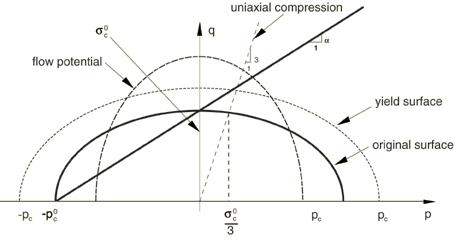

To define the shape of the yield ellipse, you provide the value of *k*. For a valid yield surface the strength ratio must be such that . The particular case of  corresponds to the Mises plasticity. In general, the initial yield strengths in uniaxial compression and in hydrostatic compression,  and , can be used to calculate the value of *k*. However, in many practical cases the stress versus strain response curves of crushable foam materials do not show clear yielding points, and the initial yield stress values cannot be determined exactly. Many of these response curves have a horizontal plateau—the yield stress is nearly a constant for a significantly large range of plastic strain values. If you have data from both uniaxial compression and hydrostatic compression, the plateau values of the two experimental curves can be used to calculate the ratio of *k*.

| **Input File Usage: ** | ``` [*CRUSHABLE FOAM](../key/key-link.md#usb-kws-mcrushfoam), HARDENING=ISOTROPIC ``` |
| --- | --- |

| **Abaqus/CAE Usage: ** | Property module: material editor: ****Mechanical****Plasticity****Crushable Foam****: **Hardening: Isotropic** |
| --- | --- |

#### Flow potential

The flow potential for the isotropic hardening model is chosen as


where  represents the shape of the flow potential ellipse on the *p*–*q* stress plane. It is related to the plastic Poisson's ratio, , via


The plastic Poisson's ratio, which is the ratio of the transverse to the longitudinal plastic strain under uniaxial compression, must be in the range of 1 and 0.5; and the upper limit () corresponds to the case of incompressible plastic flow (). For many low-density foams the plastic Poisson's ratio is nearly zero, which corresponds to a value of 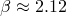. 

The plastic flow is associated when the value of  is the same as that of . By default, the plastic flow is nonassociated to allow for the independent calibrations of the shape of the yield surface and the plastic Poisson's ratio. If you have information only about the plastic Poisson's ratio and choose to use associated plastic flow, the yield stress ratio *k* can be calculated from

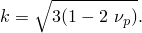

Alternatively, if only the shape of the yield surface is known and you choose to use associated plastic flow, the plastic Poisson's ratio can be obtained from

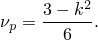

You provide the value of .

| **Input File Usage: ** | ``` [*CRUSHABLE FOAM](../key/key-link.md#usb-kws-mcrushfoam), HARDENING=ISOTROPIC ``` |
| --- | --- |

| **Abaqus/CAE Usage: ** | Property module: material editor: ****Mechanical****Plasticity****Crushable Foam****: **Hardening: Isotropic** |
| --- | --- |

#### Hardening

A simple uniaxial compression test is sufficient to define the evolution of the yield surface. The hardening law defines the value of the yield stress in uniaxial compression as a function of the absolute value of the axial plastic strain. The piecewise linear relationship is entered in tabular form. The table must start with a zero plastic strain (corresponding to the virgin state of the materials), and the tabular entries must be given in ascending magnitude of . For values of plastic strain greater than the last user-specified value, the stress-strain relationship is extrapolated based on the last slope computed from the data. If desired, the yield stress can also be a function of temperature and other predefined field variables. 

| **Input File Usage: ** | ``` [*CRUSHABLE FOAM HARDENING](../key/key-link.md#usb-kws-mcrushfoamhardening) ``` |
| --- | --- |

| **Abaqus/CAE Usage: ** | Property module: material editor: ****Mechanical****Plasticity****Crushable Foam****: ****Suboptions****Foam Hardening**** |
| --- | --- |

#### Rate dependence

As strain rates increase, many materials show an increase in the yield stress. For many crushable foam materials this increase in yield stress becomes important when the strain rates are in the range of 0.1–1 per second and can be very important if the strain rates are in the range of 10–100 per second, as commonly occurs in high-energy dynamic events.

Two methods for specifying strain-rate-dependent material behavior are available in Abaqus as discussed below. Both methods assume that the shapes of the hardening curves at different strain rates are similar, and either can be used in static or dynamic procedures. When rate dependence is included, the static stress-strain hardening behavior must be specified for the crushable foam as described above.

##### Overstress power law

You can specify a Cowper-Symonds overstress power law that defines strain rate dependence. This law has the form


with


where , specified as part of the crushable foam hardening definition, is the static uniaxial compression yield stress at a given value of  for the experiment with the lowest strain rate, and 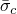 is the yield stress at a nonzero strain rate.  is the equivalent plastic strain rate, which is equal to the rate of the axial plastic strain in uniaxial compression for the isotropic hardening model.

The power-law rate dependency can be rewritten in the following form


Plot  versus . If the curve can be approximated by a straight line such as that shown in [Figure 23.3.5--2](pt05ch23s03abm34.md#ccrushfoam-power-law-cal), the overstress power law is suitable. The slope of the line is , and the intercept of the  axis is . The material parameters *D* and *n* can be functions of temperature and, possibly, of other predefined field variables.

| **Input File Usage: ** | Use both of the following options: |
| --- | --- |
|  | ``` [*CRUSHABLE FOAM HARDENING](../key/key-link.md#usb-kws-mcrushfoamhardening) [*RATE DEPENDENT](../key/key-link.md#usb-kws-mratedependent), TYPE=POWER LAW ``` |

| **Abaqus/CAE Usage: ** | Property module: material editor: ****Mechanical****Plasticity****Crushable Foam****: ****Suboptions****Foam Hardening****; ****Suboptions****Rate Dependent****: **Hardening: Power Law** |
| --- | --- |

##### Tabular input of yield ratio

Rate-dependent behavior can alternatively be specified by giving a table of the ratio *R* as a function of the absolute value of the rate of the axial plastic strain and, optionally, temperature and predefined field variables.

| **Input File Usage: ** | Use both of the following options: |
| --- | --- |
|  | ``` [*CRUSHABLE FOAM HARDENING](../key/key-link.md#usb-kws-mcrushfoamhardening) [*RATE DEPENDENT](../key/key-link.md#usb-kws-mratedependent), TYPE=YIELD RATIO ``` |

| **Abaqus/CAE Usage: ** | Property module: material editor: ****Mechanical****Plasticity****Crushable Foam****: ****Suboptions****Foam Hardening****; ****Suboptions****Rate Dependent****: **Hardening: Yield Ratio** |
| --- | --- |

### Elements

The crushable foam plasticity model can be used with plane strain, generalized plane strain, axisymmetric, and three-dimensional solid (continuum) elements. This model cannot be used with elements for which the stress state is assumed to be planar (plane stress, shell, and membrane elements) or with beam, pipe, or truss elements.

### Output

In addition to the standard output identifiers available in Abaqus (["Abaqus/Standard output variable identifiers," Section 4.2.1](pt02ch04s02abv01.md), and ["Abaqus/Explicit output variable identifiers," Section 4.2.2](pt02ch04s02xbv01.md)), the following variable has special meaning for the crushable foam plasticity model:

| PEEQ | For the volumetric hardening model, PEEQ is the volumetric compacting plastic strain defined as . For the isotropic hardening model, PEEQ is the equivalent plastic strain defined as 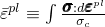, where  is the uniaxial compression yield stress. |
| --- | --- |

The volumetric plastic strain, , is the trace of the plastic strain tensor; you can also calculate it as the sum of direct plastic strain components.

For the volumetric hardening model, the initial values of the volumetric compacting plastic strain can be specified for elements that use the crushable foam material model, as described above. The volumetric compacting plastic strain (output variable PEEQ) provided by Abaqus then contains the initial value of the volumetric compacting plastic strain plus any additional volumetric compacting plastic strain due to plastic straining during the analysis. However, the plastic strain tensor (output variable PE) contains only the amount of straining due to deformation during the analysis.

#### Additional reference

- Deshpande, V. S., and N. A. Fleck, "Isotropic Constitutive Model for Metallic Foams," Journal of the Mechanics and Physics of Solids, vol. 48, pp. 1253--1276, 2000.


