# 23.4.1 Fabric material behavior


**Product: **Abaqus/Explicit  

##### **References**

- ["Material library: overview," Section 21.1.1](pt05ch21s01abo18.md)
- ["Elastic behavior: overview," Section 22.1.1](pt05ch22s01abo19.md)
- ["VFABRIC," Section 1.2.4 of the Abaqus User Subroutines Reference Guide](../sub/sub-link.md#sub-rtn-uexpfabric)
- [*FABRIC](../key/key-link.md#usb-kws-mfabric)
- [*UNIAXIAL](../key/key-link.md#usb-kws-muniaxial)
- [*LOADING DATA](../key/key-link.md#usb-kws-mloadingdata)
- [*UNLOADING DATA](../key/key-link.md#usb-kws-munloadingdata)
- [*EXPANSION](../key/key-link.md#usb-kws-mexpansion)
- [*DENSITY](../key/key-link.md#usb-kws-mdensity)
- [*INITIAL CONDITIONS](../key/key-link.md#usb-kws-minitialcond)

### Overview

The fabric material model:
- is anisotropic and nonlinear;
- is a phenomenological model that captures the mechanical response of a woven fabric made of yarns in the fill and the warp directions;
- is valid for materials that exhibit two "structural" directions that may not be orthogonal to each other with deformation;
- defines the local fabric stresses as a function of change in angle between the fibers (shear strain) and the nominal strains along the yarn directions;
- allows for the computation of local fabric stresses based on test data or through user subroutine [`VFABRIC`](../sub/sub-link.md#sub-xsl-vfabric), which can be used to define a complex constitutive model; and
- requires that geometric nonlinearity be accounted for during the analysis step (["General and linear perturbation procedures," Section 6.1.3](pt03ch06s01aus44.md)), since it is intended for finite-strain applications.

The fabric material model defined based on test data:- assumes that the responses along the fill and the warp directions are independent of each other and that the shear response is independent of the direct response along the yarns;
- can include separate loading and unloading responses;
- can exhibit nonlinear elastic behavior, damaged elastic behavior, or elastic-plastic type behavior with permanent deformation upon complete unloading;
- can deform elastically to large tensile and shear strains; and
- can have properties that depend on temperature and/or other field variables.

### Fabric material behavior

Woven fabrics are used in a number of engineering applications across various industries, including such products as automobile airbags; flexible structures like boat sails and parachutes; reinforcement in composites; architectural expressions in building roof structures; protective vests for military, police, and other security circles; and protective layers around the fuselage in planes. 

Woven fabrics consist of yarns woven in the fill and the warp directions. The yarn is crimped, or curved, as it is woven up and down over the cross yarns. The nonlinear mechanical behavior of the fabric arises from different sources: the nonlinear response of the individual yarns, the exchange of crimp between the fill and the warp yarns as they are stretched, and the contact and friction between the yarns in cross directions and between the yarns in the same direction. In general, the fabric exhibits a significant stiffness only along the yarn directions under tension. The tensile response in the fill and warp directions may be coupled due to the crimp exchange mentioned above. Under in-plane shear deformation, the fill and warp direction yarns rotate with respect to each other. The resistance increases with shear deformation as lateral contact is formed between the yarns in each direction. The fabrics typically have negligible stiffness in bending and in-plane compression.

The behavior of woven fabrics is modeled phenomenologically in Abaqus/Explicit to capture the nonlinear anisotropic behavior of the fabric. The planar kinematic state of a given fabric is described in terms of the nominal direct strains in the fabric plane along the fill and the warp directions and the angle between the two yarn directions. The material orthogonal basis and the yarn local directions are illustrated in [Figure 23.4.1--1](pt05ch23s04abm35.md#cfabric-kinematics-nls) showing the reference and the deformed configurations. 

**Figure 23.4.1–1** Fabric kinematics

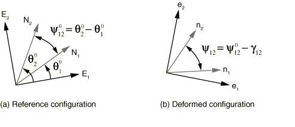

The engineering nominal shear strain, , is defined as the change in angle, 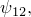 between the two yarn directions going from the reference to the deformed configuration. The nominal strains along the yarn directions  and  in the deformed configuration are computed from the respective yarn stretch values,  and . The corresponding nominal stress components 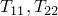, and  are defined as the work conjugate of the above nominal strains.  The fabric nominal stress, , is converted by Abaqus to the Cauchy stress, ; and the subsequent internal forces arising from the fabric deformation are computed. You can obtain output of the fabric nominal strains, the fabric nominal stresses, and the regular Cauchy stresses. The relationship between the Cauchy stress, , and the nominal stress, , is 

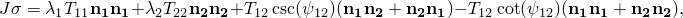

 where  is the volumetric Jacobian.

Either experimental data or a user subroutine, [`VFABRIC`](../sub/sub-link.md#sub-xsl-vfabric), can be used to characterize the Abaqus/Explicit fabric material model, providing the nominal fabric stress as a function of the nominal fabric strains. The user subroutine allows for building a complex material model taking into account both the fabric structural parameters such as yarn spacing, yarn cross-section shape, etc. and the yarn material properties. The test data–based fabric model makes some simplifying assumptions but allows for nonlinear response including energy loss. The two models are presented below in detail. Both models capture the wrinkling of fabric under compression only in a smeared fashion. 

The application of fabric material in a crash simulation is illustrated in ["Side curtain airbag impactor test," Section 3.3.2 of the Abaqus Example Problems Guide](../exa/exa-link.md#exa-veh-airbag). 

### Test data--based fabric materials

The fabric material model based on test data assumes that the responses along the fill and the warp directions are independent of each other and that the shear response is independent of the direct response along the yarn. Hence, each component-wise fabric stress response depends only on the fabric strain in that component. Thus, the overall behavior of the fabric consists of three independent component-wise responses: namely, the direct response along the fill yarn to the nominal strain in the fill yarn, the direct response along the warp yarn to the nominal strain in the warp yarn, and the shear response to the change in angle between the two yarns.

Within each component you must provide test data defining the response of the fabric. To fully define the fabric response, the test data must cover all of the following attributes:
- Within a component, separate test data can be defined for the fabric response in the tensile direction and in the compressive direction.
- Within a deformation direction (tension or compression), both loading and unloading test data can be provided.
- The loading and unloading test data can be classified according to three available behavior types: nonlinear elastic behavior, damaged elastic behavior, or elastic-plastic type behavior with permanent deformation. The behavior type determines how the fabric transitions from its loading response to its unloading response.

 When elastic, the test data in a particular component can also be rate dependent. When separate loading and unloading paths are required, the test data for the two deformation directions (tension and compression) must be given separately. Otherwise, the data for both tension and compression may be given in a single table. 

| **Input File Usage: ** | Use the following options to define a fabric material using test data: |
| --- | --- |
|  | ``` [*FABRIC](../key/key-link.md#usb-kws-mfabric) [*UNIAXIAL](../key/key-link.md#usb-kws-muniaxial), COMPONENT=*component* [*LOADING DATA](../key/key-link.md#usb-kws-mloadingdata), DIRECTION=*deformation direction*, TYPE=*behavior type* *data lines to define loading data* [*UNLOADING DATA](../key/key-link.md#usb-kws-munloadingdata) *data lines to define unloading data* ``` Repeat all of the options underneath [*FABRIC](../key/key-link.md#usb-kws-mfabric) as often as necessary to account for each component and deformation direction. |

#### Specifying uniaxial behavior in a component direction

Independent loading and unloading test data can be provided in each of the three component directions. The components correspond to the response along the fill yarn, the response along the warp yarn, and the shear response.

| **Input File Usage: ** | Use the following option to define the response along the fill yarn direction: |
| --- | --- |
|  | ``` [*UNIAXIAL](../key/key-link.md#usb-kws-muniaxial), COMPONENT=1 ``` Use the following option to define the response along the warp yarn direction: ``` [*UNIAXIAL](../key/key-link.md#usb-kws-muniaxial), COMPONENT=2 ``` Use the following option to define the shear response: ``` [*UNIAXIAL](../key/key-link.md#usb-kws-muniaxial), COMPONENT=SHEAR ``` |

#### Defining the deformation direction

The test data can be defined separately for tension and compression by specifying the deformation direction. If the deformation direction is defined (tension or compression), the tabular values defining tensile or compressive behavior should be specified with positive values of the stress and strain in the specified component and the loading data must start at the origin. If the behavior is not defined in a loading direction, the stress response will be zero in that direction (the fabric has no resistance in that direction).

 If the deformation direction is not defined, the data apply to both tension and compression. However, the behavior is then considered to be nonlinear elastic and no unloading response can be specified. The test data will be considered to be symmetric about the origin if either tensile or compressive data are omitted.

| **Input File Usage: ** | Use the following option to define tensile behavior: |
| --- | --- |
|  | ``` [*LOADING DATA](../key/key-link.md#usb-kws-mloadingdata), DIRECTION=TENSION ``` Use the following option to define compressive behavior: ``` [*LOADING DATA](../key/key-link.md#usb-kws-mloadingdata), DIRECTION=COMPRESSION ``` Use the following option to define both tensile and compressive behavior in a single table: ``` [*LOADING DATA](../key/key-link.md#usb-kws-mloadingdata) ``` |

##### Compressive behavior

 In general, a fabric material does not have significant stiffness under compression. To prevent the collapse of wrinkled elements under compressive loading, the specified stress-strain curve should reinstate the compressive stiffness after a range of zero or very small resistance. 

#### Defining loading/unloading component-wise response for a fabric material

To define the loading response, you specify the fabric stress as nonlinear functions of the fabric strain. This function can also depend on temperature and field variables. See ["Input syntax rules," Section 1.2.1](pt01ch01s02aus01.md), for further information about defining data as functions of temperature and field variables.

The unloading response can be defined in the following different ways:
- You can specify several unloading curves that express the fabric stress as nonlinear functions of the fabric strain; Abaqus interpolates these curves to create an unloading curve that passes through the point of unloading in an analysis.
- You can specify an energy dissipation factor (and a permanent deformation factor for models with permanent deformation), from which Abaqus calculates a quadratic unloading function.
- You can specify an energy dissipation factor (and a permanent deformation factor for models with permanent deformation), from which Abaqus calculates an exponential unloading function.
- You can specify the fabric stress as a nonlinear function of the fabric strain, as well as a transition slope; the fabric unloads along the specified transition slope until it intersects the specified unloading function, at which point it unloads according to the function. (This unloading definition is referred to as combined unloading.)
- You can specify the fabric stress as a nonlinear function of the fabric strain; Abaqus shifts the specified unloading function along the strain axis so that it passes through the point of unloading in an analysis.

The behavior type that is specified for the fabric dictates the type of unloading you can define, as summarized in [Table 23.4.1--1](pt05ch23s04abm35.md#usb-mat-cfabric-unloadtypes). The different behavior types, as well as the associated loading and unloading curves, are discussed in more detail in the sections that follow.

**Table 23.4.1–1** Available unloading definitions for the fabric behavior types.
| Material behavior type | Unloading definition |
| --- | --- |
| Interpolated | Quadratic | Exponential | Combined | Shifted |
| Nonlinear elastic(rate-dependent only) |  |  |  |  |  |
| Damaged elastic |  |  |  |  |  |
| Permanent deformation |  |  |  |  |  |

#### Defining nonlinear elastic behavior

The elastic behavior can be nonlinear and, optionally, rate dependent. When the loading response is rate dependent, a separate unloading curve must also be specified. However, the unloading response need not be rate dependent. 

##### Defining rate-independent elasticity

When the loading response is rate independent, the unloading response is also rate independent and occurs along the same user-specified loading curve as illustrated in [Figure 23.4.1--2](pt05ch23s04abm35.md#cfabric-nlelastic-nls). An unloading curve does not need to be specified.

**Figure 23.4.1–2** Nonlinear elastic rate-independent loading.

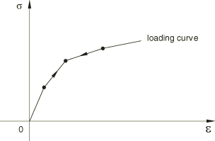

| **Input File Usage: ** | ``` [*LOADING DATA](../key/key-link.md#usb-kws-mloadingdata), TYPE=ELASTIC ``` |
| --- | --- |

##### Defining rate-dependent elasticity

When the elastic response is rate dependent, both the loading and the unloading curves need to be specified. If the unloading data are not specified, the unloading occurs along the loading curve specified with the smallest rate of deformation. 

 Unphysical jumps in the stress due to sudden changes in the rate of deformation are prevented using a technique based on viscoplastic regularization. This technique also helps model relaxation effects in a very simplistic manner, with the relaxation time given as  where , , and  are material parameters and  is the stretch.  is a linear viscosity parameter that controls the relaxation time when . Small values of this parameter should be used; a suggested value is 0.0001s.  is a nonlinear viscosity parameter that controls the relaxation time at higher values of . The smaller this value, the shorter the relaxation time. The suggested value for this parameter is 0.005s.  controls the sensitivity of the relaxation speed to the fabric strain component. [Figure 23.4.1--3](pt05ch23s04abm35.md#cfabric-ratedep) illustrates the loading/unloading behavior as the component is loaded at a rate 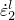 and then unloaded at a rate 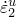.

**Figure 23.4.1–3** Rate-dependent loading/unloading.


The unloading path is determined by interpolating the specified unloading curves. The unloading need not be rate dependent, even though the loading response is rate dependent. When the unloading is rate dependent, the unloading path at any given component strain and strain rate is determined by interpolating the specified unloading curves. 

| **Input File Usage: ** | Use the following options when the unloading is also rate dependent: |
| --- | --- |
|  | ``` [*LOADING DATA](../key/key-link.md#usb-kws-mloadingdata), TYPE=ELASTIC, RATE DEPENDENT, DIRECTION [*UNLOADING DATA](../key/key-link.md#usb-kws-munloadingdata), DEFINITION=INTERPOLATED CURVE, RATE DEPENDENT ``` Use the following options when the unloading is rate independent: ``` [*LOADING DATA](../key/key-link.md#usb-kws-mloadingdata), TYPE=ELASTIC, RATE DEPENDENT, DIRECTION [*UNLOADING DATA](../key/key-link.md#usb-kws-munloadingdata), DEFINITION=INTERPOLATED CURVE ``` |

#### Defining models with damage

The damage models dissipate energy upon unloading, and there is no permanent deformation upon complete unloading. You can specify the onset of damage by defining the strain above which the material response in unloading does not retrace the loading curve.

The unloading behavior controls the amount of energy dissipated by damage mechanisms and can be specified in one of the following ways:
- an analytical unloading curve (exponential/quadratic);
- an unloading curve interpolated from multiple user-specified unloading curves; or
- unloading along a transition unloading curve (constant slope specified by user) to the user-specified unloading curve (combined unloading).

| **Input File Usage: ** | Use the following options to define damage with quadratic unloading behavior: |
| --- | --- |
|  | ``` [*LOADING DATA](../key/key-link.md#usb-kws-mloadingdata), TYPE=DAMAGE, DIRECTION [*UNLOADING DATA](../key/key-link.md#usb-kws-munloadingdata), DEFINITION=QUADRATIC ``` Use the following options to define damage with exponential unloading behavior: ``` [*LOADING DATA](../key/key-link.md#usb-kws-mloadingdata), TYPE=DAMAGE, DIRECTION [*UNLOADING DATA](../key/key-link.md#usb-kws-munloadingdata), DEFINITION=EXPONENTIAL ``` Use the following options to define damage with an interpolated unloading curve: ``` [*LOADING DATA](../key/key-link.md#usb-kws-mloadingdata), TYPE=DAMAGE, DIRECTION [*UNLOADING DATA](../key/key-link.md#usb-kws-munloadingdata), DEFINITION=INTERPOLATED CURVE ``` Use the following options to specify damage with combined unloading behavior: ``` [*LOADING DATA](../key/key-link.md#usb-kws-mloadingdata), TYPE=DAMAGE, DIRECTION [*UNLOADING DATA](../key/key-link.md#usb-kws-munloadingdata), DEFINITION=COMBINED ``` |

##### Defining onset of damage

You can specify the onset of damage by defining the strain above which the material response in unloading does not retrace the loading curve.

| **Input File Usage: ** | ``` [*LOADING DATA](../key/key-link.md#usb-kws-mloadingdata), TYPE=DAMAGE, DAMAGE ONSET=*value* ``` |
| --- | --- |

##### Specifying exponential/quadratic unloading

The damage model in [Figure 23.4.1--4](pt05ch23s04abm35.md#cfabric-damage-expquadunload-nls) is based on an analytical unloading curve that is derived from an energy dissipation factor,  (fraction of energy that is dissipated at any strain level). As the fabric component is loaded, the stress follows the path given by the loading curve. If the fabric component is unloaded (for example, at point *B*), the stress follows the unloading curve . Reloading after unloading follows the unloading curve  until the loading is such that the strain becomes greater than 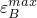 , after which the loading path follows the loading curve. The arrows shown in [Figure 23.4.1--4](pt05ch23s04abm35.md#cfabric-damage-expquadunload-nls) illustrate the loading/unloading paths of this model.

**Figure 23.4.1–4** Exponential/quadratic unloading.

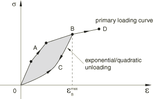

The unloading response follows the loading curve when the calculated unloading curve lies above the loading curve  to prevent energy generation and follows a zero stress response when the unloading curve yields a negative response. In such cases the dissipated energy will be less than the value specified by the energy dissipation factor.

##### Specifying interpolated curve unloading

The damage model in [Figure 23.4.1--5](pt05ch23s04abm35.md#cfabric-damage-interpcurveunload-nls) illustrates an interpolated unloading response based on multiple unloading curves that intersect the primary loading curve at increasing values of stress/strains. You can specify as many unloading curves as are necessary to define the unloading response. Each unloading curve always starts at point *O*, the point of zero stress and zero strains, since the damage models do not allow any permanent deformation. The unloading curves are stored in normalized form so that they intersect the loading curve at a unit stress for a unit strain, and the interpolation occurs between these normalized curves. If unloading occurs from a maximum strain for which an unloading curve is not specified, the unloading is interpolated from neighboring unloading curves. As the fabric component is loaded, the stress follows the path given by the loading curve. If the fabric is unloaded (for example, at point *B*), the stress follows the unloading curve . Reloading after unloading follows the unloading path  until the loading is such that the strain becomes greater than , after which the loading path follows the loading curve. 

**Figure 23.4.1–5**  Interpolated curve unloading.

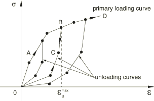

 The unloading curve also has the same temperature and field variable dependencies as the loading curve.

##### Specifying combined unloading

As illustrated in [Figure 23.4.1--6](pt05ch23s04abm35.md#cfabric-damage-combinedunload-nls), you can specify an unloading curve  in addition to the loading curve  as well as a constant transition slope that connects the loading curve to the unloading curve. As the fabric is loaded, the stress follows the path given by the loading curve. If the fabric is unloaded (for example at point *B*) the stress follows the unloading curve . The path  is defined by the constant transition slope, and  lies on the specified unloading curve. Reloading after unloading follows the unloading path  until the loading is such that the strain becomes greater than , after which the loading path follows the loading curve. 

**Figure 23.4.1–6** Combined unloading.

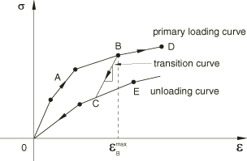

 The unloading curve also has the same temperature and field variable dependencies as the loading curve.

#### Defining models with permanent deformation

These models dissipate energy upon unloading and exhibit permanent deformation upon complete unloading. You can specify the onset of permanent deformation by defining the strain below which unloading occurs along the loading curve. 

 The unloading behavior controls the amount of energy dissipated as well as the amount of permanent deformation. The unloading behavior can be specified in one of the following ways:
- an analytical unloading curve (exponential/quadratic);
- an unloading curve interpolated from multiple user-specified unloading curves; or
- an unloading curve obtained by shifting the user-specified unloading curve to the point of unloading.

| **Input File Usage: ** | Use the following options to define permanent deformation with quadratic unloading behavior: |
| --- | --- |
|  | ``` [*LOADING DATA](../key/key-link.md#usb-kws-mloadingdata), TYPE=PERMANENT DEFORMATION, DIRECTION [*UNLOADING DATA](../key/key-link.md#usb-kws-munloadingdata), DEFINITION=QUADRATIC ``` Use the following options to define permanent damage with exponential unloading behavior: ``` [*LOADING DATA](../key/key-link.md#usb-kws-mloadingdata), TYPE=PERMANENT DEFORMATION, DIRECTION [*UNLOADING DATA](../key/key-link.md#usb-kws-munloadingdata), DEFINITION=EXPONENTIAL ``` Use the following options to define permanent damage with an interpolated unloading curve: ``` [*LOADING DATA](../key/key-link.md#usb-kws-mloadingdata), TYPE=PERMANENT DEFORMATION, DIRECTION [*UNLOADING DATA](../key/key-link.md#usb-kws-munloadingdata), DEFINITION=INTERPOLATED CURVE ``` Use the following options to specify permanent damage with a shifted unloading curve: ``` [*LOADING DATA](../key/key-link.md#usb-kws-mloadingdata), TYPE=PERMANENT DEFORMATION, DIRECTION [*UNLOADING DATA](../key/key-link.md#usb-kws-munloadingdata), DEFINITION=SHIFTED CURVE ``` |

##### Defining the onset of permanent deformation

By default, the onset of yield will be obtained as soon as the slope of the loading curve decreases by 10% from the maximum slope recorded up to that point while traversing along the loading curve. To override the default method of determining the onset of yield, you can specify either a value for the decrease in slope of the loading curve other than the default value of 10% (slope drop = 0.1) or by defining the strain below which unloading occurs along the loading curve. If a slope drop is specified, the onset of yield will be obtained as soon as the slope of the loading curve decreases by the specified factor from the maximum slope recorded up to that point.

| **Input File Usage: ** | Use the following options to specify the onset of yield by defining the strain below which unloading occurs along the loading curve: |
| --- | --- |
|  | ``` [*LOADING DATA](../key/key-link.md#usb-kws-mloadingdata), TYPE=PERMANENT DEFORMATION, YIELD ONSET=*value* ``` Use the following options to specify the onset of yield by defining a slope drop for the loading curve: ``` [*LOADING DATA](../key/key-link.md#usb-kws-mloadingdata), TYPE=PERMANENT DEFORMATION, SLOPE DROP=*value* ``` |

##### Specifying exponential/quadratic unloading

The model in [Figure 23.4.1--7](pt05ch23s04abm35.md#cfabric-plastic-expquadunload-nls) illustrates an analytical unloading curve that is derived from an energy dissipation factor,  (fraction of energy that is dissipated at any strain level), and a permanent deformation factor, . As the fabric component is loaded, the fabric stress follows the path given by the loading curve. If the component is unloaded (for example, at point *B*), the stress follows the unloading curve . The point *D* corresponds to the permanent deformation, 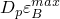. Reloading after unloading follows the unloading curve  until the loading is such that the strain becomes greater than , after which the loading path follows the loading curve. The arrows shown in [Figure 23.4.1--7](pt05ch23s04abm35.md#cfabric-plastic-expquadunload-nls) illustrate the loading/unloading paths of this model.

**Figure 23.4.1–7** Exponential/quadratic unloading.

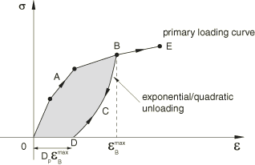

The unloading response follows the loading curve when the calculated unloading curve lies above the loading curve to prevent energy generation and follows a zero stress response when the unloading curve yields a negative response. In such cases the dissipated energy will be less than the value specified by the energy dissipation factor.

##### Specifying interpolated curve unloading

The model in [Figure 23.4.1--8](pt05ch23s04abm35.md#cfabric-plastic-interpcurveunload-nls) illustrates an interpolated unloading response based on multiple unloading curves that intersect the primary loading curve at increasing values of stresses/strains.  

**Figure 23.4.1–8** Interpolated curve unloading.

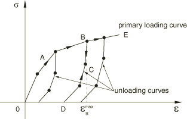

You can specify as many unloading curves as are necessary to define the unloading response.  The first point of each unloading curve defines the permanent deformation if the fabric component is completely unloaded. The unloading curves are stored in normalized form so that they intersect the loading curve at a unit stress for a unit strain, and the interpolation occurs between these normalized curves. If unloading occurs from a maximum strain for which an unloading curve is not specified, the unloading is interpolated from neighboring unloading curves. As the fabric is loaded, the stress follows the path given by the loading curve. If the fabric is unloaded (for example, at point *B*), the stress follows the unloading curve . Reloading after unloading follows the unloading path  until the loading is such that the strain becomes greater than , after which the loading path follows the loading curve. 

 The unloading curve also has the same temperature and field variable dependencies as the loading curve.

##### Specifying shifted curve unloading

You can specify an unloading curve passing through the origin in addition to the loading curve. The actual unloading curve is obtained by horizontally shifting the user-specified unloading curve to pass through the point of unloading as shown in [Figure 23.4.1--9](pt05ch23s04abm35.md#cfabric-plastic-shiftcurveunload-nls). The permanent deformation upon complete unloading is the horizontal shift applied to the unloading curve.

**Figure 23.4.1–9** Shifted curve unloading.

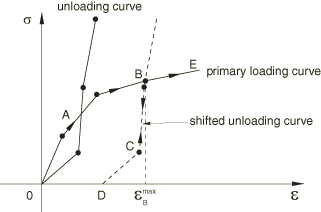

 The unloading curve also has the same temperature and field variable dependencies as the loading curve.

#### Using different uniaxial models in tension and compression

When appropriate, different uniaxial behavior models can be used in tension and compression. For example, response under tension can be plastic with exponential unloading, while the response in compression can be nonlinear elastic (see [Figure 23.4.1--10](pt05ch23s04abm35.md#cfabric-mixed-tenscomp-nls)).

**Figure 23.4.1–10**  Different uniaxial models in tension and compression.

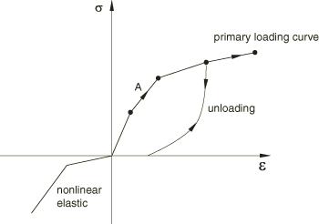

### User-defined fabric materials

The mechanical response of a fabric material depends on a number of micro and meso-scale parameters covering the fabric construction and that of the individual yarns as a bundle of fibers. Often a multi-scale model becomes necessary to track the state of the fabric and its response to loading. Abaqus provides a specialized user subroutine, [`VFABRIC`](../sub/sub-link.md#sub-xsl-vfabric), to capture the complex fabric response given the deformed yarn directions and the strains along these directions.

The density (["Density," Section 21.2.1](pt05ch21s02abm01.md)) is required when using a fabric material.

| **Input File Usage: ** | Use the following options to define a fabric material through user subroutine [`VFABRIC`](../sub/sub-link.md#sub-xsl-vfabric): |
| --- | --- |
|  | ``` [*MATERIAL](../key/key-link.md#usb-kws-mmaterial), NAME=*name* [*FABRIC](../key/key-link.md#usb-kws-mfabric), USER [*DENSITY](../key/key-link.md#usb-kws-mdensity) ``` |

#### Properties for a user-defined fabric material

Any material constants that are needed in user subroutine [`VFABRIC`](../sub/sub-link.md#sub-xsl-vfabric) must be specified as part of a user-defined fabric material definition. Abaqus can be used to compute the isotropic thermal expansion response under thermal loading, even as the remaining mechanical response is defined by the user subroutine. Alternatively, you can include the thermal expansion within the definition of the mechanical response in user subroutine [`VFABRIC`](../sub/sub-link.md#sub-xsl-vfabric).

| **Input File Usage: ** | Use the following option to define properties for a user-defined fabric material behavior: |
| --- | --- |
|  | ``` [*FABRIC](../key/key-link.md#usb-kws-mfabric), USER, PROPERTIES=*number_of_constants* ``` |

#### Material state

Many mechanical constitutive models require the storage of solution-dependent state variables (plastic strains, “back stress,” saturation values, etc. in rate constitutive forms or historical data for theories written in integral form). You should allocate storage for these variables in the associated material definition (see ["Allocating space" in "User subroutines: overview," Section 18.1.1](pt04ch18s01aus104.md#usb-anl-usubrout-allocatespace)). There is no restriction on the number of state variables associated with a user-defined fabric material.

 State variables associated with [`VFABRIC`](../sub/sub-link.md#sub-xsl-vfabric) can be output to the output database (`.odb`) file and results (`.fil`) file using output identifiers SDV and SDV*n* (see ["Abaqus/Explicit output variable identifiers," Section 4.2.2](pt02ch04s02xbv01.md)).

User subroutine [`VFABRIC`](../sub/sub-link.md#sub-xsl-vfabric) is called for blocks of material points at each increment. When the subroutine is called, it is provided with the state at the start of the increment (fabric stress in the local system, solution-dependent state variables). It is also provided with the nominal fabric strains at the end of the increment and the incremental nominal fabric strains over the increment, both in the local system. The [`VFABRIC`](../sub/sub-link.md#sub-xsl-vfabric) user material interface passes a block of material points to the subroutine on each call, which allows vectorization of the material subroutine.

The temperature is provided to user subroutine [`VFABRIC`](../sub/sub-link.md#sub-xsl-vfabric) at the start and the end of the increment. The temperature is passed in as information only and cannot be modified, even in a fully coupled thermal-stress analysis. However, if the inelastic heat fraction is defined in conjunction with the specific heat and conductivity in a fully coupled thermal-stress analysis, the heat flux due to inelastic energy dissipation is calculated automatically. If user subroutine [`VFABRIC`](../sub/sub-link.md#sub-xsl-vfabric) is used to define an adiabatic material behavior (conversion of plastic work to heat) in an explicit dynamic procedure, the temperatures must be stored and integrated as user-defined state variables. Most often the temperatures are provided by specifying initial conditions (["Initial conditions in Abaqus/Standard and Abaqus/Explicit," Section 34.2.1](pt07ch34s02aus116.md)) and are constant throughout the analysis.

##### Deleting elements from an Abaqus/Explicit mesh using state variables

Element deletion in a mesh can be controlled during the course of an Abaqus/Explicit analysis through user subroutine [`VFABRIC`](../sub/sub-link.md#sub-xsl-vfabric). Deleted elements have no ability to carry stresses and, therefore, have no contribution to the stiffness of the model. You specify the state variable number controlling the element deletion flag. For example, specifying a state variable number of 4 indicates that the fourth state variable is the deletion flag in [`VFABRIC`](../sub/sub-link.md#sub-xsl-vfabric). The deletion state variable should be set to a value of one or zero in [`VFABRIC`](../sub/sub-link.md#sub-xsl-vfabric). A value of one indicates that the material point is active, while a value of zero indicates that Abaqus/Explicit should delete the material point from the model by setting the stresses to zero. The structure of the block of material points passed to user subroutine [`VFABRIC`](../sub/sub-link.md#sub-xsl-vfabric) remains unchanged during the analysis; deleted material points are not removed from the block. Abaqus/Explicit will pass zero stresses and strain increments for all deleted material points. Once a material point has been flagged as deleted, it cannot be reactivated. An element will be deleted from the mesh only after all of the material points in the element are deleted. The status of an element can be determined by requesting output of the variable STATUS. This variable is equal to 1 if the element is active and equal to 0 if the element is deleted.

| **Input File Usage: ** | ``` [*DEPVAR](../key/key-link.md#usb-kws-mdepvar), DELETE=*variable number* ``` |
| --- | --- |

### Thermal expansion

You can define isotropic thermal expansion to specify the same coefficient of thermal expansion for the membrane and thickness-direction behaviors. 

The membrane thermal strains, , are obtained as explained in ["Thermal expansion," Section 26.1.2](pt05ch26s01abm52.md).

The elastic stretch in a given direction, 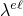, relates the total stretch, , and the thermal stretch, 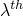: 

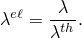

 is given by 

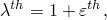

where  is the linear thermal expansion strain in that direction. 

### Fabric thickness

The thickness of a fabric is difficult to measure experimentally. Fortunately, an accurate value for thickness is not always required due to the fact that a nominal stress measure, defined as force per unit area in the reference configuration, is used to characterize the in-plane response. An initial thickness can be specified on the section definition. Accurate tracking of the thickness with deformation is necessary only if the material is used with shell elements and the bending response needs to be captured accurately. You can compute the thickness direction strain increment when the fabric is defined through user subroutine [`VFABRIC`](../sub/sub-link.md#sub-xsl-vfabric). For test data–based fabric materials the thickness is assumed to remain constant with deformation. For a test data–based fabric definition, you must use the thickness value specified on the section definition for converting the experimental load data (which are typically available as force applied per unit width of the fabric) to stress quantities. 

### Defining a reference mesh (initial metric)

Abaqus/Explicit allows the specification of a reference mesh (initial metric) for fabrics modeled with membrane elements. For example, this is useful in airbag simulations to model wrinkles and changes in yarn orientations that arise from the airbag folding process. A flat mesh may be suitable for the unstressed reference configuration, but the initial state may require a corresponding folded mesh defining the folded state. The angular orientation of the yarn in the reference configuration is updated to obtain the new orientation in the initial configuration. 

| **Input File Usage: ** | Use the following option to define the reference configuration giving the element number and its nodal coordinates in the reference configuration: |
| --- | --- |
|  | ``` [*INITIAL CONDITIONS](../key/key-link.md#usb-kws-minitialcond), TYPE=REF COORDINATE ``` Use the following option to define the reference configuration giving the node number and its coordinates in the reference configuration: ``` [*INITIAL CONDITIONS](../key/key-link.md#usb-kws-minitialcond), TYPE=NODE REF COORDINATE ``` |

#### Yarn behavior under initial compressive strains

Defining a reference configuration that is different from the initial configuration generally results in nonzero stresses and strains in the initial configuration based on the material definition. By default, compressive initial strains in the yarn directions generate zero stresses. The stress remains zero as the strain is continuously recovered from the initial compressive values toward the strain-free state. Once the initial slack is recovered, any subsequent compressive/tensile strains generate stresses as per the material definition.

| **Input File Usage: ** | Use the following option to specify that initial compressive strains are recovered stress free (default): |
| --- | --- |
|  | ``` [*FABRIC](../key/key-link.md#usb-kws-mfabric), STRESS FREE INITIAL SLACK=YES ``` Use the following option to specify that initial compressive strains generate nonzero initial stresses: ``` [*FABRIC](../key/key-link.md#usb-kws-mfabric), STRESS FREE INITIAL SLACK=NO ``` |

### Defining yarn directions in the reference configuration

 In general, the yarn directions may not be orthogonal to each other in the reference configuration. You can specify these local directions with respect to the in-plane axes of an orthogonal orientation system at a material point. Both the local directions and the orthogonal system are defined together as a single orientation definition. See ["Orientations," Section 2.2.5](pt01ch02s02aus15.md), for more information.

If the local directions are not specified, these directions are assumed to match the in-plane axes of the orthogonal system defined. The local direction may not remain orthogonal with deformation. Abaqus updates the local directions with deformation and computes the nominal strains along these directions and the angle between them (fabric shear strain). The constitutive behavior for the fabric defines the nominal stresses in the local system in terms of the fabric strain.

Local yarn directions can be output to the output database as described in ["Output](pt05ch23s04abm35.md#usb-mat-cfabric-output),” below.

### Picture-frame shear fabric test

 The shear response of the fabric is typically studied using a picture-frame shear test. The reference and the deformed configuration for a picture-frame shear test under force  is illustrated in [Figure 23.4.1--11](pt05ch23s04abm35.md#cfabric-pictureframe-nls), where 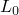 is the size of the picture-frame, and 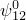 is the initial angle between the yarn directions. The four sides of the specimen are constrained not to change in their length even as the frame elongates and the angle between the yarn directions 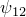 decreases with deformation.

**Figure 23.4.1–11** Picture-frame shear test on a fabric.

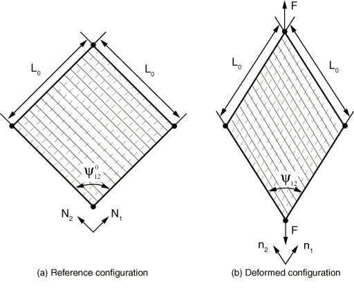

The relationship between the nominal shear stress, 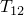, and the applied force, , is 

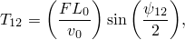

 where  is the initial volume of the specimen. The fabric engineering shear strain, , is related to the change in the angle between the yarn directions as 

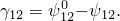

### Material options

The fabric material model can be used by itself, or it can be combined with isotropic thermal expansion to introduce thermal volume changes (["Thermal expansion," Section 26.1.2](pt05ch26s01abm52.md)). See ["Combining material behaviors," Section 21.1.3](pt05ch21s01aus110.md), for more details. Thermal expansion can alternatively be an integral part of the constitutive model implemented in [`VFABRIC`](../sub/sub-link.md#sub-xsl-vfabric) for user-defined fabric materials.

For a test-data based fabric material, both the mass proportional and the stiffness proportional damping can be specified (see ["Material damping," Section 26.1.1](pt05ch26s01abm51.md)). If stiffness proportional damping is specified, Abaqus calculates the damping stress based on the current elastic stiffness of the material and the resulting damping stress is included in the reported stress output at the integration points. 

For a fabric material defined by user subroutine [`VFABRIC`](../sub/sub-link.md#sub-xsl-vfabric), mass proportional damping can be specified, but stiffness proportional damping must be defined within the user subroutine. 

### Elements

The fabric material model can be used with plane stress elements (plane stress solid elements, finite-strain shells, and membranes). It is recommended that the fabric material model be used with fully integrated or triangular membrane elements. When the fabric material model is used with shell elements, Abaqus does not compute a default transverse shear stiffness and you must specify it directly (see["Defining the transverse shear stiffness" in "Using a shell section integrated during the analysis to define the section behavior," Section 29.6.5](pt06ch29s06alm19.md#usb-elm-eusingshellsection-transverse)). 

### Procedures

Fabric materials must always be used with geometrically nonlinear analyses (["General and linear perturbation procedures," Section 6.1.3](pt03ch06s01aus44.md)).

### Output

In addition to the standard output identifiers available in Abaqus (["Abaqus/Explicit output variable identifiers," Section 4.2.2](pt02ch04s02xbv01.md)), the following variables have special meaning for the fabric material models:

| EFABRIC | Nominal fabric strain with components similar to that of LE, but with the direct components measuring the nominal strain along the yarn directions and the engineering shear component measuring the change in angle between the two yarn directions. |
| --- | --- |

| SFABRIC | Nominal fabric stress with components similar to that of the regular Cauchy stress, S, but with the direct components measuring the nominal stress along the yarn directions and the shear component measuring response to the change in angle between the two yarn directions. |
| --- | --- |

By default Abaqus outputs local material directions whenever element field output is requested to the output database for fabric models. The local directions are output as field variables (LOCALDIR1, LOCALDIR2, LOCALDIR3) representing the yarn direction cosines; these variables can be visualized as vector plots in the Visualization module of Abaqus/CAE (Abaqus/Viewer).

Output of local material directions is suppressed if no element field output is requested or if you specify not to have element material directions written to the output database (see ["Specifying the directions for element output in Abaqus/Standard and Abaqus/Explicit" in "Output to the output database," Section 4.1.3](pt02ch04s01aus40.md#usb-out-odboutput-element-directions)).


